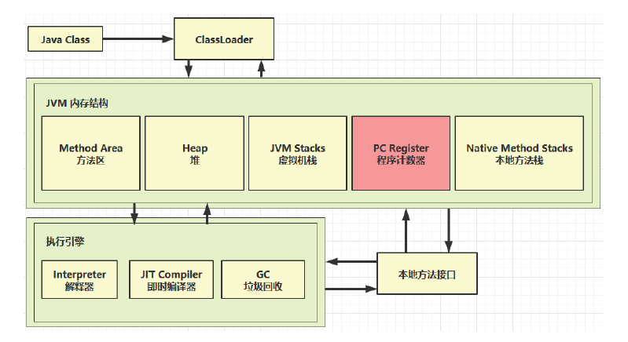
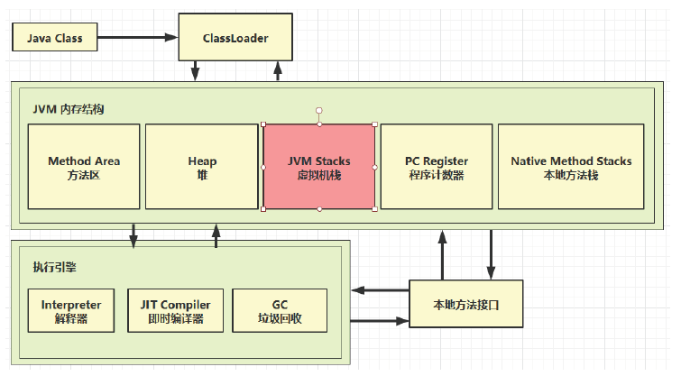
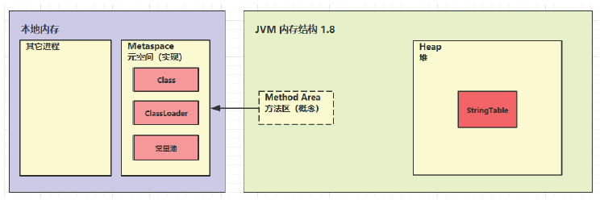
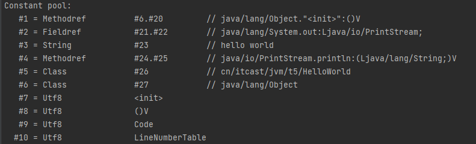
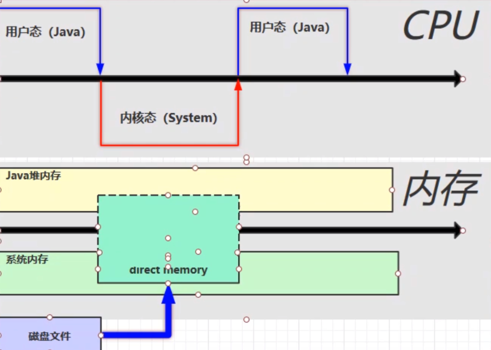

# 内存结构

1. 程序计数器

2. 虚拟机栈

3. 本地方法栈

4. 堆

5. 方法区





## 1. 程序计数器


### 1.1 定义

Program Counter Register 程序计数器（寄存器）


### 1.2 作用

是记住下一条jvm指令的执行地址


### 1.3 特点

- 是线程私有的
  - CPU会为每个线程分配时间片，每当当前线程的时间片使用完以后，CPU就会去执行另一个线程中的代码
  - 程序计数器是**每个线程所私有的**，当另一个线程的时间片用完，又返回来执行当前线程的代码时，通过程序计数器可以知道应该执行哪一句指令
- 不会存在内存溢出


## 2. 虚拟机栈



### 2.1 定义

Java Virtual Machine Stacks （Java 虚拟机栈）

```
0 : getstatic #20 // PrintStream out = System.out;
3 : astore_1 // --
4 : aload_1 // out.println(1);
5 : iconst_1 // --
6 : invokevirtual #26 // --
9 : aload_1 // out.println(2);
10 : iconst_2 // --
11 : invokevirtual #26 // --
14 : aload_1 // out.println(3);
15 : iconst_3 // --
16 : invokevirtual #26 // --
19 : aload_1 // out.println(4);
20 : iconst_4 // --
21 : invokevirtual #26 // --
24 : aload_1 // out.println(5);
25 : iconst_5 // --
26 : invokevirtual #26 // --
29 : return
```

#### 每个线程运行时所需要的内存，称为虚拟机栈

- 每个栈由多个栈帧（Frame）组成，对应着每次方法调用时所占用的内存
- 每个线程只能有一个活动栈帧，对应着当前正在执行的那个方法

#### 问题辨析

#### 1. 垃圾回收是否涉及栈内存？

- 不需要。因为虚拟机栈中是由一个个栈帧组成的，在方法执行完毕后，对应的栈帧就会被弹出栈。所以无需通过垃圾回收机制去回收内存。

#### 2. 栈内存分配越大越好吗？

- 不是。因为物理内存是固定的，栈内存越大，可以支持更多的递归调用，但是可执行的线程数就会越少。

#### 3. 方法内的局部变量是否线程安全？

- 如果方法内局部变量没有逃离方法的作用访问，它是线程安全的
	
- 如果是局部变量引用了对象，并逃离方法的作用范围，需要考虑线程安全


### 2.2 栈内存溢出

原因：

1. 栈帧过多导致栈内存溢出
2. 栈帧过大导致栈内存溢出

```java
java.lang.StackOverflowError
```

解决方法：

- 栈帧过多导致栈内存溢出：避免无限递归，或无限嵌套
- 栈帧过大导致栈内存溢出：设置栈内存大小，在运行设置`VM options`中加入`-Xss256k`


### 2.3 线程运行诊断


案例 1 ： `cpu` 占用过多

*定位方法*：

1. 用`top`定位哪个进程对`cpu`的占用过高
2. `ps H -eo pid,tid,%cpu | grep 进程id`  （用`ps`命令进一步定位是哪个线程引起的`cpu`占用过高）
3. `jstack 进程id`
   - 可以根据线程id 找到有问题的线程，进一步定位到问题代码的源码行号


案例 2 ：程序运行很长时间没有结果

*定位方法*：同上


## 3. 本地方法栈


一些带有**native关键字**的方法就是需要JAVA去调用本地的C或者C++方法，因为JAVA有时候没法直接和操作系统底层交互，所以需要用到本地方法。


## 4. 堆


### 4.1 定义

Heap 堆

- 通过 new 关键字，创建对象都会使用堆内存

特点

- 它是线程共享的，堆中对象都需要考虑线程安全的问题
- 有垃圾回收机制


### 4.2 堆内存溢出

```java
java.lang.OutOfMemoryError: Java heap space
```

- 解决方法：设置堆内存大小，在运行设置`VM options`中加入`-Xmx8m`


### 4.3 堆内存诊断

1. `jps` 工具
    查看当前系统中有哪些 java 进程

2. jmap 工具
    查看堆内存占用情况 `jmap - heap pid(进程id)`。若不行，用： `jhsdb jmap --heap --pid pid`

3. `jconsole`工具
    图形界面的，多功能的监测工具，可以连续监测

4. `jvisualvm`工具

  图形界面

  

案例

- 垃圾回收后，内存占用仍然很高

  使用堆转储 dump 抓取堆内存快照 分析堆内存使用最大的那些对象，对照代码就可以排查出问题


## 5. 方法区


### 5.1 定义

**[JVM规范-方法区定义](https://docs.oracle.com/javase/specs/jvms/se8/html/jvms-2.html)**

方法区为所有线程共享，存储了类的结构相关的信息，比如成员变量，方法数据，成员方法，构造器，运行时常量池等。

方法区在虚拟机启动时被创建，在逻辑上是堆区的组成一部分。

方法区是一种规范，而永久代（jdk1.7及以前）或者元空间（jdk1.8及以后）都是方法区的一种实现。


### 5.2 组成





### 5.3 方法区内存溢出


1.8 以前会导致永久代内存溢出

```
* 演示永久代内存溢出 java.lang.OutOfMemoryError: PermGen space
* -XX:MaxPermSize=8m
```
1.8 之后会导致元空间内存溢出

```
* 演示元空间内存溢出 java.lang.OutOfMemoryError: Metaspace
* -XX:MaxMetaspaceSize=8m
```
**场景**

- spring
- mybatis


### 5.4 运行时常量池

- 常量池，就是一张表，虚拟机指令根据这张常量表找到要执行的类名、方法名、参数类型、字面量等信息
- 运行时常量池，常量池是 *.class 文件中的，当该类被加载，它的常量池信息就会放入运行时常量
  池，并把里面的符号地址变为真实地址

注：`javap -v .\HelloWorld.class`进行反编译可查看




### 5.5 StringTable

先看几道面试题：

```java
String s1 = "a";
String s2 = "b";
String s3 = "a" + "b";//编译期的优化，即s3="ab"，把s3放s5后面也是同样的
String s4 = s1 + s2;
String s5 = "ab";
String s6 = s4.intern();

// 问
System.out.println(s3 == s4);//false,s3在常量池中存在，将常量池变为对象，即s3是常量池(串池)里的对象，而s4是堆里的对象
System.out.println(s3 == s5);//true,编译期的优化，自动将s3计算出来，即s3="ab"，此时s3未创建对象时常量池便有了[a,b,ab]，便将ab变为对象，而s5中ab在常量池中存在，直接使用该对象(避免重复创建对象)
System.out.println(s3 == s6);//true,常量池中存在ab了，则直接返回常量池中的ab对象

String x2 = new String("c") + new String("d"); 
String x1 = "cd";
x2.intern();

// 问，如果调换了【最后两行代码】的位置呢，如果是jdk1.6呢 
System.out.println(x1 == x2);//false

// 答，如果调换了【最后两行代码】的位置
String x2 = new String("c") + new String("d"); 
x2.intern();
String x1 = "cd";
System.out.println(x1 == x2);//true，如果是jdk1.6则为false
```


#### StringTable 特性

- 常量池中的字符串仅是符号，第一次用到时才变为对象（在常量池中变为对象，非堆里的对象）

- 利用串池的机制，来避免重复创建字符串对象

- 字符串变量拼接的原理（+操作）是 StringBuilder （1.8）

- 字符串常量拼接的原理是编译期优化

- 可以使用 intern 方法，主动将串池中还没有的字符串对象放入串池

  - 1.8 将这个字符串对象尝试放入串池，如果有则并不会放入，如果没有则放入串池， 会把串池中的对象返回(即将堆中的常量放入不存在该常量的常量池，堆中的该常量将与常量池的一样，地址一样)

    ```java
            String s = new String("a") + new String("b");
    
            // 堆  new String("a")   new String("b")  new String("ab")
            String s2 = s.intern(); // 将这个字符串对象尝试放入串池，如果有则并不会放入，如果没有则放入串池， 会把串池中的对象返回
    
            String x = "ab";
            System.out.println(s2 == x);//ture
            System.out.println(s == x);//true
    ```

    

  - 1.6 将这个字符串对象尝试放入串池，如果有则并不会放入，如果没有会把此对象复制一份，放入串池， 会把串池中的对象返回

    ```java
            String s = new String("a") + new String("b");
    
            // 堆  new String("a")   new String("b")  new String("ab")
            String s2 = s.intern(); // 将这个字符串对象尝试放入串池，如果有则并不会放入，如果没有则放入串池，会把此对象复制一份到串池并把对象返回
    
            String x = "ab";
            System.out.println(s2 == x);//true
            System.out.println(s == x);//false
    ```

    


#### StringTable 位置

1.6跟1.8StringTable所在位置有所不同，报错也不同：

- 1.6：永久代常量池中
- 1.8：堆中


#### StringTable 垃圾回收

StringTable在内存紧张时，会发生垃圾回收；

```java
//演示 StringTable 垃圾回收
VM: -XX:MaxPermSize=10m -XX:+PrintStringTableStatistics -XX:+PrintGCDetails -verbose:gc
```


#### StringTable 性能调优

StringTable底层数据结构是**HashTable**(数组+链表)

- 调整 -XX:StringTableSize=桶个数

- 考虑将字符串对象是否入池（经常用的字符串重复new到堆里，使得同时存在多个相同的字符串，会占用过多内存，特别是数量多的时候）


## 6. 直接内存

### 6.1 定义

#### Direct Memory

- 常见于 NIO（非阻塞式IO）操作时，用于数据缓冲区
- 分配回收成本较高，但读写性能高
- 不受 JVM 内存回收管理


java本身没有磁盘读写的能力，必须调用操作系统提供的磁盘读写的方法。

#### 普通文件读写流程：

磁盘文件得复制两份，直到Java堆内存中才能被java访问到，因此读写效率较低。


#### 使用DirectBuffer：

直接内存是操作系统和Java代码**都可以访问的一块区域**，无需将代码从系统内存复制到Java堆内存，从而提高了效率。




### 6.2 分配和回收原理

- 使用了 Unsafe 对象完成直接内存的分配回收，并且回收需要主动调用 freeMemory 方法（直接调用System.gc()进行显式的垃圾回收(Full GC)比较影响性能，可使用Unsafe进行直接主动内存回收）
- ByteBuffer 的实现类内部，使用了 Cleaner （虚引用）来监测 ByteBuffer 对象，一旦ByteBuffer 对象被垃圾回收，那么就会由 ReferenceHandler 线程通过 Cleaner 的 clean 方法调用 freeMemory 来释放直接内存
