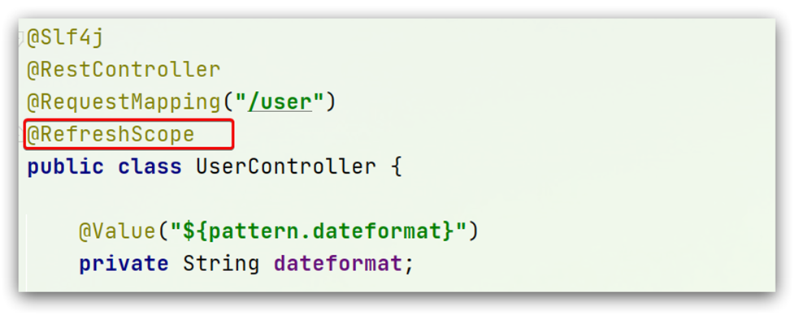

## 概览

欢迎来到 Nacos 的世界！

Nacos 致力于帮助您发现、配置和管理微服务。Nacos 提供了一组简单易用的特性集，帮助您快速实现动态服务发现、服务配置、服务元数据及流量管理。

Nacos 帮助您更敏捷和容易地构建、交付和管理微服务平台。 Nacos 是构建以“服务”为中心的现代应用架构 (例如微服务范式、云原生范式) 的服务基础设施。

## 什么是 Nacos？

**关键：服务发现、配置管理**

服务（Service）是 Nacos 世界的一等公民。Nacos 支持几乎所有主流类型的“服务”的发现、配置和管理：

[Kubernetes Service](https://kubernetes.io/docs/concepts/services-networking/service/)

[gRPC](https://grpc.io/docs/guides/concepts.html#service-definition) & [Dubbo RPC Service](https://dubbo.incubator.apache.org/)

[Spring Cloud RESTful Service](https://spring.io/understanding/REST)

Nacos 的关键特性包括:
- **服务发现和服务健康监测**
- **动态配置服务**
- **动态 DNS 服务**
- **服务及其元数据管理**

## Nacos 地图


## Nacos 生态图


如 Nacos 全景图所示，Nacos 无缝支持一些主流的开源生态，例如

-   [Spring Cloud](https://nacos.io/en-us/docs/quick-start-spring-cloud.html)
-   [Apache Dubbo and Dubbo Mesh](https://nacos.io/zh-cn/docs/use-nacos-with-dubbo.html)
-   [Kubernetes and CNCF](https://nacos.io/zh-cn/docs/use-nacos-with-kubernetes.html)。

使用 Nacos 简化服务发现、配置管理、服务治理及管理的解决方案，让微服务的发现、管理、共享、组合更加容易。


# Nacos注册中心

国内公司一般都推崇阿里巴巴的技术，比如注册中心，SpringCloudAlibaba也推出了一个名为Nacos的注册中心。

## 1.1.认识和安装Nacos

[Nacos](https://nacos.io/)是阿里巴巴的产品，现在是[SpringCloud](https://spring.io/projects/spring-cloud)中的一个组件。相比[Eureka](https://github.com/Netflix/eureka)功能更加丰富，在国内受欢迎程度较高。


安装方式可以参考资料[Nacos安装指南](../安装/Nacos安装指南.md)


下面以小项目cloud-demo为例：


## 1.2.服务注册到nacos

Nacos是SpringCloudAlibaba的组件，而SpringCloudAlibaba也遵循SpringCloud中定义的服务注册、服务发现规范。因此使用Nacos和使用Eureka对于微服务来说，并没有太大区别。

主要差异在于：

- 依赖不同
- 服务地址不同


### 1）引入依赖

在父工程的pom文件中的`<dependencyManagement>`中引入SpringCloudAlibaba的依赖：

```xml
<dependency>
    <groupId>com.alibaba.cloud</groupId>
    <artifactId>spring-cloud-alibaba-dependencies</artifactId>
    <version>2.2.6.RELEASE</version>
    <type>pom</type>
    <scope>import</scope>
</dependency>
```

然后在子工程如user-service和order-service中的pom文件中引入nacos-discovery依赖：

```xml
<dependency>
    <groupId>com.alibaba.cloud</groupId>
    <artifactId>spring-cloud-starter-alibaba-nacos-discovery</artifactId>
</dependency>
```


> **注意**：不要忘了注释掉eureka的依赖。


### 2）配置nacos地址

在user-service和order-service的application.yml中添加nacos地址：

```yaml
spring:
  cloud:
    nacos:
      server-addr: localhost:8848
```


> **注意**：不要忘了注释掉eureka的地址


### 3）重启

重启微服务后，登录nacos管理页面(参照Nacos安装后的访问连接)，可以看到微服务信息：


## 1.3.服务分级存储模型

一个**服务**可以有多个**实例**，例如我们的user-service，可以有:

- 127.0.0.1:8081
- 127.0.0.1:8082
- 127.0.0.1:8083

假如这些实例分布于全国各地的不同机房，例如：

- 127.0.0.1:8081，在上海机房
- 127.0.0.1:8082，在上海机房
- 127.0.0.1:8083，在杭州机房

Nacos就将同一机房内的实例 划分为一个**集群**。

也就是说，user-service是服务，一个服务可以包含多个集群，如杭州、上海，每个集群下可以有多个实例，形成分级模型，如图：


微服务互相访问时，应该尽可能访问同集群实例，因为本地访问速度更快。当本集群内不可用时，才访问其它集群。例如：


杭州机房内的order-service应该优先访问同机房的user-service。


### 1.3.1.给user-service配置集群


修改user-service的application.yml文件，添加集群配置：

```yaml
spring:
  cloud:
    nacos:
      server-addr: localhost:8848
      discovery:
        cluster-name: HZ # 集群名称
```

重启两个user-service实例后，我们可以在nacos控制台看到下面结果：


我们再次复制一个user-service启动配置，添加属性：

```sh
-Dserver.port=8083 -Dspring.cloud.nacos.discovery.cluster-name=SH
```

配置如图所示：


启动UserApplication3后再次查看nacos控制台：


### 1.3.2.同集群优先的负载均衡

默认的`ZoneAvoidanceRule`并不能实现根据同集群优先来实现负载均衡。

因此Nacos中提供了一个`NacosRule`的实现，可以优先从同集群中挑选实例。

1）给order-service配置集群信息

修改order-service的application.yml文件，添加集群配置：

```sh
spring:
  cloud:
    nacos:
      server-addr: localhost:8848
      discovery:
        cluster-name: HZ # 集群名称
```


2）修改负载均衡规则

修改order-service的application.yml文件，修改负载均衡规则：

```yaml
userservice:
  ribbon:
    NFLoadBalancerRuleClassName: com.alibaba.cloud.nacos.ribbon.NacosRule # 负载均衡规则 
```

选择访问同一个集群的服务，再随机策略。集群服务宕机后选择其他集群。


## 1.4.权重配置

实际部署中会出现这样的场景：

服务器设备性能有差异，部分实例所在机器性能较好，另一些较差，我们希望性能好的机器承担更多的用户请求。

但默认情况下NacosRule是同集群内随机挑选，不会考虑机器的性能问题。


因此，Nacos提供了权重配置来控制访问频率，权重越大则访问频率越高。


在nacos控制台，找到user-service的实例列表，点击编辑，即可修改权重：


在弹出的编辑窗口，修改权重：


> **注意**：如果权重修改为0，则该实例永远不会被访问


## 1.5.环境隔离

Nacos提供了namespace来实现环境隔离功能。

- nacos中可以有多个namespace
- namespace下可以有group、service等
- 不同namespace之间相互隔离，例如不同namespace的服务互相不可见


### 1.5.1.创建namespace

默认情况下，所有service、data、group都在同一个namespace，名为public：


我们可以点击页面新增按钮，添加一个namespace：


然后，填写表单：


就能在页面看到一个新的namespace：


### 1.5.2.给微服务配置namespace

给微服务配置namespace只能通过修改配置来实现。

例如，修改order-service的application.yml文件：

```yaml
spring:
  cloud:
    nacos:
      server-addr: localhost:8848
      discovery:
        cluster-name: HZ
        namespace: 492a7d5d-237b-46a1-a99a-fa8e98e4b0f9 # 命名空间，填ID
```


重启order-service后，访问控制台，可以看到下面的结果：


此时访问order-service，因为namespace不同，会导致找不到userservice，控制台会报错：


## 1.6.Nacos与Eureka的区别

Nacos的服务实例分为两种l类型：

- 临时实例：如果实例宕机超过一定时间，会从服务列表剔除，默认的类型。

- 非临时实例：如果实例宕机，不会从服务列表剔除，也可以叫永久实例。


配置一个服务实例为永久实例：

```yaml
spring:
  cloud:
    nacos:
      discovery:
        ephemeral: false # 设置为非临时实例
```


Nacos和Eureka整体结构类似，服务注册、服务拉取、心跳等待，但是也存在一些差异：


- Nacos与eureka的共同点
  - 都支持服务注册和服务拉取
  - 都支持服务提供者心跳方式做健康检测

- Nacos与Eureka的区别
  - Nacos支持服务端主动检测提供者状态：临时实例采用心跳模式(实例自己发送心跳包到Nacos注册中心)，非临时实例采用主动检测模式
  - 临时实例心跳不正常会被剔除，非临时实例则不会被剔除
  - Nacos支持服务列表变更的消息推送模式，服务列表更新更及时
  - Nacos集群默认采用AP方式，当集群中存在非临时实例时，采用CP模式；Eureka采用AP方式

> **CAP理论**
> 这个定理的内容是指的是在一个分布式系统中，Consistency（一致性）、 Availability（可用性）、Partition tolerance（分区容错性），三者不可得兼。  
> 
> 	一致性(C)：在分布式系统中，如果服务器集群，每个节点在同时刻访问必须要保持数据的一致性。
> 	  
> 	可用性(A)：集群节点中，部分节点出现故障后任然可以使用 （高可用）  。
> 	
> 	分区容错性(P)：在分布式系统中网络会存在脑裂的问题，部分Server与整个集群失去节点联系，无法组成一个群体。
> 
> 	CP: 我们服务可以不能用，但必须要保证数据的一致性。  
> 	AP: 数据可以短暂不一致，但最终是需要一致的，无论如何都要保证服务的可用。  
> 	只取舍: 有在CP和AP选择一个平衡点，大多数都是选择AP模式。


# Nacos配置管理

Nacos除了可以做注册中心，同样可以做配置管理来使用。


## 1.1.统一配置管理

当微服务部署的实例越来越多，达到数十、数百时，逐个修改微服务配置就会让人抓狂，而且很容易出错。我们需要一种统一配置管理方案，可以集中管理所有实例的配置。


Nacos一方面可以将配置集中管理，另一方可以在配置变更时，及时通知微服务，实现配置的热更新。


### 1.1.1.在nacos中添加配置文件

如何在nacos中管理配置呢？


然后在弹出的表单中，填写配置信息：


> 注意：项目的核心配置，需要热更新的配置才有放到nacos管理的必要。基本不会变更的一些配置还是保存在微服务本地比较好。


### 1.1.2.从微服务拉取配置

微服务要拉取nacos中管理的配置，并且与本地的application.yml配置合并，才能完成项目启动。

但如果尚未读取application.yml，又如何得知nacos地址呢？

因此spring引入了一种新的配置文件：bootstrap.yaml文件，会在application.yml之前被读取，流程如下：


1）引入nacos-config依赖

首先，在user-service服务中，引入nacos-config的客户端依赖：

```xml
<!--nacos配置管理依赖-->
<dependency>
    <groupId>com.alibaba.cloud</groupId>
    <artifactId>spring-cloud-starter-alibaba-nacos-config</artifactId>
</dependency>
```

2）添加bootstrap.yaml

然后，在user-service中添加一个bootstrap.yaml文件，内容如下：

```yaml
spring:
  application:
    name: userservice # 服务名称
  profiles:
    active: dev #开发环境，这里是dev 
  cloud:
    nacos:
      server-addr: localhost:8848 # Nacos地址
      config:
        file-extension: yaml # 文件后缀名
```

这里会根据spring.cloud.nacos.server-addr获取nacos地址，再根据

`${spring.application.name}-${spring.profiles.active}.${spring.cloud.nacos.config.file-extension}`作为文件id，来读取配置。

本例中，就是去读取`userservice-dev.yaml`：


3）读取nacos配置

在user-service中的UserController中添加业务逻辑，读取pattern.dateformat配置：


完整代码：

```java
package cn.itcast.user.web;

import cn.itcast.user.pojo.User;
import cn.itcast.user.service.UserService;
import lombok.extern.slf4j.Slf4j;
import org.springframework.beans.factory.annotation.Autowired;
import org.springframework.beans.factory.annotation.Value;
import org.springframework.web.bind.annotation.*;

import java.time.LocalDateTime;
import java.time.format.DateTimeFormatter;

@Slf4j
@RestController
@RequestMapping("/user")
public class UserController {

    @Autowired
    private UserService userService;

    @Value("${pattern.dateformat}")
    private String dateformat;
    
    @GetMapping("now")
    public String now(){
        return LocalDateTime.now().format(DateTimeFormatter.ofPattern(dateformat));
    }
    // ...略
}
```


在页面访问，可以看到效果：


## 1.2.配置热更新

我们最终的目的，是修改nacos中的配置后，微服务中无需重启即可让配置生效，也就是**配置热更新**。


要实现配置热更新，可以使用两种方式：

### 1.2.1.方式一

在@Value注入的变量所在类上添加注解@RefreshScope：




### 1.2.2.方式二

使用@ConfigurationProperties注解代替@Value注解。

在user-service服务中，添加一个类，读取patterrn.dateformat属性：

```java
package cn.itcast.user.config;

import lombok.Data;
import org.springframework.boot.context.properties.ConfigurationProperties;
import org.springframework.stereotype.Component;

@Component
@Data
@ConfigurationProperties(prefix = "pattern")
public class PatternProperties {
    private String dateformat;
}
```


在UserController中使用这个类代替@Value：


完整代码：

```java
package cn.itcast.user.web;

import cn.itcast.user.config.PatternProperties;
import cn.itcast.user.pojo.User;
import cn.itcast.user.service.UserService;
import lombok.extern.slf4j.Slf4j;
import org.springframework.beans.factory.annotation.Autowired;
import org.springframework.web.bind.annotation.GetMapping;
import org.springframework.web.bind.annotation.PathVariable;
import org.springframework.web.bind.annotation.RequestMapping;
import org.springframework.web.bind.annotation.RestController;

import java.time.LocalDateTime;
import java.time.format.DateTimeFormatter;

@Slf4j
@RestController
@RequestMapping("/user")
public class UserController {

    @Autowired
    private UserService userService;

    @Autowired
    private PatternProperties patternProperties;

    @GetMapping("now")
    public String now(){
        return LocalDateTime.now().format(DateTimeFormatter.ofPattern(patternProperties.getDateformat()));
    }

    // 略
}
```


## 1.3.配置共享

其实微服务启动时，会去nacos读取多个配置文件，例如：

- `[spring.application.name]-[spring.profiles.active].yaml`，例如：userservice-dev.yaml

- `[spring.application.name].yaml`，例如：userservice.yaml

而`[spring.application.name].yaml`不包含环境，因此可以被多个环境共享。


下面我们通过案例来测试配置共享


### 1）添加一个环境共享配置

我们在nacos中添加一个userservice.yaml文件：


### 2）在user-service中读取共享配置

在user-service服务中，修改PatternProperties类，读取新添加的属性：


在user-service服务中，修改UserController，添加一个方法：


### 3）运行两个UserApplication，使用不同的profile

修改UserApplication2这个启动项，改变其profile值：


这样，UserApplication(8081)使用的profile是dev，UserApplication2(8082)使用的profile是test。

启动UserApplication和UserApplication2

访问http://localhost:8081/user/prop，结果：


访问http://localhost:8082/user/prop，结果：


可以看出来，不管是dev，还是test环境，都读取到了envSharedValue这个属性的值。


### 4）配置共享的优先级

当nacos、服务本地同时出现相同属性时，优先级有高低之分：


## 1.4.搭建Nacos集群

Nacos生产环境下一定要部署为集群状态，部署方式参考课前资料中的文档：

[Nacos集群搭建](../集群/Nacos集群搭建.md)


