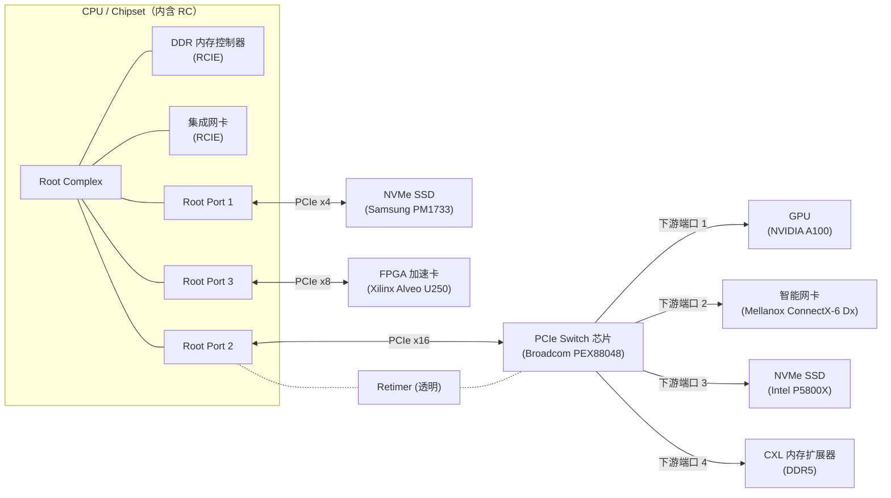
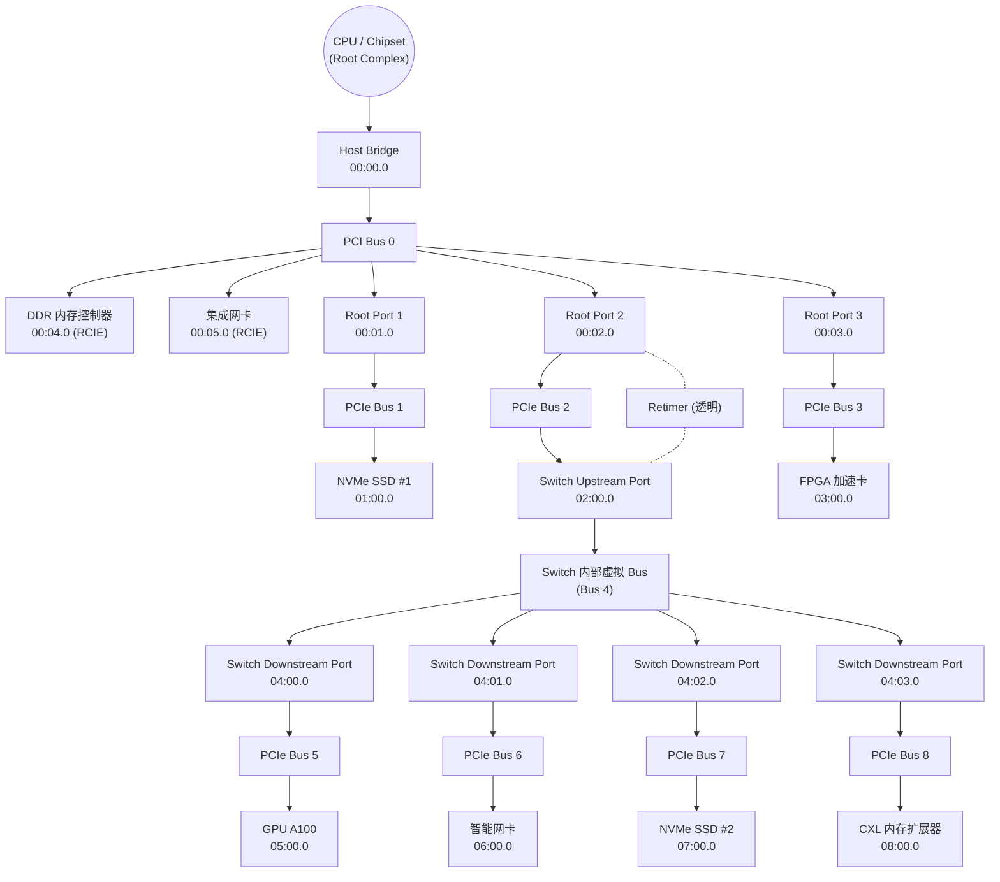

# PCIe

`PCIe`的全称是`Peripheral Component Interconnect Express`，是一种用于连接外设的总线。

它于2003年提出来，作为替代PCI和PCI-X的方案，现在已经成了现代CPU和其他几乎所有外设交互的标准或者基石，比如，我们马上能想到的GPU，网卡，USB控制器，声卡，网卡等等，这些都是通过PCIe总线进行连接的，然后现在非常常见的基于m.2接口的SSD，也是使用NVMe协议，通过PCIe总线进行连接的，除此以外，Thunderbolt 3，USB4，甚至最新的CXL互联协议，都是基于PCIe的。


## PCIe 组成部分

- Root Complex
- PCIe Bus
- Endpoint
- Port and Bridge
- Switch


**PCIe上连接的设备可以分为两种类型**：

- `Type 0`：它表示一个PCIe上最终端的设备`Endpoint`，比如我们常见的显卡，声卡，网卡等等。
- `Type 1`：它表示一个`PCIe Switch`或者`Root Port`。和终端设备不同，它的主要作用是用来连接其他的PCIe设备，其中PCIe的Switch和网络中的交换机类似。


**BDF - Bus/Device/Function Number**：

PCIe上所有的设备，无论是`Type 0`还是`Type 1`，在系统启动的时候，都会被`分配一个唯一的地址`，它有三个部分组成：

- Bus Number：8 bits，也就是最多256条总线
- Device Number：5 bits，也就是最多32个设备
- Function Number：3 bits，也就是最多8个功能

这就是我们常说的BDF，它类似于网络中的IP地址，一般写作BB:DD.F的格式。在Linux上，我们可以通过lspci命令来查看每个设备的BDF，比如，下面这个FCH SMBus Controller就是00:14.0：

```bash
$ lspci -t -v
 # [Domain:Bus]
 \-[0000:00]-+-00.0  Advanced Micro Devices, Inc. [AMD] Starship/Matisse Root Complex
             # Device.Function
             +-14.0  Advanced Micro Devices, Inc. [AMD] FCH SMBus Controller
```

由于默认BDF的方式最多只支持8个Function，可能不够用，所以PCIe还支持另一种解析方式，叫做`ARI`（Alternative Routing-ID Interpretation），它将Device Number和Function Number合并为一个8bit的字段，只用于表示Function，所以最多可以支持256个Function，但是它是可选的，需要通过设备配置启用。


**PCIe物理器件**：

| 器件                         | 物理     | 说明                                                         |
| :--------------------------- | -------- | :----------------------------------------------------------- |
| **Endpoint 设备**            | 独立存在 | 网卡、NVMe SSD、GPU、FPGA 加速卡等，插在插槽上或焊在板上。   |
| **PCIe Switch 芯片**         | 独立存在 | 独立封装的交换芯片（如 Broadcom PEX 系列、ASMedia 桥片），一个芯片内部包含上游端口 + 多个下游端口。 |
| **PCIe-to-PCI 桥芯片**       | 独立存在 | 老主板上用来转接传统 PCI 插槽的桥片，独立封装。              |
| **Retimer / Redriver**       | 独立存在 | 信号调理芯片，物理上存在，但对 PCIe 配置空间透明（不在 lspci 里出现）。 |
| **连接器 / 线缆**            | 独立存在 | 插槽、M.2 座、U.2 线、OCuLink 线等，纯物理连接。             |
| **Host Bridge**              | 存在CPU  | CPU 或 PCH 内部，负责 CPU ↔ PCIe 域地址转换。                |
| **Root Port**                | 存在CPU  | 在 CPU 或 PCH 内部，是 PCIe PHY + 控制逻辑，引出外部物理通道（如 M.2 接口）。 |
| **PCI 总线（Bus Number）**   | 无       | 完全由软件编号管理，物理上用数据包头中的 Bus Number 路由，没有“一根总线”的实体。 |
| **Switch 内部虚拟总线**      | 无       | 这是 Switch 芯片内部的路由逻辑，不对外暴露，只为连接上游端口和下游端口桥。 |
| **PCI-PCI 桥设备（Bridge）** | 无       | 如果一个芯片是 Switch，它会为每个端口报告一个独立的 `pci_dev`（如 `02:00.0 PCI bridge`），但这些“桥设备”只是配置空间里的逻辑功能，物理上全在同一个 Switch 芯片里。 |


### Root Complex

- **硬件角色**：CPU/芯片组里的“根”，负责发起配置空间访问、管理整个 PCIe 树。

- **Linux 抽象**：`struct pci_host_bridge`，对应一个“主机桥”。包含一个`Host Bridge`，n 个`Root Port`(Bridge)，以及 n 个`RCIE`(Root Complex Integrated Endpoint, 属于Endpoint)

  - `Host Bridge`延伸出`Bus0` *（Host Bridge 没有桥配置空间头，不执行标准桥的路由。真正能“延伸总线”的桥是 Root Port。Host Bridge 只是定义了 CPU 如何访问整个 PCI 空间（ECAM 窗口等），Root Port 才像管道一样把 bus 0 延伸到 bus 1。不过作为逻辑认知，把 Host Bridge 想象成“根节点，下面直接是 bus 0，bus 0 上长着 Root Port”是完全正确的，Linux 的 lspci -t 就是这么画的。）*
  - `Bus0`上挂着多个`RCIE`设备, 属于`Bus0`上的设备, 属于 CPU 内部定义好的
  - n 个`Root Port`从`Bus0`延伸出各自的`Bus`, Root Port = 一种特殊的 PCI-PCI 桥, 仅位于 RC 里

- **用户可见的形态**：

  ```bash
  00:00.0 Host bridge: Intel Corporation ...
  ```

  `class = 0x060000` (Host bridge)

- **核心功能**  

  1. **总线枚举的起点**：内核从 RC 开始扫描设备，分配 bus number。  
  2. **地址空间窗口**：把 CPU 的 MMIO 地址翻译为 PCI 总线地址，并设置 ATR 或 inbound/outbound 映射。  
  3. **配置空间访问方法**：通过 ECAM 或厂商自定义方法生成配置事务，供给所有下游设备。  
  4. **中断转换**：将来自 Endpoint 的 MSI/MSI-X 写入翻译成系统 LPI 或传统中断，并分发到 CPU。  
  5. **IOMMU 关联**：RC 通常与 SMMU/IOMMU 绑定，提供地址隔离和转换。  

- **相关驱动**：具体 SoC/平台 RC 驱动在 `drivers/pci/controller/` 下（如 pcie-rcar, pcie-tegra, pcie-designware-host 等）。这些驱动会填充 `pci_host_bridge` 的 ops，并提供资源窗口。


### PCIe Bus

- **硬件概念**：完全由软件编号管理，物理(协议)上用数据包头中的 Bus Number 路由，没有“一根总线”的实体。PCIe 中使用总线号来路由配置请求。每条逻辑 PCI 总线对应一组 BDF (Bus:Device.Function)。
  - `没有物理实体`：你找不到“Bus 3”这根铜线，因为 PCIe 是点对点串行网络。
  - `有路由实质`：`桥`的硬件逻辑会根据数据包里的 Bus Number 与自己的 Primary/Secondary/Subordinate 寄存器（由内核深度遍历后回写寄存器）比对，决定丢弃、转换（Type 1→Type 0）或向下游转发。
  - `逻辑总线是“寻址域”`：它是内核枚举时，为桥的下游开辟的一个 BDF 命名空间。这个空间内的设备，路由时会被同一个桥管辖。

- **Linux 抽象**：`struct pci_bus`，是`设备`、`桥`、`资源`的容器。

- **创建时机**：  

  - 第一个 bus (`pci_bus 0`) 由 RC 驱动创建（通常 `bus 0` 包含 Host bridge 和 Root Ports）。  
  - 每发现一个 PCI-PCI 桥（Root Port / Switch Port），就会分配一个新的下级 bus，并创建新的 `pci_bus` 结构。

- **功能**  

  - 管理该总线上的设备链表 (`devices`)。  
  - 提供配置空间访问方法 (`bus->ops`，最终会调用父桥直至 RC 的 ops)。  
  - 负责资源分配：遍历设备 BAR，分配 IO/MMIO 地址，形成 `resource` 链表。  
  - 与 sysfs 绑定，每个 bus 在 `/sys/devices/pci0000:00/0000:00:00.0/...` 等路径下有对应目录（或 `/sys/bus/pci/devices/...` 的链接）。

- **查看总线拓扑**：`lspci -t` 会画出树状结构，每个节点后的数字就是 bus 号。  

  ```bash
  -[0000:00]-+-00.0
             +-01.0-[01-02]--+-00.0
             |               \-01.0-[02]----00.0
  ```

  这里 `00` 是主总线，`01-02` 是该桥的下级总线范围。


### Endpoint

所有连接到PCIe总线上的Type 0设备（终端设备），都可以来实现PCIe的Endpoint，用来发起或者接收PCIe的请求和消息。

**每个设备可以实现一个或者多个Endpoint，每个Endpoint都对应着一个特定的功能。**比如：

  - 一块双网口的网卡，可以每个为每个网口实现一个单独的Endpoint；
  - 一块显卡，其中实现了4个Endpoint：一个显卡本身的Endpoint，一个Audio Endpoint，一个USB Endpoint，一个UCSI Endpoint；

- **驱动模型**：调用 `pci_register_driver()` 注册标准的 `pci_driver`，通过 Vendor/Device ID 匹配

- **控制实现**：
  - 驱动探测（probe）时，会做：
    - `pci_enable_device()` 使能设备
    - `pci_ioremap_bar()` 映射 BAR 到虚拟地址，直接操作硬件寄存器
    - `request_irq()` 或 `pci_alloc_irq_vectors()` 处理 MSI/MSI-X
    - `pci_set_master()` 使能 DMA
  - 例子：NVMe 驱动 `drivers/nvme/host/pci.c`，网卡驱动 `drivers/net/ethernet/intel/e1000e/`

- **sysfs 交互**：
  - 配置空间：`/sys/bus/pci/devices/0000:01:00.0/config` (可读写)
  - 资源：`resource0` ~ `resource5` 可以 mmap 做用户态驱动 (UIO/VFIO)
  - 电源管理：`power/control` 实现 runtime PM
  - 复位：`reset` 节点


### Port and Bridge

这里要区分两种常见的桥，它们在 Linux 里都是“PCI bridge”设备，但功能侧重不同。

桥（即端口）的作用，就是*连接两条逻辑 PCI 总线*，而不是把端口连到总线上。 端口是桥的实现，桥是总线的连接器。


#### Host Bridge

- **没有独立的物理封装，但在 lspci 里是 `00:00.0 Host bridge`**

- **内核抽象**：`struct pci_host_bridge` *（Host Bridge 没有桥配置空间头，不执行标准桥的路由。真正能“延伸总线”的桥是 Root Port。Host Bridge 只是定义了 CPU 如何访问整个 PCI 空间（ECAM 窗口等），Root Port 才像管道一样把 bus 0 延伸到 bus 1。不过作为逻辑认知，把 Host Bridge 想象成“根节点，下面直接是 bus 0，bus 0 上长着 Root Port”是完全正确的，Linux 的 lspci -t 就是这么画的。）*

- **实现位置**：
  - 平台/SoC 专用驱动：`drivers/pci/controller/`（例如 `pcie-designware-host.c`、`pcie-rcar-host.c`）
  - x86 通用代码：`arch/x86/pci/`，大部分用 ACPI MCFG 表提供的 ECAM 基址

- **控制功能**：
  - 提供 **配置空间访问回调**（`bridge->ops`），例如 ECAM `pci_generic_config_read/write`
  - 定义 **CPU→PCI 地址窗口**（IO/MEM 资源根窗口），负责 inbound/outbound 地址翻译
  - 与 IOMMU 关联，设置 DMA 映射
  - 初始化时调用 `pci_scan_root_bus_bridge()` 启动全总线枚举

- **用户可查看的地方**：`/sys/devices/pci0000:00/` 下的资源文件，或 `lspci -v -s 00:00.0` 看寄存器


#### PCIe 内部虚拟桥 (Switch Port / Root Port / Port)

Port 特指 Bridge 的“端口”，在 Linux 中硬件端口和对应的 `pci_dev` 是一一对应的，`class=0x060400` 的 `pci_dev`。

- **用户可见检查方法**：  

  ```bash
  # 查看哪个端口是 Root Port 还是 Switch Port
  sudo lspci -v -s 00:01.0 | grep "PCI bridge"
  # 或者看 /sys/bus/pci/devices/.../pcie_type
  cat /sys/bus/pci/devices/0000:00:01.0/pcie_type
  # 输出: Root Port / Upstream Port / Downstream Port
  ```

- **功能**  
  - 承载总线号范围、地址窗口（IO/MMIO/Prefetch）过滤。  
  - 执行 AER（高级错误报告）、ACS（访问控制）、DPC（下游端口抑制）等 PCIe 扩展能力。  
  - 生成热插拔事件、带内电源管理等。

> 注意：延伸bus只是Linux的抽象，以便于更好理解，并非真实物理存在


##### Root Port

- **物理**：集成在 CPU/PCH 里，lspci 显示为 `PCI bridge` (class 0x060400)，RC 里直接连接外部设备/Switch 的端口，由CPU/PCH 内部的 PCIe PHY+控制器 组成。

- **驱动**：**`pcieport`** (`drivers/pci/pcie/portdrv.c`)

- **控制实现**：

  - 控制寄存器（配置空间）是真实存在的硬件寄存器

  - 探测 PCIe Capability，`class = 0x060400`，带 Capability ID 10h（PCI Express），注册多个 **服务**：

    - `AER`（高级错误报告，`aer.c`）
    - `PME`（电源管理事件，`pme.c`）
    - `Hotplug`（热插拔，`pciehp.c`）
    - `DPC`（下游端口抑制，`dpc.c`）

  - 每个服务都创建独立的 `pcie_device`，比如：

    ```
    /sys/bus/pci_express/devices/0000:00:1c.0:pcie001  (AER)
    ```

  - lot 能力（如果支持热插拔）：
    - 热插拔会注册中断，监测 Presence Detect、Attention Button 等，进而执行 `pci_scan_bridge()` 扫描新设备，或者 `pci_stop_and_remove_bus_device()` 移除设备。
    - 用户态可通过 `/sys/bus/pci/slots/` 查看插槽状态，或写 `power` 文件触发人工热移除。

  - 发起配置请求（所有下游设备的配置访问都源自 Root Port），处理 PME、错误转发，以及可能有的热插拔控制（带 Slot 能力）

- **和普通 Endpoint 驱动的区别**：不匹配 Vendor ID，而是匹配 `PCI_CLASS_BRIDGE_PCI` + 是否有 PCIe Capability


##### Switch Upstream/Downstream Port

  - **物理**：Switch 下游端口是 Switch 芯片内部的一个逻辑桥模块，每个下游端口包含独立的配置空间、缓冲区、仲裁逻辑等。但它们都集中在一个 Switch 芯片里，没有独立的物理控制器封装。

  - 同样 class 为 `0x060400`，分别对应上行和下行。

  - **控制实现**：

    - 与 Root Port 完全相同——内核通过配置空间操作 Switch 芯片内该端口的寄存器，pcieport 驱动为每个下游端口创建服务（如热插拔、AER）。所以，控制电路在芯片内真实存在，但共享同一个硅片。

    - Downstream Port 可能包含一个 Slot 能力（如果支持热插拔）：
      - 热插拔会注册中断，监测 Presence Detect、Attention Button 等，进而执行 `pci_scan_bridge()` 扫描新设备，或者 `pci_stop_and_remove_bus_device()` 移除设备。
      - 用户态可通过 `/sys/bus/pci/slots/` 查看插槽状态，或写 `power` 文件触发人工热移除。


#### PCIe-to-PCI/PCI-X 桥

- 用于传统 PCI 设备，`class = 0x060401`。老主板上用来转接传统 PCI 插槽的桥片，独立封装。这种桥常常是一个独立的芯片（例如 PLX 的某些桥片），有自己的封装和引脚，一侧接 PCIe 上游，另一侧引出传统 PCI/PCI-X 总线。因此，它确实是一个独立的物理控制器。

- 功能类似，但使用传统 PCI 桥规范，支持 Subtractive Decode 等。

- **Linux 驱动**：

- **控制实现**：

  - 在 Linux 中，虽然为 `PCI_CLASS_BRIDGE_PCI`，但这类桥因为 class 不是 0x060400（而是 0x060401），不包含标准 PCIe Capability，所以不会由 pcieport 驱动绑定。它的控制完全由 PCI 核心根据桥的 Type 1 配置空间头隐式管理（分配总线号、地址窗口、转发配置事务等），没有专门的驱动文件。如果需要额外控制（例如查看桥的窗口寄存器），用户可以用 setpci 或平台专用驱动去访问。硬件控制电路是独立的，但内核用通用桥代码管理。

  - class 通常是 0x060401（传统 PCI-PCI 桥）
  
  - 由于不是 PCIe Capability，它不会被 pcieport 驱动绑定。
  
  - 内核 PCI 核心会隐式管理：扫描下级总线、分配资源，但没有专门的驱动来提供 AER 等服务。
  
  - 如果需要，可以用 pci_bridge_emul 之类的辅助框架模拟，或由平台驱动处理特殊情况。
  
  - 用户态通过 *setpci* 可以读取桥的窗口寄存器（IO/MEM base/limit）


### Switch

- **硬件角色**：独立封装的交换芯片。数据包转发，一个上游端口 + 多个下游端口，内部是虚拟 PCI-PCI 桥。

- **Linux 抽象**：Switch 本身**没有单独的设备对象**。它被拆成多个 PCI-PCI 桥设备（每个端口一个），也就是多个 `pci_dev`，class 为 `0x060400` (PCI-PCI bridge)。

  - 从`Root Point`延伸的`Bus`上用`Upstream Port`桥接延伸出`Switch`内部虚拟`Bus`(用户空间看不到)
  - 再从`Switch`内部虚拟`Bus`延伸出多个`Downstream Port`(Bridge), 每个`Downstream Port`都有对应的`Bus`, 有顺序

- **用户可见**：你会看到：

  ```
  00:01.0 PCI bridge: ... (上游端口，连接 Root Port)
  01:00.0 PCI bridge: ... (下游端口 1)
  01:01.0 PCI bridge: ... (下游端口 2)
  ```

  注意：Switch 的内部端口可能使用不同的 bus/device 号，但 bus 号是连续的。

- **内核控制**：
  - Switch 本身**没有专用的全局驱动**，每个端口都被当作独立的 `pci_dev` 来处理
  - 上游端口和下游端口都是 class 0x060400，**同样由 `pcieport` 驱动接管**，因此自动获得 AER、热插拔、PME 等服务
  - 这些端口的配置空间里包含 Switch 特有的 Capability（如 `PCI_EXP_TYPE_UPSTREAM`、`PCI_EXP_TYPE_DOWNSTREAM`），`pcieport` 会根据类型启用不同功能（例如下游端口才启用 Hotplug Slot 能力）

- **特殊应用**：有些 Switch 有 **管理端点**（如 Microchip Switchtec），这些会被专用的驱动（`drivers/pci/switch/switchtec.c`）接管，提供 ioctl 接口供用户管理交换机配置。普通数据路径由硬件转发，内核不干预。

- **功能**  

  1. 扩展总线，增加可连接的设备数。  
  2. 转发配置/IO/内存事务，负责地址路由（根据下游桥的 MMIO/Prefetch 窗口）。  
  3. 每个端口的桥设备都包含标准的 Type 1 配置空间头（主总线、从总线、下级总线）。  
  4. 热插拔、功率管理等功能由端口上的 `pcieport` 驱动处理（见 Port 部分）。  

- **内核视角**：枚举时，在 Switch 上游端口对应的 `pci_bus` 上发现了新的桥设备，就分配总线号，再继续枚举。


## PCIe 拓扑示例


### 物理拓扑




### 内核抽象




### 用户空间

```shell
$ lspci
00:00.0 Host bridge: Intel Corporation Ice Lake Xeon Host Bridge
00:01.0 PCI bridge: Intel Corporation Ice Lake PCIe Root Port #1 (secondary=1)
00:02.0 PCI bridge: Intel Corporation Ice Lake PCIe Root Port #2 (secondary=2, subordinate=8)
00:03.0 PCI bridge: Intel Corporation Ice Lake PCIe Root Port #3 (secondary=3)
00:04.0 System peripheral: Intel Corporation Xeon Memory Controller (RCIE)
00:05.0 Ethernet controller: Intel Corporation I210 Gigabit Network Connection (RCIE)
01:00.0 Non-Volatile memory controller: Samsung Electronics Co Ltd PM1733 NVMe SSD
02:00.0 PCI bridge: Broadcom Inc. PEX88048 PCIe Switch Upstream Port (secondary=4, subordinate=8)
04:00.0 PCI bridge: Broadcom Inc. PEX88048 PCIe Switch Downstream Port (secondary=5)
04:01.0 PCI bridge: Broadcom Inc. PEX88048 PCIe Switch Downstream Port (secondary=6)
04:02.0 PCI bridge: Broadcom Inc. PEX88048 PCIe Switch Downstream Port (secondary=7)
04:03.0 PCI bridge: Broadcom Inc. PEX88048 PCIe Switch Downstream Port (secondary=8)
05:00.0 3D controller: NVIDIA Corporation GA100 [A100 SXM4 80GB]
06:00.0 Ethernet controller: Mellanox Technologies MT2892 Family [ConnectX-6 Dx]
07:00.0 Non-Volatile memory controller: Intel Corporation Optane SSD P5800X
08:00.0 CXL Memory Expander: Samsung Electronics Co Ltd CXL DDR5 Memory Module
03:00.0 Processing accelerators: Xilinx Corporation Alveo U250 FPGA
$ 
$ 
$ lspci -t
-[0000:00]-+-00.0
           +-01.0-[01]----00.0   (NVMe #1)
           +-02.0-[02-08]--+-00.0-[04-08]--+-00.0-[05]----00.0   (GPU)
           |               |                +-01.0-[06]----00.0   (SmartNIC)
           |               |                +-02.0-[07]----00.0   (NVMe #2)
           |               |                \-03.0-[08]----00.0   (CXL)
           +-03.0-[03]----00.0   (FPGA)
           +-04.0   (内存控制器)
           \-05.0   (集成网卡)
```


## Reference

> https://mp.weixin.qq.com/s/PTTkr8Z6epPsBebIrtuC9g

