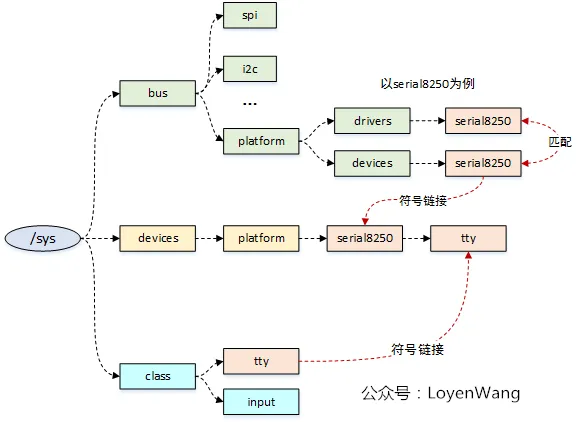
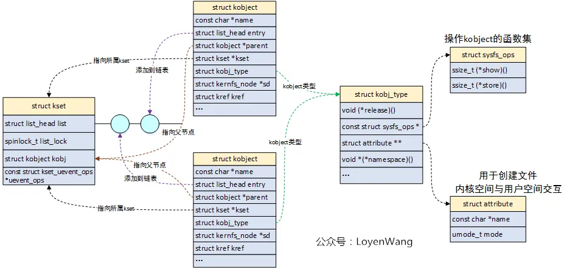
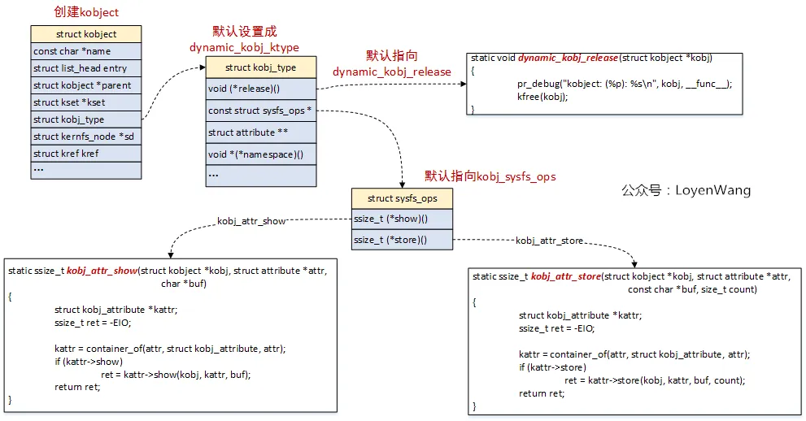
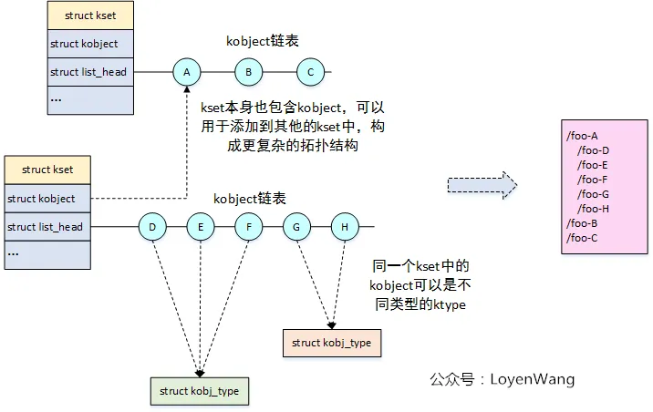
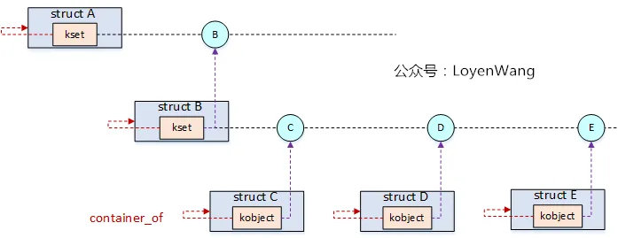
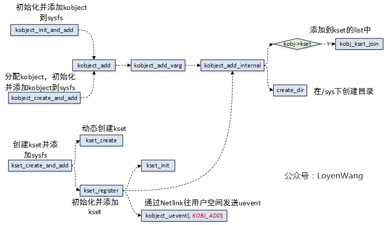
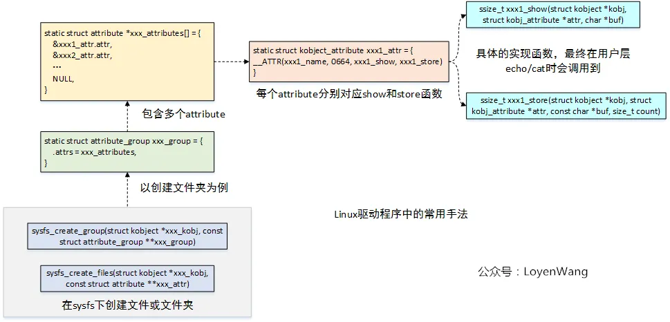
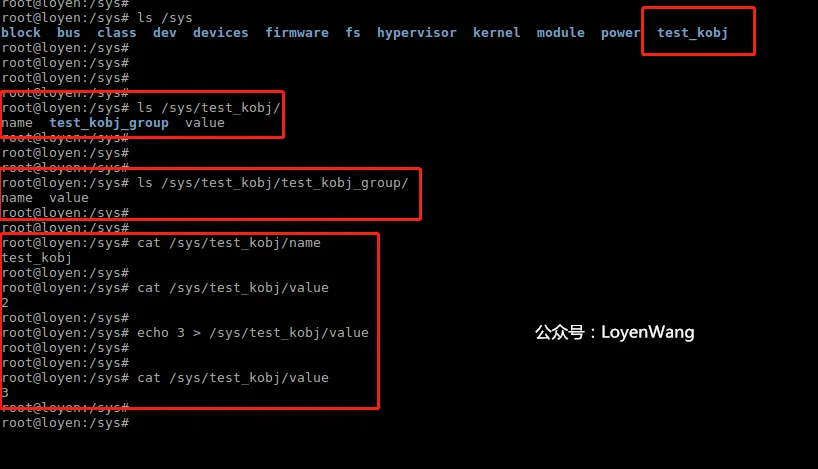

# 设备模型之kset/kobj/ktype分析


# 背 景

- `Read the fucking source code!` --By 鲁迅
- `A picture is worth a thousand words.` --By 高尔基

说明：

1. Kernel版本：4.14
2. ARM64处理器，Contex-A53，双核
3. 使用工具：Source Insight 3.5， Visio


# 1. 概述

今天来聊一下Linux设备模型的基石：`kset/kobject/ktype`。




- `sysfs`文件系统提供了一种用户与内核数据结构进行交互的方式，可以通过`mount -t sysfs sysfs /sys`来进行挂载；
- Linux设备模型中，设备、驱动、总线组织成拓扑结构，通过`sysfs`文件系统以目录结构进行展示与管理；
- Linux设备模型中，总线负责设备和驱动的匹配，设备与驱动都挂在某一个总线上，当它们进行注册时由总线负责去完成匹配，进而回调驱动的`probe`函数；
- SoC系统中有`spi`, `i2c`, `pci`等实体总线用于外设的连接，而针对集成在SoC中的外设控制器，Linux内核提供一种虚拟总线`platform`用于这些外设控制器的连接，此外`platform`总线也可用于没有实体总线的外设；
- 在`/sys`目录下，`bus`用于存放各类总线，其中总线中会存放挂载在该总线上的驱动和设备，比如`serial8250`，`devices`存放了系统中的设备信息，`class`是针对不同的设备进行分类；

上边这些功能的实现，离不开`kobject/kset/ktype`机制的支撑，开始旅程吧。


# 2. 数据结构




## 2.1 kobject

- `kobject`代表内核对象，结构体本身不单独使用，而是嵌套在其他高层结构中，用于组织成拓扑关系；
- `sysfs`文件系统中一个目录对应一个`kobject`；

看看结构体吧：

```c
struct kobject {
	const char		*name;                  /* 名字，对应sysfs下的一个目录 */
	struct list_head	entry;               /* kobject中插入的 list_head结构，用于构造双向链表 */
	struct kobject		*parent;            /* 指向当前kobject父对象的指针，体现在sys中就是包含当前kobject对象的目录对象 */
	struct kset		*kset;                    /* 当前kobject对象所属的集合 */
	struct kobj_type	*ktype;            /* 当前kobject对象的类型 */
	struct kernfs_node	*sd;              /* VFS文件系统的目录项，是设备和文件之间的桥梁，sysfs中的符号链接是通过kernfs_node内的联合体实现的 */
	struct kref		kref;                     /* kobject的引用计数，当计数为0时，回调之前注册的release方法释放该对象 */
#ifdef CONFIG_DEBUG_KOBJECT_RELEASE
	struct delayed_work	release;
#endif
	unsigned int state_initialized:1;                /* 初始化标志位，初始化时被置位 */
	unsigned int state_in_sysfs:1;                  /* kobject在sysfs中的状态，在目录中创建则为1，否则为0 */
	unsigned int state_add_uevent_sent:1;      /* 添加设备的uevent事件是否发送标志，添加设备时向用户空间发送uevent事件，请求新增设备 */
	unsigned int state_remove_uevent_sent:1;  /* 删除设备的uevent事件是否发送标志，删除设备时向用户空间发送uevent事件，请求卸载设备 */
	unsigned int uevent_suppress:1;              /* 是否忽略上报（不上报uevent） */
};
```


## 2.2 kset

- `kset`是包含多个`kobject`的集合；
- 如果需要在`sysfs`的目录中包含多个子目录，那需要将它定义成一个`kset`；
- `kset`结构体中包含`struct kobject`字段，可以使用该字段链接到更上一层的结构，用于构建更复杂的拓扑结构；
- `sysfs`中的设备组织结构很大程度上根据`kset`组织的，`/sys/bus`目录就是一个`kset`对象，在Linux设备模型中，注册设备或驱动时就将`kobject`添加到对应的`kset`中；

```c

struct kset {
	struct list_head list;        /* 包含在kset内的所有kobject构成一个双向链表 */
	spinlock_t list_lock;
	struct kobject kobj;       /* 归属于该kset的所有的kobject的共有parent */
	const struct kset_uevent_ops *uevent_ops;    /* kset的uevent操作函数集，当kset中的kobject有状态变化时，会回调这个函数集，以便kset添加新的环境变量或过滤某些uevent，如果一个kobject不属于任何kset时，是不允许发送uevent的 */
} __randomize_layout;
```


## 2.3 ktype

- `kobj_type`用于表征`kobject`的类型，指定了删除`kobject`时要调用的函数，`kobject`结构体中有`struct kref`字段用于对`kobject`进行引用计数，当计数值为0时，就会调用`kobj_type`中的`release`函数对`kobject`进行释放，这个就有点类似于C++中的智能指针了；
- `kobj_type`指定了通过`sysfs`显示或修改有关`kobject`的信息时要处理的操作，实际是调用`show/store`函数；

```c
struct kobj_type {
	void (*release)(struct kobject *kobj);     /* 释放kobject对象的接口，有点类似面向对象中的析构 */
	const struct sysfs_ops *sysfs_ops;        /* 操作kobject的方法集 */
	struct attribute **default_attrs;
	const struct kobj_ns_type_operations *(*child_ns_type)(struct kobject *kobj);
	const void *(*namespace)(struct kobject *kobj);
};

struct sysfs_ops {      /* kobject操作函数集 */
	ssize_t	(*show)(struct kobject *, struct attribute *, char *);
	ssize_t	(*store)(struct kobject *, struct attribute *, const char *, size_t);
};

/* 所谓的attribute就是内核空间和用户空间进行信息交互的一种方法，例如某个driver定义了一个变量，却希望用户空间程序可以修改该变量，以控制driver的行为，那么可以将该变量以sysfs attribute的形式开放出来 */
struct attribute {
	const char		*name;
	umode_t			mode;
#ifdef CONFIG_DEBUG_LOCK_ALLOC
	bool			ignore_lockdep:1;
	struct lock_class_key	*key;
	struct lock_class_key	skey;
#endif
};
```

可以看一下`kobject`创建的时候，与`ktype`的关系，这样理解起来更顺：




- `kobject`在创建的时候，默认设置`kobj_type`的值为`dynamic_kobj_ktype`，通常`kobject`会嵌入在其他结构中来使用，因此它的初始化跟特定的结构相关，典型的比如`struct device`和`struct device_driver`；
- 在`/sys`文件系统中，通过`echo/cat`的操作，最终会调用到`show/store`函数，而这两个函数的具体实现可以放置到驱动程序中；


## 2.4 结构关系

为了更形象的说明这几个结构体的关系，再来一张图：




- `kset`既是`kobject`的集合，本身又是一个`kobject`，进而可以添加到其他的集合中，从而就可以构建成复杂的拓扑结构，满足`/sys`文件夹下的文件组织需求；

如果只看`kset/kobject`的数据结构组织，可能还是会迷惑，它怎么跟Linux的设备模型相关？这时就不得不提到Linux内核中一个很精妙的存在`container_of`，它可以通过成员变量的地址来获取所在结构的地址信息。前文提到过`kobject/kset`结构本身不会单独使用，通常都是会嵌套在其他结构中，既然`kobjcet/kset`能组织成拓扑结构，那么包含它们的结构同样可以构建这个关系，因为可以通过`container_of`就可以找到结构体的首地址。




- 结构体A、B、C、D、E同样可以构建拓扑结构关系；
- `struct device`和`struct device_driver`结构体中都包含了`struct kobject`，而`struct bus_type`结构体中包含了`struct kset`结构，这个也就对应到前文提到的设备和驱动都添加到总线上，由总线来负责匹配；


# 3. 流程分析

`kobject/kset`的相关代码比较简单，毕竟它只是作为一个结构体嵌入其他high-level的结构中，充当纽带的作用。不过，我还是简单的上一张图吧：




- 完成的工作基本就是分配结构体，初始化各个结构体字段，构建拓扑关系（主要是添加到kset的list中，parent的指向等）等，看懂了结构体的组织，这部分的代码理解起来就很轻松了；


# 4. 示例

先上一个原理图：




## 4.1 代码

```c
#include <linux/kernel.h>
#include <linux/module.h>
#include <linux/slab.h>
#include <linux/kobject.h>

//自定义一个结构，包含了struct kobject子结构
struct test_kobj {
    int value;
    struct kobject kobj;
};

//自定义个属性结构体，包含了struct attribute结构
struct test_kobj_attribute {
    struct attribute attr;
    ssize_t (*show)(struct test_kobj *obj, struct test_kobj_attribute *attr, char *buf);
    ssize_t (*store)(struct test_kobj *obj, struct test_kobj_attribute *attr, const char *buf, size_t count);
};

//声明一个全局结构用于测试
struct test_kobj *obj;

//用于初始化sysfs_ops中的函数指针
static ssize_t test_kobj_attr_show(struct kobject *kobj, struct attribute *attr, char *buf)
{
    struct test_kobj_attribute *test_kobj_attr;
    ssize_t ret = -EIO;

    test_kobj_attr = container_of(attr, struct test_kobj_attribute, attr);
    
    //回调到具体的实现函数
    if (test_kobj_attr->show)
        ret = test_kobj_attr->show(container_of(kobj, struct test_kobj, kobj), test_kobj_attr, buf);
    
    return ret;
}

//用于初始化sysfs_ops中的函数指针
static ssize_t test_kobj_attr_store(struct kobject *kobj, struct attribute *attr, const char *buf, size_t count)
{
    struct test_kobj_attribute *test_kobj_attr;
    ssize_t ret = -EIO;

    test_kobj_attr = container_of(attr, struct test_kobj_attribute, attr);
    
    //回调到具体的实现函数
    if (test_kobj_attr->store)
        ret = test_kobj_attr->store(container_of(kobj, struct test_kobj, kobj), test_kobj_attr, buf, count);
    
    return ret;
}

//用于初始化kobj_ktype
const struct sysfs_ops test_kobj_sysfs_ops = {
    .show = test_kobj_attr_show,
    .store = test_kobj_attr_store,
};

//用于初始化kobj_ktype，最终用于释放kobject
void obj_release(struct kobject *kobj)
{
    struct test_kobj *obj = container_of(kobj, struct test_kobj, kobj);

    printk(KERN_INFO "test kobject release %s\n", kobject_name(&obj->kobj));
    
    kfree(obj);
}

//定义kobj_ktype，用于指定kobject的类型，初始化的时候使用
static struct kobj_type test_kobj_ktype = {
    .release = obj_release,
    .sysfs_ops = &test_kobj_sysfs_ops,
};

//show函数的具体实现
ssize_t name_show(struct test_kobj *obj, struct test_kobj_attribute *attr, char *buffer)
{
    return sprintf(buffer, "%s\n", kobject_name(&obj->kobj));
}

//show函数的具体实现
ssize_t value_show(struct test_kobj *obj, struct test_kobj_attribute *attr, char *buffer)
{
    return sprintf(buffer, "%d\n", obj->value);
}

//store函数的具体实现
ssize_t value_store(struct test_kobj *obj, struct test_kobj_attribute *attr, const char *buffer, size_t size)
{
    sscanf(buffer, "%d", &obj->value);

    return size;
}

//定义属性，最终注册进sysfs系统
struct test_kobj_attribute name_attribute = __ATTR(name, 0664, name_show, NULL);
struct test_kobj_attribute value_attribute = __ATTR(value, 0664, value_show, value_store);
struct attribute *test_kobj_attrs[] = {
    &name_attribute.attr,
    &value_attribute.attr,
    NULL,
};

//定义组
struct attribute_group test_kobj_group = {
    .name = "test_kobj_group",
    .attrs = test_kobj_attrs,
};

//模块初始化函数
static int __init test_kobj_init(void)
{
    int retval;
    printk(KERN_INFO "test_kobj_init\n");
    obj = kmalloc(sizeof(struct test_kobj), GFP_KERNEL);
    if (!obj) {
        return -ENOMEM;
    }
    
    obj->value = 1;
    memset(&obj->kobj, 0, sizeof(struct kobject));
    //添加进sysfs系统
    kobject_init_and_add(&obj->kobj, &test_kobj_ktype, NULL, "test_kobj");

    //在sys文件夹下创建文件
    retval = sysfs_create_files(&obj->kobj, (const struct attribute **)test_kobj_attrs);
    if (retval) {
        kobject_put(&obj->kobj);
        return retval;
    }
    
    //在sys文件夹下创建group
    retval = sysfs_create_group(&obj->kobj, &test_kobj_group);
    if (retval) {
        kobject_put(&obj->kobj);
        return retval;
    }
    
    return 0;
}

//模块清理函数
static void __exit test_kobj_exit(void)
{
    printk(KERN_INFO "test_kobj_exit\n");

    kobject_del(&obj->kobj);
    kobject_put(&obj->kobj);
    
    return;
}

module_init(test_kobj_init);
module_exit(test_kobj_exit);

MODULE_AUTHOR("LoyenWang");
MODULE_LICENSE("GPL");
```


## 4.2 Makefile

```makefile

ifneq  ($(KERNELRELEASE),)
obj-m:=test_kobject.o
else
KERDIR := /lib/modules/$(shell uname -r)/build
PWD:=$(shell pwd)
all:
	make -C $(KERDIR) M=$(PWD) modules
clean:
	rm -f *.ko *.o *.symvers *.cmd *.cmd.o modules.* *.mod.c
endif
```

- `Makefile`没有太多好说的，注意`Tab`的使用，否则容易出错；


## 4.3 测试结果




- 在/sys目录下创建了test_kobj文件夹，在该文件夹下除了`name`和`value`外，还有一个`test_kobj_group`的子文件夹；
- 可以通过`cat/echo`的操作，来操作`name`和`value`，分别会调用到底层的`xxx_show`和`xxx_store`函数；
- 对着代码看这个图，一目了然；


> Source: [linux设备模型之kset/kobj/ktype分析](https://mp.weixin.qq.com/s/Z7VPNgB0-goJ98PubPRdjg)
