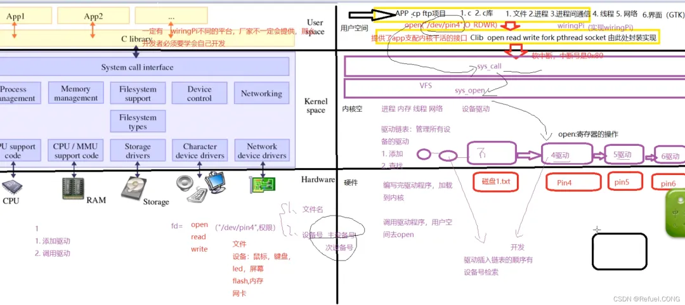
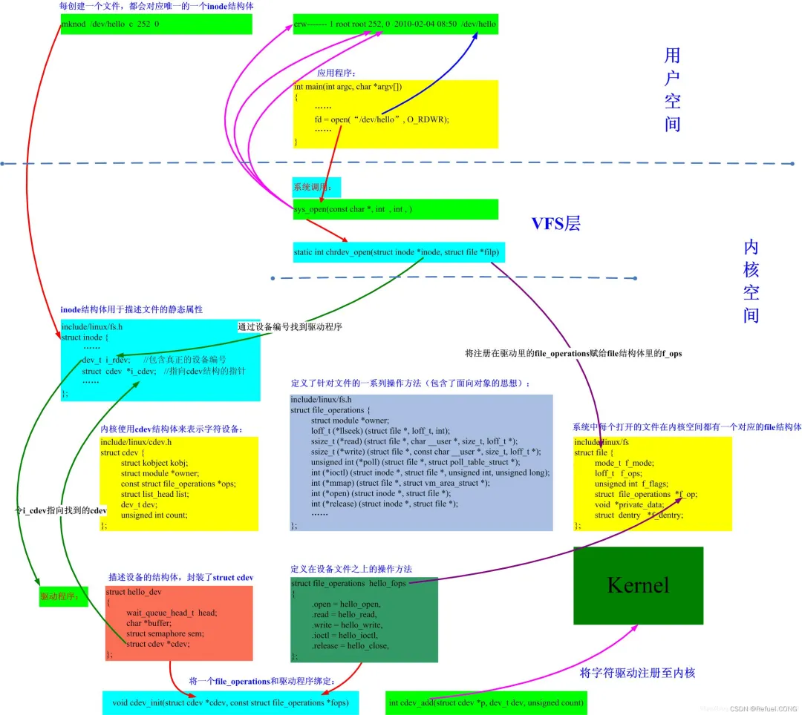
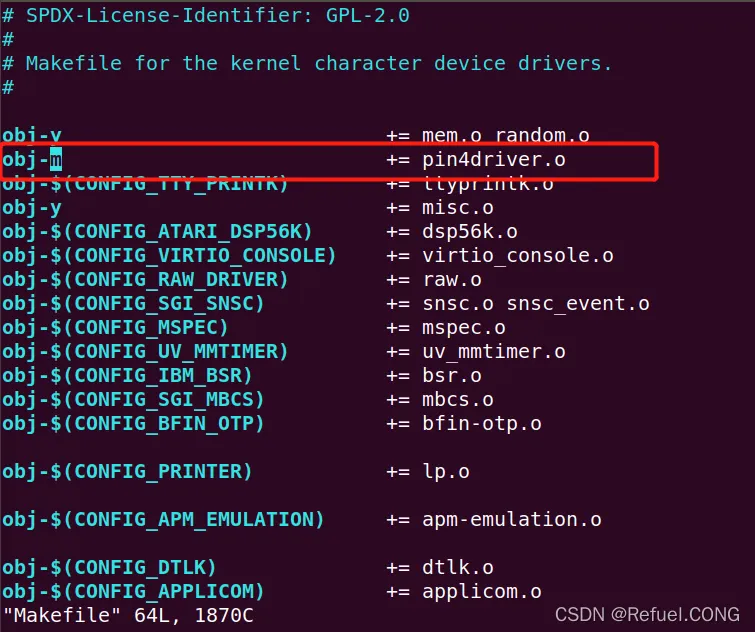

## 1. 什么是驱动

驱动就是对底层硬件设备的操作进行封装，并向上层提供函数接口。

**设备分类：**linux系统将设备分为3类：**字符设备、块设备、网络设备**。

- **字符设备**：指只能一个字节一个字节读写的设备，不能随机读取设备内存中的某一数据，读取数据需要按照先后顺序。字符设备是面向流的设备，常见的字符设备有鼠标、键盘、串口、控制台和LED设备等，**字符设备驱动程序通常至少要实现open、close、read和write的系统调用**，**字符终端（/dev/console）和串口（/dev/ttyS0以及类似设备）就是两个字符设备，它们能很好的说明“流”这种抽象概念。**
- **块设备**：指可以从设备的任意位置读取一定长度数据的设备。块设备包括硬盘、磁盘、U盘和SD卡等。
- **网络设备**：网络设备可以是一个硬件设备,如网卡; 但也可以是一个纯粹的软件设备, 比如回环接口(lo).一个网络接口负责发送和接收数据报文。

**我们来举一个例子来说一下整体的调用过程**

1. 在上层我们调用 c语言 open函数 `open("/dev/pin4",O_RDWR);` 调用/dev下的pin4以可读可写的方式打开，**==对于上层open调用到内核时会发生一次软中断中断号是0X80，从用户空间进入到内核空间==**
2. open会调用到`system_call`(内核函数)，system_call会根据/dev/pin4设备名，去找出你要的设备号。
3. 再调到虚拟文件**VFS** （**为了上层调用到确切的硬件统一化**）,调用VFS里的`sys_open`，sys_open会找到在**驱动链表**里面，根据**主设备号和次设备号**找到引脚4里的open函数，**我们在引脚4里的open是对寄存器操作**

在这里插入图片描述

> 我们写驱动无非就是做**添加驱动**：**添加驱动做哪些事呢？**
>
> 1. 设备名
> 2. 设备号
> 3. 设备驱动函数 （操作寄存器 来驱动 IO口）

**==综上所述==**如果想要打开`dev`下面的`pin4`引脚，过程是：**用户态调用open**（`“/de/pin4”,O_RDWR`）,对于内核来说，上层调用open函数会触发一个软中断（系统调用专用，中断号是0x80，0x80代表发生了一个系统调用），**系统进入内核态**，并走到`system_call`，可以认为这个就是此软中断的中断服务程序入口，然后通过传递过来的系统调用号来决定调用相应的系统调用服务程序（在这里是调用`VFS`中的`sys_open`）。`sys_open`会在内核的驱动链表里面**根据设备名和设备号查找到相关的驱动函数**（`每一个驱动函数是一个节点`），**==驱动函数里面有通过寄存器操控IO口的代码，进而可以控制IO口实现相关功能==**。

## 2. 各分态的详解

> **用户态：**

- 是指用户编写程序、运行程序的层面，**用户态在开发时需要C的基础和C库，C库讲到文件，进程，进程间通信，线程，网络，界面（GTk）**。C库（是linux标准库一定有）：就是**Clibary**，提供了程序支配内核干活的接口，调用的`open，read，write，fork，pthread，socket`由此处封装实现，由写的应用程序调用，**C库中的各种API调用的是内核态，支配内核干活**。

> **内核态：**

- 用户要使用某个硬件设备时，需要**内核态的设备驱动程序**,**进而驱动硬件干活**，就比如之前文章里面所提到的`wiringPi库`，**就是提供了用户操控硬件设备的接口**，在没有wiringPi库时就需要自己实现wiringPi库的功能，就是自己写设备驱动程序。这样当我们拿到另一种类型的板子时，同样也可以完成开发。

- **在linux中一切皆文件**，各种的文件和设备（比如：鼠标、键盘、屏幕、flash、内存、网卡、如下图所示：）都是文件，那**既然是文件了，就可以使用文件操作函数来操作这些设备**。

- **有一个问题，open、read等这些文件操作函数是如何知道打开的文件是哪一种硬件设备呢？**①在**open函数里面输入对应的文件名**，进而操控对应的设备。②通过 **==设备号（主设备号和次设备号）==** 。除此之外我们还要了解这些驱动程序的位置，和如何实现这些驱动程序，**每一种硬件设备对应不同的驱动（这些驱动有我们自己来实现）**。

- **Linux的设备管理是和文件系统紧密结合的**，**各种设备都以文件的形式存放在/dev目录下**，称为 **==设备文件==\**。应用程序可以打开、关闭和读写这些设备文件，完成对设备的操作，就像操作普通的数据文件一样。\*\*为了管理这些设备，系统为设备编了号\*\*，\**每个设备号又分为==主设备号== 和 ==次设备号==\**（如下图所示：）。***

- ****

- ***\*\*主设备号\*\*用来区分不同种类的设备，而\**次设备号**用来区分同一类型的多个设备。**对于常用设备，Linux有约定俗成的编号，如硬盘的主设备号是3。****一个字符设备或者块设备都有一个主设备号和次设备号**。**==主设备号和次设备号统称为设备号==**。

  > **主设备号**用来表示一个特定的驱动程序。
  > **次设备号**用来表示使用该驱动程序的各设备。

  例如一个嵌入式系统，有两个LED指示灯，LED灯需要独立的打开或者关闭。那么，可以写一个LED灯的**字符设备驱动程序**，可以将其**主设备号注册成5号设备**，**次设备号分别为1和2**。这里，次设备号就分别表示两个LED灯。

**==驱动链表==**

> **管理所有设备的驱动，添加或查找**
> `添加`**是发生在我们编写完驱动程序，加载到内核**。
> `查找`**是在调用驱动程序，由应用层用户空间去查找使用open函数**。
>
> 驱动插入链表的顺序由**设备号检索**，就是说**主设备号和次设备号除了能区分不同种类的设备和不同类型的设备，还能起到将驱动程序加载到链表的某个位置**，在下面介绍的驱动代码的开发无非就是**添加驱动**（添加设备号、设备名和设备驱动函数）和**调用驱动**。

- **system_call函数是怎么找到详细的系统调用服务例程的呢？**通过**系统调用号查找系统调用表sys_call_table！** 软中断指令INT 0x80运行时，系统调用号会被放入 **eax寄存器**中，system_call函数能够读取eax寄存器获取，然后将其乘以4，生成偏移地址，然后以sys_call_table为基址。基址加上偏移地址，就能够得到详细的系统调用服务例程的地址了！然后就到了系统调用服务例程了。

**补充：**

1. 每个系统调用都对应一个系统调用号，而系统调用号就对应内核中的相应处理函数。
2. 所有系统调用都是通过中断0x80来触发的。
3. 使用系统调用时，通过eax 寄存器将系统调用号传递到内核，系统调用的入参通过ebx、ecx……依次传递到内核
4. 和函数一样，系统调用的返回值保存在eax中，所有要从eax中取出

## 3. 字符设备驱动工作原理

字符设备驱动工作原理在linux的世界里一切皆文件，所有的硬件设备操作到应用层都会被抽象成文件的操作。我们知道如果应用层要访问硬件设备，它必定要调用到硬件对应的驱动程序。Linux内核有那么多驱动程序，应用怎么才能精确的调用到底层的驱动程序呢？

**==必须知道的知识：==**

1. 在Linux文件系统中，每个文件都用一个 **`struct inode`结构体来描述**，这个结构体记录了这个文件的所有信息，例如**文件类型，访问权限**等。
2. 在linux操作系统中，每个驱动程序在应用层的`/dev`目录或者其他如`/sys`目录下都会有一个文件与之对应。
3. 在linux操作系统中, **每个驱动程序都有一个设备号**。
4. 在linux操作系统中，每打开一次文件，Linux操作系统会**在VFS层分配一个`struct file`结构体来描述打开的文件**。



(1) 当open函数打开设备文件时，可以根据设备文件对应的struct inode结构体描述的信息，可以知道接下来要操作的设备类型（字符设备还是块设备），还会分配一个struct file结构体。

(2) 根据struct inode结构体里面记录的设备号，可以找到对应的驱动程序。这里以字符设备为例。在Linux操作系统中每个字符设备都有一个struct cdev结构体。此结构体描述了字符设备所有信息，其中最重要的一项就是字符设备的操作函数接口。

(3) 找到struct cdev结构体后，linux内核就会将struct cdev结构体所在的内存空间首地址记录在struct inode结构体i_cdev成员中，将struct cdev结构体中的记录的函数操作接口地址记录在struct file结构体的f_ops成员中。

(4) 任务完成，VFS层会给应用返回一个文件描述符（fd）。这个fd是和struct file结构体对应的。接下来上层应用程序就可以通过fd找到struct file，然后在struct file找到操作字符设备的函数接口file_operation了。

其中，cdev_init和cdev_add在驱动程序的入口函数中就已经被调用，分别完成字符设备与file_operation函数操作接口的绑定，和将字符驱动注册到内核的工作。

# 基于框架编写驱动代码：

- 上层调用代码：操作驱动的上层代码（pin4test.c）:

```
#include <stdio.h>
#include <sys/types.h>
#include <sys/stat.h>
#include <fcntl.h>

void main()
{
        int fd,data;
        fd = open("/dev/pin4",O_RDWR);
        if(fd<0){
                printf("open fail\n");
                perror("reson:");
        }
        else{
                printf("open successful\n");
        }
        fd=write(fd,'1',1);
}
```

-内核驱动 **==最简单的字符设备驱动框架==**：

## 字符设备驱动框架代码

```
#include <linux/fs.h>   //file_operations声明
#include <linux/module.h>    //module_init  module_exit声明
#include <linux/init.h>      //__init  __exit 宏定义声明
#include <linux/device.h>  //class  devise声明
#include <linux/uaccess.h>   //copy_from_user 的头文件
#include <linux/types.h>     //设备号  dev_t 类型声明
#include <asm/io.h>          //ioremap iounmap的头文件

static struct class *pin4_class;  
static struct device *pin4_class_dev;

static dev_t devno;                //设备号，devno是用来接收创建设备号函数的返回值，销毁的时候需要传这个参数
static int major =231;       //主设备号
static int minor =0;      //次设备号
static char *module_name="pin4";   //模块名

//led_open函数
static int pin4_open(struct inode *inode,struct file *file)
{
    printk("pin4_open\n");  //内核的打印函数和printf类似   
    return 0;
}

//led_write函数
static ssize_t pin4_write(struct file *file,const char __user *buf,size_t count, loff_t *ppos)
{
 
 printk("pin4_write\n");  //内核的打印函数和printf类似
    return 0;
}
//将上面的函数赋值给一个结构体中，方便下面加载到到驱动链表中去
static struct file_operations pin4_fops = {
//static防止其他文件也有同名pin4_fops
//static限定这个结构体的作用，仅仅只在这个文件。
    .owner = THIS_MODULE,
    .open  = pin4_open,
    .write = pin4_write,
};
/*
上面的代码等同于以下代码(但是在单片机keil的编译环境里面不允许以上写法)：
里面的每个pin4_fops结构体成员单独赋值
static struct file_operations pin4_fops;  
    pin4_fops.owner = THIS_MODULE;
    pin4_fops.open  = pin4_open;
    pin4_fops.write = pin4_write;
*/
//static限定这个结构体的作用，仅仅只在这个文件。


int __init pin4_drv_init(void)   //真实的驱动入口
{

    int ret;
    devno = MKDEV(major,minor);  //2. 创建设备号
    ret   = register_chrdev(major, module_name,&pin4_fops);  
    //3. 注册驱动  告诉内核，把这个驱动加入到内核驱动的链表中

    pin4_class=class_create(THIS_MODULE,"myfirstdemo");//由代码在dev下自动生成设备,创建一个类
    pin4_class_dev =device_create(pin4_class,NULL,devno,NULL,module_name); 
     //创建设备文件，先有上面那一行代码，创建一个类然后这行代码，类下面再创建一个设备。

 
    return 0;
}

void __exit pin4_drv_exit(void)
{

    device_destroy(pin4_class,devno);//先销毁设备
    class_destroy(pin4_class);//再销毁类
    unregister_chrdev(major, module_name);  //卸载驱动

}

module_init(pin4_drv_init);  //入口，内核加载驱动的时候，这个宏（不是函数）会被调用，去调用pin4_drv_init这个函数
module_exit(pin4_drv_exit);
MODULE_LICENSE("GPL v2");
```

**手动创建设备名**

- 上面这个字符设备驱动代码里面有**让代码自动的在dev下面生成设备**除此之外我们还可以**手动创建设备名**。使用指令：`sudo mknod +设备名字 +设备类型（c表示字符设备驱动） +主设备号+次设备号` b ：create a block (buffered) pecial file。c, u：create a character (unbuffered) special file。 p：create a FIFO，  **删除手动创建的设备名直接rm就好**。如下图所示：

## 驱动框架执行流程：

- 通过上层程序**打开某个设备**，如果没有驱动，执行就会报错， 在内核驱动中，上层系统调用`open，wirte`函数会触发`sys_call`、sys_call会调用`sys_open,`和`sys_write`、sys_open,和sys_write通过**主设备号**在内核的**驱动链表**里把设备驱动找出来，执行里面的open和write、我们为了整个流程顺利进行，我们要先准备好驱动（设备驱动文件）。

- **设备驱动文件有固定框架：**

- 1. `module_init(pin4_drv_init);` //入口 去调用 `pin4_drv_init`函数
  2. `int __init pin4_drv_init(void)`  //真实的驱动入口
  3. 驱动入口`devno = MKDEV(major,minor);` // 创建设备号
  4. `register_chrdev(major, module_name,&pin4_fops);` //注册驱动  告诉内核，把上面准备好的结构体加入到内核驱动的链表中
  5. `pin4_class=class_create(THIS_MODULE,"myfirstdemo");`//由代码在dev下自动生成设备,创建一个类
  6. `pin4_class_dev =device_create(pin4_class,NULL,devno,NULL,module_name);` //创建设备文件。
  7. 主要是要让`/dev`下多了个文件供我们上层可以open
  8. 如果没有，也可以手动`sudo mknod +设备名字 +设备类型（c表示字符设备驱动） +主设备号+次设备号`的去创造设备

# 驱动模块代码编译

## 驱动模块代码编译

**驱动模块代码编译（模块的编译需要配置过的内核源码，编译、连接后生成的内核模块后缀为`.ko`，编译过程首先会到内核源码目录下，读取顶层的Makefile文件，然后再返回模块源码所在目录。）：**

- 使用下面的的代码：（就是上面的驱动架构代码）

```
#include <linux/fs.h>            //file_operations声明
#include <linux/module.h>    //module_init  module_exit声明
#include <linux/init.h>      //__init  __exit 宏定义声明
#include <linux/device.h>        //class  devise声明
#include <linux/uaccess.h>   //copy_from_user 的头文件
#include <linux/types.h>     //设备号  dev_t 类型声明
#include <asm/io.h>          //ioremap iounmap的头文件


static struct class *pin4_class;
static struct device *pin4_class_dev;

static dev_t devno;                //设备号
static int major =231;                     //主设备号
static int minor =0;                       //次设备号
static char *module_name="pin4";   //模块名

//led_open函数
static int pin4_open(struct inode *inode,struct file *file)
{
        printk("pin4_open\n");  //内核的打印函数和printf类似

        return 0;
}
//read函数
static int pin4_read(struct file *file,char __user *buf,size_t count,loff_t *ppos)
{
        printk("pin4_read\n");  //内核的打印函数和printf类似

        return 0;
}

//led_write函数
static ssize_t pin4_write(struct file *file,const char __user *buf,size_t count, loff_t *ppos)
{

        printk("pin4_write\n");  //内核的打印函数和printf类似
        return 0;
}

static struct file_operations pin4_fops = {

        .owner = THIS_MODULE,
        .open  = pin4_open,
        .write = pin4_write,
        .read  = pin4_read,
};
//static限定这个结构体的作用，仅仅只在这个文件。
int __init pin4_drv_init(void)   //真实的驱动入口
{

        int ret;
        devno = MKDEV(major,minor);  //创建设备号
  ret   = register_chrdev(major, module_name,&pin4_fops);  //注册驱动  告诉内核，把这个驱动加入到内核驱动的链表中

        pin4_class=class_create(THIS_MODULE,"myfirstdemo");//让代码在dev下自动>生成设备
        pin4_class_dev =device_create(pin4_class,NULL,devno,NULL,module_name);  //创建设备文件


        return 0;
}

void __exit pin4_drv_exit(void)
{

        device_destroy(pin4_class,devno);
        class_destroy(pin4_class);
        unregister_chrdev(major, module_name);  //卸载驱动
}
module_init(pin4_drv_init);  //入口，内核加载驱动的时候，这个宏会被调用，去调用pin4_drv_init这个函数
module_exit(pin4_drv_exit);
MODULE_LICENSE("GPL v2");
```

- 在导入虚拟机的内核代码中找到字符设备驱动的那一个文件夹：`/SYSTEM/linux-rpi-4.19.y/drivers/char`将以上代码复制到一个文件中，然后下一步要做的是就是：**将上面的驱动代码编译生成模块**，再**修改Makefile**。（你放那个文件下，就改哪个文件下的Makefile）
- 文件内容如下图所示：（-y表示编译进内核，-m表示生成驱动模块，CONFIG_表示是根据config生成的） 所以只需要将`obj-m += pin4drive.o`添加到Makefile中即可。**下图：Makefile文件图**
- 
- **编译生成驱动模块,将生成的`.ko`文件发送给树莓派**然后回`/SYSTEM/linux-rpi-4.19.y`下使用指令：`ARCH=arm CROSS_COMPILE=arm-linux-gnueabihf- KERNEL=kernel7 make modules`进行编译生成驱动模块。然后将生成的`.ko`文件发送给树莓派：`scp drivers/char/pin4driver.ko pi@192.168.0.104:/home/pi`编译生成驱动模块会生成以下几个文件：
- `.o`的文件是object文件，`.ko`是kernel object，**与.o的区别在于其多了一些sections**,比如`.modinfo`。`.modinfo section`是由kernel source里的modpost工具生成的， 包括MODULE_AUTHOR, MODULE_DESCRIPTION, MODULE_LICENSE, device ID table以及模块依赖关系等等。depmod 工具根据.modinfo section生成modules.dep, modules.*map等文件，以便modprobe更方便的加载模块。

> - **编译过程中，经历了这样的步骤**：
>
> 1. 先进入Linux内核所在的目录，并编译出pin4drive.o文件
> 2. 运行MODPOST会生成临时的pin4drive.mod.c文件，  而后根据此文件编译出pin4drive.mod.o，
> 3. 之后连接pin4drive.o和pin4drive.mod.o文件得到模块目标文件pin4drive.ko，
> 4. 最后离开Linux内核所在的目录。

将**pin4test.c (上层调用代码)** 进行 **交叉编译**后发送给树莓派，就可以看到pi目录下存在发送过来的`.ko文件`和`pin4test`这两个文件，如下图所示：

## 加载内核驱动

然后使用指令：`sudo insmod pin4drive.ko`加载内核驱动（相当于通过insmod调用了module_init这个宏，然后将整个结构体加载到驱动链表中） 加载完成后就可以在`dev`下面看到名字为`pin4`的设备驱动（这个和驱动代码里面static char *module_name="pin4"; //模块名这行代码有关），设备号也和代码里面相关。


`lsmod`可以查看驱动已经装进去了。


- **我们再执行./pin4test 执行上层代码** 执行上层代码出现以下错误：表示没有权限

  

  使用指令：`sudo chmod 666 /dev/pin4`为pin4赋予权限，让所有人都可以打开成功。

然后再次执行`pin4test`表面上看没有任何信息输出，其实内核里面有打印信息只是上层看不到**如果想要查看内核打印的信息**可以使用指令：`dmesg |grep pin4`。如下图所示：表示驱动调用成功


在装完驱动后可以使用指令：`sudo rmmod +驱动名`（不需要写ko）将驱动卸载。

## 为什么生成驱动模块需要在虚拟机上生成

- **为什么生成驱动模块需要在虚拟机上生成？树莓派不行吗？**

  生成驱动模块需要编译环境（linux源码并且编译，需要下载和系统版本相同的Linux内核源代码），也可以在树莓派上面编译，但**在树莓派里编译，效率会很低，要非常久**。这篇文章有讲树莓派驱动的本地编译。


> Source: https://mp.weixin.qq.com/s/xLp5W9291oGo5jWjerQH9Q

