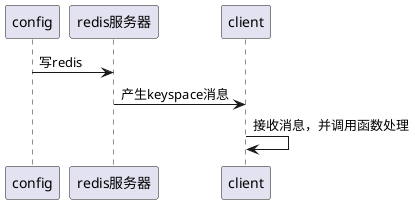
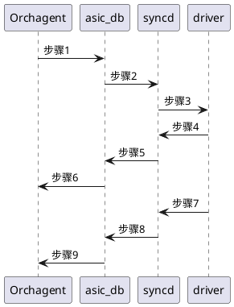

# SONiC架构分析

在传统交换机的架构下，网络操作系统由各设备厂商基于芯片厂商负责提供的ASIC芯片和SDK自行设计、开发，设备厂商需要开发上层APP、适配层以在特定设备商完成应用，实现各种网络功能。传统交换机的软硬件开发均由设备厂商提供，**系统完全封闭**，无法适应新功能快速开发部署的需求：

为构建一个开放的系统，OCP（Open Compute Project, 开发计算项目）开始推动硬件、网络操作系统开源与标准化进程。其中，SONiC (Software for Open Network in the Cloud) 是由微软于2016年发起，并在2017年贡献给OCP的项目。SONiC的所有软件功能模块都开源，这极大地推动了OCP社区以及其他厂商/用户在开放网络方面的创新。SONiC通过将SAI作为南北向互联的中间件，屏蔽不同ASIC之间的驱动差异，也正是由于SAI的存在，SONiC的网络功能应用才能够支持多个厂家的ASIC。络软件建立在交换机抽象接口（SAI，SAI接口适配ASIC的工作由各个厂家实现）上，使其可以运行在各种硬件设备中，形成白盒交换机软件生态链。


SONiC自推出后，迅速得到了产业界的支持，大部分网络芯片供应商都在SDK上支持SAI，并配合微软为SAI版本添加新的接口，如网络分析接口、L3快速重路由和BFD等。

## 系统架构

SONiC构建在Linux系统之上，并且利用键值数据库（redis）、容器技术（docker）、标准化硬件接口定义等技术，使其成为一个软硬件彻底解耦、软件模块松耦合（loose coupling）、高可靠、易于扩展、开源开放的网络软件系统。其架构特点主要体现在3个方面：

- **SAI接口**：SAI是SONiC的核心，并为SONiC提供了统一的API。设备厂家、网络开发者可以基于芯片厂家提供的SAI接口开发应用，而不需要关心底层硬件实现，加速产品迭代与创新；
- **数据库架构**：在数据库架构方面，SONiC使用数据库架构代替原有的模块化耦合架构，将应用模块之间的传递数据模式变成应用模块之间通过数据库进行数据交换的模式，从关注流程转变为关注数据，实现了功能模块之间的解耦。数据库成为了所有模块的枢纽，模块与模块之间解耦，数据库是稳定的，各个模块升级与故障不会影响其他模块，在整个切换过程中转发面不受到影响；
- **容器化组件**：容器化使得SONiC具有极高的可扩展性，网络运营管理人员能够快速引入第三方、专有或开源组件，而不对原有业务造成影响；
- **与内核交互少：** 运行在用户空间的SONiC系统，只有为数很少的模块（pmon、swss和syncd）与Linux内核之间存在交互关系，从而保证了系统的稳定性。


### 设计原则

- 软硬件解耦的理念和标准化的软硬件接口定义，分别让网络软件系统和硬件平台飞速发展；
- 网络软件系统的演进，也可以让快速迭代、按需定制、社区共建成为可能；
- 网络软件的开发形成了全新的共建、共享、开放的网络生态系统，快速推进网络自身的发展；
- 微软开源SONiC的同时，将自己在数据中心网络运营实践方面的经验也一并开放给了外界，everflow、netbouncer等功能就是SONiC软件里要支持的功能。这些功能的开放，是广大网络运维工程师的福音，让网络排障再也不仅仅只是依靠ping、traceroute或者纯人工经验，而是走向智能化和科学化；
- SONiC也提供了Ipv6的支持、Fast Reboot的功能，能够保证在升级的过程当中，数据平面的中断不超过30秒；
- 2018年，SONiC进一步引入了Warm Reboot功能，该功能可以把数据平面的中断‍‍控制在一秒之内，在很多现有的通用平台上，甚至能够做到无中断的升级。同时也‍‍引入了一些新的service，比如Streaming Telemetry‍‍和一些虚拟化的支持。

### 核心组件

- sonic-swss-common : 1.3万
- sonic-swss: 6万行
- sonic-sairedis ： 22万


CLI、REST FUL API、CFG Manager 配置 redis 数据库 CFG_DB，redis 通过 key-space 机制将修改的信息发布给 SWSS 中的各个 mgrd，**xxx-mgrd 调用linux命令**或者发送 netlink 消息，将信息同步给linux，成功后，**同时将信息插入到APP_DB的PORT_TABLE中**，portorch 订阅 APPL_DB中的PORT_TABLE，接收相关信息，处理加工，并更新ASIC_DB信息。

> 大部分组件的表都是redis hash表，同类型中不同的对象表的前缀相同，后缀不同，同一个哈希表中，不同的key对应不同的属性。

#### SWSS 容器

SWSS （switch state service）是一套工具，用于协调所有SONiC模块之间、模块与redis引擎之间的通信。swss还承载以下服务，这些服务通过netlink与SONiC应用层交互（在其他容器中运行的进程除外，即fpmsyncd、teamsyncd和lldp_syncd）。下面的前三个服务（portsyncd、intfsyncd、neighsyncd）将状态推送到redis引擎，而最后三个服务（orchagent、intfMgrd、vlanMgrd）从引擎收集状态，并重新发布状态到应用。

- portsyncd :侦听与端口相关的netlink事件。当交换机启动时，portsyncd解析交换机的硬件配置文件以获取物理端口信息，然后将收集的状态推送到APPL_DB中。portsyncd 设置端口速度、lane和MTU，并将状态注入状态数据库。
- intfsyncd ：侦听与接口相关的netlink事件，并将收集的状态推送到APPL_DB中。intfsyncd还管理与接口关联的新的或更改的IP地址等元素。
- neighsyncd ：侦听新发现的邻居由于ARP处理而触发的与邻居相关的netlink事件，并将收集的状态推送到APPL_DB中。neighsyncd管理诸如MAC地址和邻居地址族之类的属性，并最终构建数据平面中用于二级重写目的所需的邻接表。
- teamd: 链接聚合（LAG）容器，它提供了在SONiC交换机上配置绑定的功能。teamd服务是LAG协议的一个基于Linux的开源实现。teamsyncd服务管理teamd和southbound子系统之间的交互。
- orchagent ：swss子系统中最关键的组件。orchagent提取各种syncd服务注入的所有相关状态，相应地处理和发送这些信息，最后将其推送到ASIC_DB。orchagent在这些服务中是独一无二的，因为它既是消费者（如从APPL_DB获取状态）又是生产者（如推进ASIC_DB）。
- intfMgrd ：对来自APPL_DB、CONFIG_DB和state_DB的状态作出反应，以配置Linux内核中的接口，前提是所监视的任何数据库中没有冲突或不一致的状态。
- vlanMgrd ：对来自APPL_DB、CONFIG_DB和state_DB的状态作出反应，以在Linux内核中配置VLAN，前提是所监视的任何数据库中没有冲突或不一致的状态。

相关的模块功能角色总结如下：

- **xxx-mgrd** ： 对来自APPL_DB、CONFIG_DB和state_DB的状态作出反应，以配置linux内核中的接口。
- **xxx-syncd**： 侦听与内核相关的netlink事件，并将收集的状态写入APP_DB。
- **orchagent**： swss子系统中最关键的组件。orchagent提取各种syncd服务注入的所有相关状态，相应地处理和发送这些信息，最后将其推送到ASIC_DB。orchagent在这些服务中是独一无二的，因为它既是消费者（如从APPL_DB获取状态）又是生产者（如推进ASIC_DB）。

#### syncd 容器

将交换机的网络状态与ASIC同步，这包括ASIC当前状态的初始化、配置和收集。主要逻辑组件包括：

- syncd：执行同步逻辑的进程。在编译时，syncd与ASIC SDK库链接，并将从接口收集的状态注入ASIC。syncd订阅ASIC_DB以接收来自swss参与者的状态，并将来自硬件的状态推回ASIC_DB。
- SAI API：交换机抽象接口（SAI）定义了API，以提供独立于供应商的方式来控制转发元素，如交换ASIC、NPU或软件交换机。
- ASIC SDK：驱动ASIC所需SDK的SAI兼容实现。SDK钩住syncd，syncd 负责驱动其执行。

### 网络应用容器

- lldp：链路层发现协议容器，在其中运行以下进程：1) lldpd：LLDP服务，它与外部对等方建立LLDP连接，以公布和接收系统功能。2) lldp_syncd：此服务将lldp发现状态上载到redis引擎（集中式系统的消息基础结构），将lldp状态传递给需要它的应用程序，如SNMP。3) lldpmgr：lldpd服务的配置工具。
- snmp：承载snmp功能。此容器中有两个相关流程：1) snmpd：处理来自外部网络元素的传入SNMP轮询的服务器。2) snmp代理：这是SONiC对AgentX snmp子代理SONiC_ax_impl的实现。sonic_ax_impl子代理向主代理（snmpd）提供从集中式Redis引擎中的sonic数据库收集的信息。
- pmon: 此容器是Sensord 服务运行的地方。sensord定期记录硬件组件的传感器读数，并在触发报警时发出警报。pmon容器还承载fancontrol进程，该进程从相应的平台驱动程序收集与风扇相关的状态。
- bgp: 运行路由堆栈。BGP容器运行以下服务: 1) bgpd：标准的BGP服务。外部方的路由状态通过常规TCP或UDP套接字接收，并通过zebra/fpmsyncd接口向下推送到转发平面。2) zebra：传统的IP路由管理器。它提供内核路由表更新、接口查找和跨各种路由协议的路由重新分配服务。zebra还通过netlink将计算出的FIB向下推送到内核，并通过转发平面管理器（FPM）推送到转发过程中涉及的南向组件。3) fpmsyncd：此服务收集zebra生成的FIB状态，并将其内容转储到redis引擎内的应用程序数据库（APPL_DB）中。

## 内部通信模型

> [sonic消息传递机制2](https://segmentfault.com/a/1190000019893519)，[sonic消息传递机制3](https://segmentfault.com/a/1190000019893532)

SONiC使用了发布订阅机制与redis的键空间通知机制（当客户端修改数据时，redis服务器会通知其他相关订阅者（client）的数据变化）。

SONiC 中使用到的数据库如下：

- 0号数据库：APPL_DB，存储所有应用程序生成的状态——路由、下一跳、邻居等。这是应用程序与其他SONiC子系统交互的入口点;
- 1号数据库：ASIC_DB，存放底层 ASIC 的状态信息和配置表项，格式对底层芯片友好，芯片重启可以从ASIC_DB快速恢复；
- 2号数据库：CONTERS_DB，存放每个端口计数器和统计信息，这些信息可以被cli使用或者反馈给telemetry；
- 3号数据库：LOGLEVEL_DB，存放日志配置等级信息；
- 4号数据库：CONFIG_DB，存储SONiC应用程序创建的配置状态——端口配置、接口、VLAN等，有的APP/模块可能没有配置，可以没有对应表，有的配置直接调用linux的命令进行配置，有的配置还需要下发到芯片，这时需要往APPL_DB里写；
- 5号数据库：FLEX_COUNTER_DB，存放灵活计数器配置；
- 6号数据库：STATE_DB，存储系统中配置实体的“关键”操作状态。此状态用于解决不同SONiC子系统之间的依赖关系。例如，LAG端口channel（由teamd子模块定义）可能指系统中可能存在或不存在的物理端口。另一个例子是VLAN的定义（通过vlanmgrd组件），它可能引用系统中存在未知的端口成员。本质上，该数据库存储了解决跨模块依赖关系所需的所有状态。


### SubscriberStateTable

在SONiC中，**CONFIG_DB和STATE_DB之间的数据监听通过 key-space 机制实现**。key-space 机制的消费者通过 sonic-swss-common/common 中的 `SubscriberStateTable` 类实现。

对CONFIG_DB的修改一般用于对系统进行配置操作，如使用命令行来配置系统功能，SONiC在sonic-py-swsssdk组件中封装了对CONFIG_DB的操作，根据传递data是否为空执行hmset或delete操作。

这里以监听CONFIG_DB配置VLAN为例说明。

VlanMgr 组件在初始化时监听`CFG_VLAN_TABLE_NAME`和`CFG_VLAN_MEMBER_TABLE_NAME`两个 key-space 事件，当通过config命令（sonic cli）添加 vlan 100的操作时，redis服务器的 CONFIG_DB 会为“VLAN|Vlan100”的KEY产生 key-space事件消息， VlanMgr 组件收到后，调用 VlanMgr::doTask(Consumer &consumer) 处理。




收到消息后，这里的Consumer即是通过`orch类`封装过的 SubscriberStateTable 。

### NotificationProducer/Consumer

通过**消息队列**来传递信息，内容可以灵活定义。在 SONiC 中，该通信模型主要用于 SWSS容器中的 `orchagent` 与 syncd 容器中的之间的事件通知。

以FDB事件为例，SYNCD收到来自底层驱动的FDB事件，调用对数据库的hset或del操作更新ASIC_DB中的FDB表项，同时作为Notification生产者发送名为“fdb_event”的通知消息。
Notification的消费者流程在fdborch中实现，通知消息触发FdbOrch::doTask(NotificationConsumer&consumer)来进行后续处理，更新orchagent中的FDB信息。

## Producer/ConsumerStateTable

> sonic-swss-common 中 ProducerStateTable 与 ConsumerStateTable 实现

该机制通过一个set集合传递key，通过publish命令通知有新的key产生。消费者通过key组合成一个hash表的key，用于获取真实的消息，set不保证顺序，在publish通知KEY修改事件前允许对key-value进行多次操作，操作过程不保证执行顺序。这样做的好处是不必在每次设置key-value时都触发事件通知，可以提升处理效率，但对**orchagent**处理流程有一定要求。

**示例：**

```shell
## 在集合INTF_TABLE_KEY_SET中增加一个key
"SADD" "INTF_TABLE_KEY_SET" "PortChannel1:1.1.1.1/8"

## 在hash表INTF_TABLE:PortChannel1:1.1.1.1/8中添加内容
"HSET" "INTF_TABLE:PortChannel1:1.1.1.1/8" "scope" "global" 
"HSET" "INTF_TABLE:PortChannel1:1.1.1.1/8" "family" "IPv4"

## 通知订阅者频道 INTF_TABLE_CHANNEL 有消息，订阅者根据 INTF_TABLE_组合成 INTF_TABLE_KEY_SET 获取key，
## 然后，根据key获取hash表 INTF_TABLE:PortChannel1:1.1.1.1/8 的内容，如果该内容为空则表示删除操作，否则表示SET操作。
"PUBLISH" "INTF_TABLE_CHANNEL" "G"    
```

**Orchagent调度处理采用epoll事件通知模型，事件触发即会产生调度**；在调度处理中，可能出现因资源依赖等因素导致任务处理无法完成，此时可以选择将任务保留在m_toSync中等待下一次调度处理。在大规模控制表项和较复杂逻辑关系的场景下，这种调度机制可能出现因资源限制、依赖条件不满足等因素导致的频繁或无效调度，Asterfusion通过优化处理顺序、改进批量操作以及在STATE_DB中设置状态标志等改进方式，提高了组件运行效率并增强了可靠性。

### ProducerTable & ConsumerTable

使用redis publish 通知KEY修改事件，利用**Key-Value-Operate机制来传递信息**。该通信模型通过有序链表（list）来传递key-value-operate三元消息，一次操作在LIST中压入三个值(**通知订阅者进行消息处理，循环处理消息，一次必须从链表中拿出三个key**)，分别为key，value，operate。其中的 value 是把一个 hash表进行json编码后形成了一个单一的字符串，所以订阅者得到消息后需要进行解码还原，最后一个是操作类型。

> SYNCD 通过这种方式List队列获得 key-value-operation, 然后解码，写入到ASIC_STATE，同时调用底层SAI接口。

在SONiC中，该模型用于**围绕ASIC_DB和FLEX_COUNTER_DB的消息传递**。与模型3相比，该模型保证了操作的严格执行顺序，在 syncd 执行 SAI API 调用时保证了对底层ASIC的操作时序。

**示例：**

```shell
"LPUSH" "ASIC_STATE_KEY_VALUE_OP_QUEUE" "SAI_OBJECT_TYPE_ROUTE_ENTRY:{\"dest\":\"1.1.1.0/24\",\"switch_id\":\"oid:0x21000000000000\",\"table_id\":\"oid:0x0\",\"vr\":\"oid:0x3000000000043\"}" "[\"SAI_ROUTE_ENTRY_ATTR_PACKET_ACTION\",\"SAI_PACKET_ACTION_FORWARD\",\"SAI_ROUTE_ENTRY_ATTR_NEXT_HOP_ID\",\"oid:0x600000000063a\"]" "Screate"

## 通知订阅者进行消息处理，循环处理消息，一次必须从链表中拿出三个key
"PUBLISH" "ASIC_STATE_CHANNEL" "G"  
```

### 与内核的通信方式

网络接口事件和路由等需要SONiC应用程序与Linux内核通信，主要通过两种方式：

- 调用Linux工具命令， 如调用ip命令配置网络接口IP地址和设置VRF，又如调用bridge命令配置VLAN。用封装的swss::exec方法最终通过popen执行拼装好的command指令。
- 对netlink消息操作则是通过以libnl库为基础封装的NetLink类来完成，同时SWSS也定义了一套NetDispatcher机制来实现netlink消息监听和分发处理。

## teamd 聚合组配置


### 配置

teamdmgrd 负责配置过程。

- CLI创建名称为PortChannel0001的聚合组,加入聚合组成员口Ethernet0和Ethernet4，在CONFIG_DB中生成配置表项；


- teamdmgrd 进程监听相应键值变化，调用doLagTask和doLagMemberTask方法处理。a）doLagTask方法**解析参数并生成所需的配置文件conf**，通过调用teamd命令创建并配置聚合组，并**调用ip命令设置聚合组接口MAC地址和管理状态**；b) doLagMemberTask方法中先判断聚合组及待加入聚合组成员接口状态是否满足要求，如果满足则**调用teamdctl和ip命令来配置聚合成员接口**，这里会将聚合成员口设置为down，否则挂起当前任务后续再处理；


- teamdmgrd作为生产者将聚合组和成员的配置信息写入APPL_DB。
- portsorch作为消费者订阅APP_LAG_TABLEAPP_LAG_MEMBER_TABLE进行处理。


- portsorch调用sairedis的API，检查参数类型合法性并将LAG配置信息写入ASIC_DB。
- SYNCD订阅ASIC_DB中的LAG相关表项并处理。


- SYNCD调用ASIC SDK对SAI API的实现，并通过ASICdriver下发到底层芯片。

### 聚合过程

teamsyncd 负责聚合过程：

- teamsyncd初始化阶段注册监听RTM_NEWLINK和RTM_DELLINK类型的netlink消息，同时也会注册teamd的操作handler，用于处理teamd聚合成员口状态变化以及teamd参数变化触发的事件。a) 一类是netlink消息，当触发NEWLINK或DELLINK时对应操作STATE_LAG_TABLE设置聚合组状态；b) 另一类是teamd状态变化消息，当teamd通过LACP交互及内部状态机产生聚合成员口状态变化，调用TeamSync::TeamPortSync::onChange进行处理。
- teamd感知聚合成员口发生状态变化，teamsyncd从teamd获取当前聚合成员列表和状态，与变化前的聚合成员列表进行比较。如果聚合成员已存在且状态发生变化，则直接修改相应的APP_LAG_MEMBER_TABLE成员状态，如果成员列表发生变化，则向APP_LAG_MEMBER_TABLE添加新增的成员口并设置成员状态以及删除不存在的成员口。
  
- portsorch作为消费者订阅APP_LAG_MEMBER_TABLE进行处理，根据聚合成员口状态设置SAI_LAG_MEMBER_ATTR_INGRESS_DISABLE和SAI_LAG_MEMBER_ATTR_EGRESS_DISABLE，决定是否允许通过该成员口接收流量以及从该成员口发送流量。
- portsorch 调用sairedis的API，并更新LAG Member配置表项及属性到ASIC_DB。
  
- SYNCD订阅ASIC_DB中的LAG Member表项并处理。
- 调用ASIC SDK对SAI API的实现，并通过ASIC driver下发到底层芯片。

## 端口状态交互

### 端口初始化

如下图所示，展示了公开系统中对生成或使用端口相关信息感兴趣的多个组件：


- **建立连接，声明角色：**初始化期间，portsyncd与redis引擎中的主数据库建立通信通道。Portsyncd声明它打算充当APPL_DB和STATE_DB的发布者，以及CONFIG_DB的订户。同样，portsyncd还订阅负责承载端口/链路状态信息的系统netlink通道。
- **解析配置：**Portsyncd首先解析与系统中使用的硬件配置文件/sku关联的端口配置文件（port_config.ini）（有关更多详细信息，请参阅配置部分）。与端口相关的信息，如通道、接口名称、接口别名、速度等，通过该通道传输到APPL_DB。
- **转换到ASIC_DB：**Orchagent听到所有这些新状态，但将推迟对其进行操作，直到portsyncd通知它已完全完成对port_config.ini信息的解析。一旦发生这种情况，orchagent将继续初始化硬件/内核中相应的端口接口。Orchagent调用sairedis API，通过常用的ASIC_DB接口将此请求传递给syncd
- **创建端口：**Syncd通过ASIC_DB接收此新请求，并准备调用满足Orchagent请求所需的SAI API。Syncd使用SAI API+ASIC SDK创建与正在初始化的物理端口相关联的内核主机接口。
- **更新状态：**上一步生成netlink消息，被portsyncd接收，并与先前从port_config.ini（步骤1）解析的所有端口进行对比，若都完成，则声明“初始化”过程已完成。portsyncd 将写入一个条目到 STATE_DB 中，表示端口初始化完成。
- **依赖使用：**从现在起，以前订阅STATE_DB content的应用程序将收到一个通知，允许这些应用程序开始使用它们所依赖的端口。换句话说，如果在STATE_DB中找不到特定端口的有效条目，则任何应用程序都无法使用它。

### 端口状态变化


- 当端口状态发生变化时，驱动通过syncd注册的函数通知syncd
- syncd调用通知函数发送事件给 ASIC_DB
- Orchagent 通过notification 线程监听ASIC_DB事件，执行端口状态变化函数：1）产生APPL_DB更新消息，通知上层应用；2）调用sairedis API以提醒syncd需要更新与所选端口的主机接口关联的内核状态，orchagent再次通过常用的ASIC_DB接口将此请求传递给syncd
- Syncd使用SAI API+ASIC SDK将受影响主机接口状态（关闭）更新;
- portsyncd接收到与上一步相关的netlink消息，由于所有SONiC组件现在都完全知道端口关闭事件，因此该消息将被悄悄丢弃。

## 路由状态交互

在本节中，我们将迭代SONiC中发生的一系列步骤，以处理从eBGP对等方接收到的新路由。我们将假设此会话已经建立，并且我们正在学习一种新的路由，该路由使用直接连接的对等方作为其下一跳。


（0）在BGP容器初始化期间，zebra通过常规TCP套接字连接到fpmsyncd。在稳定/非瞬态条件下，zebra、linux内核、APPL_DB和ASIC_DB中保存的路由表应完全一致/等效。
（1） 一个新的TCP包到达内核空间中bgp的套接字。内核的网络堆栈最终将相关的有效负载交付给bgpd进程。
（2） Bgpd解析新数据包，处理bgp更新，并通知zebra此新前缀及其关联协议下一跳的存在。
（3） zebra确定此前缀的可行性/可达性（例如，现有转发nh）后，zebra生成路由netlink消息，将此新状态注入内核。
（4） Zebra利用FPM接口将此netlink路由消息传递给fpmsyncd。
（5） Fpmsyncd处理netlink消息并将此状态推送到APPL_DB。
（6） 作为APPL_DB消费者，它将接收先前推送到APPL_DB的信息内容。
（7） 在处理接收到的信息后，orchagentd将调用sairedis API将路由信息注入ASIC_DB。
（8） 当与ASIC_DB消费者同步时，它将接收orchagentd生成的新状态。
（9） Syncd将处理该信息并调用SAI API将该状态注入相应的asic驱动程序。
（10） 新的路线最终被推到了硬件上。

## LLDP状态交互


- （0）lldpmgrd进程启动时订阅STATE_DB数据中物理口的状态，周期性获取接口最新状态。基于这些信息，lldpd(及其网络对等方)将随时了解系统端口状态的更改以及影响其操作的任何配置更改
- （1）内核收到lldp报文后会分发给lldp进程去处理
- （2）lldp解析LLDP报文获取最新状态，lldp_syncd周期性执行lldpctl cli获取该最新状态
- （3）lldp_syncd把最新的状态写入APPL_DB数据库中的LLDP_ENTRY_TABLE表
- （4）其他监听这张表的app就能获取lldp的最新状态了

## syncd 组件

> syncd 通过注册回调函数与driver通信，syncd和sai共享命名空间。syncd 启动线程监听共享队列，处理driver的通知。

syncd 进程是介于orchagent与driver之间的进程。syncd从asic-db中读取的数据经转换后调用驱动提供的sai接口下发到硬件，同时需要将驱动的应答进行一定的处理，还需要处理驱动的事件通知(比如端口up/down，mac老化等信息)。处理的消息如下图所示:




### orchagent 写操作

**create，remove，set写操作**：异步写。orchagent会在 sairedis 层构建一个虚拟的sai层:sairedis。orchagent执行sai接口只是对asic-db进行操作，生成或者删除虚拟对象(vid)。默认所有操作都是成功的，直接返回，不等待syncd的应答。执行上图的1和6。syncd从asic-db中读出请求执行上图的2,3,4。如果4步骤返回成功，则整个请求运行结束，否则，syncd将会发送shutdown通知给orchagent。orchagent会退出，如上图的5,6；

### orchagent 读操作

**get 读操作**：同步读。orchagent执行1后会使用select阻塞等待syncd的应答，如果syncd在60分钟内没有应答，那么orchagent会产生segment退出。get操作执行顺序为1->2->3->4->5->6。

```cpp
// sonic-sairedis/lib/src/sai_redis_generic_get.cpp:257:sai_status_t redis_generic_get(
sai_status_t redis_generic_get() {
// ...
// internal_redis_generic_get
    std::string str_object_type = sai_serialize_object_type(object_type);
    std::string key = str_object_type + ":" + serialized_object_id;

    // 写入本次get事件，不会写输入到asic数据库，只是加入到队列中
    g_asicState->set(key, entry, "get");

    // 创建临时 select，添加事件，等待响应
    swss::Select s;
    s.addSelectable(g_redisGetConsumer.get());
    //循环等待syncd的应答
    while (true)
    {
        swss::Selectable *sel;
        //阻塞等待，时间为GET_RESPONSE_TIMEOUT  
        int result = s.select(&sel, GET_RESPONSE_TIMEOUT);
        //只处理应答情况OBJECT
        if (result == swss::Select::OBJECT) {
            swss::KeyOpFieldsValuesTuple kco;
            g_redisGetConsumer->pop(kco);

            const std::string &op = kfvOp(kco);
            const std::string &opkey = kfvKey(kco);


            if (op != "getresponse") // ignore non response messages
            {
                continue;
            }

            sai_status_t status = internal_redis_get_process(
                    object_type,
                    attr_count,
                    attr_list,
                    kco);
           
            return status;
        }
        break;
    }
    //超时和异常都返回SAI_STATUS_FAILURE
    return SAI_STATUS_FAILURE;
}
```

> 对于get操作，当syncd比较忙的时候，极端情况下会导致orchagent异常退出。

### 获得driver通知

**driver的notify：** 驱动检测到硬件事件后，调用syncd注册的回调函数通知syncd，将相关事件写入队列。syncd中有一个专门处理driver-notify的线程ntf-thread。ntf-thread解析driver的notify，然后通过asic-db通知orchagent （orchagent会在主进程的select中监听asic-db。）。执行顺序7->8->9。

> 注： orchagent 与syncd关于sai这一层非常相似。它们会调用大量的同名函数。这些函数只是名字相同，orchagent调用的是sai-redis库中的函数，而syncd调用的是driver提供的sai库

- syncd向驱动注册回调函数，syncd定义了几个notify全局函数指针

```cpp
sai_switch_state_change_notification_fn     on_switch_state_change_ntf = on_switch_state_change;
sai_switch_shutdown_request_notification_fn on_switch_shutdown_request_ntf = on_switch_shutdown_request;
sai_fdb_event_notification_fn               on_fdb_event_ntf = on_fdb_event;
sai_port_state_change_notification_fn       on_port_state_change_ntf = on_port_state_change;
sai_packet_event_notification_fn            on_packet_event_ntf = on_packet_event;
sai_queue_pfc_deadlock_notification_fn      on_queue_deadlock_ntf = on_queue_deadlock;
```

syncd和sai共享命名空间，所以驱动直接使用这些函数指针即可调用对应的函数，在初始化的时候将这些全局函数指针通过驱动提供的`sai_set_switch_attribute`函数设置到sai层。

```cpp
/*
* Routine Description:
*    Set switch attribute value
*
* Arguments:
 *   [in] switch_id Switch id
*    [in] attr - switch attribute
*
* Return Values:
*    SAI_STATUS_SUCCESS on success
*    Failure status code on error
*/
sai_status_t sai_set_switch_attribute(_In_ sai_object_id_t switch_id,
                                      _In_ const sai_attribute_t *attr) {

  sai_status_t status = SAI_STATUS_SUCCESS;
  switch_status_t switch_status = SWITCH_STATUS_SUCCESS;
  switch_uint64_t flags = 0;
  switch_api_device_info_t api_device_info;
  sai_packet_action_t sai_packet_action;
  switch_acl_action_t switch_packet_action;
  switch_packet_type_t switch_packet_type = SWITCH_PACKET_TYPE_UNICAST;
  bool cut_through = false;

  if (!attr) {
    status = SAI_STATUS_INVALID_PARAMETER;
    SAI_LOG_ERROR("null attribute: %s", sai_status_to_string(status));
    return status;
  }

  memset(&api_device_info, 0x0, sizeof(api_device_info));
  if (status != SAI_STATUS_SUCCESS) {
    return status;
  }
  if (attr->id <= SAI_SWITCH_ATTR_ACL_STAGE_EGRESS) {  // Unsupported
    SAI_LOG_DEBUG("Switch attribute set: %s", switch_attr_name[attr->id]);
  }

  switch (attr->id) {
    //......
        
    case SAI_SWITCH_ATTR_FDB_EVENT_NOTIFY:
      sai_switch_notifications.on_fdb_event = attr->value.ptr;
      break;
    case SAI_SWITCH_ATTR_PORT_STATE_CHANGE_NOTIFY:
      sai_switch_notifications.on_port_state_change = attr->value.ptr;
      break;
    case SAI_SWITCH_ATTR_PACKET_EVENT_NOTIFY:
      sai_switch_notifications.on_packet_event = attr->value.ptr;
      break;
    case SAI_SWITCH_ATTR_SWITCH_STATE_CHANGE_NOTIFY:
      sai_switch_notifications.on_switch_state_change = attr->value.ptr;
      break;
    case SAI_SWITCH_ATTR_SHUTDOWN_REQUEST_NOTIFY:
      sai_switch_notifications.on_switch_shutdown_request = attr->value.ptr;
      break;
    ......

    default:
      SAI_LOG_ERROR("Unsupported Switch attribute: %d", attr->id);
      // Unsupported: Temporary hack till all attrs are supported
      switch_status = SWITCH_STATUS_SUCCESS;
  }
  //......
}
```

sai接口初始化的时候会向驱动注册回调函数，回调函数中会调用我们注册的全局函数指针，我们以fdb为例进行说明：

```cpp
sai_status_t sai_fdb_initialize(sai_api_service_t *sai_api_service) {
  sai_api_service->fdb_api = fdb_api;
  switch_uint16_t mac_event_flags = 0;
  mac_event_flags |= SWITCH_MAC_EVENT_LEARN | SWITCH_MAC_EVENT_AGE |
                     SWITCH_MAC_EVENT_MOVE | SWITCH_MAC_EVENT_DELETE;
  //初始化fdb的sai接口的时候，向驱动注册了 sai_mac_notify_cb 回调函数。
  switch_api_mac_notification_register(
      device, SWITCH_SAI_APP_ID, mac_event_flags, &sai_mac_notify_cb);
  switch_api_mac_table_set_learning_timeout(device, SAI_L2_LEARN_TIMEOUT);
  return SAI_STATUS_SUCCESS;
}

static void sai_mac_notify_cb(const switch_device_t device,
                              const uint16_t num_entries,
                              const switch_api_mac_entry_t *mac_entry,
                              const switch_mac_event_t mac_event,
                              void *app_data) {
  SAI_LOG_ENTER();
  sai_fdb_event_notification_data_t fdb_event[num_entries];
  sai_attribute_t attr_lists[num_entries][2];
  uint16_t entry = 0;

  for (entry = 0; entry < num_entries; entry++) {
    memset(&fdb_event[entry], 0, sizeof(fdb_event[entry]));
    fdb_event[entry].event_type = switch_mac_event_to_sai_fdb_event(mac_event);
    memcpy(fdb_event[entry].fdb_entry.mac_address,
           mac_entry[entry].mac.mac_addr,
           ETH_ALEN);
    fdb_event[entry].fdb_entry.switch_id =
        (((unsigned long)SWITCH_HANDLE_TYPE_DEVICE)
         << SWITCH_HANDLE_TYPE_SHIFT) |
        0x1;
    fdb_event[entry].fdb_entry.bv_id = mac_entry[entry].network_handle;

    memset(attr_lists[entry], 0, sizeof(attr_lists[entry]));
    attr_lists[entry][0].id = SAI_FDB_ENTRY_ATTR_TYPE;
    attr_lists[entry][0].value.s32 = SAI_FDB_ENTRY_TYPE_DYNAMIC;
    attr_lists[entry][1].id = SAI_FDB_ENTRY_ATTR_BRIDGE_PORT_ID;
    attr_lists[entry][1].value.oid = mac_entry->handle;
    fdb_event[entry].attr_count = 2;
    if (fdb_event[entry].event_type == SAI_FDB_EVENT_FLUSHED) {
      // Overwriting now for SONiC to be able to process it correctly
      fdb_event[entry].event_type = SAI_FDB_EVENT_AGED;
    }
    fdb_event[entry].attr = attr_lists[entry];
  }
  //调用syncd的回调函数
  sai_switch_notifications.on_fdb_event(num_entries, fdb_event);
  return;
}
```

### syncd 启动 notify 线程

```cpp
std::shared_ptr<std::thread> ntf_process_thread;

void startNotificationsProcessingThread()
{
    runThread = true;
    ntf_process_thread = std::make_shared<std::thread>(ntf_process_function);
}

void ntf_process_function()
{
    while (runThread) {
        cv.wait(ulock);
        // this is notifications processing thread context, which is different
        // from SAI notifications context, we can safe use g_mutex here,
        // processing each notification is under same mutex as processing main
        // events, counters and reinit
        swss::KeyOpFieldsValuesTuple item;
        while (tryDequeue(item))//从队列中取出notify
        {
            processNotification(item);//处理notify
        }
    }
}

bool tryDequeue(
        _Out_ swss::KeyOpFieldsValuesTuple &item)
{
    std::lock_guard<std::mutex> lock(queue_mutex);
    if (ntf_queue.empty()) {
        return false;
    }
    item = ntf_queue.front();
    ntf_queue.pop();
    return true;
}

void processNotification (
        _In_ const swss::KeyOpFieldsValuesTuple &item)
{
    std::lock_guard<std::mutex> lock(g_mutex);

    SWSS_LOG_ENTER();

    std::string notification = kfvKey(item);
    std::string data = kfvOp(item);

    if (notification == "switch_state_change") {
        handle_switch_state_change(data);
    } else if (notification == "fdb_event") {
        handle_fdb_event(data);
    }
    else if (notification == "port_state_change")
    {
        handle_port_state_change(data);
    }
    else if (notification == "switch_shutdown_request")
    {
        handle_switch_shutdown_request(data);
    }
    else if (notification == "queue_deadlock")
    {
        handle_queue_deadlock(data);
    }
    else
    {
        SWSS_LOG_ERROR("unknow notification: %s", notification.c_str());
    }
}

// 以 fdb 为例
void handle_fdb_event(
        _In_ const std::string &data)
{
    SWSS_LOG_ENTER();
    uint32_t count;
    sai_fdb_event_notification_data_t *fdbevent = NULL;
    sai_deserialize_fdb_event_ntf(data, count, &fdbevent);
    process_on_fdb_event(count, fdbevent);
    sai_deserialize_free_fdb_event_ntf(count, fdbevent);
}

void process_on_fdb_event(
        _In_ uint32_t count,
        _In_ sai_fdb_event_notification_data_t *data)
{
    for (uint32_t i = 0; i < count; i++) {
        sai_fdb_event_notification_data_t *fdb = &data[i];
        fdb->fdb_entry.switch_id = translate_rid_to_vid(fdb->fdb_entry.switch_id, SAI_NULL_OBJECT_ID);
        fdb->fdb_entry.bv_id = translate_rid_to_vid(fdb->fdb_entry.bv_id, fdb->fdb_entry.switch_id);
        translate_rid_to_vid_list(SAI_OBJECT_TYPE_FDB_ENTRY, fdb->fdb_entry.switch_id, fdb->attr_count, fdb->attr);

        /*
         * Currently because of bcrm bug, we need to install fdb entries in
         * asic view and currently this event don't have fdb type which is
         * required on creation.
         */
        redisPutFdbEntryToAsicView(fdb);
    }

    std::string s = sai_serialize_fdb_event_ntf(count, data);
    send_notification("fdb_event", s);
}

void send_notification(
        _In_ std::string op,
        _In_ std::string data,
        _In_ std::vector<swss::FieldValueTuple> &entry)
{
    //写入数据库
    notifications->send(op, data, entry);
}

void send_notification(
        _In_ std::string op,
        _In_ std::string data)
{
    SWSS_LOG_ENTER();

    std::vector<swss::FieldValueTuple> entry;

    send_notification(op, data, entry);
}
```

### syncd与SDE交互


在SONiC中，syncd容器是与ASIC通信的唯一通道，控制面的业务进程想将数据下发ASIC时，最终处理流程都是将数据按照SAI标准接口格式写入Redis中的ASIC_DB，syncd容器中的同名主进程syncd订阅ASIC_DB中的相关表项并处理这些下发的数据，调用ASIC SDK对SAI API的实现，并通过ASIC driver下发到ASIC。

其中SDE就包括了ASIC SDK以及运行在Tofino ASIC上的tofino.bin（由P4源码编译生成的二进制程序）。

## mgmt-framework

https://github.com/Azure/sonic-mgmt-framework
https://github.com/Azure/SONiC/blob/master/doc/mgmt/Management Framework.md

mgmt-framework 负责提供各种通用北向接口（North Bound Interfaces , NBI），用于**管理SONiC交换机的配置和状态**。
管理框架利用golang编写的翻译库（Translib）将向管理客户机公开的数据模型转换为Redis ABNF模式格式。

## 配置

登录设备后，SONiC软件可以通过三种方式进行配置：

- Command Line Interface （CLI）
- config_db.json
- minigraph.xml

## 测试框架

[Sonic测试研究（一）：测试架构介绍](https://www.sdnlab.com/24021.html)

## FAQ

### SONiC 未来的发力方向？

Chassis、Kubernetes、AI agent、Test Infrastructure


### SONiC 目前的商用情况？

‍‍到2020年为止，SONiC现在‍‍已经被超过10个的云运营商‍‍以及大型企业所采纳。以‍‍微软的Azure network为例，现在‍‍已经做到了新装机完全采取SONiC。SONiC历经多年，被很多运营商‍‍采用，现在SONiC的技术非常成熟和稳定了，截止到2020年初，‍‍据微软不完全统计，SONiC的装机容量已经接近400万个端口。Criteo （该公司目前的核心业务是重定向广告）所有新增装机都采用 SONiC。

SONiC是开源的，这样‍‍能够获得全球性的支持和全球性的供应链，其次，由于现在SONiC已经有了很多‍‍供应商和‍‍企业用户，也就表明SONiC获得了业界的共同承认，SONiC已经是一个稳定成熟的解决方案，对于降低组网‍‍和管理的复杂度‍‍非常有效。

### SONiC有统一的命令行入口么？

SONiC有命令行，但伴随模块的功能分散存在，没有统一的入口，并且有些模块的命令行缺少交互界面。命令行库见：https://github.com/Azure/sonic-utilities/

### SONiC支持API接口么？

SONiC有一个原生RESTAPI框架，基于Golang实现，但功能仅有VLAN、VLAN interface、VXLAN tunnel、路由，功能上侧重业务。

### SONiC是全开源的么？

SONiC不是全开源的，交换芯片适配部分，仅提供二进制格式。这主要受限于芯片厂商的License保护，微软也不能直接开源。

### 组件为什么需要容器化？

容器化可以屏蔽不同组件之间的**依赖冲突，版本限制**，实现不影响的故障、恢复、升级。

### Switchdev 与SONiC 区别？

1）感觉其思路不一样: SONiC 把 交换机当交换机，switchdev 是把交换机当网卡（如1822），利用开放的Linux网络工具管理交换机；
2）SONiC 包括SAI接口、较重的容器化管理框架等，设备驱动由厂商SDK提供。 switchdev 框架包括Linux内核（统一定义的接口）、驱动和应用等方面，大部分由厂家实现在内核中，对于用户较轻量，使用起来像使用网卡一样。


## 参考

- [sonic消息传递机制与架构(2)](https://segmentfault.com/a/1190000019893519)
- [sonic-utilities](https://github.com/Azure/sonic-utilities/blob/master/doc/Command-Reference.md)
- [ouyangxibao 的segmentfault](https://segmentfault.com/u/ouyangxibao###)
- [docs-nvidia-system-architecture](https://docs.nvidia.com/networking-ethernet-software/sonic-202012/Getting-Started/System-Architecture/)
- [sonic orchagent与syncd之间的请求与应答](https://segmentfault.com/a/1190000019735582)
- [连接SONiC与P4交换芯片的SDE](https://mp.weixin.qq.com/s?__biz=MzU2NjQ1OTE3Mw==&mid=2247495211&idx=1&sn=9ab69d01f6ec07b5d7ce0887bd9fd39a&chksm=fcae8061cbd9097719e9b4c035272809a8226013a9861a63e269342526a862974e71b5cd5ebb&scene=132#wechat_redirect)
- [详解：SONiC演进四部曲](https://cloud.tencent.com/developer/article/1695082)
- [微软解颖：SONiC Update 2020](https://cloud.tencent.com/developer/article/1705672)
- [SONiC Warm Reboot](https://icode9.com/content-4-907267.html)
- [京东网络开放之路——自研交换机探索与实践](https://developer.jdcloud.com/article/108)
- [微软解颖：SONiC Update 2020](https://cloud.tencent.com/developer/article/1705672)
- [RESTAPI在SONiC中的实现](https://mp.weixin.qq.com/s?__biz=MzU2NjQ1OTE3Mw==&mid=2247488474&idx=1&sn=c4eefa66d96d23b2ad3d09987db5ace7)
- [一文了解SONiC内部通信模型](https://mp.weixin.qq.com/s?__biz=MzU2NjQ1OTE3Mw==&mid=2247486948&idx=1&sn=c088e1e5557e455eedd6bfa8af2190fa)
- [SONi CSoftwareSubsystemsOverview-OCP-workshop 2018](https://f990335bdbb4aebc3131-b23f11c2c6da826ceb51b46551bfafdc.ssl.cf2.rackcdn.com/images/1d66e872946c15dc71031301994daba0cf21512f.pdf)
- [SONiC Application DB schema format](https://github.com/Azure/sonic-swss/blob/master/doc/swss-schema.md)
- [SONiC官网](https://azure.github.io/SONiC/)
- [SONiC官方wiki](https://github.com/Azure/SONiC/wiki)


> Source: https://www.cnblogs.com/kekukele/p/15404117.html#sonic-%E6%9C%AA%E6%9D%A5%E7%9A%84%E5%8F%91%E5%8A%9B%E6%96%B9%E5%90%91
