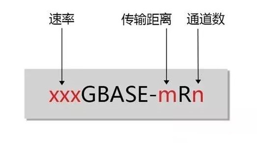
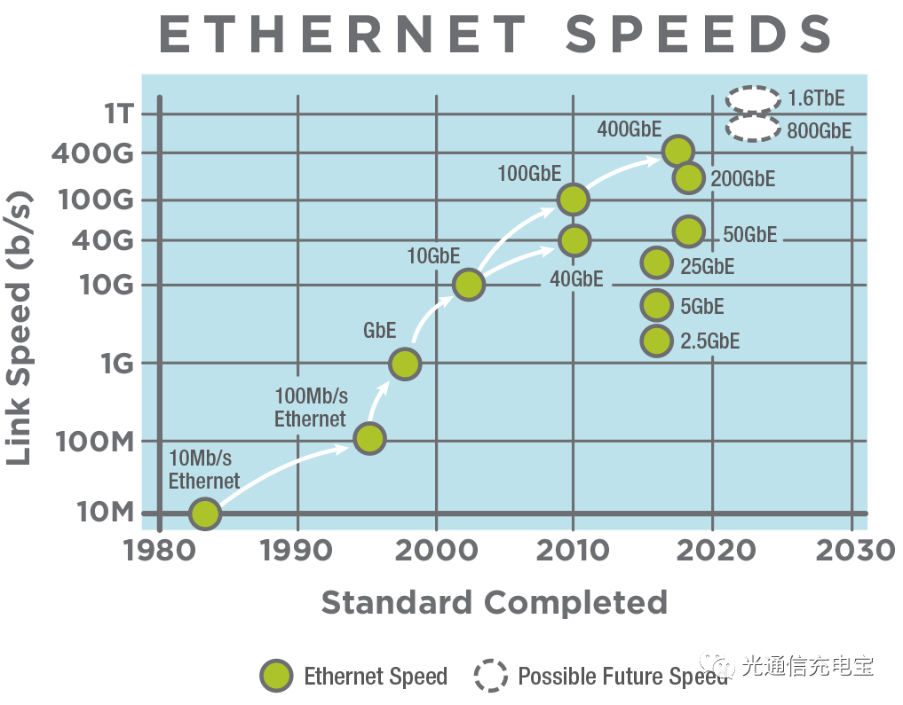
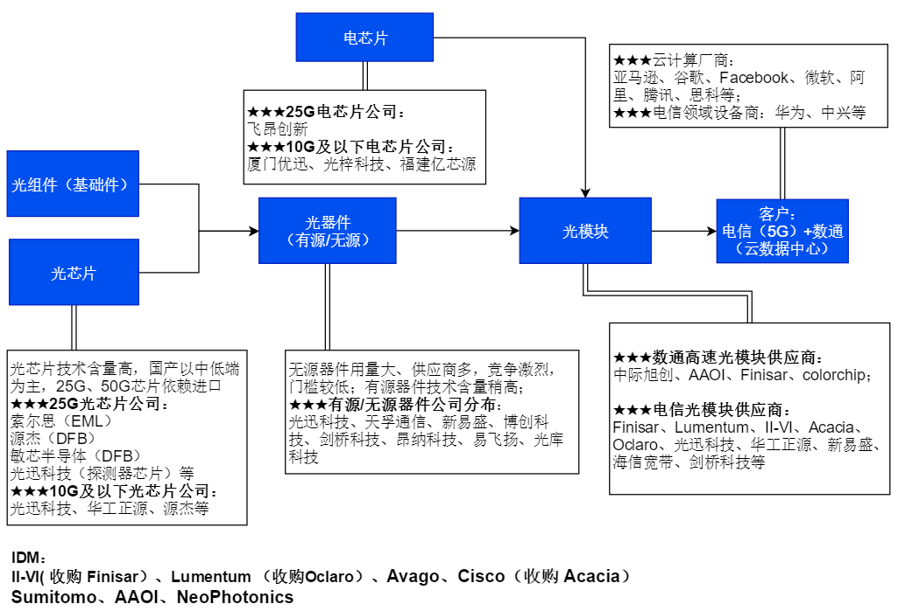
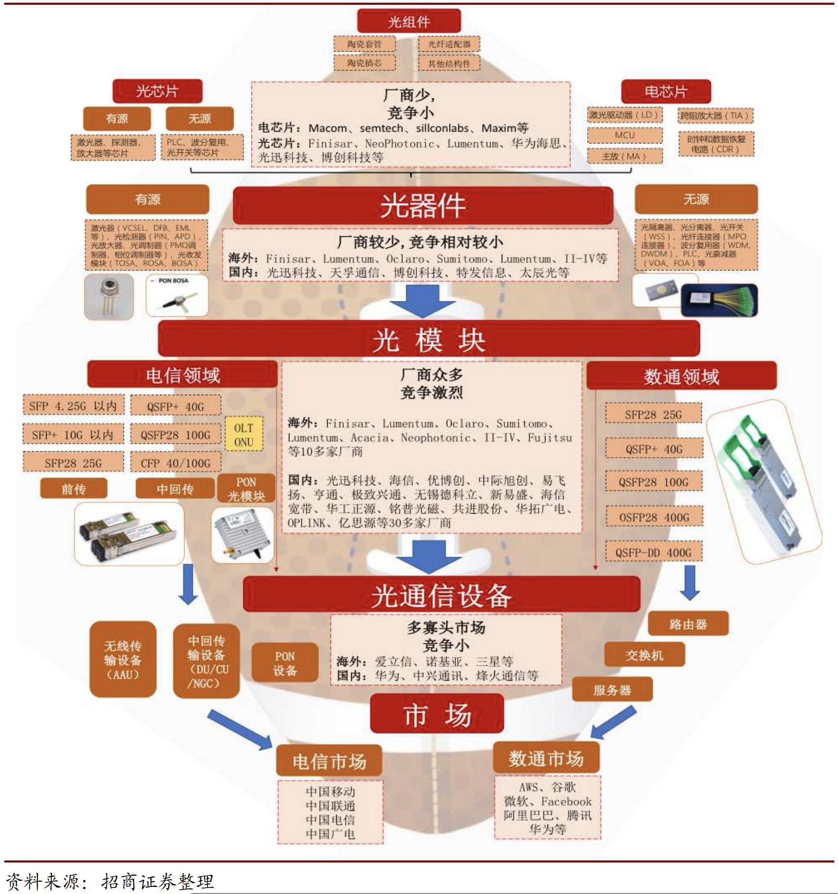
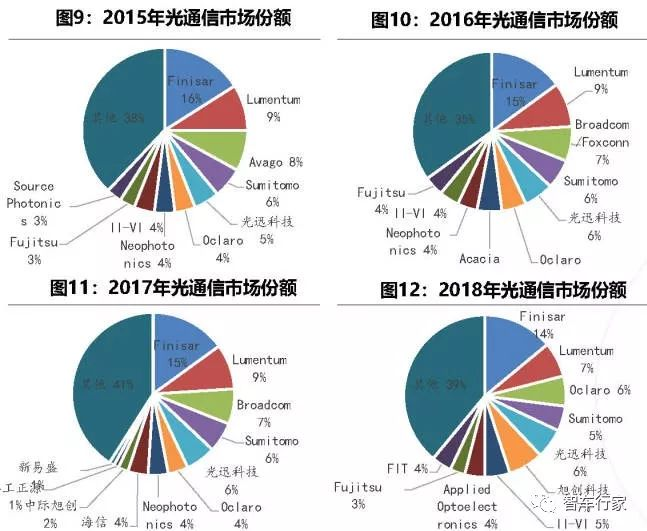
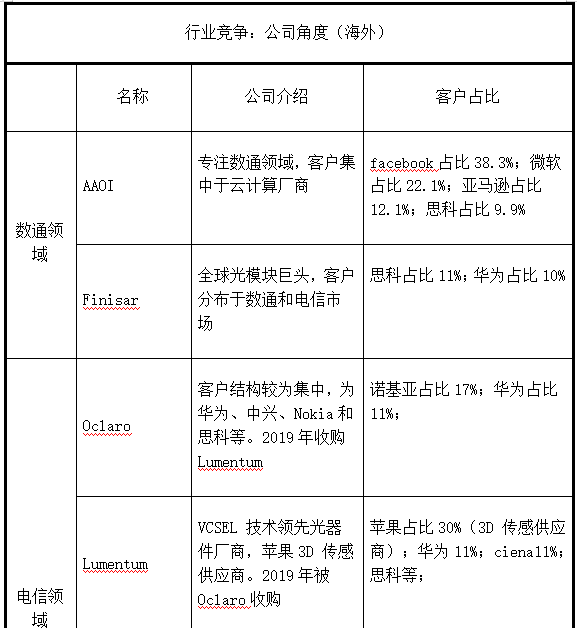
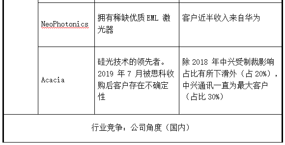
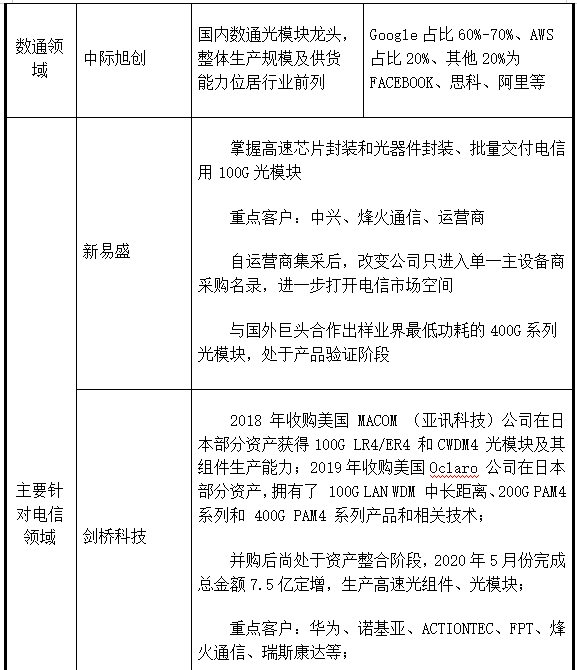
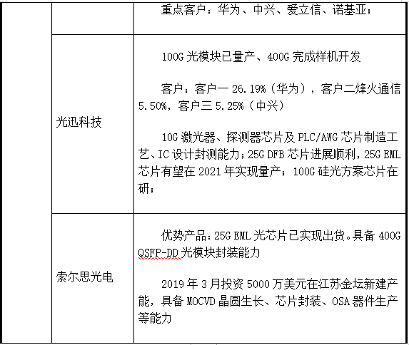

# 光模块

## 什么是光模块：

光模块(**Optical Module**)作为光纤通信中的重要组成部分，是实现**光电转换和电光转换功能**的光电子器件。

准确来说，光模块是几种类别的模块的统称，具体包括：**光发送模块**Transmitter、**光接收模块**Receiver、**光收发一体模块**Transceiver和**光转发模块**Transponder。通常我们所说的光模块，一般是指光**收发一体模块**（下同）。

## 工作原理：

光模块工作在OSI模型的物理层，是光纤通信系统中的核心器件之一。它主要由光电子器件（光发射器、光接收器）、功能电路和光（电）接口等部分组成，主要作用就是实现光纤通信中的光电转换和电光转换功能。


图：光模块原理图

基本原理：发送接口输入一定码率的电信号，经过内部的驱动芯片处理后由驱动半导体激光器（LD）或者发光二极管（LED）发射出相应速率的调制光信号，通过光纤传输后，接收接口再把光信号由光探测二极管转换成电信号，并经过前置放大器后输出相应码率的电信号。

## 光模块关键参数指标

光模块的关键技术指标主要包含：**发送光功率**、**接收光功率**、过载光功率、接收灵敏度最大值、消光比。

- **接收光功率：**发送光功率指光模块在正常工作条件下发送端光源输出的光功率，可以理解为光的强度，单位为W或mW或dBm。其中W或mW为线性单位，dBm为对数单位。在通信中，**我们通常使用dBm来表示光功率**，0dBm的光功率对应1mW。

- **接收光功率**：接收光功率指光模块在一定的误码率（BER=10-12）条件下，接收端组件能接收的平均光功率范围。上限值为过载光功率，下限值为接收灵敏度最大值。

- **过载光功率：** 又称饱和光功率，指的是在一定的传输速率下，维持一定的误码率（BER=10-12）时接收端组件所能接收的最大输入平均光功率，单位：dBm。

  > 需要注意的是，光探测器在强光照射下会出现光电流饱和现象，当出现此现象后，探测器需要一定的时间恢复，此时接收灵敏度下降，接收到的信号有可能出现误判而造成误码现象，而且还非常容易损坏接收端探测器，在使用操作中应**尽量避免强光照射**，防止超出饱和光功率。

- **接收灵敏度最大值：** 接收灵敏度指的是在一定的传输速率下，维持一定的误码率（BER=10-12）时接收端组件所能接收的最小平均输入光功率，单位：dBm。

  > 一般情况下，**速率越高接收灵敏度越差，即最小接收光功率越大，对于光模块接收端器件的要求也越高。**

- 消光比：消光比（Extinction Ratio，EXT）是用于衡量光模块质量的重要参数之一。它是指全调制条件下激光器在发射全“1”码时的光功率P1与全“0”码时发射的光功率P0的比值，单位为dB。消光比反应了光信号“1”电平和“0”电平相对幅度。光模块中影响消光比的因素是偏置电流（Bias）与调制电流（Mod），消光比可看作为EXT=Bias/Mod的值。

  消光比的值并非越大光模块越好，而是消光比满足IEEE 802.3标准的光模块才好。

## 交换机上光模块信息示例：

### **华为设备接口光模块信息：**


```
[huawei] display  interface  100GE  1/0/0  transceiver verbose  

 100GE1/0/0 transceiver information:
-------------------------------------------------------------------
 Common information:
   Transceiver Type                      :100GBASE_CWDM4
   Connector Type                        :LC
   Wavelength (nm)                       :1301
   Transfer Distance (m)                 :2000(9um/125um SMF)
   Digital Diagnostic Monitoring         :YES
   Vendor Name                           :XXX
   Vendor Part Number                    :XXXX
   Ordering Name                         :
-------------------------------------------------------------------
 Manufacture information:
   Manu. Serial Number                   :XXXXX
   Manufacturing Date                    :2017-11-2+08:00
   Vendor Name                           :FINISAR CORP.
-------------------------------------------------------------------
 Alarm information:
    Non-Huawei-Ethernet-Switch-Certified Transceiver
-------------------------------------------------------------------
 Diagnostic information: 
   Temperature (Celsius)                 :38.64
   Voltage (V)                           :3.25
   Bias Current (mA)                     :40.23|36.02  (Lane0|Lane1)
                                          36.68|36.97  (Lane2|Lane3)
   Bias High Threshold (mA)              :55.00
   Bias Low Threshold (mA)               :25.00
   Current RX Power (dBm)                :-1.05|-1.02  (Lane0|Lane1)                                          
                                          0.14|0.01    (Lane2|Lane3)
   Default RX Power High Threshold (dBm) :3.50
   Default RX Power Low Threshold (dBm)  :-16.00
   Current TX Power (dBm)                :0.72|-0.14   (Lane0|Lane1)                                         
                                          -0.48|0.55   (Lane2|Lane3)
   Default TX Power High Threshold (dBm) :5.50
   Default TX Power Low Threshold (dBm)  :-8.00
-------------------------------------------------------------------
```

个参数详细说明：

| 项目                                  | 描述                                                         |
| :------------------------------------ | :----------------------------------------------------------- |
| Common information                    | 表示光模块的常规信息。                                       |
| Transceiver Type                      | 表示光模块类型。                                             |
| Connector Type                        | 表示接口类型。                                               |
| Wavelength (nm)                       | 表示光波波长。                                               |
| Transfer Distance (m)                 | 表示光波传输距离。50um/125um表示光纤的直径，OM2表示光纤的等级。 |
| Digital Diagnostic Monitoring         | 表示光模块诊断信息是否监控。                                 |
| Vendor Name                           | 表示光模块制造厂商名称。如果显示内容为“HUAWEI”，表示是经过华为数据中心交换机认证的光模块；其他的显示内容表示是非华为数据中心交换机认证光模块。 |
| Vendor Part Number                    | 表示光模块制造厂商编号。                                     |
| Ordering Name                         | 表示光模块对外型号。                                         |
| Manufacture information               | 表示光模块制造信息。                                         |
| Manu. Serial Number                   | 表示光模块生产序列号。                                       |
| Manufacturing Date                    | 表示光模块生产日期。                                         |
| Alarm information                     | 表示光模块告警信息。                                         |
| Diagnostic information                | 表示光模块诊断信息。如果显示为“-”，则表示该光模块不支持获取此信息或信息不精确。 |
| Temperature (Celsius)                 | 表示光模块当前温度。                                         |
| Voltage(V)                            | 表示光模块当前电压。                                         |
| Bias Current (mA)                     | 表示光模块当前电流。**说明：**如果接口支持拆分，当接口插入光模块后，会显示光模块中每条Lane的当前电流。每条lane的当前电流值均应在Bias Low Threshold (mA)~Bias High Threshold (mA)范围内才能保证模块正常工作。 |
| Bias High Threshold (mA)              | 表示光模块电流上限。                                         |
| Bias Low Threshold (mA)               | 表示光模块电流下限。                                         |
| Current RX Power (dBm)                | 表示当前光模块接收功率。**说明：**如果接口支持拆分，当接口插入光模块后，会显示光模块中每条Lane的当前接收功率。 |
| Default RX Power High Threshold (dBm) | 表示默认光模块接收功率上限。                                 |
| Default RX Power Low Threshold (dBm)  | 表示默认光模块接收功率下限。                                 |
| Current TX Power (dBm)                | 表示当前光模块发送功率。**说明：**如果接口支持拆分，当接口插入光模块后，会显示光模块中每条Lane的当前发送功率。 |
| Default TX Power High Threshold (dBm) | 表示默认光模块发送功率上限。                                 |
| Default TX Power Low Threshold (dBm)  | 表示默认光模块发送功率下限。                                 |

### 华三设备接口光模块信息：


```
# 查看接口光模块信息
[H3C]display transceiver interface  HundredGigE  6/0/1  
HundredGigE6/0/1 transceiver information:
  Transceiver Type              : 100G_CWDM4_FEC_QSFP28
  Connector Type                : LC
  Wavelength(nm)                : 1301
  Transfer Distance(km)         : 2(SMF)
  Digital Diagnostic Monitoring : YES
  Vendor Name                   : XXXX
    

#查看接口光模块诊断信息
[H3C]display transceiver diagnosis interface HundredGigE 6/0/1 
HundredGigE6/0/1 transceiver diagnostic information:
  Current diagnostic parameters:
[module]  Temp.(oltage(V)  
          31         3.31        
[channel] Bias(mA)  RX power(dBm)  TX power(dBm)  
    1     39.71     -0.91          -0.72          
    2     36.20     -0.97          -0.39          
    3     36.22     -0.49          0.65           
    4     36.45     -0.74          0.02           
  Alarm thresholds:
          Temp.(oltage(V)  Bias(mA)  RX power(dBm)  TX power(dBm)  
    High  75         3.63        55.00     3.50           5.50           
    Low   -5         2.97        25.00     -16.00         -8.00
```

### 锐捷设备接口光模块信息：


```
Ruijie# show interface hundredGigabitEthernet  0/49 transceiver
  Transceiver Type    :  100GBASE-SR4-QSFP28
Connector Type      :  MPO
Wavelength(nm)      :  850
Wavelength tolerance(nm):  (+/-)10
Transfer Distance   : 
    50/125 um OM3 fiber
        -- 70m
    50/125 um OM4 fiber
        -- 100m
Digital Diagnostic Monitoring  : YES
Vendor Serial Number           : XXXX

Current diagnostic parameters[C1:Channel-1 C2:Channel-2 C3:Channel-3 C4:Channel-4 AP:Average Power]:
Temp(Celsius)   Voltage(V)      Bias(mA)            RX power(dBm)       TX power(dBm)
47(OK)          3.34(OK)        7.70(OK)[C1]        -0.42(OK)[C1/AP]    -1.90(OK)[C1]
                                7.70(OK)[C2]        -0.19(OK)[C2/AP]    -1.80(OK)[C2]
                                7.70(OK)[C3]        -0.18(OK)[C3/AP]    -1.90(OK)[C3]
                                7.70(OK)[C4]        -0.08(OK)[C4/AP]    -2.46(OK)[C4]

Transceiver current alarm information:
None
```

### 思科设备接口光模块信息：


```
Cisco# show int ethernet  1/50 transceiver   details  
Ethernet1/50
    transceiver is present
    type is QSFP-100G-SR4
    name is XXXX
    part number is XXX
    revision is 1A
    serial number is XXXX
    nominal bitrate is 25500 MBit/sec per channel
    Link length supported for 50/125um OM3 fiber is 70 m
    cisco id is 17
    cisco extended id number is 204

Lane Number:1 Network Lane
           SFP Detail Diagnostics Information (internal calibration)
  ----------------------------------------------------------------------------
                Current              Alarms                  Warnings
                Measurement     High        Low         High          Low
  ----------------------------------------------------------------------------
  Temperature   45.25 C        75.00 C     -5.00 C     73.00 C       -3.00 C
  Voltage        3.24 V         3.63 V      2.97 V      3.46 V        3.13 V
  Current        7.38 mA       14.99 mA     3.00 mA    12.99 mA       4.49 mA
  Tx Power      -0.31 dBm       3.39 dBm  -10.40 dBm    2.39 dBm     -8.41 dBm
  Rx Power      -0.06 dBm       3.39 dBm  -12.36 dBm    2.39 dBm    -10.31 dBm
  Transmit Fault Count = 0
  ----------------------------------------------------------------------------
  Note: ++  high-alarm; +  high-warning; --  low-alarm; -  low-warning
```

# 光模块的分类与封装

## 按速率分类：

目前常见光模块种类如下：

- 400GE光模块
- 200GE光模块
- 100GE光模块
- 40GE光模块
- 25GE光模块
- 10GE光模块
- GE光模块
- FE光模块

## 按封装类型分类：

传输速率越高，结构越复杂，由此产生了不同的封装方式。有SFP/eSFP、SFP+、SFP28、QSFP+、CXP、CFP、QSFP28等。

- SFP（Small Form-factor Pluggable）光模块：小型可插拔。SFP光模块支持LC光纤连接器。
- eSFP（Enhanced Small Form-factor Pluggable）光模块：增强型SFP，指的是带电压、温度、偏置电流、发送光功率、接收光功率监控功能的SFP，当前所有的SFP都带，所以也就把eSFP都统一叫SFP了。
- SFP+（Small Form-factor Pluggable Plus）光模块：指速率提升的SFP模块，因为速率提升，所以对EMI敏感，壳子上面的裙片做的多了，配对的笼子也相对缩紧了。
- XFP（10GB Small Form-factor Pluggable）光模块：“X”是罗马数字10的缩写，所有的XFP模块都是10GE光模块。XFP光模块支持LC光纤连接器。相比SFP+光模块，XFP光模块尺寸更宽更长。
- SFP28（Small Form-factor Pluggable 28）光模块：接口封装大小与SFP+相同，支持速率为25G的SFP28光模块和10G的SFP+光模块。
- QSFP+（Quad Small Form-factor Pluggable）光模块：四通道小型可热插拔光模块。QSFP+光模块支持MPO光纤连接器，相比SFP+光模块尺寸更大。
- CXP（120 Gb/s eXtended-capability Form Factor Pluggable Module）光模块：是一种可热插拔的高密并行光模块标准，在发送和接收（Tx/Rx）方向各提供12个通道，仅适用于短距离多模链路。
- CFP（Centum Form-factor Pluggable）光模块：长×宽×高尺寸定义为144.75mm×82mm×13.6mm，是一种高速的可以热插拔的支持数据通信和电信传输两大应用的新型光模块标准。
- QSFP28（Quad Small Form-factor Pluggable 28）光模块：接口封装大小与QSFP+相同，支持速率为100G的QSFP28光模块和40G的QSFP+光模块。

## 按模式分类：

纤分为单模光纤、多模光纤。为了使用不同类别的光纤，产生了单模光模块、多模光模块。

- 单模光模块与单模光纤配套使用。单模光纤传输频带宽，传输容量大，适用于长距传输。

- 多模光模块与多模光纤配套使用。多模光纤有模式色散缺陷，其传输性能比单模光纤差，但成本低，适用于较小容量、短距传输。

  中心波长指光信号传输所使用的光波段。目前常用的光模块的中心波长主要有三种：850nm 波段、1310nm 波段以及 1550nm 波段。

- 850nm 波段：多用于≤2km 短距离传输

- 1310nm 和 1550nm 波段：多用于中长距离传输，2km 以上的传输。

## 按传输距离分类：

根据光模块传输距离的不同，大体可以分为：

- 短距离光模块，一般认为2km及以下为短距离。
- 中距离光模块，10～20km为中距离。
- 长距离光模块：一般指传输距离为30Km以上的光模块。

光模块的传输距离受到限制，主要是因为光信号在光纤传输时会有一定的损耗和色散。

- 损耗是光在光纤中传输时，由于介质的吸收散射以及泄漏导致的光能量损失，这部分能量 随着传输距离的增加以一定的比率耗散。
- 色散的产生主要是因为不同波长的电磁波在同一介质中传播时速度不等，从而造成光信号 的不同波长成分由于传输距离的累积而在不同的时间到达接收端，导致脉冲展宽，进而无 法分辨信号值。

## 其他光模块：

- **彩色光模块**：

  彩色光模块与其它类型的光模块的最大的区别是中心波长不同，一般的光模块的中心波长有850nm、1310nm和1550nm。彩色光模块承载了若干不同中心波长的光。彩色光模块分为粗集波光模块（CWDM）和密集波光模块（DWDM）两种。在同一波段下，密集波光模块的种类更多，所以密集波光模块对波段的资源利用更充分。中心波长各异的光在同一根光纤中可以互不干涉的传输，因此，通过无源合波器将来自多路彩色光模块不同中心波长的光合成一路进行传输，远端则通过分波器根据不同的中心波长将光分出多路，有效的节省了光纤线路。**彩色光模块主要应用于长距离的传输线路。**

  > 使用长距光模块，其发送光功率一般大于过载光功率，因此需要关注光纤长度，保证实际接收光功率小于过载光功率。如果光纤长度较短，使用长距光模块时需要配合光衰使用，注意不能烧坏光模块。

- **光电模块**

  光电模块通常称为电模块，又叫做光转电模块、RJ45模块，与光模块不同，电模块不进行光电转换。通过电模块的转接，可以用网线将两个光接口连接起来。目前华为只提供GE电模块，接口为RJ45接口，使用5类网线，支持1000BASE-T（IEEE 802.3ab）标准，最大传输距离为100m。

# 光模块的命名规则

## 100G光模块命名规则：

100G光模块的关键标准组织主要有两个，IEEE和MSA，两者之间互补而又互相借鉴。其中100GBASE开头的标准都是IEEE802.3提出的，命名规则如下：



图：光模块命名规则

每个字段具体规则如下：

- 第一个字端：XXX，表示速率，速率标准；100就是指100GE。
- m：表示传输距离，常见距离有如下几种：
  - KR：表示传输距离为10cm级，K即backplane，为背板之间的信号传输距离。
  - CR：表示传输距离为米级，C即copper，高速线缆连接。
  - SR：表示传输距离为10m级，S级short，短距离传输，一般为多模光纤。
  - DR：表示传输距离为500m。PSM4是500米传输，但是不属于IEEE的标准体系。
  - FR：表示传输距离为2km。通常是CWDM单模
  - LR：表示传输距离为10km，L即Long。单模光纤
  - ER：表示传输距离为40km，E即Extended。
  - ZR：表示传输距离为80km。
- n：表示通道数量，表示100GE占用的SerDes通道数量。
  - 4：表示占用4个SerDes通道，即4*25GE。
  - 10:表示占用的10个SerDes通道，即10*10GE。

除了以上规则，一般在后面还会有封装类型。

# 光模块的演进历程

以太网的发展经历了1Mbit/s、10Mbit/s、100Mbit/s（FE）、1Gbit/s(GE)、10Gbit/s（10GE）到40Gbit/s(40GE）、100Gbit\s(100GE)的迅速变迁，随着大数据、智慧城市、移动互联网、云计算等业务的快速发展，网络流量已经呈现指数增长。对带宽持续增长的渴求将需要更高的带宽速率，光模块也将快速发展。

在当前主流数据中心的物理架构网络中，普遍遵循Spine-Leaf（Clos网络架构）架构。通常以10GE接口作为接入侧服务器对接，Leaf侧上的上行链路则普遍采用40GE接口。在大型数据数据中心，已经普遍使用25G作为主流接入，100G上行链路。在需要高计算，高带宽的场景中，使用RDMA技术，GPU服务器等已经使用了100GE，甚至200GE接入的。数据中心交换机互联正在向大规模400GE互联演进。

> Clos网络可参考：

## 25GE标准：

25GE标准方案的诞生是在2014年的IEEE北京会议中，微软率先提出了25GE的立项需求，用于制定TOR与Server互联场景，但IEEE大会以25GE会分散业内投资、不利于行业发展为理由拒绝了25GE标准的立项需求。由于25GE方案能够解决服务器网卡从10Gbit/s迁移至40Gbit/s带来的CPU性能提升、PICE位带宽匹配等一系列问题，微软、高通等厂商自主成立了25GE以太网联盟，投入25GE方案的研究。IEEE不希望25GE游离于组织标准外而成为事实的标准，在同年7月通过了25GE项目。随着网络发展，事实证明25GE规范能够经济高效地扩展网络带宽，为新一代的服务器和存储方案提供更好的支撑，将来会覆盖更多的互联场景。

25GE标准技术目前主要应用于数据中心的服务器接入。将从以下几个方面来解读为什么数据中心网络的接入速率是25Gbit/s，而不是已有的40Gbit/s。

### 一、技术实现的天然优势。

 提及25GE标准技术，就必须提到**SerDes**（串行器/解串器）。SerDes被广泛地应用在各种电路与光纤通信技术中，从计算机内部使用的PCIe到网卡、交换机内部芯片之间的互联，全部采用SerDes连接。可以说，所有的高速器件都是使用SerDes的串行组件连接，转化为最终接收器的数据**。一个交换机端口所需要的SerDes连接数量称为“通道数（Lane）**”。

 经过多年的技术发展，SerDes速度可以达到25Gbit/s，也就是说，从25Gbit/s网卡出来，经过交换机传输到另一端的25Gbit/s网卡，端到端的所连接全都只需要使用一条25Gbit/s速率的SerDes连接通道即可，而40GE端口则采用QSFP封装类型，利用4个并行的10GE链路构成（每个10GE利用12.5GHz SerDes），需要4个SerDes通道。

 另外，在汇聚层和骨干层已经成为主流的100GE端口，在前期的探索中已经有了成熟的IEEE 100Gbit/s 以太标准，它包括4个通道的25 Gbit/s电子信号，通过在4根光纤或者铜缆对上运行4个25Gbit/s的通道（IEEE 802.3bj）来实现，为了25GE标准方案的诞生奠定了一定的基础。而且100GE端口通过一条QSPF28转SFP28的一分四线缆，即可转换成4个25GE端口，从端口匹配来比较，相较于40GE也有明显的优势。

### 二、交换机性能提升

 如果说40GE是10Gbit/s速率时代的产物，那么25GE则是技术上的大势所趋，单通道的25GE相比现有的10GE解决方案，将性能提升了2.5倍。同时，相对于机架服务器连接的40GE解决方案而言，25GE拥有更高的端口密度。

25GE标准与40GE标准技术参数对比如下：

| 技术参数 | 通道（Lane） | SerDes(Gbit/s) | 封装类型 | 接头类型 | 光纤数/条 |
| :------- | :----------- | :------------- | :------- | :------- | :-------- |
| 25GE     | 1            | 25             | SFP28    | DLC      | 2         |
| 40GE     | 4            | 10             | QSFP+    | MPO      | 8         |

### 三、现有拓扑平滑演进，降低成本

 资本支出（CapEx）是采用任何新数据中心技术都需重点考虑的因素之一。企业最关心数据中心部署的一个方面是布线。很多工作工程师认为数据中心管理中最复杂的、最困难的部分就是布线，大多数工程师在安装一次线缆后都希望不再触碰它们。

 40GE交换机上使用的是QSFP+封装的光模块，机柜内部或者相邻机柜的连接可以采用QSFP+的DAC线缆，而更远的连接就必须使用QSFP+光模块配合MPO光线缆进行传输，QSFP+光模块普遍采用12芯光纤，相比10GE接口，两芯LC接口光纤的成本大大提高，而且完全不能兼容。如果考虑基于现有10GE升级到40GE的话，则全部的光纤线缆都要废弃，并且采用MPO光缆进行重新布线。

 25GE交换机上使用的SFP28封装类型的光模块，与10GE SFP封装类型的光模块一样，仅采用单通道连接，可以兼容现有拓扑的LC连接头类型的光纤。相较于从10GE升级到40GE而言，如果升级到25GE的话，支持从10GE以太网无缝迁移，无需重新规划拓扑以及重新布线，设备升级或者更换为25GE光模块后，可以即插即用，省心省力。

 相较于机架服务连接的40Gbit/s解决方案而言，25GE标准方案不仅可以利用当前10GE的拓扑平滑演进，还可以大幅度降低TOR交换机和线缆的采购支持，减少了电力、散热和占地空间的需求。

## 100GE标准：

 提到100GE标准，就得说一说光模块的标准化组织。在光模块产业刚刚起步的时代，产业链较为混乱，每家厂商有各自的封装结构类型，尺寸外观也是五花八门。IEEE作为一个官方组织，IEEE 802.3工作组对光模块标准的统一起到了关键作用。区别于官方组织IEEE，MSA（Multi Source Agreement，多源协议）算是一个非官方的组织形式，作为产业内企业联盟行为，针对不同光模块的标准形成一致协议，定义统一的光模块结构封装（封装类型、外观尺寸、引脚分配等）。

 IEEE早在2006年就成立了以研究下一代高速以太网100GE标准为目标的工作组，并与2012年发布了关于100GE的多个标准。为了满足不同距离的100GE上行场景需求，IEEE与MSA定义的100GE标准超过了10种，如下表所示，下面主要是数据中心网络中主流的几种标准。

| 标准          | 制定机构   | 连接器    | 光纤类型                             | 传输距离                                                     |
| :------------ | :--------- | :-------- | :----------------------------------- | :----------------------------------------------------------- |
| 100GBASE-SR10 | IEEE 802.3 | 24芯MPO   | 多摸光纤，中心波长850nm              | 多模（OM2）光纤：30m；多模（OM3）光纤：100M；多模（OM4）光纤：150M； |
| 100GBASE-LR4  | IEEE 802.3 | LC        | 单模光纤，中心波长1295.56～1309.14nm | 单模（G.652）光纤：10km                                      |
| 100GBASE-ER4  | IEEE 802.3 | LC        | 单模光纤，中心波长1295.56～1309.14nm | 单模（G.652）光纤：40km                                      |
| 100GBASE-SR4  | IEEE 802.3 | 8/12芯MPO | 多模光纤，中心波长850nm              | 多模（OM3）光纤：70m；多模（OM4）光纤：100m；                |
| 100G PSM4     | MSA        | 12芯MPO   | 单模光纤，中心波长1310nm             | 单模（G.652）光纤：500km                                     |
| 100G CWDM4    | MSA        | LC        | 单模光纤，中心波长1310nm             | 单模（G.652）光纤：2km                                       |

100GBASE系列标准都是由IEEE 802.3制定的，具体命名规则已经在光模块命名那节已列出。

 光纤的传输特性和光模块的制造成本决定了不同的应用场景，多模常用于短距离传输，单模常用于长距离传输。由前面总结可知，IEEE的100GBASE系列标准足以覆盖长短距离的数据中心传输，100GBASE-SR4和100GBASE-LR4是IEEE定义的最为常用的标准规范。但在大部分数据中心内部互联场景中，100GBASE-SR4支持的距离过短，100GBASE-LR4的成本过高。MSA提出的PSM和CWDM4标准则完美解决了中距离传输场景中的成本问题。

 CWDM4是通过光学器件MUX和DEMUX将4条并行的25Gbit/s通道波峰复用到一条100Gbit/s光纤链路上，这一点与LR4类似，区别如下。

1. 通道间隔不同：

   CWDM4定义的是20nm的通道间隔，而LR4定义的是4.5nm的LAC-WDM间隔。通道间隔越大，对光学器件的要求越低，成本也随之降低。

2. 激光器不同：

   CWDM使用的是DML（Direct Modulated Laser，直接调制激光器），是单个激光器。而LR4使用的EML（Electro-absorption Modulated Laser，电吸收调制激光器）是由DML和EAM组成的器件。

3. 控温要求不同：

   由于LR4的通道间隔为4.5nm，激光器需要放置TEC（Thermo Electric Cooler，半导体热电制冷器）Driver芯片。

 总结以上3点，100GBASE-LR4标准的光模块成本相较于100G WDM4成本更高。除了CWDM之外，PSM4也是中距离传输的一种选择方案。100G PSM4规范定义了8根单模光纤（4发4收）的点对点100Gbit/s链路，每个通道以25Gbit/s的速率发送，每个信号方向使用4个相同波长且独立的通道。

 由于CWDM4使用了波分复用器，所以光模块成本高于PSM4。但在收发信号时，只需要两根单膜光纤，远少于PSM4要求的8根单膜光纤。随着传输距离的增加，PSM4的成本随之增加。

 完整的光模块解决方案不仅仅包括光模块的光电接口标准，还需要配套的结构封装。如下表，最早被提出应用的封装格式时CFP，但由于尺寸问题，随着光模块集成度的提高，CFP得以演进到CFP2、CFP4，再到盛行的QSFP28，光模块的总体发展呈现出高速率、高密度、低成本、低功耗的趋势。

下表是100GE光模块封装格式演进趋势：

| 封装格式 | 功耗 | 通道 * 速率                 | 对比                       |
| :------- | :--- | :-------------------------- | :------------------------- |
| CFP      | 32W  | 10 *10Gbit/s或者4* 25Gbit/s | 尺寸大、功耗高、传输距离远 |
| CFP2     | 12W  | 4 * 25Gbit/s                | 尺寸大、功耗高、传输距离远 |
| CFP4     | 6W   | 4 * 25Gbit/s                | 尺寸较小、功耗较低         |
| QSFP28   | 3.5W | 4 * 25Gbit/s                | 尺寸小、功耗第             |

 经过几代的发展，100GE光模块的发展已经成熟。针对一些新技术应用和新的发展方向，不断有新的100G MSA成立和形成规范，推动相关产业链的持续发展。对于网络来讲，更高带宽、更低时延时我们面临的永无止境的挑战。

## 400GE标准：

 400GE以太网的标准仍然由IEEE 802.3负责，自2013年起IEEE就实现了400GE标准的立项，启动了学习小组阶段性地对400GE的规格进行探讨。经过多次技术竞争和方案会议，400GE和200GE标准IEEE 802.3bs正式发布，其中关键技术在于层次化结构定义、FEC规范以及物理光接口传输机制。400GE标准主要采用的物理层技术方案和传输距离如下表所示。

| 标准          | 传输距离 | 编码方式           |
| :------------ | :------- | :----------------- |
| 400GBASE-SR16 | 100m     | 16 * 25Gbit/s NRZ  |
| 400GBASE-DR4  | 500m     | 4 * 100Gbit/s PAM4 |
| 400GBASE-FR8  | 2km      | 8 * 50Gbit/s PAM4  |
| 400GBASE-LR8  | 10km     | 8 * 50Gbit/s PAM4  |

 其中，基于多模光纤的SR16基本无人问津，基于PAM4电信号的调制技术的DR4、FR8和LR8成为瞩目的焦点。区域于之前100GE标准普遍采用的NRZ信号传输技术（采用高、低两种电平表示数字逻辑信号0和1），PAM4采用4个不同的信号电平进行传输，每个时钟周期可以传输2bit的逻辑信息（即00、01、10、11）。因此，在同一的波特率的条件下，PAM4的传输效率是NRZ信号的2倍。正式因为PAM4高效的传输效率，IEEE将其规范为400GE标准的电信号标准。

 前面提到，SerDes速度可以达到25Gbit/s，通过PAM4调制可以使对应比特率为50Gbit/s，所以通常将IEEE 802.3 400GE/200GE接口中的编码技术成为50Gbit/s/lane PAM4编码技术。

400GE光模块封装格式综合比较：

| 封装格式 | 外观尺寸/mm       | 功耗/W | 电接口通道     | 光接口通道    |
| :------- | :---------------- | :----- | :------------- | :------------ |
| CFP8     | 107.5 *41.5* 12.5 | 12-18  | 16 * 25 Gbit/s | 8 * 56 Gbit/s |
| OSFP     | 107.8 *22.6* 13.0 | 12-15  | 8 * 56 Gbit/s  | 8 * 56 Gbit/s |
| OSFP-DD  | 89.4 *18.4* 8.5   | 7-10   | 8 * 56 Gbit/s  | 4 * 100Gbit/s |

 以上三种400G光模块封装结构，目前市场对OSFP-DD的支持力度相对最大，其生态圈也是最为成为。主流光模块厂商所生产的400G光模块，最常见的就是OSFP-DD封装，同时也包括主流交换机，主流商业PHY芯片等都对OSFP-DD的支持最为广泛。OSFP-DD和OSFP都是电口支持8 *50G PAM4信号，光口最高可支持8路并行，能耗较低，CFP8电口支持16* 25G NRZ信号，光口最高支持16路并行，功耗相对较高。

 相较于400GE标准，200GE虽然起步较晚，但从目前情况来看，各厂家均比较倾向于采用4 * 56 Gbit/s PAM4方式， 光器件即可采用现有的28Gbit/s器件。从应用角度来看，200GE光模块的实现难度低，在数据中心场景中的应用可能早于400GE，为自身的定位保留的窗口的可能。但随着单波100GE技术研究的不断深入，短距400GE光模块在数据中新场景中将会得到更多的青睐。

## 更高速率800GE，1.6T：

面对新的应用，以太网的速率也在不断增长，如下图所示，从最初的10M,100M到最近标准化的400G,接口速率已经翻了4万倍。进一步应对数据中心每两年交换机容量翻一倍的需求，于2018年，以太网联盟就已经明确了在未来的几年内，将推出下一代以太网速率，800G和1.6T。



**光模块提升带宽的方法有两种：**

1. 提高每个通道的比特速率

2. 增加通道数。

   10G到40G，提升的是通道数。从40G到100G，提升的是单通道的波特率（10G->25G）。

> http://www.iccsz.com/site/cn/News/2020/04/20/20200420041614627821.htm

# 光模块主要厂家

光器件及芯片是光通信企业最核心的技术竞争力，尤其以光通信芯片为最。而我国光器件 及芯片企业整体实力较弱，产品主要集中在中低端领域，在 10G 以上速率的有源器件和 100G 光模块还需突破。

国内芯片供不应求态势仍将持续。中国光器件厂商普遍规模偏小、实力偏弱，难以单独承 受高端器件及芯片高额的研发费用。极少能研发高端芯片的厂商也面临核心专利被国外垄断 的风险。即使在门槛较低的接入网市场，其芯片也难以自给自足，需要向外采购。

**在芯片层面仍然主要依赖国外芯片厂商**。

## 光模块产业链：





产业链进一步向中国集中，国内光模块供应商开始主导全球市场，市场份额有望超 50%。 LightCounting 最近一期调查报告指出，来自中国的中际旭创、海信、光迅科技、华工 正源和新易盛等 5 家光模块厂商有望在 2020 年进入全球前十，主导全球光模块市场， 对比 2010 年时只有一家中国企业进入前十。中际旭创有望在 2020 年终结 Finisar 的“连 冠”记录，登顶光模块前十排行榜。

> http://www.xyt-tech.com/upload/files/2020-04/2020041501.pdf

## 光模块厂商份额：




## 光模块生产厂家世界前几大巨头：

1. Finisar(菲尼萨)，总部位于美国硅谷，Finisar 是光通信领域的全球技术领导者，是全球最大的光通信器件产品的供应商。

2. JDSU（捷迪讯），总部位于美国，目前全球最大光纤零件供应商，

   光通讯领域巨头之一。

3. Oclaro(合并Opnext)

4. Avago（安华高科技）。

5. Oplink，总部美国，为全球著名企业美国科氏（Koch）工业集团下属莫仕（Molex）公司之全资企业，致 力于为各种应用提供创新型光纤集成解决方案。分公司-光联通讯（珠海）有限公司则是全 球最重要的光无源和有源通讯器件、模块及子系统供应商之一。

6. Source Photonics （索尔思）EML，是一家领先的光通信产品供应商，其产品广泛应用于电信系统和 数据通讯网络。

## 国内目前具备一定影响力的厂商：

- Netphotonics新飞通（深圳），总部，美国。光电元器件、光电通讯系统及相关产品等。
- 光迅（Accelink）（WTD），武汉，全球领先的光电子器件厂商。
- 海信（HISENSE）
- 旭创（InnoLight），苏州。
- 飞博创（FIBERXON），总部，美国。以技术和市场为主导，剥离生产环节的典型硅谷高科技公司。
- 亦飞扬（Gigalight），光网络中间件，致力于全球光网络中间件最优秀的提供商和设计大成者。
- 新易盛，点对点光模块，一直专注于光模块的研发。
- 华工科技，光电器件。
- 天孚通信，连接细分行业，光纤连接细分行业的领军企业。
- 剑桥科技










> 来源： https://discourse-production.oss-cn-shanghai.aliyuncs.com/original/3X/7/5/75bb476048c105b24f100aaa14e563fb28f1c110.pdf
>
> https://blog.51cto.com/14625403/2475661
>
> https://www.sohu.com/a/413247085_100034932
>
> http://www.199it.com/archives/1031418.html
>
> http://news.eeworld.com.cn/mp/ICVIS/a72398.jspx

# 光模块失效的原因以及故障处理

## 光模块失效的主要原因：

光口污染和损伤引起光链路损耗变大，导致光链路不通。光口污染和损伤的原因主要有：

1. 光模块的光口暴露在环境中，光口有灰尘进入而污染。
2. 使用的光纤连接器端面已经污染，光模块的光口被二次污染。
3. 带尾纤的光接头端面使用不当，比如：端面划伤等。
4. 使用了劣质的光纤连接器。

这种情况下，对于污染的光口请用光口清洁棒等专用工具轻轻擦拭，对于损坏、划伤的尾纤请直接更换。

## 在日常处理故障链路过程中：

常见链路故障原因，由光模块引起的主要有：

> 以下情况：是个人在日常工作中通过解决大量故障链路总结而来。

- 发现无法识别的光模块，可重新插拔或者更换光模块。
- 发现接口抖动的情况，可能原因是光模块有问题，导致接口有错误包，或者光纤有问题。解决办法：首先查看两边收发光是否正常，其次判断两边接口下是否有error包，crc包，丢包等。一般是入方向有error包，crc包，此时可通过更换对端光模块尝试解决。
- 一般情况下，如果发现接口出方向有丢包，可通过更换光模块尝试解决。
- 链路down的情况，可查看是否是err-down，这种情况一般是是有错误包过多导致的，或者光纤问题。如果有错误包，可直接更换光模块尝试恢复。err-down的端口，在更换光模块后一般需要手动shutdown，no/undo shutdown才能恢复。
- RX / TX low的情况导致接口不up的情况：
  - 如果TX low：是本端没发光，现判断本端端口是否关闭，如果没有关闭，插拔或者更换光模块尝试解决。
  - 如果RX low：是收光低，可能是对端光模块发光低，也可能是光纤问题，或者本端光模块可能也有问题。需要通过更换尝试解决。
- 通过将两个端口自环测试，可确定是光模块问题还是交换机端口有问题。

## 光模块对接问题

光模块对接时主要考虑以下原则：接口标准类型相同理论上即可对接，但实际使用时要注意下收发光功率范围和传输距离。

影响光模块对接的主要因素：

| 因素     | 说明                                                         |
| :------- | :----------------------------------------------------------- |
| 波长     | **严禁不同波长的光模块对接**。由于在光纤中的传输损耗和色散不同，同一速率不同波长对应的传输距离是不一样的，因此对接时需要选择相同波长的光模块。 |
| 传输距离 | 光模块要求对等使用，不同距离的光模块接口指标差别很大，长距离的光模块价格也高，因此长距离光模块与短距离光模块对接，必须通过增加光衰减器对接；**严禁光模块支持距离小于光纤长度。** |
| 速率     | 光模块标称速率需和实际链路速率一致，在低速情况下可以向下适配，对于部分高速光模块是不支持1.25G等低速率；**严禁低速率光模块跑高速信号。光模块标称速率必须大于接口速率。** |
| 模式     | 光纤与光模块要配对使用，**即单模光模块使用单模光纤，多模光模块使用多模光纤，不要混用**。 |

------

> 参考资料：
>
> https://support.huawei.com/enterprise/zh/doc/EDOC1100130745?section=j003
>
> [https://support.huawei.com/hedex/hdx.do?docid=EDOC1100101225&lang=zh&idPath=24030814%7C21782165%7C21782236%7C22318638%7C7542409](https://support.huawei.com/hedex/hdx.do?docid=EDOC1100101225&lang=zh&idPath=24030814|21782165|21782236|22318638|7542409)
>
> 《云数据中心网络架构与技术》张磊，陈乐
>
> https://zhuanlan.zhihu.com/p/101607360
>
> https://fiber.ofweek.com/2019-01/ART-210001-8500-30296814.html
>
> https://www.c-fol.net/baike/content/3/1701.html
>
> https://posts.careerengine.us/p/5e99afbb3f338d1b55693d9d
>
> https://discourse-production.oss-cn-shanghai.aliyuncs.com/original/3X/7/5/75bb476048c105b24f100aaa14e563fb28f1c110.pdf
>
> https://blog.51cto.com/14625403/2475661
>
> https://www.sohu.com/a/413247085_100034932
>
> http://www.as-fh.com/cn/views_news/industry_insight/364.html
>
> http://www.iccsz.com/site/cn/News/2020/04/20/20200420041614627821.htm
>
> **光模块行业深度报告** http://www.xyt-tech.com/upload/files/2020-04/2020041501.pdf

------


> 
> Source: https://cshihong.github.io/2020/08/16/光模块学习总结/
> 
