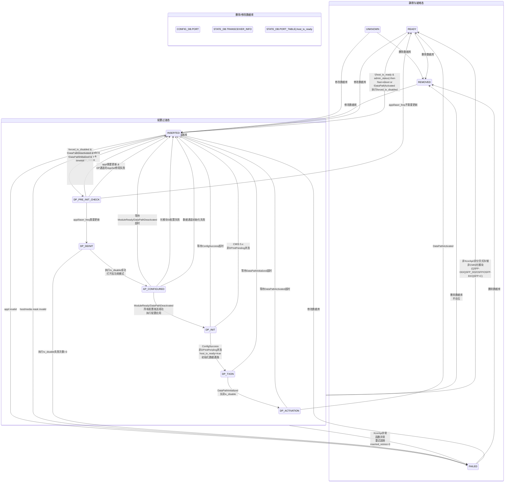

# pmon.sh start

## 1. 获取启动类型

```bash
BOOT_TYPE=`getBootType`
```

从内核参数中读取启动类型 (cold/warm/fast/fastfast/express) 

## 2. 获取平台名称

```bash
PLATFORM=${PLATFORM:-`$SONIC_CFGGEN -H -v DEVICE_METADATA.localhost.platform`}
```

## 3. 加载设备ASIC配置文件 - asic.conf

```bash
ASIC_CONF=/usr/share/sonic/device/$PLATFORM/asic.conf
if [ -f "$ASIC_CONF" ]; then
    source $ASIC_CONF
fi
```

如果存在 ASIC 配置文件, 则加载它

## 4. 设置 Syslog 目标 IP

- 单 ASIC 平台：`127.0.0.1`
- 多 ASIC 平台：从 docker bridge 网络获取网关 IP

## 5. 加载设备平台环境配置 - platform_env.conf

```bash
PLATFORM_ENV_CONF=/usr/share/sonic/device/$PLATFORM/platform_env.conf
if [ -f "$PLATFORM_ENV_CONF" ]; then
    source $PLATFORM_ENV_CONF
fi
```

## 6. 获取 HWSKU 信息

```bash
HWSKU=${HWSKU:-`$SONIC_CFGGEN -d -v 'DEVICE_METADATA["localhost"]["hwsku"]'`}
MOUNTPATH="/usr/share/sonic/device/$PLATFORM/$HWSKU"
```

构建挂载路径, 多 ASIC 平台会附加 `$DEV` 后缀

## 7. 检查容器状态

- 容器已存在且 HWSKU 匹配, 直接启动现有容器：

```bash
if [ x"$DOCKERMOUNT" == x"$MOUNTPATH" ]; then
    preStartAction
    /usr/local/bin/container start ${DOCKERNAME}
    postStartAction
    exit $?
fi
```

- 容器已存在但 HWSKU 不匹配, 删除旧容器, 准备创建新容器：

```bash
docker rm -f ${DOCKERNAME}
```

## 8. 准备容器创建

### 8.1 解析数据库配置

```bash
SONIC_DB_GLOBAL_JSON="/var/run/redis/sonic-db/database_global.json"
```

获取多 ASIC 平台的 Redis 目录列表, 存入 `redis_dir_list`

### 8.2 设置 Redis 挂载选项

- **单实例容器(DEV=$2, 不传入该参数时)或 dpudb 类型**：
  - 网络模式：`host`
  - 挂载 `redis_dir_list`中所有 Redis 实例目录
- **多 ASIC 平台**：
  - 网络模式：`container:database$DEV`
  - 只挂载命名空间特定的 Redis 目录, `redis_dir_list`中第 `$DEV`个

### 8.3 设置命名空间 ID

```bash
NAMESPACE_ID="$DEV"
if [[ $DATABASE_TYPE == "dpudb" ]]; then
    NAMESPACE_ID=""
fi
```

## 9. 创建容器

```bash
docker create --privileged -t \
    -v /etc/sonic:/etc/sonic:ro \
    -v /etc/localtime:/etc/localtime:ro \
    -v /host/reboot-cause:/host/reboot-cause:rw \
    -v /host/pmon/stormond:/usr/share/stormond:rw \
    -v /var/run/platform_cache:/var/run/platform_cache:ro \
    -v /usr/share/sonic/device/pddf:/usr/share/sonic/device/pddf:ro \
    --net=$NET \
    --uts=host \
    --tmpfs /var/log/supervisor:rw \
    --log-opt max-size=2M --log-opt max-file=5 \
    -v /usr/share/sonic/firmware:/usr/share/sonic/firmware:rw \
    -v /var/run/redis-chassis:/var/run/redis-chassis:ro \
    -v /usr/share/sonic/device/$PLATFORM/$HWSKU/$DEV:/usr/share/sonic/hwsku:ro \
    $REDIS_MNT \
    -v /etc/fips/fips_enable:/etc/fips/fips_enable:ro \
    -v /usr/share/sonic/device/$PLATFORM:/usr/share/sonic/platform:ro \
    -v /usr/share/sonic/templates/rsyslog-container.conf.j2:/usr/share/sonic/templates/rsyslog-container.conf.j2:ro \
    --tmpfs /tmp \
    --tmpfs /var/tmp \
    --env "NAMESPACE_ID"="$NAMESPACE_ID" \
    --env "NAMESPACE_PREFIX"="$NAMESPACE_PREFIX" \
    --env "NAMESPACE_COUNT"="$NUM_ASIC" \
    --env "DEV"="$DEV" \
    --env "CONTAINER_NAME"=$DOCKERNAME \
    --env "SYSLOG_TARGET_IP"=$SYSLOG_TARGET_IP \
    --env "PLATFORM"=$PLATFORM \
    --name=$DOCKERNAME \
    docker-platform-monitor:latest
```

## 10. 启动容器

```bash
preStartAction
/usr/local/bin/container start ${DOCKERNAME}
postStartAction
```

### preStartAction

- 若是多 ASIC 平台, 更新 syslog 配置, 使其使用 gateway ip 作为日志传输 ip

### postStartAction

- 复制平台传感器脚本到容器：local-`/usr/local/bin/platform_sensors.py`—cp—>docker-`/usr/bin/platform_sensors.py`
- 后台更新容器 DNS 配置：`/etc/resolvconf/update-libc.d/update-containers ${DOCKERNAME} &`

---

## 关键挂载点

| 挂载源                                                                     | 容器内路径                    | 权限         | 说明       |
| -------------------------------------------------------------------------- | ----------------------------- | ------------ | ---------- |
| `/etc/sonic`                                                             | `/etc/sonic`                | ro           | SONiC 配置 |
| `/host/reboot-cause`                                                     | `/host/reboot-cause`        | rw           | 重启原因   |
| `/var/run/redis$DEV`                            | `/var/run/redis$DEV` | rw                            | Redis 数据库 |            |
| `/usr/share/sonic/device/$PLATFORM/$HWSKU/$DEV`                          | `/usr/share/sonic/hwsku`    | ro           | HWSKU 文件 |
| `/usr/share/sonic/firmware`                                              | `/usr/share/sonic/firmware` | rw           | 固件文件   |

## 环境变量

| 变量名               | 说明                 |
| -------------------- | -------------------- |
| `NAMESPACE_ID`     | 命名空间 ID          |
| `NAMESPACE_PREFIX` | 命名空间前缀 (asic) |
| `NAMESPACE_COUNT`  | 命名空间数量         |
| `DEV`              | 设备编号             |
| `CONTAINER_NAME`   | 容器名称             |
| `SYSLOG_TARGET_IP` | Syslog 目标 IP       |
| `PLATFORM`         | 平台名称             |

---

# docker start

## 一, 关键配置文件解析

### 1. supervisord 配置模板 (docker-pmon.supervisord.conf.j2) 

**配置模板**：`/usr/share/sonic/templates/docker-pmon.supervisord.conf.j2`

**核心功能**：定义 PMON 容器中所有守护进程的运行参数

**主要配置项**：

| 程序                                                                    | 功能                                | 关键配置                 | 条件启动                                                            |
| ----------------------------------------------------------------------- | ----------------------------------- | ------------------------ | ------------------------------------------------------------------- |
| **/usr/sbin/rsyslogd**                                            | 日志管理                            | `priority=1`           | 无条件                                                              |
| **/usr/bin/delay.py**                                             | 非紧急延时                          |                          | delay_non_critical_daemon                                           |
| **/usr/local/bin/chassisd**                                       | 模块化机箱管理                      |                          | not skip_chassisd &&<br />IS_MODULAR_CHASSIS == 1 or is_smartswitch |
| **/usr/local/bin/chassis_db_init**                                |                                     |                          | not skip_chassis_db_init                                            |
| **/usr/bin/lm-sensors.sh**``(sensors -s && service sensord start) | 应用传感器配置并启动sensord.service | 基于 `sensors.conf`    | not skip_sensors &&`HAVE_SENSORS_CONF == 1`                       |
| **/usr/sbin/fancontrol**                                          | 风扇控制                            | 基于 `fancontrol` 配置 | not skip_fancontrol &&`HAVE_FANCONTROL_CONF == 1`                 |
| **/usr/local/bin/ledd**                                           | 前面板端口状态 LED 控制 (Up/Down)   | 支持 Python 2/3          | not skip_ledd                                                       |
| **/usr/local/bin/xcvrd**                                          | 光模块监控                          | 支持多种选项             | not skip_xcvrd                                                      |
| **/usr/local/bin/ycabled**                                        | 双 ToR 配置                         | 仅 DualToR 设备          | 仅 DualToR 设备                                                     |
| **/usr/local/bin/psud**                                           | 电源监控                            | 支持 Python 2/3          | not skip_psud                                                       |
| **/usr/local/bin/syseepromd**                                     | EEPROM 读取                         | 支持 Python 2/3          | not skip_syseepromd                                                 |
| **/usr/local/bin/thermalctld**                                    | 温度控制                            | 支持 Python 2/3          | not skip_thermalctld                                                |
| **/usr/local/bin/pcied**                                          | PCIe 设备监控                       | 固定路径                 | not skip_pcied                                                      |
| **/usr/local/bin/sensormond**                                     | 传感器监控 (电压和电流)                                    | 固定路径                 | include_sensormond                                                  |
| **/usr/local/bin/stormond**                                       |                                     | 固定路径                 | not skip_stormond                                                   |

**依赖启动机制**：

- `dependent_startup=true`：启用依赖启动
- `dependent_startup_wait_for=rsyslogd:running`：等待 rsyslogd 运行
- 确保服务启动顺序正确, 避免依赖失败

---

### 2. 守护进程控制文件 (pmon_daemon_control.json) 

**配置文件**：`/usr/share/sonic/hwsku/pmon_daemon_control.json` (优先) , 或 `/usr/share/sonic/platform/pmon_daemon_control.json`

**核心功能**：控制哪些守护进程需要启动

**典型配置**：

```json
{
    "skip_ledd": true,
    "skip_xcvrd": true,
    "skip_pcied": true,
    "skip_psud": true,
    "skip_syseepromd": true,
    "skip_thermalctld": true,
    "skip_ycabled": false
}
```

**详细配置**：

- pmon_daemon_control.json
  - delay_non_critical_daemon
  - skip_chassisd
    - is_smartswitch
  - skip_chassis_db_init
  - skip_sensors
  - skip_fancontrol
  - skip_ledd
  - skip_xcvrd
    - skip_xcvrd_cmis_mgr
    - enable_xcvrd_sff_mgr
    - delay_xcvrd
  - skip_ycabled
  - skip_psud
  - skip_syseepromd
  - skip_thermalctld
  - skip_pcied
  - include_sensormond
  - skip_stormond
- 自动识别
  - IS_MODULAR_CHASSIS: 1
  - HAVE_FANCONTROL_CONF
  - HAVE_SENSORS_CONF
  - API_VERSION
- 其他提供
  - DEVICE_METADATA

**配置逻辑**：

- `skip_*`：设置为 `true` 时, 对应守护进程不会在 supervisord 配置中生成
- 不同硬件平台可以根据需要跳过不需要的服务
- 例如, 虚拟设备 (kvm) 会跳过大部分硬件相关服务

---

### 3. 平台 API 包 (sonic_platform) 

**文件所在**：`/usr/share/sonic/platform/sonic_platform-1.0-py2|3-none-any.whl`

**核心功能**：提供统一的硬件抽象接口

**Python 版本**：

- 支持 Python 2 和 Python 3
- 启动脚本会优先使用 Python 3 版本
- 如未安装, 会从 `/usr/share/sonic/platform/` 目录安装

**关键模块**：

- 传感器读取
- 风扇控制
- 电源监控
- LED 管理
- EEPROM 读取

---

## 二, 启动流程详解

### 1. 环境准备阶段

**目录结构**：

- 创建 `/etc/supervisor/conf.d/` 目录
- 创建 `/var/sonic/` 目录

**配置路径初始化**：

- 定义传感器, 风扇控制, 模板等关键文件路径, 参照下方配置文件说明
- 确定守护进程控制文件的优先级 (SKU > Platform) 

**容器生命周期管理**：

- 若存在 `/usr/share/sonic/scripts/container_startup.py` 脚本, 则执行 (除stretch外都有, 位于docker内部) : `/usr/share/sonic/scripts/container_startup.py -f pmon -o ${RUNTIME_OWNER} -v ${IMAGE_VERSION}` (可参阅 `src/sonic-ctrmgrd/ctrmgr/container_startup.py`) 
- 以通知系统容器状态到swss, 支持 kube/local 两种运行时, 默认kube, 可通过 `RUNTIME_OWNER=local`指定为local

---

### 2. 硬件就绪检查

**平台同步**：

- 执行 `/usr/share/sonic/platform/platform_wait` 脚本 (如存在) 
- 等待硬件初始化完成 (如 FPGA 加载, BMC 就绪) 
- 硬件未就绪时直接退出, 确保后续服务能正常运行

---

### 3. 平台 API 安装

**Python 版本检测与安装**：

1. 检查 Python 2 版本的 sonic-platform 包
2. 检查 Python 3 版本的 sonic-platform 包
3. 优先使用 Python 3 版本, 更新 API 版本标志

**安装策略**：

- 从平台目录的 wheel 包安装
- 详细的安装状态日志
- 即使安装失败也会继续执行 (容错设计) 

---

### 4. 平台特定配置

由参数 `CONFIGURED_PLATFORM`识别平台

**mellanox**：

- 使用 `/usr/share/sonic/platform/get_sensors_conf_path` 脚本动态获取传感器配置路径覆盖之前的配置 (若存在) 

**nvidia-bluefield**：

- 挂载 debugfs 文件系统用于 SmartNIC 调试

---

### 5. 传感器与风扇配置

**传感器配置**：

- 检查 `/usr/share/sonic/platform/sensors.conf` 文件是否存在, 不存在则跳过本配置
- 执行 PSU 传感器配置更新 `/usr/share/sonic/platform/psu_sensors_conf_updater` (如存在) 
  - `source /usr/share/sonic/platform/psu_sensors_conf_updater`
  - `update_psu_sensors_configuration /usr/share/sonic/platform/sensors.conf`
- 检查是否存在临时传感器配置, 若存在则指定其为传感器配置 `/tmp/sensors.conf`
- 复制最终配置到 `/etc/sensors.d/`, 用于 lm-sersors 中的 sensord 守护进程

**风扇控制配置**：

- 检查 `/usr/share/sonic/platform/fancontrol` 文件, 不存在则跳过本配置
- 清理旧的 PID 文件 `/var/run/fancontrol.pid`
- 复制配置到 `/etc/` 目录

---

### 6. 平台环境配置与机箱架构检测

**平台环境变量**：

- 加载 `/usr/share/sonic/platform/platform_env.conf` 文件 (若存在) 
- 读取如 `disaggregated_chassis` 等关键变量

**模块化机箱检测**：

- 检查 `/usr/share/sonic/platform/chassisdb.conf` 文件, 不存在则跳过本检查
- 结合 `disaggregated_chassis` 标志判断 (`disaggregated_chassis` !=1), 设置 `IS_MODULAR_CHASSIS` 标志为 1
  - 待验证:
    - disaggregated_chassis: 解耦式机箱/解耦架构机框, 把传统一体化机框拆解开
  管理,交换,计算,电源等物理/逻辑分离, 不再强绑定在一个机箱里
      - e.g. 白盒交换机、分解式路由器、 disaggregated 网络架构
    - MODULAR_CHASSIS: 模块化机箱, 机箱支持插拔线卡、业务板、电源等模块
      - e.g. 普通交换机框、服务器机箱，插板即可扩展
    - 一个机箱可以既是 modular, 又是 disaggregated, 一般是modular也并不影响??


---

### 7. 配置数据整合与生成

**配置变量构建**：

```json
{
    "HAVE_SENSORS_CONF": 1,
    "HAVE_FANCONTROL_CONF": 1,
    "API_VERSION": 3,
    "IS_MODULAR_CHASSIS": 0
}
```

**supervisord 配置生成** (`/etc/supervisor/conf.d/supervisord.conf`) ：

- 存在 `pmon_daemon_control.json`
  - 使用该配置作为额外配置, 结合 `sonic-cfggen` 工具生成配置: `sonic-cfggen -d -j $PMON_DAEMON_CONTROL_FILE -a "$confvar" -t $SUPERVISOR_CONF_TEMPLATE > $SUPERVISOR_CONF_FILE`
- 不存在 `pmon_daemon_control.json`:
  - `sonic-cfggen` 工具生成配置: `sonic-cfggen -d -a "$confvar" -t $SUPERVISOR_CONF_TEMPLATE > $SUPERVISOR_CONF_FILE`
- 合并 ConfigDB, 守护进程控制文件和内联变量
- 基于 Jinja2 模板 `/usr/share/sonic/templates/docker-pmon.supervisord.conf.j2`生成最终配置

---

### 8. 启动 supervisord

**进程替换**：

- 使用 `exec` 替换当前 shell 进程
- 成为容器的 PID 1 进程

**服务管理**：

- 读取生成的配置文件
- 按优先级和依赖关系启动守护进程
- 监控进程状态, 自动重启异常进程

---

## 三, 关键文件与启动流程的关系

### 1. 关键配置驱动的启动逻辑

| 配置文件                                                                                                                        | 必须 | 影响范围     | 作用机制                                                   |
| ------------------------------------------------------------------------------------------------------------------------------- | ---- | ------------ | ---------------------------------------------------------- |
| /usr/share/sonic/hwsku/**pmon_daemon_control.json** (优先) ``/usr/share/sonic/platform/**pmon_daemon_control.json** | N    | 守护进程选择 | 决定哪些服务会在 supervisord 配置中生成                    |
| /usr/share/sonic/platform/**sensors.conf**                                                                                | N    | 传感器监控   | 控制 `HAVE_SENSORS_CONF` 标志, ``影响 lm-sensors 启动    |
| /usr/share/sonic/platform/**fancontrol**                                                                                  | N    | 风扇控制     | 控制 `HAVE_FANCONTROL_CONF` 标志, ``影响 fancontrol 启动 |
| /usr/share/sonic/platform/**platform_env.conf**                                                                           | N    | 平台参数     | 提供 `disaggregated_chassis` 等环境变量                  |
| /usr/share/sonic/platform/**chassisdb.conf**                                                                              | N    | 机箱架构     | 结合环境变量判断是否为模块化机箱                           |
|                                                                                                                                 |      |              |                                                            |

### 2. 关键程序驱动的启动逻辑

| 程序文件                                                                  | 必须 | 影响范围     | 作用机制                                                                                                                                                |
| ------------------------------------------------------------------------- | ---- | ------------ | ------------------------------------------------------------------------------------------------------------------------------------------------------- |
| /usr/share/sonic/platform/**sonic_platform-1.0-py2/3-none-any.whl** | N    | API 版本     | 决定 Python 版本和 API 能力                                                                                                                             |
| /usr/share/sonic/**scripts/container_startup.py**                   | N    | 容器状态管理 | 同步容器状态到swss                                                                                                                                      |
| /usr/share/sonic/platform/**platform_wait**                         | N    | 平台初始化   | 自定义等待硬件初始化完成 (如 FPGA 加载, BMC 就绪) ``时间过久还没完成可执行失败以触发服务重启                                                            |
| /usr/share/sonic/platform/**psu_sensors_conf_updater**              | N    | 传感器监控   | 当存在psu_sensors_conf_updater时, ``通过其提供的Function生成配置/tmp/sensors.conf, ``优先级更高, ``覆盖/usr/share/sonic/platform/**sensors.conf** |
|                                                                           |      |              |                                                                                                                                                         |

### 3. 动态配置生成流程

```
┌─────────────────────┐
│ 启动脚本检测状态    │
└──────────┬──────────┘
           ▼
┌─────────────────────┐
│ 构建配置变量 JSON   │
└──────────┬──────────┘
           ▼
┌─────────────────────┐
│ 读取守护进程控制文件│
└──────────┬──────────┘
           ▼
┌─────────────────────┐
│ 渲染 Jinja2 模板    │
└──────────┬──────────┘
           ▼
┌─────────────────────┐
│ 生成 supervisord 配置│
└──────────┬──────────┘
           ▼
┌─────────────────────┐
│ 启动 supervisord    │
└──────────┬──────────┘
           ▼
┌─────────────────────┐
│ 按配置启动守护进程   │
└─────────────────────┘
```

---

## 四, 实际运行示例

### 典型服务器配置 (待校验) 

**pmon_daemon_control.json**：

```json
{
    "skip_ledd": false,
    "skip_xcvrd": false,
    "skip_pcied": false,
    "skip_psud": false,
    "skip_syseepromd": false,
    "skip_thermalctld": false,
    "skip_ycabled": true
}
```

**启动服务**：

- rsyslogd (基础服务) 
- ledd (LED 控制) 
- xcvrd (光模块监控) 
- psud (电源监控) 
- syseepromd (EEPROM 读取) 
- thermalctld (温度控制) 
- pcied (PCIe 设备监控) 
- lm-sensors (如配置) 
- fancontrol (如配置) 

### 虚拟设备配置 (待校验) 

**pmon_daemon_control.json**：

```json
{
    "skip_ledd": true,
    "skip_xcvrd": true,
    "skip_pcied": true,
    "skip_psud": true,
    "skip_syseepromd": true,
    "skip_thermalctld": true,
    "skip_ycabled": false
}
```

**启动服务**：

- rsyslogd (仅基础服务) 
- 其他硬件相关服务全部跳过


---


# src/sonic-platform-daemons

[sonic-platform-daemons](https://github.com/sonic-net/sonic-platform-daemons), 是基于 `python`开发的系列平台监控守护程序, 多个 `whl`, 如 `sonic_chassisd-1.0-py3-none-any.whl`, `sonic_ledd-1.1-py2-none-any.whl`等

## sonic-chassisd/classis_db_init

**核心功能**：初始化`STATE_DB`中**Chassis硬件信息**


- 初始化 `STATE_DB`中Chassis硬件信息

```python
# DB.Table
STATE_DB.CHASSIS_INFO.<"chassis 1">=dict([
	(serial , sonic_platform.platform.Platform().get_chassis().get_serial() or N/A),
	(model , sonic_platform.platform.Platform().get_chassis().get_model() or N/A),
	(revision , sonic_platform.platform.Platform().get_chassis().get_revision() or N/A),
])
```

- STATE_DB
  - CHASSIS_INFO
    - <"chassis 1">
      - serial: `chassis().get_serial()` or `N/A`
      - model: `chassis().get_model()` or `N/A`
      - revision: `chassis().get_revision()` or `N/A`

> SYSLOG_IDENTIFIER = "chassis_db_init"


## sonic-chassisd/classisd

**核心功能**: 模块信息更新守护进程, 负责收集和管理 SONiC 模块化机架系统中的所有模块信息, 并将信息写入 State DB。

**运行周期**: 每 10 秒 (`CHASSIS_INFO_UPDATE_PERIOD_SECS`) 更新一次

**支持模式**:

1. **模块化机架模式**: Supervisor + Line Cards + Fabric Cards
2. **智能交换机模式**: Supervisor + DPUs (Data Processing Units) 

**chassisd** 是 SONiC 模块化机架和智能交换机的核心管理守护进程, 实现了：

1. **模块生命周期管理**: 监控模块在线/离线状态
2. **配置管理**: 响应配置变化, 执行模块管理操作
3. **状态同步**: 定期更新数据库中的模块信息
4. **中平面监控**: 检查模块间连接状态
5. **DPU 状态管理**: 监控 DPU 数据平面和控制平面状态
6. **错误恢复**: 自动清理离线模块记录
7. **平台适配**: 支持多种平台架构

---

### 平台适配

#### 模块化机架平台

**组件**:

- Supervisor 卡 (管理整个机架) 
- Line Cards (业务处理) 
- Fabric Cards (交换网络) 

**特殊处理**:

- Supervisor 和 Line Card 运行不同的逻辑
- Fabric ASIC 信息单独管理
- 中平面连接监控

#### 智能交换机平台

**组件**:

- Supervisor 卡
- DPUs (数据处理单元) 

**特殊处理**:

- DPU 数据平面和控制平面状态监控
- PCI 设备分离/重新扫描
- 传感器配置变更
- 异步模块配置更新

---

### 核心数据定义

#### 1. Redis 数据库结构

| 数据库           | 表名                             | 键模板          | 用途                     |
| ---------------- | -------------------------------- | --------------- | ------------------------ |
| CONFIG_DB        | CHASSIS_MODULE                   | `<module_name>` | 模块配置 (admin_status) |
| STATE_DB         | CHASSIS_TABLE                    | `CHASSIS 1`     | 机架信息 (模块数量)     |
| STATE_DB         | CHASSIS_MODULE_TABLE             | `<module_name>` | 模块状态信息             |
| STATE_DB         | CHASSIS_MIDPLANE_TABLE           | `<module_name>` | 中平面连接信息           |
| STATE_DB         | PHYSICAL_ENTITY_INFO             | `<module_name>` | 物理实体信息             |
| CHASSIS_STATE_DB | CHASSIS_ASIC_TABLE               | `<asic_key>`    | ASIC 信息                |
| CHASSIS_STATE_DB | CHASSIS_FABRIC_ASIC_TABLE        | `<asic_key>`    | Fabric ASIC 信息         |
| CHASSIS_STATE_DB | CHASSIS_MODULE_TABLE             | `<module_name>` | 模块主机名               |
| CHASSIS_STATE_DB | CHASSIS_MODULE_REBOOT_INFO_TABLE | `<module_name>` | 模块重启信息             |
| CHASSIS_STATE_DB | DPU_STATE                        | `DPU<id>`       | DPU 状态                 |

- CONFIG_DB
  - CHASSIS_MODULE
    - <module_name>: 用于设置模块管理模式, 该key被 SET-关闭管理状态`admin_state=0`, 该key被 DEL-开启管理状态`admin_state=1`, 设置`chassis.get_module(chassis.get_module_index(module_name)).set_admin_state(admin_state)`
      - admin_status: up|down
- STATE_DB
  - CHASSIS_MODULE_TABLE
    - <module_name>: `chassis.get_module(module_index).get_xxx()`
      - desc: `get_description()`
      - slot: `get_slot()`
      - oper_status: `get_oper_status()`
      - num_asics: `len(get_all_asics())`
      - serial: `get_serial()`
      - presence: `get_presence()`
      - is_replaceable: `is_replaceable()`
      - model: `get_model()`
  - CHASSIS_TABLE
    - "CHASSIS 1"
      - module_num: `chassis.get_num_modules()`
  - CHASSIS_MIDPLANE_TABLE
    - <module_name>
      - ip_address: `get_midplane_ip()` or `0.0.0.0`
      - access: `str(is_midplane_reachable())` or `str(False)`
  - PHYSICAL_ENTITY_INFO
    - <module_name>
      - position_in_parent: <module_index>
      - parent_name: "chassis 1"
      - serial: <module_serial>
      - model: <module_model>
      - is_replaceable: <is_replaceable>
- CHASSIS_STATE_DB
  - CHASSIS_FABRIC_ASIC_TABLE (asic_table for supervisor slot)
    - `<module_name>|asic<id>` (e.g. <module_name>|asic1)
      - asic_pci_address: `get_all_asics()[$i][1]`
      - name: `<module_name>`
      - asic_id_in_module: `get_all_asics()[$i][0]`
  - CHASSIS_ASIC_TABLE (asic_table for non-supervisor slot)
    - `asic<id>` (e.g. asic1)
      - asic_pci_address: `get_all_asics()[$i][1]`
      - name: `<module_name>`
      - asic_id_in_module: `get_all_asics()[$i][0]`
  - CHASSIS_MODULE_TABLE (hostname)
    - LINE-CARD`<slot>-1` (e.g. LINE-CARD0)
      - slot: <slot>
      - hostname: `sonic_py_common.device_info.get_hostname() or "None"`
      - num_asics: `len(get_all_asics())`
  - CHASSIS_MODULE_REBOOT_INFO_TABLE
    - <module_name> (下发KV不共存, 仅一次一个key)
      - reboot: `expected`
      - timestamp: `str(time.time())`
- CHASSIS_APP_DB

#### 2. Chassis 模块类型

Chassis 模块继承自 `src/sonic-platform-common/sonic_platform_base/module_base.py`中的`ModuleBase(device_base.DeviceBase)`类, 是**通用类型的平台外设设备**的**抽象基类**。

| 模块类型    | 前缀          | 说明                       |
| ----------- | ------------- | -------------------------- |
| Supervisor  | `SUPERVISOR`  | 管理卡                     |
| Line Card   | `LINE-CARD`   | 线卡                       |
| Fabric Card | `FABRIC-CARD` | 交换卡                     |
| DPU         | `DPU`         | 数据处理单元 (智能交换机) |

#### 3. Chassis 模块状态

| 状态                  | 值        | 引用                       | 说明                               |
| --------------------- | --------- | -------------------------- | ---------------------------------- |
| MODULE_STATUS_EMPTY   | `Empty`   | `module.get_oper_status()` | 模块不存在                         |
| MODULE_STATUS_OFFLINE | `Offline` | `module.get_oper_status()` | 模块离线                           |
| MODULE_STATUS_ONLINE  | `Online`  | `module.get_oper_status()` | 模块在线, fully functional         |
| MODULE_STATUS_PRESENT | `Present` | `module.get_oper_status()` | not fully functional               |
| MODULE_STATUS_FAULT   | `Fault`   | `module.get_oper_status()` | Present\|Online->fault, 无法Online |
|                       |           |                            |                                    |
| MODULE_ADMIN_DOWN     | `0`       | module.set_admin_state(0)  | 管理状态关闭                       |
| MODULE_ADMIN_UP       | `1`       | module.set_admin_state(1)  | 管理状态开启                       |
| MODULE_PRE_SHUTDOWN   | `2`       | module.set_admin_state(2)  | DPU预关机状态                      |

---

### 核心总体流程

根据Chassis类型启动对应Daemon (此处主要梳理非PDU&SmartSwitch的Chassis):

- 若是DPU Chassis (`chassis.is_smartswitch() and chassis.is_dpu()`): `DpuChassisdDaemon(SYSLOG_IDENTIFIER, chassis).run()`
- 否则按平台Chassis: `ChassisdDaemon(SYSLOG_IDENTIFIER, chassis).run()`


如下为非PDU Chassis:

1. 设置-模块配置更新器`ModuleUpdater`

   - smartswitch: `SmartSwitchModuleUpdater(SYSLOG_IDENTIFIER, self.platform_chassis)`
   - 非smartswitch: `ModuleUpdater(SYSLOG_IDENTIFIER, self.platform_chassis, chassis.get_my_slot() or -1, chassis.get_supervisor_slot() or -1)`
     1. 连接数据库及相应表格 (仅展示差异): 
        - `STATE_DB`
        - `CHASSIS_STATE_DB`
          - asic_table: 
            - supervisor slot: `CHASSIS_FABRIC_ASIC_TABLE`
            - common slot: `CHASSIS_ASIC_TABLE`
     2. 设置`linecard_reboot_timeout`为180s。可通过平台环境变量`platform_env.conf`覆盖。
     3. 初始化midplane (成功需返回"True", 使if条件判断通过): `chassis.init_midplane_switch()`

2. 更新数据库`STATE_DB.CHASSIS_TABLE`中的**模块数量** (或DPU数量) (非0值): `"CHASSIS 1"=dict([("module_num", chassis.get_num_modules())])`

3. 非smartswitch: 若获取到`slot`或`supervisor_slot`是非法值`-1`, 退出

4. 设置并启动-配置管理任务`ConfigManagerTask`

   - smartswitch: `SmartSwitchConfigManagerTask().task_run()`

   - 非smartswitch, 需当前`slot`是`supervisor_slot`: `ConfigManagerTask().task_run()`

     - 监听`CONFIG_DB.CHASSIS_MODULE`中的配置项修改：

       - 配置项名称-`key`：
         - `SUPERVISOR**`, 如`SUPERVISOR-xxx`
         - `LINE-CARD**`
         - `FABRIC-CARD**`

       - 修改动作:
         - SET: 关闭模块管理 (`admin_state=0`)
         - DEL: 开启模块管理 (`admin_state=1`)

     - 根据配置项的修改动作, 设置Chassis-Module的管理状态:

       - ```python
         chassis.get_module(chassis.get_module_index(key)).set_admin_state(admin_state)
         ```

   - 其他：无此任务

5. smartswitch: 初始化DPU管理状态

6. 循环执行: (每CHASSIS_INFO_UPDATE_PERIOD_SECS=10s执行一次)

   1. 模块状态检测与更新: `module_updater.module_db_update()`
      1. 遍历所有模块
         1. 获取最新的模块信息字典: `chassis.get_module(module_index).get_xxx()` 
         2. 若`slot`与本模块更新器`module_updater`中设置的一致, 记下其模块索引: `my_index = module_index`
         3. 检查最新的模块信息中模块名`name`是否合法, 不合法则**跳过**剩下步骤 (合法如`SUPERVISOR**`, `LINE-CARD**`, `FABRIC-CARD**`)
         4. 获取数据库中模块信息中的上一次`oper_status`状态 (name是模块名, 默认为空`empty`): `STATE.CHASSIS_MODULE_TABLE.module_name` 
         5. 更新数据库中模块信息: `STATE_DB.CHASSIS_MODULE_TABLE.module_name`
         6. 更新数据库中物理条目信息: `STATE_DB.PHYSICAL_ENTITY_INFO.module_name`
         7. 获取数据库中该模块的hostname, 定义变量down_module_key为`<module_name>|<hostname>`: `CHASSIS_STATE_DB.CHASSIS_MODULE_TABLE.module_name` 
         8. 对比上一次与最新的`oper_status`状态：
            1. 从Online变成非Online, 输出Offline日志, 并记录到`down_modules["<module_name>|<hostname>"]`: 
               - `down_time=time.time()`
               - `cleaned=False`
               - `slot=`最新slot
            2. 从非Online变成Online, 输出Online日志
            3. 最新为Online, 并且模块从down_modules中移除, 输出恢复Online日志
            4. 若为Online, 且数据库中配置模块管理状态`CONFIG_DB.CHASSIS_MODULE.<module_name>.admin_status`为非`down`, 遍历模块中所有的`asics`更新数据库中`CHASSIS_STATE_DB.$ASIC_TABLE`对应的状态
      2. 若非Supervisor, 获取循环中记下的与本模块更新器一致的模块索引`my_index`, 获取其模块信息用以 - 更新数据库中hostname部分: `CHASSIS_STATE_DB.CHASSIS_MODULE_TABLE.LINE-CARD<slot-1>`
      3. 清除数据库中非Online模块的ASIC记录: `CHASSIS_STATE_DB.$ASIC_TABLE`
   2. 模块midplane状态检测与更新: `module_updater.check_midplane_reachability()`
      1. 若midplane没有初始化, 则**跳过**剩下步骤
      2. 遍历所有模块进行检查
         1. 跳过这些模块:
            1. **非FABRIC-CARD**
            2. **Supervisor**: 若Chassis所在的slot是**Supervisor** - slot, 且是正在遍历中的模块的slot
            3. **LINE-CARD**: 若遍历中的 **LINE-CARD**模块的slot不是Supervisor
         2. 获取最新的模块midplane信息和状态: name, midplane_ip, midplane_reachable
         3. 获取数据库中上一次记录的模块midplane信息和状态: midplane_reachable
         4. 对比上一次与最新的模块midplane信息和状态：
            1. 若从reachable变成非reachable：
               - 若为预期的, 即预期reboot导致(`CHASSIS_STATE_DB.CHASSIS_MODULE_REBOOT_INFO_TABLE.<module_name>.reboot=expected`), 则更新reboot信息数据库中模块midplane重启时间(`CHASSIS_STATE_DB.CHASSIS_MODULE_REBOOT_INFO_TABLE.<module_name>.timestamp=str(time.time())`), 并输出日志
               - 若为非预期的, 输出日志
            2. 若从非reachable变成reachable, 则输出日志, 并删除reboot信息数据库中的对应模块`CHASSIS_STATE_DB.CHASSIS_MODULE_REBOOT_INFO_TABLE.<module_name>`
            3. 若一致都是非reachable, 检查reboot是否超时(`linecard_reboot_timeout`), 若超时则删除reboot数据库中对应模块, 并输出日志
         5. 更新数据库中模块midplane信息和状态: `STATE_DB.CHASSIS_MIDPLANE_TABLE.<module_name>={"ip_address":"0.0.0.0","access": "False"}`
   3. 检查所有Offline模块Offline是否超时(30min), 超时则清除数据库 (仅LINE-CARD) 并标记清除: `module_updater.module_down_chassis_db_cleanup()`
      - CHASSIS_APP_DB:
        - SYSTEM_NEIGH*
        - SYSTEM_INTERFACE*
        - SYSTEM_LAG_MEMBER_TABLE*
        - SYSTEM_LAG_TABLE*


> SYSLOG_IDENTIFIER = "chassisd"


## sonic-ledd

**核心功能**：前面板端口状态 LED 控制 (Up/Down), 非速率灯。

**重要文件**：
- /usr/share/sonic/platform/plugins/led_control.py (继承`src/sonic-platform-common/sonic_led/led_control_base.py`)
  - 若需要该LED控制功能, 将必须有该插件


### 核心总体流程

1. 实例并初始化`DaemonLedd(daemon_base.DaemonBase)`: `ledd = DaemonLedd()`

   1. 初始化守护进程基类: `daemon_base.DaemonBase.__init__(self, SYSLOG_IDENTIFIER)`

   2. 多 ASIC 平台配置

      - 若为多 ASIC 平台配置, 让swsscommon先从`database_global.json`加载详细命名空间配置: `if sonic_py_common.multi_asic.is_multi_asic(): swsscommon.SonicDBConfig.initializeGlobalConfig()`
      - src/sonic-swss-common/tests/redis_multi_db_ut_config/database_global.json

   3. 加载平台特定 LED 控制模块

      - 尝试加载平台特定的 `led_control` 模块中的 `class LedControl(sonic_led.led_control_base.LedControlBase)` 类, 位于**`/usr/share/sonic/platform/plugins/led_control.py`**, 继承并实现**`src/sonic-platform-common/sonic_led/led_control_base.py`**
      - 如果*加载失败, 记录错误并退出* (错误码：LEDUTIL_LOAD_ERROR=1) 

      ```python
      self.led_control = self.load_platform_util(LED_MODULE_NAME, LED_CLASS_NAME)
      ```

   4. 初始化端口状态观察器: `self.portObserver = PortStateObserver()`

   5. 订阅前面板端口命名空间`STATE_DB.PORT`

      - 获取所有前端命名空间: `namespaces = sonic_py_common.multi_asic.get_front_end_namespaces()`
      - 详细命名空间原理
        - 相关配置：`src/sonic-swss-common/tests/redis_multi_db_ut_config/database_global.json`
        - 实际原理：
          - 物理隔离：每个命名空间有独立的Redis实例 (通过不同的unix socket路径) 
          - 逻辑隔离：相同的数据库名称 (如APPL_DB) 在不同命名空间中指向不同的物理Redis实例
          - 灵活配置：支持namespace和container_name的组合, 实现更细粒度的隔离
          - 代码流程：
            1. 用户调用 db_connect("APPL_DB", "asic0")
            2. 创建 DBConnector("APPL_DB", 0, True, "asic0")
            3. 创建 SonicDBKey(netns="asic0")
            4. 从 m_db_info[{netns="asic0"}] 中查找 "APPL_DB" 的配置
            5. 获取 dbId=1, instName="redis"
            6. 从 m_inst_info[{netns="asic0"}] 中查找 "redis" 实例
            7. 获取 unix_socket_path="/var/run/redis0/redis.sock"
            8. 连接到该socket的Redis实例

      - 订阅这些命名空间的 `STATE_DB.PORT_TABLE`表: `self.portObserver.subscribePortTable(namespaces)`
        - 即向RedisDB提交多个订阅: `STATE_DB.PORT_TABLE.`

   6. 发现前面板端口

      ```python
      fp_plist, fp_ups, lmap = self.findFrontPanelPorts(namespaces)
      self.fp_ports = FrontPanelPorts(fp_plist, fp_ups, lmap, self.led_control)
      ```

       - 调用 `findFrontPanelPorts()` 发现前面板端口及其状态 (最多256个Port)
         - 数据库
           - `CONFIG_DB.PORT.`
           - `STATE_DB.PORT_TABLE.`
         - 判断是否为前面板端口：`sonic_py_common.multi_asic.is_front_panel_port(port_name, port_role)`
           - 不是：
             - Ethernet-BP*      (port_name)(Ethernet-Backplane)
             - Ethernet-IB*      (port_name)(Ethernet-Inband)
             - Ethernet-Rec*     (port_name)(Ethernet-Recirc)
             - `*.*`             (port_name)(have '.')
             - role 属于内部角色的
               - Int: INTERNAL_PORT
               - Inb: INBAND_PORT
               - Rec: RECIRC_PORT
               - Dpc: DPU_CONNECT_PORT
           - 是：
             - Ethernet*         (port_name)(don't '.')
             - ...
       - 创建 `FrontPanelPorts` 对象管理这些端口
         - fp_port_list (前面板端口索引及其端口归属列表：`{port-index, list of logical ports' name}`)
         - fp_port_up_subports (端口的子端口状态是up的数量：`{port-index, total number of subports oper UP (netdev_oper_status is up)}`)
         - logical_port_mapping (逻辑端口映射：`{port-name, Port Object}`)

   7. 初始化端口 LED 颜色

      根据当前端口状态初始化所有端口 LED：`self.fp_ports.initPortLeds()`

      - **若该端口的所有子端口(的netdev_oper_status)都是up, 则端口up, 否则down**
        - **控制端口状态更新`led_control.port_link_state_change(port_name, ‘up')`**


2. 无限循环监听端口Up/Down状态变化并更新led, 每次循环: `while True: if 0 != ledd.run(): sys.exit(LEDD_SELECT_ERROR)`

   1. 获取选择事件: `state, event = self.portObserver.getSelectEvent()`

   2. 处理事件超时：如果状态为 `swsscommon.Select.TIMEOUT`, 返回 0, 跳过剩下步骤返回0等下一次再查看事件

   3. 处理错误：如果状态不是 `swsscommon.Select.OBJECT`, 记录警告并返回 -1, 这会导致守护进程重启

   4. 处理端口事件：
      - 获取端口表事件：`portEvent = self.portObserver.getPortTableEvent(event)`
        - 忽略这些key: `STATE_DB.PORT_TABLE.PortInitDone`, `STATE_DB.PORT_TABLE.PortInitDone`

      - 如果事件有效：
        - 记录日志 (端口名称和状态) 
        - 调用 `processPortStateChange()` 处理状态变化
          - 若端口状态没有更新则跳过进入下一次循环
          - 若端口状态更新
            - down->up, 索引对应的子端口up状态数量加一: `fp_port_up_subports[port._index] = min(1 + self.fp_port_up_subports[port._index], self.getTotalSubports(port._index))`
            - up->down, 索引对应的子端口up状态数量减一: `fp_port_up_subports[port._index] = max(0, self.fp_port_up_subports[port._index] - 1)`
            - 若所有子端口都up/down, 更新端口led灯：`led_control.port_link_state_change(port_name, port_state)`

   5. 返回 0 表示成功


> SYSLOG_IDENTIFIER = "ledd"


## sonic-pcied

**核心功能**：PCIe设备监控, 是否丢失PASS/FAIL, 高级错误报告统计等

**重要文件**：
- /usr/share/sonic/platform/$hwsku/pcie.yaml
- /usr/share/sonic/platform/$hwsku/pcie_xxx.yaml


### 核心总体流程

1. 实例化初始化`DaemonPcied(daemon_base.DaemonBase)`: `pcied = DaemonPcied(SYSLOG_IDENTIFIER)`
   
   1. 初始化守护进程基类: `super(DaemonPcied, self).__init__(log_identifier)`
   2. 加载平台pcie工具类`PcieUtil`: `platform_pcieutil = load_platform_pcieutil()`
      1. 若platform有自己的实现, 则使用platform实现类: `sonic_platform.pcie.Pcie(path=sonic_py_common.device_info.get_paths_to_platform_and_hwsku_dirs())`
         1. `sonic_platform.pcie.Pcie()`继承自:
            1. 默认已实现模块: `sonic_platform_base.sonic_pcie.pcie_common.PcieUtil(.pcie_base.PcieBase)`
            2. 底层为实现模块: `sonic_platform_base.sonic_pcie.pcie_base.PcieBase()`
         2. `sonic_py_common.device_info.get_paths_to_platform_and_hwsku_dirs()`实际为:
            1. `/usr/share/sonic/platform/$hwsku/` (优先)
            2. `/usr/share/sonic/device/$platform_name/$hwsku/`
      2. 否则使用默认的模块: `sonic_platform_base.sonic_pcie.pcie_common.PcieUtil(path=sonic_py_common.device_info.get_paths_to_platform_and_hwsku_dirs())`
      3. 若均初始化报错则退出
   3. 连接`STATE_DB`数据库, 失败则退出:
      - `STATE_DB.PCIE_DEVICE`: PCIe设备表
      - `STATE_DB.PCIE_DEVICES`: PCIe状态表
      - `STATE_DB.PCIE_DETACH_INFO`: PCIe断联信息表

2. 无限循环, 每`PCIED_MAIN_THREAD_SLEEP_SECS=60`s执行一次, 每次循环: `while pcied.run(): pass`
   
   1. 若60s被信号中断, 则退出该Daemon, 触发重启
   
   2. 检查PCIe设备: `check_pcie_devices()`
      1. 对于所有PCIe设备, 使用`pcieuitl.get_pcie_check()`根据配置检查PCIe设备是否存在并返回结果: `self.resultInfo = platform_pcieutil.get_pcie_check()`
         1. 配置为`/usr/share/sonic/platform/$hwsku/pcie.yaml`或`pcie_xx.yaml`, 内容为对象列表, 每个对象配置为:
            - bus: '00'
            - dev: '09'
            - fn: '0'
            - id: '19a4'
            - name: 'Intel Corporation Atom Processor C3000 Series PCI Express Root Port #0 (rev 11)'
            - result: 'Passed' or 'Failed' (无需配置, 检查结果生成存储到类变量里)
         2. 实际原理为, 判断路径是否存在: `'/sys/bus/pci/devices/%04x:%02x:%02x.%d' % (domain=0, bus, device, func)`
      2. 对于所有PCIe设备, 循环检查结果:
         1. 若不存在则 (failed):
            1. 若为smartswitch, 检查dpu是否处于断联模式, 是则输出日志并返回
            2. 否则, 输出找不到的日志, 并且错误计数加一
         2. 若存在则更新PCIe设备的**id**及**AER高级错误报告统计**到`STATE_DB.PCIE_DEVICE`**DB数据库** (passed): 
            1. 检查设备id是否存在: `id=$(cat '/sys/bus/pci/devices/0000:$bus:$device.$fn/device')`
               1. 不存在则跳过, 无需更新
               2. 存在则继续执行, 并更新设备表中的id到`STATE_DB.PCIE_DEVICE`数据库:
                  - device_name (`device_name = "%02x:%02x.%d" % (Bus, Dev, Fn)`)
                    - id: id
            2. 使用`pcieuitl.get_pcie_aer_stats(self, domain=0, bus=0, dev=0, func=0)`获取PCIe的AER: `self.aer_stats = platform_pcieutil.get_pcie_aer_stats(bus=Bus, dev=Dev, func=Fn)`
               - 原理: 按行读取解析
                 - 可纠正错误计数器-correctable: `/sys/bus/pci/devices/0000:$bus:$device.$fn/aer_dev_correctable`
                   - 示例
                     ```sh
                     # cat /sys/bus/pci/devices/0000:01:00.0/aer_dev_correctable
                     RxErr                 0
                     BadTLP                0
                     BadDLLP               0
                     Rollover              0
                     Timeout               0
                     NonFatalErr           0
                     CorrIntErr            0
                     HeaderOF              0
                     ```
                 - 致命错误计数器-fatal: `/sys/bus/pci/devices/0000:$bus:$device.$fn/aer_dev_fatal`
                 - 非致命错误计数器-non_fatal: `/sys/bus/pci/devices/0000:$bus:$device.$fn/aer_dev_nonfatal`
               - 返回结果结构为:
                 - correctable:
                   - field: value
                 - fatal:
                   - field: value
                 - non_fatal:
                   - field: value
            3. 更新AER到`STATE_DB.PCIE_DEVICE`数据库表, 不存在则跳过, 无需更新:
               - device_name (`device_name = "%02x:%02x.%d" % (Bus, Dev, Fn)`) (将会移除上方的id)
                 - `correctable|field`: value
                 - `fatal|field`: value
                 - `non_fatal|field`: value
      3. 更新PCIe设备状态到`STATE_DB.PCIE_DEVICES`数据库表, 只要有一个PCIe设备不存在则状态标记为`FAILED`否则`PASSED`:
         - status
           - status: `PASSED` or `FAILED`


> SYSLOG_IDENTIFIER = "pcied"


## sonic-psud

**核心功能**：监控PSU在位与否, 风扇, 上电正常与否, 功率阈值, 功率budget等状态变更, 并将状态写入 State DB

**重要文件**：
- /usr/share/sonic/platform/plugins/psuutil.py (继承`src/sonic-platform-common/sonic_psu/psu_base.py/PsuBase`, 类名需为`class PsuUtil(PsuBase)`)(可由`sonic_platform`替代实现)
  - 若使用插件方式, 将阉割掉主要的重要的功能


### 核心总体流程

1. 实例化初始化`DaemonPsud(daemon_base.DaemonBase)`: `psud = DaemonPsud(SYSLOG_IDENTIFIER)`
   
   1. 初始化守护进程基类: `super(DaemonPsud, self).__init__(log_identifier)`
   2. 加载平台接口实现类或工具类: **优先调用`sonic_platform`实现方式, 而后是plugin工具类`psuutil.py`**
      1. `sonic_platform`方式: 尝试加载`PddfChassis`实现类: `platform_chassis = sonic_platform.platform.Platform().get_chassis()`
      2. `plugin`方式: 若不存在`PddfChassis`实例则尝试加载平台特定的`psuutil`插件实现类`PsuUtil(sonic_psu.psu_base.PsuBase)`: `/usr/share/sonic/platform/plugins/psuutil.py`
      3. 若二则实现均加载失败, 将退出该脚本
   3. 获取PSU数量并更新状态数据库:
      - STATE_DB
        - CHASSIS_INFO
          - <"chassis 1">
            - psu_num: `chassis().get_num_psus()` or `psuutil.get_num_psus()`

2. 无限循环, 每`PSU_INFO_UPDATE_PERIOD_SECS=3`s执行一次, 每次循环: `while psud.run(): pass`
   
   1. 若是`sonic_platform`方式实现, 更新`STATE_DB`PSU预定义的父级位置信息: `self._update_psu_entity_info()`
      ```
      该逻辑原位于 init 函数中, 意味着仅会执行一次, 但存在其他进程删除键 (PHYSICAL_ENTITY_INFO|*) 的可能性, 例如温控守护进程 (thermalctld) 重启时的退出函数, 此位于循环迭代中执行, 可以确保键被删除后能重新填充。
      ```
      - STATE_DB.PHYSICAL_ENTITY_INFO
         - <psu_name>  (`chassis().get_psu(psu_index).get_name()`)
           - position_in_parent: `Psu(PddfPsu).get_position_in_parent()` or `psu_index`
           - parent_name: "chassis 1"
   2. 若是`sonic_platform`方式实现, 更新PSU日志, LED, DB等数据: `self.update_psu_data()`
      1. 设置超出阈值设定为否: `self.psu_threshold_exceeded_logged=False`
      2. 遍历所有PSU:
         1. 根据PSU是否在位获取相关状态信息, 不在位则为N/A
         2. 若还没创建PSU的状态存放实例则创建(状态默认为在位): `self.psu_status_dict[index] = PsuStatus(self, psu, index)`
         3. 若PSU在位状态变更了, 记录日志: `presence_changed = psu_status.set_presence(presence)`
         4. 若PSU在位状态变更或第一次运行, 更新PSU的Fan数据: STATE_DB.FAN_INFO
            - <psu_fan_name>  `FanBase().get_name()` or (PSU: `f"Psu(PddfPsu).get_name() FAN {index}"`)
              - presence: `Psu(PddfPsu).get_presence()` or 'N/A'
              - status: `"True" if Psu(PddfPsu).get_presence() else "False"`
              - direction: `Psu(PddfPsu).get_all_fans()[index].get_direction()` or 'N/A'
              - speed: `Psu(PddfPsu).get_all_fans()[index].get_speed()` or 'N/A'
              - timestamp: `datetime.now().strftime('%Y%m%d %H:%M:%S')`
         5. 若PSU在位且供电power_good状态变更了, 记录日志: `power_good_changed = psu_status.set_power_good(power_good)`
         6. 若PSU在位, 供电power_good状态ok, sonic_platform实现了阈值设定`get_psu_power_critical_threshold`和`get_psu_power_critical_threshold`(或`pd-plugin.json`), 则:
            1. system_power >= power_critical_threshold: power_exceeded_threshold=True 触发警告日志
            2. system_power < power_warning_suppress_threshold && psu_status.power_exceeded_threshold: power_exceeded_threshold=False 清除警告
            3. 若超出阈值的状态发生变更, 且本次循环未触发告警psu_threshold_exceeded_logged, 记录触发告警日志及变量
         7. 若PSU在位, 检查电压是否变化并超过阈值, 触发日志
         8. 若PSU在位, 检查温度是否变化并超过阈值, 触发日志
         9. 根据上述状态变更, 更新PSU led灯：
            1. 状态变更包含：见下方
            2. 灯状态：`psu.set_status_led(color)`
               1. `psu.STATUS_LED_COLOR_GREEN`: self.presence and self.power_good and self.voltage_good and self.temperature_good
               2. `psu.STATUS_LED_COLOR_RED`: other
         10. 更新数据库: STATE_DB.PSU_INFO
             - <psu_name>  (`chassis().get_psu(psu_index).get_name()`)
               - model: `Psu(PddfPsu).get_model()` or 'N/A'
               - serial: `Psu(PddfPsu).get_serial()` or 'N/A'
               - revision: `Psu(PddfPsu).get_revision()` or 'N/A'
               - temp: `Psu(PddfPsu).get_temperature()` or 'N/A'
               - temp_threshold: `Psu(PddfPsu).get_temperature_high_threshold()` or 'N/A'
               - voltage: `Psu(PddfPsu).get_voltage()` or 'N/A'
               - voltage_min_threshold: `Psu(PddfPsu).get_voltage_low_threshold()` or 'N/A'
               - voltage_max_threshold: `Psu(PddfPsu).get_voltage_high_threshold()` or 'N/A'
               - current: `Psu(PddfPsu).get_current()` or 'N/A'
               - power: `Psu(PddfPsu).get_power()` or 'N/A'
               - power_warning_suppress_threshold: `Psu(PddfPsu).get_psu_power_warning_suppress_threshold()` or 'N/A'
               - power_critical_threshold: `Psu(PddfPsu).get_psu_power_critical_threshold()` or 'N/A'
               - power_overload: `Psu(PddfPsu).get_revision()` or 'N/A'
               - is_replaceable: `Psu(PddfPsu).is_replaceable()` or `False`
               - input_current: `Psu(PddfPsu).get_input_current()` or 'N/A'
               - input_voltage: `Psu(PddfPsu).get_input_voltage()` or 'N/A'
               - max_power: `Psu(PddfPsu).get_maximum_supplied_power()` or 'N/A'
               - presence: `"true" if Psu(PddfPsu).get_presence() else "false"`
               - status: `"true" if Psu(PddfPsu).get_powergood_status() else "false"`
   3. 若是`sonic_platform`方式实现, 更新数据库中PSU及PSU_FAN的LED状态: `self._update_led_color()`
      1. STATE_DB.PSU_INFO
         - <psu_name>  (`chassis().get_psu(psu_index).get_name()`)
           - led_status: `Psu(PddfPsu).get_status_led()` or 'N/A'
      2. STATE_DB.FAN_INFO
         - <fan_name> (PSU: `f"Psu(PddfPsu).get_name() FAN {index}"`)
           - led_status: `fan.get_status_led()` or 'N/A'
   4. 若是`sonic_platform`方式实现, 且为模块化机箱`chassis.is_modular_chassis()`, 更新PSU Chassis信息
      1. 若还没创建则创建: `if not self.psu_chassis_info: self.psu_chassis_info = PsuChassisInfo(SYSLOG_IDENTIFIER, platform_chassis)`
      2. 运行power budget计算并更新数据库状态: 
         - <"chassis_power_budget 1">
           - Supplied Power {PSU_NAME} (`psu.get_name()` or `PSU 1/2`): `psu.get_maximum_supplied_power()` or `0.0`
           - Consumed Power {FAN_DRAWER_NAME} (`chassis.get_all_fan_drawers()[index].get_name()` or `FAN-DRAWER 0/1/..`): `fan_drawer.get_maximum_supplied_power()` or `0.0`
           - Consumed Power {MODULE_NAME} (`chassis.get_all_modules()[index].get_name()` or `MODULE 0/1/..`): `fan_drawer.get_maximum_supplied_power()` or `0.0`
           - Total Supplied Power: Supplied Power 之和
           - Total Consumed Power: Consumed Power 之和
      3. 根据PSU供电功率和消耗功率比较是否有budget, 输出日志, 并更新PSU Master LED灯颜色, 实际默认为设置类的成员`_psu_master_led_color`=`Psu.STATUS_LED_COLOR_GREEN if self.total_consumed_power < self.total_supplied_power else Psu.STATUS_LED_COLOR_RED`


> SYSLOG_IDENTIFIER = "psud"


## sonic-sensormond

**核心功能**：监控电压和电流的传感器状态, 并将状态写入 State DB

**Sensor**：
- `PDDF.Chassis().get_all_voltage_sensors()`
- `PDDF.Chassis().get_all_current_sensors()`
- /usr/share/sonic/platform/sensors.yaml 中电压和电流

**重要文件**：
- /usr/share/sonic/platform/sensors.yaml: 需要监控的电压和电流的传感器 (可由`PDDF.Chassis().get_all_voltage/current_sensors()`替代实现)
  ```
  - voltage_sensors/current_sensors:
    - name: '',
      sensor: '',  # /path/to/sensor/reading/file
      high_thresholds: ['N/A', 'N/A', 'N/A'], #minor, major, critical 只用了后两者
      low_thresholds: ['N/A', 'N/A', 'N/A'],  #minor, major, critical 只用了后两者
  ```


### 核心总体流程

1. 实例化初始化`SensorMonitorDaemon(daemon_base.DaemonBase)`: `sensor_control = SensorMonitorDaemon()`
   
   1. 初始化守护进程基类: `super(SensorMonitorDaemon, self).__init__(SYSLOG_IDENTIFIER)`
   2. 尝试获取平台Chassis实例: `self.chassis = sonic_platform.platform.Platform().get_chassis()`
   3. 读取配置文件`/usr/share/sonic/platform/sensors.yaml`, 根据配置文件实例化基于文件系统的传感器实现类`VoltageSensorFs`和`CurrentSensorFs`
      实际上就是存储以下多个配置和提供函数封装工具:
      ```py
      'name': '',
      'sensor': '',  # /path/to/sensor/reading/file
      'high_thresholds': ['N/A', 'N/A', 'N/A'], #minor, major, critical 只用了后两者
      'low_thresholds': ['N/A', 'N/A', 'N/A'],  #minor, major, critical 只用了后两者
      'position': -1,  # 无需配置, 由系统根据sensors配置顺序设定, 从1开始
      ```
      1. 电压: 若配置文件中有`voltage_sensors`数据, 实例化`VoltageSensorFs`(多个): `self._voltage_sensor_fs = VoltageSensorFs.factory(VoltageSensorFs, sensors_data['voltage_sensors'])`
      2. 电流: 若配置文件中有`current_sensors`数据, 实例化`CurrentSensorFs`(多个): `self._current_sensor_fs = CurrentSensorFs.factory(CurrentSensorFs, sensors_data['current_sensors'])`
   4. 实例化传感器更新器, 连接数据库:
      1. 电压: `self.voltage_updater = VoltageUpdater(self.chassis, self._voltage_sensor_fs)`
      2. 电流: `self.current_updater = CurrentUpdater(self.chassis, self._current_sensor_fs)`

2. 无限循环, 每`5/60/60/60/...`s执行一次(开始时5s), 每次循环: `while sensor_control.run(): pass`

   1. 更新电压信息到数据库: `self.voltage_updater.update()`
      1. 日志
      2. 数据库
         - <voltage_sensor_name> (`/usr/share/sonic/platform/sensors.yaml`中配置, 或`f'{chassis 1} voltage_sensor {index+1}'`)
           - voltage: `VoltageSensorBase().get_value()`
           - unit: `VoltageSensorBase().get_unit()` e.g. mV
           - minimum_voltage: `VoltageSensorBase().get_minimum_recorded()`
           - maximum_voltage: `VoltageSensorBase().get_maximum_recorded()`
           - high_threshold: `VoltageSensorBase().get_high_threshold()`
           - low_threshold: `VoltageSensorBase().get_low_threshold()`
           - high_critical_threshold: `VoltageSensorBase().get_high_critical_threshold()`
           - low_critical_threshold: `VoltageSensorBase().get_low_critical_threshold()`
           - is_replaceable: `VoltageSensorBase().is_replaceable()`
           - timestamp: `VoltageSensorBase().time.strftime('%Y%m%d %H:%M:%S')`
   2. 更新电流信息到数据库: `self.current_updater.update()`
      1. 日志
      2. 数据库
         - <current_sensor_name> (`/usr/share/sonic/platform/sensors.yaml`中配置, 或`f'{chassis 1} current_sensor {index+1}'`)
           - current: `CurrentSensorBase().get_value()`
           - unit: `CurrentSensorBase().get_unit()` e.g. mV
           - minimum_current: `CurrentSensorBase().get_minimum_recorded()`
           - maximum_current: `CurrentSensorBase().get_maximum_recorded()`
           - high_threshold: `CurrentSensorBase().get_high_threshold()`
           - low_threshold: `CurrentSensorBase().get_low_threshold()`
           - warning_status: `"True"` or `"False"`
           - critical_high_threshold: `CurrentSensorBase().get_high_critical_threshold()`
           - critical_low_threshold: `CurrentSensorBase().get_low_critical_threshold()`
           - is_replaceable: `CurrentSensorBase().is_replaceable()`
           - timestamp: `CurrentSensorBase().time.strftime('%Y%m%d %H:%M:%S')`


> SYSLOG_IDENTIFIER = 'sensormond'


## sonic-stormond

**核心功能**：监控存储设备状态, 并将状态写入 State DB

**重要工具**：
- `smartctl`, `iSmart`, `SmartCmd`
- python psutil.disk_io_counters() - /proc/diskstats

**重要文件**：
- /usr/share/stormond/fsio-rw-stats.json


### 核心总体流程

1. 实例化初始化`DaemonStorage(daemon_base.DaemonBase)`: `stormon = DaemonStorage(SYSLOG_IDENTIFIER)`
   
   1. 初始化守护进程基类: `super(DaemonStorage, self).__init__(SYSLOG_IDENTIFIER)`
   2. 扫描所有存储设备并创建对应的设备工具实例: `self.storage = StorageDevices()` (src/sonic-platform-common/sonic_platform_base/sonic_storage/*.py)
      - SSD: `sonic_platform_base.sonic_storage.ssd.SsdUtil('/dev/sdx' or '/dev/nvmex')`
        - 根据SSD类型使用`smartctl`, `iSmart`, `SmartCmd`等工具读取SSD信息
      - EMMC: `sonic_platform_base.sonic_storage.emmc.EmmcUtil('/dev/mmcblkx)`
        - N/A
      - USB: `sonic_platform_base.sonic_storage.usb.UsbUtil('/dev/sdx)`
        - 通过`blkinfo.BlkDiskInfo().get_disks('emmcblk')[0]`获取usb信息
   3. 连接数据库`STATE_DB.STORAGE_INFO`
   4. 数据加载与同步：从STATE_DB.STORAGE_INFO中加载文件系统IO(FSIO)读写数据统计到`fsio_rw_statedb`: `self._load_fsio_rw_statedb()`
      1. 若 `STORAGE_INFO|*`(sda,sdb..) 键的数量不等于设备上实际`磁盘数量`与 FSSTATS_SYNC 字段数值之和, 则判定数据库已损坏。此种情况下, *跳过数据库加载*, 将切换以 JSON 文件作为唯一可信数据源 (权威基准) 。
      2. 遍历所有磁盘及*需要同步的字段*, 逐一从数据库获取数据: `'STORAGE_INFO|{self.storage.devices[index]}'.{statedb_json_sync_fields[i]}`, e.g. `"STORAGE_INFO|sda".latest_fsio_reads`
      3. 成功则标记
   5. 数据加载与同步：从`/usr/share/stormond/fsio-rw-stats.json`中加载文件系统IO(FSIO)读写数据统计到`fsio_rw_json`: `self._load_fsio_rw_statedb()`
      1. 不存在json文件则跳过
      2. 检查所有设备的字段不为none
      3. 成功则标记
   6. 根据上述数据加载情况设定是否使用加载到的数据, 使用哪个数据, 优先数据库

2. 读取并更新*静态字段*到状态数据库STATE_DB.STORAGE_INFO: `stormon.get_static_fields_update_state_db()`
   
   - <disk_device_name> (`ls /sys/block/`, sdx,nvmex,mmcblkx)
     - device_model: `Ssd/Emmc/UsbUtil(StorageCommon).get_model()`
     - serial: `Ssd/Emmc/UsbUtil(StorageCommon).get_serial()`

3. 无限循环, 每`3600`s执行一次 (可通过数据库设定间隔, 见下方) , 每次循环: `while stormon.run(): pass`

   1. 连接配置数据库 (CONFIG_DB) , 获取轮询间隔与同步间隔: `self.get_configdb_intervals()`
      1. CONFIG_DB.STORMOND_CONFIG
         - INTERVALS:
           - daemon_polling_interval: 3600 (s, 轮训间隔1hour)
           - fsstats_sync_interval: 86400 (s, 同步数据保存到JSON的时间间隔为24hour, 实际上距离上次同步后已过的时间与同步间隔的差值小于轮询间隔也会进行同步)
   2. 读取*动态字段*值, 并将其更新至状态数据库 (StateDB) : `self.get_dynamic_fields_update_state_db()`
      1. 遍历所有设备: `for storage_device, storage_object in self.storage.devices.items()`
         1. 获取最新数据并解析: `storage_object.fetch_parse_info(blkdevice)`
         2. <disk_device_name> (`ls /sys/block/`, sdx,nvmex,mmcblkx)
            - firmware: `Ssd/Emmc/UsbUtil(StorageCommon).get_firmware()`
            - health: `Ssd/Emmc/UsbUtil(StorageCommon).get_health()`
            - temperature: `Ssd/Emmc/UsbUtil(StorageCommon).get_temperature()`
            - latest_fsio_reads: `Ssd/Emmc/UsbUtil(StorageCommon).get_fs_io_reads()`
            - latest_fsio_writes: `Ssd/Emmc/UsbUtil(StorageCommon).get_fs_io_writes()`
            - disk_io_reads: `Ssd/Emmc/UsbUtil(StorageCommon).get_disk_io_reads()`
            - disk_io_writes: `Ssd/Emmc/UsbUtil(StorageCommon).get_disk_io_writes()`
            - reserved_blocks: `Ssd/Emmc/UsbUtil(StorageCommon).get_reserved_blocks()`
            - last_sync_time: `"%Y-%m-%d %H:%M:%S"`
            - total_fsio_reads: ``  (总), 若是有JSON同步文件, 以其total字段为基准；若是state_db, 则以实际状态和db中的latest字段只差为total的增量
            - total_fsio_writes: ``  (总)
   3. 若距离上次同步后已过的时间与同步间隔的差值小于轮询间隔, 或大于同步间隔, 则同步数据保存到JSON, 同时在数据库记录同步时间:
      1. *需要同步的字段*: (STATE_DB.STORAGE_INFO.)disk_device_name
         - latest_fsio_reads
         - latest_fsio_writes
         - total_fsio_reads
         - total_fsio_writes
         - disk_io_reads
         - disk_io_writes
         - reserved_blocks
         - last_sync_time
      2. 记录同步时间: (STATE_DB.STORAGE_INFO.)successful_sync_time="%Y-%m-%d %H:%M:%S"
      3. 记录同步时间到数据库: STATE_DB.STORAGE_INFO.FSSTATS_SYNC.successful_sync_time="%Y-%m-%d %H:%M:%S"


> SYSLOG_IDENTIFIER = 'stormond'


## sonic-syseepromd

**核心功能**：系统 EEPROM (TLV) 信息采集守护进程, 并写入 State DB。会持续监听状态数据库内的系统 EEPROM 数据表, 若该数据表被删除, 会重新写入数据。依托此守护进程, 查看系统 EEPROM的命令行指令, 可直接从状态数据库调取数据, 无需再访问硬件或缓存。

**重要文件**：
- /usr/share/sonic/platform/plugins/eeprom.py (继承`src/sonic-platform-common/sonic_eeprom/eeprom_tlvinfo.py/TlvInfoDecoder`, 类名需为`class board(TlvInfoDecoder)`)(或通过`sonic_platform.platform.Platform().get_chassis().get_eeprom()`获取`PddfEeprom`, 优先)


### 核心总体流程

1. 实例化初始化`DaemonSyseeprom(daemon_base.DaemonBase)`: `syseepromd = DaemonSyseeprom()`
   
   1. 初始化守护进程基类: `super(DaemonSyseeprom, self).__init__(SYSLOG_IDENTIFIER)`
   2. 获取系统EEPROM的抽象实例`TlvInfoDecoder`的实现, 失败则退出, 先后逐一尝试:
      1. 尝试获取`sonic_platform`实现: `self.eeprom = sonic_platform.platform.Platform().get_chassis().get_eeprom()`
      2. 尝试获取插件`/usr/share/sonic/platform/plugins/eeprom.py`实现: `self.eeprom = self.load_platform_util('eeprom', 'board')`
   3. 连接数据库: STATE_DB.EEPROM_INFO
   4. *将系统eeprom信息提交到数据库*: `rc = self.post_eeprom_to_db()`
      1. 读取数据, 数据为空则返回: `eeprom_data = self.eeprom.read_eeprom()`
      2. 写入数据库, 失败则返回: `err = self.eeprom.update_eeprom_db(eeprom_data)`
         - TlvHeader
           - Id String: 
           - Version: 
           - Total Length: 
         - 0x21
           - Name: 
           - Len: 
           - Value: 
         - ... (固定字段, 0x21-0x2F)
         - 0x2F
           - Name: 
           - Len: 
           - Value: 
         - 0xFD  (厂商扩展字段, 通过多次使用0xFD实现多个厂商自定义字段)
           - Name_0: 
           - Len_0: 
           - Value_0: 
           - Name_1: 
           - Len_1: 
           - Value_1: 
           - ...
           - Num_vendor_ext: `number`
         - Checksum
           - Valid: `1` / `0`(无效)
         - State
           - Initialized: `1` (默认)
      3. 从数据库中获取所有key并记录: `self.eepromtbl_keys = self.eeprom_tbl.getKeys()`

2. 无限循环, 每`60`s执行一次, 每次循环: `while syseepromd.run(): pass`

   1. 比对数据库中key和上次写入的是否一致(是否篡改): `rc = self.detect_eeprom_table_integrity()`
   2. 若不一致则*清除数据库中的key*, 并重新*将系统eeprom信息提交到数据库*, 见上方


> SYSLOG_IDENTIFIER = 'syseepromd'


## sonic-thermalctld

**核心功能**：Thermal(风控)控制守护进程, 监控ThermalBase相关温度传感器, 监控FanBase相关风扇状态, 并写入 State DB。

**重要文件**：
- /usr/share/sonic/platform/thermal_policy.json (由`src/sonic-platform-common/sonic_platform_base/sonic_thermal_control/thermal_manager_base.py/ThermalManagerBase`读取) (可由`sonic_platform`实现覆盖, chassis.get_thermal_manager())


### 核心总体流程

1. 实例化初始化`ThermalControlDaemon(daemon_base.DaemonBase)`: `thermal_control = ThermalControlDaemon()`
   
   1. 初始化守护进程基类: `super(ThermalControlDaemon, self).__init__(SYSLOG_IDENTIFIER)`
   2. 获取`sonic_platform`实现的`Chassis`实例: `self.chassis = sonic_platform.platform.Platform().get_chassis()`
   3. 实例化`ThermalMonitor`: `self.thermal_monitor = ThermalMonitor(self.chassis)`
      1. 创建数据库*风扇更新器*: `self.fan_updater = FanUpdater(chassis, self.task_stopping_event)`
         1. 连接数据库:
            - STATE_DB.FAN_INFO
            - STATE_DB.FAN_DRAWER_INFO
            - STATE_DB.PHYSICAL_ENTITY_INFO
      2. 创建数据库*温度更新器*: `self.temperature_updater = TemperatureUpdater(chassis, self.task_stopping_event)`
         1. 连接数据库:
            - STATE_DB.TEMPERATURE_INFO
            - STATE_DB.PHYSICAL_ENTITY_INFO
            - CHASSIS_STATE_DB.TEMPERATURE_INFO_`{chassis.get_my_slot() if self.is_chassis_system else chassis.get_dpu_id()}`
              - 需满足以下二者之一:
                - is_chassis_system: chassis.is_modular_chassis() (不一定得有这个数据库, 所以连接数据库出错了就忽略)
                - chassis.is_smartswitch() and chassis.is_dpu()
   4. 启动`ThermalMonitor`监控任务, *更新状态到数据库*: `self.thermal_monitor.task_run()`
      1. 每隔一段时间运行一次数据同步到数据库主体程序(*风扇和温度更新*)(初始时为`wait_time=5s`, 实际控制在每60秒内调控一次): `while not self.task_stopping_event.wait(self.wait_time): self.main()`
         1. *风扇更新器*执行更新: `self.fan_updater.update()`
            1. 需要更新风扇数据到数据库的`FanBase`实例有:
               - Chassis Fan Drawer: `chassis.get_all_fan_drawers()[index].get_all_fans()`
               - Chassis Module: `chassis.get_all_modules()[index].get_all_fans()`
               - PSU: `chassis.get_all_psus()[index].get_all_fans()`
            2. 状态变化时, 如转速超出阈值, 恢复阈值范围内, 在位状态等, 生成日志
            3. 状态变化时, 如转速超出阈值, 恢复阈值范围内, 在位状态等, 若是*风扇抽屉里的风扇, 更新风扇led*
               1. 颜色, ok为绿, 否则为红: `led_color = fan.STATUS_LED_COLOR_GREEN if fan_status.is_ok() else fan.STATUS_LED_COLOR_RED`
               2. 更新风扇led: `fan.set_status_led(led_color)`
               3. 更新风扇抽屉led: `fan_drawer.set_status_led(led_color)`
            4. 同步数据到数据库:
               - STATE_DB.PHYSICAL_ENTITY_INFO
                 - <fan_drawer_name>  (`FanDrawerBase().get_name()`)
                   - position_in_parent: `FanDrawer(FanDrawerBase).get_position_in_parent()` or `drawer_index`
                   - parent_name: "chassis 1"
                 - <fan_name>  `FanBase().get_name()` or `'{parent_name:"PSU $Num"|module.get_name()/"Module $Num"|fan_drawer.get_name()/"chassis 1"} fan {index}'`
                   - position_in_parent: `Fan(FanBase).get_position_in_parent()` or `index`
                   - parent_name: `{parent_name}`
               - STATE_DB.FAN_DRAWER_INFO
                 - <fan_drawer_name>  (`FanDrawerBase().get_name()`)
                   - presence: `FanDrawerBase().get_presence()`
                   - model: `FanDrawerBase().get_model()`
                   - serial: `FanDrawerBase().get_serial()`
                   - status: `FanDrawerBase().get_status()`
                   - is_replaceable: `FanDrawerBase().is_replaceable()`
                   - led_status: `fan.get_status_led()`
               - STATE_DB.FAN_INFO
                 - <fan_name>  `FanBase().get_name()` or `'{parent_name:"PSU $Num"|module.get_name()/"Module $Num"|fan_drawer.get_name()/"chassis 1"} fan {index}'`
                   - presence: `FanBase().get_presence()`
                   - drawer_name: `fan_drawer.get_name()/"chassis 1"`
                   - model: `FanBase().get_model()`
                   - serial: `FanBase().get_serial()`
                   - status: `FanBase().get_status() and presence and status and not under_speed and not over_speed and not invalid_direction`
                   - direction: `FanBase().get_direction()`
                   - speed: `FanBase().get_speed()`
                   - speed_target: `FanBase().get_target_speed()`
                   - is_under_speed: `FanBase().is_under_speed()`
                   - is_over_speed: `FanBase().is_over_speed()`
                   - is_replaceable: `FanBase().is_replaceable()`
                   - timestamp: `'%Y%m%d %H:%M:%S'`
                   - led_status: `fan.get_status_led()`
            5. 统一更新数据库中的`led_status`, 见上方
            6. 根据坏的 (不在位`get_presence`或状态不ok`get_status`) 风扇数量的变化, 生成警告日志
         2. *温度更新器*执行更新: `self.temperature_updater.update()`
            1. 需要更新温度到数据库的`ThermalBase`实例有:
               - chassis 1 (Module 1-n): `chassis.get_all_thermals()`
               - PSU 1-n (Module 1-n PSU 1-n): `chassis.get_all_psus()[index].get_all_thermals()`
               - SFP 1-n (Module 1-n SFP 1-n): `chassis.get_all_sfps()[index].get_all_thermals()`
            2. 状态变化时, 如超出阈值, 恢复阈值范围内, 生成日志
            3. 同步数据到数据库:
               - STATE_DB.PHYSICAL_ENTITY_INFO
                 - <thermal_name>  (`chassis/psu().get_all_thermals(index).get_name()`)
                   - position_in_parent: `Thermal(ThermalBase).get_position_in_parent()`(暂无该函数) or `thermal_index`
                   - parent_name: "chassis 1" or "Module 1-n" or "PSU 1-n" or "Module 1-n PSU 1-n"
                     - chassis 1 (Module 1-n): `chassis.get_all_thermals()`
                     - PSU 1-n (Module 1-n PSU 1-n): `chassis.get_all_psus()[index].get_all_thermals()`
               - STATE_DB.TEMPERATURE_INFO & CHASSIS_STATE_DB.TEMPERATURE_INFO_xx
                 - <thermal_name>  `thermal.get_name()` or `{parent_name} Thermal {index}`, parent_name可以是:
                   ```md
                   - chassis 1 (Module 1-n): `chassis.get_all_thermals()`
                   - PSU 1-n (Module 1-n PSU 1-n): `chassis.get_all_psus()[index].get_all_thermals()`
                   - SFP 1-n (Module 1-n SFP 1-n): `chassis.get_all_sfps()[index].get_all_thermals()`
                   ```
                   - temperature: `thermal.get_temperature()`
                   - minimum_temperature: `thermal.get_minimum_recorded()`
                   - maximum_temperature: `thermal.get_maximum_recorded()`
                   - high_threshold: `thermal.get_high_threshold()`
                   - low_threshold: `thermal.get_low_threshold()`
                   - warning_status: `"True"` or `"False"` (是否超过阈值)
                   - critical_high_threshold: `thermal.get_high_critical_threshold()`
                   - critical_low_threshold: `thermal.get_low_critical_threshold()`
                   - is_replaceable: `thermal.is_replaceable()`
                   - timestamp: `'%Y%m%d %H:%M:%S'`
         3. 二者执行更新所需时间记为`elapsed`, 若:
            1. `elapsed`小于当前设定的更新间隔时间`UPDATE_INTERVAL=60s`, 则设定数据同步程序执行间隔为`wait_time=UPDATE_INTERVAL-elapsed`以达到一分钟一次调控；否则设为初始值`wait_time=5s`
            2. `elapsed`大于阈值`UPDATE_ELAPSED_THRESHOLD=30s`, 生成警告日志, 警告一次数据同步到数据库需要运行30s可能存在性能风险
   5. 尝试获取*Thermal管理器*并初始化, 失败则跳过: 
      1. 获取Thermal管理器: `self.thermal_manager = self.chassis.get_thermal_manager()`
      2. 初始化Thermal管理器: `self.thermal_manager.initialize()`
      3. 加载Thermal管理器*风控策略文件*`/usr/share/sonic/platform/thermal_policy.json`: `self.thermal_manager.load(ThermalControlDaemon.POLICY_FILE)`
      4. 初始化Thermal管理器*风控算法*: `self.thermal_manager.init_thermal_algorithm(self.chassis)`
      5. 获取Thermal管理器执行风控策略的时间间隔, 设为下方主体默认风控轮训间隔: `self.wait_time = self.thermal_manager.get_interval()`

2. 无限循环, 每`60`s (风控轮训间隔) 执行一次, 每次循环执行风控策略: `while thermal_control.run(): pass`

   1. 若存在*Thermal管理器*, 执行其风控策略: `self.thermal_manager.run_policy(self.chassis)`
   2. 更新风控轮训间隔:
      1. 临时间隔基准`interval`:
         - 若存在Thermal管理器则以其为基准`self.thermal_manager.get_interval()`
         - 否则使用默认的间隔: `60`s
      2. 若本次*风控策略*执行所需的时间`elapsed`小于间隔基准`interval`, 则设定*风控轮训间隔*为`self.wait_time = interval - elapsed`以达到*每`thermal_manager.get_interval()`执行一次风控策略*；否则设定间隔为`self.wait_time = FAST_START_INTERVAL`(15s)
   3. `elapsed`大于阈值`RUN_POLICY_WARN_THRESHOLD_SECS=30s`, 生成警告日志, 警告一次一次风控策略运行需要运行30s可能存在性能风险


3. 接收到中断信号:

   1. 取消Thermal管理器的初始化
   2. 停止ThermalMonitor的任务运行‘
      1. 删除数据库key: 
         - STATE_DB.FAN_INFO
         - STATE_DB.FAN_DRAWER_INFO
         - STATE_DB.TEMPERATURE_INFO
         - STATE_DB.PHYSICAL_ENTITY_INFO
         - CHASSIS_STATE_DB.TEMPERATURE_INFO_xx

> SYSLOG_IDENTIFIER = 'thermalctld'


## sonic-xcvrd

**核心功能**：光模块信息更新守护进程, 写入 State DB
- SFF Manager: 管理非铜缆的QSFP28/QSFP+的tx_disable
- CMIS Managar: 管理CMIS标准的支持XcvrApi的光模块QSFP-DD/QSFP_DD/OSFP/OSFP-8X/QSFP+C (光模块SI预加重)
- DOM Info Updater: 定期更新各类光模块诊断/监控信息到数据库中 (光模块核心监测功能, 收发光功率, 温度, 电压等参数)
- SFP State Updater: 监控跟踪SFP模块(包含所有类型的光模块)状态并同步数据到数据库 (ASIC SI预加重)

**重要参数**：
- skip_cmis_mgr: 禁用CMIS管理
- enable_sff_mgr: 启用SFF管理

**重要文件**：
- /usr/share/sonic/platform/plugins/sfputil.py (继承`src/sonic-platform-common/sonic_sfp/sfputilbase.py/SfpUtilBase`, 类名需为`class SfpUtil(SfpUtilBase)`)(或通过`sonic_platform.platform.Platform().get_chassis().get_sfp(physical_port)`获取`SfpBase`, `src/sonic-platform-common/sonic_platform_base/sfp_base.py`, 优先)
  - 推荐 sonic_platform 方式, SFF Mgr 需要该方式实现
  - 
- /usr/share/sonic/platform/$hwsku/media_settings.json (优先) (ASIC 端 SerDes 自定义 SI信号完整性 参数配置, 预加重参数)
- /usr/share/sonic/platform/media_settings.json (次选)
- /usr/share/sonic/platform/$hwsku/optics_si_settings.json (优先) (光模块 端 自定义 SI信号完整性 参数配置)
- /usr/share/sonic/platform/optics_si_settings.json (次选)

**专业名词**：
- SFF: Small Form Factor, 指的是小型化的硬件组件和系统, 也是小型化封装行业标准。SONiC中主要是指符合 SFF 标准的光模块
- CMIS: 
- DOM: Digital Optical Monitor, 数字光监控, 数字光诊断 (光模块核心监测功能, 收发光功率, 温度, 电压等参数)
  - 接收光功率 (RX Power)
  - 发送光功率 (TX Power)
  - 激光器偏置电流 (Bias Current)
  - 模块温度
  - 供电电压
  - 各类告警 / 阈值 (过高,过低,失效)
  - ...

**光模块通道lanes**：
| 侧别                    | 含义                               | 举例 (400G-DR4 模块)       |
| :---------------------- | :--------------------------------- | :-------------------------- |
| **主机侧 (Host Lanes)** | 模块金手指到设备 ASIC 的电信号通道 | 8 条电通道 (8×50G PAM4)    |
| **光侧 (Media Lanes)**  | 模块内部到光纤的物理光通道         | 4 条光通道 (4×100G 光信号) |


### 重要原理

- 光模块端自定义SI信号完整性参数配置`optics_si_settings.json`

存在一个自定义主机信号完整性SI的显式控制位: 若有自定义SI设置, 该位将被置 1 , 并通过 xcvrapi.set_application 函数生效

- `appl`是一种光模块的应用编码, 光模块有一个记录应用能力通告信息的字典, 记录着所有能力(功能), 一种能力(功能)记为一个appl一个应用编码. 通过 xcvrapi.set_application 时指定appl 来对不同应用能力(功能)的设置和配置

- `host_tx_ready`, 主机侧 tx signal ready. 确保 数据通路 仅在主机发送信号正常时 host_tx_ready=true 才被激活. 这是由于部分符合 CMIS 规范的模块可能具备 ** 自动抑制 (auto-squelch) ** 功能, 若主机侧未提供有效发送信号, 即使主机尝试启用数据通路, 模块也不会将数据通路切换至激活状态


### SFF

管理非铜缆的QSFP28/QSFP+

#### 重要事件

- admin_status & 插入光模块: 关闭低功耗模式
- admin_status & host_tx_ready: (关闭tx_disable)打开激光发射器, 否则关闭激光发射器进行节能


#### 数据库

- 数据库订阅
  - CONFIG_DB.PORT
  - STATE_DB.TRANSCEIVER_INFO|.type
  - STATE_DB.PORT_TABLE|.host_tx_ready
- 数据库更新
  - N/A


### CMIS

管理CMIS标准的支持XcvrApi的光模块QSFP-DD/QSFP_DD/OSFP/OSFP-8X/QSFP+C

#### 重要事件

- [INSERTED] !(host_tx_ready & admin_status) then !fast-reboot or !DataPathActivated: 关闭光模块光侧光纤链路的通道(打开tx_disable)以强制数据通路重新初始化以等待主机侧TX信号Ready (Ready后会更新数据库触发状态切换为INSERTED)
- [DP_PRE_INIT_CHECK] 配置自定义 ZR/ZR+相干光模块发射功率 tx_power: 配置目标输出功率 tx_power
- [DP_PRE_INIT_CHECK] 配置自定义 appl 修改应用能力配置: 状态转移至DP_DEINIT以触发配置
- [DP_PRE_INIT_CHECK] 配置自定义 ZR/ZR+相干光模块激光频率 laser_freq: 状态转移至DP_DEINIT以触发配置
- [DP_DEINIT] 关闭光模块光侧光纤链路的通道(打开tx_disable)以实现重新初始化
- [AP_CONFIGURED] 配置自定义 appl 修改应用能力配置: 执行配置
- [AP_CONFIGURED] 配置自定义 ZR/ZR+相干光模块激光频率 laser_freq: 执行配置
- [AP_CONFIGURED] 配置自定义 **光模块端自定义SI信号完整性参数配置** optics_si_settings.json: 执行配置
- 除数据库操作重试次数置0外, 每次转移到INSERTED, 重试次数+1


#### 数据库

- 数据库订阅
  - CONFIG_DB.PORT
  - STATE_DB.TRANSCEIVER_INFO
  - STATE_DB.PORT_TABLE|*.host_tx_ready
- 数据库更新
  - STATE_DB.TRANSCEIVER_STATUS_SW
    - <port_name>  (Ethernet*)
      - cmis_state: 
        - `UNKNOWN`
        - `READY`
        - `FAILED`
        - `REMOVED`
        - `INSERTED`
        - `DP_PRE_INIT_CHECK`
        - `DP_DEINIT`
        - `AP_CONFIGURED`
        - `DP_INIT`
        - `DP_TXON`
        - `DP_ACTIVATION`
  - STATE_DB.TRANSCEIVER_INFO
    - <port_name>  (Ethernet*)
      - <active_apsel_hostlane{lane_number}>(1-8): `N/A` or `XcvrApi.get_active_apsel_hostlane().get('ActiveAppSelLane{}'.format(lane + 1))`
      - host_lane_count: `N/A` or `XcvrApi.get_application_advertisement().get(active_apsel_hostlane{lane_number}).get('host_lane_count')`
      - media_lane_count: `N/A` or `XcvrApi.get_application_advertisement().get(active_apsel_hostlane{lane_number}).get('media_lane_count')`

#### 状态转移




### DOM

定期更新各类光模块诊断/监控信息到数据库中 (光模块核心监测功能, 收发光功率, 温度, 电压等参数)

#### 重要事件

- 更新各类光模块诊断/监控信息到数据库中 (光模块核心监测功能, 收发光功率, 温度, 电压等参数)
  - 变更时更新
    - TRANSCEIVER_DOM_FLAG
    - TRANSCEIVER_STATUS_FLAG
    - TRANSCEIVER_VDM_XXX_FLAG
  - 周期性更新
    - TRANSCEIVER_FIRMWARE_INFO
    - TRANSCEIVER_DOM_SENSOR
    - TRANSCEIVER_DOM_FLAG
    - TRANSCEIVER_STATUS
    - TRANSCEIVER_STATUS_FLAG
    - TRANSCEIVER_VDM_REAL_VALUE
    - TRANSCEIVER_VDM_XXX_FLAG
    - TRANSCEIVER_PM


#### 数据库

- 数据库订阅
  - CONFIG_DB.PORT
  - APPL_DB.PORT_TABLE|.flap_count
- 数据库更新
  - STATE_DB
    - TRANSCEIVER_DOM_SENSOR
    - TRANSCEIVER_DOM_FLAG
    - TRANSCEIVER_DOM_FLAG_CHANGE_COUNT
    - TRANSCEIVER_DOM_FLAG_SET_TIME
    - TRANSCEIVER_DOM_FLAG_CLEAR_TIME
    - TRANSCEIVER_VDM_REAL_VALUE
    - TRANSCEIVER_VDM_{['halarm', 'lalarm', 'hwarn', 'lwarn'].upper()}_THRESHOLD
    - TRANSCEIVER_VDM_{['halarm', 'lalarm', 'hwarn', 'lwarn'].upper()}_FLAG
    - TRANSCEIVER_VDM_{['halarm', 'lalarm', 'hwarn', 'lwarn'].upper()}_FLAG_CHANGE_COUNT
    - TRANSCEIVER_VDM_{['halarm', 'lalarm', 'hwarn', 'lwarn'].upper()}_FLAG_SET_TIME
    - TRANSCEIVER_STATUS
    - TRANSCEIVER_STATUS_FLAG
    - TRANSCEIVER_STATUS_FLAG_CHANGE_COUNT
    - TRANSCEIVER_STATUS_FLAG_SET_TIME
    - TRANSCEIVER_STATUS_FLAG_CLEAR_TIME
    - TRANSCEIVER_PM
    - TRANSCEIVER_FIRMWARE_INFO


### SFP

监控跟踪SFP模块(包含所有类型的光模块)状态并同步数据到数据库

#### 重要事件

- 监控跟踪SFP模块插入移除等事件
- 更新端口 SFP 信息及 DOM 阈值参数到数据库表
  1. SFP 信息 (`STATE_DB.TRANSCEIVER_INFO`): `sfp.get_transceiver_info()`  (or `sfputil.get_transceiver_info_dict()`)
  2. DOM 阈值信息 (`STATE_DB.TRANSCEIVER_DOM_THRESHOLD`): `sfp.get_transceiver_threshold_info()`
  3. DOM VDM阈值 (`STATE_DB.TRANSCEIVER_VDM_{['halarm', 'lalarm', 'hwarn', 'lwarn'].upper()}_THRESHOLD`): `sfp.get_vdm_thresholds()`
- **通知设置ASIC SI配置(预加重)**: `media_settings_parser.notify_media_setting(logical_port_name, transceiver_dict, xcvr_table_helper, port_mapping)`


#### 数据库

- 数据库订阅
  - CONFIG_DB.PORT
  - APPL_DB.PORT_TABLE|.flap_count
- 数据库更新
  - STATE_DB
    - TRANSCEIVER_STATUS_SW
      - status: 
        - 0 (SFP_STATUS_REMOVED)
        - 1 (SFP_STATUS_INSERTED)
      - error: N/A
    - TRANSCEIVER_DOM_THRESHOLD
      - self.dom_db_utils.post_port_dom_thresholds_to_db(port_change_event.port_name)
    - TRANSCEIVER_VDM_
      - self.vdm_db_utils.post_port_vdm_thresholds_to_db(port_change_event.port_name)


#### 状态转移

状态迁移流程：

1. 系统启动时处于“INIT”（初始化）状态，调用 get_transceiver_change_event
   以 RETRY_PERIOD_FOR_SYSTEM_READY_MSECS 为超时时间进行重试，
   直至达到 RETRY_TIMES_FOR_SYSTEM_READY 次；若仍未就绪，则切换至“EXIT”（退出）状态
2. 当 'system_become_ready' 事件返回后，系统进入“SYSTEM_READY”（系统就绪）状态，
   并开始监听所有SFP模块的插入/移除事件。
   在此状态下，若收到任意系统级事件，均视为异常，并切换回“INIT”状态
3. 当系统回到“INIT”状态时，将继续处理系统故障事件并重试，
   直至达到 RETRY_TIMES_FOR_SYSTEM_READY 次；若仍失败，则切换至“EXIT”状态

状态定义
- 初始状态：INIT，在收到系统就绪信号或正常事件之前
- 终止状态：EXIT
- 其他状态：NORMAL，在收到系统就绪信号或正常事件之后

事件定义
- SYSTEM_NOT_READY：系统未就绪
- SYSTEM_BECOME_READY：系统已就绪
- NORMAL_EVENT：正常事件
  - SFP模块插入/移除
  - sfputil.get_change_event 以状态 true 返回超时
- SYSTEM_FAIL：系统故障

状态迁移规则：
1. SYSTEM_NOT_READY（系统未就绪）
    - INIT 状态下
      - 重试次数 < RETRY_TIMES_FOR_SYSTEM_READY
            重试次数 +1
      - 否则
            达到最大重试次数，视为致命错误，切换至 EXIT
    - NORMAL 状态下
        视为异常，切换至 INIT
2. SYSTEM_BECOME_READY（系统已就绪）
    - INIT 状态下
        切换至 NORMAL
    - NORMAL 状态下
        记录该事件
        不执行额外操作
3. NORMAL_EVENT（正常事件）
    - INIT 状态下（适用于未实现 SYSTEM_BECOME_READY 的厂商）
        切换至 NORMAL
        正常处理该事件
    - NORMAL 状态下
        正常处理该事件
4. SYSTEM_FAIL（系统故障）
    - INIT 状态下
      - 重试次数 < RETRY_TIMES_FOR_SYSTEM_READY
            重试次数 +1
      - 否则
            达到最大重试次数，视为致命错误，切换至 EXIT
    - NORMAL 状态下
        视为异常，切换至 INIT

| 当前状态 |          触发事件       |       下一状态  |
| -- | -- | -- |
| INIT |              SYSTEM NOT READY |       INIT / EXIT |
| INIT |              SYSTEM FAIL | INIT / EXIT |
| INIT |              SYSTEM BECOME READY |    NORMAL |
| NORMAL |            SYSTEM BECOME READY |    NORMAL |
| NORMAL |            SYSTEM FAIL           | INIT |
| INIT/NORMAL |       NORMAL EVENT |         NORMAL |
| NORMAL |            SYSTEM NOT READY |       INIT |
| EXIT |              -| - |


### 核心总体流程

1. 解析传入参数:
   1. 跳过CMIS管理: `--skip_cmis_mgr`
   2. 启用SFF管理: `--enable_sff_mgr`

2. 实例化初始化`DaemonXcvrd(daemon_base.DaemonBase)`: `xcvrd = DaemonXcvrd(SYSLOG_IDENTIFIER, args.skip_cmis_mgr, args.enable_sff_mgr)`
   
   1. 初始化守护进程基类: `super(DaemonXcvrd, self).__init__(SYSLOG_IDENTIFIER, enable_runtime_log_config=True)`

3. 运行守护进程主体: `xcvrd.run()`

   1. 执行初始化并获取端口数据映射: `port_mapping_data = self.init()`
      1. 初始化`platform_chassis`, 用以获取`SfpBase`实现类: `platform_chassis = sonic_platform.platform.Platform().get_chassis()`
      2. 若Chassis获取失败, 加载插件`/usr/share/sonic/platform/plugins/sfputil.py`中的`SfpUtil(SfpUtilBase)`实现类, *失败则退出*: `platform_sfputil = self.load_platform_util('sfputil', 'SfpUtil')`
      3. 若是多ASIC架构, 先从 database_global.json 文件加载命名空间详情: `if multi_asic.is_multi_asic(): swsscommon.SonicDBConfig.initializeGlobalConfig()`
      4. 获取所有 front-end 命名空间, 以避免 get_all_namespaces() 函数在工作线程期间出现竞态条件: `self.namespaces = multi_asic.get_front_end_namespaces()`
      5. 若没有启用 fast-reboot (`STATE_DB.FAST_RESTART_ENABLE_TABLE.system.enable`), 加载配置`media_settings.json`和`optics_si_settings.json`:
         1. ASIC 端 SerDes 自定义 SI信号完整性 参数配置, 预加重参数: `media_settings_parser.load_media_settings()`
         2. 光模块 端 自定义 SI信号完整性 参数配置: `optics_si_parser.load_optics_si_settings()`
      6. 等待所有端口都配置完成 (监控`APPL_DB.PORT_TABLE`出现`["PortConfigDone", "PortInitDone"]`其中一个key): `for namespace in self.namespaces: self.wait_for_port_config_done(namespace)`
      7. 生成端口映射数据管理实例(EthernetXX/port_name/logic->index/phy, index/phy->[EthernetXX/port_name/logic]): `port_mapping_data = port_event_helper.get_port_mapping(self.namespaces)`
      8. 在数据库端口数据表中初始化端口初始控制相关字段, `STATE_DB.PORT_TABLE.<lport/port_name>`中, 若端口尚未配置该字段, 则初始化 NPU_SI_SETTINGS_SYNC_STATUS_KEY 字段: `self.initialize_port_init_control_fields_in_port_table()`
         1. 遍历所有逻辑端口: 
            1. 若端口对应的 STATE_DB.PORT_TABLE 不存在 (没有对应的相关key), 则跳过该端口
            2. 获取端口的值, 不存在则设为空, 更新添加新的字段: `NPU_SI_SETTINGS_SYNC_STATUS: 'NPU_SI_SETTINGS_DEFAULT'`
      9. 创建字典来存放物理端口与其对应的SFP对象(`index/phy->SfpBase()`)(`chassis.get_sfp(physical_port)`): `self.sfp_obj_dict = self.initialize_sfp_obj_dict(port_mapping_data)`
      10. 若光模块不存在, 则删除对应的 STATE_DB.TRANSCEIVER_INFO 表, 以避免光模块被拔除, 而 xcvrd 进程未运行时残留无效表项: `self.remove_stale_transceiver_info(port_mapping_data)`
          - <port_name>  (Ethernet*)
          - <{port_name}:{n} (ganged)>  (聚合端口) (e.g. Ethernet8是由两个端口聚合: "Ethernet8:1 (ganged)", "Ethernet8:2 (ganged)")
      11. 返回端口映射管理实例
   2. 若启用SFF管理, 创建SFF管理器并启动管理线程, 控制QSFP28/QSFP+的tx_disabe (*需要`sonic_platform`实现并支持`XcvrApi`*): `sff_manager = SffManagerTask(self.namespaces, self.stop_event, platform_chassis, helper_logger); .start()`
      ```
      sff_mgr 的核心作用, 是确保符合 SFF 标准的光模块以确定性方式完成链路拉起；即仅当主机发送就绪信号 (host_tx_ready) 置为真时, 才开启发送端 (TX) ；一旦该信号变为假, 则关闭发送端 (TX) 。此举可规避链路稳定性问题, 杜绝接口频繁抖动；同时关闭发送端还能降低功耗, 并避免管理员关闭接口时出现机房安全隐患。
      启用 sff_mgr 的前置要求：无论光模块是上电重启, 还是整机开机场景, 模块解除复位后, 平台必须保持发送端 (TX) 处于关闭状态。此举是为确保在主机发送就绪信号 (host_tx_ready) 生效前, 模块不会开启发送, 向外发光。控制QSFP28/QSFP+的tx_disabe
      ```
      1. 创建 数据库端口数据变更 观察器, 仅作为管理类, 无单独线程处理事件, 处理事件见下方: `PortChangeObserver(..,self.on_port_update_event, self.PORT_TBL_MAP)`
         1. 从 CONFIG_DB.PORT 中获取每个逻辑端口 EthernetX 的角色
         2. 订阅DB表:
            1. CONFIG_DB.PORT
            2. STATE_DB.TRANSCEIVER_INFO (仅保留字段 STATE_DB.TRANSCEIVER_INFO|*.type )
            3. STATE_DB.PORT_TABLE (仅保留字段 STATE_DB.PORT_TABLE|*.host_tx_ready )
      2. 循环执行, 每次循环前检查是否有接收到终止信号:
         1. 处理 数据库端口数据更新 事件, 若无事件更新(1000ms=1s)则进入下一次循环: `if not port_change_observer.handle_port_update_event(): continue`
            1. 1000 ms 无事件则返回
            2. 过滤处保留字段
            3. 仅识别发生 Redis 写入 (SET) /删除 (DEL) 的操作
            4. 避免实际数据与上次事件的缓存一致而导致的伪更新, 跳过
            5. 对于key的更新, 封装成 PortChangeEvent 事件, 调用 `self.on_port_update_event(PortChangeEvent)` 处理
               1. 跳过 端口名非`Ethernet*` 及 物理端口索引`index=None`不可用 的端口变更事件
               2. 实际是 维护一张端口属性状态表/字典`port_dict`:
                  - <lport-EthernetXX>  (删除 CONFIG_DB.PORT|EthernetX 时删除)
                    - index: `"0"` (0-255)
                    - subport: `"0"` (0-255) (子端口的index)
                    - lanes: `41,42,43,44` (SW CHIP ASIC 的通道)
                    - host_tx_ready: `"true"` or `"false"`
                    - admin_status: up or down
                    - type: `QSFP28` or `QSFP+` or `..` (XCVR 光模块类型)  (删除表 STATE_DB.PORT_TABLE|*.host_tx_ready 时删除该key, 即光模块插拔)
         2. 遍历`port_dict`表, 根据SFF端口配置(CONFIG_DB)变更, 状态库(STATE_DB)内的模块插拔事件 以及主机发送就绪(host_tx_ready)状态变更 处理每个逻辑端口
            1. 物理端口索引index<0 或 通道lanes 或 光模块类型type 不可用, 或 光模块类型非QSFP28/QSFP+, 则跳过该端口
            2. 若不存在 host_tx_ready 属性, 则从数据库获取, 失败时默认为 false
            3. 若不存在 admin_status 属性, 则从数据库获取, 失败时默认为 down
            4. 动作识别: 插入光模块
               1. 先前的数据中, 不存在该 逻辑端口 lport
               2. 先前的数据中, 不存在光模块类型 type
               3. 现在存在了 (见上方, 不存在的话就跳过了) 
            5. 动作识别: host_tx_ready 变更
               1. 先前的数据中, 不存在该 逻辑端口 lport
               2. 先前的数据中, 不存在 host_tx_ready
               3. 先前的数据中, host_tx_ready 与现在不一样
            6. 动作识别: admin_status 变更
               1. 先前的数据中, 不存在该 逻辑端口 lport
               2. 先前的数据中, 不存在 admin_status
               3. 先前的数据中, admin_status 与现在不一样
            7. 若上方的动作均没有, 则跳过该端口
            8. 获取 端口 的 SFP 光模块 抽象管理实例: `sfp = self.platform_chassis.get_sfp(pport)`
            9. 再次确保 SFP 光模块 需要 在位 , 不在位则删除 type, 并跳过该端口: `if not sfp.get_presence(): continue`
            10. 检查 SFP 光模块 管理实例 是否支持 XcvrApi , 不支持则跳过该端口: `if sfp.get_xcvr_api() is None: continue`
            11. 检查 SFP 光模块 是否为 "扁平存储光模块 / 直连存储型光收发器" , 而非 " 分页式存储器件 / 分页内存设备", 若是则跳过该端口: `if api.is_flat_memory(): continue`
            12. 检查 SFP 光模块 是否为 "铜缆 / 铜线电缆" 类型, 若是则跳过该端口: `if api.is_copper(): continue`
            13. 检查 SFP 光模块 管理实例 是否支持 tx_disable , 不支持则跳过该端口: `if not api.get_tx_disable_support(): continue`
            14. 若动作为 插入光模块 , 且 admin_status = up , 设置 光模块 低功耗 模式为 False, 关闭低功耗模式: `sfp.set_lpmode(False) if isinstance(api, Sff8472Api) else api.set_lpmode(False)`
            15. 若 active_lanes 为空, 则为 逻辑端口 获取其 active_lanes 并保存到 port_dict: `active_lanes = self.get_active_lanes_for_lport(lport, subport, len(lanes_list), self.DEFAULT_NUM_LANES_PER_PPORT=4)`
                1. lanes 数量需为 DEFAULT_NUM_LANES_PER_PPORT=4 的整数倍, *否则跳过该端口*
                2. active lanes = `[False] * DEFAULT_NUM_LANES_PER_PPORT = [False, False, False, False]`
                3. 若 subport 为 0 (也可能是没有该字段) , 意味着是 全部 lanes 均为 active
                4. 否则 active 的 lanes 的 为 范围 [subport - 1 , len(lanes_list)] 为 active
            16. 目标的 target_tx_disable_flag (tx disable) 是 只有在 `host_tx_ready=true & admin_status is up` 时才开启 Tx 而关闭 tx_disable : `target_tx_disable_flag = not (data[self.HOST_TX_READY] == 'true' and data[self.ADMIN_STATUS] == 'up')`
            17. 获取当前实际 tx disable 情况 (list, *True是tx disabled*) , 若为none则设为 非 target_tx_disable_flag: `cur_tx_disable_array = api.get_tx_disable(); if is none: cur_tx_disable_array = [not target_tx_disable_flag] * self.DEFAULT_NUM_LANES_PER_PPORT`
            18. 设置目标的 tx_disabe , 所有 通道 lanes 都要设置: `api.tx_disable_channel(mask=int, target_tx_disable_flag)`
   3. 若不禁用CMIS管理, 创建CMIS管理器并启动管理线程 (*需要`sonic_platform`实现并支持`XcvrApi`*): `cmis_manager = CmisManagerTask(self.namespaces, port_mapping_data, self.stop_event, self.skip_cmis_mgr); .start()`
      1. 若配置了 skip_cmis_mgr 或 platform_chassis 为空, 则结束线程
      2. 等待所有端口都配置完成, 由于先前初始化时已等待, 实际此处快速完成, 见上方 (监控`APPL_DB.PORT_TABLE`出现`["PortConfigDone", "PortInitDone"]`其中一个key)
      3. 设置所有逻辑端口的`STATE_DB.TRANSCEIVER_STATUS_SW.Ethernet*.cmis_state`为`UNKNOWN`
      4. 获取是否启用 fast-reboot (`STATE_DB.FAST_RESTART_ENABLE_TABLE.system.enable`): `is_fast_reboot = is_fast_reboot_enabled()`
      5. 创建 数据库端口数据变更 观察器, 仅作为管理类, 无单独线程处理事件, 处理事件见下方: `PortChangeObserver(..,self.on_port_update_event, self.PORT_TBL_MAP)`
         1. 从 CONFIG_DB.PORT 中获取每个逻辑端口 EthernetX 的角色
         2. 订阅DB表:
            1. CONFIG_DB.PORT
            2. STATE_DB.TRANSCEIVER_INFO
            3. STATE_DB.PORT_TABLE (仅保留字段 STATE_DB.PORT_TABLE|*.host_tx_ready )
      6. 循环执行, 每次循环前检查是否有接收到终止信号:
         1. 处理 数据库端口数据更新 事件, 若无事件更新(1000ms=1s)则进入下一步 (*与上方SFF管理不一样的是不进入下一次循环*): `if not port_change_observer.handle_port_update_event(): continue`
            1. 1000 ms 无事件则返回
            2. 过滤处保留字段
            3. 仅识别发生 Redis 写入 (SET) /删除 (DEL) 的操作
            4. 避免实际数据与上次事件的缓存一致而导致的伪更新, 跳过
            5. 对于key的更新, 封装成 PortChangeEvent 事件, 调用 `self.on_port_update_event(PortChangeEvent)` 处理
               1. 若是 逻辑端口 lport 是 `PortInitDone` 或 `PortConfigDone`, 则记录并返回(处理完毕):
                  - self.isPortInitDone = True
                  - self.isPortConfigDone = True
               2. 跳过 端口名非`Ethernet*` 及 物理端口索引`index=None`不可用 的端口变更事件
               3. 实际是 维护一张端口属性状态表/字典`port_dict`:
                  - <lport-EthernetXX>  (删除 `CONFIG_DB.PORT|EthernetX` 时删除)
                    - index: `"0"` (0-255) (数据库)
                    - subport: `"0"` (0-255) (子端口的index) (数据库)
                    - lanes: `41,42,43,44` (SW CHIP ASIC 的通道) (数据库)
                    - host_tx_ready: `"true"` or `"false"` (数据库)
                    - admin_status: up or down (数据库)
                    - forced_tx_disabled: `"False"` (数据库)
                    - speed: `` (数据库)
                    - laser_freq: `` (数据库)
                    - tx_power: `` (数据库)
                    - asic_id: `` (数据库)
                    - appl: `0` (数据库) (通过`cmis.py`获取的 CMIS 光模块的应用能力通告信息, 0-16)
                    - cmis_retries: `0`
                    - cmis_expired: `None`
                    - host_lanes_mask: `0` (光模块 主机侧金手指侧 有效激活通道lanes的掩码mask)
                    - media_lanes_mask: `0`
                    - 
               4. 接收到某个端口的 写入 (SET) 动作 时无论是哪个数据库表, 尝试强制重启 CMIS 状态机为 `INSERTED`, 即:
                  1. 更新数据库 `STATE_DB.TRANSCEIVER_STATUS_SW.$lport.cmis_state` 为 `INSERTED`
                     - <port_name>  (Ethernet*)
                       - cmis_state: `"INSERTED"`
                  2. 修改 端口属性状态表/字典`port_dict`:
                     - cmis_retries: `0`
                     - cmis_expired: `None`
               5. 接收到某个端口的 删除 (DEL) 动作 时:
                  ```
                  在处理 DEL 事件时, 必须考虑以下两种场景：
                    1. 因光模块拔出触发的 PORT_DEL 事件
                    2. 因动态端口拆分 (DPB) 触发的 PORT_DEL 事件               
                  场景 1 较为简单, 仅会产生 `STATE_DB|TRANSCEIVER_INFO` 端口删除事件, 因此只需将 SW_CMIS_STATE 设置为 CMIS_STATE_REMOVED 即可。                  
                  场景 2 相对复杂。首先, 针对端口拆分前的端口, 会依次产生 `CONFIG_DB|PORT` PORT_DEL 以及 `STATE_DB|PORT_TABLE` PORT_DEL 事件。
                  随后, 针对拆分后的端口, 会产生 `CONFIG_DB|PORT` PORT_SET 以及 `STATE_DB|PORT_TABLE` PORT_SET 事件。
                    在此之后 (短暂延迟) , 拆分前的端口会产生 `STATE_DB|TRANSCEIVER_INFO` PORT_DEL 事件, 
                    最后, 拆分后的端口会产生 `STATE_DB|TRANSCEIVER_INFO` PORT_SET 事件。
                  ```
                  1. 无论是哪个数据库表, 尝试强制重启 CMIS 状态机为`REMOVED`, 即:
                     1. 更新数据库 `STATE_DB.TRANSCEIVER_STATUS_SW.$lport.cmis_state` 为 `REMOVED`
                        - <port_name>  (Ethernet*)
                          - cmis_state: `"REMOVED"`
                     2. 修改 端口属性状态表/字典`port_dict`:
                        - cmis_retries: `0`
                        - cmis_expired: `None`
                  2. 若是`CONFIG_DB.PORT|EthernetX`, 在端口属性状态表/字典`port_dict`中删除该端口
            6. 遍历`port_dict`表, 处理每个逻辑端口 配置库状态库 (CONFIG_DB|PORT, STATE_DB|PORT_TABLE) 里的动态端口拆分事件, 状态库 (STATE_DB|TRANSCEIVER_INFO) 内的模块插拔事件:
               1. 从数据库获取 光模块CMIS最新状态: `STATE_DB.TRANSCEIVER_STATUS_SW.$lport.cmis_state`
                  1. 若状态为 `REMOVED` `FAILED` `UNKNOWN` , 更新`port_dict`表:
                     -  <lport-EthernetXX>
                        - appl: `0`
                        - host_lanes_mask: `0`
                  2. 若状态为 `READY` `REMOVED` `FAILED` `UNKNOWN` , 进入下一次循环
               2. 若不存在 host_tx_ready 属性, 则从数据库获取, 失败时默认为 false (Xcvrd 并未运行, 或当前为首次运行)
               3. 若不存在 admin_status 属性, 则从数据库获取, 失败时默认为 down (Xcvrd 并未运行, 或当前为首次运行)
               4. 物理端口索引index<0 或 端口速率speed为0 或 子端口subport<0 , 则跳过该端口进入下一次循环
               5. 获取 端口 的 SFP 光模块 抽象管理实例: `sfp = self.platform_chassis.get_sfp(pport) is None`
               6. 再次确保 SFP 光模块 需要 在位 , 若 光模块 不存在, 更新数据库 光模块CMIS最新状态为`REMOVED` 并跳过该端口
               7. 检查 SFP 光模块 管理实例 是否支持 XcvrApi , 不支持则更新数据库 光模块CMIS最新状态为`READY` 并跳过该端口: `if sfp.get_xcvr_api() is None`
               8. 检查 SFP 光模块 是否为 "扁平存储光模块 / 直连存储型光收发器" , 而非 " 分页式存储器件 / 分页内存设备", 若是则更新数据库 光模块CMIS最新状态为`READY` 并跳过该端口: `if api.is_flat_memory()`
               9. 检查 SFP 光模块 是否为 CMIS类型 的光模块(`['QSFP-DD', 'QSFP_DD', 'OSFP', 'OSFP-8X', 'QSFP+C']`), 若不是则更新数据库 光模块CMIS最新状态为`READY` 并跳过该端口: `type = api.get_module_type_abbreviation()`
               10. 检查 SFP 光模块 是否遵循 C-CMIS规格书 设计, 若是且`port_dict`中没有对应数据, 则从数据库中获取最新的配置数据:
                   - `CONFIG_DB.PORT.EthernetX.tx_power`
                   - `CONFIG_DB.PORT.EthernetX.laser_freq`
               11. 若调用 XcvrApi 相关函数过程中, 出现:
                   1. AttributeError 异常, 则更新数据库 光模块CMIS最新状态为`READY` 并跳过该端口
                   2. 其他 异常, 则更新数据库 光模块CMIS最新状态为`FAILED` 并跳过该端口
               12. 若属性 `host_lanes_mask <= 0 or appl < 1` 且 光模块CMIS状态不为`INSERTED` , 则更新数据库 光模块CMIS最新状态为`FAILED` 并跳过该端口
               13. 若属性 重试次数`cmis_retries` 大于 最大重试次数`3` , 则更新数据库 光模块CMIS最新状态为`FAILED` 并跳过该端口
               14. CMIS 状态转移:
                   1. 处于 `INSERTED` 状态时:
                      1. 获取 光模块 主机侧金手指侧配置相匹配的 CMIS 应用编码, 更新到属性`appl`中, 实际上是通过`cmis.py`获取 CMIS 光模块的应用能力通告信息, *检查光模块是否支持特定数量的lane和速率*, 不支持则返回None: `get_cmis_application_desired(api, host_lane_count, host_speed)`
                      2. `appl`为 None 时, 则更新数据库 光模块CMIS最新状态为`FAILED` 并跳过该端口
                      3. 获取 光模块 主机侧金手指侧 有效激活通道lanes的掩码mask , 1有效 , 对于breakout下的子端口lanes划分尤为重要, 更新到属性`host_lanes_mask`中: `self.get_cmis_host_lanes_mask(api, appl, host_lane_count, subport)`
                         1. `api.get_host_lane_assignment_option(appl)`: 是一个位掩码, 其第 N 位若为1, 表示从第 N 条通道开始的一段连续通道可用于某个子端口, 这个值由模块固件根据 appl 应用代码返回, 不同应用下的合法起始通道位置不同。
                      4. `host_lanes_mask`为 0/负值 时, 则更新数据库 光模块CMIS最新状态为`FAILED` 并跳过该端口
                      5. 获取 光模块 光侧光纤链路的通道数 , 更新到属性`media_lane_count`中: `int(api.get_media_lane_count(appl))`
                      6. 获取 光模块 光侧光纤链路的通道可以从哪些位置开始分配, 掩码mask , 1有效 , 更新到属性`media_lane_assignment_options`中 (同api.get_host_lane_assignment_option): `int(api.get_media_lane_assignment_option(appl))`
                      7. 获取 光模块 光侧光纤链路的 有效激活通道lanes的掩码mask , 1有效 , 对于breakout下的子端口lanes划分尤为重要, 更新到属性`media_lanes_mask`中 (算法同host_lanes_mask): `self.get_cmis_media_lanes_mask(api, appl, lport, subport)`
                      8. `media_lanes_mask`为 0/负值 时, 则更新数据库 光模块CMIS最新状态为`FAILED` 并跳过该端口
                      9. 若 `host_tx_ready` 或 `admin_status` 还没有ready或up:
                         1. 若启用 fast-reboot 且 CMIS 数据通路datapath处于 DataPathActivated 激活状态 , 则跳过 datapath 重新初始化
                         2. 否则, 强制 datapath 重新初始化, 以等待主机侧TX信号Ready, Ready后会更新数据库触发状态切换为INSERTED, 从而实现状态同步:
                            1. 关闭 光模块 光侧光纤链路的通道 (或breakout对应通道): `api.tx_disable_channel(media_lanes_mask, True)`
                            2. 更新到属性`forced_tx_disabled`为 True
                            3. 获取 光模块 数据通路发送关闭时长(s) (从软件发出关闭命令到物理激光真正熄灭的延迟时间; 或者是一次关闭操作的最小持续时间; 防止频繁开关震荡): `txoff_duration=api.get_datapath_tx_turnoff_duration()/1000`
                            4. 更新 属性`cmis_expired`CMIS状态超时 为 数据通路发送关闭时长txoff_duration + 缓冲2ms 后过期: `self.update_cmis_state_expiration_time(lport, txoff_duration)`
                            5. 将端口 主机侧金手指侧 有效激活通道 写入数据库`STATE_DB.TRANSCEIVER_INFO`, 由于对光模块光纤链路通道进行了关闭操作, 所以数据值均为`N/A`: `self.post_port_active_apsel_to_db(api, lport, host_lanes_mask, reset_apsel=True)`
                               - <active_apsel_hostlane{lane_number}>(1-8): `N/A` or `XcvrApi.get_active_apsel_hostlane().get('ActiveAppSelLane{}'.format(lane + 1))`
                               - host_lane_count: `N/A` or `XcvrApi.get_application_advertisement().get(active_apsel_hostlane{lane_number}).get('host_lane_count')`
                               - media_lane_count: `N/A` or `XcvrApi.get_application_advertisement().get(active_apsel_hostlane{lane_number}).get('media_lane_count')`
                            6. 更新数据库 光模块CMIS最新状态为`READY` 并跳过该端口
                      10. 更新数据库 光模块CMIS最新状态为`DP_PRE_INIT_CHECK`
                   2. 处于 `DP_PRE_INIT_CHECK` 状态时:
                      1. [检查tx_disable操作是否成功] 检查是否配置了`forced_tx_disabled`, 若是:
                         ```
                         当收发器处于低功耗模式时, 即使Tx被禁用, 其数据通路也将保持 DataPathDeactivated (数据通路未激活) 状态；
                         若在CMIS初始化完成后禁用Tx, 收发器将进入 DataPathInitialized (数据通路已初始化) 状态
                         ```
                         1. 若数据通路不处于`['DataPathDeactivated', 'DataPathInitialized']`, 则检查`cmis_expired`是否过期, 没过期则跳过该端口, 过期则更新数据库 光模块CMIS最新状态为`INSERTED`, 重试次数加一 并跳过该端口 
                         2. 若数据通路处于`['DataPathDeactivated', 'DataPathInitialized']`, 则说明处于`tx_disabled`, 更新到属性`forced_tx_disabled`为 False
                      2. [配置自定义ZR/ZR+相干光模块功耗tx_power] 若是 ZR/ZR+ 相干光模块 (`api.is_coherent_module()`) , 其tx_power不为0且功率值不匹配, 配置目标tx_power输出功率`api.set_tx_power(tx_power)`, 若tx_power不在光模块支持范围内`api.get_supported_power_config()`记录警告日志
                      3. [配置自定义appl][设置DP通道的AppSel为0未使用状态] 当需要配置非默认应用编码(即非INSERTED状态下自动计算的主机侧光侧lane映射)时(`for lane in range(self.CMIS_MAX_HOST_LANES):if api.get_application(lane) != 0 and api.get_application(lane) != appl`), 将所有 DP 通道的 AppSel 设置为未使用状态 (0) `api.decommission_all_datapaths()`, 若设置失败, 则更新数据库 光模块CMIS最新状态为`INSERTED`, 重试次数加一 并跳过该端口
                      4. [配置自定义appl][触发更新] 检查是否需要更新并应用自定义appl, 需要则标记更新 need_update: `need_update = self.is_cmis_application_update_required(api, appl, host_lanes_mask)`
                      5. [配置自定义ZR/ZR+相干光模块激光频率laser_freq][触发更新] 对于 ZR 模块, 在选择新通道时需要重新初始化数据通路。如果用户请求的频率与模块当前配置的频率不一致, 则强制重新初始化数据通路。若频率符合光模块则 设置标记更新 need_update, 否则更新 属性`laser_freq`为0: `if self.validate_frequency_and_grid(api, lport, freq): need_update = True`
                      6. [不触发更新] 若不需要更新, 将端口 主机侧金手指侧 有效激活通道 写入数据库`STATE_DB.TRANSCEIVER_INFO`, 更新数据库 光模块CMIS最新状态为`READY` 并跳过该端口, 数据值非均为`N/A`: `self.post_port_active_apsel_to_db(api, lport, host_lanes_mask, reset_apsel=True)`
                         - <active_apsel_hostlane{lane_number}>(1-8): `N/A` or `XcvrApi.get_active_apsel_hostlane().get('ActiveAppSelLane{}'.format(lane + 1))`
                         - host_lane_count: `N/A` or `XcvrApi.get_application_advertisement().get(active_apsel_hostlane{lane_number}).get('host_lane_count')`
                         - media_lane_count: `N/A` or `XcvrApi.get_application_advertisement().get(active_apsel_hostlane{lane_number}).get('media_lane_count')`
                      7. [触发更新] 若需要更新, 更新数据库 光模块CMIS最新状态为`DP_DEINIT` 并跳过该端口
                   3. 处于 `DP_DEINIT` 状态时:
                      1. 将 CMIS 数据通道 置于去初始化状态: `api.set_datapath_deinit(host_lanes_mask)`
                      2. 关闭光模块光侧光纤链路的通道 tx_disable 进行重新初始化, 失败则记录重试次数加一并跳过该端口, 下一次循环时仍然会重试: `if not api.tx_disable_channel(media_lanes_mask, True): self.port_dict[lport]['cmis_retries'] = retries + 1; continue`
                      3. 将模块设置为高功率模式, 若模块已处于高功率模式并不会对数据通路产生影响: `api.set_lpmode(False)`
                      4. 更新数据库 光模块CMIS最新状态为`AP_CONFIGURED`
                      5. 更新 属性`cmis_expired`CMIS状态超时 为 数据通道反初始化所需要时间(s) 和 光模块上电所需时间 之中的 最大值: `self.update_cmis_state_expiration_time(lport, max(api.get_datapath_deinit_duration()/1000, api.get_module_pwr_up_duration()/1000))`
                   4. 处于 `AP_CONFIGURED` 状态时:
                      1. 检查:
                         1. 光模块 状态 是否 ready : `api.get_module_state() in ['ModuleReady']`
                         2. 光模块 数据通道 是否 未激活 : `api.get_datapath_state()[f'DP{lane_i+1}State'] in ['DataPathDeactivated']`
                      2. 若 不ready | 非未激活 且 CMIS状态超时 , 更新数据库 光模块CMIS最新状态为`INSERTED`, 未超时则跳过该端口进行等待
                      3. 若是 ZR/ZR+相干光模块 , 配置激光频率: `self.configure_laser_frequency(api, lport, freq)`
                      4. 若存在 光模块 端 自定义 SI信号完整性 参数配置 文件 `optics_si_settings.json` , 则应用该配置, 失败则更新数据库 光模块CMIS最新状态为`INSERTED`并跳过该端口: `optics_si_dict = optics_si_parser.fetch_optics_si_setting(pport, lane_speed, sfp); api.stage_custom_si_settings(host_lanes_mask, optics_si_dict)`
                         ```
                         存在一个自定义主机信号完整性SI的显式控制位: 若有自定义SI设置, 该位将被置 1 , 并通过 xcvrapi.set_application 函数生效
                         ``` 
                      5. 执行 数据通道 初始化, 失败则更新数据库 光模块CMIS最新状态为`INSERTED`并跳过该端口
                      6. 更新 数据库 光模块CMIS最新状态为`DP_INIT`
                   5. 处于 `DP_INIT` 状态时:
                      1. 检查 光模块 配置状态 是否 成功: `api.get_config_datapath_hostlane_status()[f'ConfigStatusLane{lane_i+1}'] in ['ConfigSuccess']`
                      2. 若不成功, 且 CMIS状态未超时 则跳过该端口进行等待, 超时则更新数据库 光模块CMIS最新状态为`INSERTED`
                      3. 若 xcvrapi 存在获取版本属性接口 get_cmis_rev , 且获取版本后主版本 >= 5 , 检查 数据通道 初始化 是否处于 pending 状态, 若不处于 pending 状态, 则更新数据库 光模块CMIS最新状态为`INSERTED`: `api.get_dpinit_pending()[f"DPInitPending{lane_i+1}"] == True`
                      4. 确保 数据通路 仅在主机发送信号正常时`host_tx_ready=true`才被激活, 否则跳过该端口以等待host_tx_ready (部分符合 CMIS 规范的模块可能具备 ** 自动抑制 (auto-squelch) ** 功能, 若主机侧未提供有效发送信号, 即使主机尝试启用数据通路, 模块也不会将数据通路切换至激活状态): `if self.port_dict[lport]['admin_status'] != 'up' or self.port_dict[lport]['host_tx_ready'] != 'true': continue`
                      5. 初始化(激活) 数据通路: `api.set_datapath_init(host_lanes_mask)`
                      6. 更新 属性`cmis_expired`CMIS状态超时 为 数据通路初始化所需时间: `self.update_cmis_state_expiration_time(lport, api.get_datapath_init_duration()/1000)`
                      7. 更新 数据库 光模块CMIS最新状态为`DP_TXON`
                   6. 处于 `DP_TXON` 状态时:
                      1. 检查 光模块 数据通路状态 是否 处于 DataPathInitialized 初始化完成 状态: `api.get_datapath_state()[f'DP{lane_i+1}State'] in ['DataPathInitialized']`
                      2. 若数据通路未初始化完成, 且 CMIS状态未超时 则跳过该端口进行等待, 超时则更新数据库 光模块CMIS最新状态为`INSERTED`
                      3. 关闭 tx_disable , 即打开激光发射器: `api.tx_disable_channel(media_lanes_mask, False)`
                      4. 更新 数据库 光模块CMIS最新状态为`DP_ACTIVATION`
                   7. 处于 `DP_ACTIVATION` 状态时:
                      1. 检查 光模块 数据通路状态 是否 处于 DataPathActivated 激活完成 状态: `api.get_datapath_state()[f'DP{lane_i+1}State'] in ['DataPathActivated']`
                      2. 若数据通路未激活完成, 且 CMIS状态未超时 则跳过该端口进行等待, 超时则更新数据库 光模块CMIS最新状态为`INSERTED` (使用 dpInitDuration, 而非MaxDurationDPTxTurnOn, 原因是部分模块依赖 dpInitDuration 来开启发送 (Tx) 信号, 该行为虽与 CMIS 规范存在偏差, 但仍予以遵循, 以避免旧模块在新版 SONiC 系统中无法正常工作)
                      3. 更新 数据库 光模块CMIS最新状态为`READY`, 将端口 主机侧金手指侧 有效激活通道 写入数据库`STATE_DB.TRANSCEIVER_INFO`, 数据值非均为`N/A`: `self.post_port_active_apsel_to_db(api, lport, host_lanes_mask, reset_apsel=True)`
   4. 创建 DOM 信息更新任务管理器并启动管理线程, 定期在数据库中更新各类光模块诊断/监控信息等 (光模块核心监测功能, 收发光功率, 温度, 电压等参数): `dom_info_update = DomInfoUpdateTask(self.namespaces, port_mapping_data, self.sfp_obj_dict, self.stop_event, self.skip_cmis_mgr); .start()`
      1. 创建 数据库端口数据变更 观察器, 仅作为管理类, 无单独线程处理事件， 订阅DB:
         - CONFIG_DB.PORT
         - APPL_DB.PORT_TABLE|.flap_count  (仅保留字段 APPL_DB.PORT_TABLE|*.flap_count)
      2. 添加`dom_info_update_periodic_secs=60`s参数, 以便 xcvrd 在启动周期性更新前完成端口初始化, 即先完成端口初始化, 然后再每 60s 执行周期性更新
      3. 循环执行, 每次循环前检查是否有接收到终止信号:
         1. 若时间距离上一次周期性更新已经过去60s及以上, 标记需要执行周期性更新: `is_periodic_db_update_needed = True`
         2. 处理 数据库端口配置变更(`CONFIG_DB.PORT`) 事件, 若无事件更新(1000ms=1s)则进入下一步 (实际上维护本地PortMapping):
            1. 若是 端口 删除/DEL 操作, 为避免竞态条件, 移除 STATE_DB 中的 端口相关表: `xcvrd.del_port_sfp_dom_info_from_db(...)`
               - TRANSCEIVER_DOM_SENSOR
               - TRANSCEIVER_DOM_FLAG
               - TRANSCEIVER_DOM_FLAG_CHANGE_COUNT
               - TRANSCEIVER_DOM_FLAG_SET_TIME
               - TRANSCEIVER_DOM_FLAG_CLEAR_TIME
               - TRANSCEIVER_VDM_REAL_VALUE
               - TRANSCEIVER_VDM_{['halarm', 'lalarm', 'hwarn', 'lwarn'].upper()}_THRESHOLD
               - TRANSCEIVER_VDM_{['halarm', 'lalarm', 'hwarn', 'lwarn'].upper()}_FLAG
               - TRANSCEIVER_VDM_{['halarm', 'lalarm', 'hwarn', 'lwarn'].upper()}_FLAG_CHANGE_COUNT
               - TRANSCEIVER_VDM_{['halarm', 'lalarm', 'hwarn', 'lwarn'].upper()}_FLAG_SET_TIME
               - TRANSCEIVER_STATUS
               - TRANSCEIVER_STATUS_FLAG
               - TRANSCEIVER_STATUS_FLAG_CHANGE_COUNT
               - TRANSCEIVER_STATUS_FLAG_SET_TIME
               - TRANSCEIVER_STATUS_FLAG_CLEAR_TIME
               - TRANSCEIVER_PM
               - TRANSCEIVER_FIRMWARE_INFO
            2. 无论SET/DEL, 更新本地`PortMapping`管理类: `self.port_mapping.handle_port_change_event(port_change_event)`
         3. 遍历`PortMapping`中的每一对 物理端口 与 逻辑端口 相关的条目: `for physical_port, logical_ports in self.port_mapping.physical_to_logical.items():`
            1. 处理 数据库端口变更(`APPL_DB.PORT_TABLE|.flap_count`) 事件, 若无事件更新(1000ms=1s)则进入下一步, 实际上是 记录端口`flap_count`(link链路)变更后更新端口数据库诊断信息的时间 到 `link_change_affected_ports`, 即`1s`后 (将端口添加至受影响端口字典, 并记录链路变更后更新数据库的时间, 此机制可让模块在数据库更新前, 先完成实时标志状态的更新, 同时将breakout拆分组下所有受影响子端口的链路变更事件, 合并为单个事件进行处理): `self.link_change_affected_ports[port_change_event.port_index] = datetime.datetime.now() + datetime.timedelta(seconds=self.DIAG_DB_UPDATE_TIME_AFTER_LINK_CHANGE=1s))`
            2. 遍历所有`flap_count`(link链路)变更的端口, 若以到达数据库更新的时间, 则更新端口数据库诊断信息, 并移除记录 (若是 CONFIG_DB中禁用拉取光模块dom信息到数据库 或 光模块处于初始化状态/过渡态 , 跳过该端口): `for link_changed_port in list(self.link_change_affected_ports.keys()): if self.link_change_affected_ports[link_changed_port] <= datetime.datetime.now(): self.update_port_db_diagnostics_on_link_change(link_changed_port)`
               - TRANSCEIVER_DOM_FLAG
               - TRANSCEIVER_STATUS_FLAG
               - TRANSCEIVER_VDM_XXX_FLAG
            3. 若不需要执行周期性更新, 则跳过该端口剩余操作
            4. 若是 CONFIG_DB中禁用拉取光模块dom信息到数据库 或 光模块处于初始化状态/过渡态 , 跳过该端口的dom信息获取与同步
               - TRANSCEIVER_FIRMWARE_INFO
               - TRANSCEIVER_DOM_SENSOR
               - TRANSCEIVER_DOM_FLAG
               - TRANSCEIVER_STATUS
               - TRANSCEIVER_STATUS_FLAG
               - TRANSCEIVER_VDM_REAL_VALUE
               - TRANSCEIVER_VDM_XXX_FLAG
               - TRANSCEIVER_PM
            5. 执行端口的dom信息获取与同步
         4. 若执行了周期性更新, 则取消标记并记录下一次更新时间
   5. 创建 SFP 状态更新任务器并启动线程, 监听并处理SFP状态变更事件: `sfp_state_update = SfpStateUpdateTask(self.namespaces, port_mapping_data, self.sfp_obj_dict, self.stop_event, self.sfp_error_event); .start()`
      1. 初始化: `self.init()`
         1. 获取端口映射表: `port_mapping_data = port_event_helper.get_port_mapping(self.namespaces)`
         2. 更新端口 SFP 信息及 DOM 阈值参数到数据库表 (遍历一次逻辑端口)
            1. SFP 信息 (`STATE_DB.TRANSCEIVER_INFO`): `sfp.get_transceiver_info()`  (or `sfputil.get_transceiver_info_dict()`)
            2. 若获取 SFP 信息失败, 意味着 SFP EEPROM 未 READY , 记录该端口到`retry_eeprom_set`以后续重试
            3. DOM 阈值信息 (`STATE_DB.TRANSCEIVER_DOM_THRESHOLD`): `sfp.get_transceiver_threshold_info()`
            4. DOM VDM阈值 (`STATE_DB.TRANSCEIVER_VDM_{['halarm', 'lalarm', 'hwarn', 'lwarn'].upper()}_THRESHOLD`): `sfp.get_vdm_thresholds()`
            5. 若处于 非热重启`!is_warm_reboot_enabled()` 状态, 通知设置ASIC SI配置(预加重): `media_settings_parser.notify_media_setting(logical_port_name, transceiver_dict, xcvr_table_helper, port_mapping)`
            6. ....
         3. 初始化端口SFP默认状态到数据库表`STATE_DB.TRANSCEIVER_STATUS_SW`, 0-REMOVED/1-INSERTED: `self._init_port_sfp_status_sw_tbl(port_mapping_data, self.xcvr_table_helper, self.main_thread_stop_event)`
      2. 创建 数据库端口数据变更 观察器, 仅作为管理类, 无单独线程处理事件， 订阅DB:
         - CONFIG_DB.PORT
   6. 持续接收中断信号, 接收到后停止相关线程, 并注销初始化`self.deinit()`
      - 清除数据表数据: `STATE_DB.TRANSCEIVER_*`, `TRANSCEIVER_INFO`除外


> SYSLOG_IDENTIFIER = 'xcvrd'


## sonic-ycabled

SONiC Y型线缆线接口与更新守护服务

Y-Cable: 通信 / 网络硬件术语, Y 型线缆 (一分二式分光 / 分线线缆, 常见于光模块, 交换机互联场景)

**核心功能**：

**重要文件**：
- /usr/share/sonic/platform/plugins/sfputil.py (继承`src/sonic-platform-common/sonic_sfp/sfputilbase.py/SfpUtilBase`, 类名需为`class SfpUtil(SfpUtilBase)`)(或通过`sonic_platform.platform.Platform().get_chassis().get_sfp(physical_port)`获取`SfpBase`, `src/sonic-platform-common/sonic_platform_base/sfp_base.py`, 优先)
  - 实际搭配:
    - 优先:
      - platform_chassis = `sonic_platform.platform.Platform().get_chassis()`
      - platform_sfputil = `sonic_platform_base.sonic_sfp.sfputilhelper.SfpUtilHelper()`
    - 次选:
      - platform_chassis = `None`
      - platform_sfputil = `/usr/share/sonic/platform/plugins/sfputil.py.SfpUtil(SfpUtilBase)` (`self.load_platform_util('sfputil', 'SfpUtil')`)
- /usr/share/sonic/platform/$hwsku/port_config.ini  (单asic端口配置)
- /usr/share/sonic/platform/$hwsku/asic?/port_config.ini  (多asic端口配置)
- /etc/sonic/grpc_secrets.json  (RPC秘钥配置)
  - GRPCCLIENT
    - config
      - type: ''
      - auth_level: ''
      - log_level： ''
    - certs:
      - client_crt: ''
      - client_key: ''
      - ca_crt: ''
      - grpc_ssl_credential: ''
- src/sonic-platform-common/sonic_y_cable/y_cable.py


### 核心总体流程

1. 实例化初始化`DaemonYcable(daemon_base.DaemonBase)`: `ycable = DaemonYcable()`
   
   1. 初始化守护进程基类: `super(DaemonSyseeprom, self).__init__(SYSLOG_IDENTIFIER)`

2. 运行daemon主体: `ycable.run()`

   1. 初始化: `self.init()`
      1. 加载`platform_chassis`和`platform_sfputil`
         1. 尝试从数据库获取 platform-name 用以判断是否为`vs`虚拟平台`x86_64-kvm_x86_64-r0`: `CONFIG_DB.DEVICE_METADATA.localhost.platform`
         2. 若不是则通过`sonic_platform`加载`platform_chassis`
         3. 加载`sonic_platform_base.sonic_sfp.sfputilhelper.SfpUtilHelper()`为`platform_sfputil`
         4. 若加载过程中出错, 则加载`platform_sfputil` = `/usr/share/sonic/platform/plugins/sfputil.py.SfpUtil(SfpUtilBase)`, 失败则退出
      2. 若为多 ASIC 平台配置, 让swsscommon先从`database_global.json`加载详细命名空间配置: `if sonic_py_common.multi_asic.is_multi_asic(): swsscommon.SonicDBConfig.initializeGlobalConfig()`
      3. `platform_sfputil`加载端口配置`port_config.ini`, 报错则退出
      4. 初始化端口状态:
         1. 处理环回接口并获取读端: `read_side = process_loopback_interface_and_get_read_side(loopback_keys)`
            - CONFIG_DB.LOOPBACK_INTERFACE
              - Loopback3
                - 10.212.64.1/32  (LOOPBACK_INTERFACE_T0)  (port id 0 -> maps to  T0) (read_side=1)
                - 10.1.0.38/32  (LOOPBACK_INTERFACE_T0_NIC)  (port id 0 -> maps to  T0) (read_side=1)
                - 10.212.64.2/32  (LOOPBACK_INTERFACE_LT0)  (port id 1 -> maps to  LT0) (read_side=0)
                - 10.1.0.39/32  (LOOPBACK_INTERFACE_LT0_NIC)  (port id 1 -> maps to  LT0) (read_side=0)
         2. 加载RPC秘钥配置: `if os.path.isfile('/etc/sonic/grpc_secrets.json'): apply_grpc_secrets_configuration(SECRETS_PATH, grpc_client)`
         3. 遍历所有逻辑端口, 如果端口使用Y型线缆, 则初始化PORT_STATUS表
            1. 获取数据库配置中 MUX Cable 端口类型, 若与以下数据匹配: `(status, cable_type) = check_mux_cable_port_type(logical_port_name, port_tbl, asic_index)`
               - CONFIG_DB.MUX_CABLE
                 - <port_name>  (Ethernet*)
                   - state: `"active"`, `"standby"`, `"auto"`, `"manual"`, `"detach"`
                   - cable_type: `active-active` or `active-standby`
            2. 若Cable类型为`active-standby`(备用), 检查相关标识是否存在并更新数据库: 
               1. 尝试通过`platform_chassic`或`sfputil`中`get_transceiver_info`读取Y-Cable模块的`manufacture`和`model`, 根据该字段值加载其Python辅助管理和读写的驱动模块到`y_cable_port_instances[physical_port]`全局变量(`src/sonic-platform-common/sonic_y_cable/`)
               2. 加载后尝试通过其接口重新获取`manufacture`并与之前的进行比对, 判断该模块api是否有效
               3. 若上方过程中失败, 更新数据库为默认值并返回:
                  - STATE_DB.HW_MUX_CABLE_TABLE
                    - <port_name>  (Ethernet*)
                      - state: `unknown`
                      - read_side: `-1` (`1` / `2` - active, other standby)
                      - active_side: `-1` (/ `1` / `2`)
                  - STATE_DB.MUX_CABLE_INFO
                    - <port_name>  (Ethernet*)
                      - time_post: `%Y-%b-%d %H:%M:%S.%f`
                      - tor_active: `'unknown'`
                      - ...
                  - STATE_DB.MUX_CABLE_STATIC_INFO
                    - <port_name>  (Ethernet*)
                      - read_side:`'-1'`
                      - nic_lane1_precursor1: `'N/A'`
                      - tor_self_lane1_precursor1: `'N/A'`
                      - tor_peer_lane1_precursor1: `'N/A'`
                      - ...
               4. 若YCable在位且表名非None, 更新表`HW_MUX_CABLE_TABLE`和表`MUX_CABLE_STATIC_INFO` (跳过, 初始化时默认认为不在位)
               5. 否则(YCable不在位), 更新表`HW_MUX_CABLE_TABLE`,`MUX_CABLE_INFO`(以active-standby类型加载数据)和表`MUX_CABLE_STATIC_INFO`
            3. 若Cable类型为`active-active`(主), 检查是否存在, 设置gRPC通道并更新数据库: 
               1. 设置gRPC通道: `setup_grpc_channel_for_port(logical_port_name, soc_ipv4, asic_index, grpc_client, False)`
               2. 更新数据库`MUX_CABLE_INFO`相关字段为`N/A`: `post_port_mux_info_to_db(logical_port_name,  mux_tbl, asic_index, hw_mux_cable_tbl, 'pseudo-cable')`
               3. 更新数据库`HW_MUX_CABLE_TABLE`相关字段
   2. 运行YCable信息更新器`YcableInfoUpdateTask`: `ycable_info_update = YcableInfoUpdateTask(self.y_cable_presence)`
   3. 运行YCable状态更新器`YcableStateUpdateTask`: `ycable_state_update = YcableStateUpdateTask(self.sfp_error_event, self.y_cable_presence)`
      1. 会更新YCable在位状态
   4. YCable在位, 运行`YCableTableUpdateTask`: `y_cable_state_worker_update = y_cable_helper.YCableTableUpdateTask()`
   5. YCable在位, 运行`YCableCliUpdateTask`: `y_cable_cli_worker_update = y_cable_helper.YCableCliUpdateTask()`
   6. YCable在位, 且为`active-active` cables, 运行`YCableAsyncNotificationTask`： `y_cable_async_noti_worker = y_cable_helper.YCableAsyncNotificationTask()`
   7. 持续接收中断信号, 接收到后停止相关线程, 并注销初始化`self.deinit()`


> SYSLOG_IDENTIFIER = 'ycable'


---

# src/lm-sensors (fancontrol)

`lm_sensors` (Linux monitoring sensors) 是一款免费开源应用程序, 提供用于监控温度, 电压和控制风扇的工具和驱动程序。包含 `fancontrol`。

[参阅-lm-sersors.md](../Reference/lm-sersors.md)

## lm-sensors

## sensors

## sensord

## fancontrol

---

# dockers/docker-platform-monitor

[参阅-lm-sersors.md](../Reference/lm-sersors.md)

## lm-sensors.sh

1. 应用配置:
   - 存在配置: `sensors -s -c /etc/sensors.d/sensors.conf`
   - 不存在配置: `sensors -s`
2. 启动后台监控并输出日志: `service sensord start`

> 日志配置位于 `dockers/docker-platform-monitor/etc/rsyslog.conf`
