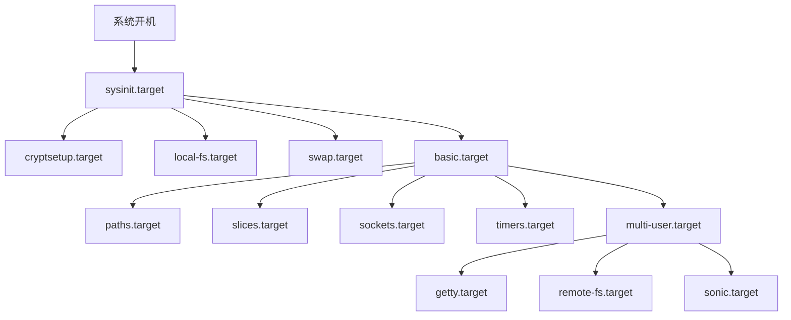
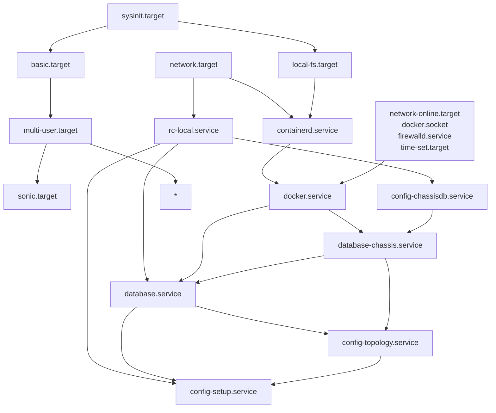

# Logic of sonic startup

SONiC启动逻辑

Base on 202505


## 名词说明


## 分区挂载


| Device Name | Size | Read Only | FS Type  | Mount Point | Origin File                       | Comment           |
| ----------- | ---- | --------- | -------- | ----------- | ----------------------------------| ----------------- |
| /dev/sda3   | 32G  | No        | ext4     | /host       |                                   | SONiC分区                                                    |
| /loop0      | /    | Yes       | squashfs | /           | /host/image-xx-yy/fs.squashfs     | SONiC真实文件系统 (也是下方OverlayFS的只读层,OverlayFS-lowerdir)  |
| root-overlay| /    | Yes       | squashfs | /           | /                                 | SONiC真实文件系统-只读层,OverlayFS-lowerdir                     |
| root-overlay| /    | No        | ext4     | /           | /host/image-xx-yy/rw/             | SONiC真实文件系统-可写层,OverlayFS-upperdir                     |
| root-overlay| /    | No        | ext4     | /           | /host/image-xx-yy/work/           | SONiC真实文件系统-内部工作目录,OverlayFS-workdir                 |
| (bind)      | /    | No        | ext4     | /var/lib/docker/   | /host/image-xx-yy/docker/  | SONiC Docker存储路径                                          |
| (bind)      | /    | No        | ext4     | /boot       | /host/image-xx-yy/boot/           | SONiC Image启动配置存储路径                                    |
| /loop1      | 4G   | No        | ext4     | /var/log    | /host/disk-img/var-log.ext4       | SONiC日志          |
|             |      |           |          |             |                                   |                   |
|             |      |           |          |             |                                   |                   |


**RAW LOG**:

```sh
root@sonic:/host# df -h
Filesystem      Size  Used Avail Use% Mounted on
udev            965M     0  965M   0% /dev
tmpfs           197M  7.5M  190M   4% /run
root-overlay     16G  1.9G   14G  13% /
/dev/sda3        16G  1.9G   14G  13% /host
/dev/loop1      3.9G   34M  3.7G   1% /var/log
tmpfs           984M     0  984M   0% /dev/shm
tmpfs           5.0M     0  5.0M   0% /run/lock
tmpfs           4.0M     0  4.0M   0% /sys/fs/cgroup
overlay          16G  1.9G   14G  13% /var/lib/docker/overlay2/765684947a5593553b7fca42dddb3c9ee19710a222aa4218a99b341d368629d6/merged
overlay          16G  1.9G   14G  13% /var/lib/docker/overlay2/91689ac8699c73aae741052f0277de55a67e293dcf280d1c997c63a8e6276116/merged
overlay          16G  1.9G   14G  13% /var/lib/docker/overlay2/dc902a0ace15682ceb34b7da488febcf7da58cba7040d951f212dd53ae99bb41/merged
overlay          16G  1.9G   14G  13% /var/lib/docker/overlay2/d311491fb952d3c78cf75ebe289123a6cf03779975113e8c0ad6b8ff35dcb4e5/merged
overlay          16G  1.9G   14G  13% /var/lib/docker/overlay2/9f89174573d212b54c6e9f4be30e02695792c882236650d26b2910517a934ea1/merged
overlay          16G  1.9G   14G  13% /var/lib/docker/overlay2/817764598eed7f2795d11c5ed206579dccc78333d97343bf2a8639047bc62d55/merged
overlay          16G  1.9G   14G  13% /var/lib/docker/overlay2/5cbe0b2cb772765db19fa7c40cefa167674b8b5e5106c50d2b3a31a29c26b55d/merged
overlay          16G  1.9G   14G  13% /var/lib/docker/overlay2/05cb4a774c22b53771dd6d3bd4c6e8aba9ee1cc9be7c478ffa22d8934c2fc920/merged
overlay          16G  1.9G   14G  13% /var/lib/docker/overlay2/51b8d4cda74003cf1fbfed8af78ce1530edc2cc376315260f84b5bd587e1eb06/merged
overlay          16G  1.9G   14G  13% /var/lib/docker/overlay2/253615db841e86d331b20a872e6b9e3831b019b9379e509c747bef9bf09340cd/merged
root@sonic:/host# lsblk 
NAME   MAJ:MIN RM   SIZE RO TYPE MOUNTPOINT
fd0      2:0    1     4K  0 disk 
loop0    7:0    0 347.9M  0 loop 
loop1    7:1    0     4G  0 loop /var/log
sda      8:0    0    16G  0 disk 
├─sda1   8:1    0     2M  0 part 
├─sda2   8:2    0   128M  0 part 
└─sda3   8:3    0  15.9G  0 part /host
sr0     11:0    1  1024M  0 rom 
```


## 步骤概述

1. BIOS/UEFI → GRUB2
   ↓
2. GRUB加载内核和initrd到内存
   ↓
3. 内核初始化，挂载initrd为临时根文件系统
   ↓
4. initrd中的init脚本执行：
   ├── 加载必要的驱动
   ├── 扫描存储设备
   ├── 挂载包含fs.squashfs的分区
   ├── 通过loop设备挂载fs.squashfs
   ↓
5. 切换到fs.squashfs作为新根文件系统
   ↓
6. 执行/sbin/init（systemd）
   ↓
7. 系统完全启动


### 1. GRUB阶段

```sh
menuentry '$demo_grub_entry' {      # SONiC-${demo_type}-${image_version}=SONiC-OS/DIAG-202505.1022539-92b55b412
        search --no-floppy --label --set=root $demo_volume_label                # demo_volume_label=SONiC-OS or SONiC-DIAG
        echo    'Loading $demo_volume_label $demo_type kernel ...'              # Loading SONiC-OS OS kernel ...
        insmod gzio
        if [ x$grub_platform = xxen ]; then insmod xzio; insmod lzopio; fi
        insmod part_msdos
        insmod ext2
        # root=/ (SONiC所在分区根目录)
        $GRUB_CFG_LINUX_CMD   /$image_dir/boot/vmlinuz-6.1.0-29-2-${arch} root=$grub_cfg_root rw $GRUB_CMDLINE_LINUX  \
                net.ifnames=0 biosdevname=0 \
                # loop=/image-202505.1022539-92b55b412/fs.squashfs loopfstype=squashfs
                loop=$image_dir/$FILESYSTEM_SQUASHFS loopfstype=squashfs                       \
                systemd.unified_cgroup_hierarchy=0 \
               #  apparmor=1 security=apparmor varlog_size=4096 usbcore.autosuspend=-1
                apparmor=1 security=apparmor varlog_size=$VAR_LOG_SIZE usbcore.autosuspend=-1 $ONIE_PLATFORM_EXTRA_CMDLINE_LINUX
        echo    'Loading $demo_volume_label $demo_type initial ramdisk ...'     # Loading SONiC-OS OS initial ramdisk ...
        $GRUB_CFG_INITRD_CMD  /$image_dir/boot/initrd.img-6.1.0-29-2-${arch}
}
```


1. 通过`search`命令找到`SONiC-OS/DIAG`卷标的*分区*
2. 加载必要的*模块*（gzio,文件系统,分区支持等）
3. 加载*内核*`vmlinuz-6.1.0-29-2-${arch}`
4. 传递*内核启动参数*, loop=/image-xx/fs.squashfs 等
5. 加载`initrd.img-6.1.0-29-2-${arch}`到*内存*


### 2. 内核初始化阶段

1. 内核解压并*初始化硬件*
2. 从内存中加载`initrd`作为**临时根文件系统**
3. 执行`initrd`中的初始化脚本`/init`


### 3. 引导真实根文件系统阶段

通过执行`initrd`中的初始化脚本`/init`引导进入真实文件系统


[详细步骤-参阅Reference目录](./Details/初始化引导-initramfs-tools.md#启动脚本)


**启动流程**: (/usr/share/initramfs-tools/init)
1. sysfs: `mount -t sysfs -o nodev,noexec,nosuid sysfs /sys`
2. procfs: `mount -t proc -o nodev,noexec,nosuid proc /proc`
3. devtmpfs: `mount -t devtmpfs -o nosuid,mode=0755 udev /dev`
   1. /dev/fd -> /proc/self/fd: `ln -s /proc/self/fd /dev/fd`
   2. /dev/stdin -> /proc/self/fd/0: `ln -s /proc/self/fd/0 /dev/stdin`
   3. /dev/stdout -> /proc/self/fd/1: `ln -s /proc/self/fd/1 /dev/stdout`
   4. /dev/stderr -> /proc/self/fd/2: `ln -s /proc/self/fd/2 /dev/stderr`
   5. /dev/pts: `mount -t devpts -o noexec,nosuid,gid=5,mode=0620 devpts /dev/pts || true`
4. . /conf/arch.conf
5. . /conf/initramfs.conf
6. . /conf/conf.d/*
7. . /scripts/functions
8. tmpfs: `mount -t tmpfs -o "nodev,noexec,nosuid,size=${RUNSIZE:-10%},mode=0755" tmpfs /run`
9. `init-top`: 此目录中的脚本是在 sysfs 和 procfs 挂载后首先执行的脚本。它还会运行 udev 钩子来填充 /dev 树（udev 将一直运行到 init-bottom）。
10. `init-premount`: 发生在由钩子和 `/etc/initramfs-tools/modules` 指定的模块加载完成之后。
11. . /scripts/local
12. . /scripts/nfs
13. . /scripts/${BOOT} (BOOT=local/nfs)
14. `local-top`/`nfs-top`: 这些脚本执行后，rootdevice 节点应已存在（本地），或者网络接口应可使用（NFS）。
15. `local-block`: 这些脚本通过本地块设备的名称调用。这些脚本执行后，该设备节点应存在。如果 local-top 或 local-block 脚本未能创建所需的设备节点，将定期调用 local-block 脚本来重试。如，设置根设备为USB设备，这时为异步发现设备，或需要一定时间去发现该设备。
16. `local-premount`/`nfs-premount`: 在根设备的完整性已得到验证（本地）或网络接口已启动（NFS）之后，但在实际的根文件系统被挂载之前运行。
17. local_mount_root: 挂载根分区，如 /dev/sda3 到 root(/)
    1. fsck -> /dev/sda3: `logsave -a -s $FSCK_LOGFILE fsck $spinner $force $fix -T -t "$TYPE" "$DEV"` -> `fsck -a -T -t ext4 /dev/sda3`
    2. /dev/sda3 -> /root: `mount ${roflag} ${FSTYPE:+-t "${FSTYPE}"} ${ROOTFLAGS} "${ROOT}" "${rootmnt?}"`
    3. mount_loop_root: 引导挂载真实文件系统loop文件, 并将原始根分区移动到/host下, 无论是本地FS挂载还是网络FS挂载都支持
       1. /root -> /host: `mount -o move "${rootmnt}" /host` (mount_loop_root)
       2. fs.squashfs -> /root: `mount ${roflag} -o loop -t "${FSTYPE}" "${LOOPFLAGS}" "$loopfile" "${rootmnt}"` (mount_loop_root)
       3. /host -> /root/host: `[ -d "${rootmnt}/host" ] && mount -o move /host "${rootmnt}/host"` (mount_loop_root)
18. `local-bottom`/`nfs-bottom`: 会在 rootfs 已挂载（本地）或 NFS 根共享已挂载后运行。
19. `init-bottom`: 是在procfs和sysfs被移至实际根文件系统之前要执行的最后一批脚本，之后执行权将移交给此时应能在已挂载的根文件系统中找到的init二进制文件。udev会被停止。
    1. /dev -> /root/dev [udev]: `run_scripts /scripts/init-bottom` -> `mount -n -o move /dev "${rootmnt:?}/dev" || mount -n --move /dev "${rootmnt}/dev"`
20. `mount -n -o move /run ${rootmnt}/run`
21. /run -> /root/run: `mount -n -o move /run ${rootmnt}/run`
22. /sys -> /root/sys: `mount -n -o move /sys ${rootmnt}/sys`
23. /proc -> /root/proc: `mount -n -o move /proc ${rootmnt}/proc`
24. 链接/切换 到 真实的文件系统, 以 /root 为 / , 以 /root/sbin/init 为初始程序, 启动初始化: `exec run-init ${drop_caps} "${rootmnt}" "${init}" "$@" <"${rootmnt}/dev/console" >"${rootmnt}/dev/console" 2>&1`


**核心代码**:
- 基于核心开源项目`initramfs-tools`修改以适配SONiC引导: `https://salsa.debian.org/kernel-team/initramfs-tools.git`
- 本质上是一个`RAMFS`, 用于引导进入真实的根文件系统
- 主要基于开源项目的基础上, 添加`loop`相关参数到cmdline的解析支持, 以及作为真实文件系统的`fs.squashfs`的`loop`设备挂载函数`mount_loop_root`


**关键初始化步骤**:
- 环境搭建: 创建 /dev , /sys , /proc 等必要目录，挂载 sysfs , proc , udev 等虚拟文件系统
- 命令行参数解析: 处理内核启动参数（如 root= , ro/rw , debug 等），设置对应环境变量控制启动行为
- 模块加载: 加载必要的驱动模块，确保硬件设备可用
- 根文件系统挂载: 根据配置挂载根文件系统（支持本地,NFS 等多种方式），并处理 /usr 等额外文件系统的挂载/
- 系统引导: 验证目标 init 程序存在后，切换到实际根文件系统并启动 init 进程


**关键流程节点**:
- 早期初始化: 运行 /scripts/init-top 脚本，准备启动环境。
- 预挂载阶段: 运行 /scripts/init-premount 脚本，处理挂载前的准备工作。
- 根文件系统挂载: 执行 mountroot 等函数挂载根文件系统。
- 后期初始化: 运行 /scripts/init-bottom 脚本，完成最终准备工作。
- 切换根文件系统: 通过 run-init 切换到实际根文件系统并启动 init 进程。


### 3. 真实根文件系统初始化阶段

真实根文件系统由`fs.squashfs`中的二进制程序`/sbin/init`引导初始化

`/sbin/init` --link--> `/lib/systemd/systemd`, 即 /sbin/init (PID 1)


```sh
root@sonic:~# systemctl list-dependencies multi-user.target
multi-user.target
 ├─auditd.service
 ├─config-chassisdb.service
 ├─config-setup.service
 ├─config-topology.service
 ├─containerd.service
 ├─cron.service
 ├─database-chassis.service
 ├─database.service
 ├─dbus.service
 ├─determine-reboot-cause.service
 ├─docker.service
 ├─e2scrub_reap.service
 ├─fstrim.timer
 ├─kexec-load.service
 ├─logrotate-config.service
 ├─monit.service
 ├─netfilter-persistent.service
 ├─pcie-check.service
 ├─process-reboot-cause.service
 ├─ras-mc-ctl.service
 ├─rasdaemon.timer
 ├─rc-local.service     # `/etc/rc.local start`
 ├─rsyslog.service
 ├─smartmontools.service
 ├─ssh.service
 ├─sysfsutils.service
 ├─sysstat.service
 ├─system-health.service
 ├─systemd-ask-password-wall.path
 ├─systemd-logind.service
 ├─systemd-update-utmp-runlevel.service
 ├─systemd-user-sessions.service
 ├─warmboot-finalizer.service
 ├─watchdog-control.service
 ├─basic.target            # ! Importance Point
   ├─kdump-tools.service
 │ ├─networking.service       # `/usr/share/ifupdown2/sbin/start-networking start`
 │ ├─tmp.mount
 │ ├─paths.target
 │ ├─slices.target
 │ │ ├─-.slice
 │ │ └─system.slice
 │ ├─sockets.target
 │ │ ├─dbus.socket
 │ │ ├─docker.socket
 │ │ ├─systemd-initctl.socket
 │ │ ├─systemd-journald-audit.socket
 │ │ ├─systemd-journald-dev-log.socket
 │ │ ├─systemd-journald.socket
 │ │ ├─systemd-udevd-control.socket
 │ │ ├─systemd-udevd-kernel.socket
 │ │ └─uuidd.socket
 │ ├─sysinit.target
 │ │ ├─apparmor.service
 │ │ ├─dev-hugepages.mount
 │ │ ├─dev-mqueue.mount
 │ │ ├─haveged.service
 │ │ ├─kmod-static-nodes.service
 │ │ ├─proc-sys-fs-binfmt_misc.automount
 │ │ ├─sys-fs-fuse-connections.mount
 │ │ ├─sys-kernel-config.mount
 │ │ ├─sys-kernel-debug.mount
 │ │ ├─sys-kernel-tracing.mount
 │ │ ├─systemd-ask-password-console.path
 │ │ ├─systemd-binfmt.service
 │ │ ├─systemd-firstboot.service
 │ │ ├─systemd-journal-flush.service
 │ │ ├─systemd-journald.service
 │ │ ├─systemd-machine-id-commit.service
 │ │ ├─systemd-modules-load.service
 │ │ ├─systemd-pcrphase-sysinit.service
 │ │ ├─systemd-pcrphase.service
 │ │ ├─systemd-pstore.service
 │ │ ├─systemd-random-seed.service
 │ │ ├─systemd-repart.service
 │ │ ├─systemd-sysctl.service
 │ │ ├─systemd-sysusers.service
 │ │ ├─systemd-tmpfiles-setup-dev.service
 │ │ ├─systemd-tmpfiles-setup.service
 │ │ ├─systemd-udev-trigger.service
 │ │ ├─systemd-udevd.service
 │ │ ├─systemd-update-utmp.service
 │ │ ├─cryptsetup.target
 │ │ ├─integritysetup.target
 │ │ ├─local-fs.target
 │ │ │ └─systemd-remount-fs.service
 │ │ ├─swap.target
 │ │ └─veritysetup.target
 │ └─timers.target
 │   ├─aaastatsd.timer
 │   ├─apt-daily-upgrade.timer
 │   ├─apt-daily.timer
 │   ├─dpkg-db-backup.timer
 │   ├─e2scrub_all.timer
 │   ├─featured.timer
 │   ├─fstrim.timer
 │   ├─hostcfgd.timer
 │   ├─logrotate.timer
 │   ├─systemd-tmpfiles-clean.timer
 │   └─tacacs-config.timer
 ├─getty.target
 │ ├─getty-static.service
 │ ├─getty@tty1.service
 │ └─serial-getty@ttyS0.service
 ├─remote-fs.target
 └─sonic.target            # ! Importance Point
   ├─aaastatsd.timer
   ├─backend-acl.service
   ├─banner-config.service
   ├─bgp.service
   ├─caclmgrd.service
   ├─chrony.service
   ├─copp-config.service
   ├─dash-ha.service
   ├─dhcp_relay.service
   ├─eventd.service
   ├─featured.timer
   ├─gbsyncd.service
   ├─hostcfgd.timer
   ├─hostname-config.service
   ├─interfaces-config.service
   ├─macsec.service
   ├─mux.service
   ├─nat.service
   ├─procdockerstatsd.service
   ├─radv.service
   ├─rsyslog-config.service
   ├─serial-config.service
   ├─swss.service
   ├─syncd.service
   ├─sysmgr.service
   ├─tacacs-config.timer
   └─teamd.service
```


Others:

- pmon.service


#### systemd 详细说明


multi-user.target
- auditd.service
- config-chassisdb.service
   - Link: 
   - Desc: Config chassis_db
   - Exec: /usr/bin/config-chassisdb
   - Dep : rc-local.service
- config-setup.service
   - Link: files/build_templates/config-setup.service.j2
   - Desc: 配置初始化和迁移服务
   - Exec: /usr/bin/config-setup boot
   - Dep : rc-local.service database.service config-topology.service
- config-topology.service
   - Link: 
   - Desc: 平台拓扑配置服务
   - Exec: /usr/bin/config-topology.sh start
   - Dep : database.service database-chassis.service
- containerd.service
   - Link: 
   - Desc: containerd container runtime
   - Exec: -/sbin/modprobe overlay; /usr/bin/containerd
   - Dep : network.target local-fs.target
- cron.service
- database-chassis.service
   - Link: 
   - Desc: 
   - Exec: [ -e /etc/sonic/chassisdb.conf ] && /usr/bin/database.sh start chassisdb && /usr/bin/database.sh wait chassisdb
   - Dep : docker.service config-chassisdb.service
- database.service
   - Link: 
   - Desc: 
   - Exec: /usr/local/bin/database.sh start; /usr/local/bin/database.sh wait
   - Dep : database-chassis.service docker.service rc-local.service
- dbus.service
- determine-reboot-cause.service
- docker.service
   - Link: 
   - Desc: Docker Application Container Engine
   - Exec: /usr/bin/dockerd -H fd:// --containerd=/run/containerd/containerd.sock
   - Dep : network-online.target docker.socket firewalld.service containerd.service time-set.target
- e2scrub_reap.service
- fstrim.timer
- kexec-load.service
- logrotate-config.service
- monit.service
- netfilter-persistent.service
- pcie-check.service
- process-reboot-cause.service
- ras-mc-ctl.service
- rasdaemon.timer
- rc-local.service     # `/etc/rc.local start`
- rsyslog.service
- smartmontools.service
- ssh.service
- sysfsutils.service
- sysstat.service
- system-health.service
- systemd-ask-password-wall.path
- systemd-logind.service
- systemd-update-utmp-runlevel.service
- systemd-user-sessions.service
- warmboot-finalizer.service
- watchdog-control.service
- basic.target            # ! Importance Point
  - kdump-tools.service
  - networking.service       # `/usr/share/ifupdown2/sbin/start-networking start`
  - tmp.mount
  - paths.target
  - slices.target
    - -.slice
    - system.slice
  - sockets.target
    - dbus.socket
    - docker.socket
    - systemd-initctl.socket
    - systemd-journald-audit.socket
    - systemd-journald-dev-log.socket
    - systemd-journald.socket
    - systemd-udevd-control.socket
    - systemd-udevd-kernel.socket
    - uuidd.socket
  - sysinit.target        # ! Importance Point
    - apparmor.service
    - dev-hugepages.mount
    - dev-mqueue.mount
    - haveged.service
    - kmod-static-nodes.service
    - proc-sys-fs-binfmt_misc.automount
    - sys-fs-fuse-connections.mount
    - sys-kernel-config.mount
    - sys-kernel-debug.mount
    - sys-kernel-tracing.mount
    - systemd-ask-password-console.path
    - systemd-binfmt.service
    - systemd-firstboot.service
    - systemd-journal-flush.service
    - systemd-journald.service
    - systemd-machine-id-commit.service
    - systemd-modules-load.service
    - systemd-pcrphase-sysinit.service
    - systemd-pcrphase.service
    - systemd-pstore.service
    - systemd-random-seed.service
    - systemd-repart.service
    - systemd-sysctl.service
    - systemd-sysusers.service
    - systemd-tmpfiles-setup-dev.service
    - systemd-tmpfiles-setup.service
    - systemd-udev-trigger.service
    - systemd-udevd.service
    - systemd-update-utmp.service
    - cryptsetup.target
    - integritysetup.target
    - local-fs.target
      - systemd-remount-fs.service
          - Link: 
          - Desc: 
          - Exec: 
          - Dep : 
    - swap.target
    - veritysetup.target
  - timers.target
    - aaastatsd.timer
    - apt-daily-upgrade.timer
    - apt-daily.timer
    - dpkg-db-backup.timer
    - e2scrub_all.timer
    - featured.timer
    - fstrim.timer
    - hostcfgd.timer
    - logrotate.timer
    - systemd-tmpfiles-clean.timer
    - tacacs-config.timer
- getty.target
  - getty-static.service
  - getty@tty1.service
  - serial-getty@ttyS0.service
- remote-fs.target
- sonic.target            # ! Importance Point
  - aaastatsd.timer
      - Link: 
      - Desc: 延迟 AAA 统计守护进程直到 SONiC 启动
      - Exec: 1min30s后启动aaastatsd.service (当 aaastatsd.service 被停止/重启时，这个定时器也会被同步停止/重启)
      - Dep : 

      - aaastatsd.service
        - Link: 
        - Desc: AAA Statistics Collection daemon
        - Exec: /usr/local/bin/aaastatsd
        - Dep : sonic.target hostcfgd.service config-setup.service
  - backend-acl.service
      - Link: 
      - Desc: 在存储后端机架顶部交换机上启用后端访问控制列表
      - Exec: /usr/bin/backend_acl.py
      - Dep : sonic.target swss.service
  - banner-config.service
      - Link: 
      - Desc: Update banner config based on configdb
      - Exec: /usr/bin/banner-config.sh
      - Dep : config-setup.service
  - bgp.service
      - Link: 
      - Desc: 启动BGP容器
      - Exec: /usr/local/bin/bgp.sh start; /usr/local/bin/bgp.sh wait
      - Dep : sonic.target database.service config-setup.service swss.service interfaces-config.service
  - caclmgrd.service
      - Link: 
      - Desc: Control Plane ACL configuration daemon
      - Exec: /usr/local/bin/caclmgrd
      - Dep : sonic.target config-setup.service
  - chrony.service
      - Link: 
      - Desc: chrony, an NTP client/server
      - Exec: !/usr/sbin/chronyd $DAEMON_OPTS
      - Dep : network.target
  - copp-config.service
      - Link: 
      - Desc: Update CoPP configuration
      - Exec: /usr/bin/copp-config.sh
      - Dep : sonic.target config-setup.service
  - dash-ha.service
      - Link: 
      - Desc: DASH HA container DASH高可用性容
      - Exec: /usr/local/bin/dash-ha.sh start; /usr/local/bin/dash-ha.sh wait
      - Dep : sonic.target interfaces-config.service database.service swss.service
  - dhcp_relay.service
      - Link: 
      - Desc: dhcp_relay container
      - Exec: /usr/local/bin/dhcp_relay.sh start; /usr/local/bin/dhcp_relay.sh wait
      - Dep : sonic.target swss.service syncd.service teamd.service
  - eventd.service
      - Link: 
      - Desc: EVENTD container
      - Exec: /usr/bin/eventd.sh start; /usr/bin/eventd.sh wait
      - Dep : sonic.target rsyslog-config.service
  - featured.timer
      - Link: 
      - Desc: Delays feature daemon until SONiC has started
      - Exec: 1min30s后启动 featured.service (当 featured.service 被停止/重启时，这个定时器也会被同步停止/重启)
      - Dep : 

      - featured.service
        - Link: 
        - Desc: Feature configuration daemon
        - Exec: /usr/local/bin/featured
        - Dep : sonic.target config-setup.service
  - gbsyncd.service
      - Link: 
      - Desc: gbsyncd service
      - Exec: [ /usr/bin/gbsyncd-platform.sh ] && /usr/local/bin/gbsyncd.sh start && /usr/local/bin/gbsyncd.sh wait
      - Dep : sonic.target database.service config-setup.service interfaces-config.service swss.service
  - hostcfgd.timer
      - Link: 
      - Desc: Delays hostcfgd daemon until SONiC has started
      - Exec: 1min30s后启动 hostcfgd.service (当 hostcfgd.service 被停止/重启时，这个定时器也会被同步停止/重启)
      - Dep : 

      - hostcfgd.service
        - Link: 
        - Desc: Host config enforcer daemon
        - Exec: /usr/local/bin/hostcfgd
        - Dep : sonic.target config-setup.service
  - hostname-config.service
      - Link: 
      - Desc: Update hostname based on configdb
      - Exec: /usr/bin/hostname-config.sh
      - Dep : sonic.target config-setup.service
  - interfaces-config.service
      - Link: 
      - Desc: Update interfaces configuration
      - Exec: /usr/bin/interfaces-config.sh
      - Dep : sonic.target config-setup.service
  - macsec.service
      - Link: 
      - Desc: macsec container
      - Exec: /usr/local/bin/macsec.sh start; /usr/local/bin/macsec.sh wait
      - Dep : sonic.target swss.service syncd.service
  - mux.service
      - Link: 
      - Desc: MUX Cable Container
      - Exec: /usr/local/bin/write_standby.py; /usr/local/bin/mark_dhcp_packet.py; /usr/bin/mux.sh start; /usr/bin/mux.sh wait
      - Dep : sonic.target swss.service interfaces-config.service
  - nat.service
      - Link: 
      - Desc: NAT container
      - Exec: /usr/bin/nat.sh start; /usr/bin/nat.sh wait
      - Dep : sonic.target config-setup.service swss.service syncd.service
  - procdockerstatsd.service
      - Link: 
      - Desc: 进程和 Docker CPU/内存利用率数据导出守护进程
      - Exec: /usr/local/bin/procdockerstatsd
      - Dep : sonic.target config-setup.service database.service
  - radv.service
      - Link: 
      - Desc: Router advertiser container 路由器通告容器
      - Exec: /usr/local/bin/radv.sh start; /usr/local/bin/radv.sh wait
      - Dep : sonic.target config-setup.service swss.service syncd.service
  - rsyslog-config.service
      - Link: 
      - Desc: Update rsyslog configuration
      - Exec: /usr/bin/rsyslog-config.sh
      - Dep : sonic.target config-setup.service interfaces-config.service
  - serial-config.service
      - Link: 
      - Desc: Update serial console config
      - Exec: /usr/bin/serial-config.sh
      - Dep : sonic.target
  - swss.service
      - Link: 
      - Desc: switch state service
      - Exec: /usr/local/bin/swss.sh start; /usr/local/bin/swss.sh wait
      - Dep : sonic.target config-setup.service database.service
  - syncd.service
      - Link: 
      - Desc: syncd service
      - Exec: 
      - Dep : sonic.target config-setup.service database.service swss.service
  - sysmgr.service
      - Link: 
      - Desc: Sysmgr Container 系统管理容器
      - Exec: /usr/bin/sysmgr.sh start; /usr/bin/sysmgr.sh wait
      - Dep : sonic.target database.service swss.service
  - tacacs-config.timer
      - Link: 
      - Desc: Delays tacacs apply until SONiC has started
      - Exec: 5min30s后启动 tacacs-config.service (当 tacacs-config.service 被停止/重启时，这个定时器也会被同步停止/重启)
      - Dep : 

      - tacacs-config.service
        - Link: 
        - Desc: TACACS application
        - Exec: /usr/local/bin/hostcfgd
        - Dep : sonic.target config-setup.service
  - teamd.service
      - Link: 
      - Desc: TEAMD container
      - Exec: /usr/local/bin/teamd.sh start; /usr/local/bin/teamd.sh wait
      - Dep : sonic.target config-setup.service swss.service

- pmon.service  # BindsTo=sonic.target
    - Link: 
    - Desc: Platform monitor container
    - Exec: /usr/bin/pmon.sh start; /usr/bin/pmon.sh wait
    - Dep : sonic.target database.service config-setup.service


#### systemd 关系梳理

- 90s: aaastatsd.service

- swss.service
  - backend-acl.service
- database.service config-setup.service swss.service interfaces-config.service
  - bgp.service


- systemd启动流程关系梳理
  - `*.target`
    - 不等其子项service等完成(`Wants=`关系), 只发送命令启动这些子项serice
    - 只等其配置的`Requires=`
    - 基本上*.target的完成是一瞬间的
  - `After=`
    - `Type=simple`: 只等它 “启动”，不等 ExecStart 跑完，立刻标记 active (running)
    - `Type=oneshot`: 等 ExecStart 整个跑完、进程正常退出，才会标记 active (exited)
    - `Type=forking`: 等 fork 出守护进程、父进程退出，才会标记 active (running)
    - `Type=notify`: 等服务显式发 “就绪信号”，不等 ExecStart 跑完，等 “我准备好了”
    - `Type=dbus`: 等服务显式发 “就绪信号”，不等 ExecStart 跑完，等 “我准备好了”
  - 


##### systemd-target 触发流程图




##### systemd-service SONiC相关时序图

- multi-user.target




- sonic.target

```mermaid
flowchart LR

%% ==== 先声明所有节点 ====
   T_SONIC[sonic.target]
   T_NETWORK[network.target]

   %% 基础依赖
   S_DATABASE[database.service]
   S_DATABASE_CHASSIS[database-chassis.service]

   %% 配置类服务
   S_CONFIG_SETUP[config-setup.service]
   S_CONFIG_TOPOLOGY[config-topology.service]
   S_RSYSLOG_CONFIG[rsyslog-config.service]
   S_SERIAL_CONFIG[serial-config.service]
   S_BANNER_CONFIG[banner-config.service]
   S_INTERFACES_CONFIG[interfaces-config.service]
   S_COPP_CONFIG[copp-config.service]
   S_HOSTNAME_CONFIG[hostname-config.service]
   S_HOSTCFGD[hostcfgd.service]
   S_HOSTCFGD_TIMER[hostcfgd.timer]
   S_CHRONY[chrony.service]
   S_TACACS_CONFIG[tacacs-config.service]
   S_TACACS_CONFIG_TIMER[tacacs-config.timer]

   %% 核心平台服务
   S_TEAMD[teamd.service]
   S_SWSS[swss.service]
   S_SYNCD[syncd.service]
   S_EVENTD[eventd.service]
   S_SYSMGR[sysmgr.service]

   %% 业务协议服务
   S_BGP[bgp.service]
   S_DHCP_RELAY[dhcp_relay.service]
   S_RADV[radv.service]
   S_MACSEC[macsec.service]
   S_MUX[mux.service]
   S_NAT[nat.service]

   %% 监控/统计
   S_AAASTATSD[aaastatsd.service]
   S_AAASTATSD_TIMER[aaastatsd.timer]
   S_PROCDOCKERSTATS[procdockerstatsd.service]
   S_BACKEND_ACL[backend-acl.service]
   S_CACLMGRD[caclmgrd.service]
   S_GBSYNCD[gbsyncd.service]
   S_DASH_HA[dash-ha.service]
   S_PMON[pmon.service]

   %% 其他
   S_FEATURED[featured.service]
   S_FEATURED_TIMER[featured.timer]

%% ==== 启动顺序主线（严格按依赖） ====

   %% == sonic.target ==

   %% aaastatsd
   S_AAASTATSD_TIMER --90s--> S_AAASTATSD
   T_SONIC --> S_AAASTATSD
   S_CONFIG_SETUP --> S_AAASTATSD
   S_HOSTCFGD --> S_AAASTATSD

   %% backend-acl
   T_SONIC --> S_BACKEND_ACL
   S_SWSS --> S_BACKEND_ACL

   %% banner-config
   S_CONFIG_SETUP --> S_BANNER_CONFIG

   %% bgp
   T_SONIC --> S_BGP
   S_CONFIG_SETUP --> S_BGP
   S_DATABASE --> S_BGP
   S_SWSS --> S_BGP

   %% caclmgrd
   T_SONIC --> S_CACLMGRD
   S_CONFIG_SETUP --> S_CACLMGRD

   %% chrony
   T_NETWORK --> S_CHRONY

   %% copp-config
   T_SONIC --> S_COPP_CONFIG
   S_CONFIG_SETUP --> S_COPP_CONFIG

   %% dash-ha
   T_SONIC --> S_DASH_HA
   S_INTERFACES_CONFIG --> S_DASH_HA
   S_DATABASE --> S_DASH_HA
   S_SWSS --> S_DASH_HA

   %% dhcp_relay
   T_SONIC --> S_DHCP_RELAY
   S_SWSS --> S_DHCP_RELAY
   S_SYNCD --> S_DHCP_RELAY
   S_TEAMD --> S_DHCP_RELAY

   %% eventd
   T_SONIC --> S_EVENTD
   S_RSYSLOG_CONFIG --> S_EVENTD

   %% featured
   S_FEATURED_TIMER --90s--> S_FEATURED
   T_SONIC --> S_FEATURED
   S_CONFIG_SETUP --> S_FEATURED

   %% gbsyncd
   T_SONIC --> S_GBSYNCD
   S_DATABASE --> S_GBSYNCD
   S_CONFIG_SETUP --> S_GBSYNCD
   S_INTERFACES_CONFIG --> S_GBSYNCD
   S_SWSS --> S_GBSYNCD

   %% hostcfgd
   S_HOSTCFGD_TIMER --90s--> S_HOSTCFGD
   T_SONIC --> S_HOSTCFGD
   S_CONFIG_SETUP --> S_HOSTCFGD

   %% hostname-config
   T_SONIC --> S_HOSTNAME_CONFIG
   S_CONFIG_SETUP --> S_HOSTNAME_CONFIG

   %% interfaces-config
   T_SONIC --> S_INTERFACES_CONFIG
   S_CONFIG_SETUP --> S_INTERFACES_CONFIG

   %% macsec
   T_SONIC --> S_MACSEC
   S_SWSS --> S_MACSEC
   S_SYNCD --> S_MACSEC

   %% mux
   T_SONIC --> S_MUX
   S_SWSS --> S_MUX
   S_INTERFACES_CONFIG --> S_MUX

   %% nat
   T_SONIC --> S_NAT
   S_CONFIG_SETUP --> S_NAT
   S_SWSS --> S_NAT
   S_SYNCD --> S_NAT

   %% procdockerstatsd
   T_SONIC --> S_PROCDOCKERSTATS
   S_CONFIG_SETUP --> S_PROCDOCKERSTATS
   S_DATABASE --> S_PROCDOCKERSTATS

   %% radv
   T_SONIC --> S_RADV
   S_CONFIG_SETUP --> S_RADV
   S_SWSS --> S_RADV
   S_SYNCD --> S_RADV

   %% rsyslog-config
   T_SONIC --> S_RSYSLOG_CONFIG
   S_CONFIG_SETUP --> S_RSYSLOG_CONFIG
   S_INTERFACES_CONFIG --> S_RSYSLOG_CONFIG

   %% serial-config
   T_SONIC --> S_SERIAL_CONFIG

   %% swss
   T_SONIC --> S_SWSS
   S_CONFIG_SETUP --> S_SWSS
   S_DATABASE --> S_SWSS

   %% syncd
   T_SONIC --> S_SYNCD
   S_CONFIG_SETUP --> S_SYNCD
   S_DATABASE --> S_SYNCD
   S_SWSS --> S_SYNCD

   %% sysmgr
   T_SONIC --> S_SYSMGR
   S_DATABASE --> S_SYSMGR
   S_SWSS --> S_SYSMGR

   %% tacacs-config
   S_TACACS_CONFIG_TIMER --5m30s--> S_TACACS_CONFIG
   T_SONIC --> S_TACACS_CONFIG
   S_CONFIG_SETUP --> S_TACACS_CONFIG

   %% teamd
   T_SONIC --> S_TEAMD
   S_CONFIG_SETUP --> S_TEAMD
   S_SWSS --> S_TEAMD

   %% == Others ==

   %% pmon
   T_SONIC --> S_PMON
   S_CONFIG_SETUP --> S_PMON
   S_DATABASE --> S_PMON


%% ==== 整理 ====
   subgraph *.target
      T_SONIC
      T_NETWORK
   end
   subgraph *.timer
      S_AAASTATSD_TIMER
      S_FEATURED_TIMER
      S_HOSTCFGD_TIMER
      S_TACACS_CONFIG_TIMER
   end
   subgraph multi-user.target
      S_CONFIG_SETUP
      S_CONFIG_TOPOLOGY
      S_DATABASE
      S_DATABASE_CHASSIS
   end
```




#### /etc/rc.local

- rc-local.service
  - After: network.target
  - ExecStart: /etc/rc.local start

1. 初始化阶段
   1. 从`/etc/sonic/sonic_version.yml`读取SONiC版本号`SONIC_VERSION`(i.e. 202311.986446-3efdc0000): `SONIC_VERSION=$(cat /etc/sonic/sonic_version.yml | grep "build_version" | sed -e "s/build_version: //g;s/'//g")`
   2. 检查`/host/image-${SONIC_VERSION}/sonic-config/sonic-environment`是否存在, 如果存在, 将其移动到`/etc/sonic/sonic-environment`
2. 主执行流程
   1. 记录启动日志: `logger "SONiC version ${SONIC_VERSION} starting up..."`
   2. 检查`/host/machine.conf`是否存在, 如果 不存在 , 说明从其他 NOS 启动到 SONiC, 并从 ONIE 中提取并生成配置
      1. 查找onie所在分区`onie_dev`: `$(blkid | grep ONIE-BOOT | head -n 1 | awk '{print $1}' |  sed -e 's/:.*$//')`
      2. 挂载onie分区到 `/mnt/onie-boot`
      3. 以库的方式加载配置`onie_grub_cfg=/mnt/onie-boot/onie/grub/grub-machine.cfg`: `. ./$onie_grub_cfg`
      4. 将onie配置(onie_*=xxx)并写入`/host/machine.conf`: `grep = $onie_grub_cfg | sed -e 's/onie_//' -e 's/=.*$//' | while read var; do eval val='$'onie_$var; echo "onie_${var}=${val}" >> /host/machine.conf done`
      5. 设置`grub_installation_needed="TRUE"`标志
      6. 执行`migrate_nos_configuration`函数迁移配置, 迁移旧的核心配置到目录`/host/migration`:
         1. 创建空白迁移目录`/host/migration`: `rm -rf /host/migration; mkdir -p /host/migration`
         2. 提取包含迁移文件的前一个NOS分区:
            1. 提取命令行参数`cmdline`中的核心迁移参数:
               1. NOS所在分区`nos_dev`: `nos-config-part=*`, `nos_dev="${x#nos-config-part=}"`
               2. 是否配置sonic快速重启`sonic_fast_reboot`: `SONIC_BOOT_TYPE=fast*`, `sonic_fast_reboot=true`
            2. 若`cmdline`中没有需要迁移的前一个NOS分区`nos_dev`, 则*跳过接下来的操作*
            3. 移除`/host/grub/grub.cfg`中上述`cmdline`的相关配置:
               1. `nos-config-part=*`: `sed -r -i.bak "s/nos-config-part=[^[:space:]]+//" /host/grub/grub.cfg`
               2. `ssd-upgrader-part=`: `sed -r -i.bak "s/ssd-upgrader-part=[^[:space:]]+//" /host/grub/grub.cfg`
            4. 定义需要迁移的文件的相关参数及其值:
               - `NOS_DIR`=/mnt/nos_migration
               - MG_GZFILE=$NOS_DIR/minigraph.xml.gz.base64.txt
               - MG_FILE=$NOS_DIR/`minigraph.xml`
               - ACL_GZFILE=$NOS_DIR/acl.json.gz.base64.txt
               - ACL_FILE=$NOS_DIR/`acl.json`
               - PORT_CONFIG_GZFILE=$NOS_DIR/port_config.json.gz.base64.txt
               - PORT_CONFIG_FILE=$NOS_DIR/`port_config.json`
               - GOLDEN_CONFIG_DB_GZFILE=$NOS_DIR/golden_config_db.json.gz.base64.txt
               - GOLDEN_CONFIG_DB_FILE=$NOS_DIR/`golden_config_db.json`
               - SNMP_FILE=$NOS_DIR/`snmp.yml`
            5. 挂载前一个需要迁移的NOS分区: `mkdir -p $NOS_DIR && mount $nos_dev $NOS_DIR`
            6. 解码并解压需要迁移的文件:
               - MG_GZFILE: `[ -f $MG_GZFILE ] && /usr/bin/base64 -d $MG_GZFILE | /bin/gunzip > $MG_FILE`
               - ACL_GZFILE: `[ -f $ACL_GZFILE ] && /usr/bin/base64 -d $ACL_GZFILE | /bin/gunzip > $ACL_FILE`
               - PORT_CONFIG_GZFILE: `[ -f $PORT_CONFIG_GZFILE ] && /usr/bin/base64 -d $PORT_CONFIG_GZFILE | /bin/gunzip > $PORT_CONFIG_FILE`
               - GOLDEN_CONFIG_DB_GZFILE: `[ -f $GOLDEN_CONFIG_DB_GZFILE] && /usr/bin/base64 -d $GOLDEN_CONFIG_DB_GZFILE| /bin/gunzip > $GOLDEN_CONFIG_DB_FILE`
            7. 拷贝需要迁移的文件到创建的空白迁移目录`/host/migration`(不存在的文件跳过拷贝):
               - `mgmt_interface.cfg`: nos_migration_import $NOS_DIR/mgmt_interface.cfg /host/migration
               - `minigraph.xml`: nos_migration_import $MG_FILE /host/migration
               - `acl.json`: nos_migration_import $ACL_FILE /host/migration
               - `port_config.json`: nos_migration_import $PORT_CONFIG_FILE /host/migration
               - `golden_config_db.json`: nos_migration_import $GOLDEN_CONFIG_DB_FILE /host/migration
               - `snmp.yml`: nos_migration_import $SNMP_FILE /host/migration
            8. 若配置了sonic快速重启`sonic_fast_reboot`, 则迁移相关配置文件到`/host/fast-reboot`目录: mkdir -p /host/fast-reboot
               - `arp.json`: nos_migration_import $NOS_DIR/arp.json /host/fast-reboot
               - `fdb.json`: nos_migration_import $NOS_DIR/fdb.json /host/fast-reboot
               - `default_routes.json`: nos_migration_import $NOS_DIR/default_routes.json /host/fast-reboot
            9. 取消挂载需要迁移的NOS分区并移除该目录: `umount $NOS_DIR; rmdir $NOS_DIR`
            10. 若存在保留MAC的配置`mgmt_interface.cfg`, 则更新管理网口MAC地址, 使用ethtool更新eth0的MAC地址以及EEPROM, 以便后续重启使用NOS的MAC地址: `[ -f /host/migration/mgmt_interface.cfg ] && update_mgmt_interface_macaddr /host/migration/mgmt_interface.cfg`
            11. 设置迁移标志`migration`, 用于下方流程判断迁移所使用的方法以迁移到新的NOS上: `="TRUE"`
      7. 卸载onie分区
   3. 加载`/host/machine.conf`: `. /host/machine.conf`
   4. 编程控制台串口速度: `program_console_speed`
      1. 从内核命令行提取控制台波特率
         1. 默认`9600`
         2. 或从`console=ttyS0,115200`等参数提取
      2. 修改`/lib/systemd/system/serial-getty@.service`
         1. 首次启动：替换`--keep-baud`参数
         2. 后续启动：更新波特率值
      3. 执行`systemctl daemon-reload`重载配置
   5. 首次启动处理, 检查第一次启动的标志文件`/host/image-${SONIC_VERSION}/platform/firsttime`文件是否存在, 存在则:
      1. 确定平台类型`platform`:
         1. arm: `[ -n "$aboot_platform" ] && platform=$aboot_platform`
         2. x86: `[ -n "$onie_platform" ] && platform=$onie_platform`
         3. 都不存在则*删除标志文件并退出脚本*
      2. 配置文件迁移, 按优先级尝试迁移配置到`/etc/sonic/old_config/`:
         1. 若存在目录`/host/old_config`(配置文件放到了/host/old_config/目录下了):
            1. 移动该目录到`/etc/sonic/`: `mv -f /host/old_config /etc/sonic/`
            2. 移除旧子配置`old_config`: `rm -rf /etc/sonic/old_config/old_config`
            3. 创建迁移标志`/tmp/pending_config_migration`
         2. 若存在文件`/host/minigraph.xml`(配置文件放到了/host/目录下了):
            1. 创建旧配置目录`/etc/sonic/old_config/`: `mkdir -p /etc/sonic/old_config`
            2. 移动配置文件到旧配置目录:
               1. /host/minigraph.xml: `mv /host/minigraph.xml /etc/sonic/old_config/`
               2. /host/acl.json: `[ -f /host/acl.json ] && mv /host/acl.json /etc/sonic/old_config/`
               3. /host/port_config.json: `[ -f /host/port_config.json ] && mv /host/port_config.json /etc/sonic/old_config/`
               4. /host/snmp.yml: `[ -f /host/snmp.yml ] && mv /host/snmp.yml /etc/sonic/old_config/`
               5. /host/golden_config_db.json: `[ -f /host/golden_config_db.json ] && mv /host/golden_config_db.json /etc/sonic/old_config/`
            3. 创建迁移标志`/tmp/pending_config_migration`
         3. 若存在目录`/host/migration`及关键文件`/host/migration/minigraph.xml`(通过上方步骤刚从分区上迁移的, 配置文件放到了/host/migration/目录下了):
            1. 创建旧配置目录`/etc/sonic/old_config/`: `mkdir -p /etc/sonic/old_config`
            2. 移动配置文件到旧配置目录:
               1. /host/migration/minigraph.xml: `mv /host/migration/minigraph.xml /etc/sonic/old_config/`
               2. /host/migration/acl.json: `[ -f /host/migration/acl.json ] && mv /host/acl.json /etc/sonic/old_config/`
               3. /host/migration/port_config.json: `[ -f /host/migration/port_config.json ] && mv /host/port_config.json /etc/sonic/old_config/`
               4. /host/migration/snmp.yml: `[ -f /host/migration/snmp.yml ] && mv /host/snmp.yml /etc/sonic/old_config/`
               5. /host/migration/golden_config_db.json: `[ -f /host/migration/golden_config_db.json ] && mv /host/golden_config_db.json /etc/sonic/old_config/`
            3. 创建迁移标志`/tmp/pending_config_migration`
         4. 以上都不存在, 即不需要迁移, 创建标记文件`/tmp/pending_config_initialization`
      3. 向平台通知首次启动状态, 以便将其用于记录重启原因`reboot-cause`, 通过创建文件`/tmp/notify_firstboot_to_platform`的方式进行通知
      4. 创建`/host/reboot-cause/platform`目录用于记录某些platform的重启原因: `[ ! -d /host/reboot-cause/platform ] && mkdir -p /host/reboot-cause/platform`
      5. 安装`platform-name-device`的`sonic-platform`实现包`*.deb`:
         1. 若存在文件`/host/image-$SONIC_VERSION/platform/common/Packages.gz`, 则仅使用基础软件源与`apt`工具，以支持懒加载式软件包依赖管理
            1. 将原始的apt源移动到临时文件: `mv /etc/apt/sources.list /etc/apt/sources.list.rc-local`
            2. 添加`platform-name-device`的本地目录`/host/image-$SONIC_VERSION/platform/common`作为源: `echo "deb [trusted=yes] file:///host/image-$SONIC_VERSION/platform/common /" > /etc/apt/sources.list.d/sonic_debian_extension.list`
            3. 更新apt: `LANG=C DEBIAN_FRONTEND=noninteractive apt-get -o Acquire::Retries=1 update`
            4. 安装`platform-name-device`的`sonic-platform`deb包: `LANG=C DEBIAN_FRONTEND=noninteractive apt-get -o DPkg::Path=$PATH:/usr/local/bin -y install /host/image-$SONIC_VERSION/platform/$platform/*.deb`
            5. 清除刚添加和安装的apt相关配置和临时文件: `rm -f /etc/apt/sources.list.d/sonic_debian_extension.list; rm -f /var/lib/apt/lists/_host_image-${SONIC_VERSION}_platform_common_Packages.lz4`
            6. 恢复原始的apt源: `mv /etc/apt/sources.list.rc-local /etc/apt/sources.list`
         2. 否则通过`dpkg`直接安装: `dpkg -i /host/image-$SONIC_VERSION/platform/$platform/*.deb`
      6. 同步数据到磁盘: `sync`
      7. 若是通过另一个NOS的grub进入的SONiC, 则为此SONiC安装一个grub (`[ -n "$onie_platform" ] && [ -n  "$grub_installation_needed" ]`):
         1. 定义并检查是否存在grub工具包`/host/image-$SONIC_VERSION/platform/grub/grub*.deb`, 不存在则*删除标志文件并退出脚本* (有的)
         2. 安装grub工具包, 失败则*删除标志文件并退出脚本*: `dpkg -i $grub_bin > /dev/null 2>&1`
         3. 安装grub到`/host`(/host/grub): grub-install --boot-directory=/host --recheck $sonic_dev 2>/dev/null`
         4. ...
      8. 创建目录`/var/platform`, 供后续脚本将其输出文件存放于此
      9. 配置`kdump`工具: `[ -f /etc/default/kdump-tools ] && sed -i -e "s/__PLATFORM__/$platform/g" /etc/default/kdump-tools`
      10. *删除标志文件并退出脚本*
   6. 拷贝`fsck`检查日志到syslog: `[ -f /var/log/fsck.log.gz ] && gunzip -d -c /var/log/fsck.log.gz | logger -t "FSCK" rm -f /var/log/fsck.log.gz` 


**特性**:
- 支持从其他NOS迁移到SONiC, Ref: [从其他NOS的GRUB启动到SONiC](./Logic%20of%20sonic%20images.md#从其他NOS的GRUB启动到SONiC)


**主要**
- SONiC实际文件系统版本: /etc/sonic/sonic_version.yml
- SONiC环境变量覆盖: /host/image-${SONIC_VERSION}/sonic-config/sonic-environment -> /etc/sonic/sonic-environment
- ONIE机器配置检查与加载, 确定 platform-name : /host/machine.conf
- 根据cmdline更新串口波特率: program_console_speed()
- 首次启动与配置迁移处理: /host/image-${SONIC_VERSION}/platform/firsttime
- **根据 platform-name 安装特定的 sonic-platform-modules deb 包**: `dpkg -i /host/image-$SONIC_VERSION/platform/\$platform/*.deb`
  - 一般情况下, 该deb存在 **PDDF 的平台实现的特定的驱动及其配置**
    - `/lib/modules/6.1.0-29-2-amd64/extra/*.ko`
    - `/etc/modules-load.d/*.conf` (或通过下方 pddf-platform-init.service 实现自定义加载等)
  - 一般情况下, 该deb存在 **PDDF sonic_platform 的平台实现**
    - `/usr/share/sonic/device/$platform/sonic_platform-1.0-py3-none-any.whl`
  - 一般情况下, 该deb存在 **该平台的 PDDF 模块和设备初始化服务**
    - `/etc/systemd/system/pddf-platform-init.service` (或其他名称)
      - Before: `pmon.service` `watchdog-control.service`
      - Type: oneshot
      - ExecStartPre: `-/usr/local/bin/pre_pddf_init.sh`  # 加载特定驱动模块, 平台设备初始化, 选择匹配的pddf配置等
      - ExecStart: `/usr/local/bin/pddf_util.py install`  # 安装驱动模块, 生成相关sysfs节点等
      - ExecStop: `/usr/local/bin/pddf_util.py clean`     # 卸载驱动模块, 移除相关sysfs节点等
- SONiC分区(i.e. /dev/sda3)fsck检查与修复日志的解压处理: /var/log/fsck.log.gz


```log
Loading SONiC-OS OS kernel ...
Loading SONiC-OS OS initial ramdisk ...
tune2fs 1.47.0 (5-Feb-2023)
Setting reserved blocks percentage to 0% (0 blocks)
Setting reserved blocks count to 0
[   78.796793] kdump-tools[493]: Starting kdump-tools:
[   78.802460] kdump-tools[497]: no crashkernel= parameter in the kernel cmdline ... failed!
[   79.566065] rc.local[522]: +
[   79.593560] rc.local[523]: + grep build_version
[   79.599039] rc.local[522]: cat /etc/sonic/sonic_version.yml
[   79.617559] rc.local[524]: + sed -e s/build_version: //g;s/'//g
[   80.145235] rc.local[517]: + SONIC_VERSION=202505.1048828-77d024ab3
[   80.227761] rc.local[517]: + FIRST_BOOT_FILE=/host/image-202505.1048828-77d024ab3/platform/firsttime
[   80.486065] rc.local[517]: + SONIC_CONFIG_DIR=/host/image-202505.1048828-77d024ab3/sonic-config
[   80.492761] rc.local[517]: + SONIC_ENV_FILE=/host/image-202505.1048828-77d024ab3/sonic-config/sonic-environment
[   80.511336] rc.local[517]: + [ -d /host/image-202505.1048828-77d024ab3/sonic-config -a -f /host/image-202505.1048828-77d024ab3/sonic-config/sonic-environment ]
[   80.526483] rc.local[517]: + logger SONiC version 202505.1048828-77d024ab3 starting up...
[   81.257291] rc.local[517]: + grub_installation_needed=
[   81.274580] rc.local[517]: + [ ! -e /host/machine.conf ]
[   81.292616] rc.local[517]: + . /host/machine.conf
[   81.314546] rc.local[517]: + onie_arch=x86_64
[   81.326045] rc.local[517]: + onie_bin=
[   81.338135] rc.local[517]: + onie_boot_reason=install
[   81.370550] rc.local[517]: + onie_build_date=2018-11-17T04:18+00:00
[   81.378471] rc.local[517]: + onie_build_machine=kvm_x86_64
[   81.430420] rc.local[517]: + onie_build_platform=x86_64-kvm_x86_64-r0
[   81.490946] rc.local[517]: + onie_config_version=1
[   81.502209] rc.local[517]: + onie_dev=/dev/vda2
[   81.509908] rc.local[517]: + onie_disco_boot_reason=install
[   81.549666] rc.local[517]: + onie_disco_dns=10.0.2.3
[   81.574057] rc.local[517]: + onie_disco_interface=eth0
[   81.605286] rc.local[517]: + onie_disco_ip=10.0.2.15
[   81.618194] rc.local[517]: + onie_disco_lease=86400
[   81.635238] rc.local[517]: + onie_disco_mask=24
[   81.646226] rc.local[517]: + onie_disco_opt53=05
[   81.671436] rc.local[517]: + onie_disco_router=10.0.2.2
[   81.809850] rc.local[517]: + onie_disco_serverid=10.0.2.2
[   81.849473] rc.local[517]: + onie_disco_siaddr=10.0.2.2
[   81.866741] rc.local[517]: + onie_disco_subnet=255.255.255.0
[   81.882634] rc.local[517]: + onie_exec_url=file://dev/vdb/onie-installer.bin
[   81.895933] rc.local[517]: + onie_firmware=auto
[   81.934466] rc.local[517]: + onie_grub_image_name=shimx64.efi
[   81.965894] rc.local[517]: + onie_initrd_tmp=/
[   81.987359] rc.local[517]: + onie_installer=/var/tmp/installer
[   82.014052] rc.local[517]: + onie_kernel_version=4.9.95
[   82.021148] rc.local[517]: + onie_local_parts=
[   82.038642] rc.local[517]: + onie_machine=kvm_x86_64
[   82.087192] rc.local[517]: + onie_machine_rev=0
[   82.091494] rc.local[517]: + onie_neighs=[fe80::2-eth0],
[   82.097832] rc.local[517]: + onie_partition_type=gpt
[   82.103949] rc.local[517]: + onie_platform=x86_64-kvm_x86_64-r0
[   82.107115] rc.local[517]: + onie_root_dir=/mnt/onie-boot/onie
[   82.110241] rc.local[517]: + onie_secure_boot=yes
[   82.118627] rc.local[517]: + onie_skip_ethmgmt_macs=yes
[   82.122521] rc.local[517]: + onie_switch_asic=qemu
[   82.146146] rc.local[517]: + onie_uefi_arch=x64
[   82.195109] rc.local[517]: + onie_uefi_boot_loader=shimx64.efi
[   82.206004] rc.local[517]: + onie_vendor_id=42623
[   82.211756] rc.local[517]: + onie_version=master-201811170418
[   82.222997] rc.local[517]: + program_console_speed
[   82.239932] rc.local[543]: + cat /proc/cmdline
[   82.255046] rc.local[544]: + grep -Eo console=tty(S|AMA)[0-9]+,[0-9]+
[   82.273092] rc.local[545]: + cut -d , -f2
[   82.351989] rc.local[517]: + speed=115200
[   82.365737] rc.local[517]: + [ -z 115200 ]
[   82.370885] rc.local[517]: + CONSOLE_SPEED=115200
[   82.397600] rc.local[552]: + grep agetty /lib/systemd/system/serial-getty@.service
[   82.441567] rc.local[553]: + grep keep-baud
[   83.200673] rc.local[553]: ExecStart=-/sbin/agetty -o '-p -- \\u' --keep-baud 115200,57600,38400,9600 - $TERM
[   83.329475] rc.local[517]: + [ 0 = 0 ]
[   83.341417] rc.local[517]: + sed -i s|\-\-keep\-baud .* %I| 115200 %I|g /lib/systemd/system/serial-getty@.service
[   83.951842] rc.local[517]: + systemctl daemon-reload
[   92.033667] rc.local[517]: + [ -f /host/image-202505.1048828-77d024ab3/platform/firsttime ]
[   92.042312] rc.local[517]: + echo First boot detected. Performing first boot tasks...
[   92.055180] rc.local[517]: First boot detected. Performing first boot tasks...
[   92.067074] rc.local[517]: + [ -n  ]
[   92.075428] rc.local[517]: + [ -n x86_64-kvm_x86_64-r0 ]
[   92.087473] rc.local[517]: + platform=x86_64-kvm_x86_64-r0
[   92.096151] rc.local[517]: + [ -d /host/old_config ]
[   92.102338] rc.local[517]: + [ -f /host/minigraph.xml ]
[   92.107460] rc.local[517]: + [ -n  ]
[   92.119905] rc.local[517]: + touch /tmp/pending_config_initialization
[   92.198576] rc.local[517]: + touch /tmp/notify_firstboot_to_platform
[   92.287409] rc.local[517]: + [ ! -d /host/reboot-cause/platform ]
[   92.299905] rc.local[517]: + mkdir -p /host/reboot-cause/platform
[   92.482485] rc.local[517]: + [ -d /host/image-202505.1048828-77d024ab3/platform/x86_64-kvm_x86_64-r0 ]
[   92.495331] rc.local[517]: + [ -f /host/image-202505.1048828-77d024ab3/platform/common/Packages.gz ]
[   92.631852] rc.local[517]: + dpkg -i /host/image-202505.1048828-77d024ab3/platform/x86_64-kvm_x86_64-r0/sonic-platform-vs_1.0_amd64.deb
[   95.153487] rc.local[604]: Selecting previously unselected package sonic-platform-vs.
[  104.908319] rc.local[604]: (Reading database ... 45545 files and directories currently installed.)
[  104.924962] rc.local[604]: Preparing to unpack .../sonic-platform-vs_1.0_amd64.deb ...
[  105.303775] rc.local[604]: Unpacking sonic-platform-vs (1.0) ...
[  107.435471] rc.local[604]: Setting up sonic-platform-vs (1.0) ...
[  108.744074] rc.local[517]: + sync
[  109.460106] rc.local[517]: + [ -n x86_64-kvm_x86_64-r0 ]
[  109.470028] rc.local[517]: + [ -n  ]
[  109.474405] rc.local[517]: + mkdir -p /var/platform
[  109.582909] rc.local[517]: + [ -f /etc/default/kdump-tools ]
[  109.594877] rc.local[517]: + sed -i -e s/__PLATFORM__/x86_64-kvm_x86_64-r0/g /etc/default/kdump-tools
[  109.753229] rc.local[517]: + firsttime_exit
[  109.767750] rc.local[517]: + rm -rf /host/image-202505.1048828-77d024ab3/platform/firsttime
[  109.831130] rc.local[517]: + exit 0
```


#### sonic.target

##### 


