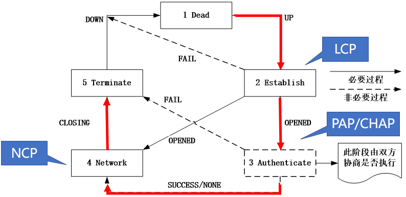

# L2-PPP

PPP（Point to Point Protocol，点到点协议）。

RFC1661

----

### 概述

现在全世界使用得最多的数据链路层协议是PPP（Point to Point Protocol，点到点协议） 。

PPP为点对点连接上传输多种协议的数据包提供了一种标准的方法，其最初的设计目的，是为两个对等结点之间的IP传输提供一种封装协议，除了IP以外，PPP还可以封装其它协议，包括Novell的IPX协议（Internetwork Packet Exchange，网间分组交换）等。

----

### 工作流程

在建立、保持和终止PPP链路的过程中，PPP链路需要经过5个阶段，除认证阶段外，其它4个阶段都是必要过程。 5个阶段如下：

1. 链路不可用阶段（Dead）
2. 链路建立阶段（Establish）
3. 认证阶段（Authenticate）[Option]
4. 网络层协议阶段（Network）
5. 链路终止阶段（Terminate）

核心逻辑如下：

1. **初始状态（Dead）**  
   
   此时链路处于静默状态，不发送任何报文，没有物理层连接或者链路被关闭。PPP链路都需从这个阶段开始和结束。Dead阶段也通常被称为物理层不可用阶段。
   
   - 当通信双方的两端检测到物理线路激活（通常是检测到链路上有载波信号）时，就会从Dead阶段跃迁至Establish阶段，即链路建立阶段。
     - 物理信号检测成功：
       - 对于以太网（PPPoE）：检测到 链路脉冲（Link Pulse） 或 载波信号（Carrier Detect）。
       - 对于串行链路（如RS-232）：检测到 DCD（Data Carrier Detect）信号有效。
       - 对于光纤链路：检测到 光信号强度（Optical Power）达到阈值。
     - 硬件驱动的就绪通知：
       - 操作系统或网络芯片通过驱动层上报 LINK_UP 事件（例如Linux中的 netif_carrier_on() 函数）。
       - 连接已加电的对端设备是 PHY芯片握手完成，上报 LINK_UP 。Switch Chip的 LINK UP一般是物理PHY握手成功，并不代表PPP协议协商成功。
       - USB/4G模块虚拟PPP链路是 虚拟驱动模拟 LINK_UP 事件

   - 链路被断开后也同样会返回到链路不可用阶段。

2. **建立阶段（Establish）**  
   
   物理层启动（up）后，进入此阶段进行**LCP（链路控制协议）协商**，目的是配置链路参数（如MRU、认证方式等）。  
   - 协商成功：进入“Opened”状态（链路已就绪）。  
   - 协商失败：返回Dead状态（需修改配置才能重试）。

3. **认证阶段（Authenticate）**  
   
   LCP协商成功后，若配置了认证（如PAP/CHAP），则进入此阶段：  
   - 认证成功（或无需认证）：进入Network阶段。  
   - 认证失败：触发Terminate（终止）流程，关闭LCP连接，返回Dead状态。

4. **网络层协商阶段（Network）**  
   通过**NCP（网络控制协议，如IPCP）协商网络层参数**（如IP地址分配）：  
   - 协商成功：链路可正常传输数据。  
   - 协商失败：触发Terminate流程，关闭连接，返回Dead状态。

5. **链路终止阶段（Terminate）**
   
   PPP能在任何时候终止链路。当载波丢失、认证失败或管理员人为关闭链路等情况均会导致链路终止。

----

### 帧格式

| *Field* | Flag | Address | Control | Protocol | Information | FCS | Flag |
| -- | -- | -- | -- | -- | -- | -- | -- |
| *Value* | 7E | FF | 03 | -- | -- | -- | 7E |
| *Length(byte)* | 1 | 1 | 1 | 2 | default max 1500 | 2 | 1 |
| *Part* | Header | Header | Header | Header | Data | Tail | Tail |
| *Order* | Send First | -- | -- | -- | -- | -- | Send End |

- **Flag**为帧定界标志，用来标识PPP帧的开始与结束，长度为1字节，取值固定为0x7E。

- **Address**为地址字段，用来标识接收方的地址，长度为1字节，由于点到点链路的接收方是唯一的，故此字段取值固定为0xFF，表示只有对端才能接受到数据。

- **Control**为控制字段，长度为1字节，取值固定为0x03，表示无序号信息（Unnumbered Information）。

- **Protocol**为协议字段，用来标识PPP帧封装的协议数据类型，长度为2字节。此字段使PPP得以封装不同的协议。

    | 字段值	| 协 议 |
    | -- | -- |
    | 0x0021	| IP(Internet Protocol) |
    | 0x0029	| Appletalk |
    | 0x8021	| IPCP(Internet Protocol Control Protocol) |
    | 0xC021	| LCP(Link Control Protocol) |
    | 0xC023	| PAP(Password Authentication Protocol) |
    | 0xC025	| LQR(Link Quality Report) |
    | 0xC223	| CHAP(Challenge Handshake Authentication Protocol) |

- **Information**为信息字段，该字段长度不固定，最大长度等于MRU（Maximum Receive Unit）值，默认为1500字节，可通过LCP协议协商，取两端最小MRU值。此字段存放承载的协议数据，包括LCP、NCP等。

- **FCS(Frame Checksum)**为帧校验和字段，用来检测PPP帧的完整性，长度为2字节。

----

> [Reference Doc 1](https://blog.csdn.net/HinsCoder/article/details/130454920)
