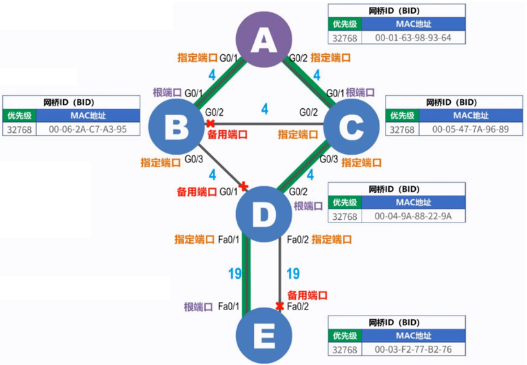

# L2-STP

STP（Spanning Tree Protocol）是生成树协议，可应用于计算机网络中树形拓扑结构建立，在提高网络可靠性的同时又**避免环路**带来的各种问题。


----

### 工作原理

生成树协议STP的核心是**生成树算法STA（Spanning Tree Algorithm）**。它的实现目标是：在包含有物理环路的网络中，构建出一个能够连通全网各节点的树型无环逻辑拓扑。

STP协议由IEEE 802.1D定义，描述时使用的是“网桥”，由于“交换机”的本质是“多端口网桥”，接下来都使用“网桥”来描述。

生成树算法的三个步骤：

1. 通过BPDU报文“选举”根交换机/根网桥 Root Bridge
2. 通过BPDU报文“选举”根端口 Root Port
3. 通过BPDU报文“选举”指定端口 DP
4. 阻塞非根、非指定端口 AP


**BPDU（Bridge Protocol Data Unit）网桥协议数据单元**，是通过网络中各交换机相互发送STP生成树协议专用的数据帧，是用于“选举”的交换信息的报文。STP生成树的计算，根网桥、根端口、指定端口的选举，都是借助BPDU（Bridge Protocol Data Unit）报文进行信息的传递和交换的。


#### 生成树算法过程

##### 1. 选举根交换机/根网桥

- 根交换机的选举条件：**网桥ID（BID）最小者当选**。

- 网桥ID（BID）由以下两部分构成（）：
  - 网桥优先级（2字节）：范围为0-61440，步长为4096，默认值为32768。
    - 高 4bit：范围是0-61440，这是由于只用到高4bit。
    - 低12bit：通常是固定值，如SystemID/VLANID，由供应商如何实现决定。这12位在STP或者RSTP中恒为0。
  - 交换机的基MAC地址（6字节）。

- 网桥ID（BID）的比较方法：
  - 优先级取值越小，则网桥ID（BID）就越小。
  - 若优先级相同，则比较MAC地址，从MAC地址的左侧开始依次比较，数值小的，则网桥ID（BID）就小。


##### 2. 选举根端口RP

- 在每一个**非根交换机**上选出一个**根端口RP（Root Port）**，并且只能是一个。

- 根端口RP用于接收根交换机发来的BPDU，也用来转发普通流量。

- 根端口RP的选举条件（按以下顺序）：

  1. BPDU接收端口到根交换机的路径成本（端口开销）最小。不同链路带宽对应的成本值如下：

    | 链路带宽 | 成本值 |
    | -------- | ------ |
    | 4Mb/s    | 250    |
    | 10Mb/s   | 100    |
    | 16Mb/s   | 62     |
    | 100Mb/s  | 19     |
    | 1Gb/s    | 4      |
    | 10Gb/s   | 2      |

    100G、400G这些高速端口并没有规定路径成本，有些供应商可以自定义路径开销，实际这类高速端口的接口、物理链路协商就不太一样，一般只有在相同速率上才能LINK_UP。

  2. 对端的网桥ID（BID）最小。

  3. 对端的端口ID（PID）最小。其中优先级范围（1-4bit）为0-240，步长为16，默认值为128；端口号为（5-16bit）。


##### 3. 在每条链路上选举指定端口DP

- 在**每条链路**上选出一个指定端口DP（Designated Port）并且只能是一个。

- 指定端口DP用于转发根交换机发来的BPDU，也用来转发普通流量。

- 指定端口DP的选举条件：

  1. BPDU转发端口到根交换机的路径成本最小。

  2. 本端的网桥ID（BID）最小。

  3. 本端的端口ID（PID）最小。

- 根交换机的所有端都是指定端口DP。

- 根端口的对端端口一定是指定端口DP。


##### 4. 阻塞非根、非指定端口（备用端口AP）

- 非根、非指定端口即为候补/备用端口AP（Alternate Port），阻塞AP，形成逻辑上无环路的树形拓扑结构。


##### 示例




#### 端口角色与状态


**STP没有明确区分端口状态与端口角色**，收敛时主要依赖于端口状态的切换。RSTP比较明确的区分了端口状态与端口角色，且其收敛时更多的是依赖于端口角色的切换。STP端口状态的切换必须被动的等待时间的超时。而RSTP端口状态的切换却是一种主动的协商。STP中的非根网桥只能被动的中继BPDU。而RSTP中的非根网桥对BPDU的中继具有一定的主动性。


**端口角色**:

- 根端口(Root Port, RP) : 每个网桥上到达根桥最近的端口。

- 指定端口(Desingnate Port, DP): 每条链路两端到达根桥最近的网络所拥有的端口。

- 候补端口(Alternate Port, AP)： 既不是RP也不是DP的端口。如果一个端口收到另外一个网桥的更好的 BPDU，但不是最好的，那么这个端口成为替换端口。在STP中，也叫Blocking。

- 备份端口(Backup Port, BP)：如果一个端口收到同一个网桥的更好 BPDU，那么这个端口成为备份端。当两个端口被一个点到点链路的一个环路连在一起时，或者当一个交换机有两个或多个到共享局域网段的连接时，一个备份端口才能存在。

- 边缘端口(Edge Port, EP)：不参与STP生成树。


| 生成树协议 | 根端口 | 指定端口 | Alternate端口 | Backup端口 | 边缘端口 | Master端口 | 域边缘端口 |
| ---------- | ------ | -------- | ------------- | ---------- | -------- | ---------- | ---------- |
| STP        | √      | √        | x(√,STP为禁用端口,认为是AP也可)             | x          | x        | x          | x          |
| RSTP       | √      | √        | √             | √          | √        | x          | x          |
| MSTP       | √      | √        | √             | √          | √        | √          | √          |


**端口状态**:

| 端口状态                 | 描述                                                         |
| ------------------------ | ------------------------------------------------------------ |
| Disabled（端口没有启用） | 此状态下端口不转发数据帧，不学习MAC地址表，不参与生成树计算  |
| Listening（侦听状态）    | 此状态下端口不转发数据帧，不学习MAC地址表，只参与生成树计算，接收并发送BPDU |
| Blocking（阻塞状态）     | 此状态下端口不转发数据帧，不学习MAC地址表，接收并处理BPDU，但是不向外发送BPDU |
| Learning（学习状态）     | 此状态下端口不转发数据帧，但是学习MAC地址表，参与计算生成树，接收并发送BPDU |
| Forwarding（转发状态）   | 此状态下端口正常转发数据帧，学习MAC地址表，参与计算生成树，接收并发送BPDU |


1. 当端口正常启用之后，端口首先进入Listening状态，开始生成树的计算过程。

  1. 通过BPDU报文“选举”根交换机/根网桥 Root Bridge
  2. 通过BPDU报文“选举”根端口 Root Port
  3. 通过BPDU报文“选举”指定端口 DP
  4. 阻塞非根、非指定端口 AP

2. 如果经过计算，端口角色需要设置为预备端口（Alternate Port），则端口状态立即进入Blocking。

3. 如果经过计算，端口角色需要设置为根端口（Root Port）或指定端口（Designated Port），则端口状态在等待Forward Delay之后从Listening状态进入Learning状态，然后继续等待Forward Delay之后，从Learning状态进入Forwarding状态，正常转发数据帧。


### 报文类型


**BPDU报文分类**：
- *Configuration BPDU*（Configuration BPDU）（以下简称CFG BPDU）：STP用来进行生成树计算和维护生成树拓扑的报文。
- *TCN BPDU*（Topology Change Notification BPDU）：网络拓扑发生变化时用来通知相关设备的报文。
- *RST BPDU*：RSTP用来进行生成树计算和维护生成树拓扑的报文。
- *MST BPDU*：MSTP用来进行生成树计算和维护生成树拓扑的报文。


BPDU报文中根据**Protocol Version Identifier**和**BPDU Type**字段取值判断BPDU报文类型（参照[报文格式](#报文格式)）：

| Protocol Version Identifier | BPDU Type | BPDU报文类型 |
| --------------------------- | --------- | ------------ |
| 0                           | 0x00      | CFG BPDU     |
| 2                           | 0x02      | RST BPDU     |
| 3                           | 0x02      | MST BPDU     |
| 0                           | 0x80      | TCN BPDU     |


### 报文格式

#### 详细格式

**1. BPDU报文格式**：

| Top Field | Field Type        | Data Field                                 | 字节 | 说明                                                         |
| --------- | ----------------- | ------------------------------------------ | ---- | ------------------------------------------------------------ |
| DMAC      |                   |                                            | 6    | 目的 MAC 地址。<br/>发送配置BPDU的数据帧使用保留的组MAC地址01-80-C2-00-00-00，此地址标识所有交换机，但是不能被交换机转发，也即只在本地链路有效。                                                |
| SMAC      |                   |                                            | 6    | 源 MAC 地址                                                  |
| Length    |                   |                                            | 2    | Data长度                                                     |
| Data      | LLC Header        | LLC                                        | 3    | 逻辑链路控制头部（目的服务访问点DSAP、源服务访问点SSAP、控制字段 ）。<br/>目的服务访问点（Destination Service Access Point, DSAP）和源服务访问点（Source Service Access Point, SSAP）的值都设为二进制`01000010`。<br/>Ctrl字段的值设为`3`。 |
| Data      | CFG/TCN-BPDU      | Protocol Identifier                        | 2    | 协议标识。                                                 |
| Data      | CFG/TCN-BPDU      | Protocol Version Identifier                | 1    | 协议版本标识，STP为0，RSTP为2，MSTP为3。                   |
| Data      | CFG/TCN-BPDU      | BPDU Type                                  | 1    | 当前BPDU类型：<br/>0x00：CFG BPDU。<br/>0x80：TCN BPDU。<br/>0x02：Protocol Version Identifier为2时代表RST BPDU，Protocol Version Identifier为3时代表MST BPDU。 |
| Data      | CFG-BPDU          | Flags                                      | 1    | 网络拓扑变化标志。对于MSTP，是指CIST标志字段。<br />最低位=TC（Topology Change，拓扑变化）标志。<br />最高位=TCA（Topology Change Acknowledgment，拓扑变化确认）标志。 |
| Data      | CFG-BPDU          | Root Identifier                            | 8    | 当前根桥的BID。对于MSTP，代表CIST的总根BID。                 |
| Data      | CFG-BPDU          | Root Path Cost                             | 4    | 根路径开销，本端口累计到根桥的开销。对于MSTP，是指CIST外部路径开销，从本设备所属的MST域到CIST根桥所属MST域的累计路径开销。CIST外部路径开销根据链路带宽计算。 |
| Data      | CFG-BPDU          | Bridge Identifier                          | 8    | 本设备的BID。对于MSTP，是指CIST的域根设备ID，即IST Master的ID。如果总根在这个域内，那么域根设备ID就是总根设备ID。 |
| Data      | CFG-BPDU          | Port Identifier                            | 2    | 发送该BPDU的端口ID。对于MSTP，是指本端口在IST中的指定端口ID。 |
| Data      | CFG-BPDU          | Message Age                                | 2    | BPDU报文的生存期。如果配置BPDU是根桥发出的，则Message Age为0。否则，Message Age是从根桥发送到当前桥接收到BPDU的总时间，包括传输延时等。实际实现中，配置BPDU报文经过一个桥，Message Age增加1。 |
| Data      | CFG-BPDU          | Max Age                                    | 2    | BPDU报文的最大生存期，超时则认为到根设备的链路故障。缺省为20秒。         |
| Data      | CFG-BPDU          | Hello Time                                 | 2    | Hello Time定时器，缺省为2秒，即发送两个相邻BPDU的时间间隔。  |
| Data      | CFG-BPDU          | Forward Delay                              | 2    | Forward Delay定时器，缺省为15秒。控制Listening和Learning状态的持续时间。 |
| Data      | RST/MST Extension | Version 1 Length                           | 1    | Version1 BPDU的长度，值固定为0。                             |
| Data      | MST Extension     | Version 3 Length                           | 2    | Version3 BPDU的长度。                                        |
| Data      | MST Extension     | MST Configuration Identifier               | 51   | MST配置标识，表示MST域的标签信息，包含4个字段。              |
| Data      | MST Extension     | CIST Internal Root Path Cost               | 4    | CIST内部路径开销指从本端口到IST Master设备的累计路径开销。CIST内部路径开销根据链路带宽计算。 |
| Data      | MST Extension     | CIST Bridge Identifier                     | 8    | CIST的指定设备ID。                                           |
| Data      | MST Extension     | CIST Remaining Hops                        | 1    | BPDU报文在CIST中的剩余跳数。                                 |
| Data      | MST Extension     | MSTI Configuration Messages(may be absent) | 16   | MSTI配置信息。每个MSTI的配置信息占16 bytes，如果有n个MSTI就占用n×16bytes。 |
| CRC       |                   |                                            | 4    | 循环冗余校验                                                 |


**2. Flags字段**：

| 位序（Bit） | 位标识     | 方向       | 含义说明                                                     |
| ----------- | ---------- | ---------- | ------------------------------------------------------------ |
| Bit7        | TCA        | Send End   | Topology Change Acknowledgment flag（拓扑变更确认标志）      |
| Bit6        | Agreement  | -          | 协商标志                                                     |
| Bit5        | Forwarding | -          | 端口转发状态标志                                             |
| Bit4        | Learning   | -          | 端口学习状态标志                                             |
| Bit3、Bit2  | Port role  | -          | 端口角色<br />`00`：Unknown（未知）<br/>`01`：Alternate/Backup port（替代/备份端口）<br/>`10`：Root port（根端口）<br/>`11`：Designated port（指定端口） |
| Bit1        | Proposal   | -          | 提议标志                                                     |
| Bit0        | TC         | Send First | Topology Change flag（拓扑变更标志）                         |

- 普通的CFG BPDU中Flag字段全部设置为0。


#### 字段使用

- **CFG BPDU**：使用中的前35个字节。其中Root Identifier、Root Path Cost、Bridge Identifier、Port Identifier字段是CFG BPDU报文的核心内容，这4个字段构成了消息优先级向量{ 根桥ID，根路径开销，发送设备BID，发送端口PID }。

  - Root Identifier：当前根桥的BID（Bridge ID）。BID是由桥优先级（Bridge Priority）与桥MAC地址构成。BID桥优先级占据高16位，其余的低48位是MAC地址。BID最小的设备会被选举为根桥。

  - Root Path Cost：根路径开销，简称RPC。路径开销（Path Cost）是一个端口变量，是生成树协议用于选择链路的参考值。生成树协议通过计算路径开销，选择较为“强壮”的链路，阻塞多余的链路，将网络修剪成无环路的树形网络结构。根路径开销就是某端口到根桥所经过的各个桥上的各端口路径开销的累加值。

  - Bridge Identifier：发送设备的BID。

  - Port Identifier：发送端口的PID（Port ID）。PID由两部分构成的，高4位是端口优先级，低12位是端口号。

- **RST BPDU**：和CFG BPDU基本一致，RST BPDU作了一些小变化。增加了Version 1 Length字段，并且Flags字段使用了中间的六位。Flags字段STP仅使用了最低位和最高位，中间六位保留。而RSTP使用了中间六位。

- **MST BPDU**：前36个字节和RST BPDU相同，从第37个字节开始是MSTP专有字段。最后的MSTI配置信息字段由若干MSTI配置信息组连缀而成。

- **TCN BPDU**：长度为4个字节，只使用了前3个字段，即只有Protocol Identifier（协议号）、Protocol Version Identifier（协议版本）和BPDU Type（BPDU类型）。


#### 报文说明与协商

##### CFG BPDU

- 配置BPDU使用标准LLC格式封装在以太网数据帧中。

    数据链路层常见协议类型可分为两类：

    | **类型**            | **常见协议/帧格式**              | **特点**                                                     |
    | :------------------ | :------------------------------- | :----------------------------------------------------------- |
    | **局域网（LAN）帧** | • IEEE 802.3（图中类型）         | 含LLC子层，支持多协议复用（如STP/IPX），需Length字段标识长度。 |
    |                     | • Ethernet II                    | 无LLC层，通过Type字段直接标识协议（如0x0800=IP），现代网络主流。 |
    | **广域网（WAN）帧** | • PPP（Point-to-Point Protocol） | 点对点传输，无MAC地址，支持认证/压缩/多协议封装（如PPPoE）。 |
    |                     | • HDLC                           | 同步串行链路标准，用于路由器间直连或专线。                   |
    |                     | • Frame Relay                    | 分组交换网，通过DLCI标识虚电路。                             |

- 配置BPDU只在指定端口DP（Designated Port）上发送。

- DMAC：目的MAC地址。发送配置BPDU的数据帧使用保留的组MAC地址01-80-C2-00-00-00，此地址标识所有交换机，但是不能被交换机转发，也即只在本地链路有效。

- LLC Header：

  - 目的服务访问点（Destination Service Access Point, DSAP）的值设为二进制01000010

  - 源服务访问点（Source Service Access Point, SSAP）的值设为二进制01000010

  - 控制字段Ctrl的值设为3

- 协商流程：

  1. 当STP初始计算选举根网桥/根交换机时，各个交换机主动生成并发送配置BPDU。

     - *初始化*：网络中所有运行 STP 协议的桥设备在使能 STP 协议后，**每一个桥设备都认为自己是根网桥**。此时每台设备仅仅收发配置 BPDU，而不转发用户流量，所有的端口都处于 Listening 状态。

     - *BPDU 报文交互与比较*：每个桥设备都会向外发送包含自己桥 ID 等信息的配置 BPDU 报文，同时也会接收其他桥设备发送的 BPDU 报文。桥端口会对收到的配置 BPDU 与本地的进行优先级比较。当端口收到的配置 BPDU 比本端口的配置 BPDU 的**优先级低**时，将丢弃所收到的这个配置 BPDU，仍保留自己原来的配置 BPDU，否则桥**将收到的配置 BPDU 作为该端口的配置 BPDU**。然后，桥**再将自己所有端口的配置 BPDU 进行比较，选出最优的 BPDU 作为本桥的配置 BPDU**。

     - *根网桥确定*：配置 BPDU 会**按照 Hello Timer 规定的时间间隔（默认 2 秒）来发送**。各桥设备**不断交互 BPDU 报文**，比较网桥 ID。网桥 ID 由 2 个字节的桥优先级和 6 个字节的桥背板 MAC 组成，取值范围是 0-65535，缺省值是 32768。在比较时，先比较桥优先级，优先级值小的为根桥；当桥优先级值相等时，再比较桥的背板 MAC 地址，MAC 地址小的为根桥。直到所有交换设备的**所有端口**都认为**根桥是相同的**，根网桥选举完成。

  2. 选举结束后，只有根交换机才能主动生成并发送配置BPDU。

  3. 非根交换机只有在自己的根端口收到配置BPDU报文才能根据收到的报文生成配置BPDU从指定端口发送。


##### TCN BPDU

如果网络拓扑发生了变化，会**触发 STP 的重新计算**，新的生成树拓扑可能会跟原先的网络拓扑存在一定的差异。

在交换机上，**指导报文转发的是 MAC 地址表**，默认的动态表项的生存时间是 300s，此时，数据转发如果仍然按照原有的 MAC 地址表，会导致数据转发错误。

为防止拓扑变更情况下的数据发送错误，STP 中定义了**拓扑变更机制**。

当网络拓扑发生变化的时候，除了在整网泛洪拓扑改变的消息外，还修改 MAC 地址表的生存期为一个较短的数值，等拓扑结构稳定之后，再恢复 MAC 地址表的生存期。


1. 在向整网泛洪拓扑改变消息的过程中，共涉及三种BPDU：

   - **TCN BPDU**：TCN（Topology Change Notification） 。用于**非根交换机**通过RP向上行交换机发送TCN BPDU以通告拓扑发生改变，并且每隔Hello Time（2秒）发送一次，直到收到上行交换机的**确认报文TCA BPDU** 或 **拓扑变更配置报文TCC BPDU**。

   - **TCA BPDU**：TCA（Topology Change Acknowledgment），与TCN BPDU不一样，它是CFG BPDU的一种，意味着比TCN BPDU报文多更多的字段 。和普通配置BPDU不同的是此TCA BPDU设置了一个TCA Flag位。用于**非根网桥**在接收到TCN BPDU报文后，从DP向下行交换机发送确认报文TCA BPDU，**使其不再继续发送TCN BPDU**。
     - 上游设备收到下游设备发来的TCN BPDU报文后，只有指定端口处理TCN BPDU报文。其它端口也有可能收到TCN BPDU报文，但不会处理。

   - **TC BPDU**：TC（Topology Change） ，与TCA BPDU一样是CFG BPDU的一种。和普通配置BPDU不同的是此TC BPDU设置了一个TC Flag位。用于从根交换机向整网泛洪拓扑变更配置报文TC BPDU，每隔2秒向网络中发送一次，**所有交换机都在自己所有的指定端口上泛洪此BPDU**。

     - 使网络中所有的交换机都把 MAC地址表 的生存期修改为Forward Delay（15秒）。

     - 当非根网桥收到 TC（Topology Change）BPDU 时（由根桥发出），会触发以下关键操作，旨在加速网络收敛并更新转发表：

       1. **刷新本地 MAC 地址表**
          - **立即清除**除接收端口外的所有**非边缘端口EP**（DP指定端口/RP根端口）学习到的 MAC 地址。
          - **保留边缘端口EP**（如连接终端的 Access 端口）的 MAC 表项（避免终端重复 ARP）。
          - **目的**：强制设备重新学习拓扑变化后的路径，避免流量黑洞。
       2. **转发 TC BPDU**
          - 通过所有**指定端口（Designated Ports）** 向下游泛洪 TC BPDU。
          - **例外**：不通过收到 TC BPDU 的端口回传（防止环路）。
       3. **缩短 MAC 表老化时间**
          - 将 MAC 地址表的老化时间（Aging Time）从默认的 **300 秒** 临时缩短为 **Forward Delay 值**（通常为 15 秒）。
          - **持续时间**：维持 `Forward Delay + Max Age`（约 35 秒）后恢复默认老化时间。

     - 经过一段时间（Max Age + Forward Delay，默认为35秒）之后，根交换机在自己发送的TC BPDU中，清除TC Flag位，即发送普通CFG BPDU，表示网络拓扑已经稳定，网络中的交换机恢复MAC地址表生存期。

2. **​TCN BPDU 协议本身 ​不改变​​端口角色（根端口/指定端口等）和状态（阻塞/转发等）**（物理链路故障将立即置端口状态为 Disabled，绕过所有协议状态机，非协议导致状态变更，而是物理中断）。

3. **TCN BPDU 协议本身 ​不重新选举根桥​​，也不重新计算无环路径**。

4. RP断联/插入新网桥：

  - 发送以自己为根的配置BPDU。

  - 其他交换机更新根桥认知：其他交换机收到新交换机发送的 BPDU 后，会将其与自己当前保存的根桥信息进行比较。
    - 若新交换机次优，回复最优的CFG BPDU。
    - 若新交换机最优，转发该新交换机的CFG BPDU，以选举其为新根网桥。同时重新选举RP/DP等。

3. 根桥失效：

  - 当Root Bridge出现故障（例如关闭了stp协议），相邻下行交换机对应的根端口都不能收到来自根桥的BPDU报文，他们在等待最长max age时间后，才能发现根桥失效，进而进行新的根桥选举、根端口和指定端口的确定。

4. 非RP所在链路故障或失效
   
  - 端口物理状态 Down → 重新计算该端口所在链路的替代路径。直连链路断开可能导致其他阻塞端口（非失效链路所在端口）转变为转发状态。（状态变更是物理状态导致而非协议）


----


### RSTP（IEEE 802.1w）：核心是收敛提速

#### **1. 改进目标**

- **收敛时间从30~50秒缩短至1~2秒**，适应现代网络需求。
- 兼容STP设备，无缝升级。

#### **2. 核心机制**

| **改进点**       | **STP 缺陷**                                               | **RSTP 解决方案**                                            |
| ---------------- | ---------------------------------------------------------- | ------------------------------------------------------------ |
| **端口角色细化** | 仅3种角色（RP/DP/Blocking）                                | 新增 **Alternate Port（备份根端口）** 和 **Backup Port（备份指定端口）** |
| **状态机简化**   | 5种状态（Disabled/Blocking/Listening/Learning/Forwarding） | 合并为 **3种状态**： - **Discarding**（阻塞+监听） - **Learning**（学习） - **Forwarding**（转发） |
| **拓扑变更机制** | 依赖根桥通知（TCN+TCA）                                    | **非根桥可直发TC BPDU**，快速泛洪                            |
| **P/A机制**      | 无快速协商机制                                             | **Proposal/Agreement握手机制**： - 指定端口通过P/A协商直接进入转发状态，跳过延迟计时器 |

#### **3. P/A机制工作流程**

```
sequenceDiagram
  participant DP as 新链路发起方（指定端口）
  participant RP as 对端端口（根端口）
  DP->>RP: 发送Proposal BPDU（Flags.P=1）
  RP->>RP: 阻塞所有非边缘端口
  RP->>DP: 回复Agreement BPDU（Flags.A=1）
  DP->>DP: 立即进入Forwarding状态
```

P/A机制即Proposal/Agreement机制。其目的是使一个指定端口DP尽快进入Forwarding状态。其过程的完成根据以下几个端口变量：

- A）Proposing。当一个指定端口处于Discarding或Learning状态的时候，置位该变量（交换机端口本地维护的状态变量），并向下游交换传递Proposal位被置位的BPDU。

- B）Proposed。当下游交设备端口收到对端的指定端口发来的携带Proposal的BPDU的时候，置位该变量（交换机端口本地维护的状态变量），指示上游网段的指定端口希望进入Forwarding状态。

- C）sync。当Proposed被设置以后，收到Proposal置位信息的根端口会依次为自己的其他端口置位sync变量（交换机端口本地维护的状态变量）。如果端口是非边缘的指定端口则会进入Discarding状态。

- D）synced。当其它端口完成转到Discarding后，会设置自己的synced变量（Alternate、Backup和边缘端口会马上设置该变量）。根端口监视其他端口的synced，当所有其他端口的synced全被设置，根端口会设置自己的synced，然后传回BPDU，其中Agreement位被置位。

- E）agreed。当指定端口接收到一个BPDU时，如果该BPDU中的Agreement位被置位且端口角色定义是“根端口”，该变量被设置。Agreed变量一旦被置位，指定端口马上转入Forwarding状态。

> **价值**：跨网段新增链路时，收敛时间从STP的50秒降至1秒。


------

### MSTP（IEEE 802.1s）：核心是多实例负载均衡

#### **1. 改进目标**

- 解决 **VLAN与生成树1:1映射的资源浪费问题**（如PVST+需维护多个树）。
- 实现 **基于VLAN组的流量负载均衡**（不同VLAN走不同路径）。

#### **2. 核心机制**

| **概念**              | **说明**                                                     |
| --------------------- | ------------------------------------------------------------ |
| **MST区域（Region）** | 一组交换机共享相同配置： - **区域名** - **修订级别** - **VLAN-实例映射表** |
| **MST实例（MSTI）**   | 每个实例运行独立生成树（RSTP算法），**实例0（MSTI0）为默认实例** |
| **VLAN映射**          | 将多个VLAN映射到同一个MST实例（如VLAN10-20→MSTI1，VLAN30-40→MSTI2） |
| **IST（内部生成树）** | 实例0承载区域内的控制流量（如BPDU）                          |

#### **3. 负载均衡案例**

```
graph TB
  SW1 -- MSTI1: VLAN10-20 --> SW2
  SW1 -- MSTI2: VLAN30-40 --> SW3
```

- **路径选择**：
  - VLAN10-20流量走 `SW1→SW2`路径（MSTI1的指定路径）。
  - VLAN30-40流量走 `SW1→SW3`路径（MSTI2的指定路径）。

> **价值**：最大化利用冗余链路，避免STP中部分路径闲置。


------

### 协议部署场景对比

| **协议** | **适用场景**                 | **瓶颈**             | **部署建议**                |
| -------- | ---------------------------- | -------------------- | --------------------------- |
| STP      | 传统小规模网络（＜20节点）   | 收敛慢、资源利用率低 | **已淘汰**                  |
| RSTP     | 中小规模网络（＜100节点）    | VLAN间路径无法差异化 | 无多路径需求时优选          |
| **MSTP** | 中大规模网络（含多VLAN环境） | 配置复杂度高         | **企业园区网/数据中心标配** |


----

> - [Reference Doc 1](https://blog.csdn.net/HinsCoder/article/details/130454920)
> - [Reference Doc 2](https://blog.csdn.net/qq_47200222/article/details/123564804)
> - [Reference Doc 3](https://support.huawei.com/enterprise/zh/doc/EDOC1100278264/863258f)
