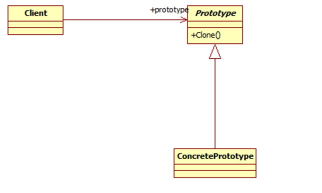
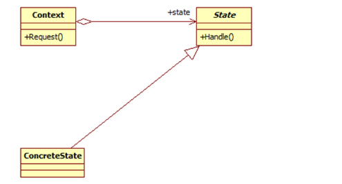
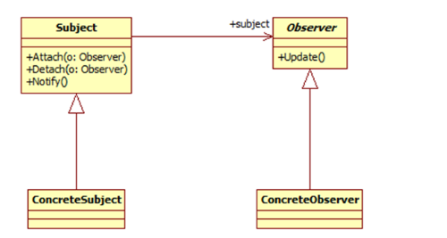
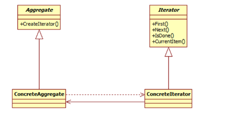
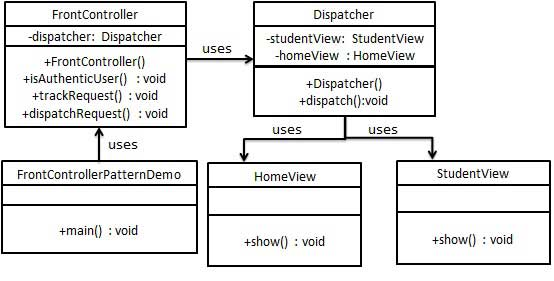

# 设计模式简介

设计模式（Design pattern）代表了最佳的实践，通常被有经验的面向对象的软件开发人员所采用。设计模式是软件开发人员在软件开发过程中面临的一般问题的解决方案。这些解决方案是众多软件开发人员经过相当长的一段时间的试验和错误总结出来的。

## 设计模式的类型——三大类型
- 创建型模式（Creational Patterns）
- 结构型模式（Structural Patterns）
- 行为型模式（Behavioral Patterns）

## 23种设计模式
**创建型模式**
这些设计模式提供了一种在创建对象的同时隐藏创建逻辑的方式，而不是使用 new 运算符直接实例化对象。这使得程序在判断针对某个给定实例需要创建哪些对象时更加灵活。

- 工厂模式（Factory Pattern）
- 抽象工厂模式（Abstract Factory Pattern）
- 单例模式（Singleton Pattern）
- 建造者模式（Builder Pattern）
- 原型模式（Prototype Pattern）

**结构型模式**
这些设计模式关注类和对象的组合。继承的概念被用来组合接口和定义组合对象获得新功能的方式。

-   适配器模式（Adapter Pattern）
-   桥接模式（Bridge Pattern）
-   过滤器模式（Filter、Criteria Pattern）
-   组合模式（Composite Pattern）
-   装饰器模式（Decorator Pattern）
-   外观模式（Facade Pattern）
-   享元模式（Flyweight Pattern）
-   代理模式（Proxy Pattern）

**行为型模式** 
这些设计模式特别关注对象之间的通信。

-   责任链模式（Chain of Responsibility Pattern）
-   命令模式（Command Pattern）
-   解释器模式（Interpreter Pattern）
-   迭代器模式（Iterator Pattern）
-   中介者模式（Mediator Pattern）
-   备忘录模式（Memento Pattern）
-   观察者模式（Observer Pattern）
-   状态模式（State Pattern）
-   空对象模式（Null Object Pattern）
-   策略模式（Strategy Pattern）
-   模板模式（Template Pattern）
-   访问者模式（Visitor Pattern）

### 1.单例模式

单例模式，它的定义就是确保某一个类只有一个实例，并且提供一个全局访问点。

单例模式具备典型的3个特点：1、只有一个实例。 2、自我实例化。 3、提供全局访问点。

因此当系统中只需要一个实例对象或者系统中只允许一个公共访问点，除了这个公共访问点外，不能通过其他访问点访问该实例时，可以使用单例模式。

单例模式的主要优点就是节约系统资源、提高了系统效率，同时也能够严格控制客户对它的访问。也许就是因为系统中只有一个实例，这样就导致了单例类的职责过重，违背了“单一职责原则”，同时也没有抽象类，所以扩展起来有一定的困难。其UML结构图非常简单，就只有一个类，如下图：

### 2.工厂方法模式

作为抽象工厂模式的孪生兄弟，工厂方法模式定义了一个创建对象的接口，但由子类决定要实例化的类是哪一个，也就是说工厂方法模式让实例化推迟到子类。

工厂方法模式非常符合“开闭原则”，当需要增加一个新的产品时，我们只需要增加一个具体的产品类和与之对应的具体工厂即可，无须修改原有系统。同时在工厂方法模式中用户只需要知道生产产品的具体工厂即可，无须关系产品的创建过程，甚至连具体的产品类名称都不需要知道。虽然他很好的符合了“开闭原则”，但是由于每新增一个新产品时就需要增加两个类，这样势必会导致系统的复杂度增加。其UML结构图：

### 3.抽象工厂模式

所谓抽象工厂模式就是提供一个接口，用于创建相关或者依赖对象的家族，而不需要明确指定具体类。他允许客户端使用抽象的接口来创建一组相关的产品，而不需要关系实际产出的具体产品是什么。这样一来，客户就可以从具体的产品中被解耦。它的优点是隔离了具体类的生成，使得客户端不需要知道什么被创建了，而缺点就在于新增新的行为会比较麻烦，因为当添加一个新的产品对象时，需要更加需要更改接口及其下所有子类。其UML结构图如下：

### 4.建造者模式

对于建造者模式而已，它主要是将一个复杂对象的构建与表示分离，使得同样的构建过程可以创建不同的表示。适用于那些产品对象的内部结构比较复杂。

建造者模式将复杂产品的构建过程封装分解在不同的方法中，使得创建过程非常清晰，能够让我们更加精确的控制复杂产品对象的创建过程，同时它隔离了复杂产品对象的创建和使用，使得相同的创建过程能够创建不同的产品。但是如果某个产品的内部结构过于复杂，将会导致整个系统变得非常庞大，不利于控制，同时若几个产品之间存在较大的差异，则不适用建造者模式，毕竟这个世界上存在相同点大的两个产品并不是很多，所以它的使用范围有限。其UML结构图：

### 5.原型模式

在我们应用程序可能有某些对象的结构比较复杂，但是我们又需要频繁的使用它们，如果这个时候我们来不断的新建这个对象势必会大大损耗系统内存的，这个时候我们需要使用原型模式来对这个结构复杂又要频繁使用的对象进行克隆。所以原型模式就是用原型实例指定创建对象的种类，并且通过复制这些原型创建新的对象。

它主要应用与那些创建新对象的成本过大时。它的主要优点就是简化了新对象的创建过程，提高了效率，同时原型模式提供了简化的创建结构。UML结构图：

**模式结构**
原型模式包含如下角色：
Prototype：抽象原型类
ConcretePrototype：具体原型类
Client：客户类

### 6.适配器模式

在我们的应用程序中我们可能需要将两个不同接口的类来进行通信，在不修改这两个的前提下我们可能会需要某个中间件来完成这个衔接的过程。这个中间件就是适配器。所谓适配器模式就是将一个类的接口，转换成客户期望的另一个接口。它可以让原本两个不兼容的接口能够无缝完成对接。

作为中间件的适配器将目标类和适配者解耦，增加了类的透明性和可复用性。

适配器模式包含如下角色：
Target：目标抽象类
Adapter：适配器类
Adaptee：适配者类
Client：客户类

### 7.桥接模式

如果说某个系统能够从多个角度来进行分类，且每一种分类都可能会变化，那么我们需要做的就是讲这多个角度分离出来，使得他们能独立变化，减少他们之间的耦合，这个分离过程就使用了桥接模式。所谓桥接模式就是讲抽象部分和实现部分隔离开来，使得他们能够独立变化。

桥接模式将继承关系转化成关联关系，封装了变化，完成了解耦，减少了系统中类的数量，也减少了代码量。

桥接模式包含如下角色：
Abstraction：抽象类
RefinedAbstraction：扩充抽象类
Implementor：实现类接口
ConcreteImplementor：具体实现类

### 8.组合模式

组合模式组合多个对象形成树形结构以表示“整体-部分”的结构层次。它定义了如何将容器对象和叶子对象进行递归组合，使得客户在使用的过程中无须进行区分，可以对他们进行一致的处理。在使用组合模式中需要注意一点也是组合模式最关键的地方：叶子对象和组合对象实现相同的接口。这就是组合模式能够将叶子节点和对象节点进行一致处理的原因。

虽然组合模式能够清晰地定义分层次的复杂对象，也使得增加新构件也更容易，但是这样就导致了系统的设计变得更加抽象，如果系统的业务规则比较复杂的话，使用组合模式就有一定的挑战了。

**模式结构**
组合模式包含如下角色：
Component: 抽象构件
Leaf: 叶子构件
Composite: 容器构件
Client: 客户类

### 9.装饰模式

我们可以通过继承和组合的方式来给一个对象添加行为，虽然使用继承能够很好拥有父类的行为，但是它存在几个缺陷：一、对象之间的关系复杂的话，系统变得复杂不利于维护。二、容易产生“类爆炸”现象。三、是静态的。在这里我们可以通过使用装饰者模式来解决这个问题。

装饰者模式，动态地将责任附加到对象上。若要扩展功能，装饰者提供了比继承更加有弹性的替代方案。虽然装饰者模式能够动态将责任附加到对象上，但是他会产生许多的细小对象，增加了系统的复杂度。

**模式结构**
装饰模式包含如下角色：
Component: 抽象构件
ConcreteComponent: 具体构件
Decorator: 抽象装饰类
ConcreteDecorator: 具体装饰类

### 10.外观模式

我们都知道类与类之间的耦合越低，那么可复用性就越好，如果两个类不必彼此通信，那么就不要让这两个类发生直接的相互关系，如果需要调用里面的方法，可以通过第三者来转发调用。外观模式非常好的诠释了这段话。外观模式提供了一个统一的接口，用来访问子系统中的一群接口。它让一个应用程序中子系统间的相互依赖关系减少到了最少，它给子系统提供了一个简单、单一的屏障，客户通过这个屏障来与子系统进行通信。通过使用外观模式，使得客户对子系统的引用变得简单了，实现了客户与子系统之间的松耦合。但是它违背了“开闭原则”，因为增加新的子系统可能需要修改外观类或客户端的源代码。

外观模式包含如下角色：
Facade: 外观角色
SubSystem:子系统角色

### 11.亨元模式

在一个系统中对象会使得内存占用过多，特别是那些大量重复的对象，这就是对系统资源的极大浪费。享元模式对对象的重用提供了一种解决方案，它使用共享技术对相同或者相似对象实现重用。享元模式就是运行共享技术有效地支持大量细粒度对象的复用。系统使用少量对象,而且这些都比较相似，状态变化小，可以实现对象的多次复用。这里有一点要注意：享元模式要求能够共享的对象必须是细粒度对象。享元模式通过共享技术使得系统中的对象个数大大减少了，同时享元模式使用了内部状态和外部状态，同时外部状态相对独立，不会影响到内部状态，所以享元模式能够使得享元对象在不同的环境下被共享。同时正是分为了内部状态和外部状态，享元模式会使得系统变得更加复杂，同时也会导致读取外部状态所消耗的时间过长。

享元模式包含如下角色：
Flyweight: 抽象享元类
ConcreteFlyweight: 具体享元类
UnsharedConcreteFlyweight: 非共享具体享元类
FlyweightFactory: 享元工厂类

### 12.代理模式

代理模式就是给一个对象提供一个代理，并由代理对象控制对原对象的引用。它使得客户不能直接与真正的目标对象通信。代理对象是目标对象的代表，其他需要与这个目标对象打交道的操作都是和这个代理对象在交涉。

代理对象可以在客户端和目标对象之间起到中介的作用，这样起到了的作用和保护了目标对象的，同时也在一定程度上面减少了系统的耦合度。

代理模式包含如下角色：
 Subject: 抽象主题角色
 Proxy: 代理主题角色
 RealSubject: 真实主题角色

### 13.访问者模式

访问者模式俗称23大设计模式中最难的一个。除了结构复杂外，理解也比较难。在我们软件开发中我们可能会对同一个对象有不同的处理，如果我们都做分别的处理，将会产生灾难性的错误。对于这种问题，访问者模式提供了比较好的解决方案。访问者模式即表示一个作用于某对象结构中的各元素的操作，它使我们可以在不改变各元素的类的前提下定义作用于这些元素的新操作。

访问者模式的目的是封装一些施加于某种数据结构元素之上的操作，一旦这些操作需要修改的话，接受这个操作的数据结构可以保持不变。为不同类型的元素提供多种访问操作方式，且可以在不修改原有系统的情况下增加新的操作方式。同时我们还需要明确一点那就是访问者模式是适用于那些数据结构比较稳定的，因为他是将数据的操作与数据结构进行分离了，如果某个系统的数据结构相对稳定，但是操作算法易于变化的话，就比较适用适用访问者模式，因为访问者模式使得算法操作的增加变得比较简单了。

访问者模式包含如下角色：
Vistor: 抽象访问者
ConcreteVisitor: 具体访问者
Element: 抽象元素
ConcreteElement: 具体元素
ObjectStructure: 对象结构

### 14.模板模式

有些时候我们做某几件事情的步骤都差不多，仅有那么一小点的不同，在软件开发的世界里同样如此，如果我们都将这些步骤都一一做的话，费时费力不讨好。所以我们可以将这些步骤分解、封装起来，然后利用继承的方式来继承即可，当然不同的可以自己重写实现嘛！这就是模板方法模式提供的解决方案。

所谓模板方法模式就是在一个方法中定义一个算法的骨架，而将一些步骤延迟到子类中。模板方法使得子类可以在不改变算法结构的情况下，重新定义算法中的某些步骤。

模板方法模式就是基于继承的代码复用技术的。在模板方法模式中，我们可以将相同部分的代码放在父类中，而将不同的代码放入不同的子类中。也就是说我们需要声明一个抽象的父类，将部分逻辑以具体方法以及具体构造函数的形式实现，然后声明一些抽象方法让子类来实现剩余的逻辑，不同的子类可以以不同的方式来实现这些逻辑。所以模板方法的模板其实就是一个普通的方法，只不过这个方法是将算法实现的步骤封装起来的。

模板方法模式包含如下角色：
AbstractClass: 抽象类
ConcreteClass: 具体子类

### 15.策略模式

我们知道一件事可能会有很多种方式来实现它，但是其中总有一种最高效的方式，在软件开发的世界里面同样如此，我们也有很多中方法来实现一个功能，但是我们需要一种简单、高效的方式来实现它，使得系统能够非常灵活，这就是策略模式。

所以策略模式就是定义了算法族，分别封装起来，让他们之前可以互相转换，此模式然该算法的变化独立于使用算法的客户。

在策略模式中它将这些解决问题的方法定义成一个算法群，每一个方法都对应着一个具体的算法，这里的一个算法我就称之为一个策略。虽然策略模式定义了算法，但是它并不提供算法的选择，即什么算法对于什么问题最合适这是策略模式所不关心的，所以对于策略的选择还是要客户端来做。客户必须要清楚的知道每个算法之间的区别和在什么时候什么地方使用什么策略是最合适的，这样就增加客户端的负担。

同时策略模式也非常完美的符合了“开闭原则”，用户可以在不修改原有系统的基础上选择算法或行为，也可以灵活地增加新的算法或行为。但是一个策略对应一个类将会是系统产生很多的策略类。

策略模式包含如下角色：
Context: 环境类
Strategy: 抽象策略类
ConcreteStrategy: 具体策略类

### 16.状态模式

在很多情况下我们对象的行为依赖于它的一个或者多个变化的属性，这些可变的属性我们称之为状态，也就是说行为依赖状态，即当该对象因为在外部的互动而导致他的状态发生变化，从而它的行为也会做出相应的变化。对于这种情况，我们是不能用行为来控制状态的变化，而应该站在状态的角度来思考行为，即是什么状态就要做出什么样的行为。这个就是状态模式。

所以状态模式就是允许对象在内部状态发生改变时改变它的行为，对象看起来好像修改了它的类。

在状态模式中我们可以减少大块的if…else语句，它是允许态转换逻辑与状态对象合成一体，但是减少if…else语句的代价就是会换来大量的类，所以状态模式势必会增加系统中类或者对象的个数。

同时状态模式是将所有与某个状态有关的行为放到一个类中，并且可以方便地增加新的状态，只需要改变对象状态即可改变对象的行为。但是这样就会导致系统的结构和实现都会比较复杂，如果使用不当就会导致程序的结构和代码混乱，不利于维护。

状态模式包含如下角色：
Context: 环境类
State: 抽象状态类
ConcreteState: 具体状态类

### 17.观察者模式

何谓观察者模式？观察者模式定义了对象之间的一对多依赖关系，这样一来，当一个对象改变状态时，它的所有依赖者都会收到通知并且自动更新。

在这里，发生改变的对象称之为观察目标，而被通知的对象称之为观察者。一个观察目标可以对应多个观察者，而且这些观察者之间没有相互联系，所以么可以根据需要增加和删除观察者，使得系统更易于扩展。所以观察者提供了一种对象设计，让主题和观察者之间以松耦合的方式结合。

观察者模式包含如下角色：
Subject: 目标
ConcreteSubject: 具体目标
Observer: 观察者
ConcreteObserver: 具体观察者

### 18.备忘录模式

后悔药人人都想要，但是事实却是残酷的，根本就没有后悔药可买，但是也不仅如此，在软件的世界里就有后悔药！备忘录模式就是一种后悔药，它给我们的软件提供后悔药的机制，通过它可以使系统恢复到某一特定的历史状态。

所谓备忘录模式就是在不破坏封装的前提下，捕获一个对象的内部状态，并在该对象之外保存这个状态，这样可以在以后将对象恢复到原先保存的状态。它实现了对信息的封装，使得客户不需要关心状态保存的细节。保存就要消耗资源，所以备忘录模式的缺点就在于消耗资源。如果类的成员变量过多，势必会占用比较大的资源，而且每一次保存都会消耗一定的内存。

备忘录模式包含如下角色：
Originator: 原发器
Memento: 备忘录
Caretaker: 负责人

### 19.中介者模式

租房各位都有过的经历吧！在这个过程中中介结构扮演着很重要的角色，它在这里起到一个中间者的作用，给我们和房主互相传递信息。在外面软件的世界里同样需要这样一个中间者。在我们的系统中有时候会存在着对象与对象之间存在着很强、复杂的关联关系，如果让他们之间有直接的联系的话，必定会导致整个系统变得非常复杂，而且可扩展性很差！在前面我们就知道如果两个类之间没有不必彼此通信，我们就不应该让他们有直接的关联关系，如果实在是需要通信的话，我们可以通过第三者来转发他们的请求。同样，这里我们利用中介者来解决这个问题。

所谓中介者模式就是用一个中介对象来封装一系列的对象交互，中介者使各对象不需要显式地相互引用，从而使其耦合松散，而且可以独立地改变它们之间的交互。在中介者模式中，中介对象用来封装对象之间的关系，各个对象可以不需要知道具体的信息通过中介者对象就可以实现相互通信。它减少了对象之间的互相关系，提供了系统可复用性，简化了系统的结构。

在中介者模式中，各个对象不需要互相知道了解，他们只需要知道中介者对象即可，但是中介者对象就必须要知道所有的对象和他们之间的关联关系，正是因为这样就导致了中介者对象的结构过于复杂，承担了过多的职责，同时它也是整个系统的核心所在，它有问题将会导致整个系统的问题。所以如果在系统的设计过程中如果出现“多对多”的复杂关系群时，千万别急着使用中介者模式，而是要仔细思考是不是您设计的系统存在问题。

Mediator: 抽象中介者
ConcreteMediator: 具体中介者
Colleague: 抽象同事类
ConcreteColleague: 具体同事类

### 20.迭代器模式

对于迭代在编程过程中我们经常用到，能够游走于聚合内的每一个元素，同时还可以提供多种不同的遍历方式，这就是迭代器模式的设计动机。在我们实际的开发过程中，我们可能会需要根据不同的需求以不同的方式来遍历整个对象，但是我们又不希望在聚合对象的抽象接口中充斥着各种不同的遍历操作，于是我们就希望有某个东西能够以多种不同的方式来遍历一个聚合对象，这时迭代器模式出现了。

何为迭代器模式？所谓迭代器模式就是提供一种方法顺序访问一个聚合对象中的各个元素，而不是暴露其内部的表示。迭代器模式是将迭代元素的责任交给迭代器，而不是聚合对象，我们甚至在不需要知道该聚合对象的内部结构就可以实现该聚合对象的迭代。

通过迭代器模式，使得聚合对象的结构更加简单，它不需要关注它元素的遍历，只需要专注它应该专注的事情，这样就更加符合单一职责原则了。

迭代器模式包含如下角色：
Iterator: 抽象迭代器
ConcreteIterator: 具体迭代器
Aggregate: 抽象聚合类
ConcreteAggregate: 具体聚合类

### 21.解释器模式

所谓解释器模式就是定义语言的文法，并且建立一个解释器来解释该语言中的句子。解释器模式描述了如何构成一个简单的语言解释器，主要应用在使用面向对象语言开发的编译器中。它描述了如何为简单的语言定义一个文法，如何在该语言中表示一个句子，以及如何解释这些句子。

解释器模式包含如下角色：
AbstractExpression: 抽象表达式
TerminalExpression: 终结符表达式
NonterminalExpression: 非终结符表达式
Context: 环境类
Client: 客户类

### 22.命令模式

有些时候我们想某个对象发送一个请求，但是我们并不知道该请求的具体接收者是谁，具体的处理过程是如何的，们只知道在程序运行中指定具体的请求接收者即可，对于这样将请求封装成对象的我们称之为命令模式。所以命令模式将请求封装成对象，以便使用不同的请求、队列或者日志来参数化其他对象。同时命令模式支持可撤销的操作。

命令模式可以将请求的发送者和接收者之间实现完全的解耦，发送者和接收者之间没有直接的联系，发送者只需要知道如何发送请求命令即可，其余的可以一概不管，甚至命令是否成功都无需关心。同时我们可以非常方便的增加新的命令，但是可能就是因为方便和对请求的封装就会导致系统中会存在过多的具体命令类。

命令模式包含如下角色：
Command: 抽象命令类
ConcreteCommand: 具体命令类
Invoker: 调用者
Receiver: 接收者
Client:客户类

### 23.责任链模式

职责链模式描述的请求如何沿着对象所组成的链来传递的。它将对象组成一条链，发送者将请求发给链的第一个接收者，并且沿着这条链传递，直到有一个对象来处理它或者直到最后也没有对象处理而留在链末尾端。

避免请求发送者与接收者耦合在一起，让多个对象都有可能接收请求，将这些对象连接成一条链，并且沿着这条链传递请求，直到有对象处理它为止，这就是职责链模式。在职责链模式中，使得每一个对象都有可能来处理请求，从而实现了请求的发送者和接收者之间的解耦。同时职责链模式简化了对象的结构，它使得每个对象都只需要引用它的后继者即可，而不必了解整条链，这样既提高了系统的灵活性也使得增加新的请求处理类也比较方便。但是在职责链中我们不能保证所有的请求都能够被处理，而且不利于观察运行时特征。

## 设计模式之间的关系

## 设计模式的六大原则

|             原则             |              英语               | 说明                                                         |
| :--------------------------: | :-----------------------------: | ------------------------------------------------------------ |
|           开闭原则           |      Open Close Principle       | 开闭原则的意思是：**对扩展开放，对修改关闭**。在程序需要进行拓展的时候，不能去修改原有的代码，实现一个热插拔的效果。简言之，是为了使程序的扩展性好，易于维护和升级。想要达到这样的效果，我们需要使用接口和抽象类，后面的具体设计中我们会提到这点。 |
|         里氏代换原则         |  Liskov Substitution Principle  | 里氏代换原则是面向对象设计的基本原则之一。 里氏代换原则中说，任何基类可以出现的地方，子类一定可以出现。LSP 是继承复用的基石，只有当派生类可以替换掉基类，且软件单位的功能不受到影响时，基类才能真正被复用，而派生类也能够在基类的基础上增加新的行为。里氏代换原则是对开闭原则的补充。实现开闭原则的关键步骤就是抽象化，而基类与子类的继承关系就是抽象化的具体实现，所以里氏代换原则是对实现抽象化的具体步骤的规范。 |
|         依赖倒转原则         | Dependence Inversion Principle  | 这个原则是开闭原则的基础，具体内容：针对接口编程，依赖于抽象而不依赖于具体。 |
|         接口隔离原则         | Interface Segregation Principle | 这个原则的意思是：使用多个隔离的接口，比使用单个接口要好。它还有另外一个意思是：降低类之间的耦合度。由此可见，其实设计模式就是从大型软件架构出发、便于升级和维护的软件设计思想，它强调降低依赖，降低耦合。 |
| 迪米特法则，又称最少知道原则 |        Demeter Principle        | 最少知道原则是指：一个实体应当尽量少地与其他实体之间发生相互作用，使得系统功能模块相对独立。 |
|         合成复用原则         |    Composite Reuse Principle    | 合成复用原则是指：尽量使用合成/聚合的方式，而不是使用继承。  |

## J2EE 模式

这些设计模式特别关注表示层。这些模式是由 Sun Java Center 鉴定的。

-   MVC 模式（MVC Pattern）
-   业务代表模式（Business Delegate Pattern）
-   组合实体模式（Composite Entity Pattern）
-   数据访问对象模式（Data Access Object Pattern）
-   前端控制器模式（Front Controller Pattern）
-   拦截过滤器模式（Intercepting Filter Pattern）
-   服务定位器模式（Service Locator Pattern）
-   传输对象模式（Transfer Object Pattern）

### MVC 模式

MVC 模式代表 Model-View-Controller（模型-视图-控制器） 模式。这种模式用于应用程序的分层开发。

- **Model（模型）** - 模型代表一个存取数据的对象或 JAVA POJO。它也可以带有逻辑，在数据变化时更新控制器。
- **View（视图）** - 视图代表模型包含的数据的可视化。
- **Controller（控制器）** - 控制器作用于模型和视图上。它控制数据流向模型对象，并在数据变化时更新视图。它使视图与模型分离开。

**模拟实现**

我们将创建一个作为模型的 *Student* 对象。*StudentView* 是一个把学生详细信息输出到控制台的视图类，*StudentController* 是负责存储数据到 *Student* 对象中的控制器类，并相应地更新视图 *StudentView*。

*MVCPatternDemo*，我们的演示类使用 *StudentController* 来演示 MVC 模式的用法。

### 业务代表模式

业务代表模式（Business Delegate Pattern）用于对表示层和业务层解耦。它基本上是用来减少通信或对表示层代码中的业务层代码的远程查询功能。在业务层中我们有以下实体。

- **客户端（Client）** - 表示层代码可以是 JSP、servlet 或 UI java 代码。
- **业务代表（Business Delegate）** - 一个为客户端实体提供的入口类，它提供了对业务服务方法的访问。
- **查询服务（LookUp Service）** - 查找服务对象负责获取相关的业务实现，并提供业务对象对业务代表对象的访问。
- **业务服务（Business Service）** - 业务服务接口。实现了该业务服务的实体类，提供了实际的业务实现逻辑。

**模拟实现**

我们将创建 *Client*、*BusinessDelegate*、*BusinessService*、*LookUpService*、*JMSService* 和 *EJBService* 来表示业务代表模式中的各种实体。

*BusinessDelegatePatternDemo* 类使用 *BusinessDelegate* 和 *Client* 来演示业务代表模式的用法。

### 组合实体模式

组合实体模式（Composite Entity Pattern）用在 EJB 持久化机制中。一个组合实体是一个 EJB 实体 bean，代表了对象的图解。当更新一个组合实体时，内部依赖对象 beans 会自动更新，因为它们是由 EJB 实体 bean 管理的。以下是组合实体 bean 的参与者。

- **组合实体（Composite Entity）** - 它是主要的实体 bean。它可以是粗粒的，或者可以包含一个粗粒度对象，用于持续生命周期。
- **粗粒度对象（Coarse-Grained Object）** - 该对象包含依赖对象。它有自己的生命周期，也能管理依赖对象的生命周期。
- **依赖对象（Dependent Object）** - 依赖对象是一个持续生命周期依赖于粗粒度对象的对象。
- **策略（Strategies）** - 策略表示如何实现组合实体。

**模拟实现**

我们将创建作为组合实体的 *CompositeEntity* 对象。*CoarseGrainedObject* 是一个包含依赖对象的类。

*CompositeEntityPatternDemo*，我们的演示类使用 *Client* 类来演示组合实体模式的用法。

### 数据访问对象模式

数据访问对象模式（Data Access Object Pattern）或 DAO 模式用于把低级的数据访问 API 或操作从高级的业务服务中分离出来。以下是数据访问对象模式的参与者。

- **数据访问对象接口（Data Access Object Interface）** - 该接口定义了在一个模型对象上要执行的标准操作。
- **数据访问对象实体类（Data Access Object concrete class）** - 该类实现了上述的接口。该类负责从数据源获取数据，数据源可以是数据库，也可以是 xml，或者是其他的存储机制。
- **模型对象/数值对象（Model Object/Value Object）** - 该对象是简单的 POJO，包含了 get/set 方法来存储通过使用 DAO 类检索到的数据。

**模拟实现**

我们将创建一个作为模型对象或数值对象的 *Student* 对象。*StudentDao* 是数据访问对象接口。*StudentDaoImpl* 是实现了数据访问对象接口的实体类。*DaoPatternDemo*，我们的演示类使用 *StudentDao* 来演示数据访问对象模式的用法。

### 前端控制器模式

前端控制器模式（Front Controller Pattern）是用来提供一个集中的请求处理机制，所有的请求都将由一个单一的处理程序处理。该处理程序可以做认证/授权/记录日志，或者跟踪请求，然后把请求传给相应的处理程序。以下是这种设计模式的实体。

- **前端控制器（Front Controller）** - 处理应用程序所有类型请求的单个处理程序，应用程序可以是基于 web 的应用程序，也可以是基于桌面的应用程序。
- **调度器（Dispatcher）** - 前端控制器可能使用一个调度器对象来调度请求到相应的具体处理程序。
- **视图（View）** - 视图是为请求而创建的对象。

**模拟实现**

我们将创建 *FrontController*、*Dispatcher* 分别当作前端控制器和调度器。*HomeView* 和 *StudentView* 表示各种为前端控制器接收到的请求而创建的视图。

*FrontControllerPatternDemo*，我们的演示类使用 *FrontController* 来演示前端控制器设计模式。

### 拦截过滤器模式

拦截过滤器模式（Intercepting Filter Pattern）用于对应用程序的请求或响应做一些预处理/后处理。定义过滤器，并在把请求传给实际目标应用程序之前应用在请求上。过滤器可以做认证/授权/记录日志，或者跟踪请求，然后把请求传给相应的处理程序。以下是这种设计模式的实体。

- **过滤器（Filter）** - 过滤器在请求处理程序执行请求之前或之后，执行某些任务。
- **过滤器链（Filter Chain）** - 过滤器链带有多个过滤器，并在 Target 上按照定义的顺序执行这些过滤器。
- **Target** - Target 对象是请求处理程序。
- **过滤管理器（Filter Manager）** - 过滤管理器管理过滤器和过滤器链。
- **客户端（Client）** - Client 是向 Target 对象发送请求的对象。

**模拟实现**

我们将创建 *FilterChain*、*FilterManager*、*Target*、*Client* 作为表示实体的各种对象。*AuthenticationFilter* 和 *DebugFilter* 表示实体过滤器。

*InterceptingFilterDemo* 类使用 *Client* 来演示拦截过滤器设计模式。

### 服务定位器模式

服务定位器模式（Service Locator Pattern）用在我们想使用 JNDI 查询定位各种服务的时候。考虑到为某个服务查找 JNDI 的代价很高，服务定位器模式充分利用了缓存技术。在首次请求某个服务时，服务定位器在 JNDI 中查找服务，并缓存该服务对象。当再次请求相同的服务时，服务定位器会在它的缓存中查找，这样可以在很大程度上提高应用程序的性能。以下是这种设计模式的实体。

- **服务（Service）** - 实际处理请求的服务。对这种服务的引用可以在 JNDI 服务器中查找到。
- **Context / 初始的 Context** - JNDI Context 带有对要查找的服务的引用。
- **服务定位器（Service Locator）** - 服务定位器是通过 JNDI 查找和缓存服务来获取服务的单点接触。
- **缓存（Cache）** - 缓存存储服务的引用，以便复用它们。
- **客户端（Client）** - Client 是通过 ServiceLocator 调用服务的对象。

**模拟实现**

我们将创建 *ServiceLocator*、*InitialContext*、*Cache*、*Service* 作为表示实体的各种对象。*Service1* 和 *Service2* 表示实体服务。

*ServiceLocatorPatternDemo* 类在这里是作为一个客户端，将使用 *ServiceLocator* 来演示服务定位器设计模式。

### 传输对象模式

传输对象模式（Transfer Object Pattern）用于从客户端向服务器一次性传递带有多个属性的数据。传输对象也被称为数值对象。传输对象是一个具有 getter/setter 方法的简单的 POJO 类，它是可序列化的，所以它可以通过网络传输。它没有任何的行为。服务器端的业务类通常从数据库读取数据，然后填充 POJO，并把它发送到客户端或按值传递它。对于客户端，传输对象是只读的。客户端可以创建自己的传输对象，并把它传递给服务器，以便一次性更新数据库中的数值。以下是这种设计模式的实体。

- **业务对象（Business Object）** - 为传输对象填充数据的业务服务。
- **传输对象（Transfer Object）** - 简单的 POJO，只有设置/获取属性的方法。
- **客户端（Client）** - 客户端可以发送请求或者发送传输对象到业务对象。

**模拟实现**

我们将创建一个作为业务对象的 *StudentBO* 和作为传输对象的 *StudentVO*，它们都代表了我们的实体。

*TransferObjectPatternDemo* 类在这里是作为一个客户端，将使用 *StudentBO* 和 *Student* 来演示传输对象设计模式。

