# 垃圾回收

1. 如何判断对象可以回收
2. 垃圾回收算法
3. 分代垃圾回收
4. 垃圾回收器
5. 垃圾回收调优
1. 如何判断对象可以回收


## 1. 如何判断对象可以回收

### 1.1 引用计数法

即，被引用一次就+1……，被赋值为其他值，那么将该对象的引用计数器 -1

弊端：

- 需要额外空间储存计数器
- 不能解决循环引用问题，会导致内存泄漏

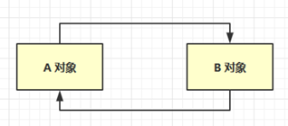

内存泄漏（Memory leak）：是在 计算机科学 中，由于疏忽或错误造成程序未能释放已经不再使用的内存。内存泄漏并非指内存在物理上的消失，而是应用程序分配某段内存后，由于设计错误，导致在释放该段内存之前就失去了对该段内存的控制，从而造成了内存的浪费。内存泄漏通常情况下只能由获得程序 源代码 的程序员才能分析出来。


### 1.2 可达性分析算法（Java 虚拟机采用）

可达性分析算法的实质在于将一系列 **GC Roots** 作为初始的**存活对象合集（live set）**，然后从该合集出发，探索所有能够被该集合引用到的对象，并将其加入到该集合中，这个过程我们也称之为标记（mark）。最终，未被探索到的对象便是死亡的，是可以回收的。

- Java 虚拟机中的垃圾回收器采用可达性分析来探索所有存活的对象

- 扫描堆中的对象，看是否能够沿着  GC Root对象 为起点的引用链找到该对象，找不到，表示可以回收

- 哪些对象可以作为  GC Root ?
  - 虚拟机栈中引用的对象
    - 比如：各个线程被调用的方法中使用到的参数、局部变量等。
  - 方法区中类静态属性引用的对象
    - 比如：Java类的引用类型静态变量
  - 方法区中常量引用的对象
    - 比如：字符串常量池（string Table）里的引用
  - 本地方法栈内JNI（通常说的本地方法）引用的对象
    - (可以理解为:引用Native方法的所有对象)
  - 所有被同步锁synchronized持有的对象
  - Java虚拟机内部的引用。
    - 基本数据类型对应的Class对象，一些常驻的异常对象（如：NullPointerException、OutOfMemoryError），系统类加载器。
  - 反映java虚拟机内部情况的JMXBean、JVMTI中注册的回调、本地代码缓存等。


分析内存，内存优化：

- 下载 Memory Analyzer ( MAT ) 工具：https://www.eclipse.org/mat/
- `jmap -dump:format=b,live,file=1.bin pid`抓取java进程pid的内存快照存进文件1.bin里
- Memory Analyzer ( MAT ) 工具打开内存快照（文件1.bin）


### 1.3 四种引用

1. 强引用
   - 只有所有 GC Roots 对象都不通过【强引用】引用该对象，该对象才能被垃圾回收

2. 软引用（SoftReference）
   - 仅有软引用引用该对象时，在垃圾回收后，内存仍不足时会再次出发垃圾回收，回收软引用对象
   - 可以配合引用队列来释放软引用自身
   - 用法：一些不重要且较大的内存对象，可以用软引用，防止内存溢出

用途演示：

```java
//vm: -Xmx20m -XX:+PrintGCDetails -verbose:gc
public class Demo2_3 {
    private static final int _4MB = 4 * 1024 * 1024;
    public static void main(String[] args) throws IOException {
        //不使用软引用：堆内存不足
        /*List<byte[]> list = new ArrayList<>();
        for (int i = 0; i < 5; i++) {
            list.add(new byte[_4MB]);
        }

        System.in.read();*/
        
        //使用软引用
        soft();
    }

    public static void soft() {
        // list --> SoftReference --> byte[]
        List<SoftReference<byte[]>> list = new ArrayList<>();
        for (int i = 0; i < 5; i++) {
            SoftReference<byte[]> ref = new SoftReference<>(new byte[_4MB]);
            System.out.println(ref.get());
            list.add(ref);
            System.out.println(list.size());
        }
        System.out.println("循环结束：" + list.size());
        for (SoftReference<byte[]> ref : list) {
            System.out.println(ref.get());
        }
    }
}
```

配合引用队列：

```java
public class Demo2_4 {
    private static final int _4MB = 4 * 1024 * 1024;
    public static void main(String[] args) {
        List<SoftReference<byte[]>> list = new ArrayList<>();

        // 引用队列
        ReferenceQueue<byte[]> queue = new ReferenceQueue<>();

        for (int i = 0; i < 5; i++) {
            // 关联了引用队列， 当软引用所关联的 byte[]被回收时，软引用自己会加入到 queue 中去
            SoftReference<byte[]> ref = new SoftReference<>(new byte[_4MB], queue);
            System.out.println(ref.get());
            list.add(ref);
            System.out.println(list.size());
        }

        // 从队列中获取无用的 软引用对象，并移除
        Reference<? extends byte[]> poll = queue.poll();
        while( poll != null) {
            list.remove(poll);
            poll = queue.poll();
        }

        System.out.println("===========================");
        for (SoftReference<byte[]> reference : list) {
            System.out.println(reference.get());
        }
    }
}
```


3. 弱引用（WeakReference）
   - 仅有弱引用引用该对象时，在垃圾回收时，**无论内存是否充足，都会回收弱引用对象**
   - 可以配合引用队列来释放弱引用自身
   - 用法：配合引用队列，代码同上(软引用)
     - ThreaLocal中的ThreadLocalMap继承了弱引用WeakReference，防止map中的key引用的对象无法被回收；
     - 应用在一些高速缓存场景；因为缓存数据时用来加快执行速度，但是又不能无限制的将数据存入缓存，因为内存容量是有限的，这时可以使用弱引用，GC时及时清理缓存对象。


4. 虚引用（PhantomReference）
   - 必须配合引用队列使用，主要配合 ByteBuffer 使用，被引用对象回收时，会将虚引用入队，由 Reference Handler 线程调用虚引用相关方法释放直接内存

5. 终结器引用（FinalReference）（非四种引用之一）
   - 无需手动编码，但其内部配合引用队列使用，在垃圾回收时，终结器引用入队（被引用对象暂时没有被回收），再由 Finalizer 线程通过终结器引用找到被引用对象并调用它的 finalize方法，第二次 GC 时才能回收被引用对象


## 2. 垃圾回收算法

### 2.1 标记清除

定义： Mark Sweep

特点：

- 速度较快（将被清除的空间的起始地址和结束地址记录到空闲列表中）
- 会造成内存碎片

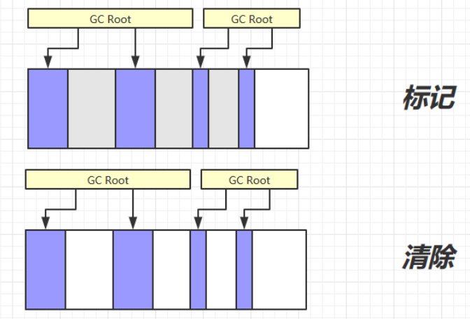


### 2.2 标记整理

定义：Mark Compact

特点：

- 速度慢
- 没有内存碎片

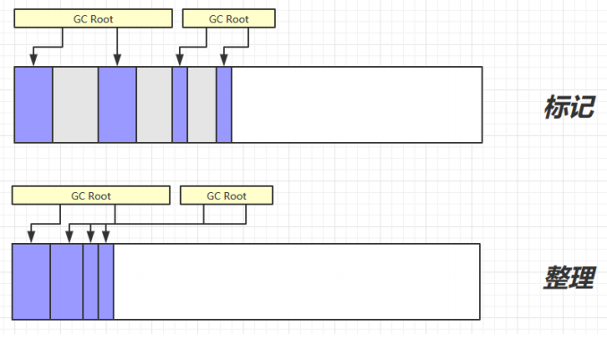


### 2.3 复制

定义：Copy

特点：

- 不会有内存碎片
- 需要占用双倍内存空间

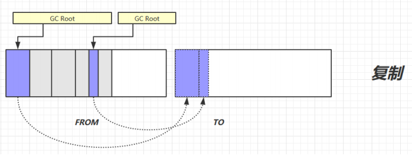

copy() 函数会返回指向新空间的指针，所以会把指向子对象的引用重写为这个新的指针。这样一来，从To 空间指向From 空间的指针就全部指向To 空间。然后交换From To。


## 3. 分代垃圾回收

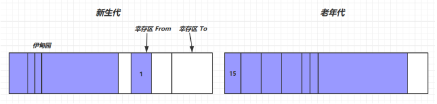

- 新对象首先分配在新生代的伊甸园区域（若大对象占用的空间在老年代中足够存放，而新生代中肯定不够的前提下会直接晋升到老年代，不会触发新生代GC）
- 新生代空间不足时，触发 Minor gc，伊甸园和 from 存活的对象使用 copy 复制到 to 中，存活的对象年龄加 1并且交换 from to
- Minor gc 会引发 stop the world(STW)，暂停其它用户的线程，等垃圾回收结束，用户线程才恢复运行
- 当对象寿命超过阈值时，会晋升至老年代，新生代最大寿命是15（4bit）（内存紧张会提前晋升）
- 当老年代空间不足，会先尝试触发 Minor gc，如果之后空间仍不足，那么触发 Full gc，STW的时间更长。如果仍然空间不足，则out of memory

*Tips：一个线程的out of memory并不会影响主线程*


### 3.1 相关 VM 参数

| 含义                | 参数                                                         |
| ------------------- | ------------------------------------------------------------ |
| 堆初始大小          | -Xms                                                         |
| 堆最大大小          | -Xmx 或 -XX:MaxHeapSize=size                                 |
| 新生代大小          | -Xmn 或 (-XX:NewSize=size + -XX:MaxNewSize=size )            |
| 幸存区比例（动态）  | -XX:InitialSurvivorRatio=ratio 和 -XX:+UseAdaptiveSizePolicy |
| 幸存区比例          | -XX:SurvivorRatio=ratio                                      |
| 晋升阈值            | -XX:MaxTenuringThreshold=threshold                           |
| 晋升详情            | -XX:+PrintTenuringDistribution                               |
| GC详情              | -XX:+PrintGCDetails -verbose:gc                              |
| Full GC 前 Minor GC | -XX:+ScavengeBeforeFullGC                                    |


## 4. 垃圾回收器

1. 串行

   - 单线程

   - 堆内存较小，适合个人电脑

2. 吞吐量优先

   - 多线程

   - 堆内存较大，多核 cpu
   - 让单位时间内，STW 的时间最短 0.2+0.2 = 0.4，垃圾回收时间占比(占总的运行时间)最低，这样就称吞吐量高
   - 适用于交互少，计算多，适合在后台运算的场景

3. 响应时间优先(低停顿)

   - 多线程
   
   - 堆内存较大，多核 cpu
   - 尽可能让单次 STW 的时间最短   0.1+0.1+0.1+0.1+0.1 = 0.5
   
   - 适用于交互多，对响应速度要求高的场景
   


### 4.0 介绍

JVM是一个进程，垃圾收集器就是一个线程，垃圾收集线程是一个守护线程，优先级低，其在当前系统空闲或堆中老年代占用率较大时触发。

JDK7/8后，HotSpot虚拟机所有收集器及组合（连线），如下图：

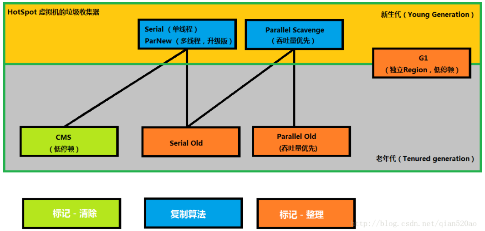


#### 回收器并行并发：

**并行（Parallel）**

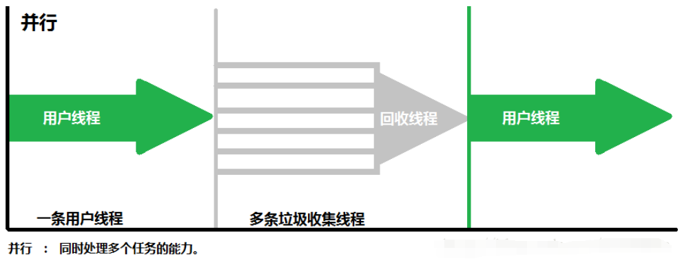

- 指多条垃圾收集线程并行工作，但此时用户线程仍然处于等待状态；
- 如ParNew、Parallel Scavenge、Parallel Old；


**并发（Concurrent）**

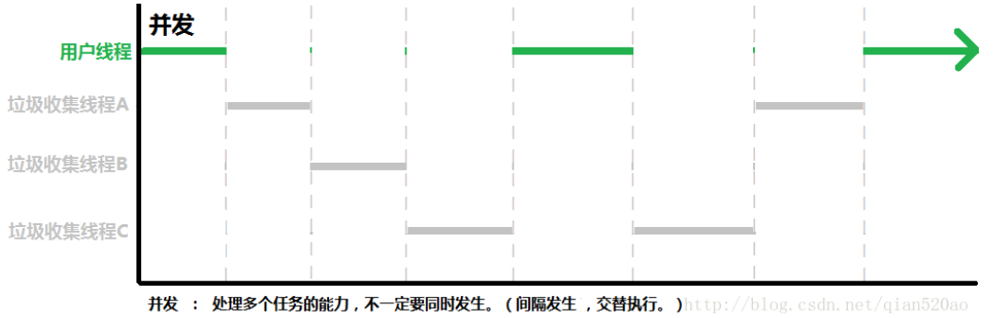

- 指用户线程与垃圾收集线程同时执行（但不一定是并行的，可能会交替执行）；
- 用户程序在继续运行，而垃圾收集程序线程运行于另一个CPU上；  
- 如CMS、G1（也有并行）；


#### 7种垃圾收集器：

1. Serial
2. ParNew （Serial的升级版，多线程）
3. Parallel Scavenge
4. Serial Old
5. Parallel Old
6. CMS
7. G1


#### 垃圾收集器分类：

- 新生代/老年代收集器
  - 新生代收集器：Serial、ParNew、Parallel Scavenge；
  - 老年代收集器：Serial Old、Parallel Old、CMS；
  - 整堆收集器：G1

- 吞吐量优先、停顿时间优先
  - 吞吐量优先：Parallel Scavenge收集器、Parallel Old 收集器。
  - 停顿时间优先：CMS（Concurrent Mark-Sweep）收集器。

- 串行并行并发
  - 串行：Serial、Serial Old
  - 并行：ParNew、Parallel Scavenge、Parallel Old
  - 并发：CMS、G1

- 算法
  - 复制算法：Serial、ParNew、Parallel Scavenge、G1
  - 标记-清除：CMS
  - 标记-整理：Serial Old、Parallel Old、G1


#### 1、Serial收集器(复制) - 新生代

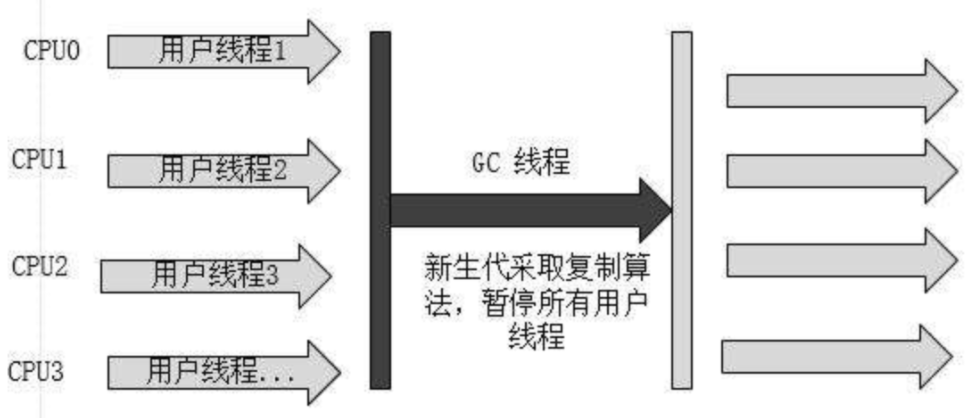


Serial（串行）垃圾收集器是最基本、发展历史最悠久的收集器；

JDK1.3.1前是HotSpot新生代收集的唯一选择；

**特点**

1. 针对新生代
2. 串行
3. 复制算法
4. 单线程一方面意味着它只会使用一个CPU或一条线程去完成垃圾收集工作，
5. 另一方面也意味着在它进行垃圾收集时，必须暂停其他所有的工作线程，直到它收集结束为止，这个过程也称为 Stop The world。
6. 后者意味着，在用户不可见的情况下要把用户正常工作的线程全部停掉，这显然对很多应用是难以接受的。

**应用场景**
对于限定单个CPU的环境来说，Serial收集器由于没有线程交互的开销，专心做垃圾收集自然可以获得最高的单线程收集效率。

Serial收集器依然是虚拟机运行在Client模式下的默认新生代收集器。 在用户的桌面应用场景中，可用内存一般不大（几十M至一两百M），可以在较短时间内完成垃圾收集（几十MS至一百多MS）,只要不频繁发生，这是可以接受的。

> Tips：Stop the World是在用户不可见的情况下执行的，会造成某些应用响应变慢；

> Tips：因为新生代的特点是对象存活率低，所以收集算法用的是复制算法，把新生代存活对象复制到老年代，复制的内容不多，性能较好。

> Tips：单线程地好处就是减少上下文切换，减少系统资源的开销。但这种方式的缺点也很明显，在GC的过程中，会暂停程序的执行。若GC不是频繁发生，这或许是一个不错的选择，否则将会影响程序的执行性能。 对于新生代来说，区域比较小，停顿时间短，所以比较使用。

**参数**
`-XX:+UseSerialGC`：串联收集器

> Tips：在JDK Client模式，不指定VM参数，默认是串行垃圾回收器


#### 2、ParNew收集器(复制) - 新生代

ParNew收集器就是Serial收集器的**多线程版本**，它也是一个**新生代收集器**。除了使用多线程进行垃圾收集外，其余行为包括Serial收集器可用的所有控制参数、收集算法（复制算法）、Stop The World、对象分配规则、回收策略等与Serial收集器完全相同，两者共用了相当多的代码。

ParNew收集器的工作过程如下图：

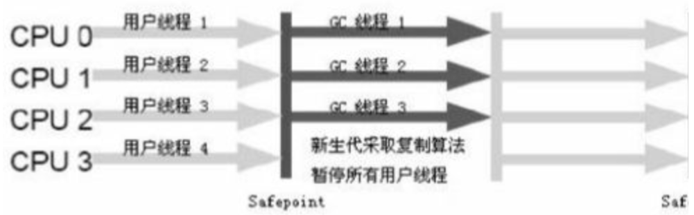

ParNew收集器除了使用多线程收集外，其他与Serial收集器相比并无太多创新之处，但它却是许多运行在Server模式下的虚拟机中首选的新生代收集器，其中有一个与性能无关的重要原因是，**除了Serial收集器外，目前只有它能和CMS收集器（Concurrent Mark Sweep）配合工作**。

ParNew 收集器在**单CPU**的环境中绝对不会有比Serial收集器有更好的效果，甚至由于存在线程交互的开销，该收集器在通过超线程技术实现的两个CPU的环境中都不能百分之百地保证可以超越。在**多CPU**环境下，随着CPU的数量增加，它对于GC时系统资源的有效利用是很有好处的。

**特点**
**ParNew收集器其实就是Serial收集器的多线程版本**，除了使用多条线程进行垃圾收集外，其余行为和Serial收集器完全一样，包括Serial收集器可用的所有控制参数、收集算法、Stop The world、对象分配规则、回收策略等都一样。在实现上也共用了相当多的代码。

1. 针对新生代
2. 复制算法
3. 并行
4. 多线程
5. GC时需要暂停所有用户线程，直到GC结束
6. Serial多线程版本，其他特点与Serial相同

**应用场景**
ParNew收集器是许多运行在Server模式下的虚拟机中首选的新生代收集器。很重要的原因是：除了Serial收集器之外，目前只有它能与CMS收集器配合工作（看图）。在JDK1.5时期，HotSpot推出了一款几乎可以认为具有划时代意义的垃圾收集器-----CMS收集器，这款收集器是HotSpot虚拟机中第一款真正意义上的并发收集器，它第一次实现了让垃圾收集线程与用户线程同时工作。

参数
`-XX:+UseConcMarkSweepGC`：指定使用CMS后，会默认使用ParNew作为新生代收集器；
`-XX:+UseParNewGC`：强制指定使用ParNew；    
`-XX:ParallelGCThreads`：指定垃圾收集的线程数量，ParNew默认开启的收集线程与CPU的数量相同；

**为什么只有ParNew能与CMS收集器配合**
CMS是HotSpot在JDK1.5推出的第一款真正意义上的并发（Concurrent）收集器，第一次实现了让垃圾收集线程与用户线程（基本上）同时工作；

CMS作为老年代收集器，但却无法与JDK1.4已经存在的新生代收集器Parallel Scavenge配合工作；

因为Parallel Scavenge（以及G1）都没有使用传统的GC收集器代码框架，而另外独立实现；而其余几种收集器则共用了部分的框架代码；


#### 3、Parallel Scavenge收集器(复制) - 新生代

Parallel Scavenge收集器和ParNew类似，**新生代**的收集器，同样用的是**复制算法**，也是**并行多线程**收集。与ParNew最大的不同，它关注的是垃圾回收的**吞吐量**。

**特点**

1. 针对新生代
2. 复制算法
3. 并行
4. 多线程
5. 高吞吐量为目标

**应用场景**
Parallel Scavenge收集器是虚拟机运行在Server模式下的默认垃圾收集器。

高吞吐量为目标，即减少垃圾收集时间，让用户代码获得更长的运行时间；适合那种交互少、运算多的场景。

例如，那些执行批量处理、订单处理、工资支付、科学计算的应用程序；

**参数**
`-XX:+MaxGCPauseMillis`：控制最大垃圾收集停顿时间，大于0的毫秒数；这个参数设置的越小，停顿时间可能会缩短，但也会导致吞吐量下降，导致垃圾收集发生得更频繁。
`-XX:GCTimeRatio`：设置垃圾收集时间占总时间的比率，0<n<100的整数，就相当于设置吞吐量的大小。

> 先垃圾收集执行时间占应用程序执行时间的比例的计算方法是：
> 1 / (1 + n)
> 例如，选项-XX:GCTimeRatio=19，设置了垃圾收集时间占总时间的5%=1/(1+19)；
> 默认值是1%--1/(1+99)，即n=99；
> 垃圾收集所花费的时间是年轻一代和老年代收集的总时间；

此外，还有一个值得关注的参数：

"-XX:+UseAdptiveSizePolicy"

开启这个参数后，就不用手工指定一些细节参数，如：

新生代的大小（-Xmn）、Eden与Survivor区的比例（-XX:SurvivorRation）、晋升老年代的对象年龄（-XX:PretenureSizeThreshold）等；

JVM会根据当前系统运行情况收集性能监控信息，动态调整这些参数，以提供最合适的停顿时间或最大的吞吐量，这种调节方式称为GC自适应的调节策略（GC Ergonomiscs）；    

另外值得注意的一点是，Parallel Scavenge收集器无法与CMS收集器配合使用，所以在JDK 1.6推出Parallel Old之前，如果新生代选择Parallel Scavenge收集器，老年代只有Serial Old收集器能与之配合使用。

**Parallel Scavenge收集器 VS CMS等收集器**
Parallel Scavenge收集器的特点是它的关注点与其他收集器不同，CMS等收集器的关注点是尽可能地缩短垃圾收集时用户线程的停顿时间，而Parallel Scavenge收集器的目标则是达到一个可控制的吞吐量（Throughput）。
由于与吞吐量关系密切，Parallel Scavenge收集器也经常称为“吞吐量优先”收集器。

**Parallel Scavenge收集器 VS ParNew收集器**
Parallel Scavenge收集器与ParNew收集器的一个重要区别是它具有自适应调节策略。


#### 4、Serial Old收集器(标记-整理) - 老年代

Serial收集器的工作流程如下图：

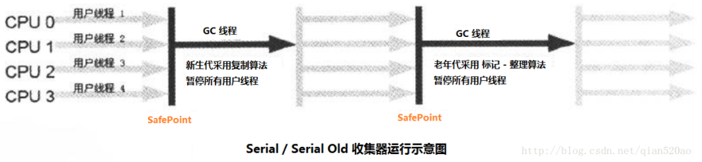

如上图所示，Serial 收集器在新生代和老年代都有对应的版本，除了收集算法不同，两个版本并没有其他差异。

- Serial 新生代收集器采用的是复制算法。
- Serial Old 老年代采用的是标记 - 整理算法。

**特性**

- Serial Old是Serial的老年代版本，
- 除了采用**标记-整理**算法，其他与Serial相同

**应用场景**

- Client模式
  - Serial Old收集器的主要意义也是在于给Client模式下的虚拟机使用。
- Server模式
  - 如果在Server模式下，那么它主要还有两大用途：一种用途是在JDK 1.5以及之前的版本中与Parallel Scavenge收集器搭配使用；另一种用途就是作为CMS收集器的后备预案，在并发收集发生"Concurrent Mode Failure"时使用。


#### 5、Parallel Old收集器(标记-整理) - 老年代

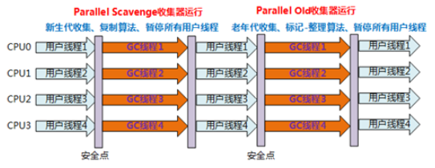

如上图所示，Parallel 收集器在新生代和老年代也都有对应的版本，除了收集算法不同，两个版本并没有其他差异。

Parallel Scavenge收集器的老年代版本，并行收集器，吞吐量优先

Parallel Old收集器是Parallel Scavenge收集器的老年版本，它也使用多线程和“标记-整理”算法。这个收集器是在JDK 1.6开始提供。

Mark-Compact

**特点**

1. Parallel Old 是Parallel Scavenge的老年代版本
2. Parallel Old 老年代采用的是**标记 - 整理算法**，其他特点与Parallel Scavenge相同

**使用场景**

1. 在注重吞吐量以及CPU资源敏感的场合，都可以优先考虑Parallel Scavenge加Parallel Old收集器组合。
2. JDK1.6及之后用来代替老年代的Serial Old收集器；
3. 特别是在Server模式，多CPU的情况下；

**参数**
`-XX:+UseParallelOldGC`：指定使用Parallel Old收集器；


#### 6、CMS(Concurrent Mark Sweep)收集器(标记-清除) - 老年代

**概述**

1. CMS是HotSpot在JDK5推出的第一款真正意义上的并发（Concurrent）收集器，第一次实现了让垃圾收集线程与用户线程（基本上）同时工作；
2. 命名中用的是concurrent，而不是parallel，说明这个收集器是有与工作执行并发的能力的。MS则说明算法用的是Mark Sweep算法。
3. 它关注的是垃圾回收最短的停顿时间（低停顿），在老年代并不频繁GC的场景下，是比较适用的。

特点

1. 针对老年代
2. 标记-清除算法 (不进行压缩操作，产生内存碎片)；
3. 并发
4. 多线程
5. 收集过程中不需要暂停用户线程
6. 以获取最短回收停顿时间为目标

**应用场景**
与用户交互较多的场景。**CMS 收集器是一种以获取最短回收停顿时间为目标的收集器**。目前很大一部分的Java应用集中在互联网或者B/S系统的服务端上，这类应用尤其注重服务的响应速度，希望系统停顿时间最短，以给用户带来极好的体验。CMS收集器就非常符合这类应用的需求。

CMS是一种以获取最短回收停顿时间为目标的收集器。在重视响应速度和用户体验的应用中，CMS应用很多。

**CMS GC过程分四步完成：**

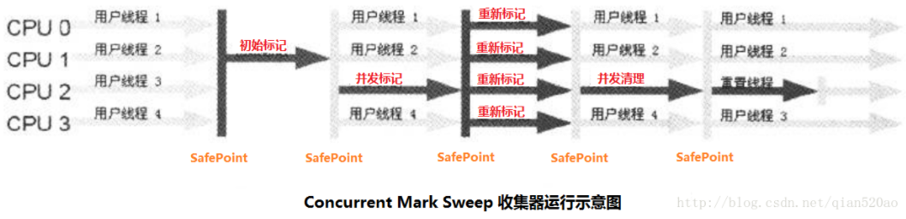


比前面几种收集器更复杂，可以分为4个步骤:

1、初始标记（initial mark）

- 单线程执行
- 需要“Stop The World”
- 但仅仅把GC Roots的直接关联可达的对象给标记一下，由于直接关联对象比较小，所以这里的速度非常快

2、并发标记（concurrent mark）

- 对于初始标记过程所标记的初始标记对象，进行并发追踪标记，
- 此时其他线程仍可以继续工作。
- 此处时间较长，但不停顿。
- 并不能保证可以标记出所有的存活对象；

3、重新标记（remark）

- 在并发标记的过程中，由于可能还会产生新的垃圾，所以此时需要重新标记新产生的垃圾。
- 此处执行并行标记，与用户线程不并发，所以依然是“Stop The World”，
- 且停顿时间比初始标记稍长，但远比并发标记短。

4、并发清除（concurrent sweep）

- 并发清除之前所标记的垃圾。
- 其他用户线程仍可以工作，不需要停顿。

> Tips：其中，初始标记和并发标记仍然需要Stop the World、初始标记仅仅标记一下GC Roots能直接关联到的对象，速度很快，并发标记就是进行GC RootsTracing的过程，而重新标记阶段则是为了修正并发标记期间因用户程序继续运行而导致标记产生变动的那一部分对象的标记记录，这个阶段的停顿时间一般会比初始标记阶段长，但远比并发标记的时间短。

由于整个过程中耗时最长的并发标记和并发清除过程收集器线程都可以与用户线程一起工作，所以整体上说，CMS收集器的内存回收过程是与用户线程一共并发执行的。

**参数**
`-XX:+UseConcMarkSweepGC`：使用CMS收集器
`-XX:+ UseCMSCompactAtFullCollection`：Full GC后，进行一次碎片整理；整理过程是独占的，会引起停顿时间变长
`-XX:+CMSFullGCsBeforeCompaction`：设置进行几次Full GC后，进行一次碎片整理
`-XX:ParallelCMSThreads`：设定CMS的线程数量（一般情况约等于可用CPU数量） 

**缺点**
总体来看，与Parallel Old垃圾收集器相比，CMS减少了执行老年代垃圾收集时应用暂停的时间；

但却增加了新生代垃圾收集时应用暂停的时间、降低了吞吐量而且需要占用更大的堆空间；

由于最耗费时间的并发标记与并发清除阶段都不需要暂停工作，所以整体的回收是低停顿的。

由于CMS以上特性，缺点也是比较明显的，

1、对CPU资源非常敏感

> 对CPU资源非常敏感 其实，面向并发设计的程序都对CPU资源比较敏感。
>
> 在并发阶段，它虽然不会导致用户线程停顿，但会因为占用了一部分线程（或者说CPU资源）而导致应用程序变慢，总吞吐量会降低。
>
> CMS默认启动的回收线程数是（CPU数量+3）/4，也就是当CPU在4个以上时，并发回收时垃圾收集线程不少于25%的CPU资源，并且随着CPU数量的增加而下降。
>
> 但是当CPU不足4个时（比如2个），CMS对用户程序的影响就可能变得很大，如果本来CPU负载就比较大，还要分出一半的运算能力去执行收集器线程，就可能导致用户程序的执行速度忽然降低了50%，其实也让人无法接受。
>
> 并发收集虽然不会暂停用户线程，但因为占用一部分CPU资源，还是会导致应用程序变慢，总吞吐量降低。
>
> CMS的默认收集线程数量是=(CPU数量+3)/4；
>
> 当CPU数量多于4个，收集线程占用的CPU资源多于25%，对用户程序影响可能较大；不足4个时，影响更大，可能无法接受。

2、浮动垃圾（Floating Garbage）

> 由于CMS并发清理阶段用户线程还在运行着，伴随程序运行自然就还会有新的垃圾不断产生，这一部分垃圾出现在标记过程之后，CMS无法在当次收集中处理掉它们，只好留待下一次GC时再清理掉。这一部分垃圾就称为“浮动垃圾”。
>
> 由于在垃圾收集阶段用户线程还需要运行，那就还需要预留有足够的内存空间给用户线程使用，因此CMS收集器不能像其他收集器那样等到老年代几乎完全被填满了再进行收集，也可以热为CMS所需要的空间比其他垃圾收集器大；
>
> "-XX:CMSInitiatingOccupancyFraction"：设置CMS预留内存空间；
>
> JDK1.5默认值为68%；
>
> JDK1.6变为大约92%；

3、"Concurrent Mode Failure"失败

> 如果CMS运行期间预留的内存无法满足程序需要，就会出现一次“Concurrent Mode Failure”失败，这时虚拟机将启动后备预案：临时启用Serial Old收集器来重新进行老年代的垃圾收集，这样会导致另一次Full GC的产生。这样停顿时间就更长了，代价会更大，所以 "-XX:CMSInitiatingOccupancyFraction"不能设置得太大。

4、产生大量内存碎片

> 这个问题并不是CMS的问题，而是算法的问题。由于CMS基于"标记-清除"算法，清除后不进行压缩操作，所以会产生碎片
>
> "标记-清除"算法介绍时曾说过：产生大量不连续的内存碎片会导致分配大内存对象时，无法找到足够的连续内存，从而需要提前触发另一次Full GC动作。
>
> 4.1碎片解决方法：
> （1）、"-XX:+UseCMSCompactAtFullCollection"
>
> 使得CMS出现上面这种情况时不进行Full GC，而开启内存碎片的合并整理过程；
>
> 但合并整理过程无法并发，停顿时间会变长；
>
> 默认开启（但不会进行，结合下面的CMSFullGCsBeforeCompaction）；
>
> （2）、"-XX:+CMSFullGCsBeforeCompaction"
>
> 设置执行多少次不压缩的Full GC后，来一次压缩整理；
>
> 为减少合并整理过程的停顿时间；
>
> 默认为0，也就是说每次都执行Full GC，不会进行压缩整理；
>
> 由于空间不再连续，CMS需要使用可用"空闲列表"内存分配方式，这比简单实用"碰撞指针"分配内存消耗大；


### 4.1 串行

-XX:+UseSerialGC =  `Serial + SerialOld`

- 根据服务器性能选择串行还是并行（+是开启，对应-）
- Serial：工作在新生代，使用复制算法
- SerialOld：工作在老年代，使用标记整理算法

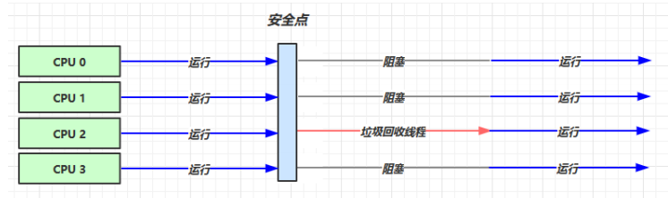


### 4.2 吞吐量优先

`-XX:+UseParallelGC` ~  `-XX:+UseParallelOldGC`

- 默认开启。连带开启，开启其中一个，另一个也会开启

`-XX:+UseAdaptiveSizePolicy`

- 自适应大小调整策略。调整新生代的大小，即Eden和Survivor的比例大小；晋升阈值也会调整……，会根据下面两个参数调整

`-XX:GCTimeRatio=ratio`

- GC调整吞吐量，默认ratio=99，一般设置为19，也就是应用程序线程应该运行至少99%的总执行时间

`-XX:MaxGCPauseMillis=ms`

- 设置最大垃圾收集停顿时间，可以把JVM在GC停顿的时间控制在这个范围内，设置小了可以减少GC停顿时间，但是会引起GC频繁，增加了GC总时间，降低吞吐量。默认100ms。

`-XX:ParallelGCThreads=n`

- GC线程数，一般等于CPU核数

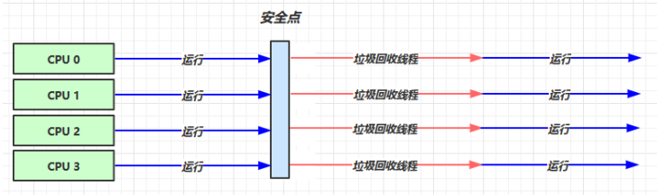


### 4.3 响应时间优先(低停顿)

`-XX:+UseConcMarkSweepGC`  ~  `-XX:+UseParNewGC ~  SerialOld`

- -XX:+UseConcMarkSweepGC：Conc，concurrent并发；开启

`-XX:ParallelGCThreads=n`  ~  `-XX:ConcGCThreads=threads`

- -XX:ConcGCThreads=threads：设置线程数

`-XX:CMSInitiatingOccupancyFraction=percent`

- 内存占用多少时开始垃圾回收

`-XX:+CMSScavengeBeforeRemark`

- 重新标记前进行垃圾回收

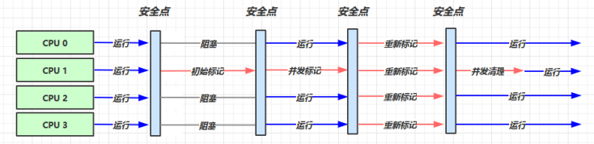

>初始标记：仅仅标记GC ROOTS的直接关联对象，并且世界暂停
>
>并发标记：使用GC ROOTS TRACING算法，进行跟踪标记，世界不暂停。并发标记过程中产生变动的对象会放入一个队列中供重新标记过程遍历
>
>重新标记：因为之前并发标记，其他用户线程不暂停，可能产生了新垃圾，所以重新标记，世界暂停。扫描老年代和新生代的内存


### 4.4 G1

定义：Garbage First

- 2004 论文发布
- 2009 JDK 6u14 体验
- 2012 JDK 7u4 官方支持
- 2017 JDK 9 默认

适用场景

- 同时注重吞吐量（Throughput）和低延迟（Low latency），默认的暂停目标是 200 ms
- 超大堆内存，会将堆划分为多个大小相等的  Region
- 整体上是 **标记+整理** 算法，两个区域之间是 **复制** 算法

相关 JVM 参数

`-XX:+UseG1GC`

`-XX:G1HeapRegionSize=size`

`-XX:MaxGCPauseMillis=time`


#### 1.G1 垃圾回收阶段

​	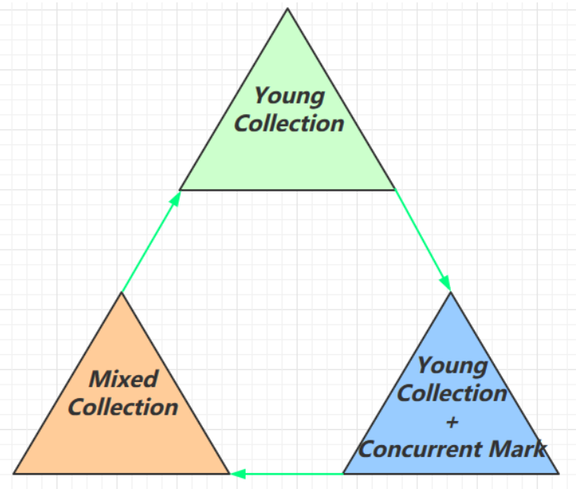

*注：阶段划分说法不一*


传统的GC收集器将连续的内存空间划分为新生代、老年代和永久代（JDK 8去除了永久代，引入了元空间Metaspace），这种划分的特点是各代的存储地址（逻辑地址，下同）是连续的。

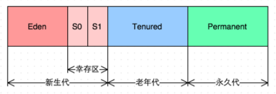

而G1的各代存储地址是不连续的，每一代都使用了n个不连续的大小相同的Region，每个Region占有一块连续的虚拟内存地址。

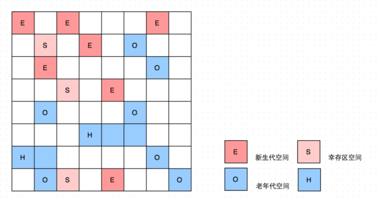

在上图中，我们注意到还有一些Region标明了H，它代表Humongous，这表示这些Region存储的是巨大对象（humongous object，H-obj），即大小大于等于region一半的对象。H-obj有如下几个特征：

- H-obj直接分配到了old gen，防止了反复拷贝移动。
- H-obj在global concurrent marking阶段的cleanup 和 full GC阶段回收。
- 在分配H-obj之前先检查是否超过 initiating heap occupancy percent和the marking threshold, 如果超过的话，就启动global concurrent marking，为的是提早回收，防止 evacuation failures 和 full GC。

为了减少连续H-objs分配对GC的影响，需要把大对象变为普通的对象，建议增大Region size。

一个Region的大小可以通过参数-XX:G1HeapRegionSize设定，取值范围从1M到32M，且是2的指数。如果不设定，那么G1会根据Heap大小自动决定。


#### 2.Young Collection

- 会 STW
- E：Eden(伊甸园)；S：Survivor(幸存区)；O：Old(老年代)；

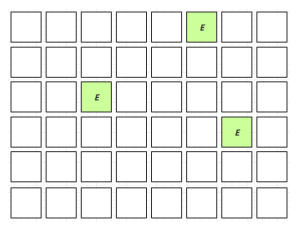

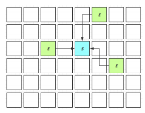

S—不够年龄—>S，S—够年龄—>O

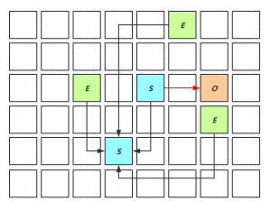


#### 3.Young Collection + CM

- 在 Young GC 时会进行 GC Root 的初始标记
- 老年代占用堆空间比例达到阈值时，进行并发标记(CM)（不会 STW），由下面的 JVM 参数决定

`-XX:InitiatingHeapOccupancyPercent=percent` （默认45%）

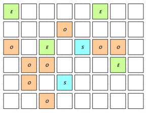


#### 4.Mixed Collection

会对 E、S、O 进行全面垃圾回收

- 最终标记（Remark）会 STW
- 拷贝存活（Evacuation）会 STW

`-XX:MaxGCPauseMillis=ms`

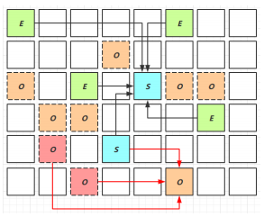

> 为了控制不超过 MaxGCPauseMillis 最大暂停时间，会将尽量多的最有回收价值(垃圾最多的Region)的 O—复制—>O


#### 5.Full GC

- SerialGC
  - 新生代内存不足发生的垃圾收集 - Minor gc
  - 老年代内存不足发生的垃圾收集 - full gc

- ParallelGC
  - 新生代内存不足发生的垃圾收集 - Minor gc
  - 老年代内存不足发生的垃圾收集 - full gc

- CMS
  - 新生代内存不足发生的垃圾收集 - Minor gc
  - 老年代内存不足

- G1
  - 新生代内存不足发生的垃圾收集 - Minor gc
  - 老年代内存不足

> CMS和G1 产生 Full GC的条件是：垃圾回收速度跟不上垃圾产生的速度，此时并发收集失败，会退化为Full GC，更慢，stop the world也会更久，响应时间更长


#### 6.Young Collection 跨代引用

- 新生代回收的跨代引用（老年代引用新生代）问题

​	


- Card Table 卡表  与  Remembered Set
- 在引用变更时通过  `post-write barrier`(写屏障) +  `dirty card queue`(脏卡队列)(下图粉红色区域为脏卡)
- concurrent refinement threads 更新  Remembered Set

​	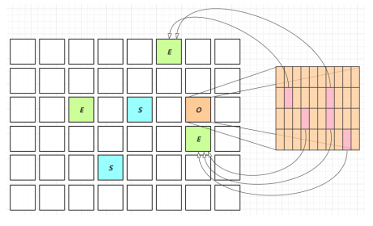

**RSet（记忆集 Remembered Set）**
记录了其它Region中的对象到Region的引用。

RSet的价值在于使得垃圾回收不需要扫描整个堆，能够快速定位到真正引用它的堆对象地址。ReSet本身就是一个Hash表，存储在新生代的每个Region中。但是存储需要消耗空间，多的能达到百分之20。因此G1对内存的空间要求较高(小空间没资本玩)，空间越大性能越彪悍。

**CardTable**
由于新生代GC时，需要扫描整个old区，效率非常低。所以old区就是用卡表的方式进行一次逻辑分区。一般一页卡表的大小是2的n次幂。每一个区域也是用Key，Value结构进行记录。每一区域记录为Key不重复，Value则记录这片区域的老年代对象与新生代对象是否存在引用关系，存在则标记为1，否则为0。记录完毕后把value为1的key作为ReSet的key进行记录，并且ReSet的value存储引用，从而提高跨代引用的查询效率。

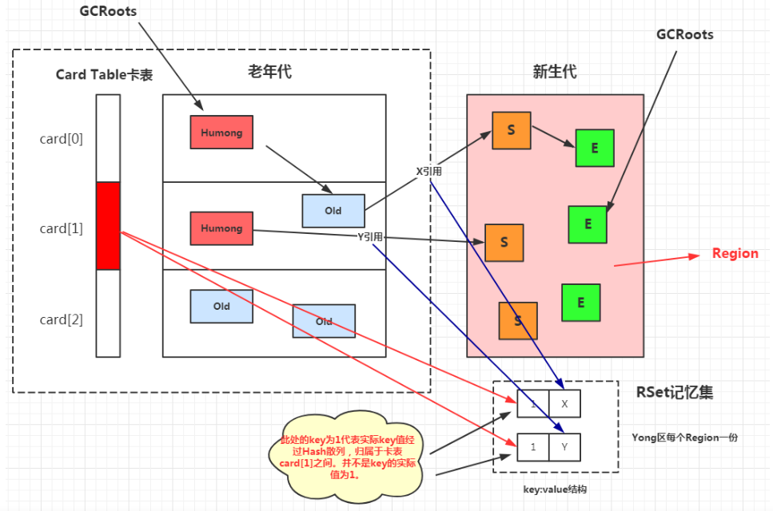


#### 7. Remark

pre-write barrier  +  satb_mark_queue

> 重标记会给那些并发标记时标记的“未被引用的对象”加入写屏障(pre-write barrier)，然后入队satb_mark_queue，stop the world后再次检查是否被引用

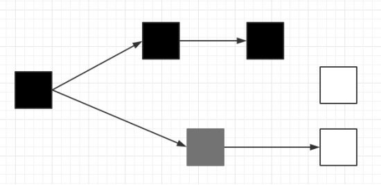

上图为并发标记阶段时对象处理状态

黑色：处理完成，被引用，结束时存活

灰色：正在处理（有强引用引用该对象，最终会存活）

白色：尚未处理（有箭头的会存活，无的会垃圾回收）


#### 8. JDK 8u20 字符串去重

- 优点：节省大量内存

- 缺点：略微多占用了 cpu 时间，新生代回收时间略微增加

`-XX:+UseStringDeduplication`

```java
String s1 = new String("hello"); // char[]{'h','e','l','l','o'}

String s2 = new String("hello"); // char[]{'h','e','l','l','o'}
```

- 将所有新分配的字符串放入一个队列

- 当新生代回收时，G1并发检查是否有字符串重复

- 如果它们值一样，让它们引用同一个 char[]

- 注意，与  String.intern() 不一样

  - String.intern() 关注的是字符串对象
  - 而字符串去重关注的是 char[]
  - 在 JVM 内部，使用了不同的字符串表

  

#### 9. JDK 8u40 并发标记类卸载

所有对象都经过并发标记后，就能知道哪些类不再被使用，当一个类加载器的所有类都不再使用，则卸载它所加载的所有类

`-XX:+ClassUnloadingWithConcurrentMark` 默认启用


#### 10. JDK 8u60 回收巨型对象

- 一个对象大于 region 的一半时，称之为巨型对象
- G1 不会对巨型对象进行拷贝
- 回收时被优先考虑
- G1 会跟踪老年代所有 incoming 引用（老年代对巨型对象的引用），这样老年代 incoming 引用为 0 的巨型对象就可以在新生代垃圾回收时处理掉


#### 11. JDK 9 并发标记起始时间的调整

- 并发标记必须在堆空间占满前完成，否则退化为 FullGC
- JDK 9 之前需要使用  `-XX:InitiatingHeapOccupancyPercent`
- JDK 9 可以动态调整
  - `-XX:InitiatingHeapOccupancyPercent` 用来设置初始值
  - 进行数据采样并动态调整
  - 总会添加一个安全的空档空间


#### 12. JDK 9 更高效的回收

- 250+增强
- 180+bug修复
- https://docs.oracle.com/en/java/javase/12/gctuning


## 5. 垃圾回收调优

预备知识

- 掌握 GC 相关的 VM 参数，会基本的空间调整
- 掌握相关工具
- 明白一点：调优跟应用、环境有关，没有放之四海而皆准的法则

> 查看Windows Java虚拟机默认参数： `java -XX:+PrintFlagsFinal -version | findstr GC`


### 5.1 调优领域

- 内存
- 锁竞争
- cpu 占用
- io


### 5.2 确定目标

- 【低延迟】还是【高吞吐量】，选择合适的回收器
- 低延迟：CMS，G1，ZGC
- 高吞吐量：ParallelGC
- 低延迟：Zing（无停顿垃圾回收器）


### 5.3 最快的 GC 是不发生 GC

答案是不发生 GC

- 查看 FullGC 前后的内存占用，考虑下面几个问题
  - 数据是不是太多？
    - resultSet = statement.executeQuery("select * from 大表 limit n")
  - 数据表示是否太臃肿？
    - 对象图（不是非要查出所有的，用到什么就查什么）
    - 对象大小 (最小的对象16byte，Integer 24byte，int 4byte，是不是该考虑用基本数据类型）
  - 是否存在内存泄漏？
    - static Map map = 只放不移除？可以考虑：
    - 软
    - 弱
    - 第三方缓存实现


### 5.4 新生代调优

- 新生代的特点
  - 所有的 new 操作的内存分配非常廉价
    - TLAB (thread-local allocation buffer)（优先从各自线程的Eden分配内存，速度非常快）
  - 死亡对象的回收代价是零（采用了复制算法）
  - 大部分对象用过即死
  - Minor GC 的时间远远低于 Full GC


- 新生代越大越好吗？

-Xmn

Sets the initial and maximum size (in bytes) of the heap for the young generation (nursery). GC is performed in this region more often than in other regions. If the size for the young generation is too small, then a lot of Minor garbage collections are performed. If the size is too large, then only full garbage collections are performed, which can take a long time to complete. Oracle recommends that you keep the size for the young generation greater than 25% and less than 0% of the overall heap size.


- 新生代能容纳所有【并发量 * (请求-响应)】的数据（大小），以此估算新生代大小

  ​	*并发量 \* 一次请求响应的过程中产生的对象占用内存大小*

- 幸存区大到能保留【当前活跃对象+需要晋升对象】

- 晋升阈值配置得当，让长时间存活对象尽快晋升

`-XX:MaxTenuringThreshold=threshold`（设置最大晋升阈值）

`-XX:+PrintTenuringDistribution`

```java
Desired survivor size 48286924 bytes, new threshold 10 (max 10)

- age 1: 28992024 bytes, 28992024 total

- age 2: 1366864 bytes, 30358888 total

- age 3: 1425912 bytes, 31784800 total

...
```


### 5.5 老年代调优

以 CMS 为例

- CMS 的老年代内存越大越好
- 先尝试不做调优，如果没有 Full GC 那么已经...，否则先尝试调优新生代
- 观察发生 Full GC 时老年代内存占用，将老年代内存预设调大 1/4 ~ 1/3
  - `-XX:CMSInitiatingOccupancyFraction=percent`（老年代内存占用比例达到多少时触发GC，一般75%~80%）


### 5.6 案例

- 案例1 Full GC 和 Minor GC频繁
  - 优先新生代调优
- 案例2 请求高峰期发生 Full GC，单次暂停时间特别长 （CMS）
  - 可以试试Remark前进行垃圾回收，`-XX:+CMSScavengeBeforeRemark`
- 案例3 老年代充裕情况下，发生 Full GC （CMS jdk1.7）
  - 永久代空间不足，可以增加初始值和最大值


