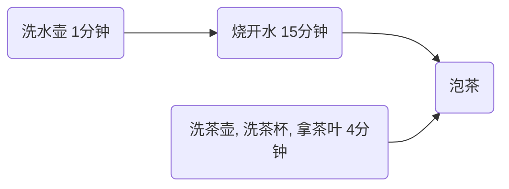

# 一、基本概念

## 1、进程与线程

### 进程

- 程序由指令和数据组成，但这些指令要运行，数据要读写，就必须将指令加载至 CPU，数据加载至内存。在指令运行过程中还需要用到磁盘、网络等设备。进程就是用来加载指令、管理内存、管理 IO 的。
- 当一个程序被运行，从磁盘加载这个程序的代码至内存，这时就开启了一个进程。
- 进程就可以视为程序的一个实例。大部分程序可以同时运行多个实例进程（例如记事本、画图、浏览器 等），也有的程序只能启动一个实例进程（例如网易云音乐、360 安全卫士等）


### 线程

- 一个进程之内可以分为一到多个线程。
- 一个线程就是一个指令流，将指令流中的一条条指令以一定的顺序交给 CPU 执行 。
- Java 中，线程作为小调度单位，进程作为资源分配的小单位。 在 windows 中进程是不活动的，只是作 为线程的容器


### 进程 vs 线程

- 进程基本上相互独立的，而线程存在于进程内，是进程的一个子集 进程拥有共享的资源，如内存空间等，供其内部的线程共享
  - 进程间通信较为复杂 同一台计算机的进程通信称为 IPC（Inter-process communication）
  - 不同计算机之间的进程通信，需要通过网络，并遵守共同的协议，例如 HTTP
- 线程通信相对简单，因为它们共享进程内的内存，一个例子是多个线程可以访问同一个共享变量 线程更轻量，线程上下文切换成本一般上要比进程上下文切换低


### 进程和线程的切换

**上下文切换**

内核为每一个进程维持一个上下文。**上下文就是内核重新启动一个被抢占的进程所需的状态。**包括以下内容：

- 通用目的寄存器
- 浮点寄存器
- 程序计数器
- 用户栈
- 状态寄存器
- 内核栈
- 各种内核数据结构：比如描绘地址空间的**页表**，包含有关当前进程信息的**进程表**，以及包含进程已打开文件的信息的**文件表**


**进程切换和线程切换的主要区别**

最主要的一个区别在于**进程切换涉及虚拟地址空间的切换而线程不会**。因为每个进程都有自己的虚拟地址空间，而**线程是共享所在进程的虚拟地址空间的**，因此同一个进程中的线程进行线程切换时不涉及虚拟地址空间的转换

页表查找是一个很慢的过程，因此通常使用cache来缓存常用的地址映射，这样可以加速页表查找，这个cache就是快表TLB（translation Lookaside Buffer，用来加速页表查找）。由于每个进程都有自己的虚拟地址空间，那么显然每个进程都有自己的页表，那么**当进程切换后页表也要进行切换，页表切换后TLB就失效了**，cache失效导致命中率降低，那么虚拟地址转换为物理地址就会变慢，表现出来的就是程序运行会变慢，而线程切换则不会导致TLB失效，因为线程线程无需切换地址空间，因此我们通常说线程切换要比较进程切换快

而且还可能出现**缺页中断**，这就需要操作系统将需要的内容调入内存中，若内存已满则还需要将不用的内容调出内存，这也需要花费时间

**为什么TLB能加快访问速度**

快表可以避免每次都对页号进行地址的有效性判断。快表中保存了对应的物理块号，可以直接计算出物理地址，无需再进行有效性检查


## 2、并发与并行

并发是一个CPU在不同的时间去不同线程中执行指令。

并行是多个CPU同时处理不同的线程。

引用 Rob Pike 的一段描述：

- 并发（concurrent）是同一时间**应对**（dealing with）多件事情的能力
- 并行（parallel）是同一时间**动手做**（doing）多件事情的能力


## 3、应用

#### 应用之异步调用（案例1）

以调用方角度来讲，如果

- 需要等待结果返回，才能继续运行就是同步
- 不需要等待结果返回，就能继续运行就是异步


**设计**
多线程可以让方法执行变为异步的（即不要巴巴干等着）比如说读取磁盘文件时，假设读取操作花费了 5 秒钟，如 果没有线程调度机制，这 5 秒 cpu 什么都做不了，其它代码都得暂停…


**结论**

- 比如在项目中，视频文件需要转换格式等操作比较费时，这时开一个新线程处理视频转换，避免阻塞主线程
- tomcat 的异步 servlet 也是类似的目的，让用户线程处理耗时较长的操作，避免阻塞
- tomcat 的工作线程 ui 程序中，开线程进行其他操作，避免阻塞 ui 线程


#### 应用之提高效率（案例1）
充分利用多核 cpu 的优势，提高运行效率。想象下面的场景，执行 3 个计算，最后将计算结果汇总。

```
计算 1 花费 10 ms 
计算 2 花费 11 ms 
计算 3 花费 9 ms 
汇总需要 1 ms
```

- 如果是串行执行，那么总共花费的时间是`10 + 11 + 9 + 1 = 31ms`
- 但如果是四核 cpu，各个核心分别使用线程 1 执行计算 1，线程 2 执行计算 2，线程 3 执行计算 3，那么 3 个
  cpu线程是并行的，花费时间只取决于最长的那个线程运行的时间，即 `11ms` 。最后加上汇总时间只会花费 `12ms `

> 注意：需要在多核 cpu 才能提高效率，单核仍然时是轮流执行，上下文切换还会多消耗时间


**设计**

>  代码见【应用之效率-案例1】


**结论**

1. 单核 cpu 下，多线程不能实际提高程序运行效率，只是为了能够在不同的任务之间切换，不同线程轮流使用 cpu ，不至于一个线程总占用 cpu，别的线程没法干活
2. 多核 cpu 可以并行跑多个线程，但能否提高程序运行效率还是要分情况的
   - 有些任务，经过精心设计，将任务拆分，并行执行，当然可以提高程序的运行效率。但不是所有计算任 务都能拆分（参考后文的【阿姆达尔定律】）
   - 也不是所有任务都需要拆分，任务的目的如果不同，谈拆分和效率没啥意义
3. IO 操作不占用 cpu，只是我们一般拷贝文件使用的是【阻塞 IO】，这时相当于线程虽然不用 cpu，但需要一 直等待 IO 结束，没能充分利用线程。所以才有后面的【非阻塞 IO】和【异步 IO】优化


# 二、Java线程


## 1、 创建和运行线程

### 方法一：通过继承Thread创建线程

```
public class CreateThread {
	public static void main(String[] args) {
		Thread myThread = new MyThread();
        // 启动线程
		myThread.start();
	}
}

class MyThread extends Thread {
	@Override
	public void run() {
		System.out.println("my thread running...");
	}
}Copy
```

使用继承方式的好处是，在run（）方法内获取当前线程直接使用this就可以了，无须使用Thread.currentThread（）方法；不好的地方是Java不支持多继承，如果继承了Thread类，那么就不能再继承其他类。另外任务与代码没有分离，当多个线程执行一样的任务时需要多份任务代码


### 方法二：使用Runnable配合Thread(推荐)

```
public class Test2 {
	public static void main(String[] args) {
		//创建线程任务
		Runnable r = new Runnable() {
			@Override
			public void run() {
				System.out.println("Runnable running");
			}
		};
		//将Runnable对象传给Thread
		Thread t = new Thread(r);
		//启动线程
		t.start();
	}
}
```

或者

```
public class CreateThread2 {
   private static class MyRunnable implements Runnable {

      @Override
      public void run() {
         System.out.println("my runnable running...");
      }
   }

   public static void main(String[] args) {
      MyRunnable myRunnable = new MyRunnable();
      Thread thread = new Thread(myRunnable);
      thread.start();
   }
}
```

通过实现Runnable接口，并且实现run()方法。在创建线程时作为参数传入该类的实例即可


#### 简化：使用lambda表达式简化操作

**当一个接口带有@FunctionalInterface注解时，是可以使用lambda来简化操作的**

所以方法二中的代码可以被简化为

```
public class Test2 {
	public static void main(String[] args) {
		//创建线程任务
		Runnable r = () -> {
            //直接写方法体即可
			System.out.println("Runnable running");
			System.out.println("Hello Thread");
		};
		//将Runnable对象传给Thread
		Thread t = new Thread(r);
		//启动线程
		t.start();
	}
}
```

可以再Runnable上使用Alt+Enter

[](https://nyimapicture.oss-cn-beijing.aliyuncs.com/img/20200608144534.png)


#### 原理之 Thread 与 Runnable 的关系

分析 Thread 的源码，理清它与 Runnable 的关系
**小结**

- 方法1 是把线程和任务合并在了一起
- 方法2 是把线程和任务分开了
- 用 Runnable 更容易与线程池等高级 API 配合 用 Runnable 让任务类脱离了 Thread 继承体系，更灵活


### 方法三：使用FutureTask与Thread结合

**使用FutureTask可以用泛型指定线程的返回值类型（Runnable的run方法没有返回值）**

```
public class Test3 {
	public static void main(String[] args) throws ExecutionException, InterruptedException {
        //需要传入一个Callable对象
		FutureTask<Integer> task = new FutureTask<Integer>(new Callable<Integer>() {
			@Override
			public Integer call() throws Exception {
				System.out.println("线程执行!");
				Thread.sleep(1000);
				return 100;
			}
		});

		Thread r1 = new Thread(task, "t2");
		r1.start();
		//获取线程中方法执行后的返回结果
		System.out.println(task.get());
	}
}
```

或

```
public class UseFutureTask {
   public static void main(String[] args) throws ExecutionException, InterruptedException {
      FutureTask<String> futureTask = new FutureTask<>(new MyCall());
      Thread thread = new Thread(futureTask);
      thread.start();
      // 获得线程运行后的返回值
      System.out.println(futureTask.get());
   }
}

class MyCall implements Callable<String> {
   @Override
   public String call() throws Exception {
      return "hello world";
   }
}
```


### 总结

使用**继承方式的好处是方便传参**，你可以在子类里面添加成员变量，通过set方法设置参数或者通过构造函数进行传递，而如果使用Runnable方式，则只能使用主线程里面被声明为final的变量。**不好的地方是Java不支持多继承**，如果继承了Thread类，那么子类不能再继承其他类，而Runable则没有这个限制。**前两种方式都没办法拿到任务的返回结果，但是Futuretask方式可以**


## 2、 原理之线程运行

#### 栈与栈帧

Java Virtual Machine Stacks （Java 虚拟机栈） 我们都知道 JVM 中由堆、栈、方法区所组成，其中栈内存是给谁用的呢？

- 其实就是线程，每个线程启动后，虚拟机就会为其分配一块**栈内存**
- 每个栈由多个栈帧（Frame）组成，对应着每次**方法调用时所占用的内存**
- 每个线程只能有一个活动栈帧，对应着当前正在执行的那个方法


#### 线程上下文切换（Thread Context Switch）

因为以下一些原因导致 cpu 不再执行当前的线程，转而执行另一个线程的代码

- 线程的 cpu 时间片用完
- 垃圾回收 有更高优先级的线程需要运行
- 线程自己调用了 sleep、yield、wait、join、park、synchronized、lock 等方法


当 Context Switch 发生时，需要由操作系统保存当前线程的状态，并恢复另一个线程的状态，Java 中对应的概念 就是程序计数器（Program Counter Register），它的作用是记住下一条 jvm 指令的执行地址，是线程私有的

- 状态包括程序计数器、虚拟机栈中每个栈帧的信息，如局部变量、操作数栈、返回地址等
- Context Switch 频繁发生会影响性能


## 3、 常用方法


### (1) start() vs run()

被创建的Thread对象直接调用重写的run方法时， run方法是在**主线程**中被执行的，而不是在我们所创建的线程中执行。所以如果想要在所创建的线程中执行run方法，**需要使用Thread对象的start方法。**


### (2) sleep()、yield()和setPriority()

#### sleep - 使线程阻塞

1. 调用 sleep 会让当前线程从 **Running 进入 Timed Waiting 状态（阻塞）**，可通过state()方法查看

2. 其它线程可以使用 **interrupt** 方法打断正在睡眠的线程，这时 sleep 方法会抛出 InterruptedException

3. 睡眠结束后的线程未必会立刻得到执行

4. 建议用 **TimeUnit 的 sleep** 代替 Thread 的 sleep 来获得更好的可读性 。如：

   ```
   //休眠一秒
   TimeUnit.SECONDS.sleep(1);
   //休眠一分钟
   TimeUnit.MINUTES.sleep(1);
   ```


#### yield - 让出当前线程

1. 调用 yield 会让当前线程从 **Running 进入 Runnable 就绪状态**（仍然有可能被执行），然后调度执行其它线程
2. 具体的实现依赖于操作系统的任务调度器


#### 线程优先级 - 高优先级获得更多时间片

- 线程优先级会提示（hint）调度器优先调度该线程，但它仅仅是一个提示，调度器可以忽略它

- 如果 cpu 比较忙，那么优先级高的线程会获得更多的时间片，但 cpu 闲时，优先级几乎没作用

- 设置方法：

  ```
  thread1.setPriority(Thread.MAX_PRIORITY); //设置为优先级最高
  ```


### (3) join()

用于等待某个线程结束。哪个线程内调用join()方法，就等待哪个线程结束，然后再去执行其他线程。

如在主线程中调用ti.join()，则是主线程等待t1线程结束

```
Thread thread = new Thread();
//等待thread线程执行结束
thread.join();
//最多等待1000ms,如果1000ms内线程执行完毕，则会直接执行下面的语句，不会等够1000ms
thread.join(1000);
```


### (4) interrupt()

#### 打断 sleep，wait，join 的线程 

这几个方法都会让线程进入阻塞状态 

打断 sleep 的线程, 会清空打断状态，以 sleep 为例

interrupt()用于打断**阻塞**(sleep wait join…)的线程。 处于阻塞状态的线程，CPU不会给其分配时间片。

- 如果一个线程在在运行中被打断，打断标记会被置为true。
- 如果是打断因sleep、wait、join方法而被阻塞的线程，会将打断标记置为false

```
//用于查看打断标记，返回值被boolean类型
t1.isInterrupted();
```

```java
private static void test1() throws InterruptedException {
    Thread t1 = new Thread(()->{
        sleep(1);
    }, "t1");
    t1.start();
    sleep(0.5);
    t1.interrupt();
    log.debug(" 打断状态: {}", t1.isInterrupted());
}
```

输出

```java
java.lang.InterruptedException: sleep interrupted
     at java.lang.Thread.sleep(Native Method)
     at java.lang.Thread.sleep(Thread.java:340)
     at java.util.concurrent.TimeUnit.sleep(TimeUnit.java:386)
     at cn.itcast.n2.util.Sleeper.sleep(Sleeper.java:8)
     at cn.itcast.n4.TestInterrupt.lambda$test1$3(TestInterrupt.java:59)
     at java.lang.Thread.run(Thread.java:745)
21:18:10.374 [main] c.TestInterrupt - 打断状态: false
```


#### 打断正常运行的线程

打断正常运行的线程, 不会清空打断状态

正常运行的线程在被打断后，**不会停止**，会继续执行。如果要让线程在被打断后停下来，需要**使用打断标记来判断**。

```
while(true) {
    if(Thread.currentThread().isInterrupted()) {
        break;
    }
}
```

```java
private static void test2() throws InterruptedException {
    Thread t2 = new Thread(()->{
        while(true) {
            Thread current = Thread.currentThread();
            boolean interrupted = current.isInterrupted();
            if(interrupted) {
                log.debug(" 打断状态: {}", interrupted);
                break;
            }
        }
    }, "t2");
    t2.start();
    sleep(0.5);
    t2.interrupt();
}
```

输出

```java
20:57:37.964 [t2] c.TestInterrupt - 打断状态: true
```


#### 两阶段终止模式 - interrupt方法的应用

Two Phase Termination 

在一个线程 T1 中如何“优雅”地终止线程 T2？这里的 [优雅] 指的是给 T2 一个料理后事的机会。 

##### 1. 错误思路 

- 使用线程对象的 stop() 方法停止线程 

- - stop 方法会真正杀死线程，如果这时线程锁住了共享资源，那么当它被杀死后就再也没有机会释放锁，其它线程将永远无法获取锁 

- 使用 System.exit(int) 方法停止线程 

- - 目的仅是停止一个线程，但这种做法会让整个程序都停止


##### 2. 两阶段终止模式

当我们在执行线程一时，想要终止线程二，这是就需要使用interrupt方法来**优雅**的停止线程二。(interrupt 可以打断正在执行的线程，无论这个线程是在 sleep，wait，还是正常运行)

[](https://nyimapicture.oss-cn-beijing.aliyuncs.com/img/20200608144553.png)

###### 2.1 利用 isInterrupted 

interrupt 可以打断正在执行的线程，无论这个线程是在 sleep，wait，还是正常运行

```java
class TPTInterrupt {
    private Thread thread;
    public void start(){
        thread = new Thread(() -> {
            while(true) {
                Thread current = Thread.currentThread();
                if(current.isInterrupted()) {
                    log.debug("料理后事");
                    break;
                }
                try {
                    Thread.sleep(1000);
                    log.debug("将结果保存");
                } catch (InterruptedException e) {
                    e.printStackTrace();
                    //sleep出现异常后，会清除打断标记
                    //这时要重新设置打断标记
                    current.interrupt();
                }
                // 执行监控操作 
            }
        },"监控线程");
        thread.start();
    }
    public void stop() {
        thread.interrupt();
    }
}
```

调用

```java
TPTInterrupt t = new TPTInterrupt();
t.start();

Thread.sleep(3500);
log.debug("stop");
t.stop();
```

结果

```java
11:49:42.915 c.TwoPhaseTermination [监控线程] - 将结果保存
11:49:43.919 c.TwoPhaseTermination [监控线程] - 将结果保存
11:49:44.919 c.TwoPhaseTermination [监控线程] - 将结果保存
11:49:45.413 c.TestTwoPhaseTermination [main] - stop 
11:49:45.413 c.TwoPhaseTermination [监控线程] - 料理后事
```


###### 2.2 利用停止标记

```java
// 停止标记用 volatile 是为了保证该变量在多个线程之间的可见性
// 我们的例子中，即主线程把它修改为 true 对 t1 线程可见
class TPTVolatile {
    private Thread thread;
    private volatile boolean stop = false;
    
    public void start(){
        thread = new Thread(() -> {
            while(true) {
                //Thread current = Thread.currentThread();
                if(stop) {
                    log.debug("料理后事");
                    break;
                }
                try {
                    Thread.sleep(1000);
                    log.debug("将结果保存");
                } catch (InterruptedException e) {

                }
                // 执行监控操作
            }
        },"监控线程");
        thread.start();
    }
    
    public void stop() {
        stop = true;
        thread.interrupt();//不用等休眠结束
    }
}
```

调用 

```java
TPTVolatile t = new TPTVolatile();
t.start();

Thread.sleep(3500);
log.debug("stop");
t.stop();
```

结果

```java
11:54:52.003 c.TPTVolatile [监控线程] - 将结果保存
11:54:53.006 c.TPTVolatile [监控线程] - 将结果保存
11:54:54.007 c.TPTVolatile [监控线程] - 将结果保存
11:54:54.502 c.TestTwoPhaseTermination [main] - stop 
11:54:54.502 c.TPTVolatile [监控线程] - 料理后事
```


> 监控案例
>
> **代码**
>
> ```java
> public class Test7 {
> 	public static void main(String[] args) throws InterruptedException {
> 		Monitor monitor = new Monitor();
> 		monitor.start();
> 		Thread.sleep(3500);
> 		monitor.stop();
> 	}
> }
> 
> class Monitor {
> 
> 	Thread monitor;
> 
> 	/**
> 	 * 启动监控器线程
> 	 */
> 	public void start() {
> 		//设置线控器线程，用于监控线程状态
> 		monitor = new Thread() {
> 			@Override
> 			public void run() {
> 				//开始不停的监控
> 				while (true) {
>                     //判断当前线程是否被打断了
> 					if(Thread.currentThread().isInterrupted()) {
> 						System.out.println("处理后续任务");
>                           //终止线程执行
> 						break;
> 					}
> 					System.out.println("监控器运行中...");
> 					try {
> 						//线程休眠
> 						Thread.sleep(1000);
> 					} catch (InterruptedException e) {
> 						e.printStackTrace();
> 						//sleep出现异常后，会清除打断标记
> 						//这时要重新设置打断标记
> 						Thread.currentThread().interrupt();
> 					}
> 				}
> 			}
> 		};
> 		monitor.start();
> 	}
> 
> 	/**
> 	 * 	用于停止监控器线程
> 	 */
> 	public void stop() {
> 		//打断线程
> 		monitor.interrupt();
> 	}
> }
> ```
>


#### 打断 park 线程 

打断 park 线程, 不会清空打断状态

```java
private static void test3() throws InterruptedException {
    Thread t1 = new Thread(() -> {
        log.debug("park...");
        LockSupport.park();
        log.debug("unpark...");
        log.debug("打断状态：{}", Thread.currentThread().isInterrupted());
    }, "t1");
    t1.start();
    sleep(0.5);
    t1.interrupt();
}
```

输出

```java
21:11:52.795 [t1] c.TestInterrupt - park... 
21:11:53.295 [t1] c.TestInterrupt - unpark... 
21:11:53.295 [t1] c.TestInterrupt - 打断状态：true
```

如果打断标记已经是 true, 则 park 会失效

```java
private static void test4() {
    Thread t1 = new Thread(() -> {
        for (int i = 0; i < 5; i++) {
            log.debug("park...");
            LockSupport.park();
            log.debug("打断状态：{}", Thread.currentThread().isInterrupted());
        }
    });
    t1.start();
    sleep(1);
    t1.interrupt();
}
```

输出

```java
21:13:48.783 [Thread-0] c.TestInterrupt - park... 
21:13:49.809 [Thread-0] c.TestInterrupt - 打断状态：true //1秒后继续执行，即被打断了后继续执行
21:13:49.812 [Thread-0] c.TestInterrupt - park... 
21:13:49.813 [Thread-0] c.TestInterrupt - 打断状态：true //打断标记已经是 true，往后不再被打断
21:13:49.813 [Thread-0] c.TestInterrupt - park... 
21:13:49.813 [Thread-0] c.TestInterrupt - 打断状态：true 
21:13:49.813 [Thread-0] c.TestInterrupt - park... 
21:13:49.813 [Thread-0] c.TestInterrupt - 打断状态：true 
21:13:49.813 [Thread-0] c.TestInterrupt - park... 
21:13:49.813 [Thread-0] c.TestInterrupt - 打断状态：true
```

> 提示：可以使用 Thread.interrupted() 清除打断状态


### (5) 不推荐使用的打断方法

还有一些不推荐使用的方法，这些方法已过时，容易破坏同步代码块，造成线程死锁


## 4、 守护线程

当JAVA进程中有多个线程在执行时，只有当所有非守护线程都执行完毕后，JAVA进程才会结束。**但当非守护线程全部执行完毕后，守护线程无论是否执行完毕，也会一同结束。**

```
//将线程设置为守护线程, 默认为false
monitor.setDaemon(true);Copy
```


**守护线程的应用**

- 垃圾回收器线程就是一种守护线程
- Tomcat 中的 Acceptor 和 Poller 线程都是守护线程，所以 Tomcat 接收到 shutdown 命令后，不会等待它们处理完当前请求


## 5、 线程的状态

### (1)五种状态

这是从 **操作系统** 层面来描述的

[[](https://nyimapicture.oss-cn-beijing.aliyuncs.com/img/20200608144606.png)

- 【初始状态】仅是在语言层面创建了线程对象，还未与操作系统线程关联（例如线程调用了start方法）
- 【可运行状态】（就绪状态）指该线程已经被创建（与操作系统线程关联），可以由 CPU 调度执行
- 【运行状态】指获取了 CPU 时间片运行中的状态
  - 当 CPU 时间片用完，会从【运行状态】转换至【可运行状态】，会导致线程的上下文切换
- 【阻塞状态】
  - 如果调用了阻塞 API，如 BIO 读写文件，这时该线程实际不会用到 CPU，会导致线程上下文切换，进入 【阻塞状态】
  - 等 BIO 操作完毕，会由操作系统唤醒阻塞的线程，转换至【可运行状态】
  - 与【可运行状态】的区别是，对【阻塞状态】的线程来说只要它们一直不唤醒，调度器就一直不会考虑调度它们
- 【终止状态】表示线程已经执行完毕，生命周期已经结束，不会再转换为其它状态


### (2)六种状态

这是从 **Java API** 层面来描述的
根据 Thread.State 枚举，分为六种状态

[](https://nyimapicture.oss-cn-beijing.aliyuncs.com/img/20200608144621.png)

- **NEW** 线程刚被创建，但是还没有调用 start() 方法
- **RUNNABLE** 当调用了 start() 方法之后，注意，Java API 层面的 RUNNABLE 状态涵盖了操作系统层面的 【可运行状态】、【运行状态】和【阻塞状态】（由于 BIO 导致的线程阻塞，在 Java 里无法区分，仍然认为 是可运行）
- **BLOCKED ， WAITING ， TIMED_WAITING** 都是 **Java API 层面**对【阻塞状态】的细分，如sleep就位TIMED_WAITING， join为WAITING状态。后面会在状态转换一节详述。
- **TERMINATED** 当线程代码运行结束


## 6、 习题 

阅读华罗庚《统筹方法》，给出烧水泡茶的多线程解决方案，提示 

- 参考图二，用两个线程（两个人协作）模拟烧水泡茶过程 

- - 文中办法乙、丙都相当于任务串行 
  - 而图一相当于启动了 4 个线程，有点浪费 

- 用 sleep(n) 模拟洗茶壶、洗水壶等耗费的时间 


### 附：华罗庚《统筹方法》


统筹方法，是一种安排工作进程的数学方法。它的实用范围极广泛，在企业管理和基本建设中，以及关系复 杂的科研项目的组织与管理中，都可以应用。 


怎样应用呢？主要是把工序安排好。

比如，想泡壶茶喝。当时的情况是：开水没有；水壶要洗，茶壶、茶杯要洗；火已生了，茶叶也有了。怎么办？ 

- 办法甲：洗好水壶，灌上凉水，放在火上；在等待水开的时间里，洗茶壶、洗茶杯、拿茶叶；等水开了，泡茶喝。 
- 办法乙：先做好一些准备工作，洗水壶，洗茶壶茶杯，拿茶叶；一切就绪，灌水烧水；坐待水开了，泡茶喝。 
- 办法丙：洗净水壶，灌上凉水，放在火上，坐待水开；水开了之后，急急忙忙找茶叶，洗茶壶茶杯，泡茶喝。 

哪一种办法省时间？我们能一眼看出，第一种办法好，后两种办法都窝了工。


这是小事，但这是引子，可以引出生产管理等方面有用的方法来。 


水壶不洗，不能烧开水，因而洗水壶是烧开水的前提。没开水、没茶叶、不洗茶壶茶杯，就不能泡茶，因而这些又是泡茶的前提。它们的相互关系，可以用下边的箭头图来表示：


从这个图上可以一眼看出，办法甲总共要16分钟（而办法乙、丙需要20分钟）。如果要缩短工时、提高工作效率，应当主要抓烧开水这个环节，而不是抓拿茶叶等环节。同时，洗茶壶茶杯、拿茶叶总共不过4分钟，大可利用“等水开”的时间来做。 


是的，这好像是废话，卑之无甚高论。有如走路要用两条腿走，吃饭要一口一口吃，这些道理谁都懂得。但稍有变化，临事而迷的情况，常常是存在的。在近代工业的错综复杂的工艺过程中，往往就不是像泡茶喝这么简单了。任务多了，几百几千，甚至有好几万个任务。关系多了，错综复杂，千头万绪，往往出现“万事俱备，只欠东风”的情况。由于一两个零件没完成，耽误了一台复杂机器的出厂时间。或往往因为抓的不是关键，连夜三班，急急忙忙，完成这一环节之后，还得等待旁的环节才能装配。 


洗茶壶，洗茶杯，拿茶叶，或先或后，关系不大，而且同是一个人的活儿，因而可以合并成为：



看来这是“小题大做”，但在工作环节太多的时候，这样做就非常必要了。 


这里讲的主要是时间方面的事，但在具体生产实践中，还有其他方面的许多事。这种方法虽然不一定能直接解决所有问题，但是，我们利用这种方法来考虑问题，也是不无裨益的。


### * 应用之统筹（烧水泡茶）

#### 解法一：join

```java

Thread t1 = new Thread(() -> {
    log.debug("洗水壶");
    sleep(1);
    log.debug("烧开水");
    sleep(15);
}, "老王");

Thread t2 = new Thread(() -> {
    log.debug("洗茶壶");
    sleep(1);
    log.debug("洗茶杯");
    sleep(2);
    log.debug("拿茶叶");
    sleep(1);
    try {
        t1.join();
    } catch (InterruptedException e) {
        e.printStackTrace();
    }
    log.debug("泡茶");
}, "小王");

t1.start();
t2.start();
```

输出

```java
19:19:37.547 [小王] c.TestMakeTea - 洗茶壶
19:19:37.547 [老王] c.TestMakeTea - 洗水壶
19:19:38.552 [小王] c.TestMakeTea - 洗茶杯
19:19:38.552 [老王] c.TestMakeTea - 烧开水
19:19:40.553 [小王] c.TestMakeTea - 拿茶叶
19:19:53.553 [小王] c.TestMakeTea - 泡茶
```

解法1 的缺陷：

- 上面模拟的是小王等老王的水烧开了，小王泡茶，如果反过来要实现老王等小王的茶叶拿来了，老王泡茶呢？代码最好能适应两种情况 
- 上面的两个线程其实是各执行各的，如果要模拟老王把水壶交给小王泡茶，或模拟小王把茶叶交给老王泡茶呢?


#### 解法二：wait/notify

```java

class S2 {
    static String kettle = "冷水";
    static String tea = null;
    static final Object lock = new Object();
    static boolean maked = false;
    
    public static void makeTea() {
        
        new Thread(() -> {
            log.debug("洗水壶");
            sleep(1);
            log.debug("烧开水");
            sleep(5);
            synchronized (lock) {
                kettle = "开水";
                lock.notifyAll();
                while (tea == null) {
                    try {
                        lock.wait();
                    } catch (InterruptedException e) {
                        e.printStackTrace();
                    }
                }
                if (!maked) {
                    log.debug("拿({})泡({})", kettle, tea);
                    maked = true;
                }
            }
        }, "老王").start();
        
        new Thread(() -> {
            log.debug("洗茶壶");
            sleep(1);
            log.debug("洗茶杯");
            sleep(2);
            log.debug("拿茶叶");
            sleep(1);
            synchronized (lock) {
                tea = "花茶";
                lock.notifyAll();
                while (kettle.equals("冷水")) {
                    try {
                        lock.wait();
                    } catch (InterruptedException e) {
                        e.printStackTrace();
                    }
                }
                if (!maked) {
                    log.debug("拿({})泡({})", kettle, tea);
                    maked = true;
                }
            }
        }, "小王").start();
        
    }
}
```

输出

```java
20:04:48.179 c.S2 [小王] - 洗茶壶
20:04:48.179 c.S2 [老王] - 洗水壶
20:04:49.185 c.S2 [老王] - 烧开水
20:04:49.185 c.S2 [小王] - 洗茶杯
20:04:51.185 c.S2 [小王] - 拿茶叶
20:04:54.185 c.S2 [老王] - 拿(开水)泡(花茶)
```

解法2 解决了解法1 的问题，不过老王和小王需要相互等待，不如他们只负责各自的任务，泡茶交给第三人来做


#### 解法三: 第三者协调

```java

class S3 {
    
    static String kettle = "冷水";
    static String tea = null;
    static final Object lock = new Object();
    
    public static void makeTea() {
        
        new Thread(() -> {
            log.debug("洗水壶");
            sleep(1);
            log.debug("烧开水");
            sleep(5);
            synchronized (lock) {
                kettle = "开水";
                lock.notifyAll();
            }
        }, "老王").start();
        
        new Thread(() -> {
            log.debug("洗茶壶");
            sleep(1);
            log.debug("洗茶杯");
            sleep(2);
            log.debug("拿茶叶");
            sleep(1);
            synchronized (lock) {
                tea = "花茶";
                lock.notifyAll();
            }
        }, "小王").start();
        
        new Thread(() -> {
            synchronized (lock) {
                while (kettle.equals("冷水") || tea == null) {
                    try {
                        lock.wait();
                    } catch (InterruptedException e) {
                        e.printStackTrace();
                    }
                }
                log.debug("拿({})泡({})", kettle, tea);
            }
        }, "王夫人").start();
        
    }
}
           
```

输出

```java
20:13:18.202 c.S3 [小王] - 洗茶壶
20:13:18.202 c.S3 [老王] - 洗水壶
20:13:19.206 c.S3 [小王] - 洗茶杯
20:13:19.206 c.S3 [老王] - 烧开水
20:13:21.206 c.S3 [小王] - 拿茶叶
20:13:24.207 c.S3 [王夫人] - 拿(开水)泡(花茶)
```


## 本章小结

本章的重点在于掌握 

- 线程创建 
- 线程重要 api，如 start，run，sleep，join，interrupt 等 
- 线程状态 
- 应用方面 

- - 异步调用：主线程执行期间，其它线程异步执行耗时操作 
  - 提高效率：并行计算，缩短运算时间 
  - 同步等待：join 
  - 统筹规划：合理使用线程，得到最优效果 

- 原理方面 

- - 线程运行流程：栈、栈帧、上下文切换、程序计数器 
  - Thread 两种创建方式 的源码 

- 模式方面 

- - 终止模式之两阶段终止


# 三、共享模型之管程

## 1、 共享带来的问题

### 小故事 

- 老王（操作系统）有一个功能强大的算盘（CPU），现在想把它租出去，赚一点外快

  

- 小南、小女（线程）来使用这个算盘来进行一些计算，并按照时间给老王支付费用 

- 但小南不能一天24小时使用算盘，他经常要小憩一会（sleep），又或是去吃饭上厕所（阻塞 io 操作），有时还需要一根烟，没烟时思路全无（wait）这些情况统称为（阻塞）

  

- 在这些时候，算盘没利用起来（不能收钱了），老王觉得有点不划算 

- 另外，小女也想用用算盘，如果总是小南占着算盘，让小女觉得不公平 

- 于是，老王灵机一动，想了个办法 [ 让他们每人用一会，轮流使用算盘 ] 

- 这样，当小南阻塞的时候，算盘可以分给小女使用，不会浪费，反之亦然 

- 最近执行的计算比较复杂，需要存储一些中间结果，而学生们的脑容量（工作内存）不够，所以老王申请了一个笔记本（主存），把一些中间结果先记在本上 

- 计算流程是这样的

  

- 但是由于分时系统，有一天还是发生了事故 

- 小南刚读取了初始值 0 做了个 +1 运算，还没来得及写回结果 

- 老王说 [ 小南，你的时间到了，该别人了，记住结果走吧 ]，于是小南念叨着 [ 结果是1，结果是1...] 不甘心地到一边待着去了（上下文切换） 

- 老王说 [ 小女，该你了 ]，小女看到了笔记本上还写着 0 做了一个 -1 运算，将结果 -1 写入笔记本 

- 这时小女的时间也用完了，老王又叫醒了小南：[小南，把你上次的题目算完吧]，小南将他脑海中的结果 1 写入了笔记本 

  

- 小南和小女都觉得自己没做错，但笔记本里的结果是 1 而不是 0


### Java的体现 

两个线程对初始值为 0 的静态变量一个做自增，一个做自减，各做 5000 次，结果是 0 吗？

```java
static int counter = 0;
public static void main(String[] args) throws InterruptedException {
    Thread t1 = new Thread(() -> {
        for (int i = 0; i < 5000; i++) {
            counter++;
        }
    }, "t1");
    
    Thread t2 = new Thread(() -> {
        for (int i = 0; i < 5000; i++) {
            counter--;
        }
    }, "t2");
    
    t1.start();
    t2.start();
    t1.join();
    t2.join();
    
    log.debug("{}",counter);
}
```


### 问题分析 

以上的结果可能是正数、负数、零。为什么呢？因为 Java 中对静态变量的自增，自减并不是原子操作，要彻底理解，必须从字节码来进行分析 


例如对于` i++` 而言（i 为静态变量），实际会产生如下的 JVM 字节码指令：

```java
getstatic i // 获取静态变量i的值
iconst_1 // 准备常量1
iadd // 自增
putstatic i // 将修改后的值存入静态变量i
```

而对应` i-- `也是类似：

```java
getstatic i // 获取静态变量i的值
iconst_1 // 准备常量1
isub // 自减
putstatic i // 将修改后的值存入静态变量i
```

而 Java 的内存模型如下，完成静态变量的自增，自减需要在主存和工作内存中进行数据交换：


如果是单线程以上 8 行代码是顺序执行（不会交错）没有问题：


但多线程下这 8 行代码可能交错运行： 

出现负数的情况：


出现正数的情况：


### 临界区 Critical Section

- 一个程序运行多个线程本身是没有问题的
- 问题出在多个线程访问共享资源
  - 多个线程读共享资源其实也没有问题
  - 在多个线程对共享资源读写操作时发生指令交错，就会出现问题
- 一段代码块内如果存在对共享资源的多线程读写操作，称这段代码块为**临界区**
  例如，下面代码中的临界区

```
static int counter = 0;
 
static void increment() 
// 临界区 
{   
    counter++; 
}
 
static void decrement() 
// 临界区 
{ 
    counter--; 
}Copy
```


### 竞态条件 Race Condition

多个线程在**临界区**内执行，由于代码的**执行序列不同**而导致结果无法预测，称之为发生了**竞态条件**


## 2、 synchronized 解决方案

### * 应用之互斥  - 解决方案

为了避免临界区的竞态条件发生，有多种手段可以达到目的。

- 阻塞式的解决方案：synchronized，Lock
- 非阻塞式的解决方案：原子变量

本次课使用阻塞式的解决方案：**synchronized**，来解决上述问题，即俗称的**【对象锁】**，它采用互斥的方式让同一 时刻至多只有一个线程能持有【对象锁】，其它线程再想获取这个【对象锁】时就会阻塞住(blocked)。这样就能保证拥有锁 的线程可以安全的执行临界区内的代码，不用担心线程上下文切换

> **注意** 
>
> 虽然 java 中互斥和同步都可以采用 synchronized 关键字来完成，但它们还是有区别的：
>
> - 互斥是保证临界区的竞态条件发生，同一时刻只能有一个线程执行临界区代码 
> - 同步是由于线程执行的先后、顺序不同、需要一个线程等待其它线程运行到某个点


### synchronized

语法

```
synchronized(对象) {
	//临界区
}Copy
```

例：

```
static int counter = 0; 
//创建一个公共对象，作为对象锁的对象
static final Object room = new Object();
 
public static void main(String[] args) throws InterruptedException {    
	Thread t1 = new Thread(() -> {        
    	for (int i = 0; i < 5000; i++) {            
       		synchronized (room) {     
        		counter++;            
       		}       
 	   	}    
    }, "t1");
 
    Thread t2 = new Thread(() -> {       
        for (int i = 0; i < 5000; i++) {         
            synchronized (room) {            
           		counter--;          
            }    
        } 
    }, "t2");
 
    t1.start();    
    t2.start(); 
    t1.join();   
    t2.join();    
    log.debug("{}",counter); 
}Copy
```


你可以做这样的类比： 

- `synchronized(对象)` 中的对象，可以想象为一个房间（room），有唯一入口（门）房间只能一次进入一人进行计算，线程 t1，t2 想象成两个人 
- 当线程 t1 执行到 `synchronized(room)` 时就好比 t1 进入了这个房间，并锁住了门拿走了钥匙，在门内执行`count++` 代码 
- 这时候如果 t2 也运行到了 `synchronized(room)` 时，它发现门被锁住了，只能在门外等待，发生了上下文切换，阻塞住了 
- 这中间即使 t1 的 cpu 时间片不幸用完，被踢出了门外（不要错误理解为锁住了对象就能一直执行下去哦），这时门还是锁住的，t1 仍拿着钥匙，t2 线程还在阻塞状态进不来，只有下次轮到 t1 自己再次获得时间片时才能开门进入 
- 当 t1 执行完 `synchronized{}` 块内的代码，这时候才会从 obj 房间出来并解开门上的锁，唤醒 t2 线程把钥匙给他。t2 线程这时才可以进入 obj 房间，锁住了门拿上钥匙，执行它的 `count--` 代码.


用图表示


### 思考 

synchronized 实际是用**对象锁**保证了**临界区内代码的原子性**，临界区内的代码对外是不可分割的，不会被线程切换所打断。 


为了加深理解，请思考下面的问题

- 如果把 `synchronized(obj) `放在 for 循环的外面，如何理解？-- 原子性 
- 如果 t1 `synchronized(obj1)` 而 t2 `synchronized(obj2)` 会怎样运作？-- 锁对象 
- 如果 t1 `synchronized(obj)` 而 t2 没有加会怎么样？如何理解？-- 锁对象


### 面向对象改进 

把需要保护的共享变量放入一个类

```java

class Room {
    int value = 0;
    public void increment() {
        synchronized (this) {
            value++;
        }
    }
    public void decrement() {
        synchronized (this) {
            value--;
        }
    }
    public int get() {
        synchronized (this) { //加锁防止读到不准确的中间值(计算过程中的值)
            return value;
        }
    }
}

@Slf4j
public class Test1 {

    public static void main(String[] args) throws InterruptedException {
        Room room = new Room();
        Thread t1 = new Thread(() -> {
            for (int j = 0; j < 5000; j++) {
                room.increment();
            }
        }, "t1");
        
        Thread t2 = new Thread(() -> {
            for (int j = 0; j < 5000; j++) {
                room.decrement();
            }
        }, "t2");
        
        t1.start();
        t2.start();
        t1.join();
        t2.join();
        
        log.debug("count: {}" , room.get());
    }
}

```


## 4、 synchronized加在方法上

### 与使用synchronized(X)等效

- 加在成员方法上

  ```
  public class Demo {
  	//在方法上加上synchronized关键字
  	public synchronized void test() {
  	
  	}
  	//等价于
  	public void test() {
  		synchronized(this) {
  		
  		}
  	}
  }Copy
  ```

- 加在静态方法上

  ```
  public class Demo {
  	//在静态方法上加上synchronized关键字
  	public synchronized static void test() {
  	
  	}
  	//等价于
  	public void test() {
  		synchronized(Demo.class) {
  		
  		}
  	}
  }Copy
  ```


### 不加 synchronized 的方法 

不加 synchronzied 的方法就好比不遵守规则的人，不去老实排队（好比翻窗户进去的）


### 所谓的“线程八锁” 

其实就是考察 synchronized 锁住的是哪个对象 

#### 情况1：<u>12 或 21</u>

```java
@Slf4j(topic = "c.Number")
class Number{
    public synchronized void a() {
        log.debug("1");
    }
    public synchronized void b() {
        log.debug("2");
    }
}

public static void main(String[] args) {
    Number n1 = new Number();
    new Thread(()->{ n1.a(); }).start();
    new Thread(()->{ n1.b(); }).start();
}
```

#### 情况2：<u>1s后12，或 2 1s后 1</u>

```java
@Slf4j(topic = "c.Number")
class Number{
    public synchronized void a() {
        sleep(1);
        log.debug("1");
    }
    public synchronized void b() {
        log.debug("2");
    }
}

public static void main(String[] args) {
    Number n1 = new Number();
    new Thread(()->{ n1.a(); }).start();
    new Thread(()->{ n1.b(); }).start();
}
```

#### 情况3：<u>3 1s 12 或 23 1s 1 或 32 1s 1</u>

3正常情况下比1先打印，因为1阻塞了。

```java
@Slf4j(topic = "c.Number")
class Number{
    public synchronized void a() {
        sleep(1);
        log.debug("1");
    }
    public synchronized void b() {
        log.debug("2");
    }
    public void c() {
        log.debug("3");
    }
}

public static void main(String[] args) {
    Number n1 = new Number();
    new Thread(()->{ n1.a(); }).start();
    new Thread(()->{ n1.b(); }).start();
    new Thread(()->{ n1.c(); }).start();
}
```

#### 情况4：<u>2 1s 后 1</u>

因为1阻塞了。

```java
@Slf4j(topic = "c.Number")
class Number{
    public synchronized void a() {
        sleep(1);
        log.debug("1");
    }
    public synchronized void b() {
        log.debug("2");
    }
}

public static void main(String[] args) {
    Number n1 = new Number();
    Number n2 = new Number();
    new Thread(()->{ n1.a(); }).start();
    new Thread(()->{ n2.b(); }).start();
}
```

#### 情况5：<u>2 1s 后 1</u>

两者锁的是不同的对象，而1是阻塞的，所以先2后1。

```java
@Slf4j(topic = "c.Number")
class Number{
    public static synchronized void a() {
        sleep(1);
        log.debug("1");
    }
    public synchronized void b() {
        log.debug("2");
    }
}

public static void main(String[] args) {
    Number n1 = new Number();
    new Thread(()->{ n1.a(); }).start();
    new Thread(()->{ n1.b(); }).start();
}
```

#### 情况6：<u>1s 后12， 或 2 1s后 1</u>

两者给同一个对象上锁。

```java
@Slf4j(topic = "c.Number")
class Number{
    public static synchronized void a() {
        sleep(1);
        log.debug("1");
    }
    public static synchronized void b() {
        log.debug("2");
    }
}

public static void main(String[] args) {
    Number n1 = new Number();
    new Thread(()->{ n1.a(); }).start();
    new Thread(()->{ n1.b(); }).start();
}
```

#### 情况7：<u>2 1s 后 1</u>

一个静态一个成员方法，不同对象上锁。

```java
@Slf4j(topic = "c.Number")
class Number{
    public static synchronized void a() {
        sleep(1);
        log.debug("1");
    }
    public synchronized void b() {
        log.debug("2");
    }
}

public static void main(String[] args) {
    Number n1 = new Number();
    Number n2 = new Number();
    new Thread(()->{ n1.a(); }).start();
    new Thread(()->{ n2.b(); }).start();
}
```

#### 情况8：<u>1s 后12， 或 2 1s后 1</u>

都是静态方法，给同一个对象上锁。

```java
@Slf4j(topic = "c.Number")
class Number{
    public static synchronized void a() {
        sleep(1);
        log.debug("1");
    }
    public static synchronized void b() {
        log.debug("2");
    }
}

public static void main(String[] args) {
    Number n1 = new Number();
    Number n2 = new Number();
    new Thread(()->{ n1.a(); }).start();
    new Thread(()->{ n2.b(); }).start();
}
```


## 5、 变量的线程安全分析

### 成员变量和静态变量是否线程安全？

- 如果它们没有共享，则线程安全
- 如果它们被共享了，根据它们的状态是否能够改变，又分两种情况
  - 如果只有读操作，则线程安全
  - 如果有读写操作，则这段代码是临界区，需要考虑线程安全

### 局部变量是否线程安全？

- 局部变量是线程安全的

- 但局部变量引用的对象则未必 （要看该对象是否被共享且被执行了读写操作）

  - 如果该对象没有逃离方法的作用范围，它是线程安全的
  - 如果该对象逃离方法的作用范围，需要考虑线程安全

- 局部变量是线程安全的——每个方法都在对应线程的栈中创建栈帧，不会被其他线程共享


### 局部变量线程安全分析

```java
public static void test1() {
    int i = 10;
    i++; 
}
```

每个线程调用 test1() 方法时局部变量 i，会在每个线程的栈帧内存中被创建多份，因此不存在共享

```java
public static void test1();
    descriptor: ()V
    flags: ACC_PUBLIC, ACC_STATIC
    Code:
        stack=1, locals=1, args_size=0
        0: bipush            10
        2: istore_0
        3: iinc               0, 1
        6: return
    LineNumberTable:
        line 10: 0
        line 11: 3
        line 12: 6
    LocalVariableTable:
        Start Length Slot Name Signature
            3      4     0    i   I
```

如图

[](https://nyimapicture.oss-cn-beijing.aliyuncs.com/img/20200608144636.png)

局部变量的引用稍有不同 


先看一个成员变量的例子

```java
class ThreadUnsafe {
    ArrayList<String> list = new ArrayList<>();
    public void method1(int loopNumber) {
        for (int i = 0; i < loopNumber; i++) {
            // { 临界区, 会产生竞态条件
            method2();
            method3();
            // } 临界区
        }
    }
    private void method2() {
        list.add("1");
    }
    private void method3() {
        list.remove(0);
    }
}
```

执行

```java
static final int THREAD_NUMBER = 2;
static final int LOOP_NUMBER = 200;
public static void main(String[] args) {
    ThreadUnsafe test = new ThreadUnsafe();
    for (int i = 0; i < THREAD_NUMBER; i++) {
        new Thread(() -> {
            test.method1(LOOP_NUMBER);
        }, "Thread" + i).start();
    }
}
```

其中一种情况是，如果线程2 还未 add，线程1 remove 就会报错：

> 这里视频里确实是出异常了,但我本地始终实验不出来,每次remove之前都必定有一次add,所以似乎并不会出异常唉....... 但是
>
> 
> 大概是这么回事:
>
>  t1 add之后准备将size记为1但还没记的时候被 t2抢走,此时size仍未0
>
>  t2 add操作,并成功将size记为1,然后又被t1抢回,
>  t1 继续未完操作,再次将size记为1,这时又被t2抢走
>
>  t2 继续操作,remove之后,size记为0,然后又被t1抢走
>
>  此时t1再去remove时发现size为0,就报了异常
>
> 
>
> 这个发生的概率还是极低的.......

```java
Exception in thread "Thread1" java.lang.IndexOutOfBoundsException: Index: 0, Size: 0 
     at java.util.ArrayList.rangeCheck(ArrayList.java:657) 
     at java.util.ArrayList.remove(ArrayList.java:496) 
     at cn.itcast.n6.ThreadUnsafe.method3(TestThreadSafe.java:35) 
     at cn.itcast.n6.ThreadUnsafe.method1(TestThreadSafe.java:26) 
     at cn.itcast.n6.TestThreadSafe.lambda$main$0(TestThreadSafe.java:14) 
     at java.lang.Thread.run(Thread.java:748)
```

分析： 

- 无论哪个线程中的 method2 引用的都是同一个对象中的 list 成员变量 
- method3 与 method2 分析相同

>  如果调用的对象被共享，且执行了读写操作，则**线程不安全**

[](https://nyimapicture.oss-cn-beijing.aliyuncs.com/img/20200608144649.png)


将 list 修改为局部变量

```java
class ThreadSafe {
    public final void method1(int loopNumber) {
        ArrayList<String> list = new ArrayList<>();
        for (int i = 0; i < loopNumber; i++) {
            method2(list);
            method3(list);
        }
    }
    private void method2(ArrayList<String> list) {
        list.add("1");
    }
    private void method3(ArrayList<String> list) {
        list.remove(0);
    }
}
```

那么就不会有上述问题了

分析： 

- list 是局部变量，每个线程调用时会创建其不同实例，没有共享 
- 而 method2 的参数是从 method1 中传递过来的，与 method1 中引用同一个对象 
- method3 的参数分析与 method2 相同

> 如果是局部变量，则会在堆中创建对应的对象，不会存在线程安全问题。

[](https://nyimapicture.oss-cn-beijing.aliyuncs.com/img/20200608144702.png)

方法访问修饰符带来的思考，如果把 method2 和 method3 的方法修改为 public 会不会出现线程安全问题？ 

- 情况1：有其它线程调用 method2 和 method3 
- 情况2：在 情况1 的基础上，为 ThreadSafe 类添加子类，子类覆盖 method2 或 method3 方法，即

```java
class ThreadSafe {
    public final void method1(int loopNumber) {
        ArrayList<String> list = new ArrayList<>();
        for (int i = 0; i < loopNumber; i++) {
            method2(list);
            method3(list);
        }
    }
    private void method2(ArrayList<String> list) {
        list.add("1");
    }
    private void method3(ArrayList<String> list) {
        list.remove(0);
    }
}

class ThreadSafeSubClass extends ThreadSafe{
    @Override
    public void method3(ArrayList<String> list) {
        new Thread(() -> {
            list.remove(0);//有线程安全问题
        }).start();
    }
}
```

> 从这个例子可以看出 private 或 final 提供【安全】的意义所在，请体会开闭原则中的【闭】
>
> 使用final修饰方法：防止重写
>
> 使用private修饰方法：防止重写


### 常见线程安全类

- String
- Integer
- StringBuffer
- Random
- Vector （List的线程安全实现类）
- Hashtable （Hash的线程安全实现类）
- java.util.concurrent 包下的类

这里说它们是线程安全的是指，多个线程调用它们**同一个实例的某个方法时**，是线程安全的。可以理解为：

```java
Hashtable table = new Hashtable();

new Thread(()->{
    table.put("key", "value1");
}).start();

new Thread(()->{
    table.put("key", "value2");
}).start();
```

- 它们的每个方法是原子的（都被加上了synchronized）
- 但注意它们**多个方法的组合不是原子的**，所以可能会出现线程安全问题，见后面分析


#### 线程安全类方法的组合 

分析下面代码是否线程安全？

```java
Hashtable table = new Hashtable();
// 线程1，线程2
if( table.get("key") == null) {
    table.put("key", value);
}
```


#### 不可变类线程安全性

String、Integer 等都是**不可变类**，因为其内部的状态不可以改变，因此它们的方法都是线程安全的

有同学或许有疑问，String 有 replace，substring 等方法【可以】改变值啊，那么这些方法又是如何保证线程安全的呢？

这是因为这些方法的返回值都**创建了一个新的对象**，而不是直接改变String、Integer对象本身。

```java
public class Immutable{
    private int value = 0;
    
    public Immutable(int value){
        this.value = value;
    }
    
    public int getValue(){
        return this.value;
    }
}
```

如果想增加一个增加的方法呢？

```java
public class Immutable{
    private int value = 0;
    
    public Immutable(int value){
        this.value = value;
    }
    
    public int getValue(){
        return this.value;
    }

    public Immutable add(int v){
        return new Immutable(this.value + v);
    }
}
```


### 实例分析

#### 例1：

```java
public class MyServlet extends HttpServlet {
    // 是否安全？  不安全
    Map<String,Object> map = new HashMap<>();
    // 是否安全？  安全
    String S1 = "...";
    // 是否安全？  安全
    final String S2 = "...";
    // 是否安全？  不安全
    Date D1 = new Date();
    // 是否安全？  不安全
    final Date D2 = new Date();

    public void doGet(HttpServletRequest request, HttpServletResponse response) {
        // 使用上述变量
    }
}
```


#### 例2：

```java
public class MyServlet extends HttpServlet {
    // 是否安全？  不安全
    private UserService userService = new UserServiceImpl();

    public void doGet(HttpServletRequest request, HttpServletResponse response) {
        userService.update(...);
    }
}

public class UserServiceImpl implements UserService {
    // 记录调用次数
    private int count = 0;

    public void update() {
        // ...
        count++;
    }
}
```


#### 例3：

```java
@Aspect
@Component
public class MyAspect {
    // 是否安全？ 不安全
    private long start = 0L;

    @Before("execution(* *(..))")
    public void before() {
        start = System.nanoTime();
    }

    @After("execution(* *(..))")
    public void after() {
        long end = System.nanoTime();
        System.out.println("cost time:" + (end-start));
    }
}
```


#### 例4：

```java
public class MyServlet extends HttpServlet {
    // 是否安全  安全
    private UserService userService = new UserServiceImpl();

    public void doGet(HttpServletRequest request, HttpServletResponse response) {
        userService.update(...);
    }
}

public class UserServiceImpl implements UserService {
    // 是否安全 安全
    private UserDao userDao = new UserDaoImpl();

    public void update() {
        userDao.update();
    }
}

public class UserDaoImpl implements UserDao {
    public void update() {
        String sql = "update user set password = ? where username = ?";
        // 是否安全 安全
        try (Connection conn = DriverManager.getConnection("","","")){//JDK7，实现了AutoCloseable可以写进这里
            // ...
        } catch (Exception e) {
            // ...
        }
    }
}
```


#### 例5：

```java
public class MyServlet extends HttpServlet {
    // 是否安全 
    private UserService userService = new UserServiceImpl();

    public void doGet(HttpServletRequest request, HttpServletResponse response) {
        userService.update(...);
    }
}

public class UserServiceImpl implements UserService {
    // 是否安全 
    private UserDao userDao = new UserDaoImpl();

    public void update() {
        userDao.update();
    }
}

public class UserDaoImpl implements UserDao {
    // 是否安全 不安全 导致整个案例都不安全了。正确做法应该是例4
    private Connection conn = null;
    public void update() throws SQLException {
        String sql = "update user set password = ? where username = ?";
        conn = DriverManager.getConnection("","","");
        // ...
        conn.close();
    }
}
```


#### 例6：

安全但不推荐，推荐例4

```java
public class MyServlet extends HttpServlet {
    // 是否安全
    private UserService userService = new UserServiceImpl();

    public void doGet(HttpServletRequest request, HttpServletResponse response) {
        userService.update(...);
    }
}

public class UserServiceImpl implements UserService {
    public void update() {
        UserDao userDao = new UserDaoImpl();
        userDao.update();
    }
}

public class UserDaoImpl implements UserDao {
    // 是否安全
    private Connection = null;
    public void update() throws SQLException {
        String sql = "update user set password = ? where username = ?";
        conn = DriverManager.getConnection("","","");
        // ...
        conn.close();
    }
}
```


#### 例7：

```java
public abstract class Test {

    public void bar() {
        // 是否安全
        SimpleDateFormat sdf = new SimpleDateFormat("yyyy-MM-dd HH:mm:ss");
        foo(sdf);
    }

    public abstract foo(SimpleDateFormat sdf);


    public static void main(String[] args) {
        new Test().bar();
    }
    
}
```

其中 foo 的行为是不确定的，可能导致不安全的发生，被称之为**外星方法**

```java
public void foo(SimpleDateFormat sdf) {
    String dateStr = "1999-10-11 00:00:00";
    for (int i = 0; i < 20; i++) {
        new Thread(() -> {
            try {
                sdf.parse(dateStr);
            } catch (ParseException e) {
                e.printStackTrace();
            }
        }).start();
    }
}
```

请比较 JDK 中 String 类的实现。`public final class String`

final类不能被继承，不能被覆盖，以及final类在执行速度方面比一般类快。


#### 例8：

```java
private static Integer i = 0;
public static void main(String[] args) throws InterruptedException {
    List<Thread> list = new ArrayList<>();
    for (int j = 0; j < 2; j++) {
        Thread thread = new Thread(() -> {
            for (int k = 0; k < 5000; k++) {
                synchronized (i) { //不安全 不同的锁
                    i++; 
                }
            }
        }, "" + j);
        list.add(thread);
    }
    list.stream().forEach(t -> t.start());
    list.stream().forEach(t -> {
        try {
            t.join();
        } catch (InterruptedException e) {
            e.printStackTrace();
        }
    });
    log.debug("{}", i);
}
```


## 6、Monitor

### Java 对象头
对象头包括三个部分：
1.  mark word
2.  指针向类的指针
3.  数组的长度（只有数组的对象用到）


下面以 32 位虚拟机为例

#### 普通对象


Mark Word 主要用来存储对象自身的运行时数据

Klass Word 指向Class对象


#### 数组对象

相对于普通对象多了记录数组长度


#### Mark Word 结构

其中 Mark Word 结构为

不同对象状态下结构和含义也不同


64 位虚拟机 Mark Word


理解：


> 参考资料：https://stackoverflow.com/questions/26357186/what-is-in-java-object-header


### * 原理之 Monitor(锁) 

Monitor 被翻译为**监视器**或**管程** 

每个 Java 对象都可以关联一个 Monitor 对象，如果使用 synchronized 给对象上锁（重量级）之后，该对象头的Mark Word 中就被设置指向 Monitor 对象的指针


#### Monitor 结构

如下


- 刚开始 Monitor 中 Owner 为 null 
- 当 Thread-2 执行 synchronized(obj) 就会将 Monitor 的所有者 Owner 置为 Thread-2，Monitor中只能有一个 Owner 
- 在 Thread-2 上锁的过程中，如果 Thread-3，Thread-4，Thread-5 也来执行 synchronized(obj)，就会进入EntryList BLOCKED 
- Thread-2 执行完同步代码块的内容，然后唤醒 EntryList 中等待的线程来竞争锁，竞争的时是非公平的 
- 图中 WaitSet 中的 Thread-0，Thread-1 是之前获得过锁，但条件不满足进入 WAITING 状态的线程，后面讲wait-notify 时会分析


> 注意：
>
> - synchronized 必须是进入同一个对象的 monitor 才有上述的效果。如果synchronized中所指定的对象(obj)**不同**，则会绑定**不同**的Monitor
> - 不加 synchronized 的对象不会关联监视器，不遵从以上规则


### * 原理之 synchronized (字节码)

```java
static final Object lock = new Object();
static int counter = 0;
public static void main(String[] args) {
    synchronized (lock) {
        counter++;
    }
}
```

对应的字节码为


> 注意：方法级别的 synchronized 不会在字节码指令中有所体现


### 小故事

故事角色 

- 老王 - JVM 
- 小南 - 线程 
- 小女 - 线程 
- 房间 - 对象 
- 房间门上 - 防盗锁 - Monitor 
- 房间门上 - 小南书包 - 轻量级锁 
- 房间门上 - 刻上小南大名 - 偏向锁 
- 批量重刻名 - 一个类的偏向锁撤销到达 20 阈值 
- 不能刻名字 - 批量撤销该类对象的偏向锁，设置该类不可偏向 

小南要使用房间保证计算不被其它人干扰（原子性），最初，他用的是防盗锁，当上下文切换时，锁住门。这样即使他离开了，别人也进不了门，他的工作就是安全的。 

但是，很多情况下没人跟他来竞争房间的使用权。小女是要用房间，但使用的时间上是错开的，小南白天用，小女晚上用。每次上锁太麻烦了，有没有更简单的办法呢？ 

小南和小女商量了一下，约定不锁门了，而是谁用房间，谁把自己的书包挂在门口，但他们的书包样式都一样，因此每次进门前得翻翻书包，看课本是谁的，如果是自己的，那么就可以进门，这样省的上锁解锁了。万一书包不是自己的，那么就在门外等，并通知对方下次用锁门的方式。 

后来，小女回老家了，很长一段时间都不会用这个房间。小南每次还是挂书包，翻书包，虽然比锁门省事了，但仍然觉得麻烦。 

于是，小南干脆在门上刻上了自己的名字：【小南专属房间，其它人勿用】，下次来用房间时，只要名字还在，那么说明没人打扰，还是可以安全地使用房间。如果这期间有其它人要用这个房间，那么由使用者将小南刻的名字擦掉，升级为挂书包的方式。 

同学们都放假回老家了，小南就膨胀了，在 20 个房间刻上了自己的名字，想进哪个进哪个。后来他自己放假回老家了，这时小女回来了（她也要用这些房间），结果就是得一个个地擦掉小南刻的名字，升级为挂书包的方式。老王觉得这成本有点高，提出了一种批量重刻名的方法，他让小女不用挂书包了，可以直接在门上刻上自己的名字 

后来，刻名的现象越来越频繁，老王受不了了：算了，这些房间都不能刻名了，只能挂书包


### * 原理之 synchronized 进阶 (锁升级)

#### 1. 轻量级锁 - 不涉及Monitor

轻量级锁的使用场景：如果一个对象虽然有多线程要加锁，但加锁的时间是错开的（也就是没有竞争），那么可以使用轻量级锁来优化。 

轻量级锁对使用者是透明的，即语法仍然是 `synchronized` 

假设有两个方法同步块，利用同一个对象加锁

```java
static final Object obj = new Object();

public static void method1() {
    synchronized( obj ) {
        // 同步块 A
        method2();
    }
}

public static void method2() {
    synchronized( obj ) {
        // 同步块 B
    }
}
```


- 创建 锁记录（Lock Record）对象，每个线程的栈帧都会包含一个锁记录的结构，内部可以存储锁定对象的Mark Word 


- 让锁记录中 Object reference 指向锁对象，并尝试用 cas 替换 Object 的 Mark Word，将 Mark Word 的值存入锁记录


- 如果 cas 替换成功，对象头中存储了 `锁记录地址和状态 00 `，表示由该线程给对象加锁，这时图示如下

  

- 如果 cas 失败，有两种情况 

- - 如果是其它线程已经持有了该 Object 的轻量级锁，这时表明有竞争，进入锁膨胀过程 
  - 如果是自己执行了 synchronized 锁重入，那么再添加一条 Lock Record 作为重入的计数


- 当退出 synchronized 代码块（解锁时）如果有取值为 null 的锁记录，表示有重入，这时重置锁记录，表示重入计数减一


- 当退出 synchronized 代码块（解锁时）锁记录的值不为 null，这时使用 cas 将 Mark Word 的值恢复给对象头 

- - 成功，则解锁成功 
  - 失败，说明轻量级锁进行了锁膨胀或已经升级为重量级锁，进入重量级锁解锁流程


#### 2.  锁膨胀 - 轻量级锁膨胀为重量级锁 

如果在尝试加轻量级锁的过程中，CAS 操作无法成功，这时一种情况就是有其它线程为此对象加上了轻量级锁（有竞争），这时需要进行锁膨胀，将轻量级锁变为重量级锁。

```java
static Object obj = new Object();
public static void method1() {
    synchronized( obj ) {
        // 同步块
    }
}
```

- 当 Thread-1 进行轻量级加锁时，Thread-0 已经对该对象加了轻量级锁


- 这时 Thread-1 加轻量级锁失败，进入锁膨胀流程 

- - 即为 Object 对象申请 Monitor 锁，让 Object 指向重量级锁地址，并且状态改为10(重量级锁)
  - 然后自己进入 Monitor 的 EntryList BLOCKED


- 当 Thread-0 退出同步块解锁时，使用 cas 将 Mark Word 的值恢复给对象头，失败。这时会进入重量级解锁流程，即按照 Monitor 地址找到 Monitor 对象，设置 Owner 为 null，唤醒 EntryList 中 BLOCKED 线程


#### 3. 自旋优化 - 当竞争重量级锁时

重量级锁竞争的时候，还可以使用自旋(循环尝试获取重量级锁)来进行优化，如果当前线程自旋成功（即这时候持锁线程已经退出了同步块，释放了锁），这时当前线程就可以避免阻塞。 (进入阻塞再恢复,会发生上下文切换,比较耗费性能)


自旋重试成功的情况


自旋重试失败的情况


- 自旋会占用 CPU 时间，单核 CPU 自旋就是浪费，多核 CPU 自旋才能发挥优势。 

- 在 Java 6 之后自旋锁是自适应的，比如对象刚刚的一次自旋操作成功过，那么认为这次自旋成功的可能性会高，就多自旋几次；反之，就少自旋甚至不自旋，总之，比较智能。 
- Java 7 之后不能控制是否开启自旋功能


#### 4. 偏向锁 - 比轻量级锁更轻的锁

轻量级锁在没有竞争时（就自己这个线程），每次重入仍然需要执行 CAS 操作。 


Java 6 中引入了偏向锁来做进一步优化：只有第一次使用 CAS 将线程 ID 设置到对象的 Mark Word 头，之后发现这个线程 ID 是自己的就表示没有竞争，不用重新 CAS。以后只要不发生竞争，这个对象就归该线程所有（这里的线程id是操作系统赋予的id， 和 Thread的id是不同的）


例如： 

```java
static final Object obj = new Object();

public static void m1() {
    synchronized( obj ) {
        // 同步块 A
        m2();
    }
}

public static void m2() {
    synchronized( obj ) {
        // 同步块 B
        m3();
    }
}

public static void m3() {
    synchronized( obj ) {
        // 同步块 C
    }
}
```


##### 偏向状态

回忆一下对象头格式


一个对象创建时： 

- 如果开启了偏向锁（默认开启），那么对象创建后，mark word 值为 0x05 即最后 3 位为 101，这时它的 thread、epoch、age 都为 0 
- 偏向锁是默认是延迟的，不会在程序启动时立即生效，如果想避免延迟，可以加 VM 参数 `-XX:BiasedLockingStartupDelay=0` 来`禁用延迟` 
- 如果没有开启偏向锁，那么对象创建后，mark word 值为 `0x01`，即最后 3 位为 001，这时它的 hashcode、age 都为 0，第一次用到 hashcode 时才会赋值


###### 1）测试延迟特性 

偏向锁是默认是延迟的，不会在程序启动时立即生效，如果想避免延迟，可以加 VM 参数 `-XX:BiasedLockingStartupDelay=0` 来`禁用延迟` 


###### 2）测试偏向锁

```java
class Dog {}
```

利用 `jol` 第三方工具来查看对象头信息（注意这里up主扩展了 `jol` 让它输出更为简洁）

> 这里视频里引入的依赖貌似是他自己做的jar包，代码我就没写了，代码很简单，重在理解对象头Mark Word

```java

public static void main(String[] args) throws IOException {
    Dog d = new Dog();
    ClassLayout classLayout = ClassLayout.parseInstance(d);
    
    new Thread(() -> {
        log.debug("synchronized 前");
        System.out.println(classLayout.toPrintableSimple(true));
        synchronized (d) {
            log.debug("synchronized 中");
            System.out.println(classLayout.toPrintableSimple(true));
        }
        log.debug("synchronized 后");
        System.out.println(classLayout.toPrintableSimple(true));
    }, "t1").start();
}
```

输出

```java
11:08:58.117 c.TestBiased [t1] - synchronized 前
00000000 00000000 00000000 00000000 00000000 00000000 00000000 00000101 
11:08:58.121 c.TestBiased [t1] - synchronized 中
00000000 00000000 00000000 00000000 00011111 11101011 11010000 00000101 
11:08:58.121 c.TestBiased [t1] - synchronized 后
00000000 00000000 00000000 00000000 00011111 11101011 11010000 00000101
```

> **注意** 
>
> 处于偏向锁的对象解锁后，线程 id 仍存储于对象头中，也就是偏(心)向某个线程了


###### 3）测试禁用 

在上面测试代码运行时在添加 VM 参数 `-XX:-UseBiasedLocking`，`禁用偏向锁` 

输出

```java
11:13:10.018 c.TestBiased [t1] - synchronized 前
00000000 00000000 00000000 00000000 00000000 00000000 00000000 00000001 
11:13:10.021 c.TestBiased [t1] - synchronized 中
00000000 00000000 00000000 00000000 00100000 00010100 11110011 10001000 
11:13:10.021 c.TestBiased [t1] - synchronized 后
00000000 00000000 00000000 00000000 00000000 00000000 00000000 00000001	
```


###### 4）测试hashCode 

在`Dog d = new Dog();`后加上一句 `d.hashCode();`

- 正常状态对象一开始是没有 hashCode 的，第一次调用才生成
- 调用了 hashCode() 后会撤销该对象的偏向锁。因为线程ID占用了54位，存不下31位的hashCode。


##### 撤销 - 调用对象 hashCode 

调用了对象的 hashCode，但偏向锁的对象 Mark Word 中存储的是线程 id，如果调用 hashCode 会导致偏向锁被撤销。

- 轻量级锁会在线程栈帧的锁记录中记录 hashCode，不会撤销锁
- 重量级锁会在 Monitor 中记录 hashCode，不会撤销锁


记得去掉 `-XX:-UseBiasedLocking`，再调用 hashCode 后使用偏向锁

输出

```java
11:22:10.386 c.TestBiased [main] - 调用 hashCode:1778535015 
11:22:10.391 c.TestBiased [t1] - synchronized 前
00000000 00000000 00000000 01101010 00000010 01001010 01100111 00000001 
11:22:10.393 c.TestBiased [t1] - synchronized 中
00000000 00000000 00000000 00000000 00100000 11000011 11110011 01101000 
11:22:10.393 c.TestBiased [t1] - synchronized 后
00000000 00000000 00000000 01101010 00000010 01001010 01100111 00000001
```


##### 撤销 - 其它线程使用对象

当有其它线程使用偏向锁对象时(两个线程要错开)，会将偏向锁升级为轻量级锁

```java

private static void test2() throws InterruptedException {
    
    Dog d = new Dog();
    
    Thread t1 = new Thread(() -> {
        
        log.debug(ClassLayout.parseInstance(d).toPrintableSimple(true));
        synchronized (d) {
            log.debug(ClassLayout.parseInstance(d).toPrintableSimple(true));
        }
        log.debug(ClassLayout.parseInstance(d).toPrintableSimple(true));
        
        synchronized (TestBiased.class) {
            TestBiased.class.notify();
        }
        // 如果不用 wait/notify 使用 join 必须打开下面的注释
        // 因为：t1 线程不能结束，否则底层线程可能被 jvm 重用作为 t2 线程，底层线程 id 是一样的
        /*try {
            System.in.read();
        } catch (IOException e) {
            e.printStackTrace();
        }*/
    }, "t1");
    t1.start();
    
    Thread t2 = new Thread(() -> {
        synchronized (TestBiased.class) {
            try {
                TestBiased.class.wait();
            } catch (InterruptedException e) {
                e.printStackTrace();
            }
        }
        
        log.debug(ClassLayout.parseInstance(d).toPrintableSimple(true));
        synchronized (d) {
            log.debug(ClassLayout.parseInstance(d).toPrintableSimple(true));
        }
        log.debug(ClassLayout.parseInstance(d).toPrintableSimple(true));
        
    }, "t2");
    t2.start();
}
```

输出


##### 撤销 - 调用 wait/notify

重量级锁才支持 wait/notify

```java

public static void main(String[] args) throws InterruptedException {
    Dog d = new Dog();
    
    Thread t1 = new Thread(() -> {
        log.debug(ClassLayout.parseInstance(d).toPrintableSimple(true));
        synchronized (d) {
            log.debug(ClassLayout.parseInstance(d).toPrintableSimple(true));
            try {
                d.wait();
            } catch (InterruptedException e) {
                e.printStackTrace();
            }
            log.debug(ClassLayout.parseInstance(d).toPrintableSimple(true));
        }
    }, "t1");
    t1.start();
    
    new Thread(() -> {
        try {
            Thread.sleep(6000);
        } catch (InterruptedException e) {
            e.printStackTrace();
        }
        synchronized (d) {
            log.debug("notify");
            d.notify();
        }
    }, "t2").start();
}


```

输出

```java
[t1] - 00000000 00000000 00000000 00000000 00000000 00000000 00000000 00000101 
[t1] - 00000000 00000000 00000000 00000000 00011111 10110011 11111000 00000101 
[t2] - notify 
[t1] - 00000000 00000000 00000000 00000000 00011100 11010100 00001101 11001010
```


##### 批量重偏向 

如果对象虽然被多个线程访问，但没有竞争，这时偏向了线程 T1 的对象仍有机会重新偏向 T2，重偏向会重置对象的 Thread ID 

当(某类型对象)撤销偏向锁到达阈值20 次后，jvm 会这样觉得，我是不是偏向错了呢，于是会在给(所有这种类型的状态为偏向锁的)对象加锁时重新偏向至新的加锁线程。第20次就会执行重偏向。

> 这里略有些不好用文字说明，看例子吧。注意[t2] - 19处的变化: 发生了批量重偏向

```java
private static void test3() throws InterruptedException {
    
    Vector<Dog> list = new Vector<>();
    
    Thread t1 = new Thread(() -> {
        for (int i = 0; i < 30; i++) {
            Dog d = new Dog();
            list.add(d);
            synchronized (d) {
                log.debug(i + "\t" + ClassLayout.parseInstance(d).toPrintableSimple(true));
            }
        }
        synchronized (list) {
            list.notify();
        }
    }, "t1");
    t1.start();

    Thread t2 = new Thread(() -> {
        synchronized (list) {
            try {
                list.wait();
            } catch (InterruptedException e) {
                e.printStackTrace();
            }
        }
        log.debug("===============> ");
        for (int i = 0; i < 30; i++) {
            Dog d = list.get(i);
            log.debug(i + "\t" + ClassLayout.parseInstance(d).toPrintableSimple(true));
            synchronized (d) {
                log.debug(i + "\t" + ClassLayout.parseInstance(d).toPrintableSimple(true));
            }
            log.debug(i + "\t" + ClassLayout.parseInstance(d).toPrintableSimple(true));
        }
    }, "t2");
    t2.start();
}

```

输出

```java
[t1] - 0 00000000 00000000 00000000 00000000 00011111 11110011 11100000 00000101 
[t1] - 1 00000000 00000000 00000000 00000000 00011111 11110011 11100000 00000101 
[t1] - 2 00000000 00000000 00000000 00000000 00011111 11110011 11100000 00000101 
[t1] - 3 00000000 00000000 00000000 00000000 00011111 11110011 11100000 00000101 
[t1] - 4 00000000 00000000 00000000 00000000 00011111 11110011 11100000 00000101 
[t1] - 5 00000000 00000000 00000000 00000000 00011111 11110011 11100000 00000101 
[t1] - 6 00000000 00000000 00000000 00000000 00011111 11110011 11100000 00000101 
[t1] - 7 00000000 00000000 00000000 00000000 00011111 11110011 11100000 00000101 
[t1] - 8 00000000 00000000 00000000 00000000 00011111 11110011 11100000 00000101 
[t1] - 9 00000000 00000000 00000000 00000000 00011111 11110011 11100000 00000101 
[t1] - 10 00000000 00000000 00000000 00000000 00011111 11110011 11100000 00000101 
[t1] - 11 00000000 00000000 00000000 00000000 00011111 11110011 11100000 00000101 
[t1] - 12 00000000 00000000 00000000 00000000 00011111 11110011 11100000 00000101 
[t1] - 13 00000000 00000000 00000000 00000000 00011111 11110011 11100000 00000101 
[t1] - 14 00000000 00000000 00000000 00000000 00011111 11110011 11100000 00000101 
[t1] - 15 00000000 00000000 00000000 00000000 00011111 11110011 11100000 00000101 
[t1] - 16 00000000 00000000 00000000 00000000 00011111 11110011 11100000 00000101 
[t1] - 17 00000000 00000000 00000000 00000000 00011111 11110011 11100000 00000101 
[t1] - 18 00000000 00000000 00000000 00000000 00011111 11110011 11100000 00000101 
[t1] - 19 00000000 00000000 00000000 00000000 00011111 11110011 11100000 00000101 
[t1] - 20 00000000 00000000 00000000 00000000 00011111 11110011 11100000 00000101 
[t1] - 21 00000000 00000000 00000000 00000000 00011111 11110011 11100000 00000101 
[t1] - 22 00000000 00000000 00000000 00000000 00011111 11110011 11100000 00000101 
[t1] - 23 00000000 00000000 00000000 00000000 00011111 11110011 11100000 00000101 
[t1] - 24 00000000 00000000 00000000 00000000 00011111 11110011 11100000 00000101 
[t1] - 25 00000000 00000000 00000000 00000000 00011111 11110011 11100000 00000101 
[t1] - 26 00000000 00000000 00000000 00000000 00011111 11110011 11100000 00000101 
[t1] - 27 00000000 00000000 00000000 00000000 00011111 11110011 11100000 00000101 
[t1] - 28 00000000 00000000 00000000 00000000 00011111 11110011 11100000 00000101 
[t1] - 29 00000000 00000000 00000000 00000000 00011111 11110011 11100000 00000101 
[t2] - ===============> 
[t2] - 0 00000000 00000000 00000000 00000000 00011111 11110011 11100000 00000101 
[t2] - 0 00000000 00000000 00000000 00000000 00100000 01011000 11110111 00000000 
[t2] - 0 00000000 00000000 00000000 00000000 00000000 00000000 00000000 00000001 
[t2] - 1 00000000 00000000 00000000 00000000 00011111 11110011 11100000 00000101 
[t2] - 1 00000000 00000000 00000000 00000000 00100000 01011000 11110111 00000000 
[t2] - 1 00000000 00000000 00000000 00000000 00000000 00000000 00000000 00000001 
[t2] - 2 00000000 00000000 00000000 00000000 00011111 11110011 11100000 00000101 
[t2] - 2 00000000 00000000 00000000 00000000 00100000 01011000 11110111 00000000 
[t2] - 2 00000000 00000000 00000000 00000000 00000000 00000000 00000000 00000001 
[t2] - 3 00000000 00000000 00000000 00000000 00011111 11110011 11100000 00000101 
[t2] - 3 00000000 00000000 00000000 00000000 00100000 01011000 11110111 00000000 
[t2] - 3 00000000 00000000 00000000 00000000 00000000 00000000 00000000 00000001 
[t2] - 4 00000000 00000000 00000000 00000000 00011111 11110011 11100000 00000101 
[t2] - 4 00000000 00000000 00000000 00000000 00100000 01011000 11110111 00000000 
[t2] - 4 00000000 00000000 00000000 00000000 00000000 00000000 00000000 00000001 
[t2] - 5 00000000 00000000 00000000 00000000 00011111 11110011 11100000 00000101 
[t2] - 5 00000000 00000000 00000000 00000000 00100000 01011000 11110111 00000000 
[t2] - 5 00000000 00000000 00000000 00000000 00000000 00000000 00000000 00000001 
[t2] - 6 00000000 00000000 00000000 00000000 00011111 11110011 11100000 00000101 
[t2] - 6 00000000 00000000 00000000 00000000 00100000 01011000 11110111 00000000 
[t2] - 6 00000000 00000000 00000000 00000000 00000000 00000000 00000000 00000001 
[t2] - 7 00000000 00000000 00000000 00000000 00011111 11110011 11100000 00000101
[t2] - 7 00000000 00000000 00000000 00000000 00100000 01011000 11110111 00000000 
[t2] - 7 00000000 00000000 00000000 00000000 00000000 00000000 00000000 00000001 
[t2] - 8 00000000 00000000 00000000 00000000 00011111 11110011 11100000 00000101 
[t2] - 8 00000000 00000000 00000000 00000000 00100000 01011000 11110111 00000000 
[t2] - 8 00000000 00000000 00000000 00000000 00000000 00000000 00000000 00000001 
[t2] - 9 00000000 00000000 00000000 00000000 00011111 11110011 11100000 00000101 
[t2] - 9 00000000 00000000 00000000 00000000 00100000 01011000 11110111 00000000 
[t2] - 9 00000000 00000000 00000000 00000000 00000000 00000000 00000000 00000001 
[t2] - 10 00000000 00000000 00000000 00000000 00011111 11110011 11100000 00000101 
[t2] - 10 00000000 00000000 00000000 00000000 00100000 01011000 11110111 00000000 
[t2] - 10 00000000 00000000 00000000 00000000 00000000 00000000 00000000 00000001 
[t2] - 11 00000000 00000000 00000000 00000000 00011111 11110011 11100000 00000101 
[t2] - 11 00000000 00000000 00000000 00000000 00100000 01011000 11110111 00000000 
[t2] - 11 00000000 00000000 00000000 00000000 00000000 00000000 00000000 00000001 
[t2] - 12 00000000 00000000 00000000 00000000 00011111 11110011 11100000 00000101 
[t2] - 12 00000000 00000000 00000000 00000000 00100000 01011000 11110111 00000000 
[t2] - 12 00000000 00000000 00000000 00000000 00000000 00000000 00000000 00000001 
[t2] - 13 00000000 00000000 00000000 00000000 00011111 11110011 11100000 00000101 
[t2] - 13 00000000 00000000 00000000 00000000 00100000 01011000 11110111 00000000 
[t2] - 13 00000000 00000000 00000000 00000000 00000000 00000000 00000000 00000001 
[t2] - 14 00000000 00000000 00000000 00000000 00011111 11110011 11100000 00000101 
[t2] - 14 00000000 00000000 00000000 00000000 00100000 01011000 11110111 00000000 
[t2] - 14 00000000 00000000 00000000 00000000 00000000 00000000 00000000 00000001 
[t2] - 15 00000000 00000000 00000000 00000000 00011111 11110011 11100000 00000101 
[t2] - 15 00000000 00000000 00000000 00000000 00100000 01011000 11110111 00000000 
[t2] - 15 00000000 00000000 00000000 00000000 00000000 00000000 00000000 00000001 
[t2] - 16 00000000 00000000 00000000 00000000 00011111 11110011 11100000 00000101 
[t2] - 16 00000000 00000000 00000000 00000000 00100000 01011000 11110111 00000000 
[t2] - 16 00000000 00000000 00000000 00000000 00000000 00000000 00000000 00000001 
[t2] - 17 00000000 00000000 00000000 00000000 00011111 11110011 11100000 00000101 
[t2] - 17 00000000 00000000 00000000 00000000 00100000 01011000 11110111 00000000 
[t2] - 17 00000000 00000000 00000000 00000000 00000000 00000000 00000000 00000001 
[t2] - 18 00000000 00000000 00000000 00000000 00011111 11110011 11100000 00000101 
[t2] - 18 00000000 00000000 00000000 00000000 00100000 01011000 11110111 00000000 
[t2] - 18 00000000 00000000 00000000 00000000 00000000 00000000 00000000 00000001 
[t2] - 19 00000000 00000000 00000000 00000000 00011111 11110011 11100000 00000101 
[t2] - 19 00000000 00000000 00000000 00000000 00011111 11110011 11110001 00000101 
[t2] - 19 00000000 00000000 00000000 00000000 00011111 11110011 11110001 00000101 
[t2] - 20 00000000 00000000 00000000 00000000 00011111 11110011 11100000 00000101 
[t2] - 20 00000000 00000000 00000000 00000000 00011111 11110011 11110001 00000101 
[t2] - 20 00000000 00000000 00000000 00000000 00011111 11110011 11110001 00000101 
[t2] - 21 00000000 00000000 00000000 00000000 00011111 11110011 11100000 00000101 
[t2] - 21 00000000 00000000 00000000 00000000 00011111 11110011 11110001 00000101 
[t2] - 21 00000000 00000000 00000000 00000000 00011111 11110011 11110001 00000101 
[t2] - 22 00000000 00000000 00000000 00000000 00011111 11110011 11100000 00000101 
[t2] - 22 00000000 00000000 00000000 00000000 00011111 11110011 11110001 00000101 
[t2] - 22 00000000 00000000 00000000 00000000 00011111 11110011 11110001 00000101 
[t2] - 23 00000000 00000000 00000000 00000000 00011111 11110011 11100000 00000101 
[t2] - 23 00000000 00000000 00000000 00000000 00011111 11110011 11110001 00000101 
[t2] - 23 00000000 00000000 00000000 00000000 00011111 11110011 11110001 00000101 
[t2] - 24 00000000 00000000 00000000 00000000 00011111 11110011 11100000 00000101 
[t2] - 24 00000000 00000000 00000000 00000000 00011111 11110011 11110001 00000101 
[t2] - 24 00000000 00000000 00000000 00000000 00011111 11110011 11110001 00000101
[t2] - 25 00000000 00000000 00000000 00000000 00011111 11110011 11100000 00000101 
[t2] - 25 00000000 00000000 00000000 00000000 00011111 11110011 11110001 00000101 
[t2] - 25 00000000 00000000 00000000 00000000 00011111 11110011 11110001 00000101 
[t2] - 26 00000000 00000000 00000000 00000000 00011111 11110011 11100000 00000101 
[t2] - 26 00000000 00000000 00000000 00000000 00011111 11110011 11110001 00000101 
[t2] - 26 00000000 00000000 00000000 00000000 00011111 11110011 11110001 00000101 
[t2] - 27 00000000 00000000 00000000 00000000 00011111 11110011 11100000 00000101 
[t2] - 27 00000000 00000000 00000000 00000000 00011111 11110011 11110001 00000101 
[t2] - 27 00000000 00000000 00000000 00000000 00011111 11110011 11110001 00000101 
[t2] - 28 00000000 00000000 00000000 00000000 00011111 11110011 11100000 00000101 
[t2] - 28 00000000 00000000 00000000 00000000 00011111 11110011 11110001 00000101 
[t2] - 28 00000000 00000000 00000000 00000000 00011111 11110011 11110001 00000101 
[t2] - 29 00000000 00000000 00000000 00000000 00011111 11110011 11100000 00000101 
[t2] - 29 00000000 00000000 00000000 00000000 00011111 11110011 11110001 00000101 
[t2] - 29 00000000 00000000 00000000 00000000 00011111 11110011 11110001 00000101
```


##### 批量撤销

当撤销偏向锁到达阈值 40 次后，jvm 会这样觉得，自己确实偏向错了，根本就不该偏向。于是整个类的所有对象都会变为不可偏向的，新建的该类型对象也是不可偏向的 

```java
static Thread t1,t2,t3;
private static void test4() throws InterruptedException {
    Vector<Dog> list = new Vector<>();
    
    int loopNumber = 39;
    t1 = new Thread(() -> {
        for (int i = 0; i < loopNumber; i++) {
            Dog d = new Dog();
            list.add(d);
            synchronized (d) {
                log.debug(i + "\t" + ClassLayout.parseInstance(d).toPrintableSimple(true));
            }
        }
        LockSupport.unpark(t2);
    }, "t1");
    t1.start();
    
    t2 = new Thread(() -> {
        LockSupport.park();
        log.debug("===============> ");
        for (int i = 0; i < loopNumber; i++) {
            Dog d = list.get(i);
            log.debug(i + "\t" + ClassLayout.parseInstance(d).toPrintableSimple(true));
            synchronized (d) {
                log.debug(i + "\t" + ClassLayout.parseInstance(d).toPrintableSimple(true));
            }
            log.debug(i + "\t" + ClassLayout.parseInstance(d).toPrintableSimple(true));
        }
        LockSupport.unpark(t3);
    }, "t2");
    t2.start();
    
    t3 = new Thread(() -> {
        LockSupport.park();
        log.debug("===============> ");
        for (int i = 0; i < loopNumber; i++) {
            Dog d = list.get(i);
            log.debug(i + "\t" + ClassLayout.parseInstance(d).toPrintableSimple(true));
            synchronized (d) {
                log.debug(i + "\t" + ClassLayout.parseInstance(d).toPrintableSimple(true));
            }
            log.debug(i + "\t" + ClassLayout.parseInstance(d).toPrintableSimple(true));
        }
    }, "t3");
    t3.start();
    
    t3.join();
    log.debug(ClassLayout.parseInstance(new Dog()).toPrintableSimple(true));
}
```

> **参考资料** 
>
> https://github.com/farmerjohngit/myblog/issues/12
>
> https://www.cnblogs.com/LemonFive/p/11246086.html
>
> https://www.cnblogs.com/LemonFive/p/11248248.html
>
> 偏向锁论文:  https://www.oracle.com/technetwork/java/biasedlocking-oopsla2006-wp-149958.pdf


#### 5. 锁消除 

锁消除： `JIT` 即时编译器会对字节码做进一步优化

```java

@Fork(1)
@BenchmarkMode(Mode.AverageTime)
@Warmup(iterations=3)
@Measurement(iterations=5)
@OutputTimeUnit(TimeUnit.NANOSECONDS)
public class MyBenchmark {
    static int x = 0;
    @Benchmark
    public void a() throws Exception {
        x++;
    }
    @Benchmark
    public void b() throws Exception {
        //这里的o是局部变量,不会被共享,JIT做热点代码优化时会做锁消除
        Object o = new Object();
        synchronized (o) {
            x++;
        }
    }
}

```

```
java -jar benchmarks.jar
```

发现两部分的差别并不大,甚至b加了锁比a没加锁还快


```
java -XX:-EliminateLocks -jar benchmarks.jar
```

使用 `-XX:-EliminateLocks`禁用锁消除后就会发现 b性能比a差劲多了


> 锁粗化：对相同对象多次加锁，导致线程发生多次重入，可以使用锁粗化方式来优化，这不同于之前讲的细分锁的粒度。


## 7、 wait / notify

### 小故事 - 为什么需要 wait 

- 由于条件不满足，小南不能继续进行计算 
- 但小南如果一直占用着锁，其它人就得一直阻塞，效率太低
- 
- 于是老王单开了一间休息室（调用 wait 方法），让小南到休息室（WaitSet）等着去了，但这时锁释放开，其它人可以由老王随机安排进屋 
- 直到小M将烟送来，大叫一声 [ 你的烟到了 ] （调用 notify 方法）
- 
- 小南于是可以离开休息室，重新进入竞争锁的队列
- 


### * 原理之 wait / notify

[](https://nyimapicture.oss-cn-beijing.aliyuncs.com/img/20200608145204.png)

- Owner 线程发现条件不满足，调用 wait 方法，即可进入 WaitSet 变为 WAITING 状态 
- BLOCKED 和 WAITING 的线程都处于阻塞状态，不占用 CPU 时间片 
- BLOCKED 线程会在 Owner 线程释放锁时唤醒 
- WAITING 线程会在 Owner 线程调用 notify 或 notifyAll 时唤醒，但唤醒后并不意味者立刻获得锁，仍需进入EntryList 重新竞争（仍然需要获得锁）


**注：只有当获得对象的锁后，才能调用wait和notify方法**

```
public class Test1 {
	final static Object LOCK = new Object();//不一定是Object
	public static void main(String[] args) throws InterruptedException {
        //只有在对象被锁住后才能调用wait方法
		synchronized (LOCK) {
			LOCK.wait();
		}
	}
}Copy
```


### API 介绍 

- `obj.wait()` 让进入 object 监视器的线程到 waitSet 等待 
- `wait(long n)` 有时限的等待，到 n 毫秒后结束等待，或是被 notify
- `obj.notify()` 在 object 上正在 waitSet 等待的线程中挑一个唤醒 
- `obj.notifyAll()` 让 object 上正在 waitSet 等待的线程全部唤醒；默认情况是最后进入的会先被唤起来，即LIFO的策略

它们都是线程之间进行协作的手段，都属于 Object 对象的方法。**必须获得此对象的锁(或其他类，但要向上转型到Object)，才能调用这几个方法**

```java
final static Object obj = new Object();

public static void main(String[] args) {
    new Thread(() -> {
        synchronized (obj) {
            log.debug("执行....");
            try {
                obj.wait(); // 让线程在obj上一直等待下去
            } catch (InterruptedException e) {
                e.printStackTrace();
            }
            log.debug("其它代码....");
        }
    }).start();
    
    new Thread(() -> {
        synchronized (obj) {
            log.debug("执行....");
            try {
                obj.wait(); // 让线程在obj上一直等待下去
            } catch (InterruptedException e) {
                e.printStackTrace();
            }
            log.debug("其它代码....");
        }
    }).start();
    
    // 主线程两秒后执行
    sleep(2);
    log.debug("唤醒 obj 上其它线程");
    synchronized (obj) {
        obj.notify(); // 唤醒obj上一个线程
        // obj.notifyAll(); // 唤醒obj上所有等待线程
    }
}
```

notify 的一种结果

```java
20:00:53.096 [Thread-0] c.TestWaitNotify - 执行.... 
20:00:53.099 [Thread-1] c.TestWaitNotify - 执行.... 
20:00:55.096 [main] c.TestWaitNotify - 唤醒 obj 上其它线程
20:00:55.096 [Thread-0] c.TestWaitNotify - 其它代码....
```

notifyAll 的结果

```java
19:58:15.457 [Thread-0] c.TestWaitNotify - 执行.... 
19:58:15.460 [Thread-1] c.TestWaitNotify - 执行.... 
19:58:17.456 [main] c.TestWaitNotify - 唤醒 obj 上其它线程
19:58:17.456 [Thread-1] c.TestWaitNotify - 其它代码.... 
19:58:17.456 [Thread-0] c.TestWaitNotify - 其它代码....
```


`wait()` 方法会释放对象的锁，进入 WaitSet 等待区，从而让其他线程就机会获取对象的锁。无限制等待，直到notify 为止 

`wait(long n)` 有时限的等待, 到 n 毫秒后结束等待，或是被 notify


### wait / notify 的正确姿势

#### sleep(long n) 和 wait(long n)的区别

##### 不同点

- sleep是Thread类的静态方法，wait是Object的方法，Object又是所有类的父类，所以所有类都有wait方法。
- sleep在阻塞的时候不会释放锁，而wait在阻塞的时候会释放锁
- sleep不需要与synchronized一起使用，而wait需要与synchronized一起使用（获得对象锁以后才能使用）

##### 相同点

- 阻塞状态都为 **TIMED_WAITING**


##### sleep(0) 和 wait(0)的区别

- sleep(0)表示过0毫秒之后继续执行，而wait(0)表示一直休眠。

- sleep(0)表示重新触发一次CPU竞争（抢占式执行）。

- sleep(0)会进入timed_waiting状态，而wait(0)进入waiting状态。


#### step 1 : sleep会阻碍其它线程执行

```java
static final Object room = new Object();
static boolean hasCigarette = false;
static boolean hasTakeout = false;
```

思考下面的解决方案好不好，为什么？

```java
new Thread(() -> {
    synchronized (room) {
        log.debug("有烟没？[{}]", hasCigarette);
        if (!hasCigarette) {
            log.debug("没烟，先歇会！");
            sleep(2);
        }
        log.debug("有烟没？[{}]", hasCigarette);
        if (hasCigarette) {
            log.debug("可以开始干活了");
        }
    }
}, "小南").start();

for (int i = 0; i < 5; i++) {
    new Thread(() -> {
        synchronized (room) {
            log.debug("可以开始干活了");
        }
    }, "其它人").start();
}

sleep(1);
new Thread(() -> {
    // 这里能不能加 synchronized (room)？ 不能
    hasCigarette = true;
    log.debug("烟到了噢！");
}, "送烟的").start();
    
```

输出

```java
20:49:49.883 [小南] c.TestCorrectPosture - 有烟没？[false] 
20:49:49.887 [小南] c.TestCorrectPosture - 没烟，先歇会！
20:49:50.882 [送烟的] c.TestCorrectPosture - 烟到了噢！
20:49:51.887 [小南] c.TestCorrectPosture - 有烟没？[true] 
20:49:51.887 [小南] c.TestCorrectPosture - 可以开始干活了
20:49:51.887 [其它人] c.TestCorrectPosture - 可以开始干活了
20:49:51.887 [其它人] c.TestCorrectPosture - 可以开始干活了
20:49:51.888 [其它人] c.TestCorrectPosture - 可以开始干活了
20:49:51.888 [其它人] c.TestCorrectPosture - 可以开始干活了
20:49:51.888 [其它人] c.TestCorrectPosture - 可以开始干活了
```

- 其它干活的线程，都要一直阻塞，效率太低 
- 小南线程必须睡足 2s 后才能醒来，就算烟提前送到，也无法立刻醒来 
- 加了 synchronized (room) 后，就好比小南在里面反锁了门睡觉，烟根本没法送进门，main 没加 synchronized 就好像 main 线程是翻窗户进来的 
- sleep妨碍其它人干活
- 解决方法，使用 wait - notify


#### step 2 : wait替代sleep

思考下面的实现行吗，为什么？

```java
new Thread(() -> {
    synchronized (room) {
        log.debug("有烟没？[{}]", hasCigarette);
        if (!hasCigarette) {
            log.debug("没烟，先歇会！");
            try {
                room.wait(2000);
            } catch (InterruptedException e) {
                e.printStackTrace();
            }
        }
        log.debug("有烟没？[{}]", hasCigarette);
        if (hasCigarette) {
            log.debug("可以开始干活了");
        }
    }
}, "小南").start();

for (int i = 0; i < 5; i++) {
    new Thread(() -> {
        synchronized (room) {
            log.debug("可以开始干活了");
        }
    }, "其它人").start();
}

sleep(1);
new Thread(() -> {
    synchronized (room) {
        hasCigarette = true;
        log.debug("烟到了噢！");
        room.notify();
    }
}, "送烟的").start();
```

输出

```java
20:51:42.489 [小南] c.TestCorrectPosture - 有烟没？[false] 
20:51:42.493 [小南] c.TestCorrectPosture - 没烟，先歇会！
20:51:42.493 [其它人] c.TestCorrectPosture - 可以开始干活了
20:51:42.493 [其它人] c.TestCorrectPosture - 可以开始干活了
20:51:42.494 [其它人] c.TestCorrectPosture - 可以开始干活了
20:51:42.494 [其它人] c.TestCorrectPosture - 可以开始干活了
20:51:42.494 [其它人] c.TestCorrectPosture - 可以开始干活了
20:51:43.490 [送烟的] c.TestCorrectPosture - 烟到了噢！
20:51:43.490 [小南] c.TestCorrectPosture - 有烟没？[true] 
20:51:43.490 [小南] c.TestCorrectPosture - 可以开始干活了
```

- 解决了其它干活的线程阻塞的问题 
- 但如果有其它线程也在等待条件呢？  


#### **step 3 : 会发生虚假唤醒**


```java
new Thread(() -> {
    synchronized (room) {
        log.debug("有烟没？[{}]", hasCigarette);
        if (!hasCigarette) {
            log.debug("没烟，先歇会！");
            try {
                room.wait();
            } catch (InterruptedException e) {
                e.printStackTrace();
            }
        }
        log.debug("有烟没？[{}]", hasCigarette);
        if (hasCigarette) {
            log.debug("可以开始干活了");
        } else {
            log.debug("没干成活...");
        }
    }
}, "小南").start();

new Thread(() -> {
    synchronized (room) {
        Thread thread = Thread.currentThread();
        log.debug("外卖送到没？[{}]", hasTakeout);
        if (!hasTakeout) {
            log.debug("没外卖，先歇会！");
            try {
                room.wait();
            } catch (InterruptedException e) {
                e.printStackTrace();
            }
        }
        log.debug("外卖送到没？[{}]", hasTakeout);
        if (hasTakeout) {
            log.debug("可以开始干活了");
        } else {
            log.debug("没干成活...");
        }
    }
}, "小女").start();

sleep(1);
new Thread(() -> {
    synchronized (room) {
        hasTakeout = true;
        log.debug("外卖到了噢！");
        room.notify();
    }
}, "送外卖的").start();
```

输出

```java
20:53:12.173 [小南] c.TestCorrectPosture - 有烟没？[false] 
20:53:12.176 [小南] c.TestCorrectPosture - 没烟，先歇会！
20:53:12.176 [小女] c.TestCorrectPosture - 外卖送到没？[false] 
20:53:12.176 [小女] c.TestCorrectPosture - 没外卖，先歇会！
20:53:13.174 [送外卖的] c.TestCorrectPosture - 外卖到了噢！
20:53:13.174 [小南] c.TestCorrectPosture - 有烟没？[false] 
20:53:13.174 [小南] c.TestCorrectPosture - 没干成活...
```

- notify 只能随机唤醒一个 WaitSet 中的线程，这时如果有其它线程也在等待，那么就可能唤醒不了正确的线程，称之为【虚假唤醒】 
- 发生虚假唤醒: 解决方法，改为 notifyAll


#### step 4 : if+wait 仅由1次判断机会


```java
new Thread(() -> {
    synchronized (room) {
        hasTakeout = true;
        log.debug("外卖到了噢！");
        room.notifyAll();
    }
}, "送外卖的").start();
```

输出

```java
20:55:23.978 [小南] c.TestCorrectPosture - 有烟没？[false] 
20:55:23.982 [小南] c.TestCorrectPosture - 没烟，先歇会！
20:55:23.982 [小女] c.TestCorrectPosture - 外卖送到没？[false] 
20:55:23.982 [小女] c.TestCorrectPosture - 没外卖，先歇会！
20:55:24.979 [送外卖的] c.TestCorrectPosture - 外卖到了噢！
20:55:24.979 [小女] c.TestCorrectPosture - 外卖送到没？[true] 
20:55:24.980 [小女] c.TestCorrectPosture - 可以开始干活了
20:55:24.980 [小南] c.TestCorrectPosture - 有烟没？[false] 
20:55:24.980 [小南] c.TestCorrectPosture - 没干成活...
```

- 用 notifyAll 仅解决某个线程的唤醒问题，但使用 if + wait 判断仅有一次机会，一旦条件不成立，就没有重新判断的机会了 
- notifyAll唤醒了所有,但使用if+wait仅有一次机会,解决方法，一旦条件不成立，就没有重新判断的机会了
- 解决办法: 用 while + wait，当条件不成立，再次 wait


#### step 5 : while+wait

将 if 改为 while

```java
if (!hasCigarette) {
    log.debug("没烟，先歇会！");
    try {
        room.wait();
    } catch (InterruptedException e) {
        e.printStackTrace();
    }
}
```

改动后

```java
while (!hasCigarette) {
    log.debug("没烟，先歇会！");
    try {
        room.wait();
    } catch (InterruptedException e) {
        e.printStackTrace();
    }
}
```

输出

```java
20:58:34.322 [小南] c.TestCorrectPosture - 有烟没？[false] 
20:58:34.326 [小南] c.TestCorrectPosture - 没烟，先歇会！
20:58:34.326 [小女] c.TestCorrectPosture - 外卖送到没？[false] 
20:58:34.326 [小女] c.TestCorrectPosture - 没外卖，先歇会！
20:58:35.323 [送外卖的] c.TestCorrectPosture - 外卖到了噢！
20:58:35.324 [小女] c.TestCorrectPosture - 外卖送到没？[true] 
20:58:35.324 [小女] c.TestCorrectPosture - 可以开始干活了
20:58:35.324 [小南] c.TestCorrectPosture - 没烟，先歇会！
```


#### 总结

```java
synchronized(lock) {
    while(条件不成立) {
        lock.wait();
    }
    // 干活
}

//另一个线程
synchronized(lock) {
    lock.notifyAll();
}
```


#### * 同步模式之保护性暂停

##### 1. 定义 

即 Guarded Suspension，用在一个线程等待另一个线程的执行结果 

要点 

- 有一个结果需要从一个线程传递到另一个线程，让他们关联同一个 GuardedObject 
- 如果有结果不断从一个线程到另一个线程那么可以使用消息队列（见生产者/消费者） 
- JDK 中，join 的实现、Future 的实现，采用的就是此模式 
- 因为要等待另一方的结果，因此归类到同步模式 


##### 2. 实现

```java
class GuardedObject {
    
    private Object response;
    private final Object lock = new Object();//避免死锁
    //synchronized(this)的锁对象是this，如果使用这种方式，一旦锁对象（实例）被别人获取，别人只要开个线程像Thread 2 一样，那你的Thread 1，这个正常的工作线程，就永远得不到执行，造成死锁。
    
    public Object get() {
        synchronized (lock) {
            // 条件不满足则等待
            while (response == null) {
                try {
                    lock.wait();
                } catch (InterruptedException e) {
                    e.printStackTrace();
                } 
            }
            return response; 
        }
    }
    
    public void complete(Object response) {
        synchronized (lock) {
            // 条件满足，通知等待线程
            this.response = response;
            lock.notifyAll();
        }
    }
    
}
```


##### * 应用

一个线程等待另一个线程的执行结果

```java
public static void main(String[] args) {
    GuardedObject guardedObject = new GuardedObject();
    
    new Thread(() -> {
        try {
            // 子线程执行下载
            List<String> response = download();
            log.debug("download complete...");
            guardedObject.complete(response);
        } catch (IOException e) {
            e.printStackTrace();
        }
    }).start();
    
    log.debug("waiting...");
    
    // 主线程阻塞等待，可以换成其他线程
    Object response = guardedObject.get();
    log.debug("get response: [{}] lines", ((List<String>) response).size());
}
```

执行结果

```java
08:42:18.568 [main] c.TestGuardedObject - waiting...
08:42:23.312 [Thread-0] c.TestGuardedObject - download complete...
08:42:23.312 [main] c.TestGuardedObject - get response: [3] lines
```


##### 3. 带超时版 GuardedObject 

如果要控制超时时间呢

```java
class GuardedObjectV2 {
    private Object response;
    private final Object lock = new Object();
    
    public Object get(long millis) {
        synchronized (lock) {
            // 1) 记录最初时间
            long begin = System.currentTimeMillis();
            // 2) 已经经历的时间
            long timePassed = 0;
            
            while (response == null) {
                // 4) 假设 millis 是 1000，结果在 400 时唤醒了，那么还有 600 要等
                long waitTime = millis - timePassed;
                log.debug("waitTime: {}", waitTime);
                
                if (waitTime <= 0) {//避免虚假唤醒
                    log.debug("break...");
                    break; 
                }
                
                try {
                    lock.wait(waitTime);
                } catch (InterruptedException e) {
                    e.printStackTrace();
                }
                
                // 3) 如果提前被唤醒，这时已经经历的时间假设为 400
                timePassed = System.currentTimeMillis() - begin;
                
                log.debug("timePassed: {}, object is null {}", 
                          timePassed, response == null);
            }
            return response; 
        }
    }
    public void complete(Object response) {
        synchronized (lock) {
            // 条件满足，通知等待线程
            this.response = response;
            log.debug("notify...");
            lock.notifyAll();
        }
    }
}
```

测试，没有超时

```java
public static void main(String[] args) {
    GuardedObjectV2 v2 = new GuardedObjectV2();
    
    new Thread(() -> {
        sleep(1);
        v2.complete(null);
        sleep(1);
        v2.complete(Arrays.asList("a", "b", "c"));
    }).start();
    
    Object response = v2.get(2500);
    if (response != null) {
        log.debug("get response: [{}] lines", ((List<String>) response).size());
    } else {
        log.debug("can't get response");
    }
    
}
```

输出

```java
08:49:39.917 [main] c.GuardedObjectV2 - waitTime: 2500
08:49:40.917 [Thread-0] c.GuardedObjectV2 - notify...
08:49:40.917 [main] c.GuardedObjectV2 - timePassed: 1003, object is null true
08:49:40.917 [main] c.GuardedObjectV2 - waitTime: 1497
08:49:41.918 [Thread-0] c.GuardedObjectV2 - notify...
08:49:41.918 [main] c.GuardedObjectV2 - timePassed: 2004, object is null false
08:49:41.918 [main] c.TestGuardedObjectV2 - get response: [3] lines
```

测试，超时

```java
// 等待时间不足
List<String> lines = v2.get(1500);
```

输出

```java
08:47:54.963 [main] c.GuardedObjectV2 - waitTime: 1500
08:47:55.963 [Thread-0] c.GuardedObjectV2 - notify...
08:47:55.963 [main] c.GuardedObjectV2 - timePassed: 1002, object is null true
08:47:55.963 [main] c.GuardedObjectV2 - waitTime: 498
08:47:56.461 [main] c.GuardedObjectV2 - timePassed: 1500, object is null true
08:47:56.461 [main] c.GuardedObjectV2 - waitTime: 0
08:47:56.461 [main] c.GuardedObjectV2 - break...
08:47:56.461 [main] c.TestGuardedObjectV2 - can't get response
08:47:56.963 [Thread-0] c.GuardedObjectV2 - notify...
```


##### * 原理之 join

`Thread.join(long millis)`源码

```java
public final synchronized void join(long millis)
    throws InterruptedException {
        long base = System.currentTimeMillis();
        long now = 0;

        if (millis < 0) {
            throw new IllegalArgumentException("timeout value is negative");
        }

        if (millis == 0) {
            while (isAlive()) {
                wait(0);
            }
        } else {
            while (isAlive()) {
                long delay = millis - now;
                if (delay <= 0) {
                    break;
                }
                wait(delay);
                now = System.currentTimeMillis() - base;
            }
        }
    }
```

`Thread.join()`源码

```java
public final void join() throws InterruptedException {
    join(0);
}
```

- 本质上是调用了Object本地方法`wait()`
- `wait(0)`表示一直休眠，直到被唤醒


##### 4. **多任务版** **GuardedObject** 

图中 Futures 就好比居民楼一层的信箱（每个信箱有房间编号），左侧的 t0，t2，t4 就好比等待邮件的居民，右侧的 t1，t3，t5 就好比邮递员 

如果需要在多个类之间使用 GuardedObject 对象，作为参数传递不是很方便，因此设计一个用来解耦的中间类， 这样不仅能够解耦【结果等待者】和【结果生产者】，还能够同时支持多个任务的管理


新增 id 用来标识 Guarded Object

```java
class GuardedObject {
    // 标识 Guarded Object
    private int id;
    public GuardedObject(int id) {
        this.id = id;
    }
    public int getId() {
        return id;
    }
    // 结果
    private Object response;
    // 获取结果
    // timeout 表示要等待多久 2000
    public Object get(long timeout) {
        synchronized (this) {
            // 开始时间 15:00:00
            long begin = System.currentTimeMillis();
            // 经历的时间
            long passedTime = 0;
            while (response == null) {
                // 这一轮循环应该等待的时间
                long waitTime = timeout - passedTime;
                // 经历的时间超过了最大等待时间时，退出循环
                if (timeout - passedTime <= 0) {
                    break;
                }
                try {
                    this.wait(waitTime); // 虚假唤醒 15:00:01
                } catch (InterruptedException e) {
                    e.printStackTrace();
                }
                // 求得经历时间
                passedTime = System.currentTimeMillis() - begin; // 15:00:02 1s
            }
            return response;
        }
    }
    // 产生结果
    public void complete(Object response) {
        synchronized (this) {
            // 给结果成员变量赋值
            this.response = response;
            this.notifyAll();
        }
    }
}
```

中间解耦类

```java
class Mailboxes { //有一定的复用性，可以起通用的名字
    private static Map<Integer, GuardedObject> boxes = new Hashtable<>();
    
    private static int id = 1;
    // 产生唯一 id
    private static synchronized int generateId() {
        return id++;
    }
    
    public static GuardedObject getGuardedObject(int id) {
        return boxes.remove(id);
    }
    
    public static GuardedObject createGuardedObject() {
        GuardedObject go = new GuardedObject(generateId());
        boxes.put(go.getId(), go);
        return go;
    }
    
    public static Set<Integer> getIds() {
        return boxes.keySet();
    }
}
```

业务相关类

```java
class People extends Thread{
    @Override
    public void run() {
        // 收信
        GuardedObject guardedObject = Mailboxes.createGuardedObject();
        log.debug("开始收信 id:{}", guardedObject.getId());
        Object mail = guardedObject.get(5000);
        log.debug("收到信 id:{}, 内容:{}", guardedObject.getId(), mail);
    }
}
class Postman extends Thread {
    private int id;
    private String mail;
    public Postman(int id, String mail) {
        this.id = id;
        this.mail = mail;
    }
    @Override
    public void run() {
        GuardedObject guardedObject = Mailboxes.getGuardedObject(id);
        log.debug("送信 id:{}, 内容:{}", id, mail);
        guardedObject.complete(mail);
    }
}
```

测试

```java
public static void main(String[] args) throws InterruptedException {
    for (int i = 0; i < 3; i++) {
        new People().start();
    }
    Sleeper.sleep(1);
    for (Integer id : Mailboxes.getIds()) {
        new Postman(id, "内容" + id).start();
    }
}
```

某次运行结果

```java
10:35:05.689 c.People [Thread-1] - 开始收信 id:3
10:35:05.689 c.People [Thread-2] - 开始收信 id:1
10:35:05.689 c.People [Thread-0] - 开始收信 id:2
10:35:06.688 c.Postman [Thread-4] - 送信 id:2, 内容:内容2
10:35:06.688 c.Postman [Thread-5] - 送信 id:1, 内容:内容1
10:35:06.688 c.People [Thread-0] - 收到信 id:2, 内容:内容2
10:35:06.688 c.People [Thread-2] - 收到信 id:1, 内容:内容1
10:35:06.688 c.Postman [Thread-3] - 送信 id:3, 内容:内容3
10:35:06.689 c.People [Thread-1] - 收到信 id:3, 内容:内容3
```


> - 此处是由id区分并一一对应，而生产者消费者模式是不一一对应的。
>
> - 常见于RPC框架


#### * 异步模式之生产者/消费者

##### 1. 定义 

要点 

- 与前面的保护性暂停中的 GuardObject 不同，不需要产生结果和消费结果的线程一一对应 
- 消费队列可以用来平衡生产和消费的线程资源 
- 生产者仅负责产生结果数据，不关心数据该如何处理，而消费者专心处理结果数据 
- 消息队列是有容量限制的，满时不会再加入数据，空时不会再消耗数据 
- JDK 中各种阻塞队列，采用的就是这种模式


##### 2. 实现

```java
class Message {
    private int id;
    private Object message;
    public Message(int id, Object message) {
        this.id = id;
        this.message = message;
    }
    public int getId() {
        return id;
    }
    public Object getMessage() {
        return message;
    }
}

class MessageQueue {
    private LinkedList<Message> queue;
    private int capacity;
    
    public MessageQueue(int capacity) {
        this.capacity = capacity;
        queue = new LinkedList<>();
    }
    
    public Message take() {
        synchronized (queue) {
            while (queue.isEmpty()) {
                log.debug("没货了, wait");
                try {
                    queue.wait();
                } catch (InterruptedException e) {
                    e.printStackTrace();
                }
            }
            Message message = queue.removeFirst();
            queue.notifyAll();
            return message;
        }
    }
    
    public void put(Message message) {
        synchronized (queue) {
            while (queue.size() == capacity) {
                log.debug("库存已达上限, wait");
                try {
                    queue.wait();
                } catch (InterruptedException e) {
                    e.printStackTrace();
                }
            }
            queue.addLast(message);
            queue.notifyAll();
        }
    }
}
```


##### *** 应用**

```java
MessageQueue messageQueue = new MessageQueue(2);

// 4 个生产者线程, 下载任务
for (int i = 0; i < 4; i++) {
    int id = i;
    new Thread(() -> {
        try {
            log.debug("download...");
            List<String> response = Downloader.download();
            log.debug("try put message({})", id);
            messageQueue.put(new Message(id, response));
        } catch (IOException e) {
            e.printStackTrace();
        }
    }, "生产者" + i).start();
}

// 1 个消费者线程, 处理结果
new Thread(() -> {
    while (true) {
        Message message = messageQueue.take();
        List<String> response = (List<String>) message.getMessage();
        log.debug("take message({}): [{}] lines", message.getId(), response.size());
    }
}, "消费者").start();
```

某次运行结果

```java
10:48:38.070 [生产者3] c.TestProducerConsumer - download...
10:48:38.070 [生产者0] c.TestProducerConsumer - download...
10:48:38.070 [消费者] c.MessageQueue - 没货了, wait
10:48:38.070 [生产者1] c.TestProducerConsumer - download...
10:48:38.070 [生产者2] c.TestProducerConsumer - download...
10:48:41.236 [生产者1] c.TestProducerConsumer - try put message(1)
10:48:41.237 [生产者2] c.TestProducerConsumer - try put message(2)
10:48:41.236 [生产者0] c.TestProducerConsumer - try put message(0)
10:48:41.237 [生产者3] c.TestProducerConsumer - try put message(3)
10:48:41.239 [生产者2] c.MessageQueue - 库存已达上限, wait
10:48:41.240 [生产者1] c.MessageQueue - 库存已达上限, wait
10:48:41.240 [消费者] c.TestProducerConsumer - take message(0): [3] lines
10:48:41.240 [生产者2] c.MessageQueue - 库存已达上限, wait
10:48:41.240 [消费者] c.TestProducerConsumer - take message(3): [3] lines
10:48:41.240 [消费者] c.TestProducerConsumer - take message(1): [3] lines
10:48:41.240 [消费者] c.TestProducerConsumer - take message(2): [3] lines
10:48:41.240 [消费者] c.MessageQueue - 没货了, wait
```


## 8、 park / unpark

### 基本使用 

它们是 LockSupport 类中的方法

```java
// 暂停当前线程，不释放锁
LockSupport.park(); 
// 恢复某个线程的运行
LockSupport.unpark(暂停线程对象)
```

先 park 再 unpark

```java
Thread t1 = new Thread(() -> {
    log.debug("start...");
    sleep(1);
    log.debug("park...");
    LockSupport.park();
    log.debug("resume...");
},"t1");
t1.start();

sleep(2);
log.debug("unpark...");
LockSupport.unpark(t1);
```

输出

```java
18:42:52.585 c.TestParkUnpark [t1] - start... 
18:42:53.589 c.TestParkUnpark [t1] - park... 
18:42:54.583 c.TestParkUnpark [main] - unpark... 
18:42:54.583 c.TestParkUnpark [t1] - resume...
```

先 unpark 再 park

```java
Thread t1 = new Thread(() -> {
    log.debug("start...");
    sleep(2);
    log.debug("park...");
    LockSupport.park();
    log.debug("resume...");
}, "t1");
t1.start();

sleep(1);
log.debug("unpark...");
LockSupport.unpark(t1);
```

输出

```java
18:43:50.765 c.TestParkUnpark [t1] - start... 
18:43:51.764 c.TestParkUnpark [main] - unpark... 
18:43:52.769 c.TestParkUnpark [t1] - park... 
18:43:52.769 c.TestParkUnpark [t1] - resume...
```


### 特点 

与 Object 的 wait & notify 相比 

- wait，notify 和 notifyAll 必须配合 Object Monitor 一起使用，而 park，unpark 不必
- park & unpark 是以线程为单位来【阻塞】和【唤醒】线程，而 notify 只能随机唤醒一个等待线程，notifyAll是唤醒所有等待线程，就不那么【精确】 
- park & unpark 可以先 unpark，而 wait & notify 不能先 notify 


### * 原理之 park & unpark

每个线程都有自己的一个(C代码实现的) Parker 对象，由三部分组成 `_counter` ， `_cond` 和`_mutex` 


打个比喻 

- 线程就像一个旅人，Parker 就像他随身携带的背包，条件变量就好比背包中的帐篷。_counter 就好比背包中的备用干粮（0 为耗尽，1 为充足） 
- 调用 park 就是要看需不需要停下来歇息 

- - 如果备用干粮耗尽，那么钻进帐篷歇息 
  - 如果备用干粮充足，那么不需停留，继续前进 

- 调用 unpark，就好比令干粮充足 

- - 如果这时线程还在帐篷，就唤醒让他继续前进 
  - 如果这时线程还在运行，那么下次他调用 park 时，仅是消耗掉备用干粮，不需停留，继续前进 

- - - 因为背包空间有限，多次调用 unpark 仅会补充一份备用干粮，也就是多次unpark后只会让紧跟着的一次park失效


#### 先调用park 再调用unpark


1. 当前线程调用 Unsafe.park() 方法 

2. 检查 _counter ，本情况为 0，这时，获得 _mutex 互斥锁 

3. 线程进入 _cond 条件变量阻塞 

4. 设置 _counter = 0


1. 调用 Unsafe.unpark(Thread_0) 方法，设置 _counter 为 1 

2. （若旧的_counter为0）唤醒 _cond 条件变量中的 Thread_0 

3. Thread_0 恢复运行 

4. 设置 _counter 为 0


#### 先调用unpark 再调用park


1. 调用 Unsafe.unpark(Thread_0) 方法，设置 _counter 为 1 

2. 当前线程调用 Unsafe.park() 方法 

3. 检查 _counter ，本情况为 1，这时线程无需阻塞，继续运行 

4. 设置 _counter 为 0 


## 9、 线程中的状态转换

[](https://nyimapicture.oss-cn-beijing.aliyuncs.com/img/20200608145330.png)

假设有线程 `Thread t`

### 情况1 NEW --> RUNNABLE

当调用 t.start() 方法时，由 NEW --> RUNNABLE


### 情况2 RUNNABLE <--> WAITING

**t 线程**用 `synchronized(obj)` 获取了对象锁后 

- 调用 obj.wait() 方法时，**t 线程**从 RUNNABLE --> WAITING 
- 调用 obj.notify() ， obj.notifyAll() ， t.interrupt() 时 

- - 竞争锁成功，**t 线程**从WAITING --> RUNNABLE 
  - 竞争锁失败，**t 线程**从WAITING --> BLOCKED

```java
public class TestWaitNotify {
    final static Object obj = new Object();
    
    public static void main(String[] args) {
        
        new Thread(() -> {
            synchronized (obj) {
                log.debug("执行....");
                try {
                    obj.wait();
                } catch (InterruptedException e) {
                    e.printStackTrace();
                }
                log.debug("其它代码...."); // 断点
            }
        },"t1").start();
        
        new Thread(() -> {
            synchronized (obj) {
                log.debug("执行....");
                try {
                    obj.wait();
                } catch (InterruptedException e) {
                    e.printStackTrace();
                }
                log.debug("其它代码...."); // 断点
            }
        },"t2").start();
        
        sleep(0.5);
        log.debug("唤醒 obj 上其它线程");
        synchronized (obj) {
            obj.notifyAll(); // 唤醒obj上所有等待线程 断点
        }
        
    }
}
```


### 情况 3 RUNNABLE <--> WAITING

- **当前线程**调用 t.join() 方法时，**当前线程**从 RUNNABLE --> WAITING 

- - 注意是**当前线程**在**t 线程对象**的监视器上等待 

- **t 线程**运行结束，或调用了**当前线程**的 interrupt() 时，**当前线程**从 WAITING --> RUNNABLE


### 情况 4 RUNNABLE <--> WAITING

- 当前线程调用 LockSupport.park() 方法会让当前线程从 RUNNABLE --> WAITING 
- 调用 LockSupport.unpark(目标线程) 或调用了线程 的 interrupt() ，会让目标线程从 WAITING -->RUNNABLE 


### 情况 5 RUNNABLE <--> TIMED_WAITING

**t** **线程**用 synchronized(obj) 获取了对象锁后 

- 调用 obj.wait(long n) 方法时，**t 线程**从 RUNNABLE --> TIMED_WAITING 
- **t 线程**等待时间超过了 n 毫秒，或调用 obj.notify() ， obj.notifyAll() ， t.interrupt() 时 

- - 竞争锁成功，**t 线程**从TIMED_WAITING --> RUNNABLE 
  - 竞争锁失败，**t 线程**从TIMED_WAITING --> BLOCKED


### 情况 6 RUNNABLE <--> TIMED_WAITING

- **当前线程**调用 t.join(long n) 方法时，**当前线程**从 RUNNABLE --> TIMED_WAITING 

- - 注意是**当前线程**在**t 线程对象**的监视器上等待 

- **当前线程**等待时间超过了 n 毫秒，或**t 线程**运行结束，或调用了**当前线程**的 interrupt() 时，**当前线程**从 TIMED_WAITING --> RUNNABLE


### 情况 7 RUNNABLE <--> TIMED_WAITING

- 当前线程调用 Thread.sleep(long n) ，当前线程从 RUNNABLE --> TIMED_WAITING 
- **当前线程**等待时间超过了 n 毫秒，**当前线程**从TIMED_WAITING --> RUNNABLE


### 情况 8 RUNNABLE <--> TIMED_WAITING

- 当前线程调用 LockSupport.parkNanos(long nanos) 或 LockSupport.parkUntil(long millis) 时，**当前线 程**从 RUNNABLE --> TIMED_WAITING 
- 调用 LockSupport.unpark(目标线程) 或调用了线程 的 interrupt() ，或是等待超时，会让目标线程从 TIMED_WAITING--> RUNNABLE


### 情况 9 RUNNABLE <--> BLOCKED

- **t 线程**用synchronized(obj) 获取对象锁时如果竞争失败，从RUNNABLE --> BLOCKED 
- 持 obj 锁线程的同步代码块执行完毕，会唤醒该对象上所有 BLOCKED的线程重新竞争，如果其中 **t 线程**竞争 成功，从 BLOCKED --> RUNNABLE ，其它失败的线程仍然BLOCKED 


### 情况 10 RUNNABLE --> TERMINATED 

当前线程所有代码运行完毕，进入 TERMINATED 


## 10、 多把锁

### 多把不相干的锁 

一间大屋子有两个功能：睡觉、学习，互不相干。 

现在小南要学习，小女要睡觉，但如果只用一间屋子（一个对象锁）的话，那么并发度很低 

解决方法是准备多个房间（多个对象锁） 

例如

```java
class BigRoom {
    
    public void sleep() {
        synchronized (this) {
            log.debug("sleeping 2 小时");
            Sleeper.sleep(2);
        }
    }
    
    public void study() {
        synchronized (this) {
            log.debug("study 1 小时");
            Sleeper.sleep(1);
        }
    }
    
    
}
```

执行

```java
BigRoom bigRoom = new BigRoom();

new Thread(() -> {
    bigRoom.study();
},"小南").start();

new Thread(() -> {
    bigRoom.sleep();
},"小女").start();
```

某次结果

```java
12:13:54.471 [小南] c.BigRoom - study 1 小时
12:13:55.476 [小女] c.BigRoom - sleeping 2 小时
```

改进

```java
class BigRoom {
    private final Object studyRoom = new Object();
    private final Object bedRoom = new Object();
    
    public void sleep() {
        synchronized (bedRoom) {
            log.debug("sleeping 2 小时");
            Sleeper.sleep(2);
        }
    }
    
    public void study() {
        synchronized (studyRoom) {
            log.debug("study 1 小时");
            Sleeper.sleep(1);
        }
    }
    
}
```

某次执行结果

```java
12:15:35.069 [小南] c.BigRoom - study 1 小时
12:15:35.069 [小女] c.BigRoom - sleeping 2 小时
```


将锁的粒度细分 

- 好处，是可以增强并发度 
- 坏处，如果一个线程需要同时获得多把锁，就容易发生死锁


## 11、  活跃性

### 死锁 

有这样的情况：一个线程需要同时获取多把锁，这时就容易发生死锁 

#### 示例

`t1 线程` 获得 `A对象` 锁，接下来想获取 `B对` 的锁 `t2 线程` 获得 `B对象` 锁，接下来想获取 `A对象` 的锁 例：

```java
Object A = new Object();
Object B = new Object();

Thread t1 = new Thread(() -> {
    synchronized (A) {
        log.debug("lock A");
        sleep(1);
        synchronized (B) {
            log.debug("lock B");
            log.debug("操作...");
        }
    }
}, "t1");

Thread t2 = new Thread(() -> {
    synchronized (B) {
        log.debug("lock B");
        sleep(0.5);
        synchronized (A) {
            log.debug("lock A");
            log.debug("操作...");
        }
    }
}, "t2");

t1.start();
t2.start();
```

结果

```java
12:22:06.962 [t2] c.TestDeadLock - lock B 
12:22:06.962 [t1] c.TestDeadLock - lock A
```


#### 定位死锁 

- 检测死锁可以使用 jconsole工具，或者使用 jps 定位进程 id，再用 jstack 定位死锁：


- 避免死锁要注意加锁顺序 
- 另外如果由于某个线程进入了死循环，导致其它线程一直等待，对于这种情况 linux 下可以通过 top 先定位到CPU 占用高的 Java 进程，再利用 `top -Hp 进程id` 来定位是哪个线程，最后再用 jstack 排查


#### 哲学家就餐问题


有五位哲学家，围坐在圆桌旁。 

- 他们只做两件事，思考和吃饭，思考一会吃口饭，吃完饭后接着思考。 
- 吃饭时要用两根筷子吃，桌上共有 5 根筷子，每位哲学家左右手边各有一根筷子。 
- 如果筷子被身边的人拿着，自己就得等待 


筷子类

```java
class Chopstick {
    String name;
    
    public Chopstick(String name) {
        this.name = name;
    }
    
    @Override
    public String toString() {
        return "筷子{" + name + '}';
    }
}
```


哲学家类

```java
class Philosopher extends Thread {
    Chopstick left;
    Chopstick right;
    
    public Philosopher(String name, Chopstick left, Chopstick right) {
        super(name);
        this.left = left;
        this.right = right;
    }
    
    private void eat() {
        log.debug("eating...");
        Sleeper.sleep(1);
    }
    
    @Override
    public void run() {
        while (true) {
            // 获得左手筷子
            synchronized (left) {
                // 获得右手筷子
                synchronized (right) {
                    // 吃饭
                    eat();
                }
                // 放下右手筷子
            }
            // 放下左手筷子
        }
    }
    
}
```

就餐

```java
Chopstick c1 = new Chopstick("1");
Chopstick c2 = new Chopstick("2");
Chopstick c3 = new Chopstick("3");
Chopstick c4 = new Chopstick("4");
Chopstick c5 = new Chopstick("5");

new Philosopher("苏格拉底", c1, c2).start();
new Philosopher("柏拉图", c2, c3).start();
new Philosopher("亚里士多德", c3, c4).start();
new Philosopher("赫拉克利特", c4, c5).start();
new Philosopher("阿基米德", c5, c1).start();
```

执行不多会，就执行不下去了

```java
12:33:15.575 [苏格拉底] c.Philosopher - eating... 
12:33:15.575 [亚里士多德] c.Philosopher - eating... 
12:33:16.580 [阿基米德] c.Philosopher - eating... 
12:33:17.580 [阿基米德] c.Philosopher - eating... 
// 卡在这里, 不向下运行
```

使用 jconsole 检测死锁，发现

```java
-------------------------------------------------------------------------
名称: 阿基米德
状态: cn.itcast.Chopstick@1540e19d (筷子1) 上的BLOCKED, 拥有者: 苏格拉底
总阻止数: 2, 总等待数: 1
    
堆栈跟踪:
cn.itcast.Philosopher.run(TestDinner.java:48)
 - 已锁定 cn.itcast.Chopstick@6d6f6e28 (筷子5)
-------------------------------------------------------------------------
名称: 苏格拉底
状态: cn.itcast.Chopstick@677327b6 (筷子2) 上的BLOCKED, 拥有者: 柏拉图
总阻止数: 2, 总等待数: 1
    
堆栈跟踪:
cn.itcast.Philosopher.run(TestDinner.java:48)
 - 已锁定 cn.itcast.Chopstick@1540e19d (筷子1)
-------------------------------------------------------------------------
名称: 柏拉图
状态: cn.itcast.Chopstick@14ae5a5 (筷子3) 上的BLOCKED, 拥有者: 亚里士多德
总阻止数: 2, 总等待数: 0
    
堆栈跟踪:
cn.itcast.Philosopher.run(TestDinner.java:48)
 - 已锁定 cn.itcast.Chopstick@677327b6 (筷子2)
-------------------------------------------------------------------------
名称: 亚里士多德
状态: cn.itcast.Chopstick@7f31245a (筷子4) 上的BLOCKED, 拥有者: 赫拉克利特
总阻止数: 1, 总等待数: 1
    
堆栈跟踪:
cn.itcast.Philosopher.run(TestDinner.java:48)
 - 已锁定 cn.itcast.Chopstick@14ae5a5 (筷子3)
-------------------------------------------------------------------------
名称: 赫拉克利特
状态: cn.itcast.Chopstick@6d6f6e28 (筷子5) 上的BLOCKED, 拥有者: 阿基米德
总阻止数: 2, 总等待数: 0
    
堆栈跟踪:
cn.itcast.Philosopher.run(TestDinner.java:48)
 - 已锁定 cn.itcast.Chopstick@7f31245a (筷子4)
```

这种线程没有按预期结束，执行不下去的情况，归类为【活跃性】问题，除了死锁以外，还有活锁和饥饿者两种情况


### 活锁 

活锁出现在两个线程互相改变对方的结束条件，最后谁也无法结束，例如

```java
public class TestLiveLock {
    static volatile int count = 10;
    static final Object lock = new Object();
    
    public static void main(String[] args) {
        new Thread(() -> {
            // 期望减到 0 退出循环
            while (count > 0) {
                sleep(0.2);
                count--;
                log.debug("count: {}", count);
            }
        }, "t1").start();
        
        new Thread(() -> {
            // 期望超过 20 退出循环
            while (count < 20) {
                sleep(0.2);
                count++;
                log.debug("count: {}", count);
            }
        }, "t2").start();
        
    }
}
```


### 饥饿 

很多教程中把饥饿定义为，一个线程由于优先级太低，始终得不到 CPU 调度执行，也不能够结束，饥饿的情况不易演示，讲读写锁时会涉及饥饿问题 


下面我讲一下我遇到的一个线程饥饿的例子，先来看看使用顺序加锁的方式解决之前的死锁问题


顺序加锁的解决方案


但顺序加锁容易产生饥饿问题

例如 哲学家就餐时

```java
new Philosopher("苏格拉底", c1, c2).start();
new Philosopher("柏拉图", c2, c3).start();
new Philosopher("亚里士多德", c3, c4).start();
new Philosopher("赫拉克利特", c4, c5).start();
// new Philosopher("阿基米德", c5, c1).start();
new Philosopher("阿基米德", c1, c5).start(); //线程饥饿
```


### 总结

- 以上都可以用ReentrantLock解决


## 12、ReentrantLock

相对于 synchronized 它具备如下特点 

- 可中断 
- 可以设置超时时间 
- 可以设置为公平锁 
- 支持多个条件变量 

与 synchronized 一样，都支持可重入 

基本语法

```java
// 获取锁
reentrantLock.lock();
try {
    // 临界区
} finally {
    // 释放锁
    reentrantLock.unlock();
}
```


### 可重入 

可重入是指同一个线程如果首次获得了这把锁，那么因为它是这把锁的拥有者，因此有权利再次获取这把锁 

如果是不可重入锁，那么第二次获得锁时，自己也会被锁挡住

```java
static ReentrantLock lock = new ReentrantLock();

public static void main(String[] args) {
    method1();
}

public static void method1() {
    lock.lock();
    try {
        log.debug("execute method1");
        method2();
    } finally {
        lock.unlock();
    }
}

public static void method2() {
    lock.lock();
    try {
        log.debug("execute method2");
        method3();
    } finally {
        lock.unlock();
    }
}

public static void method3() {
    lock.lock();
    try {
        log.debug("execute method3");
    } finally {
        lock.unlock();
    }
}
```

输出

```java
17:59:11.862 [main] c.TestReentrant - execute method1 
17:59:11.865 [main] c.TestReentrant - execute method2 
17:59:11.865 [main] c.TestReentrant - execute method3
```


### 可打断

lock.lockInterruptibly()

示例

```java
ReentrantLock lock = new ReentrantLock();

Thread t1 = new Thread(() -> {
    log.debug("启动...");
    
    try {
        //没有竞争就会获取锁
        //有竞争就进入阻塞队列等待,但可以被打断
        lock.lockInterruptibly();
        //lock.lock(); //该锁不可打断
    } catch (InterruptedException e) {
        e.printStackTrace();
        log.debug("等锁的过程中被打断");
        return;
    }
    
    try {
        log.debug("获得了锁");
    } finally {
        lock.unlock();
    }
}, "t1");

lock.lock();
log.debug("获得了锁");
t1.start();

try {
    sleep(1);
    log.debug("执行打断");
    t1.interrupt();
} finally {
    lock.unlock();
}
```

输出

```java
18:02:40.520 [main] c.TestInterrupt - 获得了锁
18:02:40.524 [t1] c.TestInterrupt - 启动... 
18:02:41.530 [main] c.TestInterrupt - 执行打断
java.lang.InterruptedException 
at 
java.util.concurrent.locks.AbstractQueuedSynchronizer.doAcquireInterruptibly(AbstractQueuedSynchr
onizer.java:898) 
    at 
    java.util.concurrent.locks.AbstractQueuedSynchronizer.acquireInterruptibly(AbstractQueuedSynchron
    izer.java:1222) 
    at java.util.concurrent.locks.ReentrantLock.lockInterruptibly(ReentrantLock.java:335) 
    at cn.itcast.n4.reentrant.TestInterrupt.lambda$main$0(TestInterrupt.java:17) 
    at java.lang.Thread.run(Thread.java:748) 
18:02:41.532 [t1] c.TestInterrupt - 等锁的过程中被打断
```

注意如果是不可中断模式，那么即使使用了 interrupt 也不会让等待中断

```java
ReentrantLock lock = new ReentrantLock();

Thread t1 = new Thread(() -> {
    log.debug("启动...");
    
    lock.lock();
    try {
        log.debug("获得了锁");
    } finally {
        lock.unlock();
    }
}, "t1");

lock.lock();
log.debug("获得了锁");
t1.start();

try {
    sleep(1);
    log.debug("执行打断");
    t1.interrupt();
    sleep(1);
} finally {
    log.debug("释放了锁");
    lock.unlock();
}
```

输出

```java
18:06:56.261 [main] c.TestInterrupt - 获得了锁
18:06:56.265 [t1] c.TestInterrupt - 启动... 
18:06:57.266 [main] c.TestInterrupt - 执行打断 // 这时 t1 并没有被真正打断, 而是仍继续等待锁
18:06:58.267 [main] c.TestInterrupt - 释放了锁
18:06:58.267 [t1] c.TestInterrupt - 获得了锁
```


### 锁超时 

#### 立刻失败 - 立刻返回结果 lock.tryLock()

```java
ReentrantLock lock = new ReentrantLock();

Thread t1 = new Thread(() -> {
    log.debug("启动...");
    if (!lock.tryLock()) {
        log.debug("获取立刻失败，返回");
        return;
    }
    try {
        log.debug("获得了锁");
    } finally {
        lock.unlock();
    }
}, "t1");

lock.lock();
log.debug("获得了锁");
t1.start();

try {
    sleep(2);
} finally {
    lock.unlock();
}
```

输出

```java
18:15:02.918 [main] c.TestTimeout - 获得了锁
18:15:02.921 [t1] c.TestTimeout - 启动... 
18:15:02.921 [t1] c.TestTimeout - 获取立刻失败，返回
```


#### 超时失败 - 尝试一定时间 lock.tryLock

```java
ReentrantLock lock = new ReentrantLock();

Thread t1 = new Thread(() -> {
    log.debug("启动...");
    
    try {
        if (!lock.tryLock(1, TimeUnit.SECONDS)) {
            log.debug("获取等待 1s 后失败，返回");
            return;
        }
    } catch (InterruptedException e) {
        e.printStackTrace();
    }
    try {
        log.debug("获得了锁");
    } finally {
        lock.unlock();
    }
}, "t1");

lock.lock();
log.debug("获得了锁");
t1.start();

try {
    sleep(2);
} finally {
    lock.unlock();
}
```

输出

```java
18:19:40.537 [main] c.TestTimeout - 获得了锁
18:19:40.544 [t1] c.TestTimeout - 启动... 
18:19:41.547 [t1] c.TestTimeout - 获取等待 1s 后失败，返回
```


#### 使用 tryLock 解决哲学家就餐问题

```java
class Chopstick extends ReentrantLock {
    String name;
    
    public Chopstick(String name) {
        this.name = name;
    }
    
    @Override
    public String toString() {
        return "筷子{" + name + '}';
    }
}
class Philosopher extends Thread {
    
    Chopstick left;
    Chopstick right;
    
    public Philosopher(String name, Chopstick left, Chopstick right) {
        super(name);
        this.left = left;
        this.right = right;
    }
    
    @Override
    public void run() {
        while (true) {
            // 尝试获得左手筷子
            if (left.tryLock()) {
                try {
                    // 尝试获得右手筷子
                    if (right.tryLock()) {
                        try {
                            eat();
                        } finally {
                            right.unlock();
                        }
                    }
                } finally {
                    left.unlock();
                }
            }
        }
    }
    
    private void eat() {
        log.debug("eating...");
        Sleeper.sleep(1);
    }
    
}
```


### 公平锁 

公平: 先来就能先执行

不公平: 不保证先来就先执行


#### ReentrantLock 默认是不公平的

```java
ReentrantLock lock = new ReentrantLock(false);

lock.lock();
for (int i = 0; i < 500; i++) {
    new Thread(() -> {
        lock.lock();
        try {
            System.out.println(Thread.currentThread().getName() + " running...");
        } finally {
            lock.unlock();
        }
    }, "t" + i).start();
}
// 1s 之后去争抢锁
Thread.sleep(1000);

new Thread(() -> {
    System.out.println(Thread.currentThread().getName() + " start...");
    lock.lock();
    try {
        System.out.println(Thread.currentThread().getName() + " running...");
    } finally {
        lock.unlock();
    }
}, "强行插入").start();

lock.unlock();
```

强行插入，有机会在中间输出 

**注意**：该实验不一定总能复现

```java
t39 running... 
t40 running... 
t41 running... 
t42 running... 
t43 running... 
强行插入 start... 
强行插入 running... 
t44 running... 
t45 running... 
t46 running... 
t47 running... 
t49 running...
```


#### 改为公平锁后

```java
ReentrantLock lock = new ReentrantLock(true);
```

强行插入，总是在最后输出

```java
t465 running... 
t464 running... 
t477 running... 
t442 running... 
t468 running... 
t493 running... 
t482 running... 
t485 running... 
t481 running... 
强行插入 running...
```

公平锁一般没有必要，会降低并发度，后面分析原理时会讲解


### 条件变量 

synchronized 中也有条件变量，就是我们讲原理时那个 waitSet 休息室，当条件不满足时进入 waitSet 等待 

ReentrantLock 的条件变量比 synchronized 强大之处在于，它是支持多个条件变量的，这就好比 

- synchronized 是那些不满足条件的线程都在一间休息室等消息 
- 而 ReentrantLock 支持多间休息室，有专门等烟的休息室、专门等早餐的休息室、唤醒时也是按休息室来唤醒 


使用要点： 

- await 前需要获得锁 
- await 执行后，**会释放锁**，进入 conditionObject 等待 
- await 的线程被唤醒（或打断、或超时）去重新竞争 lock 锁 
- 竞争 lock 锁成功后，从 await 后继续执行 


例子： 

```java
static ReentrantLock lock = new ReentrantLock();

static Condition waitCigaretteQueue = lock.newCondition();
static Condition waitbreakfastQueue = lock.newCondition();

static volatile boolean hasCigrette = false;
static volatile boolean hasBreakfast = false;

public static void main(String[] args) {
    
    new Thread(() -> {
        try {
            lock.lock();
            while (!hasCigrette) {
                try {
                    waitCigaretteQueue.await();
                } catch (InterruptedException e) {
                    e.printStackTrace();
                }
            }
            log.debug("等到了它的烟");
        } finally {
            lock.unlock();
        }
    }).start();
    
    new Thread(() -> {
        try {
            lock.lock();
            while (!hasBreakfast) {
                try {
                    waitbreakfastQueue.await();
                } catch (InterruptedException e) {
                    e.printStackTrace();
                }
            }
            log.debug("等到了它的早餐");
        } finally {
            lock.unlock();
        }
    }).start();
    
    sleep(1);
    sendBreakfast();
    sleep(1);
    sendCigarette();
}

private static void sendCigarette() {
    lock.lock();
    try {
        log.debug("送烟来了");
        hasCigrette = true;
        waitCigaretteQueue.signal();
    } finally {
        lock.unlock();
    }
}

private static void sendBreakfast() {
    lock.lock();
    try {
        log.debug("送早餐来了");
        hasBreakfast = true;
        waitbreakfastQueue.signal();
    } finally {
        lock.unlock();
    }
}
```

输出

```java
18:52:27.680 [main] c.TestCondition - 送早餐来了
18:52:27.682 [Thread-1] c.TestCondition - 等到了它的早餐
18:52:28.683 [main] c.TestCondition - 送烟来了
18:52:28.683 [Thread-0] c.TestCondition - 等到了它的烟
```


## 13、 * 同步模式之顺序控制

#### 1. 固定运行顺序 

比如，必须先 2 后 1 打印 

##### 1.1 wait notify 版

```java
// 用来同步的对象
static Object obj = new Object();
// t2 运行标记， 代表 t2 是否执行过
static boolean t2runed = false;

public static void main(String[] args) {
    
    Thread t1 = new Thread(() -> {
        synchronized (obj) {
            // 如果 t2 没有执行过
            while (!t2runed) { 
                try {
                    // t1 先等一会
                    obj.wait(); 
                } catch (InterruptedException e) {
                    e.printStackTrace();
                }
            }
        }
        System.out.println(1);
    });
    
    Thread t2 = new Thread(() -> {
        System.out.println(2);
        synchronized (obj) {
            // 修改运行标记
            t2runed = true;
            // 通知 obj 上等待的线程（可能有多个，因此需要用 notifyAll）
            obj.notifyAll();
        }
    });
    
    t1.start();
    t2.start();
}
```


##### 1.2 Park Unpark 版

可以看到，实现上很麻烦： 

- 首先，需要保证先 wait 再 notify，否则 wait 线程永远得不到唤醒。因此使用了『运行标记』来判断该不该wait 
- 第二，如果有些干扰线程错误地 notify 了 wait 线程，条件不满足时还要重新等待，使用了 while 循环来解决此问题 
- 最后，唤醒对象上的 wait 线程需要使用 notifyAll，因为『同步对象』上的等待线程可能不止一个 


可以使用 LockSupport 类的 park 和 unpark 来简化上面的题目：

```java
Thread t1 = new Thread(() -> {
    try { Thread.sleep(1000); } catch (InterruptedException e) { }
    // 当没有『许可』时，当前线程暂停运行；有『许可』时，用掉这个『许可』，当前线程恢复运行
    LockSupport.park();
    System.out.println("1");
});

Thread t2 = new Thread(() -> {
    System.out.println("2");
    // 给线程 t1 发放『许可』（多次连续调用 unpark 只会发放一个『许可』）
    LockSupport.unpark(t1);
});

t1.start();
t2.start();
```

park 和 unpark 方法比较灵活，他俩谁先调用，谁后调用无所谓。

并且是以线程为单位进行『暂停』和『恢复』,不需要『同步对象』和『运行标记』


#### 2. 交替输出

线程 1 输出 a 5 次，线程 2 输出 b 5 次，线程 3 输出 c 5 次。现在要求输出 abcabcabcabcabc 怎么实现 


##### 2.1 wait notify 版

```java
class SyncWaitNotify {
    private int flag;
    private int loopNumber;
    
    public SyncWaitNotify(int flag, int loopNumber) {
        this.flag = flag;
        this.loopNumber = loopNumber;
    }
    
    public void print(int waitFlag, int nextFlag, String str) {
        for (int i = 0; i < loopNumber; i++) {
            synchronized (this) {
                while (this.flag != waitFlag) {
                    try {
                        this.wait();
                    } catch (InterruptedException e) {
                        e.printStackTrace();
                    }
                }
                
                System.out.print(str);
                flag = nextFlag;
                this.notifyAll();
            }
        }
    }
}
SyncWaitNotify syncWaitNotify = new SyncWaitNotify(1, 5);

new Thread(() -> {
    syncWaitNotify.print(1, 2, "a");
}).start();

new Thread(() -> {
    syncWaitNotify.print(2, 3, "b");
}).start();

new Thread(() -> {
    syncWaitNotify.print(3, 1, "c");
}).start();
```


##### 2.2 Lock 条件变量版

```java
class AwaitSignal extends ReentrantLock{
    private int loopNumber;

    public AwaitSignal(int loopNumber) {
        this.loopNumber = loopNumber;
    }

    //            参数1 打印内容， 参数2 进入哪一间休息室, 参数3 下一间休息室
    public void print(String str, Condition current, Condition next) {
        for (int i = 0; i < loopNumber; i++) {
            lock();
            try {
                current.await();
                System.out.print(str);
                next.signal();
            } catch (InterruptedException e) {
                e.printStackTrace();
            } finally {
                unlock();
            }
        }
    }
}
public static void main(String[] args) throws InterruptedException {
    
    AwaitSignal awaitSignal = new AwaitSignal(5);
    Condition a = awaitSignal.newCondition();
    Condition b = awaitSignal.newCondition();
    Condition c = awaitSignal.newCondition();
    
    new Thread(() -> {
        awaitSignal.print("a", a, b);
    }).start();
    
    new Thread(() -> {
        awaitSignal.print("b", b, c);
    }).start();
    
    new Thread(() -> {
        awaitSignal.print("c", c, a);
    }).start();
    
    Thread.sleep(1000);
    
    awaitSignal.lock();
    try {
        System.out.println("开始...");
        a.signal();
    } finally {
        awaitSignal.unlock();
    }
    
}
```

**注意**

该实现没有考虑 a，b，c 线程都就绪再开始

(我按照视频里的改为有考虑的了)


##### 2.3 Park Unpark 版

```java
package com.tobestronger.n4._4_13.JiaoTiShuChu;


import lombok.extern.slf4j.Slf4j;

import java.util.concurrent.locks.LockSupport;

@Slf4j(topic = "c.JiaoTiShuChuParkUnpark")
public class JiaoTiShuChuParkUnpark {

    static Thread t1;
    static Thread t2;
    static Thread t3;

    public static void main(String[] args) {
        ParkUnpark pu = new ParkUnpark(5);

        t1 = new Thread(() -> {
            pu.print("a", t2);
        });
        t2 = new Thread(() -> {
            pu.print("b", t3);
        });
        t3 = new Thread(() -> {
            pu.print("c", t1);
        });
        t1.start();
        t2.start();
        t3.start();

        LockSupport.unpark(t1);
    }
}

class ParkUnpark {

    private int loopNumber;

    public ParkUnpark(int loopNumber) {
        this.loopNumber = loopNumber;
    }

    public void print(String str, Thread next) {
        for (int i = 0; i < loopNumber; i++) {
            LockSupport.park();
            System.out.print(str);
            LockSupport.unpark(next);
        }
    }

}
```


## 本章小结 

本章我们需要重点掌握的是 

- 分析多线程访问共享资源时，哪些代码片段属于临界区 
- 使用 synchronized 互斥解决临界区的线程安全问题 

- - 掌握 synchronized 锁对象语法 
  - 掌握 synchronzied 加载成员方法和静态方法语法 
  - 掌握 wait/notify 同步方法 

- 使用 lock 互斥解决临界区的线程安全问题 

- - 掌握 lock 的使用细节：可打断、锁超时、公平锁、条件变量 

- 学会分析变量的线程安全性、掌握常见线程安全类的使用 
- 了解线程活跃性问题：死锁、活锁、饥饿 


- 应用方面 

- - 互斥：使用 synchronized 或 Lock 达到共享资源互斥效果 
  - 同步：使用 wait/notify 或 Lock 的条件变量来达到线程间通信效果 


- 原理方面 

- - monitor、synchronized 、wait/notify 原理 
  - synchronized 进阶原理 
  - park & unpark 原理 


- 模式方面 

- - 同步模式之保护性暂停 
  - 异步模式之生产者消费者 
  - 同步模式之顺序控制


## 14、ThreadLocal

### 简介

ThreadLocal是JDK包提供的，它提供了线程本地变量，也就是如果你创建了一个ThreadLocal变量，那么**访问这个变量的每个线程都会有这个变量的一个本地副本**。当多个线程操作这个变量时，实际操作的是自己本地内存里面的变量，从而避免了线程安全问题

### 使用

```
public class ThreadLocalStudy {
   public static void main(String[] args) {
      // 创建ThreadLocal变量
      ThreadLocal<String> stringThreadLocal = new ThreadLocal<>();
      ThreadLocal<User> userThreadLocal = new ThreadLocal<>();

      // 创建两个线程，分别使用上面的两个ThreadLocal变量
      Thread thread1 = new Thread(()->{
         // stringThreadLocal第一次赋值
         stringThreadLocal.set("thread1 stringThreadLocal first");
         // stringThreadLocal第二次赋值
         stringThreadLocal.set("thread1 stringThreadLocal second");
         // userThreadLocal赋值
         userThreadLocal.set(new User("Nyima", 20));

         // 取值
         System.out.println(stringThreadLocal.get());
         System.out.println(userThreadLocal.get());
          
          // 移除
		 userThreadLocal.remove();
		 System.out.println(userThreadLocal.get());
      });

      Thread thread2 = new Thread(()->{
         // stringThreadLocal第一次赋值
         stringThreadLocal.set("thread2 stringThreadLocal first");
         // stringThreadLocal第二次赋值
         stringThreadLocal.set("thread2 stringThreadLocal second");
         // userThreadLocal赋值
         userThreadLocal.set(new User("Hulu", 20));

         // 取值
         System.out.println(stringThreadLocal.get());
         System.out.println(userThreadLocal.get());
      });

      // 启动线程
      thread1.start();
      thread2.start();
   }
}

class User {
   String name;
   int age;

   public User(String name, int age) {
      this.name = name;
      this.age = age;
   }

   @Override
   public String toString() {
      return "User{" +
            "name='" + name + '\'' +
            ", age=" + age +
            '}';
   }
}Copy
```

**运行结果**

```
thread1 stringThreadLocal second
thread2 stringThreadLocal second
User{name='Nyima', age=20}
User{name='Hulu', age=20}
nullCopy
```

从运行结果可以看出

- 每个线程中的ThreadLocal变量是每个线程私有的，而不是共享的
  - 从线程1和线程2的打印结果可以看出
- ThreadLocal其实就相当于其泛型类型的一个变量，只不过是每个线程私有的
  - stringThreadLocal被赋值了两次，保存的是最后一次赋值的结果
- ThreadLocal可以进行以下几个操作
  - set 设置值
  - get 取出值
  - remove 移除值

### 原理

#### Thread中的threadLocals

```
public class Thread implements Runnable {
 ...

 ThreadLocal.ThreadLocalMap threadLocals = null;

 // 放在后面说
 ThreadLocal.ThreadLocalMap inheritableThreadLocals = null;

 ...
}Copy
static class ThreadLocalMap {
    static class Entry extends WeakReference<ThreadLocal<?>> {
        /** The value associated with this ThreadLocal. */
        Object value;

        Entry(ThreadLocal<?> k, Object v) {
            super(k);
            value = v;
        }
    }Copy
```

可以看出Thread类中有一个threadLocals和一个inheritableThreadLocals，它们都是ThreadLocalMap类型的变量，而ThreadLocalMap是一个定制化的Hashmap。在默认情况下，每个线程中的这两个变量都为null。此处先讨论threadLocals，inheritableThreadLocals放在后面讨论

#### ThreadLocal中的方法

**set方法**

```
public void set(T value) {
    // 获取当前线程
    Thread t = Thread.currentThread();
    
    // 获得ThreadLocalMap对象 
    // 这里的get会返回Thread类中的threadLocals
    ThreadLocalMap map = getMap(t);
    
    // 判断map是否已经创建，没创建就创建并放入值，创建了就直接放入
    if (map != null)
        // ThreadLocal自生的引用作为key，传入的值作为value
        map.set(this, value);
    else
        createMap(t, value);
}
```

**如果未创建**

```
void createMap(Thread t, T firstValue) {
    // 创建的同时设置想放入的值
    // ThreadLocal自生的引用作为key，传入的值作为value
    t.threadLocals = new ThreadLocalMap(this, firstValue);
}
```

**get方法**

```
public T get() {
    // 获取当前线程
    Thread t = Thread.currentThread();
	// 获取当前线程的threadLocals变量
    ThreadLocalMap map = getMap(t);
    
    // 判断threadLocals是否被初始化了
    if (map != null) {
        // 已经初始化则直接返回
        ThreadLocalMap.Entry e = map.getEntry(this);
        if (e != null) {
            @SuppressWarnings("unchecked")
            T result = (T)e.value;
            return result;
        }
    }
    // 否则就创建threadLocals
    return setInitialValue();
}

private T setInitialValue() {
    // 这个方法返回是null
    T value = initialValue();
    Thread t = Thread.currentThread();
    ThreadLocalMap map = getMap(t);
    
    // 无论map创建与否，最终value的值都为null
    if (map != null)
        map.set(this, value);
    else
        createMap(t, value);
    return value;
}Copy
protected T initialValue() {
    return null;
}
```

**remove方法**

```
public void remove() {
    ThreadLocalMap m = getMap(Thread.currentThread());
    if (m != null)
        // 如果threadLocals已经被初始化，则移除
        m.remove(this);
}
```

#### 总结

在每个线程内部都有一个名为threadLocals的成员变量，该变量的类型为HashMap，其中**key为我们定义的ThreadLocal变量的this引用，value则为我们使用set方法设置的值**。每个线程的本地变量存放在线程自己的内存变量threadLocals中。对应关系为：

```java
ThreadLocal.ThreadLocalMap threadLocals = Map<ThreadLocal, Object>
 
//一个线程有一个 threadLocals ，一个线程有多个 new ThreadLocal<?> 。即 threadLocals 对应多个ThreadLocal<?>。
```

只有当前线程**第一次调用ThreadLocal的set或者get方法时才会创建threadLocals**（inheritableThreadLocals也是一样）。其实每个线程的本地变量不是存放在ThreadLocal实例里面，而是存放在调用线程的threadLocals变量里面


## 15、InheritableThreadLocal

### 简介

从ThreadLocal的源码可以看出，无论是set、get、还是remove，都是相对于当前线程操作的

```
Thread.currentThread()
```

所以ThreadLocal无法从父线程传向子线程，所以InheritableThreadLocal出现了，**它能够让父线程中ThreadLocal的值传给子线程。**

也就是从main所在的线程，传给thread1或thread2

### 使用

```
public class Demo1 {
   public static void main(String[] args) {
      ThreadLocal<String> stringThreadLocal = new ThreadLocal<>();
      InheritableThreadLocal<String> stringInheritable = new InheritableThreadLocal<>();

      // 主线程赋对上面两个变量进行赋值
      stringThreadLocal.set("this is threadLocal");
      stringInheritable.set("this is inheritableThreadLocal");

      // 创建线程
      Thread thread1 = new Thread(()->{
         // 获得ThreadLocal中存放的值
         System.out.println(stringThreadLocal.get());

         // 获得InheritableThreadLocal存放的值
         System.out.println(stringInheritable.get());  
	    stringInheritable.set("this is inheritableThreadLocal 2");  
	  });  
	  
	  stringInheritable.set("this is inheritableThreadLocal 1");  
	  thread1.start();  
	  
	  Thread.sleep(1000);  
	System.out.println(stringInheritable.get());//this is inheritableThreadLocal 1  
	  //解析：子线程修改后无法传回父线程，父线程修改后也无法传给已创建的子线程
   }
}
```

**运行结果**

```
null
this is inheritableThreadLocal
```

可以看出InheritableThreadLocal的值成功从主线程传入了子线程，而ThreadLocal则没有

### 原理

#### InheritableThreadLocal

```
public class InheritableThreadLocal<T> extends ThreadLocal<T> {
    // 传入父线程中的一个值，然后直接返回
    protected T childValue(T parentValue) {
        return parentValue;
    }

  	// 返回传入线程的inheritableThreadLocals
    // Thread中有一个inheritableThreadLocals变量
    // ThreadLocal.ThreadLocalMap inheritableThreadLocals = null;
    ThreadLocalMap getMap(Thread t) {
       return t.inheritableThreadLocals;
    }

 	// 创建一个inheritableThreadLocals
    void createMap(Thread t, T firstValue) {
        t.inheritableThreadLocals = new ThreadLocalMap(this, firstValue);
    }
}
```

由如上代码可知，InheritableThreadLocal继承了ThreadLocal，并重写了三个方法。InheritableThreadLocal重写了**createMap方法**，那么现在当第一次调用set方法时，创建的是当前线程的inheritableThreadLocals变量的实例而不再是threadLocals。当调用**getMap方法**获取当前线程内部的map变量时，获取的是inheritableThreadLocals而不再是threadLocals

#### childValue(T parentValue)方法的调用

在主函数运行时，会调用Thread的默认构造函数（**创建主线程**，也就是父线程），所以我们先看看Thread的默认构造函数

```
public Thread() {
    init(null, null, "Thread-" + nextThreadNum(), 0);
}

private void init(ThreadGroup g, Runnable target, String name,
                  long stackSize, AccessControlContext acc,
                  boolean inheritThreadLocals) {
   	...
        
	// 获得当前线程的，在这里是主线程
    Thread parent = currentThread();
   
    ...
    
    // 如果父线程的inheritableThreadLocals存在
    // 我们在主线程中调用set和get时，会创建inheritableThreadLocals
    if (inheritThreadLocals && parent.inheritableThreadLocals != null)
        // 设置子线程的inheritableThreadLocals
        this.inheritableThreadLocals =
            ThreadLocal.createInheritedMap(parent.inheritableThreadLocals);
    
    /* Stash the specified stack size in case the VM cares */
    this.stackSize = stackSize;

    /* Set thread ID */
    tid = nextThreadID();
}

static ThreadLocalMap createInheritedMap(ThreadLocalMap parentMap) {
    return new ThreadLocalMap(parentMap);
}
```

在createInheritedMap内部使用父线程的inheritableThreadLocals变量作为构造函数创建了一个新的ThreadLocalMap变量，然后赋值给了子线程的inheritableThreadLocals变量

```
private ThreadLocalMap(ThreadLocalMap parentMap) {
    Entry[] parentTable = parentMap.table;
    int len = parentTable.length;
    setThreshold(len);
    table = new Entry[len];

    for (int j = 0; j < len; j++) {
        Entry e = parentTable[j];
        if (e != null) {
            @SuppressWarnings("unchecked")
            ThreadLocal<Object> key = (ThreadLocal<Object>) e.get();
            if (key != null) {
                // 这里调用了 childValue 方法
                // 该方法会返回parent的值
                Object value = key.childValue(e.value);
                
                Entry c = new Entry(key, value);
                int h = key.threadLocalHashCode & (len - 1);
                while (table[h] != null)
                    h = nextIndex(h, len);
                table[h] = c;
                size++;
            }
        }
    }
}
```

在该构造函数内部把父线程的inheritableThreadLocals成员变量的值复制到新的ThreadLocalMap对象中

#### 总结

InheritableThreadLocal类通过重写getMap和createMap，让本地变量保存到了具体线程的inheritableThreadLocals变量里面，那么线程在通过InheritableThreadLocal类实例的set或者get方法设置变量时，就会创建当前线程的inheritableThreadLocals变量。

**当父线程创建子线程时，构造函数会把父线程中inheritableThreadLocals变量里面的本地变量复制一份保存到子线程的inheritableThreadLocals变量里面。**


# 四、共享模型之内存

## 5.1 Java 内存模型 

JMM 即 Java Memory Model，它定义了主存、工作内存抽象概念，底层对应着 CPU 寄存器、缓存、硬件内存、CPU 指令优化等。 


JMM 体现在以下几个方面 

- 原子性 - 保证指令不会受到线程上下文切换的影响 
- 可见性 - 保证指令不会受 cpu 缓存的影响 
- 有序性 - 保证指令不会受 cpu 指令并行优化的影响


## 5.2 可见性 

### 退不出的循环 

先来看一个现象，main 线程对 run 变量的修改对于 t 线程不可见，导致了 t 线程无法停止：

```java
static boolean run = true;

public static void main(String[] args) throws InterruptedException {
    
    Thread t = new Thread(()->{
        while(run){
            // ....
        }
    });
    t.start();
    
    sleep(1);
    run = false; // 线程t不会如预想的停下来
}
```


#### 原因分析： 

1. 初始状态， t 线程刚开始从主内存读取了 run 的值到工作内存。


2. 因为 t 线程要频繁从主内存中读取 run 的值，JIT 编译器会将 run 的值缓存至自己工作内存中的高速缓存中，减少对主存中 run 的访问，提高效率


3. 1 秒之后，main 线程修改了 run 的值，并同步至主存，而 t 是从自己工作内存中的高速缓存中读取这个变量的值，结果永远是旧值


#### 解决方法 

##### volatile（易变关键字）

它可以用来修饰**成员变量**和**静态成员变量**，他可以避免线程从自己的工作缓存中查找变量的值，必须到主存中获取它的值，线程操作 volatile 变量都是直接操作主存

##### synchronized（加锁）

加锁的含义不仅仅局限于互斥行为，还包括内存可见性。

1、线程解锁前，必须把共享变量的最新值刷新到主内存中； 
2、线程加锁时，清空工作内存中共享变量的值，从而使用共享变量是需要从主内存中重新读取最新的值（加锁与解锁需要统一把锁） 

```java
static boolean run = true;
static Object lock=new Object();

public static void main(String[] args) throws InterruptedException {
    
    Thread t = new Thread(()->{
        while(true){
            synchronized(lock){
            	if(!run) break;
                // ....
            }
        }
    });
    t.start();
    
    sleep(1);
    synchronized(lock){
        run = false; // 线程t不会如预想的停下来
    }
}
```


推荐使用volatile


### 可见性 vs 原子性 

前面例子体现的实际就是可见性，它保证的是在多个线程之间，一个线程对 volatile 变量的修改对另一个线程可见，不能保证原子性，仅用在一个写线程，多个读线程的情况： 

上例从字节码理解是这样的：


比较一下之前我们讲线程安全时举的例子：两个线程一个 i++ 一个 i-- ，只能保证看到最新值，不能解决指令交错


**注意**  

synchronized 语句块既可以保证代码块的原子性，也同时保证代码块内变量的可见性。但缺点是synchronized 是属于重量级操作，性能相对更低 


如果在前面示例的死循环中加入 System.out.println() 会发现即使不加 volatile 修饰符，线程 t 也能正确看到对 run 变量的修改了，想一想为什么？

​	因为其内部包含了synchronized 的使用


\* 原理之 CPU 缓存结构(文档上有这句,但视频里还没讲这个)


### * 两阶段终止模式

参见3.9-两阶段终止-2.2利用停止标记


### * 同步模式之 Balking (犹豫) 

#### 1. 定义 

Balking （犹豫）模式用在一个线程发现另一个线程或本线程已经做了某一件相同的事，那么本线程就无需再做了，直接结束返回 


#### 2. 实现 

例如：

```java
public class MonitorService {
    
    // 用来表示是否已经有线程已经在执行启动了
    private volatile boolean starting;
    
    public void start() {
        log.info("尝试启动监控线程...");
        synchronized (this) {
            if (starting) {
                return;
            }
            starting = true;
        }
        
        // 真正启动监控线程...
    }
}
```

当前端页面多次点击按钮调用 start 时 

输出

```java
[http-nio-8080-exec-1] cn.itcast.monitor.service.MonitorService - 该监控线程已启动?(false)
[http-nio-8080-exec-1] cn.itcast.monitor.service.MonitorService - 监控线程已启动...
[http-nio-8080-exec-2] cn.itcast.monitor.service.MonitorService - 该监控线程已启动?(true)
[http-nio-8080-exec-3] cn.itcast.monitor.service.MonitorService - 该监控线程已启动?(true)
[http-nio-8080-exec-4] cn.itcast.monitor.service.MonitorService - 该监控线程已启动?(true)
```

它还经常用来实现线程安全的单例

```java
public final class Singleton {
    
    private Singleton() { }
    
    private static Singleton INSTANCE = null;
    public static synchronized Singleton getInstance() {
        if (INSTANCE != null) {
            return INSTANCE;
        }
        
        INSTANCE = new Singleton();
        return INSTANCE;
    }
}
```

对比一下保护性暂停模式：保护性暂停模式用在一个线程等待另一个线程的执行结果，当条件不满足时线程等待。


## 5.3 有序性 

### 指令重排特性

JVM 会在不影响正确性的前提下，可以调整语句的执行顺序，

思考下面一段代码

```java
static int i;
static int j;

// 在某个线程内执行如下赋值操作
i = ...; 
j = ...;
```

可以看到，至于是先执行 i 还是 先执行 j ，对最终的结果不会产生影响。所以，上面代码真正执行时，既可以是

```java
i = ...; 
j = ...;
```

也可以是

```java
j = ...;
i = ...;
```

这种特性称之为『指令重排』，多线程下『指令重排』会影响正确性。

为什么要有重排指令这项优化呢？从 CPU 执行指令的原理来理解一下吧


### * 原理之(CPU)指令级并行

#### 1. 名词 

##### Clock Cycle Time  时钟周期时间

主频的概念大家接触的比较多，而 CPU 的 Clock Cycle Time（时钟周期时间），等于主频的倒数，意思是 CPU 能够识别的最小时间单位，比如说 4G 主频的 CPU 的 Clock Cycle Time 就是 0.25 ns，作为对比，我们墙上挂钟的Cycle Time 是 1s 

​	例如，运行一条加法指令一般需要一个时钟周期时间 


##### CPI 平均时钟周期数

有的指令需要更多的时钟周期时间，所以引出了 CPI （Cycles Per Instruction）指令平均时钟周期数 


##### IPC  即 CPI 的倒数

IPC（Instruction Per Clock Cycle）即 CPI 的倒数，表示每个时钟周期能够运行的指令数 


##### CPU 执行时间 

程序的 CPU 执行时间，即我们前面提到的 user + system 时间，可以用下面的公式来表示 

```
程序 CPU 执行时间 = 指令数 * CPI * Clock Cycle Time 
```


#### 2. 鱼罐头的故事 

加工一条鱼需要 50 分钟，只能一条鱼、一条鱼顺序加工...


可以将每个鱼罐头的加工流程细分为 5 个步骤： 

- 去鳞清洗 10分钟 
- 蒸煮沥水 10分钟 
- 加注汤料 10分钟 
- 杀菌出锅 10分钟 
- 真空封罐 10分钟


即使只有一个工人，最理想的情况是：他能够在 10 分钟内同时做好这 5 件事，因为对第一条鱼的真空装罐，不会 

影响对第二条鱼的杀菌出锅...


#### 3. 指令重排序优化

事实上，现代处理器会设计为一个时钟周期完成一条执行时间最长的 CPU 指令。为什么这么做呢？

可以想到指令还可以再划分成一个个更小的阶段，

例如，每条指令都可以分为： `取指令 - 指令译码 - 执行指令 - 内存访问 - 数据写回` 这 5 个阶段


**术语参考：** 

- instruction fetch (IF) 
- instruction decode (ID) 
- execute (EX) 
- memory access (MEM) 
- register write back (WB) 


在不改变程序结果的前提下，这些指令的各个阶段可以通过**重排序**和**组合**来实现**指令级并行**，这一技术在 80's 中叶到 90's 中叶占据了计算架构的重要地位。

**提示：** 

 分阶段，分工是提升效率的关键！

指令重排的前提是，重排指令不能影响结果，例如

```java
// 可以重排的例子
int a = 10; // 指令1
int b = 20; // 指令2
System.out.println( a + b );

// 不能重排的例子
int a = 10; // 指令1
int b = a - 5; // 指令2
```

**参考：** 

Scoreboarding and the Tomasulo algorithm (which is similar to scoreboarding but makes use of 

register renaming) are two of the most common techniques for implementing out-of-order execution 

and instruction-level parallelism.


#### 4. 支持流水线的处理器 

现代 CPU 支持**多级指令流水线**，例如支持同时执行 `取指令 - 指令译码 - 执行指令 - 内存访问 - 数据写回` 的处理 

器，就可以称之为**五级指令流水线**。这时 CPU 可以在一个时钟周期内，同时运行五条指令的不同阶段（相当于一 

条执行时间最长的复杂指令），IPC = 1，本质上，流水线技术并不能缩短单条指令的执行时间，但它变相地提高了 

指令地吞吐率。 

**提示：** 

奔腾四（Pentium 4）支持高达 35 级流水线，但由于功耗太高被废弃


#### 5. SuperScalar 处理器

大多数处理器包含多个执行单元，并不是所有计算功能都集中在一起，可以再细分为整数运算单元、浮点数运算单元等，这样可以把多条指令也可以做到并行获取、译码等，CPU 可以在一个时钟周期内，执行多于一条指令，IPC> 1 


### 诡异的结果

指令重排序导致的诡异的结果

```java
int num = 0;
boolean ready = false;

// 线程1 执行此方法
public void actor1(I_Result r) {
    if(ready) {
        r.r1 = num + num;
    } else {
        r.r1 = 1;
    }
}

// 线程2 执行此方法
public void actor2(I_Result r) { 
    //这里可能发生指令重排序
    num = 2;
    ready = true; 
}
```

I_Result 是一个对象，有一个属性 r1 用来保存结果，问，可能的结果有几种？ 

有同学这么分析 

情况1：线程1 先执行，这时 ready = false，所以进入 else 分支结果为 1 

情况2：线程2 先执行 num = 2，但没来得及执行 ready = true，线程1 执行，还是进入 else 分支,结果为1 

情况3：线程2 执行到 ready = true，线程1 执行，这回进入 if 分支，结果为 4（因为 num 已经执行过了） 


但我告诉你，结果还有可能是 0 😁😁😁，信不信吧！ 

这种情况下是：线程2 执行 ready = true，切换到线程1，进入 if 分支，相加为 0，再切回线程2 执行 num = 2 

相信很多人已经晕了 😵😵😵 


这种现象叫做指令重排，是 JIT 编译器在运行时的一些优化，这个现象需要通过大量测试才能复现： 

借助 java 并发压测工具 jcstress https://wiki.openjdk.java.net/display/CodeTools/jcstress

```java
mvn archetype:generate -DinteractiveMode=false -DarchetypeGroupId=org.openjdk.jcstress -DarchetypeArtifactId=jcstress-java-test-archetype -DarchetypeVersion=0.5 -DgroupId=cn.itcast -DartifactId=ordering -Dversion=1.0
```

创建 maven 项目，提供如下测试类

```java
@JCStressTest
@Outcome(id = {"1", "4"}, expect = Expect.ACCEPTABLE, desc = "ok")
@Outcome(id = "0", expect = Expect.ACCEPTABLE_INTERESTING, desc = "!!!!")
@State
public class ConcurrencyTest {
    
    int num = 0;
    boolean ready = false;
    
    @Actor
    public void actor1(I_Result r) {
        if(ready) {
            r.r1 = num + num;
        } else {
            r.r1 = 1;
        }
    }
    
    @Actor
    public void actor2(I_Result r) {
        num = 2;
        ready = true;
    }
    
}
```

执行 

```java
mvn clean install 
java -jar target/jcstress.jar
```

会输出我们感兴趣的结果，摘录其中一次结果：


可以看到，出现结果为 0 的情况有 638 次，虽然次数相对很少，但毕竟是出现了。


#### 解决方法 

volatile 修饰的变量，可以禁用指令重排

```java
@JCStressTest
@Outcome(id = {"1", "4"}, expect = Expect.ACCEPTABLE, desc = "ok")
@Outcome(id = "0", expect = Expect.ACCEPTABLE_INTERESTING, desc = "!!!!")
@State
public class ConcurrencyTest {
    
    int num = 0;
    volatile boolean ready = false;
    
    @Actor
    public void actor1(I_Result r) {
        if(ready) {
            r.r1 = num + num;
        } else {
            r.r1 = 1;
        }
    }
    
    @Actor
    public void actor2(I_Result r) {
        num = 2;
        ready = true;
    }
    
}
```

结果为


无重排序


### * 原理之 volatile - 写屏障前,读屏障后

**volatile 的底层实现原理是内存屏障，Memory Barrier（Memory Fence）** 

- **对 volatile 变量的写指令后会加入写屏障** 
- **对 volatile 变量的读指令前会加入读屏障**


#### 1. 如何保证可见性

- 写屏障（sfence）保证在该屏障之前的，对共享变量的改动，都同步到主存当中

```java
public void actor2(I_Result r) {
    num = 2;
    ready = true; // ready 是 volatile 赋值带写屏障
    // 写屏障
}
```

- 而读屏障（lfence）保证在该屏障之后，对共享变量的读取，加载的是主存中最新数据

```java
public void actor1(I_Result r) {
    // 读屏障
    // ready 是 volatile 读取值带读屏障
    if(ready) {
        r.r1 = num + num;
    } else {
        r.r1 = 1;
    }
}
```

```sequence
t1 -->> t1 : num=2
t1 ->> ready : ready=true
Note over t1,ready: 写屏障
Note over num,t2: 读屏障
t2 ->> ready : 读取ready=true
t2 ->> num : 读取num=2
```

num=2也会同步到内存中


#### 2. 如何保证有序性 

- 写屏障会确保指令重排序时，不会将写屏障之前的代码排在写屏障之后

```java
public void actor2(I_Result r) {
    num = 2;
    ready = true; // ready 是 volatile 赋值带写屏障
    // 写屏障
}
```

- 读屏障会确保指令重排序时，不会将读屏障之后的代码排在读屏障之前

```java
public void actor1(I_Result r) {
    // 读屏障
    // ready 是 volatile 读取值带读屏障
    if(ready) {
        r.r1 = num + num;
    } else {
        r.r1 = 1;
    }
}
```


还是那句话，不能解决指令交错： 

- 写屏障仅仅是保证之后的读能够读到最新的结果，但不能保证读跑到它前面去 
- 而有序性的保证也只是保证了本线程内相关代码不被重排序


#### 3. double-checked locking 问题 

完全在synchronized作用域内的 `共享变量` 才能保证其 `原子性,可见性,有序性`（synchronized的有序性是建立在原子性的基础上（均交由synchronized管理），与volatile实现的有序性原理不同）

这里 INSTANCE 并没有完全在 synchronized 作用域内,所以对其可能发生重排序


以著名的 double-checked locking 单例模式为例

```java
public final class Singleton {
    private Singleton() { }
    private static Singleton INSTANCE = null;
    
    public static Singleton getInstance() { 
        if(INSTANCE == null) { // t2
            // 首次访问会同步，而之后的使用没有 synchronized
            synchronized(Singleton.class) {
                if (INSTANCE == null) { // t1
                    INSTANCE = new Singleton(); 
                } 
            }
        }
        return INSTANCE;
    }
}
```

以上的实现特点是： 

- 懒惰实例化 
- 首次使用 getInstance() 才使用 synchronized 加锁，后续使用时无需加锁
- 有隐含的，但很关键的一点：第一个 if 使用了 INSTANCE 变量，是在同步块之外


但在多线程环境下，上面的代码是有问题的，getInstance 方法对应的字节码为：


其中 

- 17 表示创建对象，将对象引用入栈 // new Singleton 
- 20 表示复制一份对象引用 // 引用地址 
- 21 表示利用一个对象引用，调用构造方法 
- 24 表示利用一个对象引用，赋值给 static INSTANCE 


也许 jvm 会优化为：先执行 24，再执行 21。如果两个线程 t1，t2 按如下时间序列执行：


关键在于 0: getstatic 这行代码在 monitor 控制之外，它就像之前举例中不守规则的人，可以越过 monitor 读取INSTANCE 变量的值 .

这时 t1 还未完全将构造方法执行完毕，如果在构造方法中要执行很多初始化操作，那么 t2 拿到的是将是一个未初始化完毕的单例 .

对 INSTANCE 使用 volatile 修饰即可，可以禁用指令重排，但要注意在 JDK 5 以上的版本的 volatile 才会真正有效 .


#### 4. double-checked locking 解决

```java
public final class Singleton {
    private Singleton() { }
    private static volatile Singleton INSTANCE = null;
    
    public static Singleton getInstance() {
        // 实例没创建，才会进入内部的 synchronized代码块
        if (INSTANCE == null) { 
            synchronized (Singleton.class) { // t2
                // 也许有其它线程已经创建实例，所以再判断一次
                if (INSTANCE == null) { // t1
                    INSTANCE = new Singleton();
                }
            }
        }
        return INSTANCE;
    }
}
```

字节码上看不出来 volatile 指令的效果


如上面的注释内容所示，读写 volatile 变量时会加入内存屏障（Memory Barrier（Memory Fence）），保证下面两点： 

- 可见性 

- - 写屏障（sfence）保证在该屏障之前的 t1 对共享变量的改动，都同步到主存当中 
  - 而读屏障（lfence）保证在该屏障之后 t2 对共享变量的读取，加载的是主存中最新数据 

- 有序性 

- - 写屏障会确保指令重排序时，不会将写屏障之前的代码排在写屏障之后 
  - 读屏障会确保指令重排序时，不会将读屏障之后的代码排在读屏障之前 


- 更底层是读写变量时使用 lock 指令来多核 CPU 之间的可见性与有序性


### happens-before - 规则

happens-before 规定了对共享变量的写操作对其它线程的读操作可见，它是可见性与有序性的一套规则总结，抛开以下 happens-before 规则，JMM 并不能保证一个线程对共享变量的写，对于其它线程对该共享变量的读是可见的 


#### 情况1

线程解锁 m 之前对变量的写，对于接下来对 m 加锁的其它线程对该变量的读可见

```java
static int x;
static Object m = new Object();

new Thread(()->{
    synchronized(m) {
        x = 10;
    }
},"t1").start();

new Thread(()->{
    synchronized(m) {
        System.out.println(x);
    }
},"t2").start();
```

#### 情况2

线程对 volatile 变量的写，对接下来其它线程对该变量的读可见

```java
volatile static int x;

new Thread(()->{
    x = 10;
},"t1").start();

new Thread(()->{
    System.out.println(x);
},"t2").start();
```

#### 情况3

线程 start 前对变量的写，对该线程开始后对该变量的读可见

```java
static int x; 
x = 10;

new Thread(()->{
    System.out.println(x);
},"t2").start();
```

#### 情况4

线程结束前对变量的写，对其它线程得知它结束后的读可见（比如其它线程调用 t1.isAlive() 或 t1.join()等待它结束）

```java
static int x;

Thread t1 = new Thread(()->{
    x = 10;
},"t1");
t1.start();

t1.join();
System.out.println(x);
```

#### 情况5

线程 t1 打断 t2（interrupt）前对变量的写，对于其他线程得知 t2 被打断后对变量的读可见（通过t2.interrupted 或 t2.isInterrupted）

```java
static int x;

public static void main(String[] args) {
    Thread t2 = new Thread(()->{
        while(true) {
            if(Thread.currentThread().isInterrupted()) {
                System.out.println(x);
                break;
            }
        }
    },"t2");
    t2.start();
    
    new Thread(()->{
        sleep(1);
        x = 10;
        t2.interrupt();
    },"t1").start();
    
    while(!t2.isInterrupted()) {
        Thread.yield();
    }
    System.out.println(x);
}
```

#### 情况6

对变量默认值（0，false，null）的写，对其它线程对该变量的读可见 

#### 情况7

具有传递性，如果 `x hb-> y` 并且 `y hb-> z` 那么有 `x hb-> z` ，配合 volatile 的防指令重排，有下面的例子

```java
volatile static int x;
static int y;

new Thread(()->{ 
    y = 10;
    x = 20;
},"t1").start();

new Thread(()->{
    // x=20 对 t2 可见, 同时 y=10 也对 t2 可见
    System.out.println(x); 
},"t2").start();
```

变量都是指成员变量或静态成员变量 


### 习题 

#### balking 模式习题 

希望 doInit() 方法仅被调用一次，下面的实现是否有问题，为什么？  不能保证原子性

```java
public class TestVolatile {
    volatile boolean initialized = false;
    
    void init() {
        if (initialized) { 
            return;
        } 
        doInit();
        initialized = true;
    }
    
    private void doInit() {
    }
}
```


#### 线程安全单例习题 

单例模式有很多实现方法，饿汉、懒汉、静态内部类、枚举类，试分析每种实现下获取单例对象（即调用getInstance）时的线程安全，并思考注释中的问题 

- 饿汉式：类加载就会导致该单实例对象被创建 

- 懒汉式：类加载不会导致该单实例对象被创建，而是首次使用该对象时才会创建 

实现1：

```java
// 问题1：为什么加 final。防止破坏单例
// 问题2：如果实现了序列化接口, 还要做什么来防止反序列化破坏单例
public final class Singleton implements Serializable {
    // 问题3：为什么设置为私有? 是否能防止反射创建新的实例?否
    private Singleton() {}
    // 问题4：这样初始化是否能保证单例对象创建时的线程安全?
    private static final Singleton INSTANCE = new Singleton();
    // 问题5：为什么提供静态方法而不是直接将 INSTANCE 设置为 public, 说出你知道的理由
    public static Singleton getInstance() {
        return INSTANCE;
    }
    public Object readResolve() {//问题2
        return INSTANCE;
    }
}
```

实现2：

```java
// 问题1：枚举单例是如何限制实例个数的：定义几个就有几个
// 问题2：枚举单例在创建时是否有并发问题：没有。静态变量，类加载阶段完成
// 问题3：枚举单例能否被反射破坏单例：不能
// 问题4：枚举单例能否被反序列化破坏单例：否
// 问题5：枚举单例属于懒汉式还是饿汉式：饿汉式，类加载时就把对象创建
// 问题6：枚举单例如果希望加入一些单例创建时的初始化逻辑该如何做：可以自定义构造器和增加方法
enum Singleton { 
    INSTANCE; 
}
```

实现3：

```java
public final class Singleton {
    private Singleton() { }
    private static Singleton INSTANCE = null;
    // 分析这里的线程安全, 并说明有什么缺点：用了synchronized控制访问，缺点是每一次都要上锁，性能低
    public static synchronized Singleton getInstance() {
        if( INSTANCE != null ){
            return INSTANCE;
        } 
        INSTANCE = new Singleton();
        return INSTANCE;
    }
}
```

实现4：DCL

```java
public final class Singleton {
    private Singleton() { }
    
    // 问题1：解释为什么要加 volatile ?： 防止synchronized代码块里INSTANCE = new Singleton(); 重排序
    private static volatile Singleton INSTANCE = null;
    
    // 问题2：对比实现3, 说出这样做的意义：改进了，细化粒度，性能高 
    public static Singleton getInstance() {
        if (INSTANCE != null) { 
            return INSTANCE;
        }
        synchronized (Singleton.class) { 
            // 问题3：为什么还要在这里加为空判断, 之前不是判断过了吗：为了首次创建instance时多线程多次访问被重复创建
            if (INSTANCE != null) { // t2 
                return INSTANCE;
            }
            INSTANCE = new Singleton(); 
            return INSTANCE;
        } 
    }
}
```

(推荐的)实现5：

```java
public final class Singleton {
    private Singleton() { }
    // 问题1：属于懒汉式还是饿汉式：懒汉式（用到时才初始化，类加载时创建）
    private static class LazyHolder {
        static final Singleton INSTANCE = new Singleton();
    }
    // 问题2：在创建时是否有并发问题   JVM保证其安全性
    public static Singleton getInstance() {
        return LazyHolder.INSTANCE;
    }
}
```


## 本章小结 

本章重点讲解了 JMM 中的 

- 可见性 - 由 JVM 缓存优化引起 
- 有序性 - 由 JVM 指令重排序优化引起 
- happens-before 规则 

- 原理方面 

- - CPU 指令并行 
  - volatile 

- 模式方面 

- - 两阶段终止模式的 volatile 改进 
  - 同步模式之 balking


# 五、共享模型之无锁

## 本章内容 

- CAS 与 volatile 
- 原子整数 
- 原子引用 
- 原子累加器 
- Unsafe


## 6.1 问题提出 - 如何保证取款方法的线程安全

有如下需求，保证 `account.withdraw` 取款方法的线程安全

```java
import java.util.ArrayList;
import java.util.List;

interface Account {
    
    // 获取余额
    Integer getBalance();
    
    // 取款
    void withdraw(Integer amount);
    
    /**
    * 方法内会启动 1000 个线程，每个线程做 -10 元 的操作
    * 如果初始余额为 10000 那么正确的结果应当是 0
    */
    static void demo(Account account) {
        List<Thread> ts = new ArrayList<>();
        
        long start = System.nanoTime();
        for (int i = 0; i < 1000; i++) {
            ts.add(new Thread(() -> {
                account.withdraw(10);
            }));
        }
        ts.forEach(Thread::start);
        
        ts.forEach(t -> {
            try {
                t.join();
            } catch (InterruptedException e) {
                e.printStackTrace();
            }
        });
        long end = System.nanoTime();
        
        System.out.println(account.getBalance() 
                           + " cost: " + (end-start)/1000_000 + " ms");
    }
}
```

原有实现并不是线程安全的

```java
class AccountUnsafe implements Account {
    private Integer balance;
    
    public AccountUnsafe(Integer balance) {
        this.balance = balance;
    }
    
    @Override
    public Integer getBalance() {
        return balance;
    }
    
    @Override
    public void withdraw(Integer amount) {
        balance -= amount;
    }
}
```

执行测试代码

```java
public static void main(String[] args) {
    Account.demo(new AccountUnsafe(10000));
}
```

某次的执行结果  `330 cost: 306 ms `


### 为什么不安全 

withdraw 方法

```java
public void withdraw(Integer amount) {
    balance -= amount; 
}
```

对应的字节码


多线程执行流程


- 单核的指令交错 
- 多核的指令交错


### 解决思路 - synchronized锁 

首先想到的是给 Account 对象加锁

```java
class AccountUnsafe implements Account {
    private Integer balance;
    
    public AccountUnsafe(Integer balance) {
        this.balance = balance;
    }
    
    @Override
    public synchronized Integer getBalance() {
        return balance;
    }
    
    @Override
    public synchronized void withdraw(Integer amount) {
        balance -= amount;
    }
    
}
```

结果为 `0 cost: 399 ms`


### 解决思路 - 无锁(AtomicInteger)

```java
class AccountSafe implements Account {
    
    private AtomicInteger balance; //原子整数
    
    public AccountSafe(Integer balance) {
        this.balance = new AtomicInteger(balance);
    }
    
    @Override
    public Integer getBalance() {
        return balance.get();
    }
    
    @Override
    public void withdraw(Integer amount) {
        while (true) {
            int prev = balance.get();
            int next = prev - amount;
            if (balance.compareAndSet(prev, next)) {
                break;
            }
        }
        // 可以简化为下面的方法
        // balance.addAndGet(-1 * amount);
    }
}
```

执行测试代码

```java
public static void main(String[] args) {
    Account.demo(new AccountSafe(10000));
}
```


某次的执行结果 

```
0 cost: 302 ms
```


## 6.2 CAS 与 volatile 

前面看到的 `AtomicInteger` 的解决方法，内部并没有用锁来保护共享变量的线程安全。那么它是如何实现的呢？

```java
public void withdraw(Integer amount) {
    while(true) {
        // 需要不断尝试，直到成功为止
        while (true) {
            // 比如拿到了旧值 1000
            int prev = balance.get();
            // 在这个基础上 1000-10 = 990
            int next = prev - amount;
            /*
            compareAndSet 正是做这个检查，在 set 前，先比较 prev 与当前值
            - 不一致了，next 作废，返回 false 表示失败
            比如，别的线程已经做了减法，当前值已经被减成了 990
            那么本线程的这次 990 就作废了，进入 while 下次循环重试
            - 一致，以 next 设置为新值，返回 true 表示成功
            */
            if (balance.compareAndSet(prev, next)) {
                break;
            }
        }
        //以上while等价于balance.addAndGet(-1*amount)
    }
}     
```

其中的关键是 compareAndSet，它的简称就是 CAS （也有 Compare And Swap 的说法），它必须是**原子操作**。


> **注意** 
>
> 其实 CAS 的底层是 `lock cmpxchg` 指令（X86 架构），在单核 CPU 和多核 CPU 下都能够保证【比较-交换】的原子性。
>
> - 在多核状态下，某个核执行到带 lock 的指令时，CPU 会让总线锁住，当这个核把此指令执行完毕，再开启总线。这个过程中不会被线程的调度机制所打断，保证了多个线程对内存操作的准确性，是原子的。


### 慢动作分析

视频里没有用这里的代码,而是在6.1的代码上做debug

```java
@Slf4j
public class SlowMotion {
    
    public static void main(String[] args) {
        AtomicInteger balance = new AtomicInteger(10000);
        int mainPrev = balance.get();
        log.debug("try get {}", mainPrev);
        
        new Thread(() -> {
            sleep(1000);
            int prev = balance.get();
            balance.compareAndSet(prev, 9000);
            log.debug(balance.toString());
        }, "t1").start();
        
        sleep(2000);
        log.debug("try set 8000...");
        boolean isSuccess = balance.compareAndSet(mainPrev, 8000);
        log.debug("is success ? {}", isSuccess);
        if(!isSuccess){
            mainPrev = balance.get();
            log.debug("try set 8000...");
            isSuccess = balance.compareAndSet(mainPrev, 8000);
            log.debug("is success ? {}", isSuccess);
        }
        
    }
    
    private static void sleep(int millis) {
        try {
            Thread.sleep(millis);
        } catch (InterruptedException e) {
            e.printStackTrace();
        }
    }
    
}
```

输出结果

```java
2019-10-13 11:28:37.134 [main] try get 10000 
2019-10-13 11:28:38.154 [t1] 9000 
2019-10-13 11:28:39.154 [main] try set 8000... 
2019-10-13 11:28:39.154 [main] is success ? false 
2019-10-13 11:28:39.154 [main] try set 8000... 
2019-10-13 11:28:39.154 [main] is success ? true
```


### volatile 

获取共享变量时，为了保证该变量的可见性，需要使用 volatile 修饰。 


它可以用来修饰成员变量和静态成员变量，他可以避免线程从自己的工作缓存中查找变量的值，必须到主存中获取它的值，线程操作 volatile 变量都是直接操作主存。即一个线程对 volatile 变量的修改，对另一个线程可见。 


> **注意** 
>
> volatile 仅仅保证了共享变量的可见性，让其它线程能够看到最新值，但不能解决指令交错问题（不能保证原子性） 
>
> CAS 必须借助 volatile 才能读取到共享变量的最新值来实现【比较并交换】的效果


### 为什么无锁效率高 

synchronized 和 cas 没有绝对的谁效率高(普遍高)，要看所处的场景

- 无锁情况下，即使重试失败，线程始终在高速运行，没有停歇，而 synchronized 会让线程在没有获得锁的时候，发生上下文切换，进入阻塞。打个比喻
- 线程就好像高速跑道上的赛车，高速运行时，速度超快，一旦发生上下文切换，就好比赛车要减速、熄火,等被唤醒又得重新打火、启动、加速... 恢复到高速运行，代价比较大 
- 但无锁情况下，因为线程要保持运行，需要额外 CPU 的支持，CPU 在这里就好比高速跑道，没有额外的跑道，线程想高速运行也无从谈起，虽然不会进入阻塞，但由于没有分到时间片，仍然会进入可运行状态，还是会导致上下文切换。


### CAS 的特点 

结合 CAS 和 volatile 可以实现无锁并发，适用于线程数少、多核 CPU 的场景下。 

- CAS 是基于**乐观锁**的思想：最乐观的估计，不怕别的线程来修改共享变量，就算改了也没关系，我吃亏点再重试呗。 
- synchronized 是基于**悲观锁**的思想：最悲观的估计，得防着其它线程来修改共享变量，我上了锁你们都别想改，我改完了解开锁，你们才有机会。 
- CAS 体现的是无锁并发、无阻塞并发，请仔细体会这两句话的意思 

- - 因为没有使用 synchronized，所以线程不会陷入阻塞，这是效率提升的因素之一 
  - 但如果竞争激烈，可以想到重试必然频繁发生，反而效率会受影响


## 6.3 原子整数 


J.U.C 并发包提供了： 

- AtomicBoolean 
- AtomicInteger 
- AtomicLong 

以 AtomicInteger 为例

```java
AtomicInteger i = new AtomicInteger(0);

// 获取并自增（i = 0, 结果 i = 1, 返回 0），类似于 i++
System.out.println(i.getAndIncrement());

// 自增并获取（i = 1, 结果 i = 2, 返回 2），类似于 ++i
System.out.println(i.incrementAndGet());

// 自减并获取（i = 2, 结果 i = 1, 返回 1），类似于 --i
System.out.println(i.decrementAndGet());

// 获取并自减（i = 1, 结果 i = 0, 返回 1），类似于 i--
System.out.println(i.getAndDecrement());

// 获取并加值（i = 0, 结果 i = 5, 返回 0）
System.out.println(i.getAndAdd(5));

// 加值并获取（i = 5, 结果 i = 0, 返回 0）
System.out.println(i.addAndGet(-5));

// 获取并更新（i = 0, p 为 i 的当前值, 结果 i = -2, 返回 0）
// 其中函数中的操作能保证原子，但函数需要无副作用
System.out.println(i.getAndUpdate(p -> p - 2));

// 更新并获取（i = -2, p 为 i 的当前值, 结果 i = 0, 返回 0）
// 其中函数中的操作能保证原子，但函数需要无副作用
System.out.println(i.updateAndGet(p -> p + 2));

// 获取并计算（i = 0, p 为 i 的当前值, x 为参数1, 结果 i = 10, 返回 0）
// 其中函数中的操作能保证原子，但函数需要无副作用
// getAndUpdate 如果在 lambda 中引用了外部的局部变量，要保证该局部变量是 final 的
// getAndAccumulate 可以通过 参数1 来引用外部的局部变量，但因为其不在 lambda 中因此不必是 final
System.out.println(i.getAndAccumulate(10, (p, x) -> p + x));

// 计算并获取（i = 10, p 为 i 的当前值, x 为参数1, 结果 i = 0, 返回 0）
// 其中函数中的操作能保证原子，但函数需要无副作用
System.out.println(i.accumulateAndGet(-10, (p, x) -> p + x));
```


## 6.4 原子引用

为什么需要原子引用类型？ 

- AtomicReference 
- AtomicMarkableReference 
- AtomicStampedReference 

> 仅仅保证修改“引用”的原子性，而不保证修改“引用对象里面的内容”的原子性

有如下方法

```java
public interface DecimalAccount {
    // 获取余额
    BigDecimal getBalance();
    
    // 取款
    void withdraw(BigDecimal amount);
    
    /**
    * 方法内会启动 1000 个线程，每个线程做 -10 元 的操作
    * 如果初始余额为 10000 那么正确的结果应当是 0
    */
    static void demo(DecimalAccount account) {
        List<Thread> ts = new ArrayList<>();
        for (int i = 0; i < 1000; i++) {
            ts.add(new Thread(() -> {
                account.withdraw(BigDecimal.TEN);
            }));
        }
        ts.forEach(Thread::start);
        
        ts.forEach(t -> {
            try {
                t.join();
            } catch (InterruptedException e) {
                e.printStackTrace();
            }
        });
        System.out.println(account.getBalance());
    }
    
}
```

试着提供不同的 DecimalAccount 实现，实现安全的取款操作


### 不安全实现

```java
class DecimalAccountUnsafe implements DecimalAccount {
    BigDecimal balance;
    
    public DecimalAccountUnsafe(BigDecimal balance) {
        this.balance = balance;
    }
    
    @Override
    public BigDecimal getBalance() {
        return balance;
    }
    
    @Override
    public void withdraw(BigDecimal amount) {
        BigDecimal balance = this.getBalance();
        this.balance = balance.subtract(amount);
    }
    
}
```


### 安全实现 - 使用锁

```java
class DecimalAccountSafeLock implements DecimalAccount {
    
    private final Object lock = new Object();
    BigDecimal balance;
    
    public DecimalAccountSafeLock(BigDecimal balance) {
        this.balance = balance;
    }
    
    @Override
    public BigDecimal getBalance() {
        return balance;
    }
    
    @Override
    public void withdraw(BigDecimal amount) {
        synchronized (lock) {
            BigDecimal balance = this.getBalance();
            this.balance = balance.subtract(amount);
        }
    }
    
}
```

### 安全实现 - 使用 CAS AtomicReference

```java
class DecimalAccountSafeCas implements DecimalAccount {
    AtomicReference<BigDecimal> ref;
    
    public DecimalAccountSafeCas(BigDecimal balance) {
        ref = new AtomicReference<>(balance);
    }
    
    @Override
    public BigDecimal getBalance() {
        return ref.get();
    }
    
    @Override
    public void withdraw(BigDecimal amount) {
        while (true) {
            BigDecimal prev = ref.get();
            BigDecimal next = prev.subtract(amount);
            if (ref.compareAndSet(prev, next)) {
                break;
            }
        }
    }
    
}
```

测试代码

```java
DecimalAccount.demo(new DecimalAccountUnsafe(new BigDecimal("10000")));
DecimalAccount.demo(new DecimalAccountSafeLock(new BigDecimal("10000")));
DecimalAccount.demo(new DecimalAccountSafeCas(new BigDecimal("10000")));
```

运行结果

```java
4310 cost: 425 ms 
0 cost: 285 ms 
0 cost: 274 ms
```


### ABA 问题及解决 

#### ABA 问题 

```java
static AtomicReference<String> ref = new AtomicReference<>("A");

public static void main(String[] args) throws InterruptedException {
    log.debug("main start...");
    // 获取值 A
    // 这个共享变量被它线程修改过？
    String prev = ref.get();
    
    other();
    
    sleep(1);
    // 尝试改为 C
    log.debug("change A->C {}", ref.compareAndSet(prev, "C"));
}

private static void other() {
    
    new Thread(() -> {
        log.debug("change A->B {}", ref.compareAndSet(ref.get(), "B"));
    }, "t1").start();
    
    sleep(0.5);
    
    new Thread(() -> {
        log.debug("change B->A {}", ref.compareAndSet(ref.get(), "A"));
    }, "t2").start();
    
}
```

输出

```java
11:29:52.325 c.Test36 [main] - main start... 
11:29:52.379 c.Test36 [t1] - change A->B true 
11:29:52.879 c.Test36 [t2] - change B->A true 
11:29:53.880 c.Test36 [main] - change A->C true
```

主线程仅能判断出共享变量的值与最初值 A 是否相同，不能感知到这种从 A 改为 B 又 改回 A 的情况，如果主线程希望： 

只要有其它线程【动过了】共享变量，那么自己的 cas 就算失败，这时，仅比较值是不够的，需要再加一个版本号 


#### AtomicStampedReference(维护版本号)

```java
static AtomicStampedReference<String> ref = new AtomicStampedReference<>("A", 0);

public static void main(String[] args) throws InterruptedException {
    log.debug("main start...");
    // 获取值 A
    String prev = ref.getReference();
    // 获取版本号
    int stamp = ref.getStamp();
    log.debug("版本 {}", stamp);
    // 如果中间有其它线程干扰，发生了 ABA 现象
    other();
    sleep(1);
    // 尝试改为 C
    log.debug("change A->C {}", ref.compareAndSet(prev, "C", stamp, stamp + 1));
}

private static void other() {
    new Thread(() -> {
        log.debug("change A->B {}", ref.compareAndSet(ref.getReference(), "B", 
                                                      ref.getStamp(), ref.getStamp() + 1));
        log.debug("更新版本为 {}", ref.getStamp());
    }, "t1").start();
    
    sleep(0.5);
    
    new Thread(() -> {
        log.debug("change B->A {}", ref.compareAndSet(ref.getReference(), "A", 
                                                      ref.getStamp(), ref.getStamp() + 1));
        log.debug("更新版本为 {}", ref.getStamp());
    }, "t2").start();
}
```

输出为

```java
15:41:34.891 c.Test36 [main] - main start... 
15:41:34.894 c.Test36 [main] - 版本 0 
15:41:34.956 c.Test36 [t1] - change A->B true 
15:41:34.956 c.Test36 [t1] - 更新版本为 1 
15:41:35.457 c.Test36 [t2] - change B->A true 
15:41:35.457 c.Test36 [t2] - 更新版本为 2 
15:41:36.457 c.Test36 [main] - change A->C false
```

AtomicStampedReference 可以给原子引用加上版本号，追踪原子引用整个的变化过程，如： 

`A -> B -> A -> C` ，通过AtomicStampedReference，我们可以知道，引用变量中途被更改了几次。 


但是有时候，并不关心引用变量更改了几次，只是单纯的关心**是否更改过**，所以就有了 AtomicMarkableReference 


#### AtomicMarkableReference(仅维护是否修改过)

```java
class GarbageBag {
    String desc;
    
    public GarbageBag(String desc) {
        this.desc = desc;
    }
    
    public void setDesc(String desc) {
        this.desc = desc;
    }
    
    @Override
    public String toString() {
        return super.toString() + " " + desc;
    }
    
}
@Slf4j
public class TestABAAtomicMarkableReference {
    public static void main(String[] args) throws InterruptedException {
        GarbageBag bag = new GarbageBag("装满了垃圾");
        // 参数2 mark 可以看作一个标记，表示垃圾袋满了
        AtomicMarkableReference<GarbageBag> ref = new AtomicMarkableReference<>(bag, true);
        
        log.debug("主线程 start...");
        GarbageBag prev = ref.getReference();
        log.debug(prev.toString());
        
        new Thread(() -> {
            log.debug("打扫卫生的线程 start...");
            bag.setDesc("空垃圾袋");
            while (!ref.compareAndSet(bag, bag, true, false)) {}
            log.debug(bag.toString());
        }).start();
        
        Thread.sleep(1000);
        log.debug("主线程想换一只新垃圾袋？");
        boolean success = ref.compareAndSet(prev, new GarbageBag("空垃圾袋"), true, false);
        log.debug("换了么？" + success);
        
        log.debug(ref.getReference().toString());
    }
}
```

输出

```java
2019-10-13 15:30:09.264 [main] 主线程 start... 
2019-10-13 15:30:09.270 [main] cn.itcast.GarbageBag@5f0fd5a0 装满了垃圾
2019-10-13 15:30:09.293 [Thread-1] 打扫卫生的线程 start... 
2019-10-13 15:30:09.294 [Thread-1] cn.itcast.GarbageBag@5f0fd5a0 空垃圾袋
2019-10-13 15:30:10.294 [main] 主线程想换一只新垃圾袋？
2019-10-13 15:30:10.294 [main] 换了么？false 
2019-10-13 15:30:10.294 [main] cn.itcast.GarbageBag@5f0fd5a0 空垃圾袋
```

可以注释掉打扫卫生线程代码，再观察输出


## 6.5 原子数组 

- AtomicIntegerArray 数组元素类型是Integer
- AtomicLongArray 数组元素类型是Long
- AtomicReferenceArray 数组元素类型是引用类型

有如下方法

```java
/**
    参数1，提供数组、可以是线程不安全数组或线程安全数组
    参数2，获取数组长度的方法
    参数3，自增方法，回传 array, index
    参数4，打印数组的方法
*/
// supplier 提供者 无中生有 ()->结果
// function 函数 一个参数一个结果 (参数)->结果 , BiFunction (参数1,参数2)->结果
// consumer 消费者 一个参数没结果 (参数)->void, BiConsumer (参数1,参数2)->
private static <T> void demo(
    Supplier<T> arraySupplier,
    Function<T, Integer> lengthFun,
    BiConsumer<T, Integer> putConsumer,
    Consumer<T> printConsumer ) {
    
    List<Thread> ts = new ArrayList<>();
    T array = arraySupplier.get();
    int length = lengthFun.apply(array);
    for (int i = 0; i < length; i++) {
        // 每个线程对数组作 10000 次操作
        ts.add(new Thread(() -> {
            for (int j = 0; j < 10000; j++) {
                putConsumer.accept(array, j%length);
            }
        }));
    }
    ts.forEach(t -> t.start()); // 启动所有线程
    
    ts.forEach(t -> {
        try {
            t.join();
        } catch (InterruptedException e) {
            e.printStackTrace();
        }
    }); // 等所有线程结束
    printConsumer.accept(array);
}
```


### 不安全的数组

```java
demo(
    ()->new int[10],
    (array)->array.length,
    (array, index) -> array[index]++,
    array-> System.out.println(Arrays.toString(array))
);
```

结果 `[9870, 9862, 9774, 9697, 9683, 9678, 9679, 9668, 9680, 9698] `


### 安全的数组 - AtomicIntegerArray

```java
demo(
    ()-> new AtomicIntegerArray(10),
    (array) -> array.length(),
    (array, index) -> array.getAndIncrement(index),
    array -> System.out.println(array)
);
```

结果 `[10000, 10000, 10000, 10000, 10000, 10000, 10000, 10000, 10000, 10000] `


## 6.6 字段原子更新器

- AtomicReferenceFieldUpdater // 域字段 
- AtomicIntegerFieldUpdater 
- AtomicLongFieldUpdater 


利用字段更新器，可以针对对象的某个域（Field）进行原子操作，只能配合 **volatile** 修饰的字段使用，否则会出现异常 

```java
Exception in thread "main" java.lang.IllegalArgumentException: Must be volatile type
```

```java
public class Test5 {
    private volatile int field;
    
    public static void main(String[] args) {
        AtomicIntegerFieldUpdater fieldUpdater =AtomicIntegerFieldUpdater.newUpdater(Test5.class, "field");
        
        Test5 test5 = new Test5();
        fieldUpdater.compareAndSet(test5, 0, 10);
        // 修改成功 field = 10
        System.out.println(test5.field);
        // 修改成功 field = 20
        fieldUpdater.compareAndSet(test5, 10, 20);
        System.out.println(test5.field);
        // 修改失败 field = 20
        fieldUpdater.compareAndSet(test5, 10, 30);
        System.out.println(test5.field);
    }
}
```

 输出 

```java
10 
20 
20
```

 

## 6.7 原子累加器 

- LongAdder 
- DoubleAdder
- AtomicLong
- ……

主讲xxxAdder

### 累加器性能比较

```java
private static <T> void demo(Supplier<T> adderSupplier, Consumer<T> action) {
    T adder = adderSupplier.get();
    
    long start = System.nanoTime();
    
    List<Thread> ts = new ArrayList<>();
    // 4 个线程，每人累加 50 万
    for (int i = 0; i < 40; i++) {
        ts.add(new Thread(() -> {
            for (int j = 0; j < 500000; j++) {
                action.accept(adder);
            }
        }));
    }
    ts.forEach(t -> t.start());
    
    ts.forEach(t -> {
        try {
            t.join();
        } catch (InterruptedException e) {
            e.printStackTrace();
        }
    });
    long end = System.nanoTime();
    System.out.println(adder + " cost:" + (end - start)/1000_000);
}
```

比较 AtomicLong 与 LongAdder

```java
for (int i = 0; i < 5; i++) {
    demo(() -> new LongAdder(), adder -> adder.increment());
}
for (int i = 0; i < 5; i++) {
    demo(() -> new AtomicLong(), adder -> adder.getAndIncrement());
}
```

输出

```java
1000000 cost:43 
1000000 cost:9 
1000000 cost:7 
1000000 cost:7 
1000000 cost:7 
    
1000000 cost:31 
1000000 cost:27 
1000000 cost:28 
1000000 cost:24 
1000000 cost:22
```

性能提升的原因很简单，就是在有竞争时，设置**多个累加单元**，Therad-0 累加 Cell[0]，而 Thread-1 累加Cell[1]... 最后将结果汇总。

这样它们在累加时操作的不同的 Cell 变量，因此减少了 CAS 重试失败，从而提高性能。


### * 源码之 LongAdder 

LongAdder 是并发大师 @author Doug Lea （大哥李）的作品，设计的非常精巧 

LongAdder 类有几个关键域

```java
// 累加单元数组, 懒惰初始化
transient volatile Cell[] cells;

// 基础值, 如果没有竞争, 则用 cas 累加这个域
transient volatile long base;

// 在 cells 创建或扩容时, 置为 1, 表示加锁
transient volatile int cellsBusy;
```


#### cas 锁

cellsBusy原理：cellsBusy作为cas锁实现示例

```java
// 不要用于生产实践！！！
public class LockCas {
    private AtomicInteger state = new AtomicInteger(0);
    
    public void lock() {
        while (true) {
            if (state.compareAndSet(0, 1)) {
                break;
            }
        }
    }
    
    public void unlock() {
        log.debug("unlock...");
        state.set(0);
    }
}
```

测试

```java
LockCas lock = new LockCas();

new Thread(() -> {
    log.debug("begin...");
    lock.lock();
    try {
        log.debug("lock...");
        sleep(1);
    } finally {
        lock.unlock();
    }
}).start();

new Thread(() -> {
    log.debug("begin...");
    lock.lock();
    try {
        log.debug("lock...");
    } finally {
        lock.unlock();
    }
}).start();
```

输出

```java
18:27:07.198 c.Test42 [Thread-0] - begin... 
18:27:07.202 c.Test42 [Thread-0] - lock... 
18:27:07.198 c.Test42 [Thread-1] - begin... 
18:27:08.204 c.Test42 [Thread-0] - unlock... 
18:27:08.204 c.Test42 [Thread-1] - lock... 
18:27:08.204 c.Test42 [Thread-1] - unlock...
```


#### * 原理之伪共享 

##### Cell需要防止缓存行伪共享问题

其中 Cell 即为累加单元

```java
// 防止缓存行伪共享  
// Contended: v.(尤指在争论中)声称，主张，认为;竞争;争夺 ,contend的过去分词和过去式
@sun.misc.Contended
static final class Cell {

    volatile long value;
    
    Cell(long x) { 
        value = x; 
    }

    // 最重要的方法, 用来 cas 方式进行累加, prev 表示旧值, next 表示新值
    final boolean cas(long prev, long next) {
        return UNSAFE.compareAndSwapLong(this, valueOffset, prev, next);
    }
// 省略不重要代码
}
```


##### 关于缓存行伪共享问题

得从缓存说起 

缓存与内存的速度比较


因为 CPU 与 内存的速度差异很大，需要靠预读数据至缓存来提升效率。 

而缓存以缓存行为单位，每个缓存行对应着一块内存，一般是 64 byte（8 个 long） 

缓存的加入会造成数据副本的产生，即同一份数据会缓存在不同核心的缓存行中 

CPU 要保证数据的一致性，如果某个 CPU 核心更改了数据，其它 CPU 核心对应的整个缓存行必须失效


因为 Cell 是数组形式，在内存中是连续存储的，一个 Cell 为 24 字节（16 字节的对象头和 8 字节的 value），因此缓存行可以存下 2 个的 Cell 对象。


这样问题来了： 

- Core-0 要修改 Cell[0] 
- Core-1 要修改 Cell[1] 

无论谁修改成功，都会导致对方 Core 的缓存行失效，比如 Core-0 中 `Cell[0]=6000, Cell[1]=8000` 要累加Cell[0]=6001, Cell[1]=8000 ，这时会让 Core-1 的缓存行失效 ; 

同理 Core-1修改Cell[1]也会让 Core-0 的缓存行失效.


##### 解决方法: @sun.misc.Contended

`@sun.misc.Contended` 用来解决这个问题，它的原理是在使用此注解的对象或字段的前后各增加 128 字节大小的padding，从而让 CPU 将对象预读至缓存时占用不同的缓存行，这样，不会造成对方缓存行的失效 


#### add源码

累加主要调用下面的方法

```java
public void add(long x) {
    // as 为累加单元数组
    // b 为基础值
    // x 为累加值
    Cell[] as; long b, v; int m; Cell a;
    
    // 进入 if 的两个条件
    // 1. as 有值, 表示已经发生过竞争, 进入 if
    // 2. cas 给 base 累加时失败了, 表示 base 发生了竞争, 进入 if
    if ((as = cells) != null || !casBase(b = base, b + x)) {
        // uncontended 表示 cell 没有竞争
        boolean uncontended = true;
        if (
            // as 还没有创建
            as == null || (m = as.length - 1) < 0 ||
            // 当前线程对应的 cell 还没有
            (a = as[getProbe() & m]) == null ||
            // cas 给当前线程的 cell 累加失败 uncontended=false ( a 为当前线程的 cell )
            !(uncontended = a.cas(v = a.value, v + x))
        ) {
            // 进入 cell 数组创建、cell 创建的流程
            longAccumulate(x, null, uncontended);
        }
    }
}
```

add 流程图


#### longAccumulate源码

```java
final void longAccumulate(long x, LongBinaryOperator fn,boolean wasUncontended) {
    int h;
    // 当前线程还没有对应的 cell, 需要随机生成一个 h 值用来将当前线程绑定到 cell
    if ((h = getProbe()) == 0) {
        // 初始化 probe
        ThreadLocalRandom.current();
        // h 对应新的 probe 值, 用来对应 cell
        h = getProbe();
        wasUncontended = true;
    }
    // collide 为 true 表示需要扩容
    boolean collide = false; 
    for (;;) {
        Cell[] as; Cell a; int n; long v;
        // 已经有了 cells
        if ((as = cells) != null && (n = as.length) > 0) {
            // 还没有 cell
            if ((a = as[(n - 1) & h]) == null) {
                // 为 cellsBusy 加锁, 创建 cell, cell 的初始累加值为 x
                // 成功则 break, 否则继续 continue 循环
            }
            // 有竞争, 改变线程对应的 cell 来重试 cas
            else if (!wasUncontended)
                wasUncontended = true;
            // cas 尝试累加, fn 配合 LongAccumulator 不为 null, 配合 LongAdder 为 null
            else if (a.cas(v = a.value, ((fn == null) ? v + x : fn.applyAsLong(v, x))))
                break;
            // 如果 cells 长度已经超过了最大长度, 或者已经扩容, 改变线程对应的 cell 来重试 cas
            else if (n >= NCPU || cells != as)
                collide = false;
            // 确保 collide 为 false 进入此分支, 就不会进入下面的 else if 进行扩容了
            else if (!collide)
                collide = true;
            // 加锁
            else if (cellsBusy == 0 && casCellsBusy()) {
                // 加锁成功, 扩容
                continue;
            }
            // 改变线程对应的 cell
            h = advanceProbe(h);
        }
        // 还没有 cells, 尝试给 cellsBusy 加锁
        else if (cellsBusy == 0 && cells == as && casCellsBusy()) {
            // 加锁成功, 初始化 cells, 最开始长度为 2, 并填充一个 cell
            // 成功则 break;
        }
        // 上两种情况失败, 尝试给 base 累加
        else if (casBase(v = base, ((fn == null) ? v + x : fn.applyAsLong(v, x))))
            break;
    }
}
```

longAccumulate 流程图


每个线程刚进入 longAccumulate 时，会尝试对应一个 cell 对象（找到一个坑位）


#### sum源码

获取最终结果通过 sum 方法

```java
public long sum() {
    Cell[] as = cells; Cell a;
    long sum = base;
    if (as != null) {
        for (int i = 0; i < as.length; ++i) {
            if ((a = as[i]) != null)
                sum += a.value;
        }
    }
    return sum; 
}
```


## 6.8 Unsafe

取名Unsafe并不是说该类不安全，而是因为该类直接操作内存，比较复杂，意在告诉程序员使用该类有较大风险


### 概述 

Unsafe 对象提供了非常底层的，操作内存、线程的方法，Unsafe 对象不能直接调用，只能通过反射获得

```java
public class UnsafeAccessor {
    static Unsafe unsafe;
    static {
        try { 
            Field theUnsafe = Unsafe.class.getDeclaredField("theUnsafe");
            theUnsafe.setAccessible(true);
            unsafe = (Unsafe) theUnsafe.get(null);
        } catch (NoSuchFieldException | IllegalAccessException e) {
            throw new Error(e);
        }
    }
    static Unsafe getUnsafe() {
        return unsafe;
    }
}
```


### Unsafe CAS 操作

#### unsafe.compareAndSwapXXX

```java
import lombok.Data;
import sun.misc.Unsafe;

import java.lang.reflect.Field;

public class TestUnsafeCAS {

    public static void main(String[] args) throws NoSuchFieldException, IllegalAccessException {

//        Field theUnsafe = Unsafe.class.getDeclaredField("theUnsafe");
//        theUnsafe.setAccessible(true);
//        Unsafe unsafe = (Unsafe) theUnsafe.get(null);
        Unsafe unsafe = UnsafeAccessor.getUnsafe();
        System.out.println(unsafe);

        // 1. 获取域的偏移地址
        long idOffset = unsafe.objectFieldOffset(Teacher.class.getDeclaredField("id"));
        long nameOffset = unsafe.objectFieldOffset(Teacher.class.getDeclaredField("name"));

        Teacher t = new Teacher();
        System.out.println(t);

        // 2. 执行 cas 操作
        unsafe.compareAndSwapInt(t, idOffset, 0, 1);
        unsafe.compareAndSwapObject(t, nameOffset, null, "张三");

        // 3. 验证
        System.out.println(t);
    }
}

@Data
class Teacher {
    volatile int id;
    volatile String name;
}
```


输出 

```java
sun.misc.Unsafe@77556fd
Teacher(id=0, name=null)
Teacher(id=1, name=张三)
```


#### 模拟实现原子整数

使用自定义的 AtomicData 实现之前线程安全的原子整数 Account 实现

```java
class AtomicData {
    private volatile int data;
    static final Unsafe unsafe;
    static final long DATA_OFFSET;
    
    static {
        unsafe = UnsafeAccessor.getUnsafe();
        try {
            // data 属性在 DataContainer 对象中的偏移量，用于 Unsafe 直接访问该属性
            DATA_OFFSET = unsafe.objectFieldOffset(AtomicData.class.getDeclaredField("data"));
        } catch (NoSuchFieldException e) {
            throw new Error(e);
        }
    }
    
    public AtomicData(int data) {
        this.data = data;
    }
    
    public void decrease(int amount) {
        int oldValue;
        while(true) {
            // 获取共享变量旧值，可以在这一行加入断点，修改 data 调试来加深理解
            oldValue = data;
            // cas 尝试修改 data 为 旧值 + amount，如果期间旧值被别的线程改了，返回 false
            if (unsafe.compareAndSwapInt(this, DATA_OFFSET, oldValue, oldValue - amount)) {
                return;
            }
        }
    }
    
    public int getData() {
        return data;
    }
}
```

Account 实现

```java
Account.demo(new Account() {
    AtomicData atomicData = new AtomicData(10000);
    
    @Override
    public Integer getBalance() {
        return atomicData.getData();
    }
    
    @Override
    public void withdraw(Integer amount) {
        atomicData.decrease(amount);
    }
    
});
```


## 本章小结 

- CAS 与 volatile 
- API 

- - 原子整数 
  - 原子引用 
  - 原子数组 
  - 字段更新器 
  - 原子累加器 

- Unsafe 
- *** 原理方面** 

- - LongAdder 源码 
  - 伪共享


# 六、共享模型之不可变

## 本章内容 

- 不可变类的使用 
- 不可变类设计 
- 无状态类设计


## 7.1 日期转换的问题 

### 问题提出 - 线程不安全类SimpleDateFormat

下面的代码在运行时，由于 SimpleDateFormat 不是线程安全的,

有很大几率出现 java.lang.NumberFormatException 或者出现不正确的日期解析结果，

```java
SimpleDateFormat sdf = new SimpleDateFormat("yyyy-MM-dd");

for (int i = 0; i < 10; i++) {
    new Thread(() -> {
        try {
            log.debug("{}", sdf.parse("1951-04-21"));
        } catch (Exception e) {
            log.error("{}", e);
        }
    }).start();
}
```

例如：


### 思路 - synchronized同步锁 

这样虽能解决问题，但带来的是性能上的损失，并不算很好：

```java
SimpleDateFormat sdf = new SimpleDateFormat("yyyy-MM-dd");

for (int i = 0; i < 50; i++) {
    new Thread(() -> {
        synchronized (sdf) {
            try {
                log.debug("{}", sdf.parse("1951-04-21"));
            } catch (Exception e) {
                log.error("{}", e);
            }
        }
    }).start();
}
```


### 思路 - 不可变类DateTimeFormatter 

如果一个对象在不能够修改其内部状态（属性），那么它就是线程安全的，因为不存在并发修改啊！

这样的对象在Java 中有很多，例如在 Java 8 后，提供了一个新的日期格式化类：

```java
DateTimeFormatter dtf = DateTimeFormatter.ofPattern("yyyy-MM-dd");

for (int i = 0; i < 10; i++) {
    new Thread(() -> {
        LocalDate date = dtf.parse("2018-10-01", LocalDate::from);
        log.debug("{}", date);
    }).start();
}
```

可以看 DateTimeFormatter 的文档：

```java
@implSpec
This class is immutable and thread-safe.
```

不可变对象，实际是另一种避免竞争的方式。


## 7.2 不可变设计 

另一个大家更为熟悉的 String 类也是不可变的，以它为例，说明一下不可变设计的要素

```java
public final class String implements java.io.Serializable, Comparable<String>, CharSequence {
    /** The value is used for character storage. */
    private final char value[];
    /** Cache the hash code for the string */
    private int hash; // Default to 0
    
    // ...
    
}
```


### final 的使用 

发现该类、类中所有属性都是 fifinal 的 

- 属性用 fifinal 修饰保证了该属性是只读的，不能修改 
- 类用 fifinal 修饰保证了该类中的方法不能被覆盖，防止子类无意间破坏不可变性 


### 保护性拷贝 （defensive copy）

但有同学会说，使用字符串时，也有一些跟修改相关的方法啊，比如 substring 等，

那么下面就看一看这些方法是如何实现的，就以 substring 为例：

```java
public String substring(int beginIndex) {
    if (beginIndex < 0) {
        throw new StringIndexOutOfBoundsException(beginIndex);
    }
    int subLen = value.length - beginIndex;
    if (subLen < 0) {
        throw new StringIndexOutOfBoundsException(subLen);
    }
    return (beginIndex == 0) ? this : new String(value, beginIndex, subLen);
}
```

发现其内部是调用 String 的构造方法创建了一个新字符串，

再进入这个构造看看，是否对 fifinal char[] value 做出了修改：

```java
public String(char value[], int offset, int count) {
    if (offset < 0) {
        throw new StringIndexOutOfBoundsException(offset);
    }
    if (count <= 0) {
        if (count < 0) {
            throw new StringIndexOutOfBoundsException(count);
        }
        if (offset <= value.length) {
            this.value = "".value;
            return;
        }
    }
    if (offset > value.length - count) {
        throw new StringIndexOutOfBoundsException(offset + count);
    }
    this.value = Arrays.copyOfRange(value, offset, offset+count);
}
```

结果发现也没有，构造新字符串对象时，会生成新的 char[] value，对内容进行复制 。

这种通过创建副本对象来避免共享的手段称之为【保护性拷贝（defensive copy）】 


### * 模式之享元

#### 1. 简介 

**定义** 

英文名称：Flyweight pattern. 当需要重用数量有限的同一类对象时 .

> wikipedia： 
>
> A flyweight is an object that minimizes memory usage by sharing as much data as possible with other similar objects 

flyweight是一种通过与其他类似对象共享尽可能多的数据来最小化内存使用的对象

**出自** 

"Gang of Four" design patterns 

**归类** 

Structual patterns 


#### 2. 体现 

##### 2.1 包装类 

在JDK中 Boolean，Byte，Short，Integer，Long，Character 等包装类提供了 valueOf 方法，例如 Long 的valueOf 会缓存 -128~127 之间的 Long 对象，在这个范围之间会重用对象，大于这个范围，才会新建 Long 对象：

```java
public static Long valueOf(long l) {
    final int offset = 128;
    if (l >= -128 && l <= 127) { // will cache
        return LongCache.cache[(int)l + offset];
    }
    return new Long(l);
}
```

**注意：** 

- Byte, Short, Long 缓存的范围都是 -128~127 
- Character 缓存的范围是 0~127 
- Integer的默认范围是 -128~127 

- - 最小值不能变 
  - 但最大值可以通过调整虚拟机参数 `-Djava.lang.Integer.IntegerCache.high` 来改变 

- Boolean 缓存了 TRUE 和 FALSE 


##### 2.2 String 串池 

参见jvm课程


##### 2.3 BigDecimal BigInteger 

参见源码

这些类的单个方法是线程安全的,但多个方法的组合使用如果也要保证线程安全就需要使用锁来保护了


#### 3. DIY - 自定义数据库连接池

例如：一个线上商城应用，QPS 达到数千，如果每次都重新创建和关闭数据库连接，性能会受到极大影响。 

这时预先创建好一批连接，放入连接池。一次请求到达后，从连接池获取连接，使用完毕后再还回连接池，

这样既节约了连接的创建和关闭时间，也实现了连接的重用，不至于让庞大的连接数压垮数据库。

```java
class Pool {
    
    // 1. 连接池大小
    private final int poolSize;
    
    // 2. 连接对象数组
    private Connection[] connections;
    
    // 3. 连接状态数组 0 表示空闲， 1 表示繁忙
    private AtomicIntegerArray states;
    
    // 4. 构造方法初始化
    public Pool(int poolSize) {
        this.poolSize = poolSize;
        this.connections = new Connection[poolSize];
        this.states = new AtomicIntegerArray(new int[poolSize]);
        for (int i = 0; i < poolSize; i++) {
            connections[i] = new MockConnection("连接" + (i+1));
        }
    }
    
    // 5. 借连接
    public Connection borrow() {
        while(true) {
            for (int i = 0; i < poolSize; i++) {
                // 获取空闲连接
                if(states.get(i) == 0) {
                    if (states.compareAndSet(i, 0, 1)) {
                        log.debug("borrow {}", connections[i]);
                        return connections[i];
                    }
                }
            }
            // 如果没有空闲连接，当前线程进入等待
            synchronized (this) {
                try {
                    log.debug("wait...");
                    this.wait();
                } catch (InterruptedException e) {
                    e.printStackTrace();
                }
            }
        }
    }
    
    // 6. 归还连接
    public void free(Connection conn) {
        for (int i = 0; i < poolSize; i++) {
            if (connections[i] == conn) {
                states.set(i, 0);
                synchronized (this) {
                    log.debug("free {}", conn);
                    this.notifyAll();
                }
                break;
            }
        }
    }
    
}

class MockConnection implements Connection {
    // 实现略
}
```

使用连接池：

```java
Pool pool = new Pool(2);

for (int i = 0; i < 5; i++) {
    new Thread(() -> {
        Connection conn = pool.borrow();
        try {
            Thread.sleep(new Random().nextInt(1000));
        } catch (InterruptedException e) {
            e.printStackTrace();
        }
        pool.free(conn);
    }).start();
}
```

以上实现没有考虑： 

- 连接的动态增长与收缩 
- 连接保活（可用性检测） 
- 等待超时处理 
- 分布式 hash 


对于关系型数据库，有比较成熟的连接池实现，例如c3p0, druid等 

对于更通用的对象池，可以考虑使用apache commons pool，例如redis连接池可以参考jedis中关于连接池的实现


### * 原理之 final 

#### 1. 设置 final 变量的原理 

理解了 volatile 原理，再对比 fifinal 的实现就比较简单了

```java
public class TestFinal {
    final int a = 20; 
}
```

字节码


发现 final 变量的赋值也会通过 putfifield 指令来完成，同样在这条指令之后也会加入写屏障，保证在其它线程读到 

它的值时不会出现为 0 的情况


#### 2. 获取 final 变量的原理 

```java
public class TestFinal {
    static int A = 10;
    static int B = Short.MAX_VALUE+1;
    
    final int a = 20;
    final int b = Integer.MAX_VALUE;
    
    final void test1() {
        final int c = 30;
        
        new Thread(()->{
            System.out.println(c);
        }).start();
        
        final int d = 30;
        class Task implements Runnable {
            
            @Override
            public void run() {
                System.out.println(d);
            }
        }
        new Thread(new Task()).start();
        
    }
    
}

class UseFinal1 {
    public void test() {
        System.out.println(TestFinal.A);
        System.out.println(TestFinal.B);
        System.out.println(new TestFinal().a);
        System.out.println(new TestFinal().b);
        new TestFinal().test1();
    }
}

class UseFinal2 {
    public void test() {
        System.out.println(TestFinal.A);
    }
}
```

需要从字节码层面看这段代码


**JDK7及以下，匿名内部类访问的局部变量为什么必须要用final修饰**

参考 https://blog.csdn.net/tianjindong0804/article/details/81710268


匿名内部类之所以可以访问局部变量，是因为在底层将这个局部变量的值传入到了匿名内部类中，

并且以匿名内部类的**成员变量**的形式存在，这个值的传递过程是通过**匿名内部类的构造器**完成的。


为什么需要用final修饰局部变量呢?


按照习惯，我依旧先给出问题的答案：用final修饰实际上就是为了保护数据的一致性。


这里所说的数据一致性，对引用变量来说是**引用地址的一致性**，对基本类型来说就是**值的一致性**。


这里我插一点，final修饰符对变量来说，深层次的理解就是**保障变量值的一致性**。为什么这么说呢？因为引用类型变量其本质是存入的是一个引用地址，说白了还是一个值（可以理解为内存中的地址值）。用final修饰后，这个这个引用变量的地址值不能改变，所以这个引用变量就无法再指向其它对象了。


回到正题，为什么需要用final保护数据的一致性呢？


因为将数据拷贝完成后，**如果不用final修饰，则原先的局部变量可以发生变化。这里到了问题的核心了，如果局部变量发生变化后，匿名内部类是不知道的（因为他只是拷贝了局不变量的值，并不是直接使用的局部变量）**。这里举个栗子：原先局部变量指向的是对象A，在创建匿名内部类后，匿名内部类中的成员变量也指向A对象。但过了一段时间局部变量的值指向另外一个B对象，但此时匿名内部类中还是指向原先的A对象。那么程序再接着运行下去，可能就会导致程序运行的结果与预期不同。


介绍到这里，关于为什么匿名内部类访问局部变量需要加final修饰符的原理基本讲完了。

那现在我们来谈一谈JDK8对这一问题的新的知识点。在JDK8中如果我们在匿名内部类中需要访问局部变量，那么这个局部变量不需要用final修饰符修饰。看似是一种编译机制的改变，实际上就是一个语法糖（底层还是帮你加了final）。但通过反编译没有看到底层为我们加上final，但我们无法改变这个局部变量的引用值，如果改变就会编译报错。

```java
String str="haha";
new Thread() {
    @Override
    public void run() {
        System.out.println(str);
        //str="xx";//这行代码存在则编译报错
    }
}.start();
//str="xx";//这行代码存在则编译报错
```


[
](https://blog.csdn.net/tianjindong0804/article/details/81710268)

## 7.3 无状态 - 即无成员变量

在 web 阶段学习时，设计 Servlet 时为了保证其线程安全，都会有这样的建议，不要为 Servlet 设置成员变量，这 

种没有任何成员变量的类是线程安全的 


因为成员变量保存的数据也可以称为状态信息，因此没有成员变量就称之为【无状态】


## 本章小结 

- 不可变类使用 
- 不可变类设计 
- \* 原理方面 

- - final 

- 模式方面 

- - 享元


# 八、共享模型之工具

## 8.1 线程池

### 1. 自定义线程池

这部分代码我用了自己的

这块结合代码及日志更好掌握些


#### 步骤1：自定义拒绝策略接口 RejectPolicy

```java
package com.tobestronger.n8._8_1;

/**
 * 任务拒绝策略
 *
 * @param <T>
 */
@FunctionalInterface
interface RejectPolicy<T> {
    void reject(BlockingQueue<T> queue, T task);
}
```

#### 步骤2：自定义任务队列 BlockingQueue

```java
package com.tobestronger.n8._8_1;

import lombok.extern.slf4j.Slf4j;

import java.util.ArrayDeque;
import java.util.Deque;
import java.util.concurrent.TimeUnit;
import java.util.concurrent.locks.Condition;
import java.util.concurrent.locks.ReentrantLock;

/**
 * 任务队列
 *
 * @param <T>
 */
@Slf4j(topic = "c.BlockingQueue")
class BlockingQueue<T> {

    // 1. 任务队列
    private Deque<T> queue = new ArrayDeque<>();

    // 2. 锁
    private ReentrantLock lock = new ReentrantLock();

    // 3. 生产者条件变量
    private Condition fullWaitSet = lock.newCondition();

    // 4. 消费者条件变量
    private Condition emptyWaitSet = lock.newCondition();

    // 5. 容量
    private int capcity;

    public BlockingQueue(int capcity) {
        log.info("构造BlockingQueue");
        this.capcity = capcity;
    }

    // 带超时阻塞获取
    public T poll(long timeout, TimeUnit unit) {
        lock.lock();
        try {
            // 将 timeout 统一转换为 纳秒
            long nanos = unit.toNanos(timeout);
            while (queue.isEmpty()) {
                try {
                    // 返回值是剩余时间
                    if (nanos <= 0) {
                        return null;
                    }
                    nanos = emptyWaitSet.awaitNanos(nanos);
                } catch (InterruptedException e) {
                    e.printStackTrace();
                }
            }
            T t = queue.removeFirst();
            fullWaitSet.signal();
            return t;
        } finally {
            lock.unlock();
        }
    }

    // 阻塞获取
    public T take() {
        lock.lock();
        try {
            while (queue.isEmpty()) {
                try {
                    emptyWaitSet.await();
                } catch (InterruptedException e) {
                    e.printStackTrace();
                }
            }
            T t = queue.removeFirst();
            fullWaitSet.signal();
            return t;
        } finally {
            lock.unlock();
        }
    }

    // 阻塞添加
    public void put(T task) {
        lock.lock();
        try {
            while (queue.size() == capcity) {
                try {
                    log.debug("等待加入任务队列 {} ...", task);
                    fullWaitSet.await();
                } catch (InterruptedException e) {
                    e.printStackTrace();
                }
            }
            log.debug("加入任务队列 {}", task);
            queue.addLast(task);
            emptyWaitSet.signal();
        } finally {
            lock.unlock();
        }
    }

    // 带超时时间阻塞添加
    public boolean offer(T task, long timeout, TimeUnit timeUnit) {
        lock.lock();
        try {
            long nanos = timeUnit.toNanos(timeout);
            while (queue.size() == capcity) {
                try {
                    if(nanos <= 0) {
                        return false;
                    }
                    log.debug("等待加入任务队列 {} ...", task);
                    nanos = fullWaitSet.awaitNanos(nanos);
                } catch (InterruptedException e) {
                    e.printStackTrace();
                }
            }
            log.debug("加入任务队列 {}", task);
            queue.addLast(task);
            emptyWaitSet.signal();
            return true;
        } finally {
            lock.unlock();
        }
    }

    public int size() {
        lock.lock();
        try {
            return queue.size();
        } finally {
            lock.unlock();
        }
    }

    public void tryPut(RejectPolicy<T> rejectPolicy, T task) {
        lock.lock();
        try {
            // 判断队列是否满
            if(queue.size() == capcity) {
                log.info("队列已满,按照拒绝策略处理任务 {}",task);
                rejectPolicy.reject(this, task);//此处已上锁，应快速拒绝，避免阻塞
            } else {  // 有空闲
                log.debug("队列未满,加入任务队列 {}", task);
                queue.addLast(task);
                emptyWaitSet.signal();
            }
        } finally {
            lock.unlock();
        }
    }

}
```

#### 步骤3：自定义线程池 ThreadPool

```java
package com.tobestronger.n8._8_1;


import lombok.extern.slf4j.Slf4j;

import java.util.HashSet;
import java.util.concurrent.TimeUnit;

@Slf4j(topic = "c.ThreadPool")
class ThreadPool {

    // 任务队列
    private BlockingQueue<Runnable> taskQueue;

    // 线程集合
    private HashSet<Worker> workers = new HashSet<>();

    // 核心线程数
    private int coreSize;

    // 获取任务时的超时时间
    private long timeout;

    private TimeUnit timeUnit;

    /**
     * 拒绝策略
     */
    private RejectPolicy<Runnable> rejectPolicy;

    // 执行任务
    public void execute(Runnable task) {
        log.info("接收到任务需要执行: "+task);

        // 当任务数没有超过 coreSize 时，直接交给 worker 对象执行
        // 如果任务数超过 coreSize 时，加入任务队列暂存
        synchronized (workers) {
            if(workers.size() < coreSize) {
                log.info("coreSize未满");

                Worker worker = new Worker(task);
                log.debug("新增 worker  {} 来执行任务 {}", worker, task);
                workers.add(worker);
                worker.start();
            } else {
                log.info("coreSize已经满了!!!!!,尝试先将任务放入队列 {}",task);

//                taskQueue.put(task);
                // 1) 死等
                // 2) 带超时等待
                // 3) 让调用者放弃任务执行
                // 4) 让调用者抛出异常
                // 5) 让调用者自己执行任务
                taskQueue.tryPut(rejectPolicy, task);
            }
        }
    }

    public ThreadPool(int coreSize, long timeout, TimeUnit timeUnit, int queueCapcity, RejectPolicy<Runnable> rejectPolicy) {
        log.info("构造ThreadPool");
        this.coreSize = coreSize;
        this.timeout = timeout;
        this.timeUnit = timeUnit;
        this.taskQueue = new BlockingQueue<>(queueCapcity);
        this.rejectPolicy = rejectPolicy;
    }

    /**
     * 工作线程
     */
    class Worker extends Thread{
        /**
         * 执行任务主体
         */
        private Runnable task;

        public Worker(Runnable task) {
            this.task = task;
        }

        /**
         * 执行已有任务或从队列中获取一个任务执行.
         * 如果都执行完了,就结束线程
         */
        @Override
        public void run() {
            log.info("跑起来了,让我看看有没有task来做");

            // 执行任务
            // 1) 当 task 不为空，执行任务
            // 2) 当 task 执行完毕，再接着从任务队列获取任务并执行
//            while(task != null || (task = taskQueue.take()) != null) {
            while(task != null || (task = taskQueue.poll(timeout, timeUnit)) != null) {
                try {
                    log.debug("获取到任务了,正在执行...{}", task);
                    task.run();
                } catch (Exception e) {
                    e.printStackTrace();
                } finally {
                    log.info("搞定一个任务 {},尝试获取新任务执行",task);
                    task = null;
                }
            }

            synchronized (workers) {
                log.debug("worker 因长时间没有可执行任务 将被释放 {}", this);
                workers.remove(this);
            }

        }
    }
}
```

#### 步骤4：测试

```java
package com.tobestronger.n8._8_1;

import lombok.extern.slf4j.Slf4j;
import java.util.concurrent.TimeUnit;

@Slf4j(topic = "c.TestCustomThreadPool")
public class TestCustomThreadPool {

    public static void main(String[] args) {

        ThreadPool threadPool = new ThreadPool(1,
                3000, TimeUnit.MILLISECONDS, 1, (queue, task)->{
            // 1. 死等
//            queue.put(task);
            // 2) 带超时等待
//            queue.offer(task, 1500, TimeUnit.MILLISECONDS);
            // 3) 让调用者放弃任务执行
//            log.debug("放弃{}", task);
            // 4) 让调用者抛出异常
//            throw new RuntimeException("任务执行失败 " + task);
            // 5) 让调用者自己执行任务
            log.info("当前拒绝策略: 让调用者自己执行任务,没有开新线程,直接调用的run()");
            task.run();
        });

        for (int i = 0; i < 4; i++) {
            int j = i;
            threadPool.execute(() -> {
                try {
                    log.info("我先睡1s");
                    Thread.sleep(1000L);
                } catch (InterruptedException e) {
                    e.printStackTrace();
                }
                log.debug("我是第 {} 个任务,我马上执行完了", j);
            });
        }
    }

}
```

某次的执行结果

```java
Connected to the target VM, address: '127.0.0.1:49956', transport: 'socket'
18:25:21.216 c.ThreadPool [main] - 构造ThreadPool
18:25:21.225 c.BlockingQueue [main] - 构造BlockingQueue
18:25:21.228 c.ThreadPool [main] - 接收到任务需要执行: com.tobestronger.n8._8_1.TestCustomThreadPool$$Lambda$2/626742236@1b68b9a4
18:25:21.229 c.ThreadPool [main] - coreSize未满
18:25:21.231 c.ThreadPool [main] - 新增 worker  Thread[Thread-0,5,main] 来执行任务 com.tobestronger.n8._8_1.TestCustomThreadPool$$Lambda$2/626742236@1b68b9a4
18:25:21.235 c.ThreadPool [main] - 接收到任务需要执行: com.tobestronger.n8._8_1.TestCustomThreadPool$$Lambda$2/626742236@51b7e5df
18:25:21.236 c.ThreadPool [main] - coreSize已经满了!!!!!,尝试先将任务放入队列 com.tobestronger.n8._8_1.TestCustomThreadPool$$Lambda$2/626742236@51b7e5df
18:25:21.236 c.BlockingQueue [main] - 队列未满,加入任务队列 com.tobestronger.n8._8_1.TestCustomThreadPool$$Lambda$2/626742236@51b7e5df
18:25:21.236 c.ThreadPool [Thread-0] - 跑起来了,让我看看有没有task来做
18:25:21.236 c.ThreadPool [main] - 接收到任务需要执行: com.tobestronger.n8._8_1.TestCustomThreadPool$$Lambda$2/626742236@18a70f16
18:25:21.236 c.ThreadPool [main] - coreSize已经满了!!!!!,尝试先将任务放入队列 com.tobestronger.n8._8_1.TestCustomThreadPool$$Lambda$2/626742236@18a70f16
18:25:21.236 c.BlockingQueue [main] - 队列已满,按照拒绝策略处理任务 com.tobestronger.n8._8_1.TestCustomThreadPool$$Lambda$2/626742236@18a70f16
18:25:21.236 c.TestCustomThreadPool [main] - 当前拒绝策略: 让调用者自己执行任务,没有开新线程,直接调用的run()
18:25:21.236 c.ThreadPool [Thread-0] - 获取到任务了,正在执行...com.tobestronger.n8._8_1.TestCustomThreadPool$$Lambda$2/626742236@1b68b9a4
18:25:21.236 c.TestCustomThreadPool [main] - 我先睡1s
18:25:21.236 c.TestCustomThreadPool [Thread-0] - 我先睡1s
18:25:22.236 c.TestCustomThreadPool [Thread-0] - 我是第 0 个任务,我马上执行完了
18:25:22.236 c.ThreadPool [Thread-0] - 搞定一个任务 com.tobestronger.n8._8_1.TestCustomThreadPool$$Lambda$2/626742236@1b68b9a4,尝试获取新任务执行
18:25:22.236 c.TestCustomThreadPool [main] - 我是第 2 个任务,我马上执行完了
18:25:22.237 c.ThreadPool [Thread-0] - 获取到任务了,正在执行...com.tobestronger.n8._8_1.TestCustomThreadPool$$Lambda$2/626742236@51b7e5df
18:25:22.237 c.TestCustomThreadPool [Thread-0] - 我先睡1s
18:25:22.237 c.ThreadPool [main] - 接收到任务需要执行: com.tobestronger.n8._8_1.TestCustomThreadPool$$Lambda$2/626742236@62e136d3
18:25:22.237 c.ThreadPool [main] - coreSize已经满了!!!!!,尝试先将任务放入队列 com.tobestronger.n8._8_1.TestCustomThreadPool$$Lambda$2/626742236@62e136d3
18:25:22.237 c.BlockingQueue [main] - 队列未满,加入任务队列 com.tobestronger.n8._8_1.TestCustomThreadPool$$Lambda$2/626742236@62e136d3
18:25:23.238 c.TestCustomThreadPool [Thread-0] - 我是第 1 个任务,我马上执行完了
18:25:23.238 c.ThreadPool [Thread-0] - 搞定一个任务 com.tobestronger.n8._8_1.TestCustomThreadPool$$Lambda$2/626742236@51b7e5df,尝试获取新任务执行
18:25:23.238 c.ThreadPool [Thread-0] - 获取到任务了,正在执行...com.tobestronger.n8._8_1.TestCustomThreadPool$$Lambda$2/626742236@62e136d3
18:25:23.238 c.TestCustomThreadPool [Thread-0] - 我先睡1s
18:25:24.239 c.TestCustomThreadPool [Thread-0] - 我是第 3 个任务,我马上执行完了
18:25:24.239 c.ThreadPool [Thread-0] - 搞定一个任务 com.tobestronger.n8._8_1.TestCustomThreadPool$$Lambda$2/626742236@62e136d3,尝试获取新任务执行
18:25:27.241 c.ThreadPool [Thread-0] - worker 因长时间没有可执行任务 将被释放 Thread[Thread-0,5,main]
Disconnected from the target VM, address: '127.0.0.1:49956', transport: 'socket'

Process finished with exit code 0
```

因为已上锁，rejectPolicy应快速拒绝，避免阻塞


### 2. ThreadPoolExecutor


#### 1) 线程池状态 

ThreadPoolExecutor 使用 int 的高 3 位来表示线程池状态，低 29 位表示线程数量


从数字上比较，TERMINATED > TIDYING > STOP > SHUTDOWN > RUNNING .

因为第一位是符号位,RUNNING 是负数,所以最小.


这些信息存储在一个原子变量 ctl 中，目的是将线程池状态与线程个数合二为一，这样就可以用一次 cas 原子操作进行赋值

```java
// c 为旧值， ctlOf 返回结果为新值
ctl.compareAndSet(c, ctlOf(targetState, workerCountOf(c))));

// rs 为高 3 位代表线程池状态， wc 为低 29 位代表线程个数，ctl 是合并它们
private static int ctlOf(int rs, int wc) { return rs | wc; }
```


#### 2) 构造方法

```java
public ThreadPoolExecutor(int corePoolSize,
                          int maximumPoolSize,
                          long keepAliveTime,
                          TimeUnit unit,
                          BlockingQueue<Runnable> workQueue,
                          ThreadFactory threadFactory,
                         RejectedExecutionHandler handler)
```

- corePoolSize 核心线程数目 (最多保留的线程数) 
- maximumPoolSize 最大线程数目。除了核心线程数，其他就是救急线程数，即 `救急线程数=maximumPoolSize - corePoolSize `
- keepAliveTime 生存时间 - 针对救急线程 
- unit 时间单位 - 针对救急线程 
- workQueue 阻塞队列 
- threadFactory 线程工厂 - 可以为线程创建时起个好名字 
- handler 拒绝策略


工作方式：


- 线程池中刚开始没有线程，当一个任务提交给线程池后，线程池会创建一个新线程来执行任务。 
- 当线程数达到 corePoolSize 并没有线程空闲，这时再加入任务，新加的任务会被加入workQueue 队列排队，直到有空闲的线程。 
- 如果队列选择了*有界队列*，那么任务超过了队列大小时，会创建 maximumPoolSize - corePoolSize 数目的线程来救急。 
- 如果线程到达 maximumPoolSize 仍然有新任务这时会执行拒绝策略。拒绝策略 jdk 提供了 4 种实现，其它著名框架也提供了实现

  - AbortPolicy 让调用者抛出 RejectedExecutionException 异常，这是默认策略
  - CallerRunsPolicy 让调用者运行任务 
  - DiscardPolicy 放弃本次任务 
  - DiscardOldestPolicy 放弃队列中最早的任务，本任务取而代之 
  - Dubbo 的实现，在抛出 RejectedExecutionException 异常之前会记录日志，并 dump 线程栈信息，方便定位问题 
  - Netty 的实现，是创建一个新线程来执行任务 
  - ActiveMQ 的实现，带超时等待（60s）尝试放入队列，类似我们之前自定义的拒绝策略 
  - PinPoint 的实现，它使用了一个拒绝策略链，会逐一尝试策略链中每种拒绝策略 

- 当高峰过去后，超过corePoolSize 的救急线程如果一段时间没有任务做，需要结束节省资源，这个时间由keepAliveTime 和 unit 来控制。 创建后端的核心线程则不会结束。


根据这个构造方法,JDK Executors类中提供了众多工厂方法来创建各种用途的线程池.


JDK Executors类中提供的工厂方法

#### 3) Executors.newFixedThreadPool

JDK Executors类中提供的工厂方法

```java
public static ExecutorService newFixedThreadPool(int nThreads) {
    return new ThreadPoolExecutor(nThreads, nThreads,
                                  0L, TimeUnit.MILLISECONDS,
                                  new LinkedBlockingQueue<Runnable>());
}
```

特点 

- 核心线程数 == 最大线程数（没有救急线程被创建），因此也无需超时时间 
- 阻塞队列是无界的，可以放任意数量的任务 

> **评价** 
>
> 适用于任务量已知，相对耗时的任务


#### 4) Executors.newCachedThreadPool

JDK Executors类中提供的工厂方法

```java
public static ExecutorService newCachedThreadPool() {
    return new ThreadPoolExecutor(0, Integer.MAX_VALUE,
                                  60L, TimeUnit.SECONDS,
                                  new SynchronousQueue<Runnable>());
}
```

特点 

- 核心线程数是 0，最大线程数是 Integer.MAX_VALUE，救急线程的空闲生存时间是 60s，意味着 
  - 全部都是救急线程（60s 后可以回收）
  - 救急线程可以无限创建 

- 队列采用了 SynchronousQueue 实现特点是，它没有容量，没有线程来取是放不进去的（一手交钱、一手交货）

```java
SynchronousQueue<Integer> integers = new SynchronousQueue<>();

new Thread(() -> {
    try {
        log.debug("putting {} ", 1);
        integers.put(1);
        log.debug("{} putted...", 1);
        log.debug("putting...{} ", 2);
        integers.put(2);
        log.debug("{} putted...", 2);
    } catch (InterruptedException e) {
        e.printStackTrace();
    }
},"t1").start();

sleep(1);

new Thread(() -> {
    try {
        log.debug("taking {}", 1);
        integers.take();
    } catch (InterruptedException e) {
        e.printStackTrace();
    }
},"t2").start();

sleep(1);

new Thread(() -> {
    try {
        log.debug("taking {}", 2);
        integers.take();
    } catch (InterruptedException e) {
        e.printStackTrace();
    }
},"t3").start();
```

输出

```java
11:48:15.500 c.TestSynchronousQueue [t1] - putting 1 
11:48:16.500 c.TestSynchronousQueue [t2] - taking 1 
11:48:16.500 c.TestSynchronousQueue [t1] - 1 putted... 
11:48:16.500 c.TestSynchronousQueue [t1] - putting...2 
11:48:17.502 c.TestSynchronousQueue [t3] - taking 2 
11:48:17.503 c.TestSynchronousQueue [t1] - 2 putted...
```

> **评价** 
>
> 整个线程池表现为线程数会根据任务量不断增长，没有上限，当任务执行完毕，空闲 1分钟后释放线程。 


适合任务数比较密集，但每个任务执行时间较短的情况


#### 5) Executors.newSingleThreadExecutor

JDK Executors类中提供的工厂方法

```java
public static ExecutorService newSingleThreadExecutor() {
    return new FinalizableDelegatedExecutorService
        (new ThreadPoolExecutor(1, 1,
                                0L, TimeUnit.MILLISECONDS,
                                new LinkedBlockingQueue<Runnable>()));
}
```

使用场景： 

希望多个任务排队执行。线程数固定为 1，任务数多于 1 时，会放入无界队列排队。

任务执行完毕，这唯一的线程也不会被释放。 

 

和自己创建一个线程来工作的区别: 

- 自己创建一个单线程串行执行任务，如果任务执行失败而终止那么没有任何补救措施，而线程池还会新建一个线程，保证池的正常工作 


和Executors.newFixedThreadPool(1)的区别

- Executors.newSingleThreadExecutor() 线程个数始终为1，不能修改 

- - FinalizableDelegatedExecutorService 应用的是装饰器模式，只对外暴露了 ExecutorService 接口，因此不能调用 ThreadPoolExecutor 中特有的方法 

- Executors.newFixedThreadPool(1) 初始时为1，以后还可以修改 

- - 对外暴露的是 ThreadPoolExecutor 对象，可以强转后调用 setCorePoolSize 等方法进行修改


#### 6) 提交任务

```java
// 执行任务
void execute(Runnable command);

// 提交任务 task，用返回值 Future 获得任务执行结果
<T> Future<T> submit(Callable<T> task);

Future<?> submit(Runnable task);

// 提交 tasks 中所有任务
<T> List<Future<T>> invokeAll(Collection<? extends Callable<T>> tasks)
    throws InterruptedException;

// 提交 tasks 中所有任务，带超时时间
<T> List<Future<T>> invokeAll(Collection<? extends Callable<T>> tasks,
                              long timeout, TimeUnit unit)
    throws InterruptedException;

// 提交 tasks 中所有任务，哪个任务先成功执行完毕，返回此任务执行结果，其它任务取消
<T> T invokeAny(Collection<? extends Callable<T>> tasks)
    throws InterruptedException, ExecutionException;

// 提交 tasks 中所有任务，哪个任务先成功执行完毕，返回此任务执行结果，其它任务取消，带超时时间
<T> T invokeAny(Collection<? extends Callable<T>> tasks,
                long timeout, TimeUnit unit)
 throws InterruptedException, ExecutionException, TimeoutException;
```


#### 7) 关闭线程池

##### shutdown

```java
/*
线程池状态变为 SHUTDOWN
- 不会接收新任务
- 但已提交任务会执行完
- 此方法不会阻塞调用线程的执行
*/
void shutdown();
public void shutdown() {
    final ReentrantLock mainLock = this.mainLock;
    mainLock.lock();
    try {
        checkShutdownAccess();
        // 修改线程池状态
        advanceRunState(SHUTDOWN);
        // 仅会打断空闲线程
        interruptIdleWorkers();
        onShutdown(); // 扩展点 ScheduledThreadPoolExecutor
    } finally {
        mainLock.unlock();
    }
    // 尝试终结(没有运行的线程可以立刻终结，如果还有运行的线程也不会等)
    tryTerminate();
}
```

##### shutdownNow 

```java
/*
线程池状态变为 STOP
- 不会接收新任务
- 会将队列中的任务返回(未执行的，不包括在执行中的)
- 并用 interrupt 的方式中断正在执行的任务
*/
List<Runnable> shutdownNow();
public List<Runnable> shutdownNow() {
    List<Runnable> tasks;
    final ReentrantLock mainLock = this.mainLock;
    mainLock.lock();
    try {
        checkShutdownAccess();
        // 修改线程池状态
        advanceRunState(STOP);
        // 打断所有线程
        interruptWorkers();
        // 获取队列中剩余任务
        tasks = drainQueue();
    } finally {
        mainLock.unlock();
    }
    // 尝试终结
    tryTerminate();
    return tasks; 
}
```

##### 其它方法

```java
// 不在 RUNNING 状态的线程池，此方法就返回 true
boolean isShutdown();

// 线程池状态是否是 TERMINATED
boolean isTerminated();

// 调用 shutdown 后，由于调用线程并不会等待所有任务运行结束，因此如果它想在线程池 TERMINATED 后做些事情，可以利用此方法等待
boolean awaitTermination(long timeout, TimeUnit unit) throws InterruptedException;
```


#### * 异步模式之工作线程

##### 1. 定义 

让有限的工作线程（Worker Thread）来轮流异步处理无限多的任务。也可以将其归类为分工模式，它的典型实现 

就是线程池，也体现了经典设计模式中的享元模式。


例如，海底捞的服务员（线程），轮流处理每位客人的点餐（任务），如果为每位客人都配一名专属的服务员，那么成本就太高了（对比另一种多线程设计模式：Thread-Per-Message） 


注意，不同任务类型应该使用不同的线程池，这样能够避免饥饿，并能提升效率 


例如，如果一个餐馆的工人既要招呼客人（任务类型A），又要到后厨做菜（任务类型B）显然效率不咋地，分成 

服务员（线程池A）与厨师（线程池B）更为合理，当然你能想到更细致的分工


##### 2. 饥饿 

固定大小线程池会有饥饿现象 

- 两个工人是同一个线程池中的两个线程 
- 他们要做的事情是：为客人点餐和到后厨做菜，这是两个阶段的工作 

- - 客人点餐：必须先点完餐，等菜做好，上菜，在此期间处理点餐的工人必须等待 
  - 后厨做菜：没啥说的，做就是了 

- 比如工人A 处理了点餐任务，接下来它要等着 工人B 把菜做好，然后上菜，他俩也配合的蛮好 
- 但现在同时来了两个客人，这个时候工人A 和工人B 都去处理点餐了，这时没人做饭了，饥饿

```java
public class TestStarvation {
    
    static final List<String> MENU = Arrays.asList("地三鲜", "宫保鸡丁", "辣子鸡丁", "烤鸡翅");
    static Random RANDOM = new Random();
    
    static String cooking() {
        return MENU.get(RANDOM.nextInt(MENU.size()));
    }
    
    public static void main(String[] args) {
        ExecutorService executorService = Executors.newFixedThreadPool(2);
        
        executorService.execute(() -> {
            log.debug("处理点餐...");
            Future<String> f = executorService.submit(() -> {
                log.debug("做菜");
                return cooking();
            });
            try {
                log.debug("上菜: {}", f.get());
            } catch (InterruptedException | ExecutionException e) {
                e.printStackTrace();
            }
        });
        /*
        executorService.execute(() -> {
            log.debug("处理点餐...");
            Future<String> f = executorService.submit(() -> {
                log.debug("做菜");
                return cooking();
            });
            try {
                log.debug("上菜: {}", f.get());
            } catch (InterruptedException | ExecutionException e) {
                e.printStackTrace();
            }
        });
        */
    }
}
```

输出

```java
17:21:27.883 c.TestDeadLock [pool-1-thread-1] - 处理点餐...
17:21:27.891 c.TestDeadLock [pool-1-thread-2] - 做菜
17:21:27.891 c.TestDeadLock [pool-1-thread-1] - 上菜: 烤鸡翅
```

当注释取消后，可能的输出

```java
17:08:41.339 c.TestDeadLock [pool-1-thread-2] - 处理点餐... 
17:08:41.339 c.TestDeadLock [pool-1-thread-1] - 处理点餐...
```

解决方法可以增加线程池的大小，不过不是根本解决方案，还是前面提到的，不同的任务类型，采用不同的线程 

池，例如：

```java
public class TestStarvation {
    
    static final List<String> MENU = Arrays.asList("地三鲜", "宫保鸡丁", "辣子鸡丁", "烤鸡翅");
    static Random RANDOM = new Random();
    
    static String cooking() {
        return MENU.get(RANDOM.nextInt(MENU.size()));
    }
    
    public static void main(String[] args) {
        ExecutorService waiterPool = Executors.newFixedThreadPool(1);
        ExecutorService cookPool = Executors.newFixedThreadPool(1);
        
        waiterPool.execute(() -> {
            log.debug("处理点餐...");
            Future<String> f = cookPool.submit(() -> {
                log.debug("做菜");
                return cooking();
            });
            try {
                log.debug("上菜: {}", f.get());
            } catch (InterruptedException | ExecutionException e) {
                e.printStackTrace();
            }
        });
        
        waiterPool.execute(() -> {
            log.debug("处理点餐...");
            Future<String> f = cookPool.submit(() -> {
                log.debug("做菜");
                return cooking();
            });
            try {
                log.debug("上菜: {}", f.get());
            } catch (InterruptedException | ExecutionException e) {
                e.printStackTrace();
            }
        });
        
    }
}
```

输出

```java
17:25:14.626 c.TestDeadLock [pool-1-thread-1] - 处理点餐... 
17:25:14.630 c.TestDeadLock [pool-2-thread-1] - 做菜
17:25:14.631 c.TestDeadLock [pool-1-thread-1] - 上菜: 地三鲜
17:25:14.632 c.TestDeadLock [pool-1-thread-1] - 处理点餐... 
17:25:14.632 c.TestDeadLock [pool-2-thread-1] - 做菜
17:25:14.632 c.TestDeadLock [pool-1-thread-1] - 上菜: 辣子鸡丁
```

##### 3. 创建多少线程池合适 

- 过小会导致程序不能充分地利用系统资源、容易导致饥饿 
- 过大会导致更多的线程上下文切换，占用更多内存 


###### 3.1 CPU 密集型运算 

通常采用 `cpu 核数 + 1` 能够实现最优的 CPU 利用率，+1 是保证当线程由于页缺失故障（操作系统）或其它原因 

导致暂停时，额外的这个线程就能顶上去，保证 CPU 时钟周期不被浪费 


###### 3.2 I/O 密集型运算 

CPU 不总是处于繁忙状态，例如，当你执行业务计算时，这时候会使用 CPU 资源，但当你执行 I/O 操作时、远程 

RPC 调用时，包括进行数据库操作时，这时候 CPU 就闲下来了，你可以利用多线程提高它的利用率。 


经验公式如下 

```
线程数 = 核数 * 期望 CPU 利用率 * 总时间(CPU计算时间+等待时间) / CPU 计算时间
```


例如 4 核 CPU 计算时间是 50% ，其它等待时间是 50%，期望 cpu 被 100% 利用，套用公式 

```
4 * 100% * 100% / 50% = 8 
```

例如 4 核 CPU 计算时间是 10% ，其它等待时间是 90%，期望 cpu 被 100% 利用，套用公式 

```
4 * 100% * 100% / 10% = 40 
```


#### 8) 任务调度线程池 - ScheduledExecutorService 

##### java.util.Timer

在『任务调度线程池』功能加入之前，可以使用 java.util.Timer 来实现定时功能，Timer 的优点在于简单易用，但 

由于所有任务都是由同一个线程来调度，因此所有任务都是串行执行的，同一时间只能有一个任务在执行，前一个任务的延迟或异常都将会影响到之后的任务。

```java
public static void main(String[] args) {
    Timer timer = new Timer();
    
    TimerTask task1 = new TimerTask() {
        @Override
        public void run() {
            log.debug("task 1");
            sleep(2);
        }
    };
    
    TimerTask task2 = new TimerTask() {
        @Override
        public void run() {
            log.debug("task 2");
        }
    };
    
    log.debug("start...");
    // 使用 timer 添加两个任务，希望它们都在 1s 后执行
    // 但由于 timer 内只有一个线程来顺序执行队列中的任务，因此『任务1』的延时，影响了『任务2』的执行
    // 甚至如果task1出异常停止后,task2都不会执行
    timer.schedule(task1, 1000);
    timer.schedule(task2, 1000);
}
```

输出

```java
20:46:09.444 c.TestTimer [main] - start... 
20:46:10.447 c.TestTimer [Timer-0] - task 1 
20:46:12.448 c.TestTimer [Timer-0] - task 2
```


##### ScheduledExecutorService

###### 1) schedule方法

使用 ScheduledExecutorService 改写：

```java
ScheduledExecutorService executor = Executors.newScheduledThreadPool(2);

// 添加两个任务，希望它们都在 1s 后执行
executor.schedule(() -> {
    System.out.println("任务1，执行时间：" + new Date());
    try { Thread.sleep(2000); } catch (InterruptedException e) { }
}, 1000, TimeUnit.MILLISECONDS);

executor.schedule(() -> {
    System.out.println("任务2，执行时间：" + new Date());
}, 1000, TimeUnit.MILLISECONDS);
```

输出

```java
任务1，执行时间：Thu Jan 03 12:45:17 CST 2019 
任务2，执行时间：Thu Jan 03 12:45:17 CST 2019
```


###### 2) scheduleAtFixedRate方法

> 执行间隔时间 = max(设定时间  ,  线程运行时间)

scheduleAtFixedRate 例子：

```java
ScheduledExecutorService pool = Executors.newScheduledThreadPool(1);

log.debug("start...");
pool.scheduleAtFixedRate(() -> {
    log.debug("running...");
}, 1, 1, TimeUnit.SECONDS);
```

输出

```java
21:45:43.167 c.TestTimer [main] - start... 
21:45:44.215 c.TestTimer [pool-1-thread-1] - running... 
21:45:45.215 c.TestTimer [pool-1-thread-1] - running... 
21:45:46.215 c.TestTimer [pool-1-thread-1] - running... 
21:45:47.215 c.TestTimer [pool-1-thread-1] - running...
```

scheduleAtFixedRate 例子（任务执行时间超过了间隔时间）：

```java
ScheduledExecutorService pool = Executors.newScheduledThreadPool(1);
log.debug("start...");

pool.scheduleAtFixedRate(() -> {
    log.debug("running...");
    sleep(2);
}, 1, 1, TimeUnit.SECONDS);
```

输出分析：一开始，延时 1s，接下来，由于任务执行时间 > 间隔时间，间隔被『撑』到了 2s

```java
21:44:30.311 c.TestTimer [main] - start... 
21:44:31.360 c.TestTimer [pool-1-thread-1] - running... 
21:44:33.361 c.TestTimer [pool-1-thread-1] - running... 
21:44:35.362 c.TestTimer [pool-1-thread-1] - running... 
21:44:37.362 c.TestTimer [pool-1-thread-1] - running...
```


###### 3) scheduleWithFixedDelay方法

> 执行间隔时间 = 设定时间  +  线程运行时间

scheduleWithFixedDelay 例子：

```java
ScheduledExecutorService pool = Executors.newScheduledThreadPool(1);
log.debug("start...");
pool.scheduleWithFixedDelay(()-> {
    log.debug("running...");
    sleep(2);
}, 1, 1, TimeUnit.SECONDS);
```

输出分析：一开始，延时 1s，scheduleWithFixedDelay 的间隔是` 上一个任务结束 <-> 延时 <-> 下一个任务开始 `所以间隔都是 3s

```java
21:40:55.078 c.TestTimer [main] - start... 
21:40:56.140 c.TestTimer [pool-1-thread-1] - running... 
21:40:59.143 c.TestTimer [pool-1-thread-1] - running... 
21:41:02.145 c.TestTimer [pool-1-thread-1] - running... 
21:41:05.147 c.TestTimer [pool-1-thread-1] - running...
```

> **评价** 
>
> 整个线程池表现为：线程数固定，任务数多于线程数时，会放入无界队列排队。任务执行完毕，这些线程也不会被释放。用来执行延迟或反复执行的任务 


#### **9)** **正确处理执行任务异常** 

##### 方法1：主动捉异常

```java
ExecutorService pool = Executors.newFixedThreadPool(1);
pool.submit(() -> {
    try {
        log.debug("task1");
        int i = 1 / 0;
    } catch (Exception e) {
        log.error("error:", e);
    }
});
```

输出

```java
21:59:04.558 c.TestTimer [pool-1-thread-1] - task1 
21:59:04.562 c.TestTimer [pool-1-thread-1] - error: 
java.lang.ArithmeticException: / by zero 
 at cn.itcast.n8.TestTimer.lambda$main$0(TestTimer.java:28) 
 at java.util.concurrent.Executors$RunnableAdapter.call(Executors.java:511) 
 at java.util.concurrent.FutureTask.run(FutureTask.java:266) 
 at java.util.concurrent.ThreadPoolExecutor.runWorker(ThreadPoolExecutor.java:1149) 
 at java.util.concurrent.ThreadPoolExecutor$Worker.run(ThreadPoolExecutor.java:624) 
 at java.lang.Thread.run(Thread.java:748)
```

##### 方法2：使用 Future

```java
ExecutorService pool = Executors.newFixedThreadPool(1);

Future<Boolean> f = pool.submit(() -> {
    log.debug("task1");
    int i = 1 / 0;
    return true;
});
log.debug("result:{}", f.get());
```

输出

```java
21:54:58.208 c.TestTimer [pool-1-thread-1] - task1 
Exception in thread "main" java.util.concurrent.ExecutionException: 
java.lang.ArithmeticException: / by zero 
 at java.util.concurrent.FutureTask.report(FutureTask.java:122) 
 at java.util.concurrent.FutureTask.get(FutureTask.java:192) 
 at cn.itcast.n8.TestTimer.main(TestTimer.java:31) 
Caused by: java.lang.ArithmeticException: / by zero 
 at cn.itcast.n8.TestTimer.lambda$main$0(TestTimer.java:28) 
 at java.util.concurrent.FutureTask.run(FutureTask.java:266) 
 at java.util.concurrent.ThreadPoolExecutor.runWorker(ThreadPoolExecutor.java:1149) 
 at java.util.concurrent.ThreadPoolExecutor$Worker.run(ThreadPoolExecutor.java:624) 
 at java.lang.Thread.run(Thread.java:748)
```


#### * 应用之定时任务

##### 定期执行 

如何让每周四 18:00:00 定时执行任务？

```java
// 获得当前时间
LocalDateTime now = LocalDateTime.now();
// 获取本周四 18:00:00.000
LocalDateTime thursday = 
    now.with(DayOfWeek.THURSDAY).withHour(18).withMinute(0).withSecond(0).withNano(0);
// 如果当前时间已经超过 本周四 18:00:00.000， 那么找下周四 18:00:00.000
if(now.compareTo(thursday) >= 0) {
    thursday = thursday.plusWeeks(1);
}

// 计算时间差，即延时执行时间
long initialDelay = Duration.between(now, thursday).toMillis();
// 计算间隔时间，即 1 周的毫秒值
long oneWeek = 7 * 24 * 3600 * 1000;

ScheduledExecutorService executor = Executors.newScheduledThreadPool(2);
System.out.println("开始时间：" + new Date());

executor.scheduleAtFixedRate(() -> {
    System.out.println("执行时间：" + new Date());
}, initialDelay, oneWeek, TimeUnit.MILLISECONDS);
```


#### 10) Tomcat (的)线程池(策略) 

Tomcat 在哪里用到了线程池呢


- LimitLatch 用来限流，可以控制最大连接个数，类似 J.U.C 中的 Semaphore 后面再讲 
- Acceptor 只负责【接收新的 socket 连接】 
- Poller 只负责监听 socket channel 是否有【可读的 I/O 事件】 
- 一旦可读，封装一个任务对象（socketProcessor），提交给 Executor 线程池处理 
- Executor 线程池中的工作线程最终负责【处理请求】 


##### 扩展了 ThreadPoolExecutor

Tomcat 线程池扩展了 ThreadPoolExecutor，行为稍有不同 

- 如果总线程数达到 maximumPoolSize 

- - 这时不会立刻抛 RejectedExecutionException 异常 
  - 而是再次尝试将任务放入队列，如果还失败，才抛出 RejectedExecutionException 异常 


源码 tomcat-7.0.42

```java
public void execute(Runnable command, long timeout, TimeUnit unit) {
    submittedCount.incrementAndGet();
    try {
        super.execute(command);
    } catch (RejectedExecutionException rx) {
        if (super.getQueue() instanceof TaskQueue) {
            final TaskQueue queue = (TaskQueue)super.getQueue();
            try {
                if (!queue.force(command, timeout, unit)) {
                    submittedCount.decrementAndGet();
                    throw new RejectedExecutionException("Queue capacity is full.");
                }
            } catch (InterruptedException x) {
                submittedCount.decrementAndGet();
                Thread.interrupted();
                throw new RejectedExecutionException(x);
            }
        } else {
            submittedCount.decrementAndGet();
            throw rx;
        }
    }
}
```

##### TaskQueue.java

```java
public boolean force(Runnable o, long timeout, TimeUnit unit) throws InterruptedException {
    if ( parent.isShutdown() ) 
        throw new RejectedExecutionException(
        "Executor not running, can't force a command into the queue"
    );
    return super.offer(o,timeout,unit); //forces the item onto the queue, to be used if the task 
    is rejected
}
```

##### Connector 配置


##### Executor 线程配置


### 3. Fork/Join (分治思想)

#### 1) 概念 

Fork/Join 是 JDK 1.7 加入的新的线程池实现，它体现的是一种分治思想，适用于能够进行任务拆分的 cpu 密集型运算 


所谓的任务拆分，是将一个大任务拆分为算法上相同的小任务，直至不能拆分可以直接求解。跟递归相关的一些计算，如归并排序、斐波那契数列、都可以用分治思想进行求解 


Fork/Join 在分治的基础上加入了多线程，可以把每个任务的分解和合并交给不同的线程来完成，进一步提升了运算效率 


Fork/Join 默认会创建与 cpu 核心数大小相同的线程池 


#### 2) 使用 

提交给 Fork/Join 线程池的任务需要继承 RecursiveTask（有返回值）或 RecursiveAction（没有返回值），例如下面定义了一个对 1~n 之间的整数求和的任务

```java
@Slf4j(topic = "c.AddTask")
class AddTask1 extends RecursiveTask<Integer> {
    int n;
    
    public AddTask1(int n) {
        this.n = n;
    }
    
    @Override
    public String toString() {
        return "{" + n + '}';
    }
    
    @Override
    protected Integer compute() {
        // 如果 n 已经为 1，可以求得结果了
        if (n == 1) {
            log.debug("join() {}", n);
            return n;
        }
        
        // 将任务进行拆分(fork)
        AddTask1 t1 = new AddTask1(n - 1);
        t1.fork();
        log.debug("fork() {} + {}", n, t1);
        
        // 合并(join)结果
        int result = n + t1.join();
        log.debug("join() {} + {} = {}", n, t1, result);
        return result;
    }
}
```

然后提交给 ForkJoinPool 来执行

```java
public static void main(String[] args) {
    ForkJoinPool pool = new ForkJoinPool(4);
    System.out.println(pool.invoke(new AddTask1(5)));
}
```

结果

```java
[ForkJoinPool-1-worker-0] - fork() 2 + {1} 
[ForkJoinPool-1-worker-1] - fork() 5 + {4} 
[ForkJoinPool-1-worker-0] - join() 1 
[ForkJoinPool-1-worker-0] - join() 2 + {1} = 3 
[ForkJoinPool-1-worker-2] - fork() 4 + {3} 
[ForkJoinPool-1-worker-3] - fork() 3 + {2} 
[ForkJoinPool-1-worker-3] - join() 3 + {2} = 6 
[ForkJoinPool-1-worker-2] - join() 4 + {3} = 10 
[ForkJoinPool-1-worker-1] - join() 5 + {4} = 15 
15
```

用图来表示


改进

```java
class AddTask3 extends RecursiveTask<Integer> {
    
    int begin;
    int end;
    
    public AddTask3(int begin, int end) {
        this.begin = begin;
        this.end = end;
    }
    
    @Override
    public String toString() {
        return "{" + begin + "," + end + '}';
    }
    
    @Override
    protected Integer compute() {
        // 5, 5
        if (begin == end) {
            log.debug("join() {}", begin);
            return begin;
        }
        // 4, 5
        if (end - begin == 1) {
            log.debug("join() {} + {} = {}", begin, end, end + begin);
            return end + begin;
        }
        
        // 1 5
        int mid = (end + begin) / 2; // 3
        AddTask3 t1 = new AddTask3(begin, mid); // 1,3
        t1.fork();
        AddTask3 t2 = new AddTask3(mid + 1, end); // 4,5
        t2.fork();
        log.debug("fork() {} + {} = ?", t1, t2);
        int result = t1.join() + t2.join();
        log.debug("join() {} + {} = {}", t1, t2, result);
        return result;
    }
}
```

然后提交给 ForkJoinPool 来执行

```java
public static void main(String[] args) {
    ForkJoinPool pool = new ForkJoinPool(4);
    System.out.println(pool.invoke(new AddTask3(1, 10)));
}
```

结果 

```java
[ForkJoinPool-1-worker-0] - join() 1 + 2 = 3 
[ForkJoinPool-1-worker-3] - join() 4 + 5 = 9 
[ForkJoinPool-1-worker-0] - join() 3 
[ForkJoinPool-1-worker-1] - fork() {1,3} + {4,5} = ? 
[ForkJoinPool-1-worker-2] - fork() {1,2} + {3,3} = ? 
[ForkJoinPool-1-worker-2] - join() {1,2} + {3,3} = 6 
[ForkJoinPool-1-worker-1] - join() {1,3} + {4,5} = 15 
15
```

用图来表示


## 8.2 J.U.C

### 1. * AQS原理

#### 1. 概述 

全称是 AbstractQueuedSynchronizer，是阻塞式锁和相关的同步器工具的框架 


特点： 

##### state属性 独占/共享模式

- 用 state 属性来表示资源的状态（分独占模式和共享模式），子类需要定义如何维护这个状态，控制如何获取锁和释放锁 

- - getState - 获取 state 状态 
  - setState - 设置 state 状态 
  - compareAndSetState - cas 机制设置 state 状态 
  - 独占模式是只有一个线程能够访问资源，而共享模式可以允许多个线程访问资源 

##### 等待队列

- 提供了基于 FIFO 的等待队列，类似于 Monitor 的 EntryList 


##### 条件变量

- 条件变量来实现等待、唤醒机制，支持多个条件变量，类似于 Monitor 的 WaitSet 


##### 需要子类实现的方法

子类主要实现这样一些方法（默认抛出 UnsupportedOperationException） 

- tryAcquire 
- tryRelease 
- tryAcquireShared 
- tryReleaseShared 
- isHeldExclusively


##### 获取锁的姿势

```java
// 如果获取锁失败
if (!tryAcquire(arg)) {
     // 入队, 可以选择阻塞当前线程 park unpark
}
```

##### 释放锁的姿势

```java
// 如果释放锁成功
if (tryRelease(arg)) {
   // 让阻塞线程恢复运行
}
```


#### 2. 实现不可重入锁 

##### 自定义同步器

```java
final class MySync extends AbstractQueuedSynchronizer {
    
    @Override
    protected boolean tryAcquire(int acquires) {
        if (acquires == 1){
            if (compareAndSetState(0, 1)) {
                setExclusiveOwnerThread(Thread.currentThread());
                return true;
            }
        }
        return false;
    }
    
    @Override
    protected boolean tryRelease(int acquires) {
        if(acquires == 1) {
            if(getState() == 0) {
                throw new IllegalMonitorStateException();
            }
            setExclusiveOwnerThread(null);
            setState(0);
            return true;
        }
        return false;
    }
    
    protected Condition newCondition() {
        return new ConditionObject();
    }
    
    @Override
    protected boolean isHeldExclusively() {
        return getState() == 1;
    }
    
}
```

##### 自定义锁 

有了自定义同步器，很容易复用 AQS ，实现一个功能完备的自定义锁

```java
class MyLock implements Lock {
    
    static MySync sync = new MySync();
    
    @Override
    // 尝试，不成功，进入等待队列
    public void lock() {
        sync.acquire(1);
    }
    
    @Override
    // 尝试，不成功，进入等待队列，可打断
    public void lockInterruptibly() throws InterruptedException {
        sync.acquireInterruptibly(1);
    }
    
    @Override
    // 尝试一次，不成功返回，不进入队列
    public boolean tryLock() {
        return sync.tryAcquire(1);
    }
    
    @Override
    // 尝试，不成功，进入等待队列，有时限
    public boolean tryLock(long time, TimeUnit unit) throws InterruptedException {
        return sync.tryAcquireNanos(1, unit.toNanos(time));
    }
    
    @Override
    // 释放锁
    public void unlock() {
        sync.release(1);
    }
    
    @Override
    // 生成条件变量
    public Condition newCondition() {
        return sync.newCondition();
    }
    
}
```

测试一下

```java
MyLock lock = new MyLock();

new Thread(() -> {
    lock.lock();
    try {
        log.debug("locking...");
        sleep(1);
    } finally {
        log.debug("unlocking...");
        lock.unlock();
    }
},"t1").start();

new Thread(() -> {
    lock.lock();
    try {
        log.debug("locking...");
    } finally {
        log.debug("unlocking...");
        lock.unlock();
    }
},"t2").start();
```

输出

```java
22:29:28.727 c.TestAqs [t1] - locking... 
22:29:29.732 c.TestAqs [t1] - unlocking... 
22:29:29.732 c.TestAqs [t2] - locking... 
22:29:29.732 c.TestAqs [t2] - unlocking...
```

不可重入测试 

如果改为下面代码，会发现自己也会被挡住（只会打印一次 locking）

```java
lock.lock();
log.debug("locking...");
lock.lock();
log.debug("locking...");
```


#### 3. 心得 

起源 

早期程序员会自己通过一种同步器去实现另一种相近的同步器，例如用可重入锁去实现信号量，或反之。这显然不够优雅，于是在 JSR166（java 规范提案）中创建了 AQS，提供了这种通用的同步器机制。 


##### 目标 

AQS 要实现的功能目标 

- 阻塞版本获取锁 acquire 和非阻塞的版本尝试获取锁 tryAcquire 
- 获取锁超时机制
- 通过打断取消机制 
- 独占机制及共享机制 
- 条件不满足时的等待机制 


要实现的性能目标 

Instead, the primary performance goal here is scalability: to predictably maintain efficiency even, or especially, when synchronizers are contended. 


##### 设计 

AQS 的基本思想其实很简单 

获取锁的逻辑

```java
while(state 状态不允许获取) {
    if(队列中还没有此线程) {
        入队并阻塞
    }
}
当前线程出队
```

释放锁的逻辑

```java
if(state 状态允许了) {
    恢复阻塞的线程(s) 
}
```

要点 

- 原子维护 state 状态 
- 阻塞及恢复线程 
- 维护队列 

###### 1) state 设计 

- state 使用 volatile 配合 cas 保证其修改时的原子性 
- state 使用了 32bit int 来维护同步状态，因为当时使用 long 在很多平台下测试的结果并不理想 


###### 2) 阻塞恢复设计 

- 早期的控制线程暂停和恢复的 api 有 suspend 和 resume，但它们是不可用的，因为如果先调用的 resume 那么 suspend 将感知不到 
- 解决方法是使用 park & unpark 来实现线程的暂停和恢复，具体原理在之前讲过了，先 unpark 再 park 也没 问题 
- park & unpark 是针对线程的，而不是针对同步器的，因此控制粒度更为精细 
- park 线程还可以通过 interrupt 打断 

###### 3) 队列设计 

- 使用了 FIFO 先入先出队列，并不支持优先级队列 
- 设计时借鉴了 CLH 队列，它是一种单向无锁队列


队列中有 head 和 tail 两个指针节点，都用 volatile 修饰配合 cas 使用，每个节点有 state 维护节点状态

入队伪代码，只需要考虑 tail 赋值的原子性

```java
do {
    // 原来的 tail
    Node prev = tail;
    // 用 cas 在原来 tail 的基础上改为 node
} while(tail.compareAndSet(prev, node))
```

出队伪代码

```java
// prev 是上一个节点
while((Node prev=node.prev).state != 唤醒状态) {
}
// 设置头节点
head = node;
```

CLH 好处： 

- 无锁，使用自旋
- 快速，无阻塞 


AQS 在一些方面改进了 CLH

```java
private Node enq(final Node node) {
    for (;;) {
        Node t = tail;
        // 队列中还没有元素 tail 为 null
        if (t == null) {
            // 将 head 从 null -> dummy
            if (compareAndSetHead(new Node()))
                tail = head;
        } else {
            // 将 node 的 prev 设置为原来的 tail
            node.prev = t;
            // 将 tail 从原来的 tail 设置为 node
            if (compareAndSetTail(t, node)) {
                // 原来 tail 的 next 设置为 node
                t.next = node;
                return t;
            }
        }
    }
}
```


#### 4. 主要用到 AQS 的并发工具类


### 2. * ReentrantLock 原理


#### 1. 非公平锁实现原理 

##### 加锁解锁流程 

先从构造器开始看，默认为非公平锁实现

```java
public ReentrantLock() {
   sync = new NonfairSync();
}
```

NonfairSync 继承自 AQS 

###### 没有竞争时(占有锁)


###### 第一个竞争出现时(发生排队)


```java
final void lock() {
    if (compareAndSetState(0, 1))
        setExclusiveOwnerThread(Thread.currentThread());
    else
        acquire(1);
}
```

```java
public final void acquire(int arg) {
        if (!tryAcquire(arg) &&
            acquireQueued(addWaiter(Node.EXCLUSIVE), arg))
            selfInterrupt();
    }
```

Thread-1 执行了 

\1. CAS 尝试将 state 由 0 改为 1，结果失败 

\2. 进入 tryAcquire 逻辑，这时 state 已经是1，结果仍然失败 

\3. 接下来进入 addWaiter 逻辑，构造 Node 队列 

- - 图中黄色三角表示该 Node 的 waitStatus 状态，其中 0 为默认正常状态 
  - Node 的创建是懒惰的 
  - 其中第一个 Node 称为 Dummy（哑元）或哨兵，用来占位，并不关联线程


当前线程进入 acquireQueued 逻辑 

\1. acquireQueued 会在一个死循环中不断尝试获得锁，失败后进入 park 阻塞 

\2. 如果自己是紧邻着 head（排第二位），那么再次 tryAcquire 尝试获取锁，当然这时 state 仍为 1，失败 

\3. 进入 shouldParkAfterFailedAcquire 逻辑，将前驱 node，即 head 的 waitStatus 改为 -1(有职责唤醒下一个node)，这次返回 false


\4. shouldParkAfterFailedAcquire 执行完毕回到 acquireQueued ，再次 tryAcquire 尝试获取锁，当然这时state 仍为 1，失败 

\5. 当再次进入 shouldParkAfterFailedAcquire 时，这时因为其前驱 node 的 waitStatus 已经是 -1，这次返回true 

\6. 进入 parkAndCheckInterrupt， Thread-1 park（灰色表示）


再次有多个线程经历上述过程竞争失败，变成这个样子


###### 原OwnerThread释放锁时

Thread-0 释放锁，进入 tryRelease 流程，如果成功 

- 设置 exclusiveOwnerThread 为 null 
- state = 0


**队列内线程抢到锁**

当前队列不为 null，并且 head 的 waitStatus = -1，进入 unparkSuccessor 流程 

找到队列中离 head 最近的一个 Node（没取消的），unpark 恢复其运行，本例中即为 Thread-1 

回到 Thread-1 的 acquireQueued 流程


如果加锁成功（没有竞争），会设置 

- exclusiveOwnerThread 为 Thread-1，state = 1 
- head 指向刚刚 Thread-1 所在的 Node，该 Node 清空 Thread 
- 原本的 head 因为从链表断开，而可被垃圾回收 


**队列外线程抢到锁**

如果这时候有其它线程来竞争（非公平的体现），例如这时有 Thread-4 来了


如果不巧又被 Thread-4 占了先 

- Thread-4 被设置为 exclusiveOwnerThread，state = 1 
- Thread-1 再次进入 acquireQueued 流程，获取锁失败，重新进入 park 阻塞 


##### 加锁源码

```java
// Sync 继承自 AQS
static final class NonfairSync extends Sync {
    private static final long serialVersionUID = 7316153563782823691L;
    
    // 加锁实现
    final void lock() {
        // 首先用 cas 尝试（仅尝试一次）将 state 从 0 改为 1, 如果成功表示获得了独占锁
        if (compareAndSetState(0, 1))
            setExclusiveOwnerThread(Thread.currentThread());
        else
            // 如果尝试失败，进入 ㈠
            acquire(1);
    }
    
    // ㈠ AQS 继承过来的方法, 方便阅读, 放在此处
    public final void acquire(int arg) {
        // ㈡ tryAcquire 
        if (
            !tryAcquire(arg) &&
            // 当 tryAcquire 返回为 false 时, 先调用 addWaiter ㈣, 接着 acquireQueued ㈤
            acquireQueued(addWaiter(Node.EXCLUSIVE), arg)
        ) {
            selfInterrupt();
        }
    }
    
    // ㈡ 进入 ㈢
    protected final boolean tryAcquire(int acquires) {
        return nonfairTryAcquire(acquires);
    }
    
    // ㈢ Sync 继承过来的方法, 方便阅读, 放在此处
    final boolean nonfairTryAcquire(int acquires) {
        final Thread current = Thread.currentThread();
        int c = getState();
        // 如果还没有获得锁
        if (c == 0) {
            // 尝试用 cas 获得, 这里体现了非公平性: 不去检查 AQS 队列
            if (compareAndSetState(0, acquires)) {
                setExclusiveOwnerThread(current);
                return true;
            }
        }
        // 如果已经获得了锁, 线程还是当前线程, 表示发生了锁重入
        else if (current == getExclusiveOwnerThread()) {
            // state++
            int nextc = c + acquires;
            if (nextc < 0) // overflow
                throw new Error("Maximum lock count exceeded");
            setState(nextc);
            return true;
        }
        // 获取失败, 回到调用处
        return false;
    }
    
    // ㈣ AQS 继承过来的方法, 方便阅读, 放在此处
    private Node addWaiter(Node mode) {
        // 将当前线程关联到一个 Node 对象上, 模式为独占模式
        Node node = new Node(Thread.currentThread(), mode);
        // 如果 tail 不为 null, cas 尝试将 Node 对象加入 AQS 队列尾部
        Node pred = tail;
        if (pred != null) {
            node.prev = pred;
            if (compareAndSetTail(pred, node)) {
                // 双向链表
                pred.next = node;
                return node;
            }
        }
        // 尝试将 Node 加入 AQS, 进入 ㈥
        enq(node);
        return node;
    }
    
    // ㈥ AQS 继承过来的方法, 方便阅读, 放在此处
    private Node enq(final Node node) {
        for (;;) {
            Node t = tail;
            if (t == null) {
                // 还没有, 设置 head 为哨兵节点（不对应线程，状态为 0）
                if (compareAndSetHead(new Node())) {
                    tail = head;
                }
            } else {
                // cas 尝试将 Node 对象加入 AQS 队列尾部
                node.prev = t;
                if (compareAndSetTail(t, node)) {
                    t.next = node;
                    return t;
                }
            }
        }
    }
    
    // ㈤ AQS 继承过来的方法, 方便阅读, 放在此处
    final boolean acquireQueued(final Node node, int arg) {
        boolean failed = true;
        try {
            boolean interrupted = false;
            for (;;) {
                final Node p = node.predecessor();
                // 上一个节点是 head, 表示轮到自己（当前线程对应的 node）了, 尝试获取
                if (p == head && tryAcquire(arg)) {
                    // 获取成功, 设置自己（当前线程对应的 node）为 head
                    setHead(node);
                    // 上一个节点 help GC
                    p.next = null;
                    failed = false;
                    // 返回中断标记 false
                    return interrupted;
                }
                if (
                    // 判断是否应当 park, 进入 ㈦
                    shouldParkAfterFailedAcquire(p, node) &&
                    // park 等待, 此时 Node 的状态被置为 Node.SIGNAL ㈧
                    parkAndCheckInterrupt()
                ) {
                    interrupted = true;
                }
            }
        } finally {
            if (failed)
                cancelAcquire(node);
        }
    }
    
    // ㈦ AQS 继承过来的方法, 方便阅读, 放在此处
    private static boolean shouldParkAfterFailedAcquire(Node pred, Node node) {
        // 获取上一个节点的状态
        int ws = pred.waitStatus;
        if (ws == Node.SIGNAL) {
            // 上一个节点都在阻塞, 那么自己也阻塞好了
            return true;
        }
        // > 0 表示取消状态
        if (ws > 0) {
            // 上一个节点取消, 那么重构删除前面所有取消的节点, 返回到外层循环重试
            do {
                node.prev = pred = pred.prev;
            } while (pred.waitStatus > 0);
            pred.next = node;
        } else {
            // 这次还没有阻塞
            // 但下次如果重试不成功, 则需要阻塞，这时需要设置上一个节点状态为 Node.SIGNAL
            compareAndSetWaitStatus(pred, ws, Node.SIGNAL);
        }
        return false;
    }
    
    // ㈧ 阻塞当前线程
    private final boolean parkAndCheckInterrupt() {
        LockSupport.park(this);
        return Thread.interrupted();
    }
}
```

**注意** 

- 是否需要 unpark 是由当前节点的前驱节点的 waitStatus == Node.SIGNAL 来决定，而不是本节点的 waitStatus 决定 


##### 解锁源码

```java
// Sync 继承自 AQS
static final class NonfairSync extends Sync {
    // 解锁实现
    public void unlock() {
        sync.release(1);
    }
    
    // AQS 继承过来的方法, 方便阅读, 放在此处
    public final boolean release(int arg) {
        // 尝试释放锁, 进入 ㈠
        if (tryRelease(arg)) {
            // 队列头节点 unpark
            Node h = head; 
            if (
                // 队列不为 null
                h != null &&
                // waitStatus == Node.SIGNAL 才需要 unpark
                h.waitStatus != 0
            ) {
                // unpark AQS 中等待的线程, 进入 ㈡
                unparkSuccessor(h);
            }
            return true;
        }
        return false;
    }
    
    // ㈠ Sync 继承过来的方法, 方便阅读, 放在此处
    protected final boolean tryRelease(int releases) {
        // state--
        int c = getState() - releases;
        if (Thread.currentThread() != getExclusiveOwnerThread())
            throw new IllegalMonitorStateException();
        boolean free = false;
        // 支持锁重入, 只有 state 减为 0, 才释放成功
        if (c == 0) {
            free = true;
            setExclusiveOwnerThread(null);
        }
        setState(c);
        return free;
    }
    
    // ㈡ AQS 继承过来的方法, 方便阅读, 放在此处
    private void unparkSuccessor(Node node) {
        // 如果状态为 Node.SIGNAL 尝试重置状态为 0
        // 不成功也可以
        int ws = node.waitStatus;
        if (ws < 0) {
            compareAndSetWaitStatus(node, ws, 0);
        }
        // 找到需要 unpark 的节点, 但本节点从 AQS 队列中脱离, 是由唤醒节点完成的
        Node s = node.next;
        // 不考虑已取消的节点, 从 AQS 队列从后至前找到队列最前面需要 unpark 的节点
        if (s == null || s.waitStatus > 0) {
            s = null;
            for (Node t = tail; t != null && t != node; t = t.prev)
                if (t.waitStatus <= 0)
                    s = t;
        }
        if (s != null)
            LockSupport.unpark(s.thread);
    }
}
```


#### 2. 可重入原理

```java
static final class NonfairSync extends Sync {
    // ...
    
    // Sync 继承过来的方法, 方便阅读, 放在此处
    final boolean nonfairTryAcquire(int acquires) {
        final Thread current = Thread.currentThread();
        int c = getState();
        if (c == 0) {
            if (compareAndSetState(0, acquires)) {
                setExclusiveOwnerThread(current);
                return true;
            }
        }
        // 如果已经获得了锁, 线程还是当前线程, 表示发生了锁重入
        else if (current == getExclusiveOwnerThread()) {
            // state++
            int nextc = c + acquires;
            if (nextc < 0) // overflow
                throw new Error("Maximum lock count exceeded");
            setState(nextc);
            return true;
        }
        return false;
    }
    
    // Sync 继承过来的方法, 方便阅读, 放在此处
    protected final boolean tryRelease(int releases) {
        // state-- 
        int c = getState() - releases;
        if (Thread.currentThread() != getExclusiveOwnerThread())
            throw new IllegalMonitorStateException();
        boolean free = false;
        // 支持锁重入, 只有 state 减为 0, 才释放成功
        if (c == 0) {
            free = true;
            setExclusiveOwnerThread(null);
        }
        setState(c);
        return free;
    }
}
```


#### 3. 可打断原理 

##### 不可打断模式 (默认)

在此模式下，即使它被打断，仍会驻留在 AQS 队列中，一直要等到获得锁后方能得知自己被打断了

```java
// Sync 继承自 AQS
static final class NonfairSync extends Sync {
    // ...
    
    private final boolean parkAndCheckInterrupt() {
        // 如果打断标记已经是 true, 则 park 会失效
        LockSupport.park(this);
        // interrupted 会清除打断标记
        return Thread.interrupted();
    }
    
    final boolean acquireQueued(final Node node, int arg) {
        boolean failed = true;
        try {
            boolean interrupted = false;
            for (;;) {
                final Node p = node.predecessor();
                if (p == head && tryAcquire(arg)) {
                    setHead(node);
                    p.next = null;
                    failed = false;
                    // 还是需要获得锁后, 才能返回打断状态
                    return interrupted;
                }
                if (
                    shouldParkAfterFailedAcquire(p, node) &&
                    parkAndCheckInterrupt()
                ) {
                    // 如果是因为 interrupt 被唤醒, 返回打断状态为 true
                    interrupted = true;
                }
            }
        } finally {
            if (failed)
                cancelAcquire(node);
        }
    }
    
    public final void acquire(int arg) {
        if (
            !tryAcquire(arg) &&
            acquireQueued(addWaiter(Node.EXCLUSIVE), arg)
        ) {
            // 如果打断状态为 true
            selfInterrupt();
        }
    }
    
    static void selfInterrupt() {
        // 重新产生一次中断
        Thread.currentThread().interrupt();
    }
}
```

##### 可打断模式

```java
static final class NonfairSync extends Sync {
    public final void acquireInterruptibly(int arg) throws InterruptedException {
        if (Thread.interrupted())
            throw new InterruptedException();
        // 如果没有获得到锁, 进入 ㈠
        if (!tryAcquire(arg))
            doAcquireInterruptibly(arg);
    }
    
    // ㈠ 可打断的获取锁流程
    private void doAcquireInterruptibly(int arg) throws InterruptedException {
        final Node node = addWaiter(Node.EXCLUSIVE);
        boolean failed = true;
        try {
            for (;;) {
                final Node p = node.predecessor();
                if (p == head && tryAcquire(arg)) {
                    setHead(node);
                    p.next = null; // help GC
                    failed = false;
                    return;
                }
                if (shouldParkAfterFailedAcquire(p, node) &&
                    parkAndCheckInterrupt()) {
                    // 在 park 过程中如果被 interrupt 会进入此
                    // 这时候抛出异常, 而不会再次进入 for (;;)
                    throw new InterruptedException();
                }
            }
        } finally {
            if (failed)
                cancelAcquire(node);
        }
    }
}
```


#### 4. 公平锁实现原理

```java
static final class FairSync extends Sync {
    private static final long serialVersionUID = -3000897897090466540L;
    final void lock() {
        acquire(1);
    }
    
    // AQS 继承过来的方法, 方便阅读, 放在此处
    public final void acquire(int arg) {
        if (
            !tryAcquire(arg) &&
            acquireQueued(addWaiter(Node.EXCLUSIVE), arg)
        ) {
            selfInterrupt();
        }
    }
    // 与非公平锁主要区别在于 tryAcquire 方法的实现
    protected final boolean tryAcquire(int acquires) {
        final Thread current = Thread.currentThread();
        int c = getState();
        if (c == 0) {
            // 先检查 AQS 队列中是否有前驱节点, 没有才去竞争
            if (!hasQueuedPredecessors() &&
                compareAndSetState(0, acquires)) {
                setExclusiveOwnerThread(current);
                return true;
            }
        }
        else if (current == getExclusiveOwnerThread()) {
            int nextc = c + acquires;
            if (nextc < 0)
                throw new Error("Maximum lock count exceeded");
            setState(nextc);
            return true;
        }
        return false;
    }
    
    // ㈠ AQS 继承过来的方法, 方便阅读, 放在此处
    public final boolean hasQueuedPredecessors() {
        Node t = tail;
        Node h = head;
        Node s;
        // h != t 时表示队列中有 Node
        return h != t &&
            (
            // (s = h.next) == null 表示队列中还有没有老二
            (s = h.next) == null ||
            // 或者队列中老二线程不是此线程
            s.thread != Thread.currentThread()
        );
    }
}
```


#### 5. 条件变量实现原理 

每个条件变量其实就对应着一个等待队列，其实现类是 ConditionObject 


##### await 流程 

开始 Thread-0 持有锁，调用 await，进入 ConditionObject 的 addConditionWaiter 流程 

创建新的 Node 状态为 -2（Node.CONDITION），关联 Thread-0，加入等待队列尾部


接下来进入 AQS 的 fullyRelease 流程，释放同步器上的锁


unpark AQS 队列中的下一个节点，竞争锁，假设没有其他竞争线程，那么 Thread-1 竞争成功


park 阻塞 Thread-0


##### signal 流程 

假设 Thread-1 要来唤醒 Thread-0


进入 ConditionObject 的 doSignal 流程，取得等待队列中第一个 Node，即 Thread-0 所在 Node


执行 transferForSignal 流程，将该 Node 加入 AQS 队列尾部，将 Thread-0 的 waitStatus 改为 0，Thread-3 的waitStatus 改为 -1


Thread-1 释放锁，进入 unlock 流程，略 


##### 源码

```java
public class ConditionObject implements Condition, java.io.Serializable {
    private static final long serialVersionUID = 1173984872572414699L;
    
    // 第一个等待节点
    private transient Node firstWaiter;
    
    // 最后一个等待节点
    private transient Node lastWaiter;
    public ConditionObject() { }
    // ㈠ 添加一个 Node 至等待队列
    private Node addConditionWaiter() {
        Node t = lastWaiter;
        // 所有已取消的 Node 从队列链表删除, 见 ㈡
        if (t != null && t.waitStatus != Node.CONDITION) {
            unlinkCancelledWaiters();
            t = lastWaiter;
        }
        // 创建一个关联当前线程的新 Node, 添加至队列尾部
        Node node = new Node(Thread.currentThread(), Node.CONDITION);
        if (t == null)
            firstWaiter = node;
        else
            t.nextWaiter = node;
        lastWaiter = node;
        return node;
    }
    // 唤醒 - 将没取消的第一个节点转移至 AQS 队列
    private void doSignal(Node first) {
        do {
            // 已经是尾节点了
            if ( (firstWaiter = first.nextWaiter) == null) {
                lastWaiter = null;
            }
            first.nextWaiter = null;
        } while (
            // 将等待队列中的 Node 转移至 AQS 队列, 不成功且还有节点则继续循环 ㈢
            !transferForSignal(first) &&
            // 队列还有节点
            (first = firstWaiter) != null
        );
    }
    
    // 外部类方法, 方便阅读, 放在此处
    // ㈢ 如果节点状态是取消, 返回 false 表示转移失败, 否则转移成功
    final boolean transferForSignal(Node node) {
        // 如果状态已经不是 Node.CONDITION, 说明被取消了
        if (!compareAndSetWaitStatus(node, Node.CONDITION, 0))
            return false;
        // 加入 AQS 队列尾部
        Node p = enq(node);
        int ws = p.waitStatus;
        if (
            // 上一个节点被取消
            ws > 0 ||
            // 上一个节点不能设置状态为 Node.SIGNAL
            !compareAndSetWaitStatus(p, ws, Node.SIGNAL) 
        ) {
            // unpark 取消阻塞, 让线程重新同步状态
            LockSupport.unpark(node.thread);
        }
        return true;
    }
    // 全部唤醒 - 等待队列的所有节点转移至 AQS 队列
    private void doSignalAll(Node first) {
        lastWaiter = firstWaiter = null;
        do {
            Node next = first.nextWaiter;
            first.nextWaiter = null;
            transferForSignal(first);
            first = next;
        } while (first != null);
    }
    
    // ㈡
    private void unlinkCancelledWaiters() {
        // ...
    }
    // 唤醒 - 必须持有锁才能唤醒, 因此 doSignal 内无需考虑加锁
    public final void signal() {
        if (!isHeldExclusively())
            throw new IllegalMonitorStateException();
        Node first = firstWaiter;
        if (first != null)
            doSignal(first);
    }
    // 全部唤醒 - 必须持有锁才能唤醒, 因此 doSignalAll 内无需考虑加锁
    public final void signalAll() {
        if (!isHeldExclusively())
            throw new IllegalMonitorStateException();
        Node first = firstWaiter;
        if (first != null)
            doSignalAll(first);
    }
    // 不可打断等待 - 直到被唤醒
    public final void awaitUninterruptibly() {
        // 添加一个 Node 至等待队列, 见 ㈠
        Node node = addConditionWaiter();
        // 释放节点持有的锁, 见 ㈣
        int savedState = fullyRelease(node);
        boolean interrupted = false;
        // 如果该节点还没有转移至 AQS 队列, 阻塞
        while (!isOnSyncQueue(node)) {
            // park 阻塞
            LockSupport.park(this);
            // 如果被打断, 仅设置打断状态
            if (Thread.interrupted())
                interrupted = true;
        }
        // 唤醒后, 尝试竞争锁, 如果失败进入 AQS 队列
        if (acquireQueued(node, savedState) || interrupted)
            selfInterrupt();
    }
    // 外部类方法, 方便阅读, 放在此处
    // ㈣ 因为某线程可能重入，需要将 state 全部释放
    final int fullyRelease(Node node) {
        boolean failed = true;
        try {
            int savedState = getState();
            if (release(savedState)) {
                failed = false;
                return savedState;
            } else {
                throw new IllegalMonitorStateException();
            }
        } finally {
            if (failed)
                node.waitStatus = Node.CANCELLED;
        }
    }
    // 打断模式 - 在退出等待时重新设置打断状态
    private static final int REINTERRUPT = 1;
    // 打断模式 - 在退出等待时抛出异常
    private static final int THROW_IE = -1;
    // 判断打断模式
    private int checkInterruptWhileWaiting(Node node) {
        return Thread.interrupted() ?
            (transferAfterCancelledWait(node) ? THROW_IE : REINTERRUPT) :
        0;
    }
    // ㈤ 应用打断模式
    private void reportInterruptAfterWait(int interruptMode)
        throws InterruptedException {
        if (interruptMode == THROW_IE)
            throw new InterruptedException();
        else if (interruptMode == REINTERRUPT)
            selfInterrupt();
    }
    // 等待 - 直到被唤醒或打断
    public final void await() throws InterruptedException {
        if (Thread.interrupted()) {
            throw new InterruptedException();
        }
        // 添加一个 Node 至等待队列, 见 ㈠
        Node node = addConditionWaiter();
        // 释放节点持有的锁
        int savedState = fullyRelease(node);
        int interruptMode = 0;
        // 如果该节点还没有转移至 AQS 队列, 阻塞
        while (!isOnSyncQueue(node)) {
            // park 阻塞
            LockSupport.park(this);
            // 如果被打断, 退出等待队列
            if ((interruptMode = checkInterruptWhileWaiting(node)) != 0)
                break;
        }
        // 退出等待队列后, 还需要获得 AQS 队列的锁
        if (acquireQueued(node, savedState) && interruptMode != THROW_IE)
            interruptMode = REINTERRUPT;
        // 所有已取消的 Node 从队列链表删除, 见 ㈡
        if (node.nextWaiter != null) 
            unlinkCancelledWaiters();
        // 应用打断模式, 见 ㈤
        if (interruptMode != 0)
            reportInterruptAfterWait(interruptMode);
    }
    // 等待 - 直到被唤醒或打断或超时
    public final long awaitNanos(long nanosTimeout) throws InterruptedException {
        if (Thread.interrupted()) {
            throw new InterruptedException();
        }
        // 添加一个 Node 至等待队列, 见 ㈠
        Node node = addConditionWaiter();
        // 释放节点持有的锁
        int savedState = fullyRelease(node);
        // 获得最后期限
        final long deadline = System.nanoTime() + nanosTimeout;
        int interruptMode = 0;
        // 如果该节点还没有转移至 AQS 队列, 阻塞
        while (!isOnSyncQueue(node)) {
            // 已超时, 退出等待队列
            if (nanosTimeout <= 0L) {
                transferAfterCancelledWait(node);
                break;
            }
            // park 阻塞一定时间, spinForTimeoutThreshold 为 1000 ns
            if (nanosTimeout >= spinForTimeoutThreshold)
                LockSupport.parkNanos(this, nanosTimeout);
            // 如果被打断, 退出等待队列
            if ((interruptMode = checkInterruptWhileWaiting(node)) != 0)
                break;
            nanosTimeout = deadline - System.nanoTime();
        }
        // 退出等待队列后, 还需要获得 AQS 队列的锁
        if (acquireQueued(node, savedState) && interruptMode != THROW_IE)
            interruptMode = REINTERRUPT;
        // 所有已取消的 Node 从队列链表删除, 见 ㈡
        if (node.nextWaiter != null)
            unlinkCancelledWaiters();
        // 应用打断模式, 见 ㈤
        if (interruptMode != 0)
            reportInterruptAfterWait(interruptMode);
        return deadline - System.nanoTime();
    }
    // 等待 - 直到被唤醒或打断或超时, 逻辑类似于 awaitNanos
    public final boolean awaitUntil(Date deadline) throws InterruptedException {
        // ...
    }
    // 等待 - 直到被唤醒或打断或超时, 逻辑类似于 awaitNanos
    public final boolean await(long time, TimeUnit unit) throws InterruptedException {
        // ...
    }
    // 工具方法 省略 ...
}
```


### 3. 读写锁

#### 3.1 ReentrantReadWriteLock

当读操作远远高于写操作时，这时候使用 `读写锁` 让 `读-读` 可以并发，提高性能。 

类似于数据库中的 `select ... from ... lock in share mode` 


##### 示例

提供一个 `数据容器类` 内部分别使用读锁保护数据的 `read()` 方法，写锁保护数据的 `write()` 方法

```java
class DataContainer {
    
    private Object data;
    private ReentrantReadWriteLock rw = new ReentrantReadWriteLock();
    private ReentrantReadWriteLock.ReadLock r = rw.readLock();
    private ReentrantReadWriteLock.WriteLock w = rw.writeLock();
    
    public Object read() {
        log.debug("获取读锁...");
        r.lock();
        try {
            log.debug("读取");
            sleep(1);
            return data;
        } finally {
            log.debug("释放读锁...");
            r.unlock();
        }
    }
    
    public void write() {
        log.debug("获取写锁...");
        w.lock();
        try {
            log.debug("写入");
            sleep(1);
        } finally {
            log.debug("释放写锁...");
            w.unlock();
        }
    }
    
}
```

##### 读-读 可并发

测试 `读锁-读锁` 可以并发

```java
DataContainer dataContainer = new DataContainer();

new Thread(() -> {
    dataContainer.read();
}, "t1").start();

new Thread(() -> {
    dataContainer.read();
}, "t2").start();
```

输出结果，从这里可以看到 Thread-0 锁定期间，Thread-1 的读操作不受影响

```java
14:05:14.341 c.DataContainer [t2] - 获取读锁... 
14:05:14.341 c.DataContainer [t1] - 获取读锁... 
14:05:14.345 c.DataContainer [t1] - 读取
14:05:14.345 c.DataContainer [t2] - 读取
14:05:15.365 c.DataContainer [t2] - 释放读锁... 
14:05:15.386 c.DataContainer [t1] - 释放读锁...
```

##### 读-写 / 写-写 互斥

测试 `读锁-写锁` 相互阻塞

```java
DataContainer dataContainer = new DataContainer();

new Thread(() -> {
    dataContainer.read();
}, "t1").start();

Thread.sleep(100);
new Thread(() -> {
    dataContainer.write();
}, "t2").start();
```

输出结果

```java
14:04:21.838 c.DataContainer [t1] - 获取读锁... 
14:04:21.838 c.DataContainer [t2] - 获取写锁... 
14:04:21.841 c.DataContainer [t2] - 写入
14:04:22.843 c.DataContainer [t2] - 释放写锁... 
14:04:22.843 c.DataContainer [t1] - 读取
14:04:23.843 c.DataContainer [t1] - 释放读锁...
```

`写锁-写锁` 也是相互阻塞的，这里就不测试了 


##### 注意事项 

- 读锁不支持条件变量,写锁支持
- 重入时不支持升级：即持有读锁的情况下去获取写锁，会导致获取写锁永久等待

```java
r.lock();
try {
    // ...
    w.lock();
    try {
        // ...
    } finally{
        w.unlock();
    }
} finally{
    r.unlock();
}
```

- 重入时支持降级：即持有写锁的情况下去获取读锁

```java
class CachedData {
    Object data;
    // 是否有效，如果失效，需要重新计算 data
    volatile boolean cacheValid;
    final ReentrantReadWriteLock rwl = new ReentrantReadWriteLock();
    void processCachedData() {
        rwl.readLock().lock();
        if (!cacheValid) {
            // 获取写锁前必须释放读锁
            rwl.readLock().unlock();
            rwl.writeLock().lock();
            try {
                // 判断是否有其它线程已经获取了写锁、更新了缓存, 避免重复更新
                if (!cacheValid) {
                    data = ...
                        cacheValid = true;
                }
                // 降级为读锁, 释放写锁, 这样能够让其它线程读取缓存
                rwl.readLock().lock();
            } finally {
                rwl.writeLock().unlock();
            }
        }
        // 自己用完数据, 释放读锁 
        try {
            use(data);
        } finally {
            rwl.readLock().unlock();
        }
    }
}
```


#### ***** 应用之缓存 

##### 1. 缓存更新策略 

更新时，是先清缓存还是先更新数据库 

先清缓存


先更新数据库


补充一种情况，假设查询线程 A 查询数据时恰好缓存数据由于时间到期失效，或是第一次查询


这种情况的出现几率非常小，见 facebook 论文


##### 2. 读写锁实现一致性缓存 

使用读写锁实现一个简单的按需加载缓存

```java
class GenericCachedDao<T> {
    // HashMap 作为缓存非线程安全, 需要保护
    HashMap<SqlPair, T> map = new HashMap<>();
    
    ReentrantReadWriteLock lock = new ReentrantReadWriteLock(); 
    GenericDao genericDao = new GenericDao();
    
    public int update(String sql, Object... params) {
        SqlPair key = new SqlPair(sql, params);
        // 加写锁, 防止其它线程对缓存读取和更改
        lock.writeLock().lock();
        try {
            int rows = genericDao.update(sql, params);
            map.clear();
            return rows;
        } finally {
            lock.writeLock().unlock();
        }
    }
    
    public T queryOne(Class<T> beanClass, String sql, Object... params) {
        SqlPair key = new SqlPair(sql, params);
        // 加读锁, 防止其它线程对缓存更改
        lock.readLock().lock();
        try {
            T value = map.get(key);
            if (value != null) {
                return value;
            }
        } finally {
            lock.readLock().unlock();
        }
        // 加写锁, 防止其它线程对缓存读取和更改
        lock.writeLock().lock();
        try {
            // get 方法上面部分是可能多个线程进来的, 可能已经向缓存填充了数据
            // 为防止重复查询数据库, 再次验证
            T value = map.get(key);
            if (value == null) {
                // 如果没有, 查询数据库
                value = genericDao.queryOne(beanClass, sql, params);
                map.put(key, value);
            }
            return value;
        } finally {
            lock.writeLock().unlock();
        }
    }
    
    // 作为 key 保证其是不可变的
    class SqlPair {
        private String sql;
        private Object[] params;
        public SqlPair(String sql, Object[] params) {
            this.sql = sql;
            this.params = params;
        }
        @Override
        public boolean equals(Object o) {
            if (this == o) {
                return true;
            }
            if (o == null || getClass() != o.getClass()) {
                return false;
            }
            SqlPair sqlPair = (SqlPair) o;
            return sql.equals(sqlPair.sql) &&
                Arrays.equals(params, sqlPair.params);
        }
        @Override
        public int hashCode() {
            int result = Objects.hash(sql);
            result = 31 * result + Arrays.hashCode(params);
            return result;
        }
    }
    
}
```

**注意** 

- 以上实现体现的是读写锁的应用，保证缓存和数据库的一致性，但有下面的问题没有考虑 

- - 适合读多写少，如果写操作比较频繁，以上实现性能低 
  - 没有考虑缓存容量 
  - 没有考虑缓存过期 
  - 只适合单机 
  - 并发性还是低，目前只会用一把锁 
  - 更新方法太过简单粗暴，清空了所有 key（考虑按类型分区或重新设计 key） 

- 乐观锁实现：用 CAS 去更新


#### * 读写锁原理 

##### 1. 图解流程 

读写锁用的是同一个 Sycn 同步器，因此等待队列、state 等也是同一个 

###### t1 w.lock，t2 r.lock 

1） t1 成功上锁，流程与 ReentrantLock 加锁相比没有特殊之处，

不同是写锁状态占了 state 的低 16 位，而读锁使用的是 state 的高 16 位 


2）t2 执行 r.lock，这时进入读锁的 sync.acquireShared(1) 流程，首先会进入tryAcquireShared 流程。如果有写锁占据，那么 tryAcquireShared 返回 -1 表示失败 

tryAcquireShared 返回值表示

- -1 表示失败
- 0 表示成功，但后继节点不会继续唤醒 
- 正数表示成功，而且数值是还有几个后继节点需要唤醒，读写锁返回 1


3）这时会进入 sync.doAcquireShared(1) 流程，首先也是调用 addWaiter 添加节点，不同之处在于节点被设置为Node.SHARED 模式而非 Node.EXCLUSIVE 模式，注意此时 t2 仍处于活跃状态


4）t2 会看看自己的节点是不是老二，如果是，还会再次调用 tryAcquireShared(1) 来尝试获取锁 

5）如果没有成功，在 doAcquireShared 内 for (;;) 循环一次，把前驱节点的 waitStatus 改为 -1，再 for (;;) 循环一次尝试 tryAcquireShared(1) 如果还不成功，那么在 parkAndCheckInterrupt() 处 park


###### t3 r.lock，t4 w.lock 

这种状态下，假设又有 t3 加读锁和 t4 加写锁，这期间 t1 仍然持有锁，就变成了下面的样子


###### t1 w.unlock 

这时会走到写锁的 sync.release(1) 流程，调用 sync.tryRelease(1) 成功，变成下面的样子


接下来执行唤醒流程 sync.unparkSuccessor，即让老二恢复运行，这时 t2 在 doAcquireShared 内parkAndCheckInterrupt() 处恢复运行 

这回再来一次 for (;;) 执行 tryAcquireShared 成功则让读锁计数加一


这时 t2 已经恢复运行，接下来 t2 调用 setHeadAndPropagate(node, 1)，它原本所在节点被置为头节点


事情还没完，在 setHeadAndPropagate 方法内还会检查下一个节点是否是 shared，如果是则调用 

doReleaseShared() 将 head 的状态从 -1 改为 0 并唤醒老二，这时 t3 在 doAcquireShared 内parkAndCheckInterrupt() 处恢复运行


这回再来一次 for (;;) 执行 tryAcquireShared 成功则让读锁计数加一


这时 t3 已经恢复运行，接下来 t3 调用 setHeadAndPropagate(node, 1)，它原本所在节点被置为头节点


下一个节点不是 shared 了，因此不会继续唤醒 t4 所在节点 


###### t2 r.unlock，t3 runlock 

t2 进入 sync.releaseShared(1) 中，调用 tryReleaseShared(1) 让计数减一，但由于计数还不为零


t3 进入 sync.releaseShared(1) 中，调用 tryReleaseShared(1) 让计数减一，这回计数为零了，进入 

doReleaseShared() 将头节点从 -1 改为 0 并唤醒老二，即


之后 t4 在 acquireQueued 中 parkAndCheckInterrupt 处恢复运行，再次 for (;;) 这次自己是老二，并且没有其他竞争，tryAcquire(1) 成功，修改头结点，流程结束


##### 2. 源码分析 

###### 写锁上锁流程

```java
static final class NonfairSync extends Sync {
    // ... 省略无关代码
    
    // 外部类 WriteLock 方法, 方便阅读, 放在此处
    public void lock() {
        sync.acquire(1);
    }
    
    // AQS 继承过来的方法, 方便阅读, 放在此处
    public final void acquire(int arg) {
        if (
            // 尝试获得写锁失败
            !tryAcquire(arg) &&
            // 将当前线程关联到一个 Node 对象上, 模式为独占模式
            // 进入 AQS 队列阻塞
            acquireQueued(addWaiter(Node.EXCLUSIVE), arg)
        ) {
            selfInterrupt();
        }
    }
    
    // Sync 继承过来的方法, 方便阅读, 放在此处
    protected final boolean tryAcquire(int acquires) {
        // 获得低 16 位, 代表写锁的 state 计数
        Thread current = Thread.currentThread();
        int c = getState();
        int w = exclusiveCount(c);
        
        if (c != 0) {
            if (
                // c != 0 and w == 0 表示有读锁, 或者
                w == 0 ||
                // 如果 exclusiveOwnerThread 不是自己
                current != getExclusiveOwnerThread()
            ) {
                // 获得锁失败
                return false;
            }
            // 写锁计数超过低 16 位, 报异常
            if (w + exclusiveCount(acquires) > MAX_COUNT)
                throw new Error("Maximum lock count exceeded");
            // 写锁重入, 获得锁成功
            setState(c + acquires);
            return true;
        } 
        if (
            // 判断写锁是否该阻塞, 或者
            writerShouldBlock() ||
            // 尝试更改计数失败
            !compareAndSetState(c, c + acquires)
        ) {
            // 获得锁失败
            return false;
        }
        // 获得锁成功
        setExclusiveOwnerThread(current);
        return true;
    }
    
    // 非公平锁 writerShouldBlock 总是返回 false, 无需阻塞
    final boolean writerShouldBlock() {
        return false;
    }
}
```

###### 写锁释放流程

```java
static final class NonfairSync extends Sync {
    // ... 省略无关代码
    
    // WriteLock 方法, 方便阅读, 放在此处
    public void unlock() {
        sync.release(1);
    }
    
    // AQS 继承过来的方法, 方便阅读, 放在此处
    public final boolean release(int arg) {
        // 尝试释放写锁成功
        if (tryRelease(arg)) {
            // unpark AQS 中等待的线程
            Node h = head;
            if (h != null && h.waitStatus != 0)
                unparkSuccessor(h);
            return true;
        }
        return false;
    }
    
    // Sync 继承过来的方法, 方便阅读, 放在此处
    protected final boolean tryRelease(int releases) {
        if (!isHeldExclusively())
            throw new IllegalMonitorStateException();
        int nextc = getState() - releases;
        // 因为可重入的原因, 写锁计数为 0, 才算释放成功
        boolean free = exclusiveCount(nextc) == 0;
        if (free) {
            setExclusiveOwnerThread(null);
        }
        setState(nextc);
        return free;
    }
}
```

###### 读锁上锁流程

```java
static final class NonfairSync extends Sync {
    
    // ReadLock 方法, 方便阅读, 放在此处
    public void lock() {
        sync.acquireShared(1);
    }
    
    // AQS 继承过来的方法, 方便阅读, 放在此处
    public final void acquireShared(int arg) {
        // tryAcquireShared 返回负数, 表示获取读锁失败
        if (tryAcquireShared(arg) < 0) {
            doAcquireShared(arg);
        }
    }
    
    // Sync 继承过来的方法, 方便阅读, 放在此处
    protected final int tryAcquireShared(int unused) {
        Thread current = Thread.currentThread();
        int c = getState();
        // 如果是其它线程持有写锁, 获取读锁失败
        if ( 
            exclusiveCount(c) != 0 &&
            getExclusiveOwnerThread() != current
        ) {
            return -1;
        }
        int r = sharedCount(c);
        if (
            // 读锁不该阻塞(如果老二是写锁，读锁该阻塞), 并且
            !readerShouldBlock() &&
            // 小于读锁计数, 并且
            r < MAX_COUNT &&
            // 尝试增加计数成功
            compareAndSetState(c, c + SHARED_UNIT)
        ) {
            // ... 省略不重要的代码
            return 1;
        }
        return fullTryAcquireShared(current);
    }
    
    // 非公平锁 readerShouldBlock 看 AQS 队列中第一个节点是否是写锁
    // true 则该阻塞, false 则不阻塞
    final boolean readerShouldBlock() {
        return apparentlyFirstQueuedIsExclusive();
    }
    
    // AQS 继承过来的方法, 方便阅读, 放在此处
    // 与 tryAcquireShared 功能类似, 但会不断尝试 for (;;) 获取读锁, 执行过程中无阻塞
    final int fullTryAcquireShared(Thread current) {
        HoldCounter rh = null;
        for (;;) {
            int c = getState();
            if (exclusiveCount(c) != 0) {
                if (getExclusiveOwnerThread() != current)
                    return -1;
            } else if (readerShouldBlock()) {
                // ... 省略不重要的代码
            }
            if (sharedCount(c) == MAX_COUNT)
                throw new Error("Maximum lock count exceeded");
            if (compareAndSetState(c, c + SHARED_UNIT)) {
                // ... 省略不重要的代码
                return 1;
            }
        }
    }
    
    // AQS 继承过来的方法, 方便阅读, 放在此处
    private void doAcquireShared(int arg) {
        // 将当前线程关联到一个 Node 对象上, 模式为共享模式
        final Node node = addWaiter(Node.SHARED);
        boolean failed = true;
        try {
            boolean interrupted = false;
            for (;;) {
                final Node p = node.predecessor();
                if (p == head) {
                    // 再一次尝试获取读锁
                    int r = tryAcquireShared(arg);
                    // 成功
                    if (r >= 0) {
                        // ㈠
                        // r 表示可用资源数, 在这里总是 1 允许传播
                        //（唤醒 AQS 中下一个 Share 节点）
                        setHeadAndPropagate(node, r);
                        p.next = null; // help GC
                        if (interrupted)
                            selfInterrupt();
                        failed = false;
                        return;
                    }
                }
                if (
                    // 是否在获取读锁失败时阻塞（前一个阶段 waitStatus == Node.SIGNAL）
                    shouldParkAfterFailedAcquire(p, node) &&
                    // park 当前线程
                    parkAndCheckInterrupt()
                ) {
                    interrupted = true;
                }
            }
        } finally {
            if (failed)
                cancelAcquire(node);
        }
    }
    
    // ㈠ AQS 继承过来的方法, 方便阅读, 放在此处
    private void setHeadAndPropagate(Node node, int propagate) {
        Node h = head; // Record old head for check below
        // 设置自己为 head
        setHead(node);
        
        // propagate 表示有共享资源（例如共享读锁或信号量）
        // 原 head waitStatus == Node.SIGNAL 或 Node.PROPAGATE
        // 现在 head waitStatus == Node.SIGNAL 或 Node.PROPAGATE
        if (propagate > 0 || h == null || h.waitStatus < 0 ||
            (h = head) == null || h.waitStatus < 0) {
            Node s = node.next;
            // 如果是最后一个节点或者是等待共享读锁的节点
            if (s == null || s.isShared()) {
                // 进入 ㈡
                doReleaseShared();
            }
        }
    }
    
    // ㈡ AQS 继承过来的方法, 方便阅读, 放在此处
    private void doReleaseShared() {
        // 如果 head.waitStatus == Node.SIGNAL ==> 0 成功, 下一个节点 unpark
        // 如果 head.waitStatus == 0 ==> Node.PROPAGATE, 为了解决 bug, 见后面分析
        for (;;) {
            Node h = head;
            // 队列还有节点
            if (h != null && h != tail) {
                int ws = h.waitStatus;
                if (ws == Node.SIGNAL) {
                    if (!compareAndSetWaitStatus(h, Node.SIGNAL, 0))
                        continue; // loop to recheck cases
                    // 下一个节点 unpark 如果成功获取读锁
                    // 并且下下个节点还是 shared, 继续 doReleaseShared
                    unparkSuccessor(h);
                }
                else if (ws == 0 &&
                         !compareAndSetWaitStatus(h, 0, Node.PROPAGATE))
                    continue; // loop on failed CAS
            }
            if (h == head) // loop if head changed
                break;
        }
    }
}
```

###### 读锁释放流程

```java
static final class NonfairSync extends Sync {
    
    // ReadLock 方法, 方便阅读, 放在此处
    public void unlock() {
        sync.releaseShared(1);
    }
    
    // AQS 继承过来的方法, 方便阅读, 放在此处
    public final boolean releaseShared(int arg) {
        if (tryReleaseShared(arg)) {
            doReleaseShared();
            return true;
        }
        return false;
    }
    
    // Sync 继承过来的方法, 方便阅读, 放在此处
    protected final boolean tryReleaseShared(int unused) {
        // ... 省略不重要的代码
        for (;;) {
            int c = getState();
            int nextc = c - SHARED_UNIT;
            if (compareAndSetState(c, nextc)) {
                // 读锁的计数不会影响其它获取读锁线程, 但会影响其它获取写锁线程
                // 计数为 0 才是真正释放
                return nextc == 0;
            }
        }
    }
    
    // AQS 继承过来的方法, 方便阅读, 放在此处
    private void doReleaseShared() {
        // 如果 head.waitStatus == Node.SIGNAL ==> 0 成功, 下一个节点 unpark
        // 如果 head.waitStatus == 0 ==> Node.PROPAGATE 
        for (;;) {
            Node h = head;
            if (h != null && h != tail) {
                int ws = h.waitStatus;
                // 如果有其它线程也在释放读锁，那么需要将 waitStatus 先改为 0
                // 防止 unparkSuccessor 被多次执行
                if (ws == Node.SIGNAL) {
                    if (!compareAndSetWaitStatus(h, Node.SIGNAL, 0))
                        continue; // loop to recheck cases
                    unparkSuccessor(h);
                }
                // 如果已经是 0 了，改为 -3，用来解决传播性，见后文信号量 bug 分析
                else if (ws == 0 &&
                         !compareAndSetWaitStatus(h, 0, Node.PROPAGATE))
                    continue; // loop on failed CAS
            }
            if (h == head) // loop if head changed
                break;
        }
    } 
}
```


#### 3.2 StampedLock

##### 使用读写锁时必须配合【戳】使用

该类自 JDK 8 加入，是为了进一步优化读性能，它的特点是在使用读锁、写锁时都必须配合【戳】使用加解读锁 

```java
long stamp = lock.readLock();
lock.unlockRead(stamp);
```

加解写锁

```java
long stamp = lock.writeLock();
lock.unlockWrite(stamp);
```


##### 乐观读-锁升级

乐观读，StampedLock 支持 `tryOptimisticRead()` 方法（乐观读），读取完毕后需要做一次 `戳校验` 如果校验通过，表示这期间确实没有写操作，数据可以安全使用，如果校验没通过，需要重新获取读锁，保证数据安全。

```java
long stamp = lock.tryOptimisticRead();
// 验戳
if(!lock.validate(stamp)){
    // 锁升级
}
```


##### 示例

提供一个 数据容器类 内部分别使用读锁保护数据的 `read()` 方法，写锁保护数据的 `write()` 方法

```java
class DataContainerStamped {
    
    private int data;
    private final StampedLock lock = new StampedLock();
    
    public DataContainerStamped(int data) {
        this.data = data;
    }
    
    public int read(int readTime) {
        long stamp = lock.tryOptimisticRead();
        log.debug("optimistic read locking...{}", stamp);
        sleep(readTime);
        if (lock.validate(stamp)) {
            log.debug("read finish...{}, data:{}", stamp, data);
            return data;
        }
        // 锁升级 - 读锁
        log.debug("updating to read lock... {}", stamp);
        try {
            stamp = lock.readLock();
            log.debug("read lock {}", stamp);
            sleep(readTime);
            log.debug("read finish...{}, data:{}", stamp, data);
            return data;
        } finally {
            log.debug("read unlock {}", stamp);
            lock.unlockRead(stamp);
        }
    }
    
    public void write(int newData) {
        long stamp = lock.writeLock();
        log.debug("write lock {}", stamp);
        try {
            sleep(2);
            this.data = newData;
        } finally {
            log.debug("write unlock {}", stamp);
            lock.unlockWrite(stamp);
        }
    }
    
}
```

测试 `读-读` 可以优化

```java
public static void main(String[] args) {
    DataContainerStamped dataContainer = new DataContainerStamped(1);
    new Thread(() -> {
        dataContainer.read(1);
    }, "t1").start();
    
    sleep(0.5);
    new Thread(() -> {
        dataContainer.read(0);
    }, "t2").start();
}
```

输出结果，可以看到实际没有加读锁

```java
15:58:50.217 c.DataContainerStamped [t1] - optimistic read locking...256 
15:58:50.717 c.DataContainerStamped [t2] - optimistic read locking...256 
15:58:50.717 c.DataContainerStamped [t2] - read finish...256, data:1 
15:58:51.220 c.DataContainerStamped [t1] - read finish...256, data:1
```

测试 `读-写` 时优化读补加读锁

```java
public static void main(String[] args) {
    DataContainerStamped dataContainer = new DataContainerStamped(1);
    
    new Thread(() -> {
        dataContainer.read(1);
    }, "t1").start();
    
    sleep(0.5);
    new Thread(() -> {
        dataContainer.write(100);
    }, "t2").start();
}
```

输出结果

```java
15:57:00.219 c.DataContainerStamped [t1] - optimistic read locking...256 
15:57:00.717 c.DataContainerStamped [t2] - write lock 384 
15:57:01.225 c.DataContainerStamped [t1] - updating to read lock... 256 
15:57:02.719 c.DataContainerStamped [t2] - write unlock 384 
15:57:02.719 c.DataContainerStamped [t1] - read lock 513 
15:57:03.719 c.DataContainerStamped [t1] - read finish...513, data:1000 
15:57:03.719 c.DataContainerStamped [t1] - read unlock 513
```


##### **注意** 

StampedLock 不支持条件变量 

StampedLock 不支持锁重入


### 4. Semaphore

#### 基本使用

[ˈsɛməˌfɔr] 信号量，用来限制能同时访问共享资源的线程上限。

```java
public static void main(String[] args) {
    // 1. 创建 semaphore 对象
    Semaphore semaphore = new Semaphore(3);
    // 2. 10个线程同时运行
    for (int i = 0; i < 10; i++) {
        new Thread(() -> {
            // 3. 获取许可
            try {
                semaphore.acquire();
            } catch (InterruptedException e) {
                e.printStackTrace();
            }
            try {
                log.debug("running...");
                sleep(1);
                log.debug("end...");
            } finally {
                // 4. 释放许可
                semaphore.release();
            }
        }).start();
    }
 }
```

输出

```java
07:35:15.485 c.TestSemaphore [Thread-2] - running... 
07:35:15.485 c.TestSemaphore [Thread-1] - running... 
07:35:15.485 c.TestSemaphore [Thread-0] - running... 
07:35:16.490 c.TestSemaphore [Thread-2] - end... 
07:35:16.490 c.TestSemaphore [Thread-0] - end... 
07:35:16.490 c.TestSemaphore [Thread-1] - end... 
07:35:16.490 c.TestSemaphore [Thread-3] - running... 
07:35:16.490 c.TestSemaphore [Thread-5] - running... 
07:35:16.490 c.TestSemaphore [Thread-4] - running... 
07:35:17.490 c.TestSemaphore [Thread-5] - end... 
07:35:17.490 c.TestSemaphore [Thread-4] - end... 
07:35:17.490 c.TestSemaphore [Thread-3] - end... 
07:35:17.490 c.TestSemaphore [Thread-6] - running... 
07:35:17.490 c.TestSemaphore [Thread-7] - running... 
07:35:17.490 c.TestSemaphore [Thread-9] - running... 
07:35:18.491 c.TestSemaphore [Thread-6] - end... 
07:35:18.491 c.TestSemaphore [Thread-7] - end... 
07:35:18.491 c.TestSemaphore [Thread-9] - end... 
07:35:18.491 c.TestSemaphore [Thread-8] - running... 
07:35:19.492 c.TestSemaphore [Thread-8] - end...
```

#### * Semaphore 应用 (实现简单连接池)


- 使用 Semaphore 限流，在访问高峰期时，让请求线程阻塞，高峰期过去再释放许可，当然它只适合限制单机线程数量，并且仅是限制线程数，而不是限制资源数（例如连接数，请对比 Tomcat LimitLatch 的实现） 
- 用 Semaphore 实现简单连接池，对比『享元模式』下的实现（用wait notify），性能和可读性显然更好,注意下面的实现中线程数和数据库连接数是相等的

```java
@Slf4j(topic = "c.Pool")
class Pool {
    // 1. 连接池大小
    private final int poolSize;
    // 2. 连接对象数组
    private Connection[] connections;
    // 3. 连接状态数组 0 表示空闲， 1 表示繁忙
    private AtomicIntegerArray states;
    private Semaphore semaphore;
    // 4. 构造方法初始化
    public Pool(int poolSize) {
        this.poolSize = poolSize;
        // 让许可数与资源数一致
        this.semaphore = new Semaphore(poolSize);
        this.connections = new Connection[poolSize];
        this.states = new AtomicIntegerArray(new int[poolSize]);
        for (int i = 0; i < poolSize; i++) {
            connections[i] = new MockConnection("连接" + (i+1));
        }
    }
    // 5. 借连接
    public Connection borrow() {// t1, t2, t3
        // 获取许可
        try {
            semaphore.acquire(); // 没有许可的线程，在此等待
        } catch (InterruptedException e) {
            e.printStackTrace();
        }
        for (int i = 0; i < poolSize; i++) {
            // 获取空闲连接
            if(states.get(i) == 0) {
                if (states.compareAndSet(i, 0, 1)) {
                    log.debug("borrow {}", connections[i]);
                    return connections[i];
                }
            }
        }
        // 不会执行到这里
        return null;
    }
    // 6. 归还连接
    public void free(Connection conn) {
        for (int i = 0; i < poolSize; i++) {
            if (connections[i] == conn) {
                states.set(i, 0);
                log.debug("free {}", conn);
                semaphore.release();
                break;
            }
        }
    }
    
}
```


#### * Semaphore 原理


##### 1. 加锁解锁流程 

Semaphore 有点像一个停车场，permits 就好像停车位数量，当线程获得了 permits 就像是获得了停车位，然后 停车场显示空余车位减一 


刚开始，permits（state）为 3，这时 5 个线程来获取资源


假设其中 Thread-1，Thread-2，Thread-4 cas 竞争成功，而 Thread-0 和 Thread-3 竞争失败，进入 AQS 队列 


park 阻塞


这时 Thread-4 释放了 permits，状态如下


接下来 Thread-0 竞争成功，permits 再次设置为 0，设置自己为 head 节点，断开原来的 head 节点，unpark 接下来的 Thread-3 节点，但由于 permits 是 0，因此 Thread-3 在尝试不成功后再次进入 park 状态


##### 2. 源码分析

```java
static final class NonfairSync extends Sync {
    private static final long serialVersionUID = -2694183684443567898L;
    NonfairSync(int permits) {
        // permits 即 state
        super(permits);
    }
    
    // Semaphore 方法, 方便阅读, 放在此处
    public void acquire() throws InterruptedException {
        sync.acquireSharedInterruptibly(1);
    }
    // AQS 继承过来的方法, 方便阅读, 放在此处
    public final void acquireSharedInterruptibly(int arg)
        throws InterruptedException {
        if (Thread.interrupted())
            throw new InterruptedException();
        if (tryAcquireShared(arg) < 0)
            doAcquireSharedInterruptibly(arg);
    }
    
    // 尝试获得共享锁
    protected int tryAcquireShared(int acquires) {
        return nonfairTryAcquireShared(acquires);
    }
    
    // Sync 继承过来的方法, 方便阅读, 放在此处
    final int nonfairTryAcquireShared(int acquires) {
        for (;;) {
            int available = getState();
            int remaining = available - acquires; 
            if (
                // 如果许可已经用完, 返回负数, 表示获取失败, 进入 doAcquireSharedInterruptibly
                remaining < 0 ||
                // 如果 cas 重试成功, 返回正数, 表示获取成功
                compareAndSetState(available, remaining)
            ) {
                return remaining;
            }
        }
    }
    
    // AQS 继承过来的方法, 方便阅读, 放在此处
    private void doAcquireSharedInterruptibly(int arg) throws InterruptedException {
        final Node node = addWaiter(Node.SHARED);
        boolean failed = true;
        try {
            for (;;) {
                final Node p = node.predecessor();
                if (p == head) {
                    // 再次尝试获取许可
                    int r = tryAcquireShared(arg);
                    if (r >= 0) {
                        // 成功后本线程出队（AQS）, 所在 Node设置为 head
                        // 如果 head.waitStatus == Node.SIGNAL ==> 0 成功, 下一个节点 unpark
                        // 如果 head.waitStatus == 0 ==> Node.PROPAGATE 
                        // r 表示可用资源数, 为 0 则不会继续传播
                        setHeadAndPropagate(node, r);
                        p.next = null; // help GC
                        failed = false;
                        return;
                    }
                }
                // 不成功, 设置上一个节点 waitStatus = Node.SIGNAL, 下轮进入 park 阻塞
                if (shouldParkAfterFailedAcquire(p, node) &&
                    parkAndCheckInterrupt())
                    throw new InterruptedException();
            }
        } finally {
            if (failed)
                cancelAcquire(node);
        }
    }
    
    // Semaphore 方法, 方便阅读, 放在此处
    public void release() {
        sync.releaseShared(1);
    }
    
    // AQS 继承过来的方法, 方便阅读, 放在此处
    public final boolean releaseShared(int arg) {
        if (tryReleaseShared(arg)) {
            doReleaseShared();
            return true;
        }
        return false;
    }
    
    // Sync 继承过来的方法, 方便阅读, 放在此处
    protected final boolean tryReleaseShared(int releases) {
        for (;;) {
            int current = getState();
            int next = current + releases;
            if (next < current) // overflow
                throw new Error("Maximum permit count exceeded");
            if (compareAndSetState(current, next))
                return true;
        }
    }
}
```


##### 3. 为什么要有 PROPAGATE 

早期有 bug 

- releaseShared 方法

```java
public final boolean releaseShared(int arg) {
    if (tryReleaseShared(arg)) {
        Node h = head;
        if (h != null && h.waitStatus != 0)
            unparkSuccessor(h);
        return true;
    }
 return false; }
```

- doAcquireShared 方法

```java
private void doAcquireShared(int arg) {
    final Node node = addWaiter(Node.SHARED);
    boolean failed = true;
    try {
        boolean interrupted = false;
        for (;;) {
            final Node p = node.predecessor();
            if (p == head) {
                int r = tryAcquireShared(arg);
                if (r >= 0) {
                    // 这里会有空档
                    setHeadAndPropagate(node, r);
                    p.next = null; // help GC
                    if (interrupted)
                        selfInterrupt();
                    failed = false;
                    return;
                }
            }
            if (shouldParkAfterFailedAcquire(p, node) &&
                parkAndCheckInterrupt())
                interrupted = true;
        }
    } finally {
        if (failed)
            cancelAcquire(node);
    }
}
```

- setHeadAndPropagate 方法

```java
private void setHeadAndPropagate(Node node, int propagate) {
    setHead(node);
    // 有空闲资源
    if (propagate > 0 && node.waitStatus != 0) {
        Node s = node.next;
        // 下一个
        if (s == null || s.isShared())
            unparkSuccessor(node);
    }
}
```

- 假设存在某次循环中队列里排队的结点情况为`head(-1)->t1(-1)->t2(-1)` 
- 假设存在将要信号量释放的 T3 和 T4，释放顺序为先 T3 后 T4


###### 正常流程


###### 产生bug的情况


修复前版本执行流程 

- \1. T3 调用 releaseShared(1)，直接调用了 unparkSuccessor(head)，head 的等待状态从 -1 变为 0 
- \2. T1 由于 T3 释放信号量被唤醒，调用 tryAcquireShared，假设返回值为 0（获取锁成功，但没有剩余资源 量） 
- \3. T4 调用 releaseShared(1)，此时 head.waitStatus 为 0（此时读到的 head 和 1 中为同一个head），不满足条件，因此不调用 unparkSuccessor(head) 
- \4. T1 获取信号量成功，调用 setHeadAndPropagate 时，因为不满足 propagate > 0（2 的返回值也就是propagate（剩余资源量） == 0），从而不会唤醒后继结点， T2 线程得不到唤醒


###### bug 修复后

```java
private void setHeadAndPropagate(Node node, int propagate) {
    Node h = head; // Record old head for check below
    // 设置自己为 head
    setHead(node);
    // propagate 表示有共享资源（例如共享读锁或信号量）
    // 原 head waitStatus == Node.SIGNAL 或 Node.PROPAGATE
    // 现在 head waitStatus == Node.SIGNAL 或 Node.PROPAGATE
    if (propagate > 0 || h == null || h.waitStatus < 0 ||
        (h = head) == null || h.waitStatus < 0) {
        Node s = node.next;
        // 如果是最后一个节点或者是等待共享读锁的节点
        if (s == null || s.isShared()) {
            doReleaseShared();
        }
    }
}

private void doReleaseShared() {
    // 如果 head.waitStatus == Node.SIGNAL ==> 0 成功, 下一个节点 unpark
    // 如果 head.waitStatus == 0 ==> Node.PROPAGATE 
    for (;;) {
        Node h = head;
        if (h != null && h != tail) {
            int ws = h.waitStatus;
            if (ws == Node.SIGNAL) {
                if (!compareAndSetWaitStatus(h, Node.SIGNAL, 0))
                    continue; // loop to recheck cases
                unparkSuccessor(h);
            }
            else if (ws == 0 &&
                     !compareAndSetWaitStatus(h, 0, Node.PROPAGATE))
                continue; // loop on failed CAS
        }
        if (h == head) // loop if head changed
            break;
    }
}
```


- \1. T3 调用 releaseShared()，直接调用了 unparkSuccessor(head)，head 的等待状态从 -1 变为 0 
- \2. T1 由于 T3 释放信号量被唤醒，调用 tryAcquireShared，假设返回值为 0（获取锁成功，但没有剩余资源量） 
- \3. T4 调用 releaseShared()，此时 head.waitStatus 为 0（此时读到的 head 和 1 中为同一个 head），调用 doReleaseShared() 将等待状态置为 **PROPAGATE（-3）** 
- \4. T1 获取信号量成功，调用 setHeadAndPropagate 时，读到 h.waitStatus < 0，从而调用 doReleaseShared() 唤醒 T2


### 5. CountdownLatch 

用来进行线程同步协作，等待所有线程完成倒计时。 

其中构造参数用来初始化等待计数值，await() 用来等待计数归零，countDown() 用来让计数减一


#### 示例1

```java
public static void main(String[] args) throws InterruptedException {
    CountDownLatch latch = new CountDownLatch(3);
    
    new Thread(() -> {
        log.debug("begin...");
        sleep(1);
        latch.countDown();
        log.debug("end...{}", latch.getCount());
    }).start();
    
    new Thread(() -> {
        log.debug("begin...");
        sleep(2);
        latch.countDown();
        log.debug("end...{}", latch.getCount());
    }).start();
    
    new Thread(() -> {
        log.debug("begin...");
        sleep(1.5);
        latch.countDown();
        log.debug("end...{}", latch.getCount());
    }).start();
    
    log.debug("waiting...");
    latch.await();
    log.debug("wait end...");
}
```

输出

```java
18:44:00.778 c.TestCountDownLatch [main] - waiting... 
18:44:00.778 c.TestCountDownLatch [Thread-2] - begin... 
18:44:00.778 c.TestCountDownLatch [Thread-0] - begin... 
18:44:00.778 c.TestCountDownLatch [Thread-1] - begin... 
18:44:01.782 c.TestCountDownLatch [Thread-0] - end...2 
18:44:02.283 c.TestCountDownLatch [Thread-2] - end...1 
18:44:02.782 c.TestCountDownLatch [Thread-1] - end...0 
18:44:02.782 c.TestCountDownLatch [main] - wait end...
```

可以配合线程池使用，改进如下

```java
public static void main(String[] args) throws InterruptedException {
    CountDownLatch latch = new CountDownLatch(3);
    ExecutorService service = Executors.newFixedThreadPool(4);
    
    service.submit(() -> {
        log.debug("begin...");
        sleep(1);
        latch.countDown();
        log.debug("end...{}", latch.getCount());
    });
    
    service.submit(() -> {
        log.debug("begin...");
        sleep(1.5);
        latch.countDown();
        log.debug("end...{}", latch.getCount());
    });
    
    service.submit(() -> {
        log.debug("begin...");
        sleep(2);
        latch.countDown();
        log.debug("end...{}", latch.getCount());
    });
    
    service.submit(()->{
        try {
            log.debug("waiting...");
            latch.await();
            log.debug("wait end...");
        } catch (InterruptedException e) {
            e.printStackTrace();
        }
    });
    
}
```

输出

```java
18:52:25.831 c.TestCountDownLatch [pool-1-thread-3] - begin... 
18:52:25.831 c.TestCountDownLatch [pool-1-thread-1] - begin... 
18:52:25.831 c.TestCountDownLatch [pool-1-thread-2] - begin... 
18:52:25.831 c.TestCountDownLatch [pool-1-thread-4] - waiting... 
18:52:26.835 c.TestCountDownLatch [pool-1-thread-1] - end...2 
18:52:27.335 c.TestCountDownLatch [pool-1-thread-2] - end...1 
18:52:27.835 c.TestCountDownLatch [pool-1-thread-3] - end...0 
18:52:27.835 c.TestCountDownLatch [pool-1-thread-4] - wait end...
```


#### * 应用之同步等待多线程准备完毕

```java
AtomicInteger num = new AtomicInteger(0);

ExecutorService service = Executors.newFixedThreadPool(10, (r) -> {
    return new Thread(r, "t" + num.getAndIncrement());
});

CountDownLatch latch = new CountDownLatch(10);

String[] all = new String[10];
Random r = new Random();
for (int j = 0; j < 10; j++) {
    int x = j;
    service.submit(() -> {
        for (int i = 0; i <= 100; i++) {
            try {
                Thread.sleep(r.nextInt(100));
            } catch (InterruptedException e) {
            }
            all[x] = Thread.currentThread().getName() + "(" + (i + "%") + ")";
            System.out.print("\r" + Arrays.toString(all));
        }
        latch.countDown();
    });
}

latch.await();
System.out.println("\n游戏开始...");
service.shutdown();
```

中间输出

```
[t0(52%), t1(47%), t2(51%), t3(40%), t4(49%), t5(44%), t6(49%), t7(52%), t8(46%), t9(46%)] 
```

最后输出

```
[t0(100%), t1(100%), t2(100%), t3(100%), t4(100%), t5(100%), t6(100%), t7(100%), t8(100%), t9(100%)] 
游戏开始... 
```


#### * 应用之同步等待多个远程调用结束

```java
@RestController
public class TestCountDownlatchController {
    @GetMapping("/order/{id}")
    public Map<String, Object> order(@PathVariable int id) {
        HashMap<String, Object> map = new HashMap<>();
        map.put("id", id);
        map.put("total", "2300.00");
        sleep(2000);
        return map;
    }
    
    @GetMapping("/product/{id}")
    public Map<String, Object> product(@PathVariable int id) {
        HashMap<String, Object> map = new HashMap<>();
        if (id == 1) {
            map.put("name", "小爱音箱");
            map.put("price", 300);
        } else if (id == 2) {
            map.put("name", "小米手机");
            map.put("price", 2000);
        }
        map.put("id", id);
        sleep(1000);
        return map;
    }
    
    @GetMapping("/logistics/{id}")
    public Map<String, Object> logistics(@PathVariable int id) {
        HashMap<String, Object> map = new HashMap<>();
        map.put("id", id);
        map.put("name", "中通快递");
        sleep(2500);
        return map;
    }
    
    private void sleep(int millis) {
        try {
            Thread.sleep(millis);
        } catch (InterruptedException e) {
            e.printStackTrace();
        }
    }
}
```

rest 远程调用

```java
RestTemplate restTemplate = new RestTemplate();
log.debug("begin");
ExecutorService service = Executors.newCachedThreadPool();
CountDownLatch latch = new CountDownLatch(4);
Future<Map<String,Object>> f1 = service.submit(() -> {
    Map<String, Object> r =
        restTemplate.getForObject("http://localhost:8080/order/{1}", Map.class, 1);
    return r;
});
Future<Map<String, Object>> f2 = service.submit(() -> {
    Map<String, Object> r =
        restTemplate.getForObject("http://localhost:8080/product/{1}", Map.class, 1);
    return r;
});
Future<Map<String, Object>> f3 = service.submit(() -> {
    Map<String, Object> r =
        restTemplate.getForObject("http://localhost:8080/product/{1}", Map.class, 2);
    return r;
});
Future<Map<String, Object>> f4 = service.submit(() -> {
    Map<String, Object> r =
        restTemplate.getForObject("http://localhost:8080/logistics/{1}", Map.class, 1);
    return r;
});
System.out.println(f1.get());
System.out.println(f2.get());
System.out.println(f3.get());
System.out.println(f4.get());
log.debug("执行完毕");
service.shutdown();
```

执行结果

```java
19:51:39.711 c.TestCountDownLatch [main] - begin 
{total=2300.00, id=1} 
{price=300, name=小爱音箱, id=1} 
{price=2000, name=小米手机, id=2} 
{name=中通快递, id=1} 
19:51:42.407 c.TestCountDownLatch [main] - 执行完毕
```


### 6. CyclicBarrier

[ˈsaɪklɪk ˈbæriɚ] 循环栅栏，用来进行线程协作，等待线程满足某个计数。构造时设置『计数个数』，每个线程执行到某个需要“同步”的时刻调用 await() 方法进行等待，当等待的线程数满足『计数个数』时，继续执行.

```java
CyclicBarrier cb = new CyclicBarrier(2); // 个数为2时才会继续执行

new Thread(()->{
    System.out.println("线程1开始.."+new Date());
    try {
        cb.await(); // 当个数不足时，等待
    } catch (InterruptedException | BrokenBarrierException e) {
        e.printStackTrace();
    }
    System.out.println("线程1继续向下运行..."+new Date());
}).start();

new Thread(()->{
    System.out.println("线程2开始.."+new Date());
    try { 
        Thread.sleep(2000); 
    } catch (InterruptedException e) {
    }
    try {
        cb.await(); // 2 秒后，线程个数够2，继续运行
    } catch (InterruptedException | BrokenBarrierException e) {
        e.printStackTrace();
    }
    System.out.println("线程2继续向下运行..."+new Date());
}).start();
```


**注意** CyclicBarrier 与 CountDownLatch 的主要区别在于 CyclicBarrier 是可以重用的 CyclicBarrier 可以被比喻为『人满发车』。


### 7. 线程安全集合类概述


线程安全集合类可以分为三大类： 

#### 遗留的线程安全集合

- 遗留的线程安全集合如 Hashtable ， Vector 


#### 使用 Collections 装饰的线程安全集合

- 使用 Collections 装饰的线程安全集合，如： 

- - Collections.synchronizedCollection 
  - Collections.synchronizedList 
  - Collections.synchronizedMap 
  - Collections.synchronizedSet 
  - Collections.synchronizedNavigableMap 
  - Collections.synchronizedNavigableSet
  - Collections.synchronizedSortedMap 
  - Collections.synchronizedSortedSet 

- java.util.concurrent.* 


#### JUC下的安全集合: Blocking、CopyOnWrite、Concurrent 

重点介绍 java.util.concurrent.* 下的线程安全集合类，可以发现它们有规律，里面包含三类关键词： `Blocking、CopyOnWrite、Concurrent `

- Blocking 大部分实现基于锁，并提供用来阻塞的方法 
- CopyOnWrite 之类容器修改开销相对较重 
- Concurrent 类型的容器 

- - 内部很多操作使用 cas 优化，一般可以提供较高吞吐量 
  - 弱一致性 

- - - 遍历时弱一致性，例如，当利用迭代器遍历时，如果容器发生修改，迭代器仍然可以继续进行遍历，这时内容是旧的 
    - 求大小弱一致性，size 操作未必是 100% 准确 
    - 读取弱一致性 


遍历时如果发生了修改，对于非安全容器来讲，使用 **fail-fast** 机制也就是让遍历立刻失败，抛出ConcurrentModifificationException，不再继续遍历


### 8. ConcurrentHashMap

#### 练习：单词计数 

生成测试数据

```java
static final String ALPHA = "abcedfghijklmnopqrstuvwxyz";

public static void main(String[] args) {
    int length = ALPHA.length();
    int count = 200;
    List<String> list = new ArrayList<>(length * count);
    
    for (int i = 0; i < length; i++) {
        char ch = ALPHA.charAt(i);
        for (int j = 0; j < count; j++) {
            list.add(String.valueOf(ch));
        }
    }
    
    Collections.shuffle(list);
    
    for (int i = 0; i < 26; i++) {
        try (PrintWriter out = new PrintWriter(
            new OutputStreamWriter(
                new FileOutputStream("tmp/" + (i+1) + ".txt")))) {
            String collect = list.subList(i * count, (i + 1) * count).stream()
                .collect(Collectors.joining("\n"));
            out.print(collect);
        } catch (IOException e) {
        }
    }
    
}
```

模版代码，模版代码中封装了多线程读取文件的代码

```java
private static <V> void demo(Supplier<Map<String,V>> supplier, 
                             BiConsumer<Map<String,V>,List<String>> consumer) {
    Map<String, V> counterMap = supplier.get();
    List<Thread> ts = new ArrayList<>();
    
    for (int i = 1; i <= 26; i++) {
        int idx = i;
        Thread thread = new Thread(() -> {
            List<String> words = readFromFile(idx);
            consumer.accept(counterMap, words);
        });
        ts.add(thread);
    }
    ts.forEach(t->t.start());
    
    ts.forEach(t-> {
        try {
            t.join();
        } catch (InterruptedException e) {
            e.printStackTrace();
        }
    });
    System.out.println(counterMap);
}

public static List<String> readFromFile(int i) {
    ArrayList<String> words = new ArrayList<>();
    try (BufferedReader in = new BufferedReader(new InputStreamReader(
        new FileInputStream("tmp/"+ i +".txt")))) {
        while(true) {
            String word = in.readLine();
            if(word == null) {
                break;
            }
            words.add(word);
        }
        return words;
    } catch (IOException e) {
        throw new RuntimeException(e);
    }
}
```

你要做的是实现两个参数 

- 一是提供一个 map 集合，用来存放每个单词的计数结果，key 为单词，value 为计数 
- 二是提供一组操作，保证计数的安全性，会传递 map 集合以及 单词 List 


正确结果输出应该是每个单词出现 200 次

```
{a=200, b=200, c=200, d=200, e=200, f=200, g=200, h=200, i=200, j=200, k=200, l=200, m=200, n=200, o=200, p=200, q=200, r=200, s=200, t=200, u=200, v=200, w=200, x=200, y=200, z=200} 
```


##### 下面的实现为：

```java
demo(
    // 创建 map 集合
    // 创建 ConcurrentHashMap 对不对？
    () -> new HashMap<String, Integer>(),
    // 进行计数
    (map, words) -> {
        for (String word : words) {
            //这里的getter和setter无法保证原子性
            Integer counter = map.get(word);
            int newValue = counter == null ? 1 : counter + 1;
            map.put(word, newValue);
        }
    }
);
```

有没有问题？请改进

##### 参考解答1

```java
demo(
    () -> new ConcurrentHashMap<String, LongAdder>(),
    (map, words) -> {
        for (String word : words) {
            // 注意不能使用 putIfAbsent，此方法返回的是上一次的 value，首次调用返回 null
            map.computeIfAbsent(word, (key) -> new LongAdder()).increment();
        }
    }
);
```

##### 参考解答2

```java
demo(
    () -> new ConcurrentHashMap<String, Integer>(),
    (map, words) -> {
        for (String word : words) {
            // 函数式编程，无需原子变量
            map.merge(word, 1, Integer::sum);
        }
    }
);
```


#### * ConcurrentHashMap 原理

##### 1. JDK 7 HashMap 并发死链 


###### 测试代码 

注意 

- 要在 JDK 7 下运行，否则扩容机制和 hash 的计算方法都变了
- 以下测试代码是精心准备的，不要随便改动

```java
public static void main(String[] args) {
    // 测试 java 7 中哪些数字的 hash 结果相等
    System.out.println("长度为16时，桶下标为1的key");
    for (int i = 0; i < 64; i++) {
        if (hash(i) % 16 == 1) {
            System.out.println(i);
        }
    }
    System.out.println("长度为32时，桶下标为1的key");
    for (int i = 0; i < 64; i++) {
        if (hash(i) % 32 == 1) {
            System.out.println(i);
        }
    }
    // 1, 35, 16, 50 当大小为16时，它们在一个桶内
    final HashMap<Integer, Integer> map = new HashMap<Integer, Integer>();
    // 放 12 个元素
    map.put(2, null);
    map.put(3, null);
    map.put(4, null);
    map.put(5, null);
    map.put(6, null);
    map.put(7, null);
    map.put(8, null);
    map.put(9, null);
    map.put(10, null);
    map.put(16, null);
    map.put(35, null);
    map.put(1, null);
    System.out.println("扩容前大小[main]:"+map.size());
    new Thread() {
        @Override
        public void run() {
            // 放第 13 个元素, 发生扩容
            map.put(50, null);
            System.out.println("扩容后大小[Thread-0]:"+map.size());
        }
    }.start();
    new Thread() {
        @Override
        public void run() {
            // 放第 13 个元素, 发生扩容
            map.put(50, null);
            System.out.println("扩容后大小[Thread-1]:"+map.size());
        }
    }.start();
}
final static int hash(Object k) {
    int h = 0;
    if (0 != h && k instanceof String) {
        return sun.misc.Hashing.stringHash32((String) k);
    }
    h ^= k.hashCode();
    h ^= (h >>> 20) ^ (h >>> 12);
    return h ^ (h >>> 7) ^ (h >>> 4);
}
```

###### 死链复现 

调试工具使用 idea 

在 HashMap 源码 590 行加断点

```
int newCapacity = newTable.length;
```

断点的条件如下，目的是让 HashMap 在扩容为 32 时，并且线程为 Thread-0 或 Thread-1 时停下来

```java
newTable.length==32 &&
 (
    Thread.currentThread().getName().equals("Thread-0")||
    Thread.currentThread().getName().equals("Thread-1")
 )
```

断点暂停方式选择 Thread，否则在调试 Thread-0 时，Thread-1 无法恢复运行 

运行代码，程序在预料的断点位置停了下来，输出

```java
长度为16时，桶下标为1的key 
1 
16 
35 
50 
长度为32时，桶下标为1的key 
1 
35 
扩容前大小[main]:12
```

接下来进入扩容流程调试 

在 HashMap 源码 594 行加断点

```java
Entry<K,V> next = e.next; // 593
if (rehash) // 594
// ...
```

这是为了观察 e 节点和 next 节点的状态，Thread-0 单步执行到 594 行，再 594 处再添加一个断点（条件Thread.currentThread().getName().equals("Thread-0")） 


这时可以在 Variables 面板观察到 e 和 next 变量，使用 `view as -> Object` 查看节点状态

```java
e       (1)->(35)->(16)->null 
next    (35)->(16)->null
```

在 Threads 面板选中 Thread-1 恢复运行，可以看到控制台输出新的内容如下，Thread-1 扩容已完成

```
newTable[1] (35)->(1)->null 
扩容后大小:13 
```

这时 Thread-0 还停在 594 处， Variables 面板变量的状态已经变化为

```java
e         (1)->null 
next      (35)->(1)->null
```

为什么呢，因为 Thread-1 扩容时链表也是后加入的元素放入链表头，因此链表就倒过来了，但 Thread-1 虽然结果正确，但它结束后 Thread-0 还要继续运行 

接下来就可以单步调试（F8）观察死链的产生了 

下一轮循环到 594，将 e 搬迁到 newTable 链表头

```java
newTable[1]          (1)->null 
e                    (35)->(1)->null 
next                 (1)->null
```

下一轮循环到 594，将 e 搬迁到 newTable 链表头

```java
newTable[1]          (35)->(1)->null 
e                     (1)->null 
next                  null
```

再看看源码

```java
e.next = newTable[1];
// 这时 e (1,35)
// 而 newTable[1] (35,1)->(1,35) 因为是同一个对象

newTable[1] = e; 
// 再尝试将 e 作为链表头, 死链已成

e = next;
// 虽然 next 是 null, 会进入下一个链表的复制, 但死链已经形成了
```

###### 源码分析 

HashMap 的并发死链发生在扩容时

```java
// 将 table 迁移至 newTable
void transfer(Entry[] newTable, boolean rehash) { 
    int newCapacity = newTable.length;
    for (Entry<K,V> e : table) {
        while(null != e) {
            Entry<K,V> next = e.next;
            // 1 处
            if (rehash) {
                e.hash = null == e.key ? 0 : hash(e.key);
            }
            int i = indexFor(e.hash, newCapacity);
            // 2 处
            // 将新元素加入 newTable[i], 原 newTable[i] 作为新元素的 next
            e.next = newTable[i];
            newTable[i] = e;
            e = next;
        }
    }
}
```

假设 map 中初始元素是

```java
原始链表，格式：[下标] (key,next) 
[1] (1,35)->(35,16)->(16,null)

线程 a 执行到 1 处 ，此时局部变量 e 为 (1,35)，而局部变量 next 为 (35,16) 线程 a 挂起

线程 b 开始执行
第一次循环
[1] (1,null)

第二次循环
[1] (35,1)->(1,null)

第三次循环
[1] (35,1)->(1,null) 
[17] (16,null)

切换回线程 a，此时局部变量 e 和 next 被恢复，引用没变但内容变了：e 的内容被改为 (1,null)，而 next 的内
容被改为 (35,1) 并链向 (1,null)
第一次循环
[1] (1,null)

第二次循环，注意这时 e 是 (35,1) 并链向 (1,null) 所以 next 又是 (1,null) 
[1] (35,1)->(1,null)

第三次循环，e 是 (1,null)，而 next 是 null，但 e 被放入链表头，这样 e.next 变成了 35 （2 处）
[1] (1,35)->(35,1)->(1,35)

已经是死链了
```

###### 小结

- 究其原因，是因为在多线程环境下使用了非线程安全的 map 集合 
- JDK 8 虽然将扩容算法做了调整，不再将元素加入链表头（而是保持与扩容前一样的顺序），但仍不意味着能够在多线程环境下能够安全扩容，还会出现其它问题（如扩容丢数据）


##### 2. JDK 8 ConcurrentHashMap 

###### 重要属性和内部类

```java
// 默认为 0
// 当初始化时, 为 -1
// 当扩容时, 为 -(1 + 扩容线程数)
// 当初始化或扩容完成后，为 下一次的扩容的阈值大小
private transient volatile int sizeCtl;

// 整个 ConcurrentHashMap 就是一个 Node[]
static class Node<K,V> implements Map.Entry<K,V> {}

// hash 表
transient volatile Node<K,V>[] table;

// 扩容时的 新 hash 表
private transient volatile Node<K,V>[] nextTable;

// 扩容时如果某个 bin 迁移完毕, 用 ForwardingNode 作为旧 table bin 的头结点
static final class ForwardingNode<K,V> extends Node<K,V> {}

// 用在 compute 以及 computeIfAbsent 时, 用来占位, 计算完成后替换为普通 Node
static final class ReservationNode<K,V> extends Node<K,V> {}

// 作为 treebin 的头节点, 存储 root 和 first
static final class TreeBin<K,V> extends Node<K,V> {}

// 作为 treebin 的节点, 存储 parent, left, right
static final class TreeNode<K,V> extends Node<K,V> {}
```

###### 重要方法

```java
// 获取 Node[] 中第 i 个 Node
static final <K,V> Node<K,V> tabAt(Node<K,V>[] tab, int i)
 
// cas 修改 Node[] 中第 i 个 Node 的值, c 为旧值, v 为新值
static final <K,V> boolean casTabAt(Node<K,V>[] tab, int i, Node<K,V> c, Node<K,V> v)
 
// 直接修改 Node[] 中第 i 个 Node 的值, v 为新值
static final <K,V> void setTabAt(Node<K,V>[] tab, int i, Node<K,V> v)
```

###### 构造器分析 

可以看到实现了懒惰初始化，在构造方法中仅仅计算了 table 的大小，以后在第一次使用时才会真正创建

```java
public ConcurrentHashMap(int initialCapacity, float loadFactor, int concurrencyLevel) {
    if (!(loadFactor > 0.0f) || initialCapacity < 0 || concurrencyLevel <= 0)
        throw new IllegalArgumentException();
    if (initialCapacity < concurrencyLevel) // Use at least as many bins
        initialCapacity = concurrencyLevel; // as estimated threads
    long size = (long)(1.0 + (long)initialCapacity / loadFactor);
    // tableSizeFor 仍然是保证计算的大小是 2^n, 即 16,32,64 ... 
    int cap = (size >= (long)MAXIMUM_CAPACITY) ?
        MAXIMUM_CAPACITY : tableSizeFor((int)size);
    this.sizeCtl = cap; 
}
```

###### get 流程

```java
public V get(Object key) {
    Node<K,V>[] tab; Node<K,V> e, p; int n, eh; K ek;
    // spread 方法能确保返回结果是正数
    int h = spread(key.hashCode());
    if ((tab = table) != null && (n = tab.length) > 0 &&
        (e = tabAt(tab, (n - 1) & h)) != null) {
        // 如果头结点已经是要查找的 key
        if ((eh = e.hash) == h) {
            if ((ek = e.key) == key || (ek != null && key.equals(ek)))
                return e.val;
        }
        // hash 为负数表示该 bin 在扩容中或是 treebin, 这时调用 find 方法来查找
        else if (eh < 0)
            return (p = e.find(h, key)) != null ? p.val : null;
        // 正常遍历链表, 用 equals 比较
        while ((e = e.next) != null) {
            if (e.hash == h &&
                ((ek = e.key) == key || (ek != null && key.equals(ek))))
                return e.val;
        }
    }
    return null;
}
```

###### put 流程 

以下数组简称（table），链表简称（bin）

```java
public V put(K key, V value) {
    return putVal(key, value, false);
}

final V putVal(K key, V value, boolean onlyIfAbsent) {
    if (key == null || value == null) throw new NullPointerException();
    // 其中 spread 方法会综合高位低位, 具有更好的 hash 性
    int hash = spread(key.hashCode());
    int binCount = 0;
    for (Node<K,V>[] tab = table;;) {
        // f 是链表头节点
        // fh 是链表头结点的 hash
        // i 是链表在 table 中的下标
        Node<K,V> f; int n, i, fh;
        // 要创建 table
        if (tab == null || (n = tab.length) == 0)
            // 初始化 table 使用了 cas, 无需 synchronized 创建成功, 进入下一轮循环
            tab = initTable();
        // 要创建链表头节点
        else if ((f = tabAt(tab, i = (n - 1) & hash)) == null) {
            // 添加链表头使用了 cas, 无需 synchronized
            if (casTabAt(tab, i, null,
                         new Node<K,V>(hash, key, value, null)))
                break;
        }
        // 帮忙扩容
        else if ((fh = f.hash) == MOVED)
            // 帮忙之后, 进入下一轮循环
            tab = helpTransfer(tab, f);
        else {
            V oldVal = null;
            // 锁住链表头节点
            synchronized (f) {
                // 再次确认链表头节点没有被移动
                if (tabAt(tab, i) == f) {
                    // 链表
                    if (fh >= 0) {
                        binCount = 1;
                        // 遍历链表
                        for (Node<K,V> e = f;; ++binCount) {
                            K ek;
                            // 找到相同的 key
                            if (e.hash == hash &&
                                ((ek = e.key) == key ||
                                 (ek != null && key.equals(ek)))) {
                                oldVal = e.val;
                                // 更新
                                if (!onlyIfAbsent)
                                    e.val = value;
                                break;
                            }
                            Node<K,V> pred = e;
                            // 已经是最后的节点了, 新增 Node, 追加至链表尾
                            if ((e = e.next) == null) {
                                pred.next = new Node<K,V>(hash, key,
                                                          value, null);
                                break;
                            }
                        }
                    }
                    // 红黑树
                    else if (f instanceof TreeBin) {
                        Node<K,V> p;
                        binCount = 2;
                        // putTreeVal 会看 key 是否已经在树中, 是, 则返回对应的 TreeNode
                        if ((p = ((TreeBin<K,V>)f).putTreeVal(hash, key,
                                                              value)) != null) {
                            oldVal = p.val;
                            if (!onlyIfAbsent)
                                p.val = value;
                        }
                    }
                }
                // 释放链表头节点的锁
            }
            
            if (binCount != 0) { 
                if (binCount >= TREEIFY_THRESHOLD)
                    // 如果链表长度 >= 树化阈值(8), 进行链表转为红黑树
                    treeifyBin(tab, i);
                if (oldVal != null)
                    return oldVal;
                break;
            }
        }
    }
    // 增加 size 计数
    addCount(1L, binCount);
    return null; 
}

private final Node<K,V>[] initTable() {
    Node<K,V>[] tab; int sc;
    while ((tab = table) == null || tab.length == 0) {
        if ((sc = sizeCtl) < 0)
            Thread.yield();
        // 尝试将 sizeCtl 设置为 -1（表示初始化 table）
        else if (U.compareAndSwapInt(this, SIZECTL, sc, -1)) {
            // 获得锁, 创建 table, 这时其它线程会在 while() 循环中 yield 直至 table 创建
            try {
                if ((tab = table) == null || tab.length == 0) {
                    int n = (sc > 0) ? sc : DEFAULT_CAPACITY;
                    Node<K,V>[] nt = (Node<K,V>[])new Node<?,?>[n];
                    table = tab = nt;
                    sc = n - (n >>> 2);
                }
            } finally {
                sizeCtl = sc;
            }
            break;
        }
    }
    return tab; 
}

// check 是之前 binCount 的个数
private final void addCount(long x, int check) {
    CounterCell[] as; long b, s;
    if (
        // 已经有了 counterCells, 向 cell 累加
        (as = counterCells) != null ||
        // 还没有, 向 baseCount 累加
        !U.compareAndSwapLong(this, BASECOUNT, b = baseCount, s = b + x)
    ) {
        CounterCell a; long v; int m;
        boolean uncontended = true;
        if (
            // 还没有 counterCells
            as == null || (m = as.length - 1) < 0 ||
            // 还没有 cell
            (a = as[ThreadLocalRandom.getProbe() & m]) == null ||
            // cell cas 增加计数失败
            !(uncontended = U.compareAndSwapLong(a, CELLVALUE, v = a.value, v + x))
        ) {
            // 创建累加单元数组和cell, 累加重试
            fullAddCount(x, uncontended);
            return;
        }
        if (check <= 1)
            return;
        // 获取元素个数
        s = sumCount();
    }
    if (check >= 0) {
        Node<K,V>[] tab, nt; int n, sc;
        while (s >= (long)(sc = sizeCtl) && (tab = table) != null &&
               (n = tab.length) < MAXIMUM_CAPACITY) {
            int rs = resizeStamp(n);
            if (sc < 0) {
                if ((sc >>> RESIZE_STAMP_SHIFT) != rs || sc == rs + 1 ||
                    sc == rs + MAX_RESIZERS || (nt = nextTable) == null ||
                    transferIndex <= 0)
                    break;
                // newtable 已经创建了，帮忙扩容
                if (U.compareAndSwapInt(this, SIZECTL, sc, sc + 1))
                    transfer(tab, nt);
            }
            // 需要扩容，这时 newtable 未创建
            else if (U.compareAndSwapInt(this, SIZECTL, sc,
                                         (rs << RESIZE_STAMP_SHIFT) + 2))
                transfer(tab, null);
            s = sumCount();
        }
    }
}


    
```


###### size 计算流程 

size 计算实际发生在 put，remove 改变集合元素的操作之中 

- 没有竞争发生，向 baseCount 累加计数 
- 有竞争发生，新建 counterCells，向其中的一个 cell 累加计数 

- - counterCells 初始有两个 cell 
  - 如果计数竞争比较激烈，会创建新的 cell 来累加计数

```java
public int size() {
    long n = sumCount();
    return ((n < 0L) ? 0 :
            (n > (long)Integer.MAX_VALUE) ? Integer.MAX_VALUE :
            (int)n);
}

final long sumCount() {
    CounterCell[] as = counterCells; CounterCell a;
    // 将 baseCount 计数与所有 cell 计数累加
    long sum = baseCount;
    if (as != null) {
        for (int i = 0; i < as.length; ++i) {
            if ((a = as[i]) != null)
                sum += a.value;
        }
    }
    return sum;
}
```

**Java 8** 数组（Node） +（ 链表 Node | 红黑树 TreeNode ） 以下数组简称（table），链表简称（bin） 

- 初始化，使用 cas 来保证并发安全，懒惰初始化 table 
- 树化，当 table.length < 64 时，先尝试扩容，超过 64 时，并且 bin.length > 8 时，会将链表树化，树化过程会用 synchronized 锁住链表头 
- put，如果该 bin 尚未创建，只需要使用 cas 创建 bin；如果已经有了，锁住链表头进行后续 put 操作，元素添加至 bin 的尾部 
- get，无锁操作仅需要保证可见性，扩容过程中 get 操作拿到的是 ForwardingNode 它会让 get 操作在新 table 进行搜索 
- 扩容，扩容时以 bin 为单位进行，需要对 bin 进行 synchronized，但这时妙的是其它竞争线程也不是无事可做，它们会帮助把其它 bin 进行扩容，扩容时平均只有 1/6 的节点会把复制到新 table 中 
- size，元素个数保存在 baseCount 中，并发时的个数变动保存在 CounterCell[] 当中。最后统计数量时累加即可


**源码分析** http://www.importnew.com/28263.html

**其它实现** [Cliffff Click's high scale lib](https://github.com/boundary/high-scale-lib)


##### 3. JDK 7 ConcurrentHashMap 

它维护了一个 segment 数组，每个 segment 对应一把锁 

- 优点：如果多个线程访问不同的 segment，实际是没有冲突的，这与 jdk8 中是类似的 
- 缺点：Segments 数组默认大小为16，这个容量初始化指定后就不能改变了，并且不是懒惰初始化 


###### 构造器分析

```java
public ConcurrentHashMap(int initialCapacity, float loadFactor, int concurrencyLevel) {
    if (!(loadFactor > 0) || initialCapacity < 0 || concurrencyLevel <= 0)
        throw new IllegalArgumentException();
    if (concurrencyLevel > MAX_SEGMENTS)
        concurrencyLevel = MAX_SEGMENTS;
    // ssize 必须是 2^n, 即 2, 4, 8, 16 ... 表示了 segments 数组的大小
    int sshift = 0;
    int ssize = 1;
    while (ssize < concurrencyLevel) {
        ++sshift;
        ssize <<= 1;
    }
    // segmentShift 默认是 32 - 4 = 28
    this.segmentShift = 32 - sshift;
    // segmentMask 默认是 15 即 0000 0000 0000 1111
    this.segmentMask = ssize - 1;
    if (initialCapacity > MAXIMUM_CAPACITY)
        initialCapacity = MAXIMUM_CAPACITY;
    int c = initialCapacity / ssize;
    if (c * ssize < initialCapacity)
        ++c;
    int cap = MIN_SEGMENT_TABLE_CAPACITY;
    while (cap < c)
        cap <<= 1;
    // 创建 segments and segments[0]
    Segment<K,V> s0 =
        new Segment<K,V>(loadFactor, (int)(cap * loadFactor),
                         (HashEntry<K,V>[])new HashEntry[cap]);
    Segment<K,V>[] ss = (Segment<K,V>[])new Segment[ssize];
    UNSAFE.putOrderedObject(ss, SBASE, s0); // ordered write of segments[0]
    this.segments = ss; 
}
```

构造完成，如下图所示


可以看到 ConcurrentHashMap 没有实现懒惰初始化，空间占用不友好 

其中 this.segmentShift 和 this.segmentMask 的作用是**决定将 key 的 hash 结果匹配到哪个 segment **

例如，根据某一 hash 值求 segment 位置，先将高位向低位移动 this.segmentShift 位


###### put 流程

```java
public V put(K key, V value) {
    Segment<K,V> s;
    if (value == null)
        throw new NullPointerException();
    int hash = hash(key);
    // 计算出 segment 下标
    int j = (hash >>> segmentShift) & segmentMask;
    
    // 获得 segment 对象, 判断是否为 null, 是则创建该 segment
    if ((s = (Segment<K,V>)UNSAFE.getObject 
         (segments, (j << SSHIFT) + SBASE)) == null) {
        // 这时不能确定是否真的为 null, 因为其它线程也发现该 segment 为 null,
        // 因此在 ensureSegment 里用 cas 方式保证该 segment 安全性
        s = ensureSegment(j);
    }
    // 进入 segment 的put 流程
    return s.put(key, hash, value, false);
}
```

segment 继承了可重入锁（ReentrantLock），它的 put 方法为

```java
final V put(K key, int hash, V value, boolean onlyIfAbsent) {
    // 尝试加锁
    HashEntry<K,V> node = tryLock() ? null :
    // 如果不成功, 进入 scanAndLockForPut 流程
    // 如果是多核 cpu 最多 tryLock 64 次, 进入 lock 流程
    // 在尝试期间, 还可以顺便看该节点在链表中有没有, 如果没有顺便创建出来
    scanAndLockForPut(key, hash, value);
    
    // 执行到这里 segment 已经被成功加锁, 可以安全执行
    V oldValue;
    try {
        HashEntry<K,V>[] tab = table;
        int index = (tab.length - 1) & hash;
        HashEntry<K,V> first = entryAt(tab, index);
        for (HashEntry<K,V> e = first;;) {
            if (e != null) {
                // 更新
                K k;
                if ((k = e.key) == key ||
                    (e.hash == hash && key.equals(k))) { 
                    oldValue = e.value;
                    if (!onlyIfAbsent) {
                        e.value = value;
                        ++modCount;
                    }
                    break;
                }
                e = e.next;
            }
            else {
                // 新增
                // 1) 之前等待锁时, node 已经被创建, next 指向链表头
                if (node != null)
                    node.setNext(first);
                else
                    // 2) 创建新 node
                    node = new HashEntry<K,V>(hash, key, value, first);
                int c = count + 1; 
                // 3) 扩容
                if (c > threshold && tab.length < MAXIMUM_CAPACITY)
                    rehash(node);
                else
                    // 将 node 作为链表头
                    setEntryAt(tab, index, node);
                ++modCount;
                count = c;
                oldValue = null;
                break;
            }
        }
    } finally {
        unlock();
    }
    return oldValue; 
}
```

###### rehash 流程 

发生在 put 中，因为此时已经获得了锁，因此 rehash 时不需要考虑线程安全

```java
private void rehash(HashEntry<K,V> node) {
    HashEntry<K,V>[] oldTable = table;
    int oldCapacity = oldTable.length;
    int newCapacity = oldCapacity << 1;
    threshold = (int)(newCapacity * loadFactor);
    HashEntry<K,V>[] newTable =
        (HashEntry<K,V>[]) new HashEntry[newCapacity];
    int sizeMask = newCapacity - 1;
    for (int i = 0; i < oldCapacity ; i++) {
        HashEntry<K,V> e = oldTable[i];
        if (e != null) {
            HashEntry<K,V> next = e.next;
            int idx = e.hash & sizeMask;
            if (next == null) // Single node on list
                newTable[idx] = e;
            else { // Reuse consecutive sequence at same slot
                HashEntry<K,V> lastRun = e;
                int lastIdx = idx;
                // 过一遍链表, 尽可能把 rehash 后 idx 不变的节点重用
                for (HashEntry<K,V> last = next;
                     last != null;
                     last = last.next) {
                    int k = last.hash & sizeMask;
                    if (k != lastIdx) {
                        lastIdx = k;
                        lastRun = last;
                    }
                }
                newTable[lastIdx] = lastRun;
                // 剩余节点需要新建
                for (HashEntry<K,V> p = e; p != lastRun; p = p.next) {
                    V v = p.value;
                    int h = p.hash;
                    int k = h & sizeMask;
                    HashEntry<K,V> n = newTable[k];
                    newTable[k] = new HashEntry<K,V>(h, p.key, v, n);
                }
            }
        }
    }
    // 扩容完成, 才加入新的节点
    int nodeIndex = node.hash & sizeMask; // add the new node
    node.setNext(newTable[nodeIndex]);
    newTable[nodeIndex] = node;
    
    // 替换为新的 HashEntry table
    table = newTable; 
}
```

附，调试代码

```java
public static void main(String[] args) {
    ConcurrentHashMap<Integer, String> map = new ConcurrentHashMap<>();
    for (int i = 0; i < 1000; i++) {
        int hash = hash(i);
        int segmentIndex = (hash >>> 28) & 15;
        if (segmentIndex == 4 && hash % 8 == 2) {
            System.out.println(i + "\t" + segmentIndex + "\t" + hash % 2 + "\t" + hash % 4 +
                               "\t" + hash % 8);
        }
    }
    map.put(1, "value");
    map.put(15, "value"); // 2 扩容为 4 15 的 hash%8 与其他不同
    map.put(169, "value");
    map.put(197, "value"); // 4 扩容为 8
    map.put(341, "value");
    map.put(484, "value");
    map.put(545, "value"); // 8 扩容为 16
    map.put(912, "value");
    map.put(941, "value");
    System.out.println("ok");
}
private static int hash(Object k) {
    int h = 0;
    if ((0 != h) && (k instanceof String)) {
        return sun.misc.Hashing.stringHash32((String) k);
    }
    h ^= k.hashCode();
    // Spread bits to regularize both segment and index locations,
    // using variant of single-word Wang/Jenkins hash.
    h += (h << 15) ^ 0xffffcd7d;
    h ^= (h >>> 10);
    h += (h << 3);
    h ^= (h >>> 6);
    h += (h << 2) + (h << 14);
    int v = h ^ (h >>> 16);
    return v; 
}
```

###### get 流程 

get 时并未加锁，用了 UNSAFE 方法保证了可见性，扩容过程中，get 先发生就从旧表取内容，get 后发生就从新表取内容

```java
public V get(Object key) {
    Segment<K,V> s; // manually integrate access methods to reduce overhead
    HashEntry<K,V>[] tab;
    int h = hash(key);
    // u 为 segment 对象在数组中的偏移量
    long u = (((h >>> segmentShift) & segmentMask) << SSHIFT) + SBASE;
    // s 即为 segment
    if ((s = (Segment<K,V>)UNSAFE.getObjectVolatile(segments, u)) != null &&
        (tab = s.table) != null) {
        for (HashEntry<K,V> e = (HashEntry<K,V>) UNSAFE.getObjectVolatile
             (tab, ((long)(((tab.length - 1) & h)) << TSHIFT) + TBASE);
             e != null; e = e.next) {
            K k;
            if ((k = e.key) == key || (e.hash == h && key.equals(k)))
                return e.value;
        }
    }
    return null; 
}
```

###### size 计算流程

- 计算元素个数前，先不加锁计算两次，如果前后两次结果如一样，认为个数正确返回 
- 如果不一样，进行重试，重试次数超过 3，将所有 segment 锁住，重新计算个数返回

```java
public int size() {
    // Try a few times to get accurate count. On failure due to
    // continuous async changes in table, resort to locking.
    final Segment<K,V>[] segments = this.segments;
    int size;
    boolean overflow; // true if size overflows 32 bits
    long sum; // sum of modCounts
    long last = 0L; // previous sum
    int retries = -1; // first iteration isn't retry
    try {
        for (;;) {
            if (retries++ == RETRIES_BEFORE_LOCK) {
                // 超过重试次数, 需要创建所有 segment 并加锁
                for (int j = 0; j < segments.length; ++j)
                    ensureSegment(j).lock(); // force creation
            }
            sum = 0L;
            size = 0;
            overflow = false;
            for (int j = 0; j < segments.length; ++j) {
                Segment<K,V> seg = segmentAt(segments, j);
                if (seg != null) {
                    sum += seg.modCount;
                    int c = seg.count;
                    if (c < 0 || (size += c) < 0)
                        overflow = true;
                }
            }
            if (sum == last)
                break;
            last = sum;
        }
    } finally {
        if (retries > RETRIES_BEFORE_LOCK) {
            for (int j = 0; j < segments.length; ++j)
                segmentAt(segments, j).unlock();
        }
    }
    return overflow ? Integer.MAX_VALUE : size; 
}
```


### 9. BlockingQueue 

#### * (**Linked**)BlockingQueue 原理


##### 1. 基本的入队出队

```java
public class LinkedBlockingQueue<E> extends AbstractQueue<E> implements BlockingQueue<E>, java.io.Serializable {
    static class Node<E> {
        E item;
        /**
        * 下列三种情况之一
        * - 真正的后继节点
        * - 自己, 发生在出队时
        * - null, 表示是没有后继节点, 是最后了
        */
        Node<E> next;
        Node(E x) { item = x; }
    }
}
```

初始化链表 `last = head = new Node<E>(null);` Dummy 节点用来占位，item 为 null


当一个节点入队` last = last.next = node;`


再来一个节点入队` last = last.next = node;`


出队

```java
Node<E> h = head;
Node<E> first = h.next; 
h.next = h; // help GC
head = first; 
E x = first.item;
first.item = null;
return x;
h = head 
```


```
first = h.next
```


```
h.next = h
```


```
head = first
```


```java
E x = first.item;
first.item = null;
return x;
```


##### 2. 加锁分析 

高明之处在于用了两把锁和 dummy 节点 

- 用一把锁，同一时刻，最多只允许有一个线程（生产者或消费者，二选一）执行 
- 用两把锁，同一时刻，可以允许两个线程同时（一个生产者与一个消费者）执行 

- - 消费者与消费者线程仍然串行 
  - 生产者与生产者线程仍然串行 


线程安全分析 

- 当节点总数大于 2 时（包括 dummy 节点），putLock 保证的是 last 节点的线程安全，takeLock 保证的是 head 节点的线程安全。两把锁保证了入队和出队没有竞争 
- 当节点总数等于 2 时（即一个 dummy 节点，一个正常节点）这时候，仍然是两把锁锁两个对象，不会竞争 
- 当节点总数等于 1 时（就一个 dummy 节点）这时 take 线程会被 notEmpty 条件阻塞，有竞争，会阻塞

```java
// 用于 put(阻塞) offer(非阻塞)
private final ReentrantLock putLock = new ReentrantLock();

// 用户 take(阻塞) poll(非阻塞)
private final ReentrantLock takeLock = new ReentrantLock();
```

###### put 操作

```java
public void put(E e) throws InterruptedException {
    if (e == null) throw new NullPointerException();
    int c = -1;
    Node<E> node = new Node<E>(e);
    final ReentrantLock putLock = this.putLock;
    // count 用来维护元素计数
    final AtomicInteger count = this.count;
    putLock.lockInterruptibly();
    try {
        // 满了等待
        while (count.get() == capacity) {
            // 倒过来读就好: 等待 notFull
            notFull.await();
        }
        // 有空位, 入队且计数加一
        enqueue(node);
        c = count.getAndIncrement(); 
        // 除了自己 put 以外, 队列还有空位, 由自己叫醒其他 put 线程
        if (c + 1 < capacity)
            notFull.signal();
    } finally {
        putLock.unlock();
    }
    // 如果队列中有一个元素, 叫醒 take 线程
    if (c == 0)
        // 这里调用的是 notEmpty.signal() 而不是 notEmpty.signalAll() 是为了减少竞争
        signalNotEmpty();
}
```

###### take 操作

```java
public E take() throws InterruptedException {
    E x;
    int c = -1;
    final AtomicInteger count = this.count;
    final ReentrantLock takeLock = this.takeLock;
    takeLock.lockInterruptibly();
    try {
        while (count.get() == 0) {
            notEmpty.await();
        }
        x = dequeue();
        c = count.getAndDecrement();
        if (c > 1)
            notEmpty.signal();
    } finally {
        takeLock.unlock();
    }
    // 如果队列中只有一个空位时, 叫醒 put 线程
    // 如果有多个线程进行出队, 第一个线程满足 c == capacity, 但后续线程 c < capacity
    if (c == capacity)
        // 这里调用的是 notFull.signal() 而不是 notFull.signalAll() 是为了减少竞争
        signalNotFull()
        return x; 
}
```

由 put 唤醒 put 是为了避免信号不足 


##### 3. 性能比较 - ArrayBlockingQueue 

主要列举 LinkedBlockingQueue 与 ArrayBlockingQueue 的性能比较 

- Linked 支持有界，Array 强制有界 
- Linked 实现是链表，Array 实现是数组 
- Linked 是懒惰的，而 Array 需要提前初始化 Node 数组 
- Linked 每次入队会生成新 Node，而 Array 的 Node 是提前创建好的 
- Linked 两把锁，Array 一把锁


### 10. ConcurrentLinkedQueue 

ConcurrentLinkedQueue 的设计与 LinkedBlockingQueue 非常像，也是 

- 两把【锁】，同一时刻，可以允许两个线程同时（一个生产者与一个消费者）执行 
- dummy 节点的引入让两把【锁】将来锁住的是不同对象，避免竞争 
- 只是这【锁】使用了 cas 来实现 


事实上，ConcurrentLinkedQueue 应用还是非常广泛的 


例如之前讲的 Tomcat 的 Connector 结构时，Acceptor 作为生产者向 Poller 消费者传递事件信息时，正是采用了ConcurrentLinkedQueue 将 SocketChannel 给 Poller 使用。(【锁】使用了 cas 来实现，该场景下性能比Synchronized、Reentrantlock更好)


#### ConcurrentLinkedQueue 原理


##### 1. 模仿 ConcurrentLinkedQueue 

###### 初始代码

```java
package cn.itcast.concurrent.thirdpart.test;
import java.util.Collection;
import java.util.Iterator;
import java.util.Queue;
import java.util.concurrent.atomic.AtomicReference;
public class Test3 {
    public static void main(String[] args) {
        MyQueue<String> queue = new MyQueue<>();
        queue.offer("1");
        queue.offer("2");
        queue.offer("3");
        System.out.println(queue);
    }
}
class MyQueue<E> implements Queue<E> {
    @Override
    public String toString() {
        StringBuilder sb = new StringBuilder();
        for (Node<E> p = head; p != null; p = p.next.get()) {
            E item = p.item;
            if (item != null) {
                sb.append(item).append("->");
            }
        }
        sb.append("null");
        return sb.toString();
    }
    @Override
    public int size() {
        return 0;
    }
    @Override
    public boolean isEmpty() {
        return false;
    }
    @Override
    public boolean contains(Object o) {
        return false;
    }
    @Override
    public Iterator<E> iterator() {
        return null;
    }
    @Override
    public Object[] toArray() {
        return new Object[0];
    }
    @Override
    public <T> T[] toArray(T[] a) {
        return null;
    }
    @Override
    public boolean add(E e) {
        return false;
    }
    @Override
    public boolean remove(Object o) {
        return false;
    }
    @Override
    public boolean containsAll(Collection<?> c) {
        return false;
    }
    @Override
    public boolean addAll(Collection<? extends E> c) {
        return false;
    }
    @Override
    public boolean removeAll(Collection<?> c) {
        return false;
    }
    @Override
    public boolean retainAll(Collection<?> c) {
        return false;
    }
    @Override
    public void clear() {
    }
    @Override
    public E remove() {
        return null;
    }
    @Override
    public E element() {
        return null;
    }
    @Override
    public E peek() {
        return null;
    }
    public MyQueue() {
        head = last = new Node<>(null, null);
    }
    private volatile Node<E> last;
    private volatile Node<E> head;
    private E dequeue() {
        /*Node<E> h = head;
        Node<E> first = h.next;
        h.next = h;
        head = first;
        E x = first.item;
        first.item = null;
        return x;*/
        return null;
    }
    @Override
    public E poll() {
        return null;
    }
    @Override
    public boolean offer(E e) {
        return true;
    }
    static class Node<E> {
        volatile E item;
        public Node(E item, Node<E> next) {
            this.item = item;
            this.next = new AtomicReference<>(next);
        }
        AtomicReference<Node<E>> next;
    }
}
```

###### offer方法

```java
public boolean offer(E e) {
    Node<E> n = new Node<>(e, null);
    while(true) {
        // 获取尾节点
        AtomicReference<Node<E>> next = last.next;
        // S1: 真正尾节点的 next 是 null, cas 从 null 到新节点
        if(next.compareAndSet(null, n)) {
            // 这时的 last 已经是倒数第二, next 不为空了, 其它线程的 cas 肯定失败
            // S2: 更新 last 为倒数第一的节点
            last = n;
            return true;
        }
    }
}
```


### 11. CopyOnWriteArrayList 

`CopyOnWriteArraySet` 是它的马甲 底层实现采用了 `写入时拷贝` 的思想，增删改操作会将底层数组拷贝一份，更改操作在新数组上执行，这时不影响其它线程的**并发读**，**读写分离**。 以新增为例：

```java
public boolean add(E e) {
    synchronized (lock) {
        // 获取旧的数组
        Object[] es = getArray();
        int len = es.length;
        // 拷贝新的数组（这里是比较耗时的操作，但不影响其它读线程）
        es = Arrays.copyOf(es, len + 1);
        // 添加新元素
        es[len] = e;
        // 替换旧的数组
        setArray(es);
        return true;
    }
}
```

这里的源码版本是 Java 11，在 Java 1.8 中使用的是可重入锁而不是 synchronized

其它读操作并未加锁，例如：

```java
public void forEach(Consumer<? super E> action) {
    Objects.requireNonNull(action);
    for (Object x : getArray()) {
        @SuppressWarnings("unchecked") E e = (E) x;
        action.accept(e);
    }
}
```

适合『读多写少』的应用场景 

#### get 弱一致性


不容易测试，但问题确实存在


#### 迭代器弱一致性

```java
CopyOnWriteArrayList<Integer> list = new CopyOnWriteArrayList<>();
list.add(1);
list.add(2);
list.add(3);
Iterator<Integer> iter = list.iterator();
new Thread(() -> {
    list.remove(0);
    System.out.println(list);
}).start();
sleep1s();
while (iter.hasNext()) {
    System.out.println(iter.next());
}
```


不要觉得弱一致性就不好 

- 数据库的 MVCC 都是弱一致性的表现 
- 并发高和一致性是矛盾的，需要权衡


