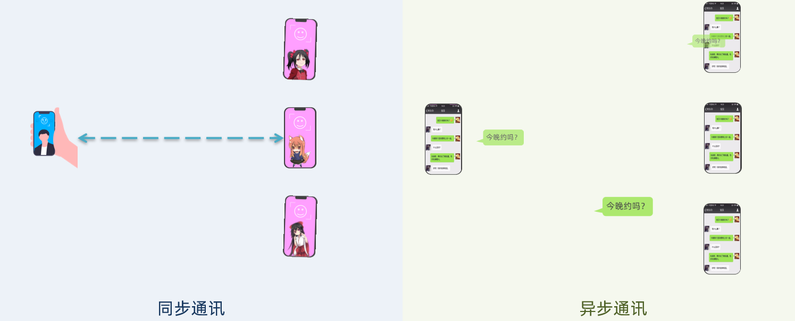
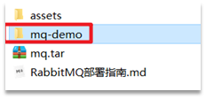

# RabbitMQ


# 1.初识MQ

## 1.1.同步和异步通讯

微服务间通讯有同步和异步两种方式：

同步通讯：就像打电话，需要实时响应。

异步通讯：就像发邮件，不需要马上回复。



两种方式各有优劣，打电话可以立即得到响应，但是你却不能跟多个人同时通话。发送邮件可以同时与多个人收发邮件，但是往往响应会有延迟。


### 1.1.1.同步通讯

我们之前学习的Feign调用就属于同步方式，虽然调用可以实时得到结果，但存在下面的问题：


总结：

同步调用的优点：

- 时效性较强，可以立即得到结果

同步调用的问题：

- 耦合度高
- 性能和吞吐能力下降
- 有额外的资源消耗
- 有级联失败问题


### 1.1.2.异步通讯

异步调用则可以避免上述问题：


我们以购买商品为例，用户支付后需要调用订单服务完成订单状态修改，调用物流服务，从仓库分配响应的库存并准备发货。

在事件模式中，支付服务是事件发布者（publisher），在支付完成后只需要发布一个支付成功的事件（event），事件中带上订单id。

订单服务和物流服务是事件订阅者（Consumer），订阅支付成功的事件，监听到事件后完成自己业务即可。


为了解除事件发布者与订阅者之间的耦合，两者并不是直接通信，而是有一个中间人（Broker）。发布者发布事件到Broker，不关心谁来订阅事件。订阅者从Broker订阅事件，不关心谁发来的消息。


Broker 是一个像数据总线一样的东西，所有的服务要接收数据和发送数据都发到这个总线上，这个总线就像协议一样，让服务间的通讯变得标准和可控。


好处：

- 吞吐量提升：无需等待订阅者处理完成，响应更快速

- 故障隔离：服务没有直接调用，不存在级联失败问题
- 调用间没有阻塞，不会造成无效的资源占用
- 耦合度极低，每个服务都可以灵活插拔，可替换
- 流量削峰：不管发布事件的流量波动多大，都由Broker接收，订阅者可以按照自己的速度去处理事件


缺点：

- 架构复杂了，业务没有明显的流程线，不好管理
- 需要依赖于Broker的可靠、安全、性能


好在现在开源软件或云平台上 Broker 的软件是非常成熟的，比较常见的一种就是我们今天要学习的MQ技术。


## 1.2.技术对比：

MQ，中文是消息队列（MessageQueue），字面来看就是存放消息的队列。也就是事件驱动架构中的Broker。

比较常见的MQ实现：

- ActiveMQ
- RabbitMQ
- RocketMQ
- Kafka


几种常见MQ的对比：

|            | **RabbitMQ**            | **ActiveMQ**                   | **RocketMQ** | **Kafka**  |
| ---------- | ----------------------- | ------------------------------ | ------------ | ---------- |
| 公司/社区  | Rabbit                  | Apache                         | 阿里         | Apache     |
| 开发语言   | Erlang                  | Java                           | Java         | Scala&Java |
| 协议支持   | AMQP，XMPP，SMTP，STOMP | OpenWire,STOMP，REST,XMPP,AMQP | 自定义协议   | 自定义协议 |
| 可用性     | 高                      | 一般                           | 高           | 高         |
| 单机吞吐量 | 一般                    | 差                             | 高           | 非常高     |
| 消息延迟   | 微秒级                  | 毫秒级                         | 毫秒级       | 毫秒以内   |
| 消息可靠性 | 高                      | 一般                           | 高           | 一般       |

追求可用性：Kafka、 RocketMQ 、RabbitMQ

追求可靠性：RabbitMQ、RocketMQ

追求吞吐能力：RocketMQ、Kafka

追求消息低延迟：RabbitMQ、Kafka


# 2.快速入门

## 2.0.RabbitMQ部署指南


### 1.单机部署

我们在Centos7虚拟机中使用Docker来安装。

#### 1.1.下载镜像

方式一：在线拉取

``` sh
docker pull rabbitmq:3-management
```


方式二：从本地加载

下载镜像包：

```
mq.tar
```

上传到虚拟机中后，使用命令加载镜像即可：

```sh
docker load -i mq.tar
```


#### 1.2.安装MQ

执行下面的命令来运行MQ容器：

```sh
docker run \
 -e RABBITMQ_DEFAULT_USER=root \
 -e RABBITMQ_DEFAULT_PASS=123456 \
 --name mq \
 --hostname mq1 \
 -p 15672:15672 \
 -p 5672:5672 \
 -d \
 rabbitmq:3-management
```


### 2.集群部署

接下来，我们看看如何安装RabbitMQ的集群。

#### 2.1.集群分类

在RabbitMQ的官方文档中，讲述了两种集群的配置方式：

- 普通模式：普通模式集群不进行数据同步，每个MQ都有自己的队列、数据信息（其它元数据信息如交换机等会同步）。例如我们有2个MQ：mq1，和mq2，如果你的消息在mq1，而你连接到了mq2，那么mq2会去mq1拉取消息，然后返回给你。如果mq1宕机，消息就会丢失。
- 镜像模式：与普通模式不同，队列会在各个mq的镜像节点之间同步，因此你连接到任何一个镜像节点，均可获取到消息。而且如果一个节点宕机，并不会导致数据丢失。不过，这种方式增加了数据同步的带宽消耗。


#### 2.2集群部署


##### 2.2.1设置网络

首先，我们需要让3台MQ互相知道对方的存在。

分别在3台机器中，设置 /etc/hosts文件，添加如下内容：

```
192.168.150.101 rabbitmq1
192.168.150.102 rabbitmq2
192.168.150.103 rabbitmq3
```

并在**每台**机器上测试，是否可以ping通对方：

```sh
ping rabbitmq1
ping rabbitmq2
ping rabbitmq3
```

##### 2.2.2安装erlang环境
在**每台**机器上安装erlang环境：

```sh
yum install erlang
```


##### 2.2.3安装RabbitMQ
在**每台**机器上安装RabbitMQ：

```sh
yum -y install rabbitmq-server
```


##### 2.2.4配置账号
安装启动后其实还*不能在其它机器访问*，rabbitmq 默认的 guest 账号只能在本地机器访问， 如果想在其它机器访问必须配置其它账号

-   配置管理员账号：
```sh
# 可以创建管理员用户，负责整个 MQ 的运维
rabbitmqctl add_user admin admin

# 赋予其 administrator 角色
rabbitmqctl set_user_tags admin administrator

# 创建 RabbitMQ 监控用户，负责整个 MQ 的监控
rabbitmqctl add_user  user_monitoring  passwd_monitor  # 创建用户并设置密码
rabbitmqctl set_user_tags user_monitoring monitoring   # 赋予其 monitoring角色

# 创建某个项目的专用用户，只能访问项目自己的 virtual hosts
rabbitmqctl set_user_tags user_monitoring management

# 创建和赋角色完成后查看并确认
rabbitmqctl list_users  
```


##### 2.2.5启动RabbitMQ内置web插件
启动RabbitMQ内置web插件，管理RabbitMQ账号等信息。

在**每台**机器上开启：

```sh
rabbitmq-plugins enable rabbitmq_management
```

> 访问：http://ip:15672


##### 2.2.6用户权限VirtualHost
- 像 mysql 有数据库的概念并且可以指定用户对库和表等操作的权限。那 RabbitMQ 呢？
- RabbitMQ 也有类似的权限管理。在 RabbitMQ 中可以虚拟消息服务器 VirtualHost，每个 VirtualHost 相当月一个相对独立的 RabbitMQ 服务器，每个 VirtualHost 之间是相互隔离的。exchange、queue、message 不能互通。

在 RabbitMQ 中无法通过 AMQP 创建 VirtualHost，可以通过以下命令来创建：

```sh
rabbitmqctl add_vhost [vhostname]
```

-   通常在权限管理中主要包含三步：
	- 新建用户
			`rabbitmqctl add_user superrd superrd`
			
	- 配置权限
			`set_permissions [-p <vhostpath>] <user> <conf> <write> <read>`
			eg: 
			`rabbitmqctl set_permissions -p / admin '.*' '.*' '.*'`
			其中，.* 的位置分别用正则表达式来匹配特定的资源，如:
			`'^(amq.gen.*|amq.default)$'`
			可以匹配 server 生成的和默认的 exchange，’^$’不匹配任何资源

		- exchange 和 queue 的 declare 与 delete 分别需要 exchange 和 queue 上的配置权限
		- exchange 的 bind 与 unbind 需要 exchange 的读写权限
		- queue 的 bind 与 unbind 需要 queue 写权限 exchange 的读权限 发消息 (publish) 需 exchange 的写权限
		- 获取或清除 (get、consume、purge) 消息需 queue 的读权限
		- 示例：我们赋予 superrd 在“/”下面的全部资源的配置和读写权限。
			`rabbitmqctl set_permissions -p / superrd ".*" ".*" ".*"`
		- 注意”/”代表 virtual host 为“/”这个“/”和 linux 里的根目录是有区别的并不是 virtual host 为“/”可以访问所以的 virtual host，把这个“/”理解成字符串就行。
		- 需要注意的是 RabbitMQ 会缓存每个 connection 或 channel 的权限验证结果、因此权限发生变化后需要重连才能生效。
		
	- 查看权限
			 `rabbitmqctl list_user_permissions admin`
			 `rabbitmqctl list_permissions -p /`
			 
	- 配置角色
			`rabbitmqctl set_user_tags [user] [role]`
			
		- RabbitMQ 中的角色分为如下五类：none、management、policymaker、monitoring、administrator
		
		- none 不能访问 management plugin
		- management 用户可以通过 AMQP 做的任何事外加： 列出自己可以通过 AMQP 登入的 virtual hosts 查看自己的 virtual hosts 中的 queues, exchanges 和 bindings 查看和关闭自己的 channels 和 connections 查看有关自己的 virtual hosts 的“全局”的统计信息，包含其他用户在这些 virtual hosts 中的活动。
		- policymaker management 可以做的任何事外加： 查看、创建和删除自己的 virtual hosts 所属的 policies 和 parameters
		- monitoring management 可以做的任何事外加： 列出所有 virtual hosts，包括他们不能登录的 virtual hosts 查看其他用户的 connections 和 channels 查看节点级别的数据如 clustering 和 memory 使用情况 查看真正的关于所有 virtual hosts 的全局的统计信息
		- administrator policymaker 和 monitoring 可以做的任何事外加: 创建和删除 virtual hosts 查看、创建和删除 users 查看创建和删除 permissions 关闭其他用户的 connections
		- 如下示例将 superrd 设置成 administrator 角色。
			`rabbitmqctl set_user_tags superrd administrator`

#### 2.3.普通模式集群
在上述的 3 台机器上安装 rabbitmq 完成之后，你可以看到你的机器中有如下 1 个文件。路径在 $HOME 中或者在 /var/lib/rabbitmq 中，文件名称为.erlang.cookie, 他是一个隐藏文件。那么这文件存储的内容是什么，是做什么用的呢？

RabbitMQ 的集群是依赖 erlang 集群，而 erlang 集群是通过这个 cookie 进行通信认证的，因此我们做集群的第一步就是干 cookie。

##### 2.3.1配置erlang.cookie
统一 erlang.cookie 文件中 cookie 值：

-   必须使集群中也就是rabbitmq2，rabbitmq3这两台机器的.erlang.cookie 文件中 cookie 值一致，且权限为 owner 只读。
```sh
# 复制 rabbitmq1 中 /var/lib/rabbitmq/.erlang.cookie 的内容到 rabbitmq2 rabbitmq2 相同的内容
[root@rabbitmq2 ~]# chmod 600 /var/lib/rabbitmq/.erlang.cookie
```

##### 2.3.2查看集群状态
-   查看节点状态
```sh
[root@rabbitmq1 rabbitmq]#  rabbitmqctl status
Status of node rabbit@rabbitmq1
[{pid,17572},
 {running_applications,
     [{rabbitmq_management,"RabbitMQ Management Console","3.6.15"},
      {rabbitmq_web_dispatch,"RabbitMQ Web Dispatcher","3.6.15"},
      {rabbitmq_management_agent,"RabbitMQ Management Agent","3.6.15"},
      {rabbit,"RabbitMQ","3.6.15"},
      {amqp_client,"RabbitMQ AMQP Client","3.6.15"},
      {rabbit_common,
          "Modules shared by rabbitmq-server and rabbitmq-erlang-client",
          "3.6.15"},
      {recon,"Diagnostic tools for production use","2.3.2"},
      {os_mon,"CPO  CXC 138 46","2.2.14"},
      {cowboy,"Small, fast, modular HTTP server.","1.0.4"},
      {ranch,"Socket acceptor pool for TCP protocols.","1.3.2"},
      {ssl,"Erlang/OTP SSL application","5.3.3"},
      {public_key,"Public key infrastructure","0.21"},
      {cowlib,"Support library for manipulating Web protocols.","1.0.2"},
      {crypto,"CRYPTO version 2","3.2"},
      {inets,"INETS  CXC 138 49","5.9.8"},
      {mnesia,"MNESIA  CXC 138 12","4.11"},
      {compiler,"ERTS  CXC 138 10","4.9.4"},
      {xmerl,"XML parser","1.3.6"},
      {syntax_tools,"Syntax tools","1.6.13"},
      {asn1,"The Erlang ASN1 compiler version 2.0.4","2.0.4"},
      {sasl,"SASL  CXC 138 11","2.3.4"},
      {stdlib,"ERTS  CXC 138 10","1.19.4"},
      {kernel,"ERTS  CXC 138 10","2.16.4"}]},
 {os,{unix,linux}},
 {erlang_version,
     "Erlang R16B03-1 (erts-5.10.4) [source] [64-bit] [smp:2:2] [async-threads:64] [hipe] [kernel-poll:true]\n"},
 {memory,
     [{connection_readers,0},
      {connection_writers,0},
      {connection_channels,0},
      {connection_other,2800},
      {queue_procs,2800},
      {queue_slave_procs,0},
      {plugins,1471200},
      {other_proc,23282232},
      {metrics,142320},
      {mgmt_db,526352},
      {mnesia,84160},
      {other_ets,2372704},
      {binary,890656},
      {msg_index,40536},
      {code,27114499},
      {atom,992409},
      {other_system,22458876},
      {allocated_unused,9790936},
      {reserved_unallocated,2389504},
      {total,91561984}]},
 {alarms,[]},
 {listeners,[{clustering,25672,"::"},{amqp,5672,"::"},{http,15672,"::"}]},
 {vm_memory_calculation_strategy,rss},
 {vm_memory_high_watermark,0.4},
 {vm_memory_limit,1589890252},
 {disk_free_limit,50000000},
 {disk_free,33908043776},
 {file_descriptors,
     [{total_limit,204700},
      {total_used,2},
      {sockets_limit,184228},
      {sockets_used,0}]},
 {processes,[{limit,1048576},{used,330}]},
 {run_queue,0},
 {uptime,2934},
 {kernel,{net_ticktime,60}}]
```

-   查看集群状态
```sh
[root@rabbitmq1 rabbitmq]# rabbitmqctl cluster_status
Cluster status of node rabbit@rabbitmq1
[{nodes,[{disc,[rabbit@rabbitmq1]},{ram,[rabbit@rabbitmq3,rabbit@rabbitmq2]}]},
 {running_nodes,[rabbit@rabbitmq3,rabbit@rabbitmq2,rabbit@rabbitmq1]},
 {cluster_name,<<"rabbit_cluster">>},
 {partitions,[]},
 {alarms,[{rabbit@rabbitmq3,[]},{rabbit@rabbitmq2,[]},{rabbit@rabbitmq1,[]}]}]
```


##### 2.3.3RabbitMQ集群添加节点

重启 rabbitmq1机器中 rabbitmq 的服务 在 rabbitmq2，rabbitmq3 分别执行:
```sh
[root@rabbitmq2 ~]# rabbitmqctl stop_app
[root@rabbitmq2 ~]# rabbitmqctl join_cluster --ram rabbit@rabbitmq1
[root@rabbitmq2 ~]# rabbitmqctl start_app
[root@rabbitmq2 ~]# rabbitmq-plugins enable rabbitmq_management
[root@rabbitmq2 ~]# systemctl restart rabbitmq-server.service 
```


##### 2.3.4网页管理查看nodes
打开网页管理页面查看 nodes


#### 2.4镜像模式
镜像高可用模式集群

- 参考文档：http://www.rabbitmq.com/ha.html

> 上面已经完成RabbitMQ默认集群模式，但并不保证队列的高可用性，尽管交换机、绑定这些可以复制到集群里的任何一个节点，但是队列内容不会复制。虽然该模式解决一项目组节点压力，但队列节点宕机直接导致该队列无法应用，只能等待重启，所以要想在队列节点宕机或故障也能正常应用，就要复制队列内容到集群里的每个节点，必须要创建镜像队列。
>
> 镜像队列是基于普通的集群模式的，然后再添加一些策略，所以你还是得先配置普通集群，然后才能设置镜像队列。

- 首先镜像模式要依赖 policy 模块，这个模块是做什么用的呢？
- policy 中文来说是政策，策略的意思就是要设置那些exchanges或者queue的数据需要如何复制，同步。

**设置的镜像队列可以通过开启的网页的管理端Admin->Policies，也可以通过命令。**

##### 2.4.1通过网页开启镜像模式
网页的管理端Admin->Policies


##### 2.4.2通过命令开启镜像模式
```sh
[root@rabbitmq1 ~]# rabbitmqctl set_policy ha-all "^" '{"ha-mode":"all"}'
```

- ha-all：为策略名称。
- "^" 为匹配符，只有一个代表匹配所有，^qfedu为匹配名称为qfedu的exchanges或者queue。
- ha-mode：为匹配类型，他分为3种模式：
- 
	- all：所有（所有的 queue），
	- exctly-部分（需配置ha-params参数，此参数为int类型, 比如3，众多集群中的随机3台机器），
	- nodes-指定（需配置ha-params参数，此参数为数组类型比如[“rabbit@F”,“rabbit@G”]这样指定为F与G这2台机器。）。


### 3.负载均衡

#### 部署架构
RabbitMQ这款消息队列中间件产品本身是基于Erlang编写，Erlang语言天生具备分布式特性（通过同步Erlang集群各节点的magic cookie来实现）。因此，RabbitMQ天然支持Clustering。这使得RabbitMQ本身不需要像ActiveMQ、Kafka那样通过ZooKeeper分别来实现HA方案和保存集群的元数据。集群是保证可靠性的一种方式，同时可以通过水平扩展以达到增加消息吞吐量能力的目的。


#### 3.1.安装HAProxy

```shell
#下载依赖包
yum install gcc vim wget

#上传haproxy源码包
#解压
tar -zxvf haproxy-1.6.5.tar.gz -C /usr/local

#进入目录、进行编译、安装
cd /usr/local/haproxy-1.6.5
make TARGET=linux31 PREFIX=/usr/local/haproxy
make install PREFIX=/usr/local/haproxy
mkdir /etc/haproxy

#赋权
groupadd -r -g 149 haproxy
useradd -g haproxy -r -s /sbin/nologin -u 149 haproxy

#创建haproxy配置文件
mkdir /etc/haproxy
vim /etc/haproxy/haproxy.cfg
```


#### 3.2.配置HAProxy

配置文件路径：/etc/haproxy/haproxy.cfg

E.g.

```cfg
#logging options
global
	log 127.0.0.1 local0 info
	maxconn 5120
	chroot /usr/local/haproxy
	uid 99
	gid 99
	daemon
	quiet
	nbproc 20
	pidfile /var/run/haproxy.pid

defaults
	log global
	
	mode tcp

	option tcplog
	option dontlognull
	retries 3
	option redispatch
	maxconn 2000
	contimeout 5s
   
     clitimeout 60s

     srvtimeout 15s	
#front-end IP for consumers and producters

listen rabbitmq_cluster
	bind 0.0.0.0:5672
	
	mode tcp
	#balance url_param userid
	#balance url_param session_id check_post 64
	#balance hdr(User-Agent)
	#balance hdr(host)
	#balance hdr(Host) use_domain_only
	#balance rdp-cookie
	#balance leastconn
	#balance source //ip
	
	balance roundrobin
	
        server node1 127.0.0.1:5673 check inter 5000 rise 2 fall 2
        server node2 127.0.0.1:5674 check inter 5000 rise 2 fall 2

listen stats
	bind 172.16.98.133:8100
	mode http
	option httplog
	stats enable
	stats uri /rabbitmq-stats
	stats refresh 5s
```

启动HAproxy负载

```shell
/usr/local/haproxy/sbin/haproxy -f /etc/haproxy/haproxy.cfg
#查看haproxy进程状态
ps -ef | grep haproxy

#访问如下地址对mq节点进行监控
http://172.16.98.133:8100/rabbitmq-stats
```

代码中访问mq集群地址，则变为访问haproxy地址:5672


## 2.1.RabbitMQ基本结构


RabbitMQ中的一些角色：

- publisher：生产者
- consumer：消费者
- exchange个：交换机，负责消息路由
- queue：队列，存储消息
- virtualHost：虚拟主机，隔离不同租户的exchange、queue、消息的隔离


## 2.2.RabbitMQ消息模型

RabbitMQ官方提供了5个不同的Demo示例，对应了不同的消息模型：


## 2.3.导入Demo工程

课前资料提供了一个Demo工程，mq-demo: 




导入后可以看到结构如下：


包括三部分：

- mq-demo：父工程，管理项目依赖
- publisher：消息的发送者
- consumer：消息的消费者


## 2.4.入门案例

简单队列模式的模型图：

 

官方的HelloWorld是基于最基础的消息队列模型来实现的，只包括三个角色：

- publisher：消息发布者，将消息发送到队列queue
- queue：消息队列，负责接受并缓存消息
- consumer：订阅队列，处理队列中的消息


### 2.4.1.publisher实现

思路：

- 建立连接
- 创建Channel
- 声明队列
- 发送消息
- 关闭连接和channel


代码实现：

```java
package cn.itcast.mq.helloworld;

import com.rabbitmq.client.Channel;
import com.rabbitmq.client.Connection;
import com.rabbitmq.client.ConnectionFactory;
import org.junit.Test;

import java.io.IOException;
import java.util.concurrent.TimeoutException;

public class PublisherTest {
    @Test
    public void testSendMessage() throws IOException, TimeoutException {
        // 1.建立连接
        ConnectionFactory factory = new ConnectionFactory();
        // 1.1.设置连接参数，分别是：主机名、端口号、vhost、用户名、密码
        factory.setHost("192.168.150.101");
        factory.setPort(5672);
        factory.setVirtualHost("/");
        factory.setUsername("itcast");
        factory.setPassword("123321");
        // 1.2.建立连接
        Connection connection = factory.newConnection();

        // 2.创建通道Channel
        Channel channel = connection.createChannel();

        // 3.创建队列
        String queueName = "simple.queue";
        channel.queueDeclare(queueName, false, false, false, null);

        // 4.发送消息
        String message = "hello, rabbitmq!";
        channel.basicPublish("", queueName, null, message.getBytes());
        System.out.println("发送消息成功：【" + message + "】");

        // 5.关闭通道和连接
        channel.close();
        connection.close();

    }
}
```


### 2.4.2.consumer实现

代码思路：

- 建立连接
- 创建Channel
- 声明队列
- 订阅消息


代码实现：

```java
package cn.itcast.mq.helloworld;

import com.rabbitmq.client.*;

import java.io.IOException;
import java.util.concurrent.TimeoutException;

public class ConsumerTest {

    public static void main(String[] args) throws IOException, TimeoutException {
        // 1.建立连接
        ConnectionFactory factory = new ConnectionFactory();
        // 1.1.设置连接参数，分别是：主机名、端口号、vhost、用户名、密码
        factory.setHost("192.168.150.101");
        factory.setPort(5672);
        factory.setVirtualHost("/");
        factory.setUsername("itcast");
        factory.setPassword("123321");
        // 1.2.建立连接
        Connection connection = factory.newConnection();

        // 2.创建通道Channel
        Channel channel = connection.createChannel();

        // 3.创建队列
        String queueName = "simple.queue";
        channel.queueDeclare(queueName, false, false, false, null);

        // 4.订阅消息
        channel.basicConsume(queueName, true, new DefaultConsumer(channel){
            @Override
            public void handleDelivery(String consumerTag, Envelope envelope,
                                       AMQP.BasicProperties properties, byte[] body) throws IOException {
                // 5.处理消息
                String message = new String(body);
                System.out.println("接收到消息：【" + message + "】");
            }
        });
        System.out.println("等待接收消息。。。。");
    }
}
```


## 2.5.总结

基本消息队列的消息发送流程：

1. 建立connection

2. 创建channel

3. 利用channel声明队列

4. 利用channel向队列发送消息

基本消息队列的消息接收流程：

1. 建立connection

2. 创建channel

3. 利用channel声明队列

4. 定义consumer的消费行为handleDelivery()

5. 利用channel将消费者与队列绑定


# 3.SpringAMQP

SpringAMQP是基于RabbitMQ封装的一套模板，并且还利用SpringBoot对其实现了自动装配，使用起来非常方便。

SpringAmqp的官方地址：https://spring.io/projects/spring-amqp


SpringAMQP提供了三个功能：

- 自动声明队列、交换机及其绑定关系
- 基于注解的监听器模式，异步接收消息
- 封装了RabbitTemplate工具，用于发送消息 


## 3.1.Basic Queue 简单队列模型

在父工程mq-demo中引入依赖

```xml
<!--AMQP依赖，包含RabbitMQ-->
<dependency>
    <groupId>org.springframework.boot</groupId>
    <artifactId>spring-boot-starter-amqp</artifactId>
</dependency>
```


### 3.1.1.消息发送

首先配置MQ地址，在publisher服务的application.yml中添加配置：

```yaml
spring:
  rabbitmq:
    host: 192.168.150.101 # 主机名
    port: 5672 # 端口
    virtual-host: / # 虚拟主机
    username: itcast # 用户名
    password: 123321 # 密码
```


然后在publisher服务中编写测试类SpringAmqpTest，并利用RabbitTemplate实现消息发送：

```java
package cn.itcast.mq.spring;

import org.junit.Test;
import org.junit.runner.RunWith;
import org.springframework.amqp.rabbit.core.RabbitTemplate;
import org.springframework.beans.factory.annotation.Autowired;
import org.springframework.boot.test.context.SpringBootTest;
import org.springframework.test.context.junit4.SpringRunner;

@RunWith(SpringRunner.class)
@SpringBootTest
public class SpringAmqpTest {

    @Autowired
    private RabbitTemplate rabbitTemplate;

    @Test
    public void testSimpleQueue() {
        // 队列名称
        String queueName = "simple.queue";
        // 消息
        String message = "hello, spring amqp!";
        // 发送消息
        rabbitTemplate.convertAndSend(queueName, message);
    }
}
```


### 3.1.2.消息接收

首先配置MQ地址，在consumer服务的application.yml中添加配置：

```yaml
spring:
  rabbitmq:
    host: 192.168.150.101 # 主机名
    port: 5672 # 端口
    virtual-host: / # 虚拟主机
    username: itcast # 用户名
    password: 123321 # 密码
```


然后在consumer服务的`cn.itcast.mq.listener`包中新建一个类SpringRabbitListener，代码如下：

```java
package cn.itcast.mq.listener;

import org.springframework.amqp.rabbit.annotation.RabbitListener;
import org.springframework.stereotype.Component;

@Component
public class SpringRabbitListener {

    @RabbitListener(queues = "simple.queue")
    public void listenSimpleQueueMessage(String msg) throws InterruptedException {
        System.out.println("spring 消费者接收到消息：【" + msg + "】");
    }
}
```


### 3.1.3.测试

启动consumer服务，然后在publisher服务中运行测试代码，发送MQ消息


## 3.2.WorkQueue

Work queues，也被称为（Task queues），任务模型。简单来说就是**让多个消费者绑定到一个队列，共同消费队列中的消息**。


当消息处理比较耗时的时候，可能生产消息的速度会远远大于消息的消费速度。长此以往，消息就会堆积越来越多，无法及时处理。

此时就可以使用work 模型，多个消费者共同处理消息处理，速度就能大大提高了。


### 3.2.1.消息发送

这次我们循环发送，模拟大量消息堆积现象。

在publisher服务中的SpringAmqpTest类中添加一个测试方法：

```java
/**
     * workQueue
     * 向队列中不停发送消息，模拟消息堆积。
     */
@Test
public void testWorkQueue() throws InterruptedException {
    // 队列名称
    String queueName = "simple.queue";
    // 消息
    String message = "hello, message_";
    for (int i = 0; i < 50; i++) {
        // 发送消息
        rabbitTemplate.convertAndSend(queueName, message + i);
        Thread.sleep(20);
    }
}
```


### 3.2.2.消息接收

要模拟多个消费者绑定同一个队列，我们在consumer服务的SpringRabbitListener中添加2个新的方法：

```java
@RabbitListener(queues = "simple.queue")
public void listenWorkQueue1(String msg) throws InterruptedException {
    System.out.println("消费者1接收到消息：【" + msg + "】" + LocalTime.now());
    Thread.sleep(20);
}

@RabbitListener(queues = "simple.queue")
public void listenWorkQueue2(String msg) throws InterruptedException {
    System.err.println("消费者2........接收到消息：【" + msg + "】" + LocalTime.now());
    Thread.sleep(200);
}
```

注意到这个消费者sleep了1000秒，模拟任务耗时。


### 3.2.3.测试

启动ConsumerApplication后，在执行publisher服务中刚刚编写的发送测试方法testWorkQueue。

可以看到消费者1很快完成了自己的25条消息。消费者2却在缓慢的处理自己的25条消息。


也就是说消息是平均分配给每个消费者，并没有考虑到消费者的处理能力。这样显然是有问题的。


### 3.2.4.设置预取消息上限

鉴于测试结果中：消费者2却在缓慢的处理自己的25条消息。贪多嚼不烂嘴。


在spring中有一个简单的配置，可以解决这个问题。我们修改consumer服务的application.yml文件，添加配置：

```yaml
spring:
  rabbitmq:
    listener:
      simple:
        prefetch: 1 # 每次只能获取一条消息，处理完成才能获取下一个消息
```


### 3.2.5.总结

Work模型的使用：

- 多个消费者绑定到一个队列，同一条消息只会被一个消费者处理
- 通过设置prefetch来控制消费者预取的消息数量


## 3.3.发布/订阅

发布订阅的模型如图：


可以看到，在订阅模型中，多了一个exchange角色，而且过程略有变化：

- Publisher：生产者，也就是要发送消息的程序，但是不再发送到队列中，而是发给X（交换机）
- Exchange：交换机，图中的X。一方面，接收生产者发送的消息。另一方面，知道如何处理消息，例如递交给某个特别队列、递交给所有队列、或是将消息丢弃。到底如何操作，取决于Exchange的类型。Exchange有以下3种类型：
  - Fanout：广播，将消息交给所有绑定到交换机的队列
  - Direct：定向，把消息交给符合指定routing key 的队列
  - Topic：通配符，把消息交给符合routing pattern（路由模式） 的队列
- Consumer：消费者，与以前一样，订阅队列，没有变化
- Queue：消息队列也与以前一样，接收消息、缓存消息。


**Exchange（交换机）只负责转发消息，不具备存储消息的能力**，因此如果没有任何队列与Exchange绑定，或者没有符合路由规则的队列，那么消息会丢失！


## 3.4.Fanout

Fanout，英文翻译是扇出，我觉得在MQ中叫广播更合适。


在广播模式下，消息发送流程是这样的：

- 1）  可以有多个队列
- 2）  每个队列都要绑定到Exchange（交换机）
- 3）  生产者发送的消息，只能发送到交换机，交换机来决定要发给哪个队列，生产者无法决定
- 4）  交换机把消息发送给绑定过的所有队列
- 5）  订阅队列的消费者都能拿到消息


我们的计划是这样的：

- 创建一个交换机 itcast.fanout，类型是Fanout
- 创建两个队列fanout.queue1和fanout.queue2，绑定到交换机itcast.fanout


### 3.4.1.声明队列和交换机

Spring提供了一个接口Exchange，来表示所有不同类型的交换机：


在consumer中创建一个类，声明队列和交换机：

```java
package cn.itcast.mq.config;

import org.springframework.amqp.core.Binding;
import org.springframework.amqp.core.BindingBuilder;
import org.springframework.amqp.core.FanoutExchange;
import org.springframework.amqp.core.Queue;
import org.springframework.context.annotation.Bean;
import org.springframework.context.annotation.Configuration;

@Configuration
public class FanoutConfig {
    /**
     * 声明交换机
     * @return Fanout类型交换机
     */
    @Bean
    public FanoutExchange fanoutExchange(){
        return new FanoutExchange("itcast.fanout");
    }

    /**
     * 第1个队列
     */
    @Bean
    public Queue fanoutQueue1(){
        return new Queue("fanout.queue1");
    }

    /**
     * 绑定队列和交换机
     */
    @Bean
    public Binding bindingQueue1(Queue fanoutQueue1, FanoutExchange fanoutExchange){
        return BindingBuilder.bind(fanoutQueue1).to(fanoutExchange);
    }

    /**
     * 第2个队列
     */
    @Bean
    public Queue fanoutQueue2(){
        return new Queue("fanout.queue2");
    }

    /**
     * 绑定队列和交换机
     */
    @Bean
    public Binding bindingQueue2(Queue fanoutQueue2, FanoutExchange fanoutExchange){
        return BindingBuilder.bind(fanoutQueue2).to(fanoutExchange);
    }
}
```


### 3.4.2.消息发送

在publisher服务的SpringAmqpTest类中添加测试方法：

```java
@Test
public void testFanoutExchange() {
    // 队列名称
    String exchangeName = "itcast.fanout";
    // 消息
    String message = "hello, everyone!";
    rabbitTemplate.convertAndSend(exchangeName, "", message);
}
```


### 3.4.3.消息接收

在consumer服务的SpringRabbitListener中添加两个方法，作为消费者：

```java
@RabbitListener(queues = "fanout.queue1")
public void listenFanoutQueue1(String msg) {
    System.out.println("消费者1接收到Fanout消息：【" + msg + "】");
}

@RabbitListener(queues = "fanout.queue2")
public void listenFanoutQueue2(String msg) {
    System.out.println("消费者2接收到Fanout消息：【" + msg + "】");
}
```


### 3.4.4.总结


交换机的作用是什么？

- 接收publisher发送的消息
- 将消息按照规则路由到与之绑定的队列
- 不能缓存消息，路由失败，消息丢失
- FanoutExchange的会将消息路由到每个绑定的队列

声明队列、交换机、绑定关系的Bean是什么？

- Queue
- FanoutExchange
- Binding


## 3.5.Direct

在Fanout模式中，一条消息，会被所有订阅的队列都消费。但是，在某些场景下，我们希望不同的消息被不同的队列消费。这时就要用到Direct类型的Exchange。


 在Direct模型下：

- 队列与交换机的绑定，不能是任意绑定了，而是要指定一个`RoutingKey`（路由key）
- 消息的发送方在 向 Exchange发送消息时，也必须指定消息的 `RoutingKey`。
- Exchange不再把消息交给每一个绑定的队列，而是根据消息的`Routing Key`进行判断，只有队列的`Routingkey`与消息的 `Routing key`完全一致，才会接收到消息


**案例需求如下**：

1. 利用@RabbitListener声明Exchange、Queue、RoutingKey

2. 在consumer服务中，编写两个消费者方法，分别监听direct.queue1和direct.queue2

3. 在publisher中编写测试方法，向itcast. direct发送消息


### 3.5.1.基于注解声明队列和交换机

基于@Bean的方式声明队列和交换机比较麻烦，Spring还提供了基于注解方式来声明。

在consumer的SpringRabbitListener中添加两个消费者，同时基于注解来声明队列和交换机：

```java
@RabbitListener(bindings = @QueueBinding(
    value = @Queue(name = "direct.queue1"),
    exchange = @Exchange(name = "itcast.direct", type = ExchangeTypes.DIRECT),
    key = {"red", "blue"}
))
public void listenDirectQueue1(String msg){
    System.out.println("消费者接收到direct.queue1的消息：【" + msg + "】");
}

@RabbitListener(bindings = @QueueBinding(
    value = @Queue(name = "direct.queue2"),
    exchange = @Exchange(name = "itcast.direct", type = ExchangeTypes.DIRECT),
    key = {"red", "yellow"}
))
public void listenDirectQueue2(String msg){
    System.out.println("消费者接收到direct.queue2的消息：【" + msg + "】");
}
```


### 3.5.2.消息发送

在publisher服务的SpringAmqpTest类中添加测试方法：

```java
@Test
public void testSendDirectExchange() {
    // 交换机名称
    String exchangeName = "itcast.direct";
    // 消息
    String message = "红色警报！日本乱排核废水，导致海洋生物变异，惊现哥斯拉！";
    // 发送消息
    rabbitTemplate.convertAndSend(exchangeName, "red", message);
}
```


### 3.5.3.总结

描述下Direct交换机与Fanout交换机的差异？

- Fanout交换机将消息路由给每一个与之绑定的队列
- Direct交换机根据RoutingKey判断路由给哪个队列
- 如果多个队列具有相同的RoutingKey，则与Fanout功能类似

基于@RabbitListener注解声明队列和交换机有哪些常见注解？

- @Queue
- @Exchange


## 3.6.Topic


### 3.6.1.说明

`Topic`类型的`Exchange`与`Direct`相比，都是可以根据`RoutingKey`把消息路由到不同的队列。只不过`Topic`类型`Exchange`可以让队列在绑定`Routing key` 的时候使用通配符！


`Routingkey` 一般都是有一个或多个单词组成，多个单词之间以”.”分割，例如： `item.insert`

 通配符规则：

`#`：匹配一个或多个词

`*`：匹配不多不少恰好1个词


举例：

`item.#`：能够匹配`item.spu.insert` 或者 `item.spu`

`item.*`：只能匹配`item.spu`

​     

图示：

 

解释：

- Queue1：绑定的是`china.#` ，因此凡是以 `china.`开头的`routing key` 都会被匹配到。包括china.news和china.weather
- Queue2：绑定的是`#.news` ，因此凡是以 `.news`结尾的 `routing key` 都会被匹配。包括china.news和japan.news


案例需求：

实现思路如下：

1. 并利用@RabbitListener声明Exchange、Queue、RoutingKey

2. 在consumer服务中，编写两个消费者方法，分别监听topic.queue1和topic.queue2

3. 在publisher中编写测试方法，向itcast. topic发送消息


### 3.6.2.消息发送

在publisher服务的SpringAmqpTest类中添加测试方法：

```java
/**
     * topicExchange
     */
@Test
public void testSendTopicExchange() {
    // 交换机名称
    String exchangeName = "itcast.topic";
    // 消息
    String message = "喜报！孙悟空大战哥斯拉，胜!";
    // 发送消息
    rabbitTemplate.convertAndSend(exchangeName, "china.news", message);
}
```


### 3.6.3.消息接收

在consumer服务的SpringRabbitListener中添加方法：

```java
@RabbitListener(bindings = @QueueBinding(
    value = @Queue(name = "topic.queue1"),
    exchange = @Exchange(name = "itcast.topic", type = ExchangeTypes.TOPIC),
    key = "china.#"
))
public void listenTopicQueue1(String msg){
    System.out.println("消费者接收到topic.queue1的消息：【" + msg + "】");
}

@RabbitListener(bindings = @QueueBinding(
    value = @Queue(name = "topic.queue2"),
    exchange = @Exchange(name = "itcast.topic", type = ExchangeTypes.TOPIC),
    key = "#.news"
))
public void listenTopicQueue2(String msg){
    System.out.println("消费者接收到topic.queue2的消息：【" + msg + "】");
}
```


### 3.6.4.总结

描述下Direct交换机与Topic交换机的差异？

- Topic交换机接收的消息RoutingKey必须是多个单词，以 `**.**` 分割
- Topic交换机与队列绑定时的bindingKey可以指定通配符
- `#`：代表0个或多个词
- `*`：代表1个词


## 3.7.消息转换器

之前说过，Spring会把你发送的消息序列化为字节发送给MQ，接收消息的时候，还会把字节反序列化为Java对象。


只不过，默认情况下Spring采用的序列化方式是JDK序列化。众所周知，JDK序列化存在下列问题：

- 数据体积过大
- 有安全漏洞
- 可读性差

我们来测试一下。


### 3.7.1.测试默认转换器


我们修改消息发送的代码，发送一个Map对象：

```java
@Test
public void testSendMap() throws InterruptedException {
    // 准备消息
    Map<String,Object> msg = new HashMap<>();
    msg.put("name", "Jack");
    msg.put("age", 21);
    // 发送消息
    rabbitTemplate.convertAndSend("simple.queue","", msg);
}
```


停止consumer服务


发送消息后查看控制台：


### 3.7.2.配置JSON转换器

显然，JDK序列化方式并不合适。我们希望消息体的体积更小、可读性更高，因此可以使用JSON方式来做序列化和反序列化。

在publisher和consumer两个服务中都引入依赖：

```xml
<dependency>
    <groupId>com.fasterxml.jackson.dataformat</groupId>
    <artifactId>jackson-dataformat-xml</artifactId>
    <version>2.9.10</version>
</dependency>
```

配置消息转换器。

在启动类中添加一个Bean即可：

```java
@Bean
public MessageConverter jsonMessageConverter(){
    return new Jackson2JsonMessageConverter();
}
```


