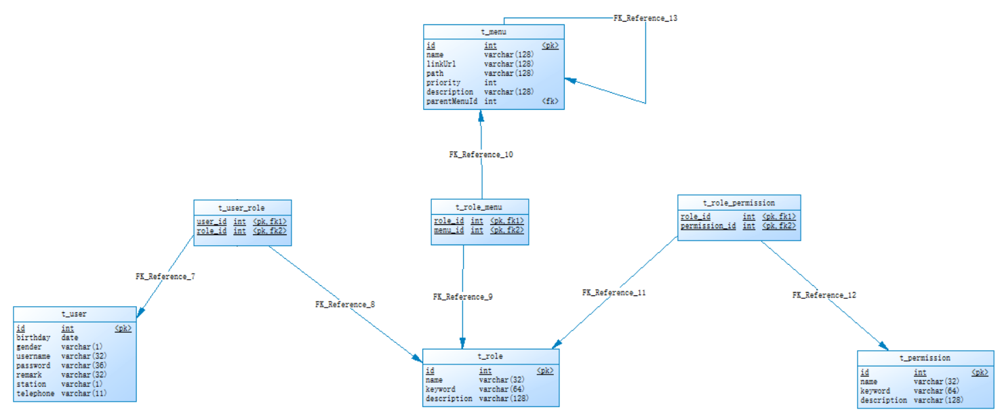

##  介绍
Spring Security是一个功能强大且高度可定制的身份验证和访问控制框架。它是保护基于spring的应用程序的事实上的标准。  

Spring Security是一个专注于为Java应用程序提供身份验证和授权的框架。与所有Spring项目一样，Spring Security的真正强大之处在于它可以很容易地扩展以满足定制需求。


## 示例
### 1.依赖
```xml
<dependency>
  <groupId>org.springframework.security</groupId>
  <artifactId>spring-security-web</artifactId>
  <version>${spring.security.version}</version>
</dependency>
<dependency>
  <groupId>org.springframework.security</groupId>
  <artifactId>spring-security-config</artifactId>
  <version>${spring.security.version}</version>
</dependency>
```

### 2.web.xml
```xml
<!--委派过滤器，用于整合其他框架-->
<filter>
  <!--整合spring security时，此过滤器的名称固定springSecurityFilterChain-->
  <filter-name>springSecurityFilterChain</filter-name>
  <filter-class>org.springframework.web.filter.DelegatingFilterProxy</filter-class>
</filter>
<filter-mapping>
  <filter-name>springSecurityFilterChain</filter-name>
  <url-pattern>/*</url-pattern>
</filter-mapping>
```

### 3.实现UserDetailService接口
- 按照Spring Security框架要求提供SpringSecurityUserService，并且实现UserDetailsService接口
```java
@Component
public class SpringSecurityUserService implements UserDetailsService{
    @Reference //注意：此处要通过dubbo远程调用用户服务
    private UserService userService;
  
    //根据用户名查询用户信息
    public UserDetails loadUserByUsername(String username) throws UsernameNotFoundException {
      	//远程调用用户服务，根据用户名查询用户信息
        com.itheima.pojo.User user = userService.findByUsername(username);
        
        if(user == null){
              //用户名不存在
              return null;
        }
        
        List<GrantedAuthority> list = new ArrayList<>();
        Set<Role> roles = user.getRoles();
        for(Role role : roles){
            //授予角色
            list.add(new SimpleGrantedAuthority(role.getKeyword()));
            Set<Permission> permissions = role.getPermissions();
            for(Permission permission : permissions){
              	//授权
                list.add(new SimpleGrantedAuthority(permission.getKeyword()));
            }
        }
        
        UserDetails userDetails = new User(username,user.getPassword(),list);
        return userDetails;
    }
}
```

- 创建UserService服务接口、服务实现类、Dao接口、Mapper映射文件等，查询用户角色和对应权限

	- 权限模块数据模型
	
		分析了认证和授权的概念，要实现最终的权限控制，需要有一套表结构支撑：
		- 用户表t_user、
		- 权限表t_permission、
		- 角色表t_role、
		- 菜单表t_menu、
		- 用户角色关系表t_user_role、
		- 角色权限关系表t_role_permission、
		- 角色菜单关系表t_role_menu。

		表之间关系如下图：
			

	- 认证过程
		只需要用户表就可以了，在用户登录时可以查询用户表t_user进行校验，判断用户输入的用户名和密码是否正确。

	- 授权过程
		用户必须完成认证之后才可以进行授权，首先可以根据用户查询其角色，再根据角色查询对应的菜单，这样就确定了用户能够看到哪些菜单。然后再根据用户的角色查询对应的权限，这样就确定了用户拥有哪些权限。所以授权过程会用到上面7张表。


### 4.配置spring-security.xml
```xml
<?xml version="1.0" encoding="UTF-8"?>
<beans xmlns="http://www.springframework.org/schema/beans"
       xmlns:xsi="http://www.w3.org/2001/XMLSchema-instance"
       xmlns:context="http://www.springframework.org/schema/context"
       xmlns:dubbo="http://code.alibabatech.com/schema/dubbo"
       xmlns:mvc="http://www.springframework.org/schema/mvc"
       xmlns:security="http://www.springframework.org/schema/security"
       xsi:schemaLocation="http://www.springframework.org/schema/beans
						http://www.springframework.org/schema/beans/spring-beans.xsd
						http://www.springframework.org/schema/mvc
						http://www.springframework.org/schema/mvc/spring-mvc.xsd
						http://code.alibabatech.com/schema/dubbo
						http://code.alibabatech.com/schema/dubbo/dubbo.xsd
						http://www.springframework.org/schema/context
						http://www.springframework.org/schema/context/spring-context.xsd
                          http://www.springframework.org/schema/security
                          http://www.springframework.org/schema/security/spring-security.xsd">

    <!--
        http：用于定义相关权限控制
        指定哪些资源不需要进行权限校验，可以使用通配符
    -->
    <security:http security="none" pattern="/js/**" />
    <security:http security="none" pattern="/css/**" />
    <security:http security="none" pattern="/img/**" />
    <security:http security="none" pattern="/plugins/**" />
  
    <!--
        http：用于定义相关权限控制
        auto-config：是否自动配置
                        设置为true时框架会提供默认的一些配置，例如提供默认的登录页面、登出处理等
                        设置为false时需要显示提供登录表单配置，否则会报错
        use-expressions：用于指定intercept-url中的access属性是否使用表达式
    -->
    <security:http auto-config="true" use-expressions="true">
        <security:headers>
            <!--设置在页面可以通过iframe访问受保护的页面，默认为不允许访问-->
            <security:frame-options policy="SAMEORIGIN"></security:frame-options>
        </security:headers>
        <!--
            intercept-url：定义一个拦截规则
            pattern：对哪些url进行权限控制
            access：在请求对应的URL时需要什么权限，默认配置时它应该是一个以逗号分隔的角色列表，
				  请求的用户只需拥有其中的一个角色就能成功访问对应的URL
            isAuthenticated()：已经经过认证（不是匿名用户）
        -->
        <security:intercept-url pattern="/pages/**"  access="isAuthenticated()" />
        <!--form-login：定义表单登录信息-->
        <security:form-login login-page="/login.html"
                             username-parameter="username"
                             password-parameter="password"
                             login-processing-url="/login.do"
                             default-target-url="/pages/main.html"
                             always-use-default-target="true"
                             authentication-failure-url="/login.html"
        />
        
        <!--
            csrf：对应CsrfFilter过滤器
            disabled：是否启用CsrfFilter过滤器，如果使用自定义登录页面需要关闭此项，
					否则登录操作会被禁用（403）
        -->
        <security:csrf disabled="true"></security:csrf>
    </security:http>

    <!--配置密码加密对象-->
    <bean id="passwordEncoder" 
          class="org.springframework.security.crypto.bcrypt.BCryptPasswordEncoder" />

    <!--认证管理器，用于处理认证操作-->
    <security:authentication-manager>
        <!--认证提供者，执行具体的认证逻辑-->
        <security:authentication-provider user-service-ref="springSecurityUserService">
            <!--指定密码加密策略-->
            <security:password-encoder ref="passwordEncoder" />
        </security:authentication-provider>
    </security:authentication-manager>

    <!--开启注解方式权限控制-->
    <security:global-method-security pre-post-annotations="enabled" />
</beans>
```

### 5.在Controller的方法加入权限控制注解
```java
@RestController
@RequestMapping("/checkitem")
public class CheckItemController {
    @Reference
    private CheckItemService checkItemService;

    //分页查询
    @PreAuthorize("hasAuthority('CHECKITEM_QUERY')")//权限校验
    @RequestMapping("/findPage")
    public PageResult findPage(@RequestBody QueryPageBean queryPageBean){
        PageResult pageResult = checkItemService.pageQuery(
                                    queryPageBean.getCurrentPage(), 
                                    queryPageBean.getPageSize(), 
                                    queryPageBean.getQueryString());
        return pageResult;
    }

    //删除
    @PreAuthorize("hasAuthority('CHECKITEM_DELETE')")//权限校验
    @RequestMapping("/delete")
    public Result delete(Integer id){
        try {
            checkItemService.delete(id);
        }catch (RuntimeException e){
            return new Result(false,e.getMessage());
        }catch (Exception e){
            return new Result(false, MessageConstant.DELETE_CHECKITEM_FAIL);
        }
        return new Result(true,MessageConstant.DELETE_CHECKITEM_SUCCESS);
    }

    //新增
    @PreAuthorize("hasAuthority('CHECKITEM_ADD')")//权限校验
    @RequestMapping("/add")
    public Result add(@RequestBody CheckItem checkItem){
        try {
            checkItemService.add(checkItem);
        }catch (Exception e){
            return new Result(false,MessageConstant.ADD_CHECKITEM_FAIL);
        }
        return new Result(true,MessageConstant.ADD_CHECKITEM_SUCCESS);
    }

    //编辑
    @PreAuthorize("hasRole('ROLE_ADMIN')")//角色校验
    @RequestMapping("/edit")
    public Result edit(@RequestBody CheckItem checkItem){
        try {
            checkItemService.edit(checkItem);
        }catch (Exception e){
            return new Result(false,MessageConstant.EDIT_CHECKITEM_FAIL);
        }
        return new Result(true,MessageConstant.EDIT_CHECKITEM_SUCCESS);
    }
}
```

